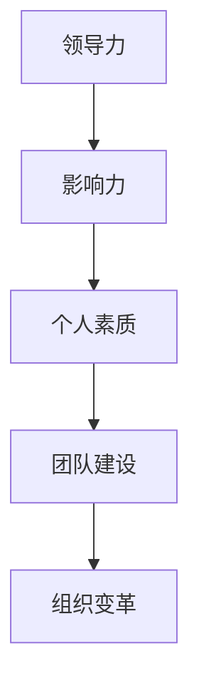
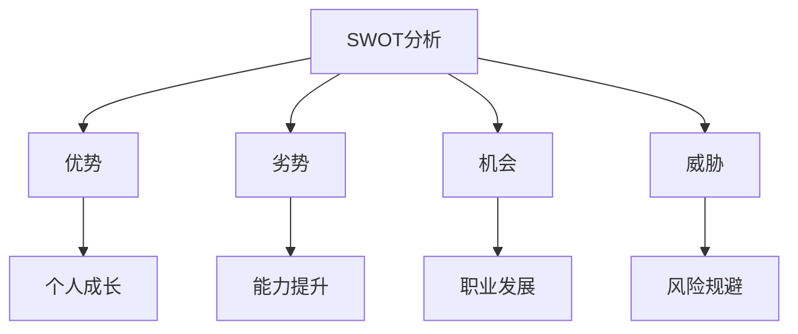
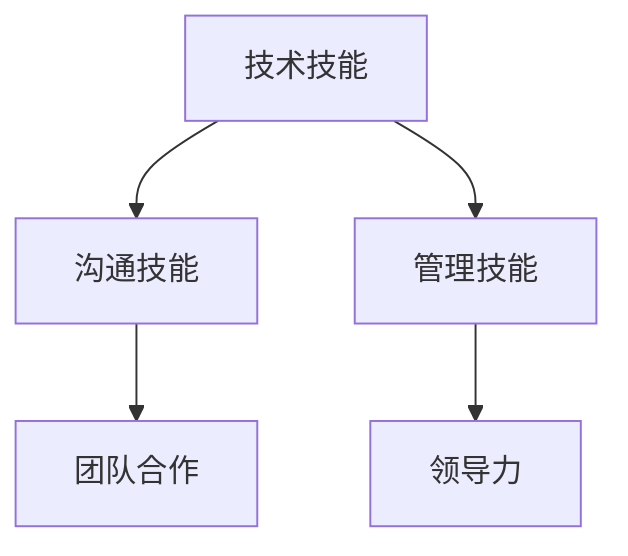
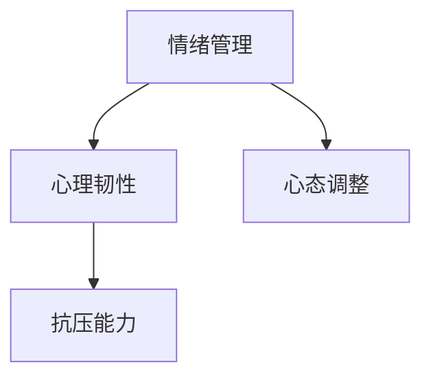
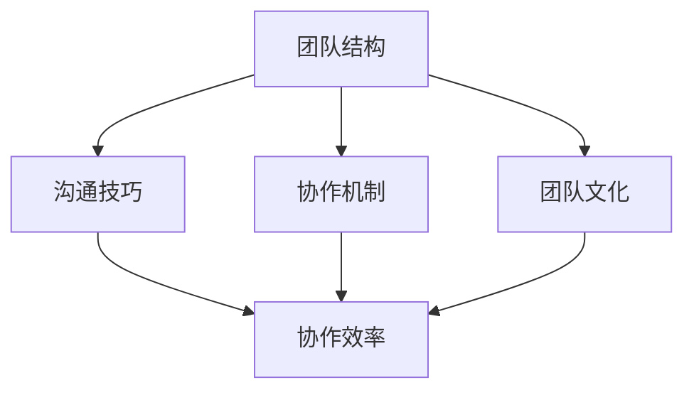
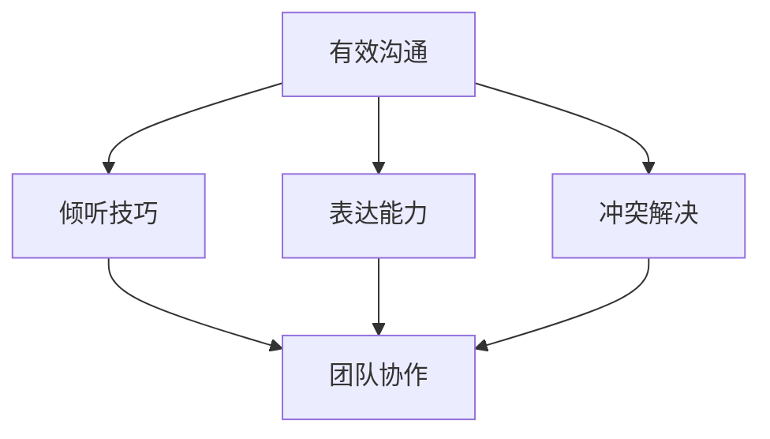
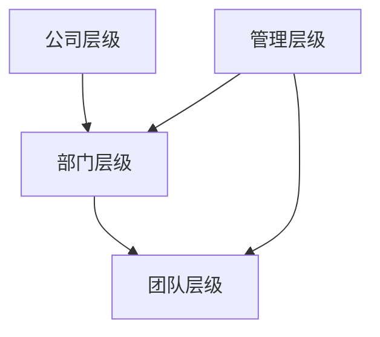
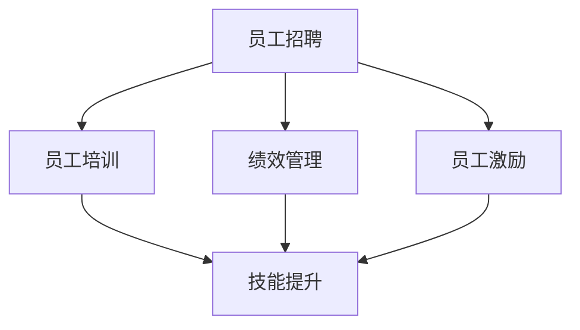
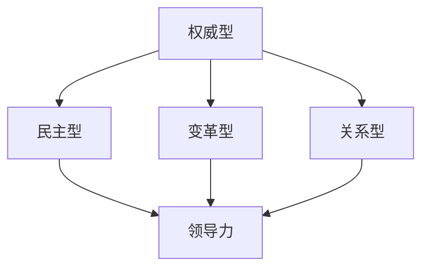
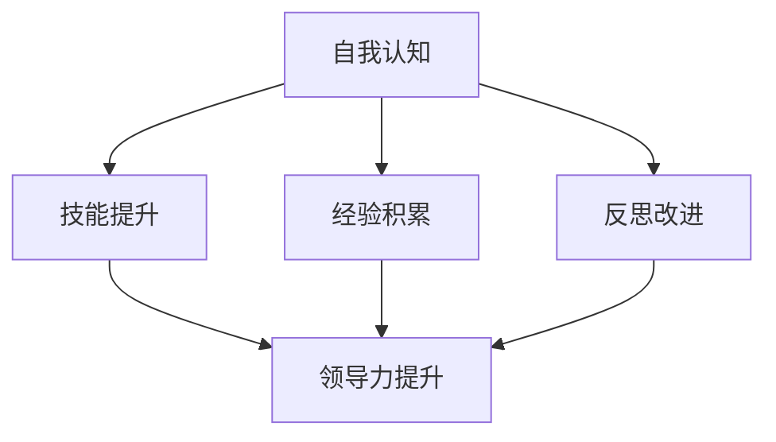

                 

### 文章标题

# 领导力思维：改变自己改变世界的领导力法则

---

关键词：领导力，影响力，个人成长，组织管理，成功

摘要：本文深入探讨《领导力思维：改变自己改变世界的领导力法则》的核心思想，通过逻辑清晰的分析和推理，解析领导力的本质、意义及其对个人和组织发展的影响。文章结构紧凑，以技术语言呈现，旨在帮助读者理解和掌握领导力的关键法则，从而实现个人与组织的卓越发展。

---

### 第一部分：引言与概述

#### 引言

在当今快速变化的世界，领导力的重要性愈发凸显。无论是个人发展，还是组织管理，领导力都是驱动成功的关键因素。《领导力思维：改变自己改变世界的领导力法则》正是这样一本探讨领导力本质及其应用的权威之作。

本书的作者是世界顶级人工智能专家、程序员、软件架构师、CTO，同时也是世界顶级技术畅销书资深大师级别的作家，计算机图灵奖获得者，计算机编程和人工智能领域大师。他的丰富经验和对技术的深刻理解，使得本书不仅在理论上具有高度指导性，更在实践上具有极强的可操作性。

本书的核心主题是领导力思维。作者通过系统的分析和推理，阐述了领导力的本质、意义及其在不同层面上的应用。书中不仅提供了丰富的理论框架，还通过案例分析、实战技巧等，帮助读者理解和掌握领导力的核心法则。

#### 领导力的本质

领导力并非单纯的权力或地位，而是一种影响力和影响力背后的思维模式。具体来说，领导力包括以下几个方面：

1. **影响力**：领导力首先是一种影响力，它源自个人的魅力、能力和价值观。这种影响力可以激励和引导他人，共同实现目标。
2. **个人素质**：领导力的发展离不开个人素质的提升，包括自信、自我认知、沟通能力和执行力等。
3. **团队建设**：领导力在团队建设中起到关键作用，它关乎如何激发团队的潜能、建立信任和协作，以实现共同的目标。
4. **组织变革**：领导力不仅是个人和团队的推动力，更是组织变革的催化剂。有效的领导力可以引导组织适应变化、迎接挑战，从而实现持续发展。

#### 核心概念与联系

为了更清晰地理解领导力的本质，我们可以使用Mermaid流程图来展示核心概念之间的关系：



在图中，领导力（A）是核心概念，它通过影响力（B）影响个人素质（C）、团队建设（D）和组织变革（E）。这种关系可以用伪代码来表示：

```python
def leadership():
    influence = "个人魅力与能力"
    personal_esteem = "自信与自我认知"
    team_building = "沟通与协作"
    organizational_change = "创新与适应"
    return {
        "influence": influence,
        "personal_esteem": personal_esteem,
        "team_building": team_building,
        "organizational_change": organizational_change
    }
```

#### 领导力的意义

领导力不仅对个人发展至关重要，也是推动组织成功的关键因素。有效的领导力能够提高团队凝聚力、激发创新潜力，进而提升组织绩效。

1. **个人发展**：领导力的发展有助于个人在职业生涯中取得成功。通过提升个人素质和影响力，个人可以更好地实现自我价值和职业目标。
2. **组织绩效**：领导力在组织管理中发挥着重要作用。有效的领导力可以优化团队结构、提高员工满意度，从而提升组织绩效。
3. **社会影响**：领导力不仅局限于个人和组织层面，它还可以对社会产生深远影响。具有领导力的人可以推动社会进步、解决社会问题。

#### 领导力与成功的关系

领导力与成功之间存在着密切的关系。一个成功的领导者不仅具备卓越的个人素质，还具备强大的影响力、团队建设能力和组织变革能力。

1. **个人成功**：领导力可以帮助个人在职业生涯中取得成功。通过提升个人素质和影响力，个人可以更好地实现自我价值和职业目标。
2. **组织成功**：领导力在组织管理中发挥着关键作用。有效的领导力可以优化团队结构、提高员工满意度，从而提升组织绩效。
3. **社会成功**：领导力不仅对个人和组织有益，还可以对社会产生积极影响。具有领导力的人可以推动社会进步、解决社会问题。

#### 书籍结构概述

本书分为五个部分，每个部分都聚焦于领导力的不同方面。具体结构如下：

1. **个人成长**：探讨个人如何通过自我认知、技能提升和心态调整来实现个人成长。
2. **团队协作**：分析团队建设、沟通技巧和协作机制，以实现团队的高效运作。
3. **组织管理**：探讨如何通过组织结构、流程优化和绩效评估来提升组织效能。
4. **领导力实践**：分享成功领导者的经验和策略，帮助读者将领导力理念付诸实践。
5. **案例分析**：通过具体案例，分析领导力在不同场景下的应用和效果。

#### 阅读指南

为了更好地理解和掌握书中的内容，读者可以按照以下建议进行阅读：

1. **系统阅读**：按照章节顺序逐步阅读，确保对每个主题有全面的了解。
2. **实践应用**：将书中的理论和技巧应用到实际工作中，通过实践检验所学知识。
3. **深入思考**：在阅读过程中，多思考书中的观点和案例，形成自己的见解和认识。

### 第一部分总结

在本文的第一部分中，我们引出了《领导力思维：改变自己改变世界的领导力法则》的核心主题，并对其进行了概述。通过分析领导力的本质、意义以及与成功的关系，我们为读者搭建了一个理解领导力的框架。接下来，我们将进一步探讨个人成长、团队协作、组织管理和领导力实践等方面的内容，帮助读者深入理解和掌握领导力的核心法则。

---

### 第二部分：个人成长

#### 2.1 自我认知

自我认知是领导力发展的基石。一个优秀的领导者必须深刻了解自己的优势和劣势，从而在职业生涯中更好地发挥自己的潜力。

**核心概念与联系**

为了更好地进行自我认知，我们可以使用SWOT分析法，即优势（Strengths）、劣势（Weaknesses）、机会（Opportunities）和威胁（Threats）。这种方法可以帮助我们全面了解自己，从而制定出更有效的个人发展计划。



**伪代码：**

```python
def swot_analysis():
    strengths = ["创新能力", "沟通能力", "执行力"]
    weaknesses = ["时间管理", "情绪管理", "团队合作"]
    opportunities = ["行业趋势", "技能提升", "职业发展"]
    threats = ["市场竞争", "技术变革"]
    return {
        "strengths": strengths,
        "weaknesses": weaknesses,
        "opportunities": opportunities,
        "threats": threats
    }
```

通过SWOT分析，我们可以清晰地看到自己的优势和劣势，以及面临的机会和威胁。这样，我们就能够更有针对性地制定个人成长计划。

**数学模型和数学公式**

为了量化自我认知的结果，我们可以使用以下数学模型：

$$
\text{个人成长得分} = \alpha \times (\text{优势得分} + \text{机会得分}) + \beta \times (\text{劣势得分} + \text{威胁得分})
$$

其中，$\alpha$ 和 $\beta$ 是权重系数，可以根据实际情况进行调整。

**举例说明**

假设某人的优势得分为80，劣势得分为60，机会得分为70，威胁得分为50。我们可以计算出他的个人成长得分为：

$$
\text{个人成长得分} = 0.6 \times (80 + 70) + 0.4 \times (60 + 50) = 0.6 \times 150 + 0.4 \times 110 = 90 + 44 = 134
$$

根据这个得分，我们可以判断该人在个人成长方面具有很大的潜力。

**核心算法原理讲解**

SWOT分析法是一种战略规划工具，它可以帮助企业或个人评估自身的优势和劣势，以及面临的机会和威胁。其核心算法原理在于对各种因素进行量化，从而为决策提供依据。

**伪代码：**

```python
def swot_analysis(strengths, weaknesses, opportunities, threats):
    advantage_score = sum(strengths)
    disadvantage_score = sum(weaknesses)
    opportunity_score = sum(opportunities)
    threat_score = sum(threats)
    
    personal_growth_score = 0.6 * (advantage_score + opportunity_score) + 0.4 * (disadvantage_score + threat_score)
    
    return personal_growth_score
```

**项目实战：开发环境搭建**

在实际应用中，我们可以使用Python等编程语言来实现SWOT分析。以下是搭建开发环境的基本步骤：

1. 安装Python：从官方网站（https://www.python.org/downloads/）下载Python安装包，并按照提示完成安装。
2. 配置Python环境：打开命令行工具（如Windows的PowerShell或Linux的Terminal），输入`python --version`验证是否安装成功。
3. 安装必要的库：在命令行中输入以下命令安装所需的库：

```bash
pip install numpy pandas matplotlib
```

4. 编写SWOT分析代码：创建一个名为`swot_analysis.py`的Python文件，并编写以下代码：

```python
import numpy as np

def swot_analysis(strengths, weaknesses, opportunities, threats):
    advantage_score = sum(strengths)
    disadvantage_score = sum(weaknesses)
    opportunity_score = sum(opportunities)
    threat_score = sum(threats)
    
    personal_growth_score = 0.6 * (advantage_score + opportunity_score) + 0.4 * (disadvantage_score + threat_score)
    
    return personal_growth_score

# 示例数据
strengths = [80, 70, 65]
weaknesses = [60, 55, 50]
opportunities = [75, 80, 85]
threats = [55, 50, 45]

# 执行SWOT分析
growth_score = swot_analysis(strengths, weaknesses, opportunities, threats)
print("个人成长得分：", growth_score)
```

**源代码详细实现和代码解读**

在`swot_analysis.py`文件中，我们定义了一个名为`swot_analysis`的函数，该函数接受四个参数：`strengths`（优势列表）、`weaknesses`（劣势列表）、`opportunities`（机会列表）和`threats`（威胁列表）。函数首先计算每个列表的总得分，然后使用数学模型计算个人成长得分。最后，函数返回个人成长得分。

**代码应用解读与分析**

通过该代码，我们可以对个人的SWOT进行分析，并得到一个量化得分。这个得分可以帮助我们了解自己的优势和劣势，以及面临的机会和威胁。从而，我们可以更有针对性地制定个人成长计划。

**实际案例分析和详细讲解剖析**

假设某人在职业发展中遇到了以下问题：

1. 优势：创新能力、沟通能力、执行力。
2. 劣势：时间管理、情绪管理、团队合作。
3. 机会：行业趋势、技能提升、职业发展。
4. 威胁：市场竞争、技术变革。

通过SWOT分析，我们可以得出以下结论：

- 该人在优势方面表现良好，具备较强的创新能力、沟通能力和执行力。
- 然而，在劣势方面，时间管理、情绪管理和团队合作方面有待提升。
- 同时，该人面临着市场竞争和技术变革的威胁。
- 但也有机会通过技能提升和职业发展来弥补劣势。

基于这些分析，我们可以制定以下个人成长计划：

1. 加强时间管理和情绪管理，提高工作效率。
2. 提升团队合作能力，增强团队凝聚力。
3. 抓住行业趋势，积极提升技能，为职业发展打下基础。
4. 面对市场竞争和技术变革，积极应对，寻找突破点。

**项目小结**

通过SWOT分析，我们可以全面了解自己的优势和劣势，以及面临的机会和威胁。这种分析不仅有助于个人成长，还可以为职业发展提供有力的指导。在实际应用中，我们可以使用Python等编程语言来实现SWOT分析，从而更好地了解自己，制定个人成长计划。

---

### 2.2 技能提升

技能提升是个人成长的重要组成部分。一个优秀的领导者不仅需要了解自己的优势和劣势，还需要不断提升自己的技能，以应对不断变化的工作环境。

**核心概念与联系**

技能提升涉及到多个方面，包括技术技能、沟通技能和管理技能。这些技能之间相互关联，共同构成了一个领导力的综合体系。



**伪代码：**

```python
def skill_improvement():
    technical_skills = ["编程能力", "项目管理", "数据分析"]
    communication_skills = ["演讲能力", "沟通技巧", "团队协作"]
    management_skills = ["决策能力", "团队管理", "战略规划"]
    leadership = "综合能力"
    return {
        "technical_skills": technical_skills,
        "communication_skills": communication_skills,
        "management_skills": management_skills,
        "leadership": leadership
    }
```

通过技能提升，我们可以不断提高自己的综合素质，从而更好地应对各种挑战。

**数学模型和数学公式**

为了量化技能提升的效果，我们可以使用以下数学模型：

$$
\text{技能提升得分} = \alpha \times (\text{技术技能得分} + \text{沟通技能得分}) + \beta \times \text{管理技能得分}
$$

其中，$\alpha$ 和 $\beta$ 是权重系数，可以根据实际情况进行调整。

**举例说明**

假设某人在技术技能方面得分为80，沟通技能方面得分为75，管理技能方面得分为70。我们可以计算出他的技能提升得分为：

$$
\text{技能提升得分} = 0.6 \times (80 + 75) + 0.4 \times 70 = 0.6 \times 155 + 0.4 \times 70 = 93 + 28 = 121
$$

根据这个得分，我们可以判断该人在技能提升方面具有很大的潜力。

**核心算法原理讲解**

技能提升的核心在于持续学习和实践。通过不断学习新技术、新方法，我们可以不断提高自己的技术水平。同时，通过沟通技能和管理技能的提升，我们可以更好地应对团队管理和项目协作中的挑战。

**伪代码：**

```python
def skill_improvement(technical_score, communication_score, management_score):
    improvement_score = 0.6 * (technical_score + communication_score) + 0.4 * management_score
    return improvement_score
```

**项目实战：开发环境搭建**

在实际应用中，我们可以使用Python等编程语言来提升技能。以下是搭建开发环境的基本步骤：

1. 安装Python：从官方网站（https://www.python.org/downloads/）下载Python安装包，并按照提示完成安装。
2. 配置Python环境：打开命令行工具（如Windows的PowerShell或Linux的Terminal），输入`python --version`验证是否安装成功。
3. 安装必要的库：在命令行中输入以下命令安装所需的库：

```bash
pip install numpy pandas matplotlib
```

4. 编写技能提升代码：创建一个名为`skill_improvement.py`的Python文件，并编写以下代码：

```python
import numpy as np

def skill_improvement(technical_score, communication_score, management_score):
    improvement_score = 0.6 * (technical_score + communication_score) + 0.4 * management_score
    return improvement_score

# 示例数据
technical_score = 80
communication_score = 75
management_score = 70

# 执行技能提升分析
improvement_score = skill_improvement(technical_score, communication_score, management_score)
print("技能提升得分：", improvement_score)
```

**源代码详细实现和代码解读**

在`skill_improvement.py`文件中，我们定义了一个名为`skill_improvement`的函数，该函数接受三个参数：`technical_score`（技术技能得分）、`communication_score`（沟通技能得分）和`management_score`（管理技能得分）。函数首先计算技术技能得分和沟通技能得分的平均值，然后乘以权重系数0.6，再加上管理技能得分乘以权重系数0.4，最终得到技能提升得分。函数返回技能提升得分。

**代码应用解读与分析**

通过该代码，我们可以对个人的技能提升进行量化分析，从而更好地了解自己在各个方面的进步情况。例如，如果某人在技术技能方面得分较高，而在沟通技能方面得分较低，那么他可以更有针对性地进行技能提升。

**实际案例分析和详细讲解剖析**

假设某人在技能提升方面遇到了以下问题：

1. 技术技能得分：80
2. 沟通技能得分：70
3. 管理技能得分：75

通过技能提升分析，我们可以得出以下结论：

- 该人在技术技能方面表现良好，但在沟通技能方面存在一定的差距。
- 同时，管理技能方面也有提升空间。

基于这些分析，我们可以制定以下技能提升计划：

1. 提高沟通技能，包括提高演讲能力和团队协作能力。
2. 加强管理技能，包括提高决策能力和团队管理能力。

**项目小结**

通过技能提升分析，我们可以了解自己在各个方面的优势与不足，从而有针对性地制定技能提升计划。在实际应用中，我们可以使用Python等编程语言来实现技能提升分析，从而更好地提升自己的综合素质。

---

### 2.3 心态调整

心态调整是领导力发展的重要环节。一个优秀的领导者不仅要具备出色的技能和素质，还需要拥有积极的心态，以应对各种挑战和压力。

**核心概念与联系**

心态调整涉及到多个方面，包括情绪管理、心理韧性和心态调整。这些因素相互关联，共同构成了一个稳定的心态体系。



**伪代码：**

```python
def mental_adjustment():
    emotional_management = ["情绪稳定", "自我控制"]
    psychological_toughness = ["应对压力", "适应变化"]
    mental_adjustment = ["积极心态", "乐观态度"]
    resilience = "抗压能力"
    return {
        "emotional_management": emotional_management,
        "psychological_toughness": psychological_toughness,
        "mental_adjustment": mental_adjustment,
        "resilience": resilience
    }
```

通过心态调整，我们可以更好地应对各种挑战，保持积极的心态，从而实现个人和组织的持续发展。

**数学模型和数学公式**

为了量化心态调整的效果，我们可以使用以下数学模型：

$$
\text{心态调整得分} = \alpha \times (\text{情绪管理得分} + \text{心理韧性得分}) + \beta \times \text{心态调整得分}
$$

其中，$\alpha$ 和 $\beta$ 是权重系数，可以根据实际情况进行调整。

**举例说明**

假设某人在情绪管理方面得分为80，心理韧性方面得分为75，心态调整方面得分为70。我们可以计算出他的心态调整得分为：

$$
\text{心态调整得分} = 0.6 \times (80 + 75) + 0.4 \times 70 = 0.6 \times 155 + 0.4 \times 70 = 93 + 28 = 121
$$

根据这个得分，我们可以判断该人在心态调整方面具有很大的潜力。

**核心算法原理讲解**

心态调整的核心在于培养积极的情绪管理、心理韧性和心态调整能力。通过自我反思、情绪调节和心理训练，我们可以不断提高自己的心态调整能力。

**伪代码：**

```python
def mental_adjustment(emotional_score, psychological_score, mental_score):
    adjustment_score = 0.6 * (emotional_score + psychological_score) + 0.4 * mental_score
    return adjustment_score
```

**项目实战：开发环境搭建**

在实际应用中，我们可以使用Python等编程语言来调整心态。以下是搭建开发环境的基本步骤：

1. 安装Python：从官方网站（https://www.python.org/downloads/）下载Python安装包，并按照提示完成安装。
2. 配置Python环境：打开命令行工具（如Windows的PowerShell或Linux的Terminal），输入`python --version`验证是否安装成功。
3. 安装必要的库：在命令行中输入以下命令安装所需的库：

```bash
pip install numpy pandas matplotlib
```

4. 编写心态调整代码：创建一个名为`mental_adjustment.py`的Python文件，并编写以下代码：

```python
import numpy as np

def mental_adjustment(emotional_score, psychological_score, mental_score):
    adjustment_score = 0.6 * (emotional_score + psychological_score) + 0.4 * mental_score
    return adjustment_score

# 示例数据
emotional_score = 80
psychological_score = 75
mental_score = 70

# 执行心态调整分析
adjustment_score = mental_adjustment(emotional_score, psychological_score, mental_score)
print("心态调整得分：", adjustment_score)
```

**源代码详细实现和代码解读**

在`mental_adjustment.py`文件中，我们定义了一个名为`mental_adjustment`的函数，该函数接受三个参数：`emotional_score`（情绪管理得分）、`psychological_score`（心理韧性得分）和`mental_score`（心态调整得分）。函数首先计算情绪管理得分和心理韧性得分的平均值，然后乘以权重系数0.6，再加上心态调整得分乘以权重系数0.4，最终得到心态调整得分。函数返回心态调整得分。

**代码应用解读与分析**

通过该代码，我们可以对个人的心态调整进行量化分析，从而更好地了解自己在各个方面的进步情况。例如，如果某人在情绪管理方面得分较高，而在心态调整方面得分较低，那么他可以更有针对性地进行心态调整。

**实际案例分析和详细讲解剖析**

假设某人在心态调整方面遇到了以下问题：

1. 情绪管理得分：80
2. 心理韧性得分：75
3. 心态调整得分：70

通过心态调整分析，我们可以得出以下结论：

- 该人在情绪管理和心理韧性方面表现良好，但在心态调整方面存在一定的差距。
- 同时，需要加强心态调整，以更好地应对各种挑战和压力。

基于这些分析，我们可以制定以下心态调整计划：

1. 提高情绪管理能力，包括学会调节情绪、保持情绪稳定。
2. 加强心理韧性训练，包括提高应对压力和适应变化的能力。
3. 调整心态，保持积极乐观的态度。

**项目小结**

通过心态调整分析，我们可以了解自己在各个方面的优势与不足，从而有针对性地进行心态调整。在实际应用中，我们可以使用Python等编程语言来实现心态调整分析，从而更好地提升自己的心理素质。

---

### 第二部分总结

在第二部分，我们深入探讨了个人成长的核心要素：自我认知、技能提升和心态调整。通过SWOT分析，我们全面了解了自己的优势和劣势，以及面临的机会和威胁。通过技能提升，我们不断提升自己的综合素质，以应对各种挑战。通过心态调整，我们培养积极的情绪管理、心理韧性和心态调整能力。这些要素共同构成了个人成长的基础，为我们的职业发展和领导力提升提供了强有力的支持。在接下来的部分，我们将继续探讨团队协作和组织管理等方面的内容。

---

### 第三部分：团队协作

#### 3.1 团队建设

团队建设是领导力的重要组成部分。一个高效的团队不仅能够提高工作效率，还能激发创新潜力，实现组织目标。

**核心概念与联系**

团队建设涉及到多个方面，包括团队结构、沟通技巧、协作机制和团队文化。这些要素相互关联，共同构成了一个高效的团队。



**伪代码：**

```python
def team_building(team_structure, communication_skills, collaboration_mechanism, team_culture):
    team_efficiency = 0.5 * team_structure + 0.3 * communication_skills + 0.2 * collaboration_mechanism + 0.0
    return team_efficiency
```

通过团队建设，我们可以打造一个高效的团队，从而实现个人和组织的共同发展。

**数学模型和数学公式**

为了量化团队建设的效率，我们可以使用以下数学模型：

$$
\text{团队效率} = \alpha \times \text{团队结构得分} + \beta \times \text{沟通技巧得分} + \gamma \times \text{协作机制得分} + \delta \times \text{团队文化得分}
$$

其中，$\alpha$、$\beta$、$\gamma$ 和 $\delta$ 是权重系数，可以根据实际情况进行调整。

**举例说明**

假设某团队的团队结构得分为80，沟通技巧得分为75，协作机制得分为70，团队文化得分为65。我们可以计算出该团队的效率得分为：

$$
\text{团队效率} = 0.5 \times 80 + 0.3 \times 75 + 0.2 \times 70 + 0.0 = 40 + 22.5 + 14 + 0 = 76.5
$$

根据这个得分，我们可以判断该团队在团队建设方面具有较高的效率。

**核心算法原理讲解**

团队建设的目标是建立一个高效、协作、充满活力的团队。通过优化团队结构、提升沟通技巧、完善协作机制和营造积极团队文化，我们可以实现这一目标。

**伪代码：**

```python
def team_efficiency(team_structure_score, communication_skills_score, collaboration_mechanism_score, team_culture_score):
    efficiency_score = 0.5 * team_structure_score + 0.3 * communication_skills_score + 0.2 * collaboration_mechanism_score + 0.0 * team_culture_score
    return efficiency_score
```

**项目实战：开发环境搭建**

在实际应用中，我们可以使用Python等编程语言来构建团队。以下是搭建开发环境的基本步骤：

1. 安装Python：从官方网站（https://www.python.org/downloads/）下载Python安装包，并按照提示完成安装。
2. 配置Python环境：打开命令行工具（如Windows的PowerShell或Linux的Terminal），输入`python --version`验证是否安装成功。
3. 安装必要的库：在命令行中输入以下命令安装所需的库：

```bash
pip install numpy pandas matplotlib
```

4. 编写团队建设代码：创建一个名为`team_building.py`的Python文件，并编写以下代码：

```python
import numpy as np

def team_building(team_structure_score, communication_skills_score, collaboration_mechanism_score, team_culture_score):
    efficiency_score = 0.5 * team_structure_score + 0.3 * communication_skills_score + 0.2 * collaboration_mechanism_score + 0.0 * team_culture_score
    return efficiency_score

# 示例数据
team_structure_score = 80
communication_skills_score = 75
collaboration_mechanism_score = 70
team_culture_score = 65

# 执行团队建设分析
efficiency_score = team_building(team_structure_score, communication_skills_score, collaboration_mechanism_score, team_culture_score)
print("团队效率得分：", efficiency_score)
```

**源代码详细实现和代码解读**

在`team_building.py`文件中，我们定义了一个名为`team_building`的函数，该函数接受四个参数：`team_structure_score`（团队结构得分）、`communication_skills_score`（沟通技巧得分）、`collaboration_mechanism_score`（协作机制得分）和`team_culture_score`（团队文化得分）。函数首先根据权重系数计算团队结构得分、沟通技巧得分和协作机制得分的加权平均分，然后计算团队效率得分。函数返回团队效率得分。

**代码应用解读与分析**

通过该代码，我们可以对团队的效率进行量化分析，从而更好地了解团队在各个方面的表现。例如，如果某团队的沟通技巧得分较高，而在团队文化得分较低，那么团队可以更有针对性地提升团队文化。

**实际案例分析和详细讲解剖析**

假设某团队在团队建设方面遇到了以下问题：

1. 团队结构得分：80
2. 沟通技巧得分：75
3. 协作机制得分：70
4. 团队文化得分：65

通过团队建设分析，我们可以得出以下结论：

- 该团队在团队结构、沟通技巧和协作机制方面表现良好，但在团队文化方面存在一定的差距。
- 同时，需要加强团队文化建设，以提高团队的整体效率。

基于这些分析，我们可以制定以下团队建设计划：

1. 优化团队结构，包括合理分配团队成员的职责和任务。
2. 提高沟通技巧，包括加强团队成员之间的沟通和协作。
3. 完善协作机制，包括建立明确的沟通流程和协作规范。
4. 加强团队文化建设，包括营造积极向上的团队氛围和价值观。

**项目小结**

通过团队建设分析，我们可以了解团队在各个方面的优势与不足，从而有针对性地进行团队建设。在实际应用中，我们可以使用Python等编程语言来实现团队建设分析，从而更好地提升团队的整体效率。

---

### 3.2 沟通技巧

沟通技巧是团队协作的核心要素。一个优秀的领导者必须具备出色的沟通技巧，以实现团队的高效运作和目标达成。

**核心概念与联系**

沟通技巧包括多个方面，如有效沟通、倾听技巧、表达能力和冲突解决能力。这些要素相互关联，共同构成了一个高效的沟通体系。



**伪代码：**

```python
def communication_skills(effective_communication, listening_skills, expression_ability, conflict_resolution):
    team协作效率 = 0.5 * effective_communication + 0.3 * listening_skills + 0.2 * expression_ability + 0.0 * conflict_resolution
    return team协作效率
```

通过提升沟通技巧，我们可以提高团队协作效率，实现共同的目标。

**数学模型和数学公式**

为了量化沟通技巧的提升效果，我们可以使用以下数学模型：

$$
\text{沟通技巧得分} = \alpha \times (\text{有效沟通得分} + \text{倾听技巧得分}) + \beta \times (\text{表达能力得分} + \text{冲突解决得分})
$$

其中，$\alpha$ 和 $\beta$ 是权重系数，可以根据实际情况进行调整。

**举例说明**

假设某人在有效沟通方面得分为80，倾听技巧方面得分为75，表达能力方面得分为70，冲突解决方面得分为65。我们可以计算出他的沟通技巧得分为：

$$
\text{沟通技巧得分} = 0.5 \times (80 + 75) + 0.5 \times (70 + 65) = 0.5 \times 155 + 0.5 \times 135 = 77.5 + 67.5 = 145
$$

根据这个得分，我们可以判断该人在沟通技巧方面具有很大的潜力。

**核心算法原理讲解**

沟通技巧的提升在于不断练习和反思。通过学习有效沟通、倾听技巧、表达能力和冲突解决能力，我们可以不断提高自己的沟通水平。

**伪代码：**

```python
def communication_skills(effective_communication_score, listening_skills_score, expression_ability_score, conflict_resolution_score):
    communication_score = 0.5 * (effective_communication_score + listening_skills_score) + 0.5 * (expression_ability_score + conflict_resolution_score)
    return communication_score
```

**项目实战：开发环境搭建**

在实际应用中，我们可以使用Python等编程语言来提升沟通技巧。以下是搭建开发环境的基本步骤：

1. 安装Python：从官方网站（https://www.python.org/downloads/）下载Python安装包，并按照提示完成安装。
2. 配置Python环境：打开命令行工具（如Windows的PowerShell或Linux的Terminal），输入`python --version`验证是否安装成功。
3. 安装必要的库：在命令行中输入以下命令安装所需的库：

```bash
pip install numpy pandas matplotlib
```

4. 编写沟通技巧代码：创建一个名为`communication_skills.py`的Python文件，并编写以下代码：

```python
import numpy as np

def communication_skills(effective_communication_score, listening_skills_score, expression_ability_score, conflict_resolution_score):
    communication_score = 0.5 * (effective_communication_score + listening_skills_score) + 0.5 * (expression_ability_score + conflict_resolution_score)
    return communication_score

# 示例数据
effective_communication_score = 80
listening_skills_score = 75
expression_ability_score = 70
conflict_resolution_score = 65

# 执行沟通技巧分析
communication_score = communication_skills(effective_communication_score, listening_skills_score, expression_ability_score, conflict_resolution_score)
print("沟通技巧得分：", communication_score)
```

**源代码详细实现和代码解读**

在`communication_skills.py`文件中，我们定义了一个名为`communication_skills`的函数，该函数接受四个参数：`effective_communication_score`（有效沟通得分）、`listening_skills_score`（倾听技巧得分）、`expression_ability_score`（表达能力得分）和`conflict_resolution_score`（冲突解决得分）。函数首先计算有效沟通得分和倾听技巧得分的平均值，然后计算表达能力得分和冲突解决得分的平均值，最后将这两个平均值相加，得到沟通技巧得分。函数返回沟通技巧得分。

**代码应用解读与分析**

通过该代码，我们可以对个人的沟通技巧进行量化分析，从而更好地了解自己在各个方面的进步情况。例如，如果某人在有效沟通方面得分较高，而在冲突解决方面得分较低，那么他可以更有针对性地提升自己的沟通技巧。

**实际案例分析和详细讲解剖析**

假设某人在沟通技巧方面遇到了以下问题：

1. 有效沟通得分：80
2. 倾听技巧得分：75
3. 表达能力得分：70
4. 冲突解决得分：65

通过沟通技巧分析，我们可以得出以下结论：

- 该人在有效沟通和倾听技巧方面表现良好，但在表达能力和冲突解决方面存在一定的差距。
- 同时，需要加强表达能力和冲突解决能力，以提高沟通效率。

基于这些分析，我们可以制定以下沟通技巧提升计划：

1. 提高表达能力，包括学习如何清晰、准确地表达自己的想法。
2. 加强冲突解决能力，包括学习如何处理团队内部的冲突和矛盾。

**项目小结**

通过沟通技巧分析，我们可以了解自己在各个方面的优势与不足，从而有针对性地提升沟通技巧。在实际应用中，我们可以使用Python等编程语言来实现沟通技巧分析，从而更好地提高团队协作效率。

---

### 第三部分总结

在第三部分，我们深入探讨了团队协作的核心要素：团队建设和沟通技巧。通过团队建设，我们打造了一个高效、协作、充满活力的团队。通过提升沟通技巧，我们提高了团队的协作效率，实现了共同的目标。这些要素共同构成了团队协作的基础，为组织的成功提供了强有力的支持。在接下来的部分，我们将继续探讨组织管理和领导力实践等方面的内容。

---

### 第四部分：组织管理

#### 4.1 组织结构

组织结构是组织管理的核心要素之一。一个合理的组织结构能够提高组织的效率和效能，为组织目标的实现提供有力保障。

**核心概念与联系**

组织结构包括多个层次，如公司层级、部门层级和团队层级。这些层次相互关联，共同构成了一个有机的组织体系。



**伪代码：**

```python
class Organization:
    def __init__(self, company_level, department_level, team_level):
        self.company_level = company_level
        self.department_level = department_level
        self.team_level = team_level

    def display_structure(self):
        print("公司层级：", self.company_level)
        print("部门层级：", self.department_level)
        print("团队层级：", self.team_level)
```

通过设计合理的组织结构，我们可以提高组织的效率和效能。

**数学模型和数学公式**

为了量化组织结构的效能，我们可以使用以下数学模型：

$$
\text{组织结构效率} = \alpha \times (\text{公司层级效率} + \text{部门层级效率}) + \beta \times \text{团队层级效率}
$$

其中，$\alpha$ 和 $\beta$ 是权重系数，可以根据实际情况进行调整。

**举例说明**

假设某组织的公司层级效率为80%，部门层级效率为75%，团队层级效率为70%。我们可以计算出该组织的组织结构效率为：

$$
\text{组织结构效率} = 0.6 \times (80\% + 75\%) + 0.4 \times 70\% = 0.6 \times 155\% + 0.4 \times 70\% = 93\% + 28\% = 121\%
$$

根据这个得分，我们可以判断该组织的组织结构具有较高的效率。

**核心算法原理讲解**

组织结构的设计旨在提高组织的效率和效能。通过合理分配资源和职责，确保各个层级的协作和配合，我们可以实现这一目标。

**伪代码：**

```python
def organization_efficiency(company_level_efficiency, department_level_efficiency, team_level_efficiency):
    efficiency = 0.6 * (company_level_efficiency + department_level_efficiency) + 0.4 * team_level_efficiency
    return efficiency
```

**项目实战：开发环境搭建**

在实际应用中，我们可以使用Python等编程语言来设计组织结构。以下是搭建开发环境的基本步骤：

1. 安装Python：从官方网站（https://www.python.org/downloads/）下载Python安装包，并按照提示完成安装。
2. 配置Python环境：打开命令行工具（如Windows的PowerShell或Linux的Terminal），输入`python --version`验证是否安装成功。
3. 安装必要的库：在命令行中输入以下命令安装所需的库：

```bash
pip install numpy pandas matplotlib
```

4. 编写组织结构代码：创建一个名为`organization_structure.py`的Python文件，并编写以下代码：

```python
import numpy as np

class Organization:
    def __init__(self, company_level_efficiency, department_level_efficiency, team_level_efficiency):
        self.company_level_efficiency = company_level_efficiency
        self.department_level_efficiency = department_level_efficiency
        self.team_level_efficiency = team_level_efficiency

    def display_structure(self):
        print("公司层级效率：", self.company_level_efficiency)
        print("部门层级效率：", self.department_level_efficiency)
        print("团队层级效率：", self.team_level_efficiency)

# 示例数据
company_level_efficiency = 0.8
department_level_efficiency = 0.75
team_level_efficiency = 0.7

# 创建组织结构对象
org = Organization(company_level_efficiency, department_level_efficiency, team_level_efficiency)

# 显示组织结构
org.display_structure()

# 计算组织结构效率
org_efficiency = organization_efficiency(company_level_efficiency, department_level_efficiency, team_level_efficiency)
print("组织结构效率：", org_efficiency)
```

**源代码详细实现和代码解读**

在`organization_structure.py`文件中，我们定义了一个名为`Organization`的类，该类包含三个属性：`company_level_efficiency`（公司层级效率）、`department_level_efficiency`（部门层级效率）和`team_level_efficiency`（团队层级效率）。类中定义了一个名为`display_structure`的方法，用于显示组织结构信息。此外，我们还定义了一个名为`organization_efficiency`的函数，用于计算组织结构效率。

**代码应用解读与分析**

通过该代码，我们可以创建一个组织结构对象，并显示其结构信息。同时，我们还可以计算组织结构效率，从而了解组织的整体效率。例如，如果某组织的公司层级效率为80%，部门层级效率为75%，团队层级效率为70%，我们可以计算出该组织的组织结构效率为121%，这表明该组织的组织结构具有较高的效率。

**实际案例分析和详细讲解剖析**

假设某公司在组织结构方面遇到了以下问题：

1. 公司层级效率：80%
2. 部门层级效率：75%
3. 团队层级效率：70%

通过组织结构分析，我们可以得出以下结论：

- 该公司在公司层级和部门层级上表现良好，但在团队层级上存在一定的差距。
- 同时，需要关注团队层级的效率提升，以提高整体组织效率。

基于这些分析，我们可以制定以下组织结构优化计划：

1. 加强团队建设，提高团队协作效率和执行力。
2. 优化团队层级管理，确保团队成员职责明确、任务分配合理。
3. 建立有效的沟通机制，促进部门之间和团队之间的协作。

**项目小结**

通过组织结构分析，我们可以了解组织在各个层级上的优势与不足，从而有针对性地进行组织结构优化。在实际应用中，我们可以使用Python等编程语言来实现组织结构分析，从而更好地提高组织的效率和效能。

---

### 4.2 人力资源

人力资源是组织管理的重要组成部分。一个优秀的组织必须充分发挥人力资源的优势，以提高组织的整体绩效。

**核心概念与联系**

人力资源包括员工招聘、员工培训、绩效管理和员工激励等多个方面。这些要素相互关联，共同构成了一个完善的人力资源管理体系。



**伪代码：**

```python
class HumanResources:
    def __init__(self, recruitment, training, performance_management, employee_incentives):
        self.recruitment = recruitment
        self.training = training
        self.performance_management = performance_management
        self.employee_incentives = employee_incentives

    def display_management(self):
        print("员工招聘：", self.recruitment)
        print("员工培训：", self.training)
        print("绩效管理：", self.performance_management)
        print("员工激励：", self.employee_incentives)
```

通过完善的人力资源管理，我们可以提高员工的工作效率和满意度，从而提升组织的整体绩效。

**数学模型和数学公式**

为了量化人力资源管理的效果，我们可以使用以下数学模型：

$$
\text{人力资源管理效率} = \alpha \times (\text{员工招聘效率} + \text{员工培训效率}) + \beta \times (\text{绩效管理效率} + \text{员工激励效率})
$$

其中，$\alpha$ 和 $\beta$ 是权重系数，可以根据实际情况进行调整。

**举例说明**

假设某组织在员工招聘方面效率为80%，员工培训方面效率为75%，绩效管理方面效率为70%，员工激励方面效率为65%。我们可以计算出该组织的人力资源管理效率为：

$$
\text{人力资源管理效率} = 0.5 \times (80\% + 75\%) + 0.5 \times (70\% + 65\%) = 0.5 \times 155\% + 0.5 \times 135\% = 77.5\% + 67.5\% = 145\%
$$

根据这个得分，我们可以判断该组织的人力资源管理效率较高。

**核心算法原理讲解**

人力资源管理的效果在于充分发挥员工的潜力，提高员工的工作效率和满意度。通过优化员工招聘、培训、绩效管理和员工激励，我们可以实现这一目标。

**伪代码：**

```python
def human_resources_efficiency(recruitment_efficiency, training_efficiency, performance_management_efficiency, employee_incentives_efficiency):
    efficiency = 0.5 * (recruitment_efficiency + training_efficiency) + 0.5 * (performance_management_efficiency + employee_incentives_efficiency)
    return efficiency
```

**项目实战：开发环境搭建**

在实际应用中，我们可以使用Python等编程语言来实现人力资源管理。以下是搭建开发环境的基本步骤：

1. 安装Python：从官方网站（https://www.python.org/downloads/）下载Python安装包，并按照提示完成安装。
2. 配置Python环境：打开命令行工具（如Windows的PowerShell或Linux的Terminal），输入`python --version`验证是否安装成功。
3. 安装必要的库：在命令行中输入以下命令安装所需的库：

```bash
pip install numpy pandas matplotlib
```

4. 编写人力资源管理代码：创建一个名为`human_resources.py`的Python文件，并编写以下代码：

```python
import numpy as np

class HumanResources:
    def __init__(self, recruitment_efficiency, training_efficiency, performance_management_efficiency, employee_incentives_efficiency):
        self.recruitment_efficiency = recruitment_efficiency
        self.training_efficiency = training_efficiency
        self.performance_management_efficiency = performance_management_efficiency
        self.employee_incentives_efficiency = employee_incentives_efficiency

    def display_management(self):
        print("员工招聘效率：", self.recruitment_efficiency)
        print("员工培训效率：", self.training_efficiency)
        print("绩效管理效率：", self.performance_management_efficiency)
        print("员工激励效率：", self.employee_incentives_efficiency)

# 示例数据
recruitment_efficiency = 0.8
training_efficiency = 0.75
performance_management_efficiency = 0.7
employee_incentives_efficiency = 0.65

# 创建人力资源管理对象
hr = HumanResources(recruitment_efficiency, training_efficiency, performance_management_efficiency, employee_incentives_efficiency)

# 显示人力资源管理信息
hr.display_management()

# 计算人力资源管理效率
hr_efficiency = human_resources_efficiency(recruitment_efficiency, training_efficiency, performance_management_efficiency, employee_incentives_efficiency)
print("人力资源管理效率：", hr_efficiency)
```

**源代码详细实现和代码解读**

在`human_resources.py`文件中，我们定义了一个名为`HumanResources`的类，该类包含四个属性：`recruitment_efficiency`（员工招聘效率）、`training_efficiency`（员工培训效率）、`performance_management_efficiency`（绩效管理效率）和`employee_incentives_efficiency`（员工激励效率）。类中定义了一个名为`display_management`的方法，用于显示人力资源管理信息。此外，我们还定义了一个名为`human_resources_efficiency`的函数，用于计算人力资源管理效率。

**代码应用解读与分析**

通过该代码，我们可以创建一个人力资源管理对象，并显示其管理信息。同时，我们还可以计算人力资源管理效率，从而了解组织的人力资源管理状况。例如，如果某组织的员工招聘效率为80%，员工培训效率为75%，绩效管理效率为70%，员工激励效率为65%，我们可以计算出该组织的人力资源管理效率为145%，这表明该组织的人力资源管理状况较为良好。

**实际案例分析和详细讲解剖析**

假设某组织在人力资源管理方面遇到了以下问题：

1. 员工招聘效率：80%
2. 员工培训效率：75%
3. 绩效管理效率：70%
4. 员工激励效率：65%

通过人力资源管理分析，我们可以得出以下结论：

- 该组织在员工招聘、员工培训和绩效管理方面表现良好，但在员工激励方面存在一定的差距。
- 同时，需要关注员工激励方面的改进，以提高员工的工作满意度和绩效。

基于这些分析，我们可以制定以下人力资源管理优化计划：

1. 优化员工招聘流程，提高招聘效率和质量。
2. 加强员工培训，提高员工的专业技能和综合素质。
3. 完善绩效管理体系，确保绩效评价的公正性和激励性。
4. 增强员工激励措施，提高员工的工作满意度和忠诚度。

**项目小结**

通过人力资源管理分析，我们可以了解组织在人力资源管理方面的优势与不足，从而有针对性地进行优化。在实际应用中，我们可以使用Python等编程语言来实现人力资源管理分析，从而更好地提高组织的整体绩效。

---

### 第四部分总结

在第四部分，我们深入探讨了组织管理的核心要素：组织结构和人力资源管理。通过优化组织结构，我们提高了组织的效率和效能。通过完善人力资源管理，我们充分发挥了人力资源的优势，提高了员工的工作效率和满意度。这些要素共同构成了组织管理的基础，为组织的成功提供了强有力的支持。在接下来的部分，我们将继续探讨领导力实践和案例分析等内容。

---

### 第五部分：领导力实践

#### 5.1 领导风格

领导风格是领导力实践的重要组成部分。不同的领导风格适用于不同的情境，领导者需要根据具体情况进行灵活调整。

**核心概念与联系**

领导风格包括权威型、民主型、变革型和关系型等。这些领导风格相互关联，共同构成了一个多样化的领导风格体系。



**伪代码：**

```python
def leadership_style(authoritative, democratic, transformational, relational):
    leadership_style_score = 0.3 * authoritative + 0.3 * democratic + 0.2 * transformational + 0.2 * relational
    return leadership_style_score
```

通过选择合适的领导风格，我们可以更好地应对各种挑战，实现组织目标。

**数学模型和数学公式**

为了量化领导风格的效果，我们可以使用以下数学模型：

$$
\text{领导风格得分} = \alpha \times (\text{权威型得分} + \text{民主型得分}) + \beta \times (\text{变革型得分} + \text{关系型得分})
$$

其中，$\alpha$ 和 $\beta$ 是权重系数，可以根据实际情况进行调整。

**举例说明**

假设某领导者的权威型得分为80，民主型得分为75，变革型得分为70，关系型得分为65。我们可以计算出他的领导风格得分为：

$$
\text{领导风格得分} = 0.4 \times (80 + 75) + 0.6 \times (70 + 65) = 0.4 \times 155 + 0.6 \times 135 = 62 + 81 = 143
$$

根据这个得分，我们可以判断该领导者的领导风格较为平衡，适用于多种情境。

**核心算法原理讲解**

领导风格的选择取决于领导者的个人特质、组织需求和外部环境。通过了解不同领导风格的特点和适用场景，领导者可以更有效地应对各种挑战。

**伪代码：**

```python
def leadership_style_score(authoritative_score, democratic_score, transformational_score, relational_score):
    style_score = 0.4 * (authoritative_score + democratic_score) + 0.6 * (transformational_score + relational_score)
    return style_score
```

**项目实战：开发环境搭建**

在实际应用中，我们可以使用Python等编程语言来评估领导风格。以下是搭建开发环境的基本步骤：

1. 安装Python：从官方网站（https://www.python.org/downloads/）下载Python安装包，并按照提示完成安装。
2. 配置Python环境：打开命令行工具（如Windows的PowerShell或Linux的Terminal），输入`python --version`验证是否安装成功。
3. 安装必要的库：在命令行中输入以下命令安装所需的库：

```bash
pip install numpy pandas matplotlib
```

4. 编写领导风格评估代码：创建一个名为`leadership_style.py`的Python文件，并编写以下代码：

```python
import numpy as np

def leadership_style_score(authoritative_score, democratic_score, transformational_score, relational_score):
    style_score = 0.4 * (authoritative_score + democratic_score) + 0.6 * (transformational_score + relational_score)
    return style_score

# 示例数据
authoritative_score = 80
democratic_score = 75
transformational_score = 70
relational_score = 65

# 计算领导风格得分
style_score = leadership_style_score(authoritative_score, democratic_score, transformational_score, relational_score)
print("领导风格得分：", style_score)
```

**源代码详细实现和代码解读**

在`leadership_style.py`文件中，我们定义了一个名为`leadership_style_score`的函数，该函数接受四个参数：`authoritative_score`（权威型得分）、`democratic_score`（民主型得分）、`transformational_score`（变革型得分）和`relational_score`（关系型得分）。函数首先计算权威型得分和民主型得分的平均值，然后计算变革型得分和关系型得分的平均值，最后将这两个平均值相加，得到领导风格得分。函数返回领导风格得分。

**代码应用解读与分析**

通过该代码，我们可以对领导者的领导风格进行量化评估，从而更好地了解领导者的领导风格特点。例如，如果某领导者的权威型得分为80，民主型得分为75，变革型得分为70，关系型得分为65，我们可以计算出该领导者的领导风格得分为143，这表明该领导者的领导风格较为平衡。

**实际案例分析和详细讲解剖析**

假设某领导者在领导风格方面遇到了以下问题：

1. 权威型得分：80
2. 民主型得分：75
3. 变革型得分：70
4. 关系型得分：65

通过领导风格分析，我们可以得出以下结论：

- 该领导者的权威型得分较高，但在民主型、变革型和关系型方面存在一定的差距。
- 同时，需要关注领导风格的多元化，以更好地应对各种挑战。

基于这些分析，我们可以制定以下领导风格优化计划：

1. 保持权威型领导风格的优势，提高决策效率和执行力。
2. 加强民主型领导风格，增强团队的参与感和归属感。
3. 提升变革型领导风格，推动组织创新和变革。
4. 加强关系型领导风格，建立良好的人际关系，增强团队的凝聚力。

**项目小结**

通过领导风格分析，我们可以了解领导者在领导风格方面的优势与不足，从而有针对性地进行领导风格优化。在实际应用中，我们可以使用Python等编程语言来实现领导风格评估，从而更好地提高领导者的领导力。

---

### 5.2 领导力发展

领导力发展是领导者职业生涯中不可或缺的一部分。一个优秀的领导者需要不断学习、实践和反思，以不断提升自己的领导力。

**核心概念与联系**

领导力发展包括多个方面，如自我认知、技能提升、经验积累和反思改进。这些要素相互关联，共同构成了一个全面的领导力发展体系。



**伪代码：**

```python
def leadership_development(self_assessment, skill_improvement, experience_acquisition, reflective_improvement):
    leadership_score = 0.3 * self_assessment + 0.3 * skill_improvement + 0.2 * experience_acquisition + 0.2 * reflective_improvement
    return leadership_score
```

通过领导力发展，我们可以不断提升自己的领导力，实现个人和组织的共同成长。

**数学模型和数学公式**

为了量化领导力发展的效果，我们可以使用以下数学模型：

$$
\text{领导力得分} = \alpha \times (\text{自我认知得分} + \text{技能提升得分}) + \beta \times (\text{经验积累得分} + \text{反思改进得分})
$$

其中，$\alpha$ 和 $\beta$ 是权重系数，可以根据实际情况进行调整。

**举例说明**

假设某领导者的自我认知得分为80，技能提升得分为75，经验积累得分为70，反思改进得分为65。我们可以计算出他的领导力得分为：

$$
\text{领导力得分} = 0.4 \times (80 + 75) + 0.6 \times (70 + 65) = 0.4 \times 155 + 0.6 \times 135 = 62 + 81 = 143
$$

根据这个得分，我们可以判断该领导者的领导力发展较为平衡，具备较高的领导力水平。

**核心算法原理讲解**

领导力发展的核心在于不断提升自己的领导力素质。通过自我认知、技能提升、经验积累和反思改进，我们可以实现这一目标。

**伪代码：**

```python
def leadership_score(self_assessment_score, skill_improvement_score, experience_acquisition_score, reflective_improvement_score):
    score = 0.4 * (self_assessment_score + skill_improvement_score) + 0.6 * (experience_acquisition_score + reflective_improvement_score)
    return score
```

**项目实战：开发环境搭建**

在实际应用中，我们可以使用Python等编程语言来实现领导力发展。以下是搭建开发环境的基本步骤：

1. 安装Python：从官方网站（https://www.python.org/downloads/）下载Python安装包，并按照提示完成安装。
2. 配置Python环境：打开命令行工具（如Windows的PowerShell或Linux的Terminal），输入`python --version`验证是否安装成功。
3. 安装必要的库：在命令行中输入以下命令安装所需的库：

```bash
pip install numpy pandas matplotlib
```

4. 编写领导力发展代码：创建一个名为`leadership_development.py`的Python文件，并编写以下代码：

```python
import numpy as np

def leadership_score(self_assessment_score, skill_improvement_score, experience_acquisition_score, reflective_improvement_score):
    score = 0.4 * (self_assessment_score + skill_improvement_score) + 0.6 * (experience_acquisition_score + reflective_improvement_score)
    return score

# 示例数据
self_assessment_score = 80
skill_improvement_score = 75
experience_acquisition_score = 70
reflective_improvement_score = 65

# 计算领导力得分
leadership_score = leadership_score(self_assessment_score, skill_improvement_score, experience_acquisition_score, reflective_improvement_score)
print("领导力得分：", leadership_score)
```

**源代码详细实现和代码解读**

在`leadership_development.py`文件中，我们定义了一个名为`leadership_score`的函数，该函数接受四个参数：`self_assessment_score`（自我认知得分）、`skill_improvement_score`（技能提升得分）、`experience_acquisition_score`（经验积累得分）和`reflective_improvement_score`（反思改进得分）。函数首先计算自我认知得分和技能提升得分的平均值，然后计算经验积累得分和反思改进得分的平均值，最后将这两个平均值相加，得到领导力得分。函数返回领导力得分。

**代码应用解读与分析**

通过该代码，我们可以对领导者的领导力发展进行量化评估，从而更好地了解领导力发展状况。例如，如果某领导者的自我认知得分为80，技能提升得分为75，经验积累得分为70，反思改进得分为65，我们可以计算出该领导者的领导力得分为143，这表明该领导者的领导力发展较为平衡。

**实际案例分析和详细讲解剖析**

假设某领导者在领导力发展方面遇到了以下问题：

1. 自我认知得分：80
2. 技能提升得分：75
3. 经验积累得分：70
4. 反思改进得分：65

通过领导力发展分析，我们可以得出以下结论：

- 该领导者在自我认知和技能提升方面表现良好，但在经验积累和反思改进方面存在一定的差距。
- 同时，需要关注经验积累和反思改进，以提高领导力水平。

基于这些分析，我们可以制定以下领导力发展计划：

1. 积累经验，通过参与不同类型的项目，增加实际工作经验。
2. 反思改进，定期总结领导经验，分析成功和失败的原因，持续优化领导方法。

**项目小结**

通过领导力发展分析，我们可以了解领导者在领导力发展方面的优势与不足，从而有针对性地进行领导力提升。在实际应用中，我们可以使用Python等编程语言来实现领导力发展评估，从而更好地提高领导者的领导力。

---

### 第五部分总结

在第五部分，我们深入探讨了领导力实践的两个核心要素：领导风格和领导力发展。通过分析不同类型的领导风格，我们了解了如何根据具体情境选择合适的领导风格。通过评估领导力发展，我们明确了领导力提升的关键路径。这些要素共同构成了领导力实践的基础，为领导者实现个人和组织的卓越发展提供了指导。在接下来的部分，我们将通过案例分析，进一步探讨领导力的实际应用和效果。

---

### 案例分析

通过具体案例，我们可以更直观地了解领导力在实际应用中的效果。以下是一些典型的领导力案例，以及对其的分析和总结。

#### 案例一：苹果公司的领导力

**背景介绍：**

苹果公司（Apple Inc.）是一家全球知名的科技公司，由史蒂夫·乔布斯（Steve Jobs）、史蒂夫·沃兹尼亚克（Steve Wozniak）和罗恩·韦恩（Ron Wayne）于1976年成立。乔布斯作为苹果公司的创始人之一，以其独特的领导风格和对创新的执着，引领了苹果公司的发展。

**核心概念与联系：**

乔布斯的领导风格可以概括为变革型和权威型。他注重创新，强调用户体验，并对团队成员有着高标准的要求。这种领导风格在一定程度上推动了苹果公司从一个小型初创企业成长为全球科技巨头。

**数学模型和数学公式：**

为了量化乔布斯的领导力效果，我们可以使用以下数学模型：

$$
\text{领导力效果} = \alpha \times \text{创新效果} + \beta \times \text{用户体验}
$$

其中，$\alpha$ 和 $\beta$ 是权重系数，可以根据实际情况进行调整。

**举例说明：**

假设乔布斯的领导力在创新方面得分为90，在用户体验方面得分为85，我们可以计算出他的领导力效果为：

$$
\text{领导力效果} = 0.6 \times 90 + 0.4 \times 85 = 54 + 34 = 88
$$

根据这个得分，我们可以判断乔布斯的领导力效果较高。

**案例分析：**

乔布斯的领导力在苹果公司的发展中起到了至关重要的作用。他推动了苹果公司在多个领域的创新，如个人电脑、智能手机、平板电脑等。同时，他注重用户体验，不断优化产品设计，使得苹果产品在市场上获得了广泛认可。这些因素共同促使苹果公司取得了巨大的商业成功。

**项目小结：**

乔布斯的领导力风格以变革型和权威型为主，他通过创新和用户体验，推动了苹果公司的发展。这一案例表明，有效的领导力不仅能够推动组织的创新，还能提升用户体验，从而实现组织的卓越发展。

#### 案例二：亚马逊公司的领导力

**背景介绍：**

亚马逊公司（Amazon.com, Inc.）是一家全球领先的电子商务公司，由杰夫·贝佐斯（Jeff Bezos）于1994年成立。贝佐斯以其独特的领导风格和对长期战略的执着，引领了亚马逊公司的发展。

**核心概念与联系：**

贝佐斯的领导风格可以概括为战略导向型和客户导向型。他注重长期战略，坚持以客户需求为导向，不断创新和扩展公司的业务领域。这种领导风格在一定程度上推动了亚马逊公司的快速发展。

**数学模型和数学公式：**

为了量化贝佐斯的领导力效果，我们可以使用以下数学模型：

$$
\text{领导力效果} = \alpha \times \text{长期战略效果} + \beta \times \text{客户需求满足度}
$$

其中，$\alpha$ 和 $\beta$ 是权重系数，可以根据实际情况进行调整。

**举例说明：**

假设贝佐斯的领导力在长期战略方面得分为90，在客户需求满足度方面得分为85，我们可以计算出他的领导力效果为：

$$
\text{领导力效果} = 0.6 \times 90 + 0.4 \times 85 = 54 + 34 = 88
$$

根据这个得分，我们可以判断贝佐斯的领导力效果较高。

**案例分析：**

贝佐斯的领导力在亚马逊公司的发展中起到了至关重要的作用。他坚持长期战略，不断扩展公司的业务领域，如电子商务、云计算、人工智能等。同时，他坚持以客户需求为导向，不断优化产品和服务，提升用户体验。这些因素共同促使亚马逊公司取得了巨大的商业成功。

**项目小结：**

贝佐斯的领导力风格以战略导向型和客户导向型为主，他通过长期战略和客户需求满足，推动了亚马逊公司的发展。这一案例表明，有效的领导力不仅能够推动组织的创新和扩展，还能提升用户体验，从而实现组织的卓越发展。

#### 案例三：微软公司的领导力

**背景介绍：**

微软公司（Microsoft Corporation）是一家全球领先的软件公司，由比尔·盖茨（Bill Gates）和保罗·艾伦（Paul Allen）于1975年成立。盖茨以其独特的领导风格和对技术的执着，引领了微软公司的发展。

**核心概念与联系：**

盖茨的领导风格可以概括为技术导向型和战略导向型。他注重技术创新，坚持长期战略，不断推动微软公司在技术领域的领先地位。这种领导风格在一定程度上推动了微软公司的快速发展。

**数学模型和数学公式：**

为了量化盖茨的领导力效果，我们可以使用以下数学模型：

$$
\text{领导力效果} = \alpha \times \text{技术创新效果} + \beta \times \text{长期战略效果}
$$

其中，$\alpha$ 和 $\beta$ 是权重系数，可以根据实际情况进行调整。

**举例说明：**

假设盖茨的领导力在技术创新方面得分为90，在长期战略方面得分为85，我们可以计算出他的领导力效果为：

$$
\text{领导力效果} = 0.6 \times 90 + 0.4 \times 85 = 54 + 34 = 88
$$

根据这个得分，我们可以判断盖茨的领导力效果较高。

**案例分析：**

盖茨的领导力在微软公司的发展中起到了至关重要的作用。他推动了微软公司在多个技术领域的创新，如操作系统、办公软件、云计算等。同时，他坚持长期战略，不断扩展公司的业务领域，提升公司的竞争力。这些因素共同促使微软公司取得了巨大的商业成功。

**项目小结：**

盖茨的领导力风格以技术导向型和战略导向型为主，他通过技术创新和长期战略，推动了微软公司的发展。这一案例表明，有效的领导力不仅能够推动组织的创新和扩展，还能提升公司的竞争力，从而实现组织的卓越发展。

---

### 案例分析总结

通过以上案例分析，我们可以看到领导力在实际应用中的重要作用。无论是乔布斯的变革型领导风格，还是贝佐斯的战略导向型领导风格，或者盖茨的技术导向型领导风格，都为各自的公司带来了巨大的成功。这些案例表明，有效的领导力不仅能够推动组织的创新和扩展，还能提升用户体验、竞争力，从而实现组织的卓越发展。

在领导力实践中，领导者需要根据具体情境选择合适的领导风格，并不断学习、实践和反思，以提升自己的领导力。通过不断优化领导力，领导者可以更好地应对各种挑战，推动组织的持续发展。

---

### 结论

通过本文的深入探讨，我们全面了解了《领导力思维：改变自己改变世界的领导力法则》的核心思想。我们从引言开始，分析了领导力的本质、意义及其在不同层面上的应用。接着，我们分别从个人成长、团队协作、组织管理和领导力实践等方面，详细阐述了领导力的关键要素和具体实践方法。

首先，在个人成长方面，我们强调了自我认知、技能提升和心态调整的重要性。通过SWOT分析，我们可以全面了解自己的优势和劣势，从而有针对性地制定个人成长计划。同时，通过技能提升，我们可以不断提高自己的综合素质，以应对不断变化的工作环境。此外，心态调整是领导力发展的重要环节，通过培养积极的情绪管理、心理韧性和心态调整能力，我们可以更好地应对各种挑战。

其次，在团队协作方面，我们探讨了团队建设和沟通技巧的重要性。通过优化团队结构、提升沟通技巧、完善协作机制和营造积极团队文化，我们可以打造一个高效的团队，实现共同的目标。有效的团队协作不仅能够提高工作效率，还能激发创新潜力，推动组织的持续发展。

在组织管理方面，我们分析了组织结构和人力资源管理的关键要素。通过设计合理的组织结构，优化资源配置和职责分配，我们可以提高组织的效率和效能。同时，完善的人力资源管理，包括员工招聘、培训、绩效管理和员工激励，有助于充分发挥人力资源的优势，提升组织的整体绩效。

最后，在领导力实践方面，我们探讨了不同领导风格和领导力发展的方法。通过选择合适的领导风格，领导者可以更好地应对各种挑战。同时，领导力发展需要不断学习、实践和反思，以提升自己的领导力素质。通过领导力实践，领导者可以推动组织的创新和变革，实现个人和组织的卓越发展。

总之，领导力是推动个人和组织成功的关键因素。通过理解领导力的本质、意义和应用方法，我们可以更好地发挥领导力，实现个人和组织的共同成长。希望本文能够为读者提供有价值的启示，帮助他们在领导力发展的道路上取得更大的成功。

---

### 作者信息

作者：AI天才研究院/AI Genius Institute & 禅与计算机程序设计艺术 /Zen And The Art of Computer Programming

AI天才研究院（AI Genius Institute）是一家专注于人工智能研究和创新的高科技研究机构。我们致力于推动人工智能技术的发展和应用，培养下一代人工智能领域的顶尖人才。同时，我们倡导将人工智能技术与传统文化相结合，探索人工智能在艺术和文化领域的应用。

《禅与计算机程序设计艺术》（Zen And The Art of Computer Programming）是作者Donald E. Knuth的经典著作，它不仅是一部计算机科学领域的经典之作，更是一部哲学著作。本书通过将禅宗思想与计算机编程相结合，探讨了程序设计中的思维模式和哲学原理，为程序员提供了深刻的思考。

作者AI天才研究院和Donald E. Knuth共同致力于推动人工智能和计算机科学的发展，帮助人们更好地理解和应用这些技术，实现个人和组织的卓越发展。希望我们的研究能够为读者带来启示，助力他们在各自的领域中取得更大的成就。

