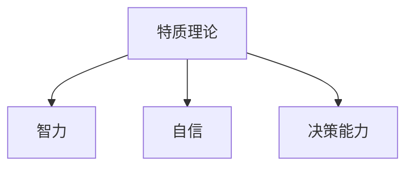
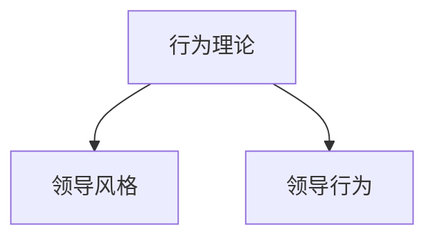
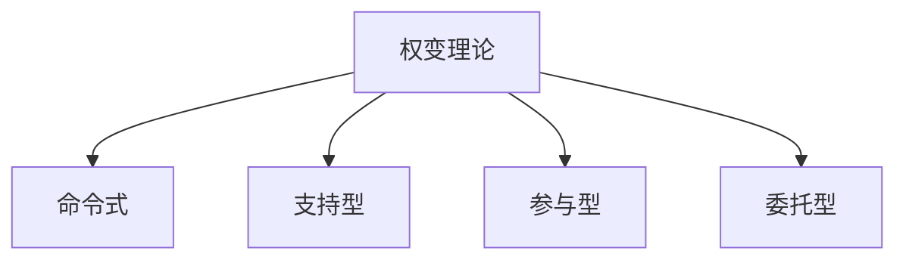
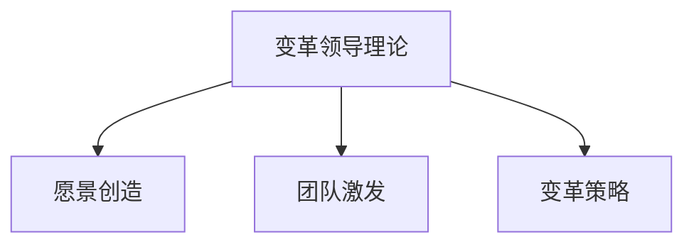
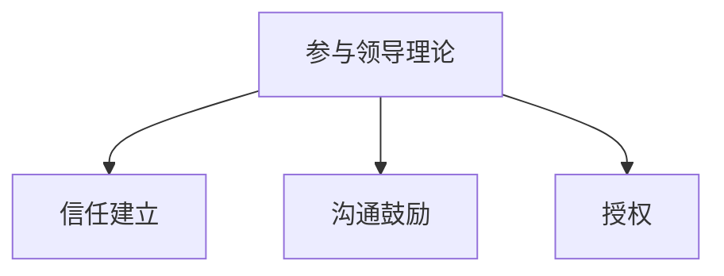
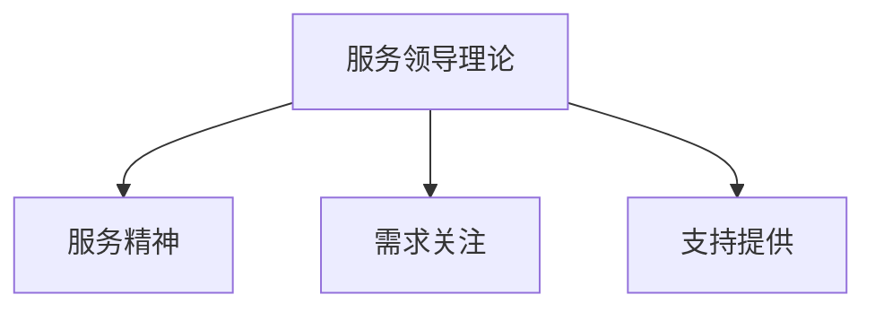
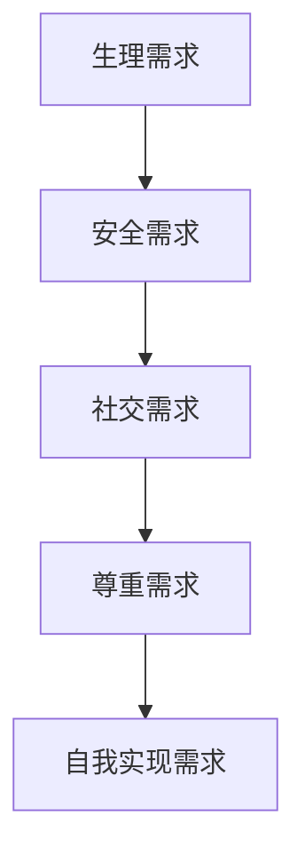
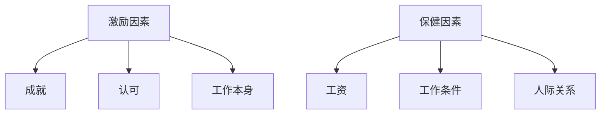
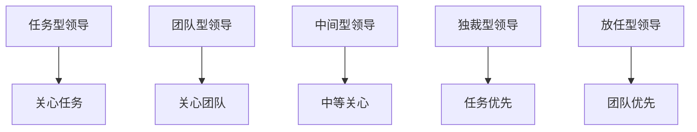

                 

### 文章标题

《领导力法则：打造高绩效团队的秘诀》

### 关键词

领导力、团队管理、高绩效、沟通技巧、激励策略、团队协作、实践案例

### 摘要

本文旨在探讨领导力法则在打造高绩效团队中的重要性，通过深入分析领导力的核心概念、理论模型、实践方法论以及团队管理与协作技巧，提供一整套系统化的领导力实践指南。文章结合实际案例，详细讲解了如何通过有效的沟通、科学的决策、合理的激励以及高效的团队协作，构建和培养出高绩效团队。最终，本文通过总结最佳实践，为读者提供了实用的操作建议和进一步学习资源。

## 第一部分：领导力核心概念与联系

### 1.1 领导力定义与核心概念

#### 1.1.1 领导力的内涵

领导力是指领导者通过影响力、激励、沟通等手段，引导和推动团队成员实现共同目标的能力。它不仅仅局限于领导者的个人特质，更是一种组织内的动态互动过程。领导力包括以下核心概念：

1. **影响力**：领导者通过自身的信念、价值观和行为来影响他人的能力。
2. **激励**：领导者激发团队成员的积极性、创造性和归属感，使其为实现团队目标而努力。
3. **沟通**：领导者通过有效的沟通方式，确保信息的准确传递和团队的协同合作。
4. **决策**：领导者制定战略决策，引导团队走向正确的方向。

#### 1.1.2 领导力与管理的区别

领导力与管理密切相关，但又有所不同。管理侧重于组织的日常运作，包括计划、组织、指挥、协调和控制。领导力则侧重于激发团队成员的潜力，推动团队实现变革和创新。具体来说：

1. **目标导向**：管理关注如何实现预定目标，而领导力关注如何设定有吸引力的目标，并激发团队成员为实现目标而努力。
2. **权力基础**：管理基于职位权力，而领导力基于个人魅力和影响力。
3. **角色定位**：管理者是任务的执行者，领导者是变革的推动者。

#### 1.1.3 领导力的重要特征

领导力具有以下重要特征：

1. **创新性**：领导者能够不断创新，推动团队在竞争激烈的环境中保持优势。
2. **远见**：领导者具有前瞻性，能够看到未来趋势，并制定相应的战略。
3. **适应性**：领导者能够适应环境变化，灵活调整领导策略。
4. **责任感**：领导者承担责任，以身作则，树立榜样。
5. **同理心**：领导者关心团队成员的需求和感受，建立信任和合作关系。

### 1.2 领导力理论模型

#### 1.2.1 经典领导力理论

经典领导力理论包括特质理论、行为理论和权变理论。

##### 1.2.1.1 特质理论

特质理论认为领导者的成功源于其固有的特质和能力。这些特质包括智力、自信、决策能力等。然而，特质理论未能解释领导者如何在不同的环境中表现出色。

##### 1.2.1.2 行为理论

行为理论关注领导者如何影响团队和成员的行为。行为理论分为两个阶段：第一个阶段研究领导者的行为类型，第二个阶段研究领导者的行为对团队绩效的影响。

##### 1.2.1.3 权变理论

权变理论认为领导效果取决于领导者、情境和成员特征之间的互动。该理论提出了四种领导风格：命令式、支持型、参与型和委托型。

#### 1.2.2 现代领导力理论

现代领导力理论更注重领导者的个性、行为和情境的互动。以下为几种主要的现代领导力理论：

##### 1.2.2.1 变革领导理论

变革领导理论强调领导者推动组织变革的能力。变革领导者通过创造愿景、激发团队、实施变革策略，引导团队走出舒适区，迎接新的挑战。

##### 1.2.2.2 参与领导理论

参与领导理论认为领导者的成功依赖于团队成员的参与和贡献。领导者通过建立信任、鼓励沟通和授权，激发团队成员的积极性和创造力。

##### 1.2.2.3 服务领导理论

服务领导理论强调领导者的服务精神。领导者将团队成员的需求放在首位，通过提供服务和支持，帮助团队成员实现个人和职业发展。

### 1.3 领导力对团队绩效的影响

#### 1.3.1 领导力对团队绩效的影响

领导力对团队绩效具有显著影响。以下为领导力对团队绩效的几个方面的影响：

1. **团队凝聚力**：领导者的影响力有助于增强团队成员之间的信任和合作关系，提高团队凝聚力。
2. **创新能力**：领导者的远见和创新性激励团队成员探索新的解决方案，推动团队在技术、市场和战略上不断创新。
3. **员工满意度**：领导者的激励策略和关怀可以提高员工的满意度和忠诚度，降低员工流失率。
4. **团队绩效**：领导者的有效决策和团队管理能力有助于提高团队的工作效率和质量，实现更高的团队绩效。

#### 1.3.2 高绩效团队的特征

高绩效团队具有以下特征：

1. **共同目标**：团队成员共同设定和追求团队目标，为实现目标而努力。
2. **信任和尊重**：团队成员之间相互信任，尊重彼此的意见和建议。
3. **高效沟通**：团队成员之间保持开放的沟通渠道，确保信息的准确传递。
4. **协作和合作**：团队成员在共同目标下协作，共同分担工作责任。
5. **持续学习**：团队成员不断学习新知识和技能，提升个人和团队的竞争力。
6. **自我管理**：团队成员具备自我管理能力，能够高效地完成任务。

#### 1.3.3 领导力与团队发展

领导力在团队发展的不同阶段扮演着不同的角色。以下是领导力在团队发展过程中的几个关键阶段：

1. **成立阶段**：领导者帮助团队成员明确团队目标和价值观，建立初步的信任和合作关系。
2. **成长阶段**：领导者激发团队成员的积极性和创造力，推动团队在技术、市场和战略上的发展。
3. **成熟阶段**：领导者关注团队成员的个人发展和团队文化的建设，确保团队的长期稳定和持续发展。
4. **转型阶段**：领导者带领团队应对外部环境的变化，推动团队进行战略调整和变革。

### 小结

领导力是构建高绩效团队的关键要素。通过深入理解领导力的核心概念、理论模型和实践方法论，领导者可以更好地发挥影响力，推动团队实现共同目标。在接下来的部分，我们将进一步探讨领导力的实践方法论，包括沟通技巧、决策方法和激励策略。

## 第二部分：领导力实践方法论

### 2.1 领导力沟通技巧

#### 2.1.1 有效沟通的核心要素

有效沟通是领导力的核心要素之一。以下为有效沟通的四个核心要素：

1. **明确沟通目标**：在沟通前，明确沟通的目标和目的，确保双方对沟通内容有共同的理解。
2. **倾听技巧**：倾听是有效沟通的关键，领导者需要倾听团队成员的意见和建议，了解他们的需求和期望。
3. **清晰表达**：领导者需要清晰、准确地表达自己的想法和意见，避免产生误解和歧义。

##### 2.1.1.1 明确沟通目标

明确沟通目标是确保沟通顺利进行的第一步。以下为明确沟通目标的步骤：

1. **确定沟通目的**：明确沟通的目的是解决问题、传达信息、收集反馈还是其他。
2. **制定沟通计划**：根据沟通目的，制定具体的沟通计划和策略。
3. **设定沟通目标**：将沟通计划转化为具体的沟通目标，确保团队成员对沟通目标有清晰的认识。

##### 2.1.1.2 倾听技巧

倾听是有效沟通的关键，领导者需要倾听团队成员的意见和建议，了解他们的需求和期望。以下为倾听技巧的几个方面：

1. **全身倾听**：全身倾听是指领导者不仅在听，而且在观察、思考和理解团队成员的言辞和非言辞信息。
2. **提问和确认**：通过提问和确认，领导者可以更好地理解团队成员的观点和需求，确保沟通的准确性。
3. **避免打断**：在团队成员发言时，避免打断他们，给予他们充分的表达空间。

##### 2.1.1.3 清晰表达

领导者需要清晰、准确地表达自己的想法和意见，避免产生误解和歧义。以下为清晰表达的几个方面：

1. **使用简洁的语言**：避免使用复杂的词汇和句子，使用简洁明了的语言表达自己的想法。
2. **结构化信息**：将信息结构化，使用标题、段落和列表等，使信息更加清晰易懂。
3. **视觉辅助**：在必要时，使用视觉辅助工具，如图表、图片和幻灯片，增强沟通效果。

#### 2.1.2 领导力沟通实战

在实际工作中，领导者需要不断运用沟通技巧，处理各种复杂的沟通场景。以下为领导力沟通实战的几个方面：

1. **团队会议**：在团队会议中，领导者需要运用沟通技巧，确保会议目标的实现和团队成员的积极参与。
2. **一对一沟通**：与团队成员进行一对一沟通时，领导者需要倾听团队成员的意见和需求，提供必要的支持和建议。
3. **跨部门协作**：在跨部门协作中，领导者需要协调各部门的利益和需求，确保项目的顺利进行。

### 2.2 领导力决策方法

#### 2.2.1 决策过程概述

决策是领导者的重要职责之一。一个良好的决策过程有助于领导者做出明智的决策。以下为决策过程的几个关键步骤：

1. **问题识别**：识别和明确需要解决的问题和目标。
2. **方案生成**：列出所有可能的解决方案，评估每种方案的优缺点。
3. **方案评估**：根据评估标准，比较每种方案的优劣，选择最佳方案。
4. **决策实施**：制定实施计划，确保决策的顺利执行。

##### 2.2.1.1 问题识别

问题识别是决策过程的第一步。以下为问题识别的几个方面：

1. **明确问题**：将模糊的问题具体化，明确问题的性质和范围。
2. **分析问题**：分析问题的原因和影响，了解问题的背景和现状。
3. **确定优先级**：根据问题的紧急程度和影响范围，确定问题的优先级。

##### 2.2.1.2 方案生成

方案生成是决策过程的关键步骤。以下为方案生成的几个方面：

1. **头脑风暴**：通过头脑风暴，收集所有可能的解决方案。
2. **筛选方案**：根据问题的特点和需求，筛选出可行的解决方案。
3. **评估方案**：对每个方案进行评估，评估其可行性、成本和效益。

##### 2.2.1.3 方案评估

方案评估是决策过程中的重要环节。以下为方案评估的几个方面：

1. **评估标准**：根据问题的特点和需求，确定评估标准。
2. **比较方案**：根据评估标准，比较每个方案的优劣。
3. **选择最佳方案**：选择综合评分最高的方案作为最佳方案。

##### 2.2.1.4 决策实施

决策实施是决策过程的最后一步。以下为决策实施的几个方面：

1. **制定计划**：根据决策方案，制定具体的实施计划。
2. **分配资源**：根据实施计划，分配所需的资源和人力。
3. **监控执行**：确保决策的顺利执行，监控实施过程中的问题和风险。

#### 2.2.2 决策案例分析

以下为两个决策案例的分析：

##### 案例一：公司业务拓展决策

1. **问题识别**：公司需要确定是否拓展新业务领域。
2. **方案生成**：生成两个方案：拓展新业务领域和专注于现有业务领域。
3. **方案评估**：评估两个方案的优缺点，综合考虑市场需求、竞争状况和公司资源。
4. **选择最佳方案**：选择拓展新业务领域，因为它能够带来更高的市场机会和潜在收益。
5. **决策实施**：制定详细的拓展计划，分配资源，确保决策的顺利执行。

##### 案例二：新产品开发决策

1. **问题识别**：公司需要确定是否开发新产品。
2. **方案生成**：生成两个方案：开发高端产品和新功能模块。
3. **方案评估**：评估两个方案的优缺点，综合考虑市场需求、成本和潜在收益。
4. **选择最佳方案**：选择开发高端产品，因为它能够更好地满足市场需求，提高公司品牌形象。
5. **决策实施**：制定详细的产品开发计划，分配资源，确保决策的顺利执行。

### 2.3 领导力激励策略

#### 2.3.1 激励理论概述

激励是领导力的重要组成部分，它能够激发团队成员的积极性和创造力。以下为几种主要的激励理论：

##### 2.3.1.1 马斯洛需求层次理论

马斯洛需求层次理论认为，人的需求分为五个层次：生理需求、安全需求、社交需求、尊重需求和自我实现需求。领导者需要根据团队成员的不同需求，提供相应的激励。

##### 2.3.1.2 赫茨伯格双因素理论

赫茨伯格双因素理论认为，激励因素（如成就、认可、工作本身）和保健因素（如工资、工作条件、人际关系）共同影响员工的工作满意度和绩效。领导者需要关注激励因素，以提高员工的工作积极性和创造力。

##### 2.3.1.3 管理方格理论

管理方格理论根据领导者对员工关心程度和工作效率的关注程度，将领导风格分为五个类型：任务型领导、团队型领导、中间型领导、独裁型领导和放任型领导。领导者需要根据团队的特点和需求，选择合适的领导风格。

#### 2.3.2 实践中的激励策略

在实际工作中，领导者需要运用多种激励策略，以提高员工的工作积极性和创造力。以下为几种常用的激励策略：

1. **目标激励**：设定具有挑战性的目标，激发员工的竞争意识和进取心。
2. **认可激励**：及时给予员工认可和奖励，增强员工的成就感和归属感。
3. **培训激励**：提供培训和学习机会，帮助员工提升技能和职业发展。
4. **参与激励**：鼓励员工参与决策和项目管理，提高员工的参与感和责任感。
5. **福利激励**：提供有吸引力的福利待遇，满足员工的生活需求。

### 小结

领导力实践方法论包括沟通技巧、决策方法和激励策略。通过有效的沟通，领导者可以确保信息的准确传递和团队的协同合作；通过科学的决策，领导者可以制定明智的战略和计划；通过合理的激励，领导者可以激发团队成员的积极性和创造力。在接下来的部分，我们将进一步探讨团队管理与协作技巧，以帮助领导者更好地构建和培养高绩效团队。

## 第三部分：团队管理与协作

### 3.1 团队角色与职责

在团队中，明确每个成员的角色和职责是确保团队高效运作的关键。以下为团队中常见的几个角色及其职责：

#### 3.1.1 团队领导者的职责

1. **设定目标和方向**：领导者需要明确团队的目标和愿景，并制定实现目标的战略计划。
2. **团队协调**：领导者需要协调团队成员的工作，确保团队成员之间的沟通和协作顺畅。
3. **决策和解决问题**：领导者需要及时做出决策，解决团队面临的问题和挑战。
4. **激励和支持**：领导者需要激励团队成员，提供必要的支持和资源，确保团队成员能够发挥最佳水平。

#### 3.1.2 团队成员的职责

1. **完成任务**：团队成员需要按照团队目标和任务要求，完成自己的工作职责。
2. **协作与沟通**：团队成员需要与其他成员保持良好的沟通，协作完成任务。
3. **反馈和建议**：团队成员需要积极参与团队讨论，提供反馈和建议，共同改进团队的工作方式。
4. **自我管理**：团队成员需要具备自我管理能力，合理安排时间和任务，确保任务的顺利完成。

#### 3.1.3 团队协调者的职责

1. **沟通桥梁**：团队协调者需要成为团队内部的沟通桥梁，确保信息在团队内部的有效传递。
2. **冲突调解**：团队协调者需要调解团队内部的冲突，维护团队的和谐和稳定。
3. **资源协调**：团队协调者需要协调团队内外部的资源，确保团队工作顺利进行。
4. **进度跟踪**：团队协调者需要跟踪团队的进度，及时调整计划和资源，确保项目按期完成。

### 3.2 团队协作技巧

高效团队协作是实现团队目标的关键。以下为几种团队协作技巧：

#### 3.2.1 高效团队协作的原则

1. **信任与尊重**：团队成员之间需要建立信任，相互尊重彼此的意见和贡献。
2. **沟通与透明度**：团队成员需要保持开放的沟通渠道，确保信息的透明和共享。
3. **共同目标和价值观**：团队成员需要明确共同的目标和价值观，以此为基础进行协作。
4. **责任和问责制**：团队成员需要明确各自的职责，并对自己的工作负责。

#### 3.2.2 分享与沟通

1. **定期会议**：定期召开团队会议，讨论项目进展、问题和解决方案。
2. **实时沟通工具**：使用实时沟通工具，如 Slack、Microsoft Teams 等，确保团队成员之间的实时沟通。
3. **共享文档和资料**：使用共享文档和资料平台，如 Google Docs、OneDrive 等，确保团队成员能够方便地访问和更新信息。

#### 3.2.3 信任与尊重

1. **建立信任**：通过诚信、透明和负责任的行为，建立团队成员之间的信任。
2. **尊重差异**：尊重团队成员的个性和差异，鼓励团队成员提出不同的意见和建议。
3. **鼓励反馈**：鼓励团队成员提出反馈和建议，共同改进团队的工作方式。

#### 3.2.4 合作与协调

1. **明确分工**：根据团队成员的特长和兴趣，明确分工，确保任务的高效完成。
2. **相互支持**：在团队内部建立相互支持的文化，帮助成员解决工作中遇到的问题。
3. **跨部门协作**：促进跨部门协作，确保项目在跨部门之间的顺利推进。

#### 3.2.5 团队协作工具与实践

1. **项目管理工具**：使用项目管理工具，如 Jira、Trello 等，规划和管理项目进度。
2. **协作平台**：使用协作平台，如 Confluence、Notion 等，共享知识和信息。
3. **敏捷开发**：采用敏捷开发方法，提高团队的响应速度和灵活性。

### 小结

团队管理与协作是领导力的关键组成部分。通过明确团队角色与职责，运用高效的团队协作技巧，领导者可以构建和培养出高绩效团队。在接下来的部分，我们将探讨高绩效团队的构建与培养，包括团队构建的步骤、团队成员的个人发展、团队文化的塑造等。

## 第四部分：高绩效团队的构建与培养

### 4.1 高绩效团队的构建

构建高绩效团队是一个系统性工程，涉及多个步骤和要素。以下为构建高绩效团队的关键步骤：

#### 4.1.1 团队构建的步骤

1. **确定团队目标**：明确团队的目标和愿景，确保团队成员对团队目标有清晰的认识和共识。
2. **选择团队成员**：根据团队目标和任务需求，选择合适的团队成员，确保团队成员的能力和经验与团队目标相匹配。
3. **制定团队计划**：制定详细的团队计划，包括项目进度、任务分配、资源需求等，确保团队有明确的工作方向和计划。
4. **团队建设活动**：组织团队建设活动，增强团队成员之间的沟通、信任和合作，提高团队的凝聚力。

##### 4.1.1.1 确定团队目标

确定团队目标是构建高绩效团队的第一步。以下为确定团队目标的步骤：

1. **明确项目背景**：了解项目的背景、目的和重要性，确保团队目标与项目目标的一致性。
2. **制定团队目标**：根据项目目标，制定具体的团队目标，包括短期和长期目标。
3. **目标分解**：将团队目标分解为具体的可执行的任务，确保每个团队成员都清楚自己的任务和目标。

##### 4.1.1.2 选择团队成员

选择团队成员是构建高绩效团队的关键一步。以下为选择团队成员的步骤：

1. **能力评估**：评估候选人的技能和经验，确保其能够胜任团队任务。
2. **团队匹配度**：考虑候选人与团队的文化和价值观是否相符，确保团队成员之间的兼容性。
3. **面试和评估**：通过面试和评估，了解候选人的沟通能力、团队合作能力和解决问题的能力。

##### 4.1.1.3 制定团队计划

制定团队计划是确保团队目标实现的关键。以下为制定团队计划的步骤：

1. **任务分配**：根据团队成员的能力和特长，合理分配任务，确保任务的高效完成。
2. **进度安排**：制定项目进度计划，明确每个任务的时间节点和完成要求。
3. **资源需求**：评估项目所需的资源和成本，确保资源的充足和合理分配。

##### 4.1.1.4 团队建设活动

团队建设活动有助于增强团队成员之间的沟通、信任和合作，提高团队的凝聚力。以下为团队建设活动的建议：

1. **团队会议**：定期召开团队会议，讨论项目进展、问题和解决方案。
2. **团建活动**：组织团建活动，如户外拓展、运动会等，增强团队成员之间的交流和互动。
3. **培训和发展**：提供培训和发展机会，提高团队成员的技能和知识水平。

### 4.2 高绩效团队的培养

构建高绩效团队只是第一步，培养和保持团队的绩效同样重要。以下为培养高绩效团队的几个关键方面：

#### 4.2.1 团队成员的个人发展

团队成员的个人发展是提高团队绩效的重要途径。以下为团队成员个人发展的几个方面：

1. **技能提升**：为团队成员提供技能提升的机会，如培训、研讨会和在线课程，帮助他们掌握新技能和知识。
2. **职业发展**：为团队成员提供职业发展的机会，如晋升、项目管理和跨部门交流，帮助他们实现职业成长。
3. **反馈和认可**：定期给予团队成员反馈和认可，鼓励他们在工作中取得更好的成绩。

#### 4.2.2 团队文化的塑造

团队文化是高绩效团队的重要特征。以下为塑造团队文化的几个方面：

1. **共同价值观**：建立团队成员共同认可的价值观，如诚信、创新、客户至上等，确保团队在价值观上的一致性。
2. **团队认同感**：通过团队活动和项目合作，增强团队成员的团队认同感，提高团队的凝聚力。
3. **开放沟通**：鼓励团队成员之间的开放沟通，确保信息的透明和共享。

#### 4.2.3 团队氛围

团队氛围对团队成员的工作效率和满意度有重要影响。以下为营造积极团队氛围的几个方面：

1. **支持与鼓励**：为团队成员提供支持和鼓励，帮助他们克服工作中的困难和挑战。
2. **尊重与信任**：尊重团队成员的意见和贡献，建立信任的基础，促进团队成员之间的合作。
3. **公平与公正**：确保团队中的公平和公正，避免不公平待遇和歧视，提高团队成员的满意度。

### 小结

构建和培养高绩效团队需要系统性的规划和持续的努力。通过明确团队目标、选择合适的团队成员、制定详细的团队计划以及进行团队建设活动，领导者可以构建一个高绩效团队。在团队构建之后，通过团队成员的个人发展、团队文化的塑造和积极团队氛围的营造，领导者可以培养和保持团队的绩效。在接下来的部分，我们将通过实际案例分析和详细讲解，进一步探讨领导力法则在打造高绩效团队中的具体应用。

## 第五部分：案例分析与启示

### 5.1 领导力实践案例分析

#### 5.1.1 案例背景介绍

案例公司是一家全球领先的科技公司，专注于软件开发和云计算服务。公司在快速发展的过程中，面临组织规模扩大、市场竞争加剧、员工流动率增高等挑战。为了保持公司的竞争力，公司决定通过提升领导力来构建高绩效团队。

#### 5.1.2 团队背景

案例团队是一支由20名成员组成的软件开发团队，负责公司的核心产品开发。团队成员来自不同的背景，包括软件开发、测试、设计和项目管理等。团队成员具有较高的技能水平，但在沟通和协作方面存在一定的障碍。

#### 5.1.3 领导力实践

1. **明确团队目标**：领导者与团队成员共同制定了团队的目标和愿景，确保团队成员对团队目标有清晰的认识。
2. **强化沟通与协作**：领导者通过定期召开团队会议、使用实时沟通工具和共享文档平台，增强了团队成员之间的沟通和协作。
3. **激励团队成员**：领导者采用多种激励策略，包括目标激励、认可激励和培训激励，激发团队成员的积极性和创造力。
4. **团队建设活动**：领导者组织了多次团队建设活动，如团队拓展、运动会和团建旅行，增强了团队成员之间的信任和合作。
5. **反馈与改进**：领导者定期收集团队成员的反馈，并根据反馈进行改进，提高了团队的工作效率和满意度。

#### 5.1.4 案例启示与反思

通过领导力的实践，案例团队在以下几个方面取得了显著成效：

1. **团队凝聚力增强**：团队成员之间的信任和合作得到了显著提升，团队凝聚力得到了增强。
2. **工作效率提高**：通过有效的沟通和协作，团队的工作效率得到了显著提高，项目进度和质量得到了保障。
3. **员工满意度提高**：团队成员对工作环境和工作氛围的满意度得到了提高，员工流失率得到了控制。
4. **创新能力提升**：团队成员在领导者的激励下，积极参与技术创新和项目改进，公司的产品竞争力得到了提升。

然而，领导力实践也面临一些挑战和反思：

1. **文化差异**：团队成员来自不同的文化背景，领导者在推动团队文化统一时，需要充分考虑文化差异，避免产生冲突。
2. **时间管理**：领导者在组织团队建设和活动时，需要合理安排时间，避免影响团队成员的工作进度。
3. **持续改进**：领导力实践是一个持续的过程，领导者需要不断学习和改进，以适应不断变化的环境和需求。

### 5.2 高绩效团队案例分析

#### 5.2.1 案例背景介绍

案例公司是一家初创企业，专注于人工智能应用的开发。公司由一批具有丰富经验的科技人才组成，团队规模较小，但在短时间内取得了显著的业绩。公司决定通过打造高绩效团队，进一步提升企业的竞争力。

#### 5.2.2 团队背景

案例团队是一支由10名成员组成的研发团队，负责人工智能算法的开发和应用。团队成员具有深厚的专业背景，但在团队协作和项目管理方面存在一定的不足。

#### 5.2.3 高绩效团队构建与培养

1. **确定团队目标**：领导者与团队成员共同确定了团队的目标和愿景，包括技术创新、项目落地和客户满意度等。
2. **构建团队文化**：领导者通过强调开放沟通、尊重差异和共同价值观，建立了积极的团队文化。
3. **优化项目管理**：领导者采用敏捷开发方法，优化项目管理流程，提高了团队的响应速度和灵活性。
4. **团队成员发展**：领导者为团队成员提供培训和发展机会，帮助团队成员提升技能和知识水平。
5. **激励与认可**：领导者采用多种激励策略，如奖金、股权和荣誉称号，激励团队成员的积极性和创造力。

#### 5.2.4 案例启示与反思

通过高绩效团队的构建和培养，案例团队在以下几个方面取得了显著成效：

1. **创新能力提升**：团队成员在领导者的激励下，积极参与技术创新和项目改进，公司的产品竞争力得到了提升。
2. **客户满意度提高**：通过高效的团队协作和项目管理，公司能够更快地响应客户需求，提高了客户满意度。
3. **员工满意度提升**：团队成员对工作环境和工作氛围的满意度得到了提高，员工流失率得到了控制。
4. **企业竞争力提升**：通过打造高绩效团队，公司能够在激烈的市场竞争中保持优势，进一步提升了企业的竞争力。

然而，高绩效团队的构建和培养也面临一些挑战和反思：

1. **资源有限**：初创企业资源有限，领导者在推动团队建设和培养时，需要合理分配资源和时间。
2. **团队规模扩大**：随着团队规模的扩大，领导者在保持团队高效协作和积极文化方面需要投入更多的时间和精力。
3. **持续发展**：高绩效团队的构建和培养是一个持续的过程，领导者需要不断学习和改进，以适应企业发展的需求。

### 小结

通过以上案例分析，我们可以看到领导力法则在构建高绩效团队中的重要性。领导者需要通过明确团队目标、构建团队文化、优化项目管理、团队成员发展和激励与认可等多方面的努力，打造出高绩效团队。同时，领导者也需要不断反思和改进，以应对团队发展中的挑战和变化。在未来的工作中，领导者可以借鉴这些案例的经验和启示，不断提升自身的领导力，推动团队实现更高的绩效。

## 总结与拓展

通过本文的深入探讨，我们系统地阐述了领导力法则在构建高绩效团队中的重要性。从领导力的核心概念、理论模型到实践方法论，再到团队管理与协作技巧，以及高绩效团队的构建与培养，我们逐步构建了一个完整的领导力体系。以下为本文的核心内容和进一步拓展的建议：

### 核心内容回顾

1. **领导力核心概念与联系**：我们明确了领导力的内涵、领导力与管理的区别及其重要特征。
2. **领导力理论模型**：我们介绍了经典领导力理论（特质理论、行为理论和权变理论）和现代领导力理论（变革领导理论、参与领导理论、服务领导理论）。
3. **领导力实践方法论**：我们探讨了领导力沟通技巧、决策方法和激励策略。
4. **团队管理与协作**：我们明确了团队角色与职责，介绍了高效团队协作的原则和实践技巧。
5. **高绩效团队的构建与培养**：我们详细阐述了团队构建的步骤、团队成员的个人发展、团队文化的塑造。
6. **案例分析与启示**：通过实际案例分析，我们展示了领导力法则在实践中的应用效果。

### 进一步拓展建议

1. **领导力发展与实践路径**：领导者可以进一步探索领导力的发展路径，包括自我提升、导师指导、领导力培训等。
2. **跨文化领导力**：在全球化的背景下，领导者需要具备跨文化领导力，了解不同文化背景下的沟通和协作技巧。
3. **人工智能与领导力**：随着人工智能技术的发展，领导者可以探索人工智能在领导力中的应用，如数据驱动的决策、自动化协作等。
4. **领导力与组织发展**：领导者需要关注组织发展，通过战略规划、组织变革等手段，推动组织的持续成长和创新能力。
5. **领导力心理学**：结合心理学理论，领导者可以深入了解团队成员的心理需求和行为模式，更有效地进行领导。

### 最佳实践 Tips

1. **持续学习**：领导者应保持持续学习的态度，不断更新知识和技能。
2. **以身作则**：领导者应以身作则，树立榜样，推动团队成员跟随。
3. **建立信任**：建立团队成员之间的信任关系，促进有效沟通和协作。
4. **激励机制**：合理运用激励机制，激发团队成员的积极性和创造力。
5. **团队文化**：塑造积极的团队文化，增强团队成员的归属感和凝聚力。

### 注意事项

1. **避免过度干预**：领导者应避免过度干预团队成员的工作，给予团队成员足够的自主权和责任。
2. **合理分配资源**：领导者应合理分配资源和时间，避免资源浪费和冲突。
3. **关注团队动态**：领导者应密切关注团队动态，及时发现和解决问题。

### 拓展阅读

1. **《领导力的五个层次》**：史蒂芬·柯维（Stephen R. Covey）
2. **《变革之舞》**：约翰·凯利（John P. Kotter）
3. **《团队协作的艺术》**：凯瑟琳·库克（Kathleen M. Caron）

通过以上拓展，读者可以进一步深化对领导力法则的理解，提升自身的领导力，打造出高绩效团队，实现个人和团队的共同成长。作者：AI天才研究院/AI Genius Institute & 禅与计算机程序设计艺术 /Zen And The Art of Computer Programming。

