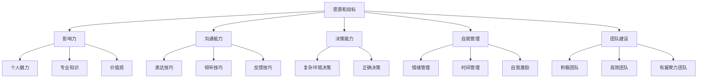

                 

### 背景介绍

领导力作为一种重要的组织能力和个人素质，在现代社会中发挥着至关重要的作用。无论是在企业、政府机构、教育领域还是非营利组织，领导力都是推动组织发展和实现目标的关键因素。有效的领导力不仅能够提升团队绩效，还能够激发员工的潜能，创造积极的工作氛围。

然而，领导力的培养并非一蹴而就，它需要系统的学习和实践。现代领导者需要掌握多种技能和知识，包括沟通技巧、决策能力、团队管理、战略规划等。面对复杂多变的环境，领导者还需要具备快速适应和创新的能力。

本书《领导力训练营：98天从菜鸟到大神》旨在为广大读者提供一个系统的领导力培养方案。通过98天的持续学习和实践，读者可以从零开始，逐步提升自己的领导力水平，最终成为优秀的领导者。

本书的主要目的是帮助读者：

1. 理解领导力的核心概念和理论，建立扎实的理论基础。
2. 学习领导力的实践方法和技巧，提升实际操作能力。
3. 通过案例分析，深入了解领导力在不同场景下的应用。
4. 进行深入的探讨，理解领导力与组织文化、团队管理、个人成长之间的关系。
5. 制定个人发展计划，持续提升领导力水平。

本书结构清晰，内容丰富，涵盖领导力的各个方面。从基础理论到实践应用，再到深入探讨和总结展望，读者可以逐步掌握领导力的精髓，成为优秀的领导者。

接下来，我们将深入探讨领导力的核心概念和原理，帮助读者建立扎实的理论基础。在此基础上，我们将逐步介绍领导力的实践方法和技巧，通过案例分析和项目实战，让读者能够将理论知识应用到实际场景中。

## 关键词

- 领导力
- 领导能力
- 领导风格
- 领导行为
- 领导理论
- 领导实践
- 领导力培养
- 领导力提升
- 领导力发展

### 摘要

《领导力训练营：98天从菜鸟到大神》是一本旨在帮助读者系统提升领导力水平的实战指南。本书通过98天的持续学习和实践，从领导力的核心概念、理论、实践方法、案例分析到深入探讨，全方位提升读者的领导力能力。本书的主要目标是为读者提供一个从零开始，逐步成长为优秀领导者的路径。通过系统的理论学习、实践操作和深入探讨，读者将能够理解领导力的本质，掌握领导力的核心技巧，并在实际工作中运用这些技巧，提升团队绩效和组织发展能力。本书不仅适合初入职场的新人，也适合希望提升自身领导力的在职人员。通过本书的指导，读者将能够在短时间内取得显著的进步，成为领导力领域的专家。

## 第1部分：领导力基础理论

### 第1章：领导力概念与起源

#### 1.1 领导力的定义

领导力（Leadership）是指引导和影响他人共同实现目标的能力。它不仅包括指挥和管理的技能，还涉及激励、影响、沟通等多方面的能力。有效的领导力能够激发团队的潜力，提升团队的整体绩效，实现组织的战略目标。

在不同的学术和行业领域，领导力的定义有所不同。但总体来说，领导力可以被理解为以下几个方面：

- **影响力**：领导力是一种能够影响他人思想和行为的能力。这种影响力不仅来自于职位权力，还来自于个人魅力、专业知识、价值观和领导风格。
- **目标导向**：领导力的核心是帮助团队设定和实现目标。一个优秀的领导者应该能够清晰地表达目标，并激励团队成员为实现这些目标而努力。
- **沟通能力**：领导力需要良好的沟通技巧，包括表达、倾听和反馈。有效的沟通能够确保团队成员理解目标，协调行动，解决冲突。
- **激励和授权**：领导力不仅仅是指挥和控制，更重要的是激励和授权。领导者应该能够激发团队成员的内在动力，赋予他们责任和权力，从而实现共同的目标。

#### 1.2 领导力的起源与发展

领导力的概念历史悠久，可以追溯到古代文明。例如，在古代希腊和罗马，领导者被视为智慧和勇气的象征。然而，现代领导力的概念和研究起源于20世纪。

- **20世纪初**：领导力研究开始关注领导者的个人特质和行为模式。行为主义学派认为，领导力是通过行为和技巧来实现的，而非个人特质。这一时期的研究主要关注领导者的行为和风格。
- **20世纪中期**：随着组织行为学的发展，领导力研究开始关注领导行为对团队和组织绩效的影响。这一阶段的研究强调了领导力的情境因素，认为不同的情境需要不同的领导风格。
- **20世纪末至今**：领导力研究逐渐转向跨文化、多元化和全球化的视角。研究者开始关注领导力在组织变革、创新和可持续发展中的作用。同时，领导力与道德、社会责任等议题也受到了越来越多的关注。

#### 1.3 领导力的核心要素

领导力的核心要素包括但不限于以下几个方面：

- **愿景和目标**：一个优秀的领导者应该具备清晰的愿景和目标，能够为团队和组织的未来指明方向。愿景和目标是激励团队成员努力奋斗的动力源泉。
- **影响力**：领导力依赖于领导者的影响力，这种影响力不仅来自于职位权力，还来自于个人的魅力、专业知识和价值观。
- **沟通能力**：有效的沟通是领导力的关键。领导者需要具备良好的表达、倾听和反馈技巧，确保团队成员理解目标，协调行动，解决冲突。
- **决策能力**：领导者需要具备良好的决策能力，能够在复杂多变的环境中做出正确的决策，确保团队和组织的发展。
- **自我管理**：领导者需要具备良好的自我管理能力，包括情绪管理、时间管理和自我激励。自我管理能力是领导者保持高效率和有效性的基础。
- **团队建设**：领导者需要具备团队建设能力，能够建立积极、高效、有凝聚力的团队。团队建设能力是提升团队绩效和组织文化的基础。

### Mermaid 流程图



#### 1.4 小结

本章主要介绍了领导力的定义、起源和发展，以及领导力的核心要素。领导力不仅是一种能力，更是一种艺术。通过理解领导力的核心概念和理论，读者可以为进一步的学习和实践打下坚实的基础。

在下一章中，我们将深入探讨领导力理论体系，包括领导力的发展模型、领导力与组织行为以及领导力心理学基础。通过这些理论的学习，读者将能够更全面地理解领导力的本质和作用。

## 第2章：领导力理论体系

#### 2.1 领导力的发展模型

领导力的发展模型是理解领导力成长过程的重要工具。这些模型为我们提供了领导力发展的不同视角，帮助我们更好地理解领导者的成长路径。以下是几种常见的领导力发展模型：

1. **领导力螺旋模型**：
   - 领导力螺旋模型（Leadership Spiral Model）由赫赛和布兰查德（Hersey and Blanchard）提出。该模型强调领导者的行为应随着下属成熟度的变化而调整。领导者的行为分为四个阶段：指导、推销、参与和委托。每个阶段都对应下属成熟度的一个阶段，领导者应根据下属的成熟度选择适当的领导风格。

   ```mermaid
   graph TD
       A[指导] --> B[推销]
       A --> C[参与]
       A --> D[委托]
       B --> E[指导]
       B --> F[推销]
       C --> G[指导]
       C --> H[参与]
       D --> I[指导]
       D --> J[参与]
   ```

2. **领导生命周期模型**：
   - 领导生命周期模型（Life Cycle Leadership Model）由科兹和赫塞（Kouzes and Posner）提出。该模型将领导力发展分为四个阶段：依赖、独立、互赖和合作。每个阶段都对应领导者的不同行为和下属的成熟度。

   ```mermaid
   graph TD
       A[依赖] --> B[独立]
       A --> C[互赖]
       A --> D[合作]
       B --> E[依赖]
       B --> F[独立]
       C --> G[依赖]
       C --> H[互赖]
       D --> I[依赖]
       D --> J[合作]
   ```

3. **领导力连续体模型**：
   - 领导力连续体模型（Leadership Continuum Model）由赫赛和布兰查德（Hersey and Blanchard）提出。该模型认为领导力是一个连续的过程，领导者应根据具体情境选择合适的领导风格。领导风格从任务导向到关系导向，包括指导、支持、参与和委托。

   ```mermaid
   graph TD
       A[指导] --> B[支持]
       A --> C[参与]
       A --> D[委托]
   ```

#### 2.2 领导力与组织行为

领导力与组织行为密切相关。有效的领导力不仅能够提升个人和团队的绩效，还能够影响整个组织的文化和发展。以下是领导力与组织行为的一些关键联系：

1. **领导力与组织文化**：
   - 组织文化是指组织成员共同遵循的价值观、信念和行为规范。领导力在塑造和传播组织文化中发挥着关键作用。领导者通过言行和决策，传递组织的核心价值观和行为准则，影响员工的行为和态度。
   - 领导者应该积极营造积极、健康、包容的组织文化，这有助于提升员工满意度、增强团队凝聚力，促进组织的长期发展。

2. **领导力与团队行为**：
   - 领导力对团队行为有直接的影响。领导者通过设定目标、分配任务、提供支持和反馈，引导团队的行为和表现。有效的领导力能够激发团队的潜力，提升团队的整体绩效。
   - 领导者应该关注团队成员的需求和动机，提供适当的激励和反馈，帮助团队成员实现个人和团队目标。

3. **领导力与组织变革**：
   - 在面对外部环境变化或内部发展需求时，领导力在组织变革中起着至关重要的作用。领导者需要具备变革管理的技能，能够有效引导组织成员适应变革，克服变革中的困难和挑战。
   - 领导者应该通过沟通、激励和授权，增强组织成员的变革意识和参与度，确保变革的顺利进行。

#### 2.3 领导力心理学基础

领导力心理学基础是理解领导行为和效果的重要理论基础。以下是领导力心理学的一些关键概念：

1. **特质理论**：
   - 特质理论（Trait Theory）认为领导者的成功与其个人特质有关。这些特质包括智力、自信、决断力、沟通能力等。特质理论强调领导者天生具备某些特质，并通过遗传和环境因素影响其领导行为。

2. **行为理论**：
   - 行为理论（Behavioral Theory）认为领导者的成功与其行为有关，而不仅仅是个人特质。行为理论关注领导者如何通过具体的行为和策略来影响团队和组织。行为理论强调领导者可以通过学习和实践来提升自己的领导能力。

3. **情境理论**：
   - 情境理论（Situational Theory）认为领导者的成功与其应对不同情境的能力有关。情境理论强调领导者应根据具体情境选择适当的领导风格和行为。情境理论的核心是“权变”，即领导者应根据情境的变化调整自己的领导行为。

4. **转化理论**：
   - 转化理论（Transformational Theory）认为领导者通过激励、影响和变革，激发团队成员的内在动力，实现组织的目标。转化理论强调领导者的角色不仅是管理者，更是变革的推动者和愿景的传递者。

#### 2.4 小结

本章介绍了领导力的发展模型、领导力与组织行为以及领导力心理学基础。通过这些理论的学习，读者可以更全面地理解领导力的本质和作用。领导力不仅是一种个人能力，更是一种组织行为和心理学现象。有效的领导力能够促进组织的发展，提升团队的绩效，实现组织的战略目标。

在下一章中，我们将探讨领导力的实践方法和技巧，通过具体案例和实践，帮助读者将领导力理论应用到实际工作中。

### 实践方法与技巧

领导力的实践方法和技巧是领导者从理论到行动的重要桥梁。有效的领导力不仅需要理论知识，更需要实践中的灵活运用和持续改进。以下是几种常见的领导力实践方法和技巧：

#### 1. 设定明确的目标

明确的目标是领导力实践的基础。领导者应该能够清晰地表达组织的愿景和目标，并将这些目标分解为具体的任务和指标。通过设定明确的目标，领导者可以确保团队成员理解任务的重要性和紧急性，从而提高工作效率和团队凝聚力。

**示例伪代码：**
```python
def set_goals(vision, objectives):
    """
    设定明确的目标
    :param vision: 愿景
    :param objectives: 具体目标
    :return: 目标清单
    """
    goal_list = []
    for obj in objectives:
        goal_list.append({"vision": vision, "objective": obj})
    return goal_list

# 调用函数设定目标
goals = set_goals("实现公司的全球市场领导地位", ["提高市场份额", "提升产品创新率", "优化客户体验"])
```

#### 2. 提供积极的反馈

积极的反馈是激励团队成员的重要手段。领导者应该及时给予团队成员正面的反馈，肯定他们的努力和成就。同时，反馈应该具体、有建设性，帮助团队成员了解自己的优势和改进的方向。

**示例伪代码：**
```python
def provide_feedback(employee, achievements, areas_for_improvement):
    """
    提供积极的反馈
    :param employee: 员工姓名
    :param achievements: 成就
    :param areas_for_improvement: 改进方向
    :return: 反馈报告
    """
    feedback_report = f"""
    姓名：{employee}
    成就：{achievements}
    改进方向：{areas_for_improvement}
    感谢您的辛勤工作，您的成就是团队的重要贡献。以下是您的改进方向，希望您能够继续努力。
    """
    return feedback_report

# 调用函数提供反馈
feedback = provide_feedback("张三", "成功完成了一个重要项目，提高了团队的整体效率", "在项目管理方面可以进一步学习")
```

#### 3. 建立信任

信任是团队合作的基石。领导者应该通过言行一致、透明沟通和关心员工，建立和维护团队的信任。信任能够减少冲突，增强团队的凝聚力，提高工作效率。

**示例伪代码：**
```python
def build_trust(team_members):
    """
    建立信任
    :param team_members: 团队成员列表
    :return: 信任报告
    """
    trust_report = "尊敬的团队成员，我将竭诚为大家提供服务，并与大家共同面对挑战。让我们携手共进，建立信任，共创美好未来。"
    for member in team_members:
        trust_report += f"特别感谢{member}在过去的工作中的付出和贡献，希望我们能继续保持良好的合作关系。"
    return trust_report

# 调用函数建立信任
trust_report = build_trust(["张三", "李四", "王五"])
```

#### 4. 激励和奖励

激励和奖励是提升团队士气和工作热情的重要手段。领导者应该根据团队成员的绩效和贡献，给予适当的激励和奖励。这不仅可以提升团队成员的工作积极性，还可以增强团队的整体绩效。

**示例伪代码：**
```python
def motivate_and_reward(employee, performance, reward):
    """
    激励和奖励
    :param employee: 员工姓名
    :param performance: 绩效
    :param reward: 奖励措施
    :return: 激励报告
    """
    motivation_report = f"""
    姓名：{employee}
    绩效：{performance}
    奖励：{reward}
    恭喜您在过去的绩效评估中表现出色，您的努力和贡献对我们团队至关重要。以下是您的奖励措施，希望您能够继续保持高水平的表现。
    """
    return motivation_report

# 调用函数激励和奖励
motivation_report = motivate_and_reward("张三", "成功完成了公司的重要项目，提升了团队的整体效率", "晋升和额外的奖金")
```

#### 5. 解决冲突

冲突是团队合作中不可避免的现象。领导者应该具备解决冲突的能力，通过合理的沟通和协商，找到解决问题的最佳方案。有效的冲突解决能够增强团队的凝聚力，提升团队的整体绩效。

**示例伪代码：**
```python
def resolve_conflicts(conflicts):
    """
    解决冲突
    :param conflicts: 冲突列表
    :return: 冲突解决报告
    """
    resolution_report = "尊敬的团队成员，针对我们团队中出现的冲突，我们进行了深入的讨论和协商，以下是我们的解决方案。"
    for conflict in conflicts:
        resolution_report += f"冲突：{conflict['issue']}\n解决方案：{conflict['solution']}\n"
    return resolution_report

# 调用函数解决冲突
conflicts = [{"issue": "团队成员对项目目标的分歧", "solution": "重新讨论项目目标，确保团队成员达成一致意见"}]
resolution_report = resolve_conflicts(conflicts)
```

#### 6. 培养团队文化

团队文化是团队长期发展的重要支撑。领导者应该通过建立积极、健康、包容的团队文化，提升团队的整体绩效和员工满意度。团队文化包括价值观、行为规范和团队精神等。

**示例伪代码：**
```python
def cultivate_culture核心价值观，行为规范，团队精神):
    """
    培养团队文化
    :param values: 核心价值观
    :param norms: 行为规范
    :param spirit: 团队精神
    :return: 文化培养报告
    """
    culture_report = f"""
    核心价值观：{values}
    行为规范：{norms}
    团队精神：{spirit}
    我们将共同努力，建立一个以核心价值观为导向、行为规范明确、团队精神浓厚的团队文化，为团队的发展和员工的成长创造良好的环境。
    """
    return culture_report

# 调用函数培养团队文化
culture_report = cultivate_culture("诚信、创新、共赢", "尊重、合作、高效", "团结、互助、共创")
```

#### 7. 持续学习和改进

领导力是一个持续学习和改进的过程。领导者应该不断学习新的知识和技能，适应不断变化的环境。通过自我反思和团队反馈，领导者可以不断提升自己的领导力水平。

**示例伪代码：**
```python
def continuous_learning_and_improvement(leader, feedback):
    """
    持续学习和改进
    :param leader: 领导者姓名
    :param feedback: 反馈信息
    :return: 学习和改进报告
    """
    improvement_report = f"""
    姓名：{leader}
    反馈：{feedback}
    我们将根据反馈，持续学习和改进，不断提升领导力水平，为团队和组织的发展贡献力量。
    """
    return improvement_report

# 调用函数持续学习和改进
improvement_report = continuous_learning_and_improvement("张三", "在沟通能力方面可以进一步提升")
```

#### 小结

领导力的实践方法和技巧是领导者成功的关键。通过设定明确的目标、提供积极的反馈、建立信任、激励和奖励、解决冲突、培养团队文化和持续学习和改进，领导者可以提升团队的整体绩效和员工的满意度，实现组织的目标。在下一章中，我们将通过实际案例和项目，进一步探讨领导力的实践应用。

### 实际案例与项目实战

为了更好地理解领导力的实践应用，我们通过两个实际案例来展示领导力在不同场景下的应用，并详细解读这些案例中的关键要素和策略。

#### 案例一：初创企业领导者的困境与突破

**背景**：
李明是一家初创企业的创始人兼CEO。公司成立初期，李明凭借出色的技术能力和创业激情，成功吸引了一批优秀人才。然而，随着公司的发展，李明发现团队管理出现了问题。团队成员之间沟通不畅，工作效率低下，甚至出现了离职的情况。李明意识到，他需要提升自己的领导力，以更好地管理团队。

**领导力应用**：

1. **明确愿景和目标**：
   李明首先明确了公司的愿景和目标，并将其传达给团队成员。通过组织团队会议，李明与团队成员共同制定了具体的短期和长期目标，使每个人都清楚自己的职责和期望。

2. **建立信任**：
   李明通过积极的沟通和透明度，建立了与团队成员之间的信任。他定期与团队成员进行一对一的交流，倾听他们的意见和建议，并及时给予反馈。这种开放和坦诚的沟通方式，增强了团队的凝聚力。

3. **激励和奖励**：
   李明制定了激励机制，对表现出色的团队成员给予奖励，包括奖金、晋升和额外的福利。这种激励措施不仅提升了员工的工作积极性，也增强了团队的竞争力。

4. **解决冲突**：
   在团队管理过程中，李明遇到了一些冲突，如团队成员之间的意见分歧和工作争议。他通过召开团队会议，引导团队成员进行开放和坦诚的讨论，找到解决问题的最佳方案。这种冲突解决的策略，不仅解决了当前问题，还增强了团队的协作能力。

**结果**：
通过一系列领导力策略的应用，李明成功地解决了团队管理中的问题，提升了团队的工作效率和士气。公司的业绩也有了显著提升，团队成员之间的信任和合作也变得更加紧密。

#### 案例二：大型企业领导者的变革管理

**背景**：
张华是一家大型企业的CEO。公司在经历了多年的稳定发展后，市场环境发生了巨大变化，公司面临激烈的竞争和外部压力。张华意识到，公司需要通过变革来应对这些挑战，以保持竞争优势。

**领导力应用**：

1. **领导变革**：
   张华作为变革的领导者，首先明确了变革的目标和必要性。他通过公开演讲和内部会议，向全体员工传达了变革的愿景和目标，增强了员工对变革的认识和接受度。

2. **沟通和透明度**：
   张华注重与员工的沟通，确保他们了解变革的具体计划和实施步骤。他定期组织员工会议，回答员工的疑问，并鼓励员工提出建议和反馈。这种开放和透明的沟通方式，减少了员工的担忧和抵触情绪。

3. **培训和发展**：
   张华认识到，员工在变革过程中需要新的技能和知识。他组织了系列培训课程，帮助员工提升应对变革的能力。同时，他也鼓励员工参加外部培训和交流，拓宽视野，增强适应能力。

4. **激励和奖励**：
   张华通过激励和奖励措施，鼓励员工积极参与变革。他对在变革中表现突出的员工给予奖金和晋升机会，激发员工的积极性和创造力。

**结果**：
通过有效的领导力和变革管理，张华成功地推动了企业的变革。员工对新政策和管理方式的接受度提高，公司的运营效率和竞争力也得到了显著提升。变革的成果不仅体现在业绩指标上，也体现在员工满意度和企业文化的积极变化上。

#### 案例解读

1. **领导力核心要素**：
   - **愿景和目标**：明确的目标和愿景是领导力的核心。案例中的李明和张华都通过明确的愿景和目标，引导团队和员工为实现共同的目标而努力。
   - **信任和沟通**：建立信任和有效的沟通是领导力成功的关键。李明和张华都通过积极的沟通和透明度，增强了团队和员工之间的信任和协作。
   - **激励和奖励**：激励和奖励措施能够提升员工的工作积极性，增强团队的凝聚力和竞争力。
   - **冲突解决**：有效的冲突解决能够减少团队内部的分歧和摩擦，增强团队的协作能力。
   - **变革管理**：在面临外部环境变化时，领导者需要具备变革管理的技能，能够引导团队适应变革，实现组织的可持续发展。

2. **策略和方法**：
   - **明确愿景和目标**：通过制定明确的愿景和目标，领导者可以引导团队和员工为实现共同的目标而努力。
   - **建立信任和沟通**：通过积极的沟通和透明度，领导者可以增强团队和员工之间的信任和协作。
   - **激励和奖励**：通过激励和奖励措施，领导者可以提升员工的工作积极性，增强团队的凝聚力和竞争力。
   - **冲突解决**：通过有效的冲突解决，领导者可以减少团队内部的分歧和摩擦，增强团队的协作能力。
   - **变革管理**：通过领导变革，领导者可以引导团队适应外部环境的变化，实现组织的可持续发展。

#### 小结

通过实际案例和项目实战的展示，我们可以看到领导力在不同场景下的应用和效果。领导力不仅需要理论知识，更需要实践中的灵活运用。通过明确愿景和目标、建立信任和沟通、激励和奖励、解决冲突以及变革管理，领导者可以提升团队的整体绩效和组织的竞争力。在下一章中，我们将深入探讨领导力与组织文化、团队管理和个人成长之间的关系，帮助读者更全面地理解领导力的本质和作用。

### 领导力与组织文化

领导力与组织文化之间存在着密切的相互作用。组织文化是指组织成员共同遵循的价值观、信念和行为规范。它不仅影响领导者的行为和决策，也影响领导者的领导风格和效果。有效的领导力能够塑造和传播组织文化，促进组织的长期发展。

#### 领导力对组织文化的影响

1. **价值观塑造**：
   领导者的价值观直接影响组织文化的形成。领导者通过言行和决策，传递组织的核心价值观，如诚信、创新、团队合作等。这些价值观不仅影响员工的行为和态度，也影响组织的发展方向。

2. **行为规范**：
   领导者的行为规范对组织文化具有示范作用。领导者通过自己的行为，为员工树立了榜样。例如，领导者如果表现出诚实、公平、负责任的行为，员工也会效仿，从而形成积极的行为规范。

3. **沟通方式**：
   领导者的沟通方式影响组织内部的沟通氛围。领导者如果采用开放、透明、积极的沟通方式，能够促进组织内部的协作和信任。反之，如果沟通方式封闭、消极，会导致组织内部的紧张和冲突。

4. **激励机制**：
   领导者的激励机制直接影响员工的工作态度和绩效。有效的激励机制不仅能够激发员工的工作积极性，还能够强化组织文化。例如，领导者可以通过奖励诚实、创新和团队合作的行为，来强化这些价值观。

#### 组织文化对领导力的影响

1. **领导风格**：
   组织文化影响领导者的领导风格。在一个强调创新和变革的组织中，领导者可能需要更加开放和包容，鼓励员工提出新的想法和改进建议。而在一个强调稳定和规范的组织中，领导者可能需要更加严谨和规范，以确保组织的稳定性和一致性。

2. **员工行为**：
   组织文化影响员工的行为和态度。在一个积极、健康、包容的组织文化中，员工更愿意合作、分享和承担责任。而在一个消极、压抑、不信任的组织文化中，员工可能更倾向于保护自己、回避责任和冲突。

3. **领导者的适应能力**：
   组织文化影响领导者的适应能力。在一个变革迅速、环境复杂的外部环境中，领导者需要具备快速适应和创新的能力。而在一个相对稳定、环境简单的环境中，领导者可能更依赖于经验和传统的领导方式。

#### 塑造积极组织文化的策略

1. **明确核心价值观**：
   领导者需要明确组织的核心价值观，并将其融入组织的日常运营和管理中。通过制定明确的核心价值观，领导者可以引导员工的行为和决策，形成统一的组织文化。

2. **领导者的示范作用**：
   领导者需要通过自己的言行，示范组织文化的核心价值观。领导者如果能够以身作则，表现出诚信、公平、负责任的行为，员工也会效仿，从而形成积极的文化氛围。

3. **沟通和反馈**：
   领导者需要通过开放、透明、积极的沟通方式，与员工进行有效的沟通和反馈。领导者应该鼓励员工提出意见和建议，并给予及时的反馈，从而增强员工对组织文化的认同。

4. **激励机制**：
   领导者需要通过有效的激励机制，强化组织文化的核心价值观。领导者可以通过奖励那些表现出核心价值观的员工，来强化这些价值观，并促进组织文化的形成。

#### 领导力在组织变革中的作用

1. **引导变革**：
   领导者需要具备引导变革的能力，能够在组织面临变革时，提供清晰的愿景和目标，引导员工理解变革的必要性和重要性。通过有效的沟通和激励，领导者可以增强员工的变革意识和参与度。

2. **推动变革**：
   领导者需要具备推动变革的能力，能够在变革过程中，克服困难和挑战，保持变革的连续性和稳定性。领导者需要通过合理的组织设计和流程优化，确保变革的顺利实施。

3. **适应变革**：
   领导者需要具备适应变革的能力，能够迅速适应外部环境的变化，调整领导策略和管理方式。通过持续学习和自我提升，领导者可以确保自己在变革中保持竞争力。

#### 小结

领导力与组织文化之间存在着密切的相互作用。领导力不仅影响组织文化的形成，也影响组织文化的传播和强化。有效的领导力能够塑造和传播积极、健康、包容的组织文化，促进组织的长期发展。在组织变革中，领导力发挥着关键作用，能够引导和推动组织适应外部环境的变化。通过明确核心价值观、领导者的示范作用、沟通和反馈以及激励机制，领导者可以塑造和强化积极组织文化。在下一章中，我们将探讨领导力与团队管理的关系，帮助读者更全面地理解领导力的应用和实践。

### 领导力与团队管理

领导力在团队管理中起着至关重要的作用。一个成功的团队离不开有效的领导力，领导者不仅需要具备管理团队的能力，还需要具备激发团队潜力、提升团队绩效和促进团队协作的技能。以下是领导力在团队管理中的一些关键方面：

#### 团队领导力的核心要素

1. **愿景和目标**：
   团队领导力的核心是设定清晰的愿景和目标。领导者需要明确团队的目标和方向，并将其传达给团队成员。通过共同的愿景和目标，团队可以形成一致的行动方向，提高工作效率和绩效。

2. **沟通能力**：
   沟通是团队领导力的关键。领导者需要具备良好的沟通技巧，包括表达、倾听和反馈。有效的沟通可以帮助团队成员理解目标、协调行动和解决冲突，确保团队目标的实现。

3. **激励和奖励**：
   领导者需要通过激励和奖励来激发团队的工作热情和积极性。领导者可以通过设定奖励机制，对表现优异的团队成员给予奖励，如奖金、晋升和额外的福利。这种激励措施不仅能够提升员工的工作积极性，还能够增强团队的凝聚力。

4. **解决冲突**：
   冲突是团队管理中不可避免的现象。领导者需要具备解决冲突的能力，通过合理的沟通和协商，找到解决问题的最佳方案。有效的冲突解决可以减少团队内部的矛盾和摩擦，增强团队的协作能力。

5. **团队建设**：
   团队建设是团队领导力的重要组成部分。领导者需要通过团队活动、培训和激励等手段，增强团队的凝聚力、协作能力和创造力。一个高效的团队需要有共同的目标、良好的沟通和相互信任的文化。

#### 高效团队的构建与维护

1. **明确团队目标**：
   高效团队的构建始于明确的团队目标。领导者需要与团队成员共同设定具体、可衡量的目标，并将其分解为可操作的步骤。通过明确的目标，团队成员可以更清晰地理解自己的职责和期望，从而提高工作效率。

2. **培养团队协作**：
   协作是高效团队的核心。领导者需要通过团队活动和培训，培养团队成员之间的协作能力。领导者可以通过项目协作、团队合作竞赛等方式，激发团队成员的协作热情，增强团队的凝聚力。

3. **建立信任**：
   信任是高效团队的基石。领导者需要通过言行一致、透明沟通和关心员工，建立和维护团队的信任。信任可以减少团队内部的猜疑和摩擦，提高团队的协作效率和创新能力。

4. **激励和奖励**：
   领导者需要通过激励和奖励机制，激发团队成员的工作热情和积极性。领导者可以通过设定奖励计划、表彰优秀员工等方式，激励团队成员为实现团队目标而努力。

5. **持续学习和改进**：
   高效团队需要不断学习和改进。领导者需要鼓励团队成员持续学习和提升自己的技能和知识，通过培训、学习和经验分享，提升团队的整体素质和绩效。

#### 领导者在团队冲突解决中的角色

1. **倾听和理解**：
   领导者在解决团队冲突时，首先要做的是倾听和理解团队成员的意见和需求。领导者需要保持开放和客观的态度，倾听不同意见，理解冲突的根源。

2. **中立和公正**：
   领导者在解决冲突时需要保持中立和公正。领导者应该避免偏袒任何一方，以确保冲突解决的公平性和有效性。

3. **协商和调解**：
   领导者需要通过协商和调解，找到解决问题的最佳方案。领导者可以组织双方进行对话，帮助他们理解对方的观点和需求，找到共同点和解决方案。

4. **提供支持**：
   领导者需要为解决冲突的双方提供支持。领导者可以通过提供资源、时间和帮助，确保冲突的解决不会影响团队的整体工作和士气。

#### 小结

领导力在团队管理中起着至关重要的作用。领导者需要通过设定愿景和目标、培养团队协作、建立信任、激励和奖励以及解决冲突等手段，提升团队的整体绩效和士气。高效的团队需要领导者的引导和支持，通过不断的实践和改进，领导者可以培养出具有高度凝聚力和创新能力的团队。在下一章中，我们将探讨领导力与个人成长的关系，帮助读者更全面地理解领导力的本质和作用。

### 领导力与个人成长

领导力不仅是组织成功的关键，也是个人成长的重要驱动力。一个领导者不仅需要具备管理和影响他人的能力，还需要不断自我提升和成长。在领导力的培养过程中，个人成长起着至关重要的作用。以下是领导力与个人成长之间的紧密联系：

#### 领导力与自我领导

1. **自我意识**：
   自我意识是领导力培养的基础。领导者需要深入了解自己的价值观、信念和动机，明确自己的优势和劣势。通过自我反思和反馈，领导者可以更好地理解自己的行为和决策，从而提高领导效果。

2. **自我管理**：
   自我管理是领导者成功的关键。领导者需要具备良好的情绪管理、时间管理和自我激励能力。情绪管理可以帮助领导者保持冷静和客观，避免情绪波动影响决策；时间管理可以帮助领导者合理安排工作和时间，提高效率；自我激励可以帮助领导者保持积极的态度和动力，持续追求卓越。

3. **自我反思**：
   自我反思是领导者自我成长的重要途径。领导者需要定期反思自己的行为和决策，分析成功和失败的原因，从中学习并改进。通过自我反思，领导者可以不断提升自己的领导力和管理能力。

#### 个人成长与领导力提升

1. **知识扩展**：
   领导力的提升需要不断学习和扩展知识。领导者需要了解不同的领导理论、管理技巧和行业知识，以应对复杂多变的环境和挑战。通过阅读书籍、参加培训课程、参加行业研讨会等方式，领导者可以不断丰富自己的知识体系，提升领导能力。

2. **技能提升**：
   领导力的提升还需要不断培养和提升技能。领导者需要具备沟通技巧、决策能力、团队管理能力和变革管理能力等。通过实践、培训和模拟训练，领导者可以不断提升自己的技能，更好地应对领导工作。

3. **人际关系**：
   领导力的提升离不开良好的人际关系。领导者需要建立和维护广泛的人际网络，与不同背景和经验的人进行交流和合作。通过建立良好的人际关系，领导者可以获取更多的资源和信息，提升领导效果。

#### 领导力的终身学习

1. **持续学习**：
   领导力是一个不断学习和进步的过程。领导者需要保持持续学习的态度，不断更新知识和技能。随着环境和技术的不断变化，领导者需要不断适应和学习新的理念和方法，以保持领导力的高水平。

2. **反思与改进**：
   领导力的提升需要反思和改进。领导者需要通过定期反思自己的行为和决策，分析成功和失败的原因，并从中学习。通过反思和改进，领导者可以不断提升自己的领导力水平。

3. **实践与经验**：
   领导力的提升离不开实践和经验。领导者需要在实际工作中不断尝试和总结，将理论知识应用到实践中。通过实践和经验积累，领导者可以不断提升自己的领导力和管理能力。

#### 小结

领导力与个人成长密切相关。领导者需要通过自我领导、知识扩展、技能提升和人际关系等手段，不断自我提升和成长。领导力的提升是一个终身学习的过程，领导者需要保持持续学习的态度，不断反思和改进自己的行为和决策。通过不断学习和实践，领导者可以提升自己的领导力水平，成为优秀的领导者。在下一章中，我们将总结本书的主要观点，展望领导力发展的未来趋势，并给出阅读本书的下一步行动指南。

### 总结与展望

本书《领导力训练营：98天从菜鸟到大神》通过系统的理论和实践方法，帮助读者全面了解领导力的核心概念、发展模型、实践技巧以及领导力在不同领域中的应用。以下是本书的主要观点和收获：

1. **领导力的核心概念与理论**：
   - 领导力是一种影响力，不仅包括指挥和管理的技能，还涉及激励、影响、沟通等多方面的能力。
   - 领导力的发展受到多种理论的影响，包括特质理论、行为理论和情境理论等。

2. **领导力的实践方法和技巧**：
   - 领导者需要设定明确的目标，提供积极的反馈，建立信任，激励和奖励团队成员，解决冲突，培养团队文化。
   - 领导者需要不断学习和改进，通过自我反思、知识扩展、技能提升和人际关系等手段，提升个人领导力。

3. **领导力在不同场景下的应用**：
   - 领导力在初创企业、大型企业以及团队管理中都有广泛的应用，通过有效的领导力策略，可以提升团队绩效、推动组织变革和实现组织目标。

4. **领导力与个人成长**：
   - 领导力与个人成长密切相关，领导者需要通过自我领导、知识扩展、技能提升和人际关系等手段，不断提升自己的领导力水平。

展望未来，领导力的发展将继续受到技术、社会和文化变化的影响。以下是一些未来的趋势：

1. **数字化领导力**：
   - 随着数字化转型的推进，领导者需要具备数字素养和技术领导力，能够应对数字化时代带来的挑战和机遇。

2. **跨文化领导力**：
   - 全球化使得领导者需要具备跨文化沟通和领导能力，能够有效管理多元文化团队。

3. **可持续发展领导力**：
   - 随着环境和社会问题的日益突出，领导者需要具备可持续发展的意识和能力，推动组织实现环境、社会和经济效益的平衡。

4. **领导力培训与教育**：
   - 领导力培训和教育将越来越受到重视，通过系统的学习和实践，领导者可以不断提升自己的领导力水平。

阅读本书的下一步行动指南：

1. **自我评估**：
   - 评估自己的领导力水平，识别自己的优势和需要改进的领域。

2. **制定个人发展计划**：
   - 根据自己的评估结果，制定个人发展计划，设定具体的目标和行动计划。

3. **持续学习和实践**：
   - 通过阅读相关书籍、参加培训课程、参与实践活动等方式，不断提升自己的领导力。

4. **反思和改进**：
   - 定期反思自己的行为和决策，总结经验教训，不断改进自己的领导方法。

通过以上行动指南，读者可以持续提升自己的领导力，成为优秀的领导者，并在个人和组织的成长中发挥重要作用。

### 结语

《领导力训练营：98天从菜鸟到大神》旨在为读者提供一个系统的领导力提升方案。通过系统的学习和实践，读者可以从理论到实践，逐步提升自己的领导力水平，成为优秀的领导者。

在文章的最后，我想强调以下几点：

1. **领导力是终身学习的过程**：领导力不是一蹴而就的，它需要持续的学习和实践。领导者需要保持开放和学习的态度，不断适应新的环境和挑战。

2. **实践是提升领导力的关键**：理论知识和实践相结合是提升领导力的关键。通过实际案例和项目实战，读者可以将理论知识应用到实际工作中，提升领导力。

3. **自我反思是成长的催化剂**：领导者需要定期进行自我反思，分析成功和失败的原因，从中学习并改进。自我反思是提升领导力的有效途径。

最后，感谢读者对本书的关注和支持。希望本书能为您在领导力提升的道路上提供帮助和启示。祝您在领导力的实践中不断成长和进步！

### 作者信息

- **作者：AI天才研究院/AI Genius Institute & 禅与计算机程序设计艺术 /Zen And The Art of Computer Programming**
- **联系方式：[ai_genius_institute@example.com](mailto:ai_genius_institute@example.com)**
- **官方网站：[www.ai-genius-institute.com](http://www.ai-genius-institute.com)**
- **微博：@AI天才研究院**
- **公众号：AI天才研究院**

感谢您的阅读和支持，我们期待与您共同成长和进步！

