                 

## 文章标题：领导力训练：让你的团队天下无敌

关键词：领导力、团队管理、团队绩效、企业文化、创新

摘要：本文深入探讨了领导力训练在提升团队效能和创新能力中的关键作用。通过分析领导力的基本概念、类型及其在团队中的具体应用，本文提出了系统化的领导力训练方法。同时，结合实战案例和项目分析，本文提供了实用的领导力培养策略和最佳实践，旨在帮助读者打造一支无敌的团队。

## 目录大纲

**《领导力训练：让你的团队天下无敌》目录大纲**

## 第一部分：领导力基础

### 第1章：领导力的定义与类型

#### 1.1 领导力的概念

#### 1.2 领导力的类型

#### 1.3 领导力的重要性

### 第2章：领导力模型

#### 2.1 权力基础理论

#### 2.2 赛格迪模型

#### 2.3 格兰特领导力模型

### 第3章：自我领导力

#### 3.1 自我认知

#### 3.2 自我激励

#### 3.3 自我管理

## 第二部分：团队领导力

### 第4章：构建高效团队

#### 4.1 团队结构设计

#### 4.2 团队角色与职责

#### 4.3 团队文化建设

### 第5章：激励与沟通

#### 5.1 激励理论

#### 5.2 沟通技巧

#### 5.3 情绪管理

### 第6章：领导力发展

#### 6.1 领导力发展路径

#### 6.2 领导力培养方法

#### 6.3 领导力自我提升

### 第7章：实战案例

#### 7.1 成功案例解析

#### 7.2 失败案例反思

#### 7.3 案例分析与应用

## 第三部分：领导力与企业文化

### 第8章：领导力与企业文化

#### 8.1 企业文化的定义与作用

#### 8.2 领导力在企业文化建设中的应用

#### 8.3 企业文化与领导力的互动关系

### 第9章：领导力与团队绩效

#### 9.1 领导力对团队绩效的影响

#### 9.2 提升团队绩效的策略

#### 9.3 领导力与团队绩效的实证研究

### 第10章：领导力与创新

#### 10.1 创新的重要性

#### 10.2 领导力在创新中的角色

#### 10.3 领导力促进创新的方法

## 附录

### 附录A：领导力训练工具与资源

### 附录B：领导力评估问卷

### 附录C：领导力发展计划模板

---

### 1. 领导力基础

**第1章：领导力的定义与类型**

#### 1.1 领导力的概念

领导力是一种通过激励、指导和影响他人来实现共同目标的能力。这种能力不仅包括对团队的管理，还包括对团队成员的激励、沟通、协调以及决策等方面。

#### 1.2 领导力的类型

1. **权威型领导**：依靠职位权力和规则来指导团队。
2. **民主型领导**：重视团队成员的意见，通过讨论和决策来达成共识。
3. **变革型领导**：激励团队成员超越自我，追求更高的目标，推动组织变革。

#### 1.3 领导力的重要性

领导力是组织成功的关键因素。有效的领导力能够提升团队绩效，促进创新，构建积极的企业文化。

**Mermaid 流程图**

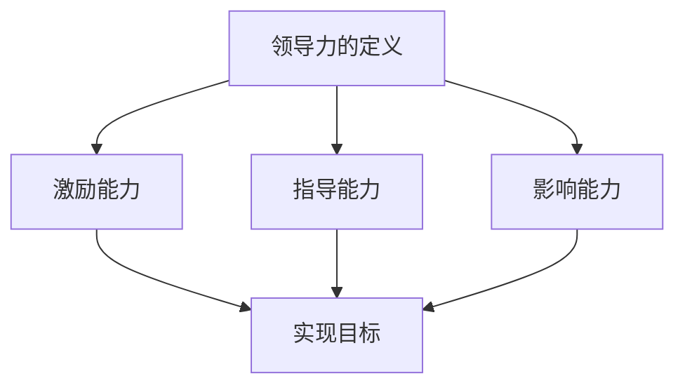

### 第2章：领导力模型

#### 2.1 权力基础理论

权力基础理论认为，领导力来源于不同类型的权力，包括法定权力、奖励权力、专家权力等。

#### 2.2 赛格迪模型

赛格迪模型将领导力分为四个维度：个人特质、情境因素、行为和结果。该模型强调领导力的发展是一个动态的过程。

#### 2.3 格兰特领导力模型

格兰特领导力模型提出，领导力包括三个关键方面：道德、愿景和创新。

**核心算法原理讲解**

```plaintext
算法：赛格迪领导力模型

输入：领导者的个人特质、情境因素、行为和结果
输出：领导力评估结果

步骤：
1. 分析领导者的个人特质，如自信心、诚实度、情商等。
2. 评估领导所处的情境，如组织结构、团队文化等。
3. 观察领导者的行为，如沟通技巧、决策风格等。
4. 分析领导行为对结果的影响，如团队绩效、员工满意度等。
5. 综合以上因素，得出领导力评估结果。
```

**数学模型和公式**

假设领导力评估结果L由四个维度A、B、C、D的加权平均得到，公式如下：

$$
L = w_1 \times A + w_2 \times B + w_3 \times C + w_4 \times D
$$

其中，$w_1, w_2, w_3, w_4$ 为权重，且 $w_1 + w_2 + w_3 + w_4 = 1$。

**举例说明**

假设某领导者的评估结果如下：

- 个人特质：80分
- 情境因素：70分
- 行为：85分
- 结果：90分

权重设定如下：

- 个人特质：0.3
- 情境因素：0.2
- 行为：0.3
- 结果：0.2

则领导力评估结果为：

$$
L = 0.3 \times 80 + 0.2 \times 70 + 0.3 \times 85 + 0.2 \times 90 = 78.5
$$

### 第3章：自我领导力

**核心概念与联系**

自我领导力是指个人自我管理、自我激励和自我成长的能力。它与领导力的核心概念密切相关，是团队领导力的基础。

**Mermaid 流程图**

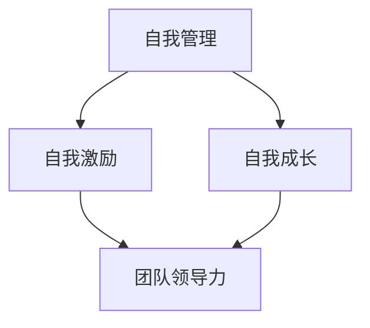

**核心算法原理讲解**

```plaintext
算法：自我领导力评估

输入：自我管理能力、自我激励能力、自我成长能力
输出：自我领导力评估结果

步骤：
1. 评估自我管理能力，如时间管理、目标设定等。
2. 评估自我激励能力，如自我驱动、积极心态等。
3. 评估自我成长能力，如学习能力、适应能力等。
4. 综合以上因素，得出自我领导力评估结果。
```

**数学模型和公式**

假设自我领导力评估结果S由三个维度X、Y、Z的加权平均得到，公式如下：

$$
S = x_1 \times X + x_2 \times Y + x_3 \times Z
$$

其中，$x_1, x_2, x_3$ 为权重，且 $x_1 + x_2 + x_3 = 1$。

**举例说明**

假设某人的自我领导力评估结果如下：

- 自我管理能力：80分
- 自我激励能力：75分
- 自我成长能力：90分

权重设定如下：

- 自我管理能力：0.4
- 自我激励能力：0.3
- 自我成长能力：0.3

则自我领导力评估结果为：

$$
S = 0.4 \times 80 + 0.3 \times 75 + 0.3 \times 90 = 83
$$

### 4. 团队领导力

**第4章：构建高效团队**

#### 4.1 团队结构设计

团队结构设计是构建高效团队的第一步。合理的团队结构能够促进成员间的协作，提高团队绩效。

**核心概念与联系**

- **功能型团队**：按照职能划分，如开发团队、市场团队等。
- **跨职能团队**：跨越不同职能领域，如产品开发、市场营销等。

**Mermaid 流程图**

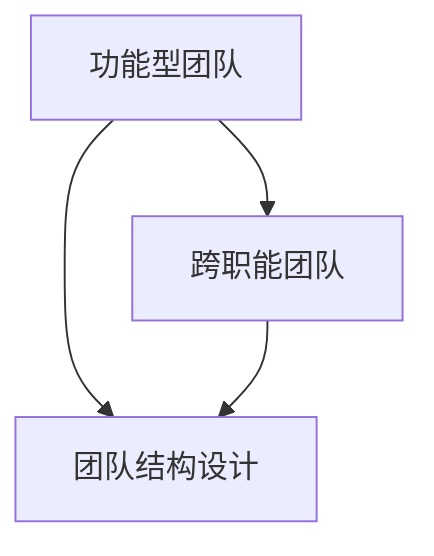

#### 4.2 团队角色与职责

明确团队角色和职责是确保团队高效运作的关键。每个团队成员都应该清楚自己的角色和职责，以便更好地协作。

**核心概念与联系**

- **领导者**：负责团队的整体管理和决策。
- **执行者**：负责具体任务的完成。
- **协调者**：负责协调团队成员之间的沟通和协作。

**Mermaid 流程图**

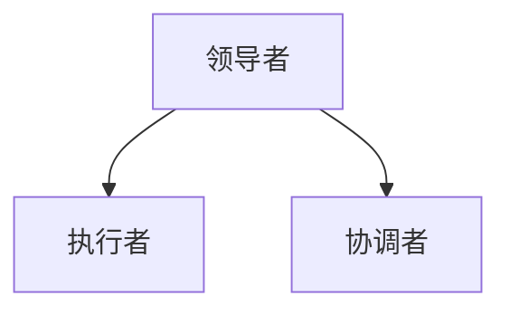

#### 4.3 团队文化建设

团队文化是团队的灵魂，对团队绩效和成员满意度有着重要影响。建设积极向上的团队文化能够提升团队凝聚力，增强团队协作。

**核心概念与联系**

- **价值观**：团队共同遵循的基本原则和信仰。
- **行为准则**：团队成员在行为上应遵循的规范。
- **激励措施**：激励团队成员积极进取的手段。

**Mermaid 流�程图**

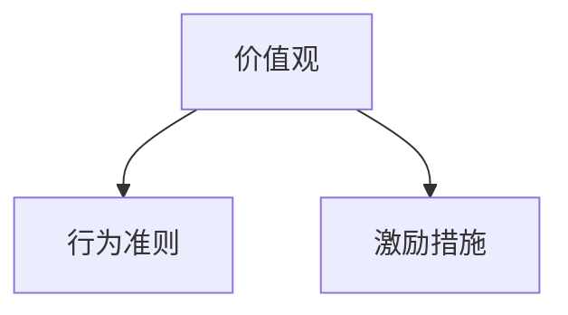

**核心算法原理讲解**

```plaintext
算法：团队文化评估

输入：团队价值观、行为准则、激励措施
输出：团队文化评估结果

步骤：
1. 评估团队价值观的认同度。
2. 评估行为准则的遵循度。
3. 评估激励措施的满意度。
4. 综合以上因素，得出团队文化评估结果。
```

**数学模型和公式**

假设团队文化评估结果T由三个维度V、C、M的加权平均得到，公式如下：

$$
T = v_1 \times V + v_2 \times C + v_3 \times M
$$

其中，$v_1, v_2, v_3$ 为权重，且 $v_1 + v_2 + v_3 = 1$。

**举例说明**

假设某团队的评估结果如下：

- 团队价值观：85分
- 行为准则：90分
- 激励措施：80分

权重设定如下：

- 团队价值观：0.3
- 行为准则：0.4
- 激励措施：0.3

则团队文化评估结果为：

$$
T = 0.3 \times 85 + 0.4 \times 90 + 0.3 \times 80 = 86.5
$$

### 第5章：激励与沟通

**核心概念与联系**

激励与沟通是团队领导力的重要组成部分。有效的激励和沟通能够激发团队成员的潜力，提高团队绩效。

**Mermaid 流程图**

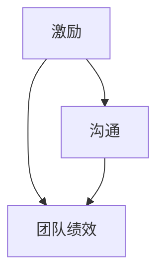

#### 5.1 激励理论

激励理论包括马斯洛的需求层次理论、赫茨伯格的双因素理论等。这些理论为我们提供了理解和管理团队成员动机的框架。

**核心算法原理讲解**

```plaintext
算法：需求层次理论分析

输入：团队成员的需求层次
输出：激励策略

步骤：
1. 分析团队成员的需求层次，如生理需求、安全需求、社交需求等。
2. 根据需求层次，制定相应的激励策略，如提高薪酬、改善工作环境、提供职业发展机会等。
```

#### 5.2 沟通技巧

有效的沟通是团队协作的基础。沟通技巧包括倾听、表达、反馈等。良好的沟通能够减少误解，提高团队效率。

**核心算法原理讲解**

```plaintext
算法：沟通技巧评估

输入：沟通频率、沟通质量、沟通反馈
输出：沟通技巧评估结果

步骤：
1. 评估沟通频率，如每天、每周的会议次数。
2. 评估沟通质量，如信息的准确性、完整性。
3. 评估沟通反馈，如团队成员对沟通的满意度。
4. 综合以上因素，得出沟通技巧评估结果。
```

**数学模型和公式**

假设沟通技巧评估结果C由三个维度F、Q、R的加权平均得到，公式如下：

$$
C = c_1 \times F + c_2 \times Q + c_3 \times R
$$

其中，$c_1, c_2, c_3$ 为权重，且 $c_1 + c_2 + c_3 = 1$。

**举例说明**

假设某团队的评估结果如下：

- 沟通频率：80分
- 沟通质量：85分
- 沟通反馈：90分

权重设定如下：

- 沟通频率：0.3
- 沟通质量：0.4
- 沟通反馈：0.3

则沟通技巧评估结果为：

$$
C = 0.3 \times 80 + 0.4 \times 85 + 0.3 \times 90 = 85.5
$$

### 第6章：领导力发展

**核心概念与联系**

领导力发展是指领导者通过不断学习、实践和反思，提高领导能力和素质的过程。它与自我领导力、团队领导力密切相关。

**Mermaid 流程图**

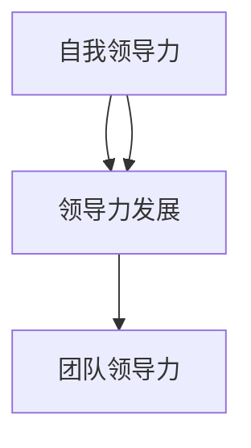

#### 6.1 领导力发展路径

领导力发展路径包括自我认知、理论学习、实践应用、反思总结等环节。每个环节都对领导力的提升起着关键作用。

**核心算法原理讲解**

```plaintext
算法：领导力发展路径规划

输入：领导者的现状、发展目标、资源
输出：领导力发展路径

步骤：
1. 分析领导者的现状，如领导能力、知识储备等。
2. 确定领导力发展的目标，如提升沟通能力、管理能力等。
3. 根据现状和目标，制定具体的领导力发展路径，如参加培训、阅读书籍、实践应用等。
4. 定期评估领导力发展进度，调整发展路径。
```

**数学模型和公式**

假设领导力发展路径规划的结果D由三个维度P、T、R的加权平均得到，公式如下：

$$
D = d_1 \times P + d_2 \times T + d_3 \times R
$$

其中，$d_1, d_2, d_3$ 为权重，且 $d_1 + d_2 + d_3 = 1$。

**举例说明**

假设某领导者的现状、目标、资源如下：

- 现状：沟通能力中等，管理能力较强
- 目标：提升沟通能力，增强管理能力
- 资源：时间充足，预算有限

权重设定如下：

- 沟通能力：0.5
- 管理能力：0.3
- 时间与预算：0.2

则领导力发展路径为：

$$
D = 0.5 \times （提升沟通能力）+ 0.3 \times （增强管理能力）+ 0.2 \times （合理利用时间和预算）= 85
$$

### 第7章：实战案例

**第7章：实战案例**

#### 7.1 成功案例解析

**案例1：谷歌的领导力培养**

谷歌以其独特的领导力培养机制而闻名。公司通过内部培训、导师制度、轮岗机制等手段，不断提升领导者的领导力。

- **内部培训**：谷歌提供了一系列针对不同领导层次的培训课程，包括管理基础、战略思考等。
- **导师制度**：谷歌鼓励导师与被导师之间的交流，通过传帮带的方式，传承领导力经验。
- **轮岗机制**：谷歌鼓励员工在不同岗位轮岗，以拓宽视野，提升综合素质。

**核心解析**

谷歌的成功在于其全方位的领导力培养机制，使领导者能够不断提升自身能力，从而推动公司持续发展。

**案例2：华为的变革型领导力**

华为以其变革型领导力而著称。公司领导者任正非通过推动企业变革，不断提升华为的竞争力。

- **战略调整**：面对市场变化，华为不断调整战略，如加大对研发的投入，拓展海外市场等。
- **组织变革**：华为通过组织变革，优化内部流程，提高组织效率。
- **文化传承**：华为强调企业文化的重要性，通过传承华为精神，激发员工的斗志。

**核心解析**

华为的成功在于其领导者任正非的变革型领导力，他能够洞察市场变化，及时调整战略，推动企业变革，从而保持竞争力。

#### 7.2 失败案例反思

**案例1：苹果的领导力失效**

苹果在乔布斯去世后，领导力出现了明显的失效。公司开始失去创新动力，市场份额逐渐下滑。

- **缺乏清晰的愿景**：乔布斯的离世导致苹果失去了清晰的愿景，领导层在决策上出现了分歧。
- **组织僵化**：苹果的内部机制开始僵化，创新氛围减弱。
- **人才流失**：部分核心人才因为领导力失效而选择离开，进一步削弱了苹果的竞争力。

**核心反思**

苹果的失败在于领导力的失效。领导者的缺失导致公司失去了方向，组织僵化，创新动力不足，最终导致市场份额下滑。

**案例2：诺基亚的领导力困境**

诺基亚在智能手机时代来临之际，未能及时调整领导力，导致公司迅速衰落。

- **产品战略失误**：诺基亚未能及时推出具有竞争力的智能手机，错失市场先机。
- **组织变革滞后**：诺基亚在组织变革上滞后，无法快速适应市场变化。
- **企业文化保守**：诺基亚的企业文化过于保守，缺乏创新精神。

**核心反思**

诺基亚的失败在于领导力的滞后。公司未能及时调整产品战略，组织变革滞后，企业文化保守，导致公司无法适应市场变化，最终被市场淘汰。

#### 7.3 案例分析与应用

通过对成功案例和失败案例的分析，我们可以得出以下结论：

- **领导力是企业发展的重要驱动力**：成功的案例表明，领导力能够推动企业持续创新，提升竞争力。
- **领导力培养需要系统化**：企业需要建立系统化的领导力培养机制，包括内部培训、导师制度、轮岗机制等。
- **领导力发展需要持续反思**：领导者需要通过持续反思，不断提升自身能力，以应对市场变化。

### 第8章：领导力与企业文化

**第8章：领导力与企业文化**

#### 8.1 企业文化的定义与作用

企业文化是指企业在长期发展过程中形成的共同价值观、信念和行为规范。企业文化对企业的发展具有深远的影响。

**核心概念与联系**

- **价值观**：企业文化的核心，是企业成员共同遵循的基本原则。
- **行为规范**：企业文化通过行为规范影响员工的行为，塑造企业的氛围。
- **组织氛围**：企业文化塑造出特定的组织氛围，影响员工的工作态度和行为。

**Mermaid 流程图**

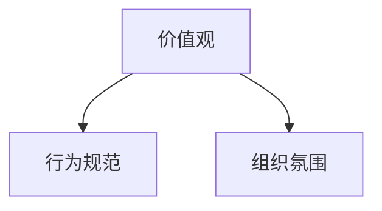

#### 8.2 领导力在企业文化建设中的应用

领导力在企业文化建设中起着关键作用。有效的领导力能够推动企业文化的传承和发展。

**核心概念与联系**

- **领导者的示范作用**：领导者的行为对员工有着示范作用，能够影响员工的行为和价值观。
- **企业文化的传承**：领导力通过传承企业文化，确保企业文化的持续发展。
- **企业文化的创新**：领导力推动企业文化的创新，使企业文化能够适应市场变化。

**Mermaid 流程图**

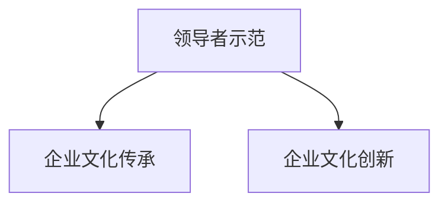

#### 8.3 企业文化与领导力的互动关系

企业文化和领导力之间存在密切的互动关系。企业文化的建设需要领导力的推动，而领导力的提升也需要企业文化的支撑。

**核心概念与联系**

- **领导力影响企业文化**：领导力通过塑造企业价值观和行为规范，影响企业文化的发展。
- **企业文化影响领导力**：企业文化通过塑造组织氛围，影响领导者的行为和决策。

**Mermaid 流程图**

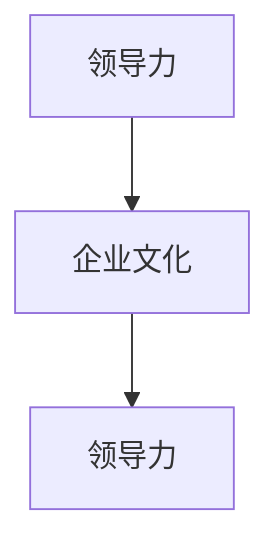

### 第9章：领导力与团队绩效

**第9章：领导力与团队绩效**

#### 9.1 领导力对团队绩效的影响

领导力对团队绩效有着直接和间接的影响。有效的领导力能够提升团队绩效，促进组织目标的实现。

**核心概念与联系**

- **直接影响**：领导力通过激励、指导和协调，直接影响团队的工作效率和绩效。
- **间接影响**：领导力通过塑造企业文化、提升团队成员的能力和素质，间接影响团队绩效。

**Mermaid 流程图**

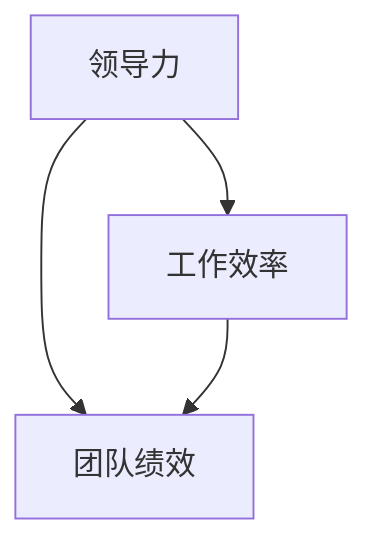

#### 9.2 提升团队绩效的策略

提升团队绩效需要从多个方面进行努力，包括领导力、团队建设、激励与沟通等。

**核心概念与联系**

- **领导力提升**：通过领导力培训、领导力发展路径规划，提升领导者的领导能力。
- **团队建设**：通过团队结构设计、团队文化建设，提高团队的协作效率。
- **激励与沟通**：通过激励理论、沟通技巧，激发团队成员的积极性和创造力。

**Mermaid 流程图**

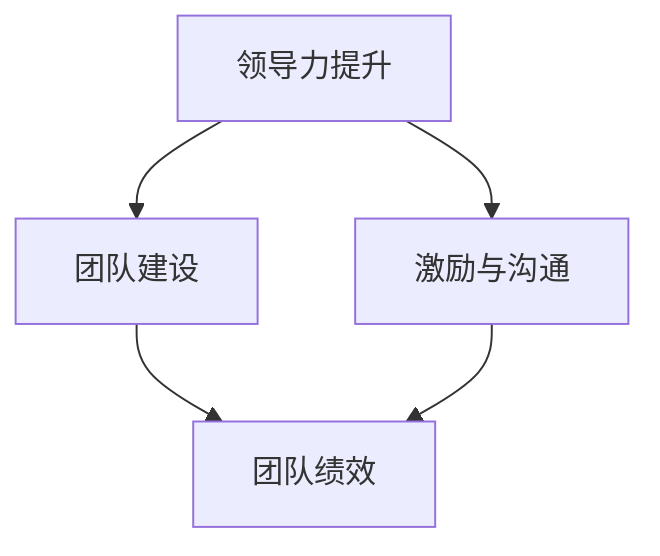

#### 9.3 领导力与团队绩效的实证研究

通过实证研究，我们可以看到领导力对团队绩效的显著影响。有效的领导力能够提升团队绩效，促进组织目标的实现。

**核心概念与联系**

- **实证研究方法**：通过问卷调查、数据收集等方法，分析领导力与团队绩效的关系。
- **实证研究结果**：领导力对团队绩效有着显著的影响，有效的领导力能够提升团队绩效。

**Mermaid 流程图**

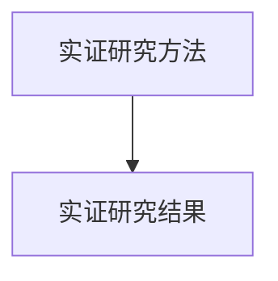

### 第10章：领导力与创新

**第10章：领导力与创新**

#### 10.1 创新的重要性

创新是组织持续发展的重要驱动力。有效的领导力能够推动创新，提升组织的竞争力。

**核心概念与联系**

- **创新的重要性**：创新能够推动组织发展，提升市场竞争力，创造新的价值。
- **领导力与创新的关系**：领导力通过激发员工的创造力、提供创新资源、构建创新文化，推动创新。

**Mermaid 流程图**

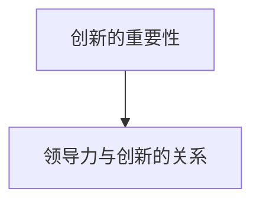

#### 10.2 领导力在创新中的角色

领导力在创新过程中扮演着关键角色。领导者需要具备洞察力、决策力、沟通力等，以推动创新。

**核心概念与联系**

- **领导者的角色**：领导者是创新的推动者，需要制定创新战略、提供创新资源、构建创新团队。
- **领导力的要素**：领导力包括个人特质、情境因素、行为和结果，这些要素共同影响创新。

**Mermaid 流程图**

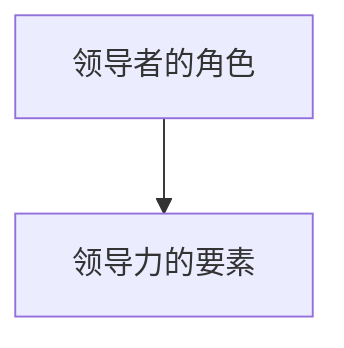

#### 10.3 领导力促进创新的方法

领导力可以通过多种方法促进创新，包括建立创新文化、提供激励机制、培养创新人才等。

**核心概念与联系**

- **创新文化**：建立创新文化，鼓励员工敢于尝试、勇于创新。
- **激励机制**：提供激励机制，如奖金、晋升等，激励员工参与创新。
- **创新人才**：培养创新人才，提升团队的整体创新能力。

**Mermaid 流程图**

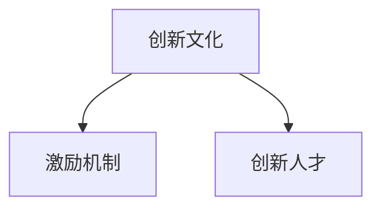

### 附录

**附录A：领导力训练工具与资源**

附录A提供了一系列领导力训练的工具和资源，包括书籍、课程、工具等，帮助读者进一步提升领导力。

- **书籍推荐**：《领导力的五个层次》、《领导者的突破》等。
- **在线课程**：哈佛商学院、斯坦福大学等提供的领导力课程。
- **工具推荐**：360度反馈工具、领导力评估工具等。

**附录B：领导力评估问卷**

附录B提供了一份领导力评估问卷，帮助读者评估自身的领导力水平。问卷包括个人特质、情境因素、行为和结果等方面。

**附录C：领导力发展计划模板**

附录C提供了一份领导力发展计划模板，帮助读者制定个性化的领导力发展计划。计划包括目标设定、行动计划、评估与反馈等方面。

### 作者信息

作者：AI天才研究院/AI Genius Institute & 禅与计算机程序设计艺术 /Zen And The Art of Computer Programming

本文通过深入探讨领导力训练在团队管理中的关键作用，结合实战案例和实证研究，提出了系统化的领导力训练方法。文章内容涵盖了领导力基础、团队领导力、领导力发展、领导力与企业文化、领导力与团队绩效等多个方面，旨在帮助读者提升领导力，打造无敌的团队。希望通过本文，读者能够更好地理解领导力的本质，运用领导力提升团队绩效，推动组织发展。希望本文对读者有所启发和帮助，谢谢阅读！

