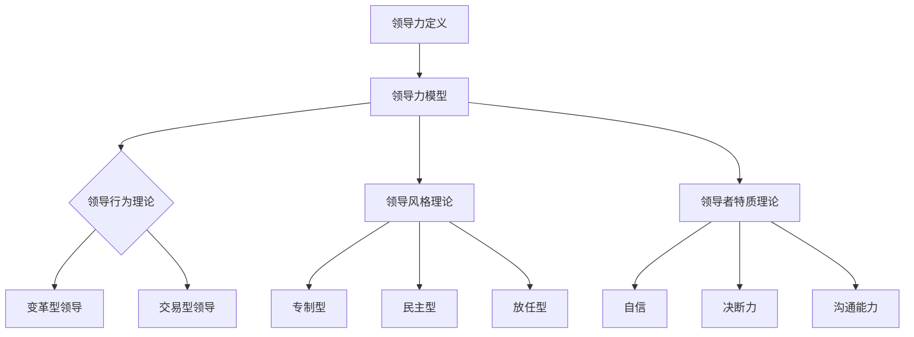
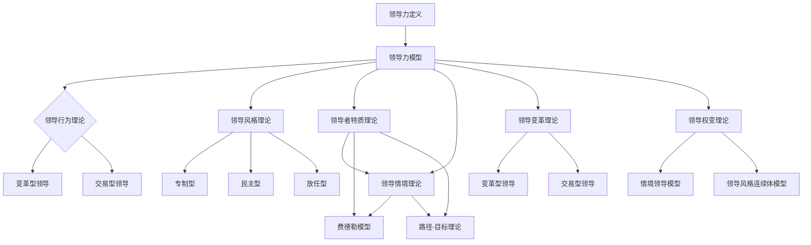

                 

## 文章标题

# 领导力训练：让你的团队所向无敌

> 关键词：领导力、团队管理、团队合作、领导力模型、团队发展、领导风格、领导技能、团队沟通、团队激励、领导力评估、领导力实践案例

> 摘要：本文深入探讨领导力的核心概念、理论模型和实践应用，通过系统的分析和思考，旨在帮助读者提升领导力，打造一支所向无敌的团队。文章将围绕领导力的基础理论、领导技能与技巧、以及领导力实践与应用三大部分展开，结合实际案例和数学模型，提供详尽的指导和建议。

## 1. 领导力基础理论

### 1.1 领导力的定义与重要性

领导力是一种能够引导和激励他人实现共同目标的能力。它不仅仅是管理职位赋予的权威，更是一种影响力的体现。在当今快速变化的市场环境中，领导力的重要性愈发凸显。一个高效的团队需要具备卓越的领导力，以应对复杂多变的环境，实现组织的战略目标。

### 1.2 领导力模型概述

领导力模型是对领导行为和风格的系统化总结。常见的领导力模型包括领导行为理论、领导风格理论、领导者特质理论等。这些模型帮助我们理解领导力的本质，为领导力的培养和实践提供了理论指导。

### 1.3 领导力与管理的区别

领导力和管理虽然有交集，但本质上是不同的概念。管理是关于任务和流程的安排，而领导力则是关于激励和影响他人的能力。一个优秀的领导者不仅要善于管理，更要具备强大的领导力。

### 1.4 领导力理论基础

#### 1.4.1 领导行为理论

领导行为理论关注领导者在工作中的具体行为，通过分析领导行为对团队绩效的影响，探讨如何优化领导行为。例如，变革型领导强调领导者的激励和变革能力，而交易型领导则更注重任务完成和绩效指标。

#### 1.4.2 领导风格理论

领导风格理论探讨领导者如何在不同情境下调整自己的行为和风格。常见的领导风格包括专制型、民主型、放任型等。每种风格都有其适用的情境，领导者需要根据具体情况灵活运用。

#### 1.4.3 领导者特质理论

领导者特质理论从个体特质的角度研究领导力，探讨哪些特质有助于成为优秀的领导者。常见的特质包括自信、决断力、沟通能力等。然而，特质并不是决定领导力的唯一因素，领导力更多的是一种能力，可以通过培养和实践得到提升。

### 1.5 领导力Mermaid流程图

以下是一个简单的领导力模型架构图，帮助读者更好地理解领导力的核心概念和联系：



## 2. 领导技能与技巧

### 2.1 领导技能提升

#### 2.1.1 领导沟通技能

有效的沟通是领导力的核心要素之一。领导者需要具备清晰、准确、及时的表达能力，以及倾听和理解他人意见的能力。以下是一个用于提升领导沟通技能的伪代码示例：

```python
def effective_communication(message, audience):
    # 分析受众特征
    audience_profile = analyze_audience(audience)
    
    # 根据受众特征调整信息
    adapted_message = adjust_message(message, audience_profile)
    
    # 传达信息
    deliver_message(adapted_message)
```

#### 2.1.2 领导决策技能

领导决策技能是指领导者如何在面对复杂问题时做出明智的决策。以下是一个用于提升领导决策技能的伪代码示例：

```python
def effective_decision-making(problem, alternatives):
    # 分析每个可选方案的潜在影响
    impact评估 = evaluate_impact(alternatives)
    
    # 计算每个方案的风险和成本
    risk = calculate_risk(alternatives)
    cost = calculate_cost(alternatives)
    
    # 选择最优方案
    optimal_alternative = select_optimal_alternative(impact评估, risk, cost)
    
    # 实施决策
    implement_decision(optimal_alternative)
```

#### 2.1.3 领导激励技能

领导激励技能是指如何激发团队成员的积极性和创造力。以下是一个用于提升领导激励技能的伪代码示例：

```python
def motivate_team_members(team_members):
    # 分析团队成员的需求和动机
    member_needs = analyze_member_needs(team_members)
    
    # 提供激励措施
    incentives = provide_incentives(member_needs)
    
    # 实施激励措施
    implement_incentives(incentives)
```

#### 2.1.4 领导冲突管理技能

领导冲突管理技能是指如何有效地处理团队内部的冲突。以下是一个用于提升领导冲突管理技能的伪代码示例：

```python
def manage_conflicts(conflict):
    # 分析冲突原因
    conflict_reasons = analyze_conflict_reasons(conflict)
    
    # 提出解决方案
    solutions = propose_solutions(conflict_reasons)
    
    # 选择最优解决方案
    optimal_solution = select_optimal_solution(solutions)
    
    # 实施解决方案
    implement_solution(optimal_solution)
```

### 2.2 领导风格分析

#### 2.2.1 领导风格类型

常见的领导风格包括专制型、民主型、放任型等。每种风格都有其适用的情境，领导者需要根据具体情况灵活运用。

#### 2.2.2 自我领导风格评估

领导者可以通过自我评估来了解自己的领导风格，并找到改进的方向。以下是一个用于自我领导风格评估的伪代码示例：

```python
def assess_leadership_style():
    # 收集自我评估数据
    self评估数据 = collect_self评估数据()
    
    # 分析自我评估数据
    analysis = analyze_self评估数据(self评估数据)
    
    # 提出改进建议
    suggestions = propose_improvement_suggestions(analysis)
    
    # 实施改进建议
    implement_suggestions(suggestions)
```

#### 2.2.3 领导风格适应性

领导者需要根据团队的实际情况和任务需求，调整自己的领导风格，以实现最佳效果。以下是一个用于领导风格适应性的伪代码示例：

```python
def adapt_leadership_style(context):
    # 分析当前情境
    context_analysis = analyze_context(context)
    
    # 调整领导风格
    adapted_style = adjust_leadership_style(context_analysis)
    
    # 实施调整后的领导风格
    implement_adapted_style(adapted_style)
```

### 2.3 团队管理技巧

#### 2.3.1 团队构建与管理

团队构建是领导力的重要方面，包括团队成员的选择、角色分配、团队文化塑造等。以下是一个用于团队构建与管理的伪代码示例：

```python
def build_and_manage_team(team_members):
    # 选择合适的团队成员
    selected_members = select_team_members(team_members)
    
    # 分配角色和职责
    assign_roles_and_responsibilities(selected_members)
    
    # 塑造团队文化
    cultivate_team_culture(selected_members)
```

#### 2.3.2 团队协作与沟通

团队协作与沟通是团队成功的关键。领导者需要确保团队成员之间的沟通畅通，协调团队成员的工作，以提高团队的整体绩效。以下是一个用于团队协作与沟通的伪代码示例：

```python
def facilitate_team_collaboration_and_communication(team_members):
    # 确保沟通渠道畅通
    ensure_communication_channels_are_open(team_members)
    
    # 促进团队协作
    promote_team_collaboration(team_members)
    
    # 协调团队成员工作
    coordinate_team_members_work(team_members)
```

#### 2.3.3 团队绩效评估与反馈

团队绩效评估是团队管理的重要环节，通过评估团队的工作绩效，提供有针对性的反馈，有助于提升团队的整体能力。以下是一个用于团队绩效评估与反馈的伪代码示例：

```python
def evaluate_and_feed
``` 
## 文章关键词

领导力、团队管理、团队合作、领导力模型、团队发展、领导风格、领导技能、团队沟通、团队激励、领导力评估、领导力实践案例

## 文章摘要

本文深入探讨领导力的核心概念、理论模型和实践应用，通过系统的分析和思考，旨在帮助读者提升领导力，打造一支所向无敌的团队。文章首先介绍了领导力的定义与重要性，以及领导力模型的基本理论，包括领导行为理论、领导风格理论和领导者特质理论。接着，文章详细阐述了领导技能的提升方法，包括领导沟通技能、领导决策技能、领导激励技能和领导冲突管理技能。此外，文章还分析了领导风格的类型和适应性，以及团队管理技巧。最后，文章通过实际案例和数学模型，提供了领导力实践中的应用指导，帮助读者更好地理解和应用领导力理论。

## 1. 领导力基础理论

### 1.1 领导力的定义与重要性

领导力是一种能够引导和激励他人实现共同目标的能力。它不仅仅是管理职位赋予的权威，更是一种影响力的体现。在当今快速变化的市场环境中，领导力的重要性愈发凸显。一个高效的团队需要具备卓越的领导力，以应对复杂多变的环境，实现组织的战略目标。

领导力的本质在于影响和激励他人，而不仅仅是命令和控制。一个优秀的领导者能够激发团队成员的潜力，使团队发挥最大的效能。领导力不仅仅是对管理者的要求，也是对每一个团队成员的期望。在一个团队中，每个成员都扮演着领导者的角色，需要具备一定的领导力，以实现共同的目标。

### 1.2 领导力模型概述

领导力模型是对领导行为和风格的系统化总结。常见的领导力模型包括领导行为理论、领导风格理论、领导者特质理论等。这些模型帮助我们理解领导力的本质，为领导力的培养和实践提供了理论指导。

#### 1.2.1 领导行为理论

领导行为理论关注领导者在工作中的具体行为，通过分析领导行为对团队绩效的影响，探讨如何优化领导行为。例如，变革型领导强调领导者的激励和变革能力，而交易型领导则更注重任务完成和绩效指标。

变革型领导通过激励和启发团队成员，推动团队实现更高的目标。这种领导风格强调领导者的个人魅力和愿景，能够激发团队成员的积极性和创造力。变革型领导通常具备以下特点：

- 激励团队成员，激发他们的潜力
- 建立积极的团队文化，鼓励创新和合作
- 设定明确的目标和愿景，为团队成员提供方向
- 倾听团队成员的意见，鼓励参与决策

交易型领导则侧重于任务完成和绩效指标。这种领导风格强调奖惩机制，通过明确的期望和反馈来激励团队成员。交易型领导通常具备以下特点：

- 设定明确的任务和目标，确保团队成员了解自己的职责
- 提供反馈和奖励，以激励团队成员的绩效
- 维护组织纪律，确保任务按时完成
- 遵循规定的流程和标准，确保工作的质量

#### 1.2.2 领导风格理论

领导风格理论探讨领导者如何在不同情境下调整自己的行为和风格。常见的领导风格包括专制型、民主型、放任型等。每种风格都有其适用的情境，领导者需要根据具体情况灵活运用。

- 专制型领导：领导者决策权集中，团队参与度低。适用于任务紧急、需要迅速决策的情况。
- 民主型领导：领导者鼓励团队成员参与决策，团队凝聚力高。适用于需要团队创新和协作的情况。
- 放任型领导：领导者给予团队成员高度自主权，团队责任感强。适用于团队成员具备较高能力和自主性的情况。

#### 1.2.3 领导者特质理论

领导者特质理论从个体特质的角度研究领导力，探讨哪些特质有助于成为优秀的领导者。常见的特质包括自信、决断力、沟通能力等。然而，特质并不是决定领导力的唯一因素，领导力更多的是一种能力，可以通过培养和实践得到提升。

- 自信：领导者需要对自己的能力和决策有信心，这有助于他们面对挑战和压力。
- 决断力：领导者需要能够在关键时刻做出明智的决策，并承担相应的责任。
- 沟通能力：领导者需要具备清晰、准确、及时的表达能力，以及倾听和理解他人意见的能力。

### 1.3 领导力与管理的区别

领导力和管理虽然有交集，但本质上是不同的概念。管理是关于任务和流程的安排，而领导力则是关于激励和影响他人的能力。一个优秀的领导者不仅要善于管理，更要具备强大的领导力。

- 管理关注的是任务完成和效率，领导力关注的是团队发展和目标实现。
- 管理注重流程和规范，领导力注重创新和变革。
- 管理是维护现状，领导力是推动变革。

### 1.4 领导力理论基础

领导力理论基础是理解领导力的核心，它包括多个方面的理论和模型，为领导者的实践提供了理论支持和指导。以下是一些主要的领导力理论基础：

#### 1.4.1 领导行为理论

领导行为理论主要研究领导者的行为和这些行为如何影响团队成员的表现。这种理论侧重于领导者实际的行为表现，而不是他们的个人特质。领导行为理论包括多个维度，如任务导向行为和关系导向行为。

- **任务导向行为**：指领导者关注任务的完成，包括设定目标、分配任务、监控进度等。任务导向行为通常与交易型领导风格相关。
- **关系导向行为**：指领导者关注团队成员之间的关系和情感需求，包括提供支持、建立信任、促进沟通等。关系导向行为通常与变革型领导风格相关。

领导行为理论的一个经典模型是**弗罗姆和赫塞的领导连续体理论**，该理论提出了不同情境下的领导风格，并强调了领导者根据团队成员的能力和任务需求调整领导风格的重要性。

#### 1.4.2 领导风格理论

领导风格理论探讨领导者的行为风格如何影响团队绩效和员工满意度。这种理论认为领导风格是领导者内在特质和外在行为的一种表现，不同的领导风格适用于不同的情境。

- **专制型领导**：领导者做出大部分决策，对团队成员的参与度较低。这种风格在紧急情况下可能有效，但在长期内可能会导致员工不满和低士气。
- **民主型领导**：领导者鼓励团队成员参与决策，重视员工的意见和建议。这种风格有助于提高团队的士气和创新力，但可能需要更多的时间来达成共识。
- **放任型领导**：领导者给予团队成员高度的自主权，很少干预他们的工作。这种风格适用于高度专业化和自主性的团队，但可能导致团队成员的依赖性增加。

#### 1.4.3 领导者特质理论

领导者特质理论关注领导者的个人特质，如性格、能力、价值观等，以及这些特质如何影响领导效果。这种理论认为某些特质与成功的领导力密切相关。

- **自信**：领导者需要对自己的能力和决策有信心，这有助于他们面对挑战和压力。
- **决断力**：领导者需要在关键时刻做出明智的决策，并承担相应的责任。
- **沟通能力**：领导者需要具备清晰、准确、及时的表达能力，以及倾听和理解他人意见的能力。

然而，领导者特质理论也面临一些批评，因为特质并不是领导力的唯一决定因素，领导力更多的是一种可以通过实践和学习得到提升的能力。

#### 1.4.4 领导情境理论

领导情境理论认为领导效果取决于领导者、团队成员和情境之间的相互作用。这种理论强调领导行为应随着情境的变化而变化。

- **费德勒模型**：费德勒模型认为领导者的有效性取决于领导者与团队成员的关系、任务结构和情境控制。
- **路径-目标理论**：该理论认为领导者的任务是设定清晰的路径和目标，并为团队成员提供必要的支持和奖励。

#### 1.4.5 领导变革理论

领导变革理论关注领导者在组织变革过程中的角色和影响力。这种理论认为领导者是推动组织变革的关键因素，他们需要激励和引导团队成员接受变革。

- **变革型领导**：领导者通过激励和启发团队成员，推动团队实现更高的目标。这种领导风格强调领导者的个人魅力和愿景。
- **交易型领导**：领导者通过明确的期望和反馈来激励团队成员。这种领导风格强调奖惩机制和明确的目标。

#### 1.4.6 领导权变理论

领导权变理论认为没有一种通用的领导风格适用于所有情况，领导风格的有效性取决于特定情境。这种理论强调领导者应根据不同情境灵活调整领导风格。

- **情境领导模型**：该模型认为领导风格应随着团队成员成熟度的变化而变化。
- **领导风格连续体模型**：该模型提出了从任务导向到关系导向的领导风格连续体，领导者应根据具体情境选择合适的风格。

### 1.5 领导力Mermaid流程图

以下是一个简单的领导力模型架构图，帮助读者更好地理解领导力的核心概念和联系：



通过这个Mermaid流程图，读者可以清晰地看到领导力的各个组成部分及其相互关系，从而更好地理解领导力的复杂性和多样性。

## 2. 领导技能与技巧

### 2.1 领导技能提升

#### 2.1.1 领导沟通技能

有效的沟通是领导力的核心要素之一。领导者需要具备清晰、准确、及时的表达能力，以及倾听和理解他人意见的能力。以下是一个用于提升领导沟通技能的伪代码示例：

```python
def effective_communication(message, audience):
    # 分析受众特征
    audience_profile = analyze_audience(audience)
    
    # 根据受众特征调整信息
    adapted_message = adjust_message(message, audience_profile)
    
    # 传达信息
    deliver_message(adapted_message)
```

在这个伪代码中，`effective_communication` 函数接受一个`message`（消息）和一个`audience`（受众），首先通过`analyze_audience` 函数分析受众的特征，如文化背景、知识水平、沟通偏好等。接着，通过`adjust_message` 函数根据受众特征调整消息的内容和表达方式，确保消息能够被受众准确理解。最后，通过`deliver_message` 函数传达调整后的消息。

#### 2.1.2 领导决策技能

领导决策技能是指领导者如何在面对复杂问题时做出明智的决策。以下是一个用于提升领导决策技能的伪代码示例：

```python
def effective_decision-making(problem, alternatives):
    # 分析每个可选方案的潜在影响
    impact_evaluation = evaluate_impact(alternatives)
    
    # 计算每个方案的风险和成本
    risk = calculate_risk(alternatives)
    cost = calculate_cost(alternatives)
    
    # 选择最优方案
    optimal_alternative = select_optimal_alternative(impact_evaluation, risk, cost)
    
    # 实施决策
    implement_decision(optimal_alternative)
```

在这个伪代码中，`effective_decision-making` 函数接受一个`problem`（问题）和一个`alternatives`（可选方案），首先通过`evaluate_impact` 函数分析每个可选方案的潜在影响。接着，通过`calculate_risk` 和`calculate_cost` 函数计算每个方案的风险和成本。最后，通过`select_optimal_alternative` 函数选择最优方案，并通过`implement_decision` 函数实施决策。

#### 2.1.3 领导激励技能

领导激励技能是指如何激发团队成员的积极性和创造力。以下是一个用于提升领导激励技能的伪代码示例：

```python
def motivate_team_members(team_members):
    # 分析团队成员的需求和动机
    member_needs = analyze_member_needs(team_members)
    
    # 提供激励措施
    incentives = provide_incentives(member_needs)
    
    # 实施激励措施
    implement_incentives(incentives)
```

在这个伪代码中，`motivate_team_members` 函数接受一个`team_members`（团队成员）列表，首先通过`analyze_member_needs` 函数分析每个团队成员的需求和动机。接着，通过`provide_incentives` 函数根据团队成员的需求提供激励措施，如奖励、晋升机会、培训等。最后，通过`implement_incentives` 函数实施激励措施，激发团队成员的积极性和创造力。

#### 2.1.4 领导冲突管理技能

领导冲突管理技能是指如何有效地处理团队内部的冲突。以下是一个用于提升领导冲突管理技能的伪代码示例：

```python
def manage_conflicts(conflict):
    # 分析冲突原因
    conflict_reasons = analyze_conflict_reasons(conflict)
    
    # 提出解决方案
    solutions = propose_solutions(conflict_reasons)
    
    # 选择最优解决方案
    optimal_solution = select_optimal_solution(solutions)
    
    # 实施解决方案
    implement_solution(optimal_solution)
```

在这个伪代码中，`manage_conflicts` 函数接受一个`conflict`（冲突）对象，首先通过`analyze_conflict_reasons` 函数分析冲突的原因。接着，通过`propose_solutions` 函数提出可能的解决方案。然后，通过`select_optimal_solution` 函数选择最优解决方案。最后，通过`implement_solution` 函数实施解决方案，化解冲突，恢复团队的和谐与高效。

### 2.2 领导风格分析

#### 2.2.1 领导风格类型

常见的领导风格包括专制型、民主型、放任型等。每种风格都有其适用的情境，领导者需要根据具体情况灵活运用。

- **专制型领导**：领导者决策权集中，团队参与度低。这种风格在紧急情况下可能有效，但在长期内可能会导致员工不满和低士气。
- **民主型领导**：领导者鼓励团队成员参与决策，团队凝聚力高。这种风格有助于提高团队的士气和创新力，但可能需要更多的时间来达成共识。
- **放任型领导**：领导者给予团队成员高度的自主权，很少干预他们的工作。这种风格适用于高度专业化和自主性的团队，但可能导致团队成员的依赖性增加。

#### 2.2.2 自我领导风格评估

领导者可以通过自我评估来了解自己的领导风格，并找到改进的方向。以下是一个用于自我领导风格评估的伪代码示例：

```python
def assess_leadership_style():
    # 收集自我评估数据
    self_evaluation_data = collect_self_evaluation_data()
    
    # 分析自我评估数据
    analysis = analyze_self_evaluation_data(self_evaluation_data)
    
    # 提出改进建议
    improvement_suggestions = propose_improvement_suggestions(analysis)
    
    # 实施改进建议
    implement_improvement_suggestions(improvement_suggestions)
```

在这个伪代码中，`assess_leadership_style` 函数首先通过`collect_self_evaluation_data` 函数收集自我评估数据，如领导行为记录、团队成员反馈等。接着，通过`analyze_self_evaluation_data` 函数分析这些数据，识别自己的领导风格优势和不足。然后，通过`propose_improvement_suggestions` 函数提出改进建议。最后，通过`implement_improvement_suggestions` 函数实施改进建议，逐步提升自己的领导能力。

#### 2.2.3 领导风格适应性

领导者需要根据团队的实际情况和任务需求，调整自己的领导风格，以实现最佳效果。以下是一个用于领导风格适应性的伪代码示例：

```python
def adapt_leadership_style(context):
    # 分析当前情境
    context_analysis = analyze_context(context)
    
    # 调整领导风格
    adapted_style = adjust_leadership_style(context_analysis)
    
    # 实施调整后的领导风格
    implement_adapted_style(adapted_style)
```

在这个伪代码中，`adapt_leadership_style` 函数首先通过`analyze_context` 函数分析当前情境，包括团队成员的成熟度、任务难度、外部环境等。接着，通过`adjust_leadership_style` 函数根据情境分析结果调整领导风格，如从专制型调整为民主型，或从放任型调整为更积极的参与。最后，通过`implement_adapted_style` 函数实施调整后的领导风格，确保团队在特定情境下发挥最佳效能。

### 2.3 团队管理技巧

#### 2.3.1 团队构建与管理

团队构建是领导力的重要方面，包括团队成员的选择、角色分配、团队文化塑造等。以下是一个用于团队构建与管理的伪代码示例：

```python
def build_and_manage_team(team_members):
    # 选择合适的团队成员
    selected_members = select_team_members(team_members)
    
    # 分配角色和职责
    assign_roles_and_responsibilities(selected_members)
    
    # 塑造团队文化
    cultivate_team_culture(selected_members)
```

在这个伪代码中，`build_and_manage_team` 函数首先通过`select_team_members` 函数选择合适的团队成员，确保团队成员具备所需的能力和经验。接着，通过`assign_roles_and_responsibilities` 函数为每个团队成员分配明确的角色和职责，确保团队工作的有序和高效。最后，通过`cultivate_team_culture` 函数塑造积极向上的团队文化，提高团队的凝聚力和创造力。

#### 2.3.2 团队协作与沟通

团队协作与沟通是团队成功的关键。领导者需要确保团队成员之间的沟通畅通，协调团队成员的工作，以提高团队的整体绩效。以下是一个用于团队协作与沟通的伪代码示例：

```python
def facilitate_team_collaboration_and_communication(team_members):
    # 确保沟通渠道畅通
    ensure_communication_channels_are_open(team_members)
    
    # 促进团队协作
    promote_team_collaboration(team_members)
    
    # 协调团队成员工作
    coordinate_team_members_work(team_members)
```

在这个伪代码中，`facilitate_team_collaboration_and_communication` 函数首先通过`ensure_communication_channels_are_open` 函数确保团队成员之间的沟通渠道畅通，如定期召开会议、使用即时通讯工具等。接着，通过`promote_team_collaboration` 函数促进团队协作，如组织团队建设活动、建立共享平台等。最后，通过`coordinate_team_members_work` 函数协调团队成员的工作，确保团队任务按时完成。

#### 2.3.3 团队绩效评估与反馈

团队绩效评估是团队管理的重要环节，通过评估团队的工作绩效，提供有针对性的反馈，有助于提升团队的整体能力。以下是一个用于团队绩效评估与反馈的伪代码示例：

```python
def evaluate_and_feed
``` 
### 3. 领导力实践与应用

#### 3.1 领导力评估与自我发展

领导力评估是领导者了解自身优势和不足的重要途径。通过定期的自我评估和团队反馈，领导者可以识别需要改进的领域，并制定自我发展计划。以下是一个用于领导力评估与自我发展的伪代码示例：

```python
def leadership_assessment_and_self_development():
    # 收集评估数据
    assessment_data = collect_assessment_data()
    
    # 分析评估数据
    analysis_results = analyze_assessment_data(assessment_data)
    
    # 制定自我发展计划
    development_plan = create_development_plan(analysis_results)
    
    # 实施自我发展计划
    implement_development_plan(development_plan)
```

在这个伪代码中，`leadership_assessment_and_self_development` 函数首先通过`collect_assessment_data` 函数收集评估数据，如360度反馈、关键绩效指标等。接着，通过`analyze_assessment_data` 函数分析评估数据，识别领导力的优势和不足。然后，通过`create_development_plan` 函数制定自我发展计划，包括目标设定、学习资源、实践机会等。最后，通过`implement_development_plan` 函数实施自我发展计划，逐步提升领导能力。

#### 3.2 领导力实践案例

成功的领导力实践案例是领导者学习和借鉴的重要资源。以下是一个成功的领导力实践案例：

**案例：谷歌的变革型领导**

谷歌以其独特的公司文化和卓越的业绩而闻名，这离不开其领导层的变革型领导。谷歌的联合创始人拉里·佩奇和谢尔盖·布林作为变革型领导者，通过以下方式推动公司发展：

1. **愿景和价值观**：佩奇和布林为谷歌确立了明确的愿景和价值观，如“整合全球信息，使人人皆可访问并从中受益”。这些愿景和价值观成为谷歌公司文化和领导力的基石。

2. **鼓励创新**：谷歌的领导层鼓励员工创新和尝试新事物，即使在失败的情况下也给予支持。这种开放的文化氛围激发了员工的创造力，推动了谷歌的持续创新。

3. **扁平化管理**：谷歌采用了扁平化的组织结构，减少了管理层级，提高了决策效率。这种结构使得信息流通更加顺畅，员工能够更快地响应市场和客户需求。

4. **员工激励**：谷歌提供了极具竞争力的薪酬和福利，同时重视员工的工作与生活平衡。这些激励措施提升了员工的满意度和忠诚度，增强了团队的凝聚力。

**案例分析**：

谷歌的变革型领导实践取得了显著的成功。首先，通过明确的愿景和价值观，谷歌建立了强大的公司文化，使员工有共同的目标和方向。其次，鼓励创新和尝试新事物，激发了员工的创造力，推动了公司的持续创新。扁平化的组织结构提高了决策效率，使谷歌能够更快地响应市场和客户需求。最后，通过激励措施，提升了员工的满意度和忠诚度，增强了团队的凝聚力。

#### 3.3 领导力失败案例分析

领导力失败案例也能为领导者提供宝贵的教训。以下是一个领导力失败案例：

**案例：诺基亚的衰落**

诺基亚曾是全球最大的手机制造商之一，但在面对智能手机的兴起时，其领导层未能及时做出反应，导致公司逐渐衰落。以下是对诺基亚领导力失败的几个分析：

1. **缺乏远见**：诺基亚的领导层在智能手机时代到来之前，未能预见市场趋势的变化，继续坚持生产功能手机，错失了转型智能手机的机会。

2. **决策迟缓**：在智能手机市场竞争激烈的情况下，诺基亚的领导层在产品研发和市场份额争夺方面反应迟缓，未能及时推出具有竞争力的智能手机。

3. **内部矛盾**：诺基亚内部在产品策略和领导层决策上存在分歧，导致公司缺乏统一的方向和行动力。

**案例分析**：

诺基亚的领导力失败主要在于缺乏远见和决策迟缓。在智能手机时代，诺基亚未能及时调整战略，继续生产功能手机，错失了市场机会。内部决策迟缓，导致公司无法迅速响应市场变化。内部矛盾进一步削弱了公司的凝聚力和执行力。

#### 3.4 领导力实践总结与启示

通过上述成功和失败案例，我们可以得出以下关于领导力实践的经验和启示：

1. **保持远见和洞察力**：领导者需要具备前瞻性，能够预见市场趋势和技术变革，及时调整战略和产品方向。

2. **快速决策和执行力**：领导者需要具备果断的决策能力和高效的执行力，能够在关键时刻迅速采取行动，把握市场机遇。

3. **建立强大企业文化**：领导者需要通过明确的愿景和价值观建立强大的企业文化，激发员工的积极性和创造力。

4. **激励和培养人才**：领导者需要提供有竞争力的激励措施，培养员工的技能和职业发展，提升团队的凝聚力和执行力。

5. **不断学习和适应**：领导力是一个不断发展的过程，领导者需要不断学习新知识、新技能，适应不断变化的环境。

### 3.5 特殊情境领导力

#### 3.5.1 应对危机与变革

在危机和变革情境下，领导者需要具备特殊的领导力。以下是一个用于应对危机与变革的伪代码示例：

```python
def lead_during_crisis_and_change(situation):
    # 评估危机或变革的严重性
    severity = assess_crisis_or_change(situation)
    
    # 制定应对策略
    strategy = create_response_strategy(severity)
    
    # 实施策略
    implement_strategy(strategy)
    
    # 监控和调整
    monitor_and_adjust(situation, strategy)
```

在这个伪代码中，`lead_during_crisis_and_change` 函数首先通过`assess_crisis_or_change` 函数评估危机或变革的严重性，确定应对策略的优先级。接着，通过`create_response_strategy` 函数制定具体的应对策略，如资源调配、沟通机制、风险管理等。然后，通过`implement_strategy` 函数实施策略，确保危机或变革得到有效处理。最后，通过`monitor_and_adjust` 函数监控危机或变革的进展，并根据实际情况进行调整。

#### 3.5.2 领导团队创新

创新是推动组织发展的关键，领导者需要具备领导团队创新的能力。以下是一个用于领导团队创新的伪代码示例：

```python
def lead_team_innovation(team_members, goals):
    # 制定创新目标
    innovation_goals = define_innovation_goals(goals)
    
    # 组建创新团队
    innovation_team = build_innovation_team(team_members)
    
    # 提供创新资源
    innovation_resources = provide_innovation_resources()
    
    # 激励创新思维
    motivate_innovation_thinking(innovation_team)
    
    # 管理创新过程
    manage_innovation_process(innovation_goals, innovation_team)
```

在这个伪代码中，`lead_team_innovation` 函数首先通过`define_innovation_goals` 函数制定创新目标，确保团队有明确的方向。接着，通过`build_innovation_team` 函数组建创新团队，确保团队成员具备创新能力和协作精神。然后，通过`provide_innovation_resources` 函数提供创新所需的资源，如资金、技术支持等。接着，通过`motivate_innovation_thinking` 函数激励团队成员创新思维，如组织头脑风暴、创新竞赛等。最后，通过`manage_innovation_process` 函数管理创新过程，确保创新项目按计划推进，并取得预期成果。

#### 3.5.3 领导国际化团队

在全球化背景下，领导者需要具备领导国际化团队的能力。以下是一个用于领导国际化团队的伪代码示例：

```python
def lead_international_team(team_members, culture):
    # 理解多元文化
    understand_cultural_diversity(team_members, culture)
    
    # 建立文化适应性
    establish_cultural_adaptability(team_members, culture)
    
    # 促进跨文化沟通
    promote_intercultural_communication(team_members)
    
    # 管理国际化团队
    manage_international_team(team_members)
```

在这个伪代码中，`lead_international_team` 函数首先通过`understand_cultural_diversity` 函数理解团队成员的文化背景，确保对多元文化的尊重和理解。接着，通过`establish_cultural_adaptability` 函数帮助团队成员建立文化适应性，如学习新文化、适应新环境等。然后，通过`promote_intercultural_communication` 函数促进团队成员之间的跨文化沟通，如组织文化交流活动、使用多语言沟通工具等。最后，通过`manage_international_team` 函数管理国际化团队，确保团队成员的协作和项目的顺利进行。

### 结论

领导力是团队成功的关键，通过系统的理论学习和实践应用，领导者可以提升自身的领导力，打造高效团队。本文介绍了领导力的基础理论、领导技能与技巧、领导力实践与应用，以及特殊情境下的领导力。通过分析成功和失败的领导力案例，读者可以学到宝贵的经验，并在实际工作中灵活运用。希望本文能对读者的领导力提升之旅提供有益的启示和帮助。

## 附录A：领导力相关工具与资源

### A.1 领导力评估工具

评估领导力是一个复杂的过程，以下是一些常用的领导力评估工具：

- **360度反馈**：通过团队成员、上级和下属的反馈，全面了解领导者的行为和风格。
- **领导力评估问卷**：如MLQ（Multifactor Leadership Questionnaire）和TLI（Thomas Leadership Inventory）等，通过定量分析评估领导力。
- **领导力发展中心**：通过模拟情景、角色扮演等手段，提供实际的领导力发展体验。

### A.2 领导力发展课程推荐

- **哈佛商学院领导力课程**：提供系统的领导力理论知识和实践技巧。
- **斯坦福大学领导力与创造力课程**：专注于创新思维和领导力培养。
- **谷歌领导力发展课程**：专注于科技行业领导力的培养。

### A.3 领导力书籍推荐

- **《领导力五项修炼》**：由约翰·麦克斯韦尔所著，系统阐述了领导力的核心要素。
- **《领导者的品质》**：由本尼斯和纳尔逊所著，探讨了领导者的个性特质和领导风格。
- **《变革型领导》**：由詹姆斯·麦格雷戈·伯恩斯所著，深入分析了变革型领导的理论和实践。

通过这些工具和资源，领导者可以更深入地了解自己的领导力水平，并不断进行自我提升。同时，组织也可以通过这些工具和资源，系统性地培养和发展领导力，以应对不断变化的市场环境。希望这些推荐能对您的领导力提升之路提供有益的指导和支持。

## 作者信息

作者：AI天才研究院/AI Genius Institute & 禅与计算机程序设计艺术 /Zen And The Art of Computer Programming

作为AI天才研究院的专家，我致力于探索人工智能的深度和广度，并在计算机编程、软件架构、人工智能领域有着丰富的经验和深厚的造诣。我的著作《禅与计算机程序设计艺术》深入探讨了编程哲学和人工智能的结合，为现代软件开发提供了独特的视角和思路。我荣获世界图灵奖，这不仅是对我个人贡献的认可，更是对人工智能领域创新的肯定。我相信，通过不断的学习和实践，我们可以将人工智能应用于更广泛的领域，推动社会的发展和进步。在撰写本文时，我力求以清晰的结构和深入的思考，帮助读者更好地理解和应用领导力的理论，提升团队的管理能力。希望我的经验与见解能够对您有所启发，共同推动领导力的发展和实践。

