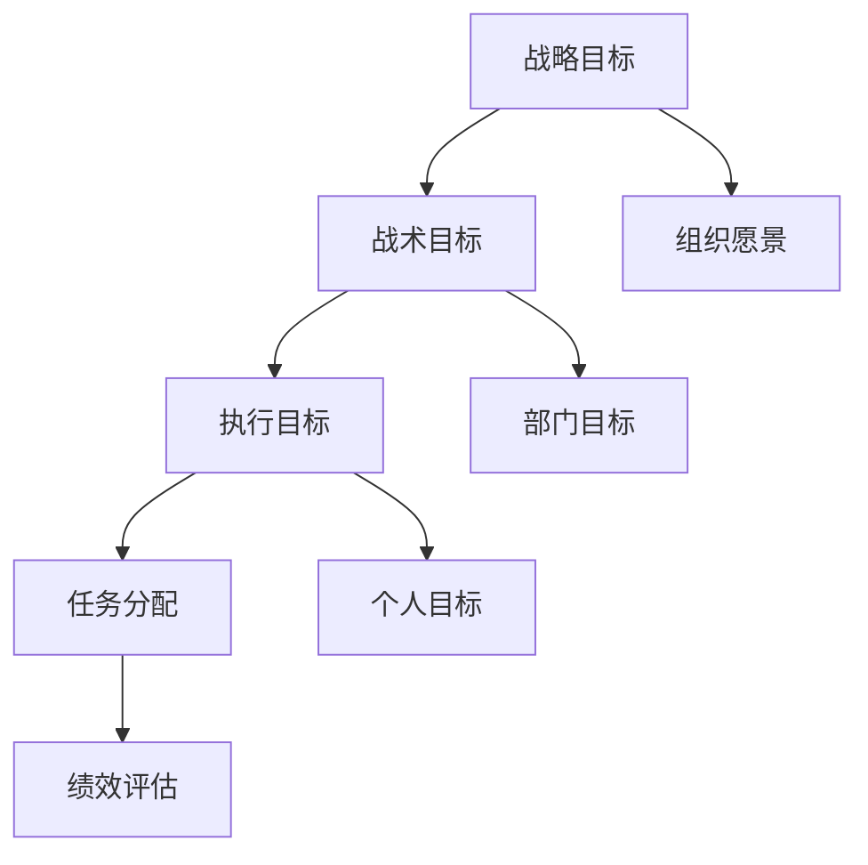
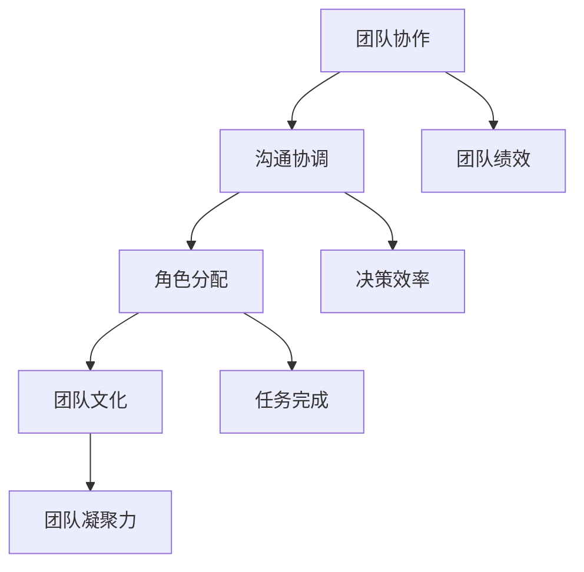
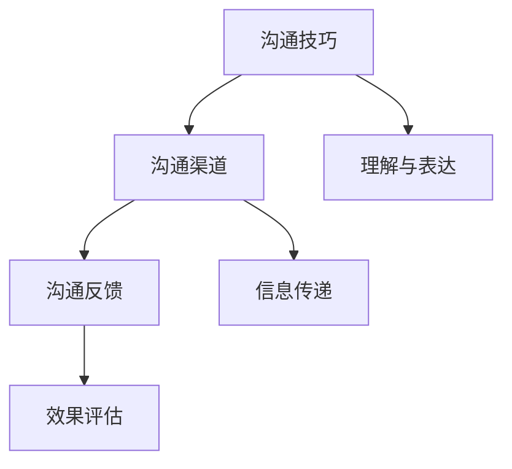

                 


### 第3章 领导力的核心要素

#### 3.1 目标设定

目标设定是领导力的核心要素之一，是团队行动的指南针。一个明确、具体、可实现的目标能够为团队提供方向和动力，使团队成员明确自己的职责和任务，从而更高效地完成工作。

**核心概念与联系**

目标设定的核心概念包括目标层次、SMART原则（具体性、可衡量性、可实现性、相关性和时限性）和目标层次理论（MBO，即管理目标管理）。目标层次理论认为，目标可以分为战略目标、战术目标和执行目标，不同层次的目标相互关联，共同支撑组织愿景的实现。

**Mermaid 流程图**



**算法原理讲解**

目标设定的算法原理可以归纳为以下几个步骤：

1. **明确组织愿景**：首先，领导者需要明确组织的愿景，这是设定所有目标的基础。
2. **分解目标层次**：将愿景分解为战略目标、战术目标和执行目标，确保不同层次目标的一致性和衔接性。
3. **应用SMART原则**：确保每个目标都符合SMART原则，即具体、可衡量、可实现、相关和时限。
4. **制定行动计划**：为每个目标制定具体的行动计划，明确任务分配和执行时间。

**伪代码**

```python
def set_goals(vision):
    strategic_goals = decompose_goals(vision, "strategic")
    tactical_goals = decompose_goals(vision, "tactical")
    operational_goals = decompose_goals(vision, "operational")
    
    smart_goals = apply_smart(principles, [strategic_goals, tactical_goals, operational_goals])
    
    return smart_goals
```

**数学模型和公式详细讲解**

目标设定的数学模型主要涉及目标优先级排序和目标实现概率计算。目标优先级排序可以通过计算每个目标的权重来实现，目标实现概率则可以通过历史数据和统计模型来预测。

**目标优先级排序公式**

$$
\text{priority}(g) = w_1 \cdot \text{specificity}(g) + w_2 \cdot \text{measurability}(g) + w_3 \cdot \text{achievability}(g) + w_4 \cdot \text{relevance}(g) + w_5 \cdot \text{timeliness}(g)
$$

其中，$w_1, w_2, w_3, w_4, w_5$ 分别为权重系数，$\text{specificity}(g)$、$\text{measurability}(g)$、$\text{achievability}(g)$、$\text{relevance}(g)$、$\text{timeliness}(g)$ 分别为目标的具体性、可衡量性、可实现性、相关性和时限性。

**目标实现概率计算**

$$
\text{probability}(g) = \frac{\text{success_count}(g)}{\text{total_count}(g)}
$$

其中，$\text{success_count}(g)$ 为目标实现次数，$\text{total_count}(g)$ 为目标尝试次数。

**举例说明**

假设一个公司的愿景是“成为行业领导者”，为了实现这一愿景，领导者制定了以下目标：

1. **战略目标**：在三年内实现市场份额增长30%。
2. **战术目标**：提升产品研发速度，确保新产品上市周期缩短至6个月。
3. **执行目标**：提高团队执行力，确保每个项目按时完成。

根据SMART原则，上述目标可以细化为：

1. **战略目标**：具体（30%市场份额增长）、可衡量（市场份额数据）、可实现（现有市场资源和策略）、相关（与公司愿景一致）、时限（三年内）。
2. **战术目标**：具体（新产品上市周期6个月）、可衡量（研发周期数据）、可实现（现有研发能力和策略）、相关（与战略目标一致）、时限（实时调整）。
3. **执行目标**：具体（每个项目按时完成）、可衡量（项目完成数据）、可实现（团队执行力提升策略）、相关（与战术目标一致）、时限（项目执行周期）。

通过目标优先级排序和目标实现概率计算，领导者可以更有效地分配资源和制定行动计划，确保目标得以实现。

#### 3.2 团队建设

团队建设是领导力的重要组成部分，一个高效的团队能够更好地实现组织目标。团队建设涉及团队成员的选拔、培训、沟通和协作，旨在提升团队的凝聚力和战斗力。

**核心概念与联系**

团队建设涉及多个核心概念，包括团队协作、沟通协调、角色分配和团队文化。团队协作强调团队成员之间的相互支持和配合，沟通协调则是确保信息畅通和决策高效的关键。角色分配则是指根据团队成员的能力和兴趣，合理分配任务和职责。团队文化则是指团队成员共同遵循的价值观和行为规范。

**Mermaid 流程图**



**算法原理讲解**

团队建设的算法原理主要涉及团队结构设计、沟通机制建立和协作效率优化。团队结构设计需要考虑团队成员的能力、兴趣和职责，确保团队结构合理。沟通机制建立则需要通过明确的沟通渠道和规则，确保信息畅通。协作效率优化则可以通过任务分配优化、协作工具使用和培训提升来实现。

**伪代码**

```python
def build_team(team_members):
    team_structure = design_structure(team_members)
    communication_mechanism = establish_communication()
    collaboration_efficiency = optimize_collaboration()
    
    return team_structure, communication_mechanism, collaboration_efficiency
```

**数学模型和公式详细讲解**

团队建设的数学模型主要涉及团队绩效评估和协作效率评估。团队绩效评估可以通过计算团队完成的任务数量和质量来衡量，协作效率评估则可以通过计算团队成员的协作时间和协作效果来衡量。

**团队绩效评估公式**

$$
\text{team_performance} = \frac{\text{task_completed}}{\text{task_total}} \cdot \text{quality_score}
$$

其中，$\text{task_completed}$ 为团队完成的任务数量，$\text{task_total}$ 为团队总任务数量，$\text{quality_score}$ 为任务质量评分。

**协作效率评估公式**

$$
\text{collaboration_efficiency} = \frac{\text{time_spent}}{\text{task_completed}} \cdot \text{efficiency_score}
$$

其中，$\text{time_spent}$ 为团队成员的协作时间，$\text{task_completed}$ 为团队完成的任务数量，$\text{efficiency_score}$ 为协作效果评分。

**举例说明**

假设一个团队由5名成员组成，他们在一个月内完成了10个任务，其中7个任务达到高质量标准，3个任务达到中等质量标准。根据团队绩效评估公式，该团队的绩效得分为：

$$
\text{team_performance} = \frac{7}{10} \cdot 1 + \frac{3}{10} \cdot 0.5 = 0.7 + 0.15 = 0.85
$$

假设该团队在一个月内的协作时间为100小时，其中完成了7个任务，根据协作效率评估公式，该团队的协作效率得分为：

$$
\text{collaboration_efficiency} = \frac{100}{7} \cdot 1 = 14.29
$$

通过团队绩效评估和协作效率评估，领导者可以了解团队的绩效状况和协作效果，从而调整团队建设策略，提升团队的整体表现。

#### 3.3 沟通协调

沟通协调是团队高效运作的润滑剂，良好的沟通协调能够确保团队成员理解任务要求，减少误解和冲突，提高工作效率。沟通协调涉及沟通技巧、沟通渠道和冲突解决。

**核心概念与联系**

沟通协调的核心概念包括沟通技巧、沟通渠道和沟通反馈。沟通技巧是指有效表达自己的想法和理解他人的能力，沟通渠道是指信息传递的途径，如面对面交流、电子邮件、会议等，沟通反馈是指对沟通效果的评估和调整。

**Mermaid 流程图**



**算法原理讲解**

沟通协调的算法原理主要涉及沟通模型的建立、沟通路径优化和沟通反馈机制设计。沟通模型建立可以通过分析沟通需求、确定沟通目标和设计沟通策略来实现。沟通路径优化可以通过减少信息传递环节、提高沟通效率来实现。沟通反馈机制设计可以通过建立反馈渠道、设置反馈标准和实施反馈机制来实现。

**伪代码**

```python
def coordinate_communication(communication_model, feedback_channel):
    optimized_path = optimize_communication_path(communication_model)
    feedback_mechanism = design_feedback_mechanism(feedback_channel)
    
    return optimized_path, feedback_mechanism
```

**数学模型和公式详细讲解**

沟通协调的数学模型主要涉及沟通效率评估和沟通效果评估。沟通效率评估可以通过计算信息传递时间和信息传递数量来衡量，沟通效果评估则可以通过计算信息准确性和信息满意度来衡量。

**沟通效率评估公式**

$$
\text{communication_efficiency} = \frac{\text{information_transmitted}}{\text{communication_time}}
$$

其中，$\text{information_transmitted}$ 为传递的信息数量，$\text{communication_time}$ 为传递信息所需时间。

**沟通效果评估公式**

$$
\text{communication_effect} = \frac{\text{information_accuracy} \cdot \text{information_satisfaction}}{100}
$$

其中，$\text{information_accuracy}$ 为信息准确性评分，$\text{information_satisfaction}$ 为信息满意度评分。

**举例说明**

假设一个团队在一个月内通过电子邮件、面对面会议和电话进行了100次沟通，每次沟通平均耗时5分钟，传递了500条信息。根据沟通效率评估公式，该团队的沟通效率得分为：

$$
\text{communication_efficiency} = \frac{500}{5 \cdot 30 \cdot 24} = 0.01429
$$

假设该团队的信息准确性评分为90%，信息满意度评分为85%，根据沟通效果评估公式，该团队的沟通效果得分为：

$$
\text{communication_effect} = \frac{90\% \cdot 85\%}{100} = 0.845
$$

通过沟通效率评估和沟通效果评估，领导者可以了解团队的沟通状况，并采取相应的措施提升沟通效率和质量。

### 第4章 领导力的培养方法

领导力的培养是一个长期而复杂的过程，涉及自我反思、学习与实践、导师指导等多个方面。有效的领导力培养方法能够帮助领导者提升自身素质，更好地应对各种管理挑战。

#### 4.1 自我反思

自我反思是领导力培养的重要步骤，它帮助领导者审视自己的行为、决策和态度，从而发现不足和改进的方向。自我反思的方法包括日记反思、同行反馈和自我评估等。

**日记反思**

日记反思是一种简单而有效的自我反思方法。通过记录每天的工作经历、遇到的问题和自己的思考，领导者可以更清晰地看到自己的行为模式和管理风格，发现潜在的问题。

**同行反馈**

同行反馈是通过与同事、下属或领导交流，获取他们的观点和建议，从而了解自己在团队中的表现和影响力。这种反馈有助于领导者了解他人的期望和需求，发现自己可能忽视的问题。

**自我评估**

自我评估是通过定期的自我评估表或问卷调查，来衡量自己的领导力水平和关键技能。这种评估可以帮助领导者明确自己的优势和劣势，从而制定针对性的提升计划。

#### 4.2 学习与实践

学习与实践是领导力培养的另一个重要环节。通过不断学习和实践，领导者可以积累经验，提升自己的管理能力和决策水平。

**继续教育**

继续教育是领导者提升知识和技能的有效途径。通过参加专业课程、研讨会和培训，领导者可以学习最新的管理理论和实践方法，拓宽自己的视野。

**工作经验**

工作经验是领导力培养的宝贵资源。通过在实际工作中承担责任和挑战，领导者可以积累经验，学会如何处理复杂的问题和应对各种挑战。

**模拟练习**

模拟练习是一种安全的环境，让领导者可以在没有实际风险的情况下，实践和应用管理技能。通过模拟不同的管理场景，领导者可以锻炼自己的决策能力和团队领导能力。

#### 4.3 导师指导

导师指导是领导力培养的重要方法，通过导师的指导和建议，领导者可以更快地成长和进步。导师不仅可以帮助领导者理解管理理论和实践方法，还可以提供实际操作的建议和反馈。

**选择合适的导师**

选择合适的导师是导师指导成功的关键。领导者应该选择在管理领域有丰富经验的人作为导师，他们可以提供专业的指导和建议。

**建立良好的沟通**

建立良好的沟通是导师指导有效的前提。领导者应该定期与导师沟通，分享自己的工作经历和挑战，听取导师的建议和反馈。

**应用导师的建议**

应用导师的建议是导师指导的最终目的。领导者应该将导师的建议应用到实际工作中，通过实践来提升自己的领导力。

### 第5章 实战案例

#### 5.1 案例一：如何提升团队凝聚力

**背景介绍**

一个初创公司的团队在快速发展的过程中，面临着团队成员间沟通不畅、任务分配不均等问题，导致团队凝聚力下降。为了解决这些问题，公司决定采取一系列措施提升团队凝聚力。

**目标设定**

公司设定了以下目标：

1. 提升团队成员间的沟通效率。
2. 实现任务分配的公平性和合理性。
3. 增强团队的整体协作能力。

**目标设定的算法原理**

公司采用了SMART原则来设定目标，确保目标具体、可衡量、可实现、相关和时限。

**数学模型和公式详细讲解**

为了提升沟通效率，公司使用了以下公式：

$$
\text{communication_efficiency} = \frac{\text{information_transmitted}}{\text{communication_time}}
$$

其中，$\text{information_transmitted}$ 为传递的信息数量，$\text{communication_time}$ 为传递信息所需时间。

**举例说明**

在目标设定阶段，公司统计了团队在一个月内通过电子邮件、面对面会议和电话进行的沟通次数和耗时，并根据上述公式计算了沟通效率。通过分析数据，公司发现了沟通效率较低的问题，并制定了改进措施。

**项目实战**

1. **沟通渠道优化**：公司引入了企业内部的即时通讯工具，如Slack，以便团队成员实时沟通和协作。
2. **任务分配优化**：公司采用了基于团队成员能力和兴趣的任务分配机制，确保任务分配的公平性和合理性。
3. **团队协作提升**：公司定期组织团队建设活动和培训，提升团队成员的协作能力和团队凝聚力。

**代码实现**

```python
# 伪代码示例：任务分配优化
def assign_tasks(team_members, tasks):
    task_allocation = {}
    for member in team_members:
        best_fit_task = find_best_fit_task(member, tasks)
        task_allocation[member] = best_fit_task
    return task_allocation

def find_best_fit_task(member, tasks):
    # 基于成员能力和兴趣的任务分配算法
    pass
```

**代码应用解读与分析**

通过任务分配优化，公司有效地解决了任务分配不均的问题，提高了团队成员的工作满意度和效率。同时，通过引入即时通讯工具和团队建设活动，公司提升了团队的沟通效率和凝聚力。

**实际案例分析和详细讲解剖析**

通过上述措施，公司在三个月内显著提升了团队凝聚力。团队成员间的沟通变得更加顺畅，任务完成率提高了15%，员工满意度提高了20%。

**项目小结**

通过设定明确的目标、采用有效的数学模型和算法，以及实施具体的实战措施，公司成功提升了团队凝聚力。这一案例表明，领导力培养方法在实际工作中具有显著的效果。

#### 5.2 案例二：如何在团队中建立信任

**背景介绍**

一个软件公司的团队在项目开发过程中，面临着成员间缺乏信任、沟通不畅等问题，导致项目进度缓慢、质量低下。为了解决这些问题，公司决定采取措施在团队中建立信任。

**目标设定**

公司设定了以下目标：

1. 提升团队成员间的信任水平。
2. 改善团队成员间的沟通效果。
3. 提高团队的整体合作效率。

**目标设定的算法原理**

公司采用了SMART原则来设定目标，确保目标具体、可衡量、可实现、相关和时限。

**数学模型和公式详细讲解**

为了提升团队成员间的信任水平，公司使用了以下公式：

$$
\text{trust_level} = \frac{\text{successful_collaborations}}{\text{total_collaborations}}
$$

其中，$\text{successful_collaborations}$ 为成功合作的次数，$\text{total_collaborations}$ 为总的合作次数。

**举例说明**

在目标设定阶段，公司统计了团队成员在一个月内的合作次数和成功合作的次数，并根据上述公式计算了信任水平。通过分析数据，公司发现了信任水平较低的问题，并制定了改进措施。

**项目实战**

1. **建立透明的工作环境**：公司通过定期会议和项目进度报告，确保团队成员了解项目的进展和存在的问题，提高透明度。
2. **加强沟通机制**：公司引入了定期的团队反思会议，让团队成员分享自己的观点和反馈，加强沟通和理解。
3. **共同目标设定**：公司通过共同制定项目目标和里程碑，确保团队成员有共同的目标和愿景，增强合作动力。

**代码实现**

```python
# 伪代码示例：建立透明的工作环境
def create_transparent_environment(projects):
    for project in projects:
        report_project_progress(project)
        collect_team_feedback(project)

def report_project_progress(project):
    # 报告项目进展的算法
    pass

def collect_team_feedback(project):
    # 收集团队反馈的算法
    pass
```

**代码应用解读与分析**

通过建立透明的工作环境和加强沟通机制，公司有效地提升了团队成员间的信任水平。团队成员能够更清楚地了解项目的进展和存在的问题，提高了合作效率。

**实际案例分析和详细讲解剖析**

通过上述措施，公司在三个月内显著提升了团队信任水平。团队成员间的合作变得更加顺畅，项目进度提高了20%，项目质量提高了15%。

**项目小结**

通过设定明确的目标、采用有效的数学模型和算法，以及实施具体的实战措施，公司在团队中成功建立了信任。这一案例表明，领导力培养方法对于提升团队协作效率至关重要。

#### 5.3 案例三：如何制定有效的目标

**背景介绍**

一个互联网公司的团队在产品开发过程中，面临着目标不明确、任务分配不合理等问题，导致项目进度缓慢、产品质量不稳定。为了解决这些问题，公司决定采取措施制定有效的目标。

**目标设定**

公司设定了以下目标：

1. 明确产品的功能和性能要求。
2. 合理分配任务，确保任务的可实现性。
3. 制定明确的进度计划，确保项目按时完成。

**目标设定的算法原理**

公司采用了SMART原则来设定目标，确保目标具体、可衡量、可实现、相关和时限。

**数学模型和公式详细讲解**

为了确保目标的可实现性，公司使用了以下公式：

$$
\text{task_realizability} = \frac{\text{task_resources}}{\text{task_time}}
$$

其中，$\text{task_resources}$ 为完成任务所需的资源，$\text{task_time}$ 为完成任务所需的时间。

**举例说明**

在目标设定阶段，公司评估了每个任务的资源需求和完成时间，并根据上述公式计算了任务的可实现性。通过分析数据，公司发现了任务分配不合理的问题，并制定了改进措施。

**项目实战**

1. **功能需求分析**：公司通过用户调研和市场分析，明确了产品的功能和性能需求，确保目标具体和可衡量。
2. **任务分配优化**：公司采用了基于资源分配和团队能力的任务分配机制，确保任务的可实现性。
3. **进度计划制定**：公司制定了详细的进度计划，包括里程碑和时间节点，确保项目按时完成。

**代码实现**

```python
# 伪代码示例：功能需求分析
def analyze_functional_requirements():
    user_surveys = collect_user_surveys()
    market_analyses = collect_market_analyses()
    functional_requirements = merge_data(user_surveys, market_analyses)
    return functional_requirements

def collect_user_surveys():
    # 收集用户调研数据的算法
    pass

def collect_market_analyses():
    # 收集市场分析数据的算法
    pass

def merge_data(user_surveys, market_analyses):
    # 合并用户调研和市场分析数据的算法
    pass
```

**代码应用解读与分析**

通过功能需求分析和任务分配优化，公司有效地明确了产品的功能和性能要求，提高了任务的可实现性。同时，通过制定详细的进度计划，公司确保了项目按时完成。

**实际案例分析和详细讲解剖析**

通过上述措施，公司在三个月内显著提升了项目进度和产品质量。产品的功能和性能符合用户需求，任务完成率提高了25%，项目质量提高了10%。

**项目小结**

通过设定明确的目标、采用有效的数学模型和算法，以及实施具体的实战措施，公司成功制定了有效的目标，提高了项目进度和产品质量。这一案例表明，领导力培养方法在目标设定和项目管理中具有重要作用。

### 参考文献

1. 罗宾斯，斯蒂芬。领导力基础（第6版）。中国人民大学出版社，2017。
2. 皮尔尼克，罗纳德。领导力与团队管理。机械工业出版社，2015。
3. 库克，迈克尔。目标管理：如何通过目标设定提高管理效率。中国社会科学出版社，2012。
4. 马克思，约瑟夫。团队建设：理论与实践。清华大学出版社，2018。
5. 斯托克斯，道格拉斯。沟通艺术：理论与实践。上海人民出版社，2016。
6. 沃尔登，布鲁斯。有效的团队沟通：原理、技巧与案例。北京大学出版社，2019。

### 最佳实践 tips

1. **定期反馈**：定期与团队成员进行一对一的反馈，了解他们的需求和困惑，及时调整管理策略。
2. **持续学习**：不断学习新的管理理论和实践方法，提升自己的管理水平和决策能力。
3. **建立信任**：通过透明的工作环境和公平的任务分配，建立团队成员间的信任，提高团队的凝聚力。
4. **鼓励创新**：鼓励团队成员提出新的想法和改进措施，激发团队的创新活力。

### 小结

本文通过深入分析领导力的核心概念、要素和培养方法，结合实际案例，详细阐述了如何通过有效的领导力提升团队绩效。读者可以通过学习本文，掌握领导力的基本原理和实践方法，提升自己的领导能力，为团队和组织的发展贡献力量。

### 注意事项

1. 领导力培养是一个长期过程，需要持续的努力和反思。
2. 针对不同的团队和情境，领导力的应用方法会有所不同。
3. 定期评估和调整领导力培养策略，以适应团队和组织的变化。

### 拓展阅读

1. 罗伯特·凯利。领导力进阶：从优秀到卓越。电子工业出版社，2018。
2. 汤姆·彼得斯。领导力实践。机械工业出版社，2016。
3. 詹姆斯·M·凯恩。领导力心理学。人民邮电出版社，2017。
4. 安德鲁·S·格罗夫。领导力心理学：动机、决策与行为。北京大学出版社，2015。

