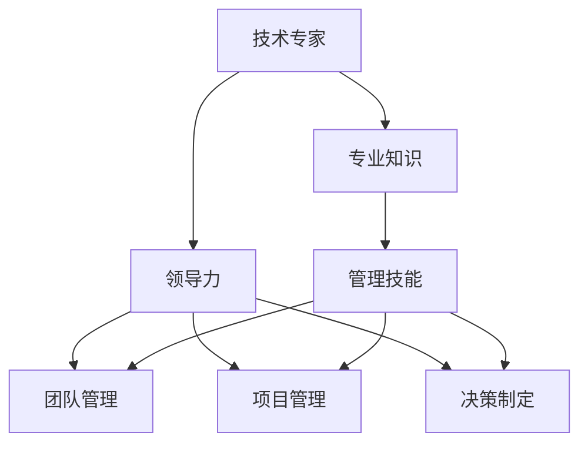

                 

### 文章标题：领导力转型：从技术专家到管理者的蜕变

#### 关键词：领导力、技术专家、管理者、转型、管理技能

#### 摘要：
本文旨在探讨技术专家向管理者转型的过程和关键要素。通过分析转型前的准备、领导力基础、管理技能提升以及实际案例研究，帮助技术专家理解和管理这一变化，最终实现从技术专家到管理者的成功转型。

### 引言

在信息技术快速发展的时代，技术专家作为企业的核心力量，扮演着不可或缺的角色。然而，随着企业规模的扩大和市场环境的复杂化，技术专家需要承担更多的责任，逐步从技术层面的工作转向管理工作。这种转变不仅要求技术专家具备扎实的技术背景，还需要掌握领导力和管理技能。本文将探讨从技术专家到管理者的领导力转型过程，分析转型的必要性和关键要素，以帮助技术专家顺利完成这一重要蜕变。

### 背景介绍

#### 技术专家的角色

技术专家通常在特定技术领域拥有深厚的专业知识和丰富的实践经验。他们擅长解决技术难题，优化系统性能，推动技术创新。然而，随着技术的发展，技术专家的角色也逐渐发生变化。除了技术上的专精，技术专家还需要具备跨领域的视野和沟通协作能力。

#### 管理者的职责

管理者则侧重于团队和组织的管理。他们需要制定战略规划，协调资源，确保项目的顺利进行。管理者的核心职责包括团队领导、项目管理和决策制定。这些能力与纯粹的技术能力有很大的不同，需要技术专家在转型过程中不断学习和提升。

### 核心概念与联系

为了更好地理解技术专家到管理者的转变，我们可以用Mermaid流程图来展示核心概念之间的关系：

从图中可以看出，技术专家的转型不仅需要专业知识，还需要领导力和管理技能。这些能力相互作用，共同推动技术专家向管理者的转变。

### 转型前的准备

#### 技术专家的职责和挑战

在转型前，技术专家需要明确自己的职责和面临的挑战。技术专家的主要职责包括：

1. **技术研究与开发**：持续关注新技术，推动技术创新，解决技术难题。
2. **技术指导与支持**：为团队成员提供技术指导和支持，确保项目顺利进行。
3. **技术文档编写**：编写技术文档，为团队成员提供参考。

面临的挑战主要包括：

1. **技术深度与广度的平衡**：在技术不断发展的同时，保持自己的技术深度和广度。
2. **团队协作与沟通**：与团队成员有效沟通，协调各项工作。

#### 技术视野与跨学科知识

技术专家需要拓展自己的技术视野，了解其他相关领域的知识。这有助于他们在管理角色中更好地理解和协调团队的工作。例如，了解业务流程、市场动态和项目管理知识，都有助于技术专家更好地管理团队和项目。

#### 心态调整：从技术到管理的转变

心态的调整是技术专家转型过程中的关键。他们需要从技术思维转向管理思维，学会从全局角度看待问题，关注团队和组织的发展。此外，他们还需要克服自我怀疑和焦虑，积极面对管理挑战。

### 领导力基础

领导力是技术专家转型为管理者的核心能力。以下是领导力的几个基本概念和原则：

#### 领导力定义与类型

领导力是指通过影响力、激励和指导来引导他人实现共同目标的能力。根据不同维度，领导力可以分为以下几种类型：

1. **变革型领导**：通过激发团队成员的潜力和创造力，推动组织变革。
2. **交易型领导**：通过明确的绩效标准和奖励机制，确保团队成员的工作效率。
3. **情境型领导**：根据不同情境和团队成员的特点，采取不同的领导风格。

#### 领导力在技术管理中的重要性

在技术管理中，领导力的重要性体现在以下几个方面：

1. **团队凝聚力**：通过领导力，建立团队的共同目标和文化，增强团队凝聚力。
2. **创新动力**：激发团队成员的创新潜力，推动技术进步和业务发展。
3. **问题解决**：在面对技术难题时，领导者需要具备解决问题的能力和决策能力。

#### 领导力自我评估

技术专家在转型过程中，需要进行领导力自我评估，了解自己的优势和不足。以下是一些常用的评估工具和方法：

1. **360度反馈**：通过同事、下属和上级的反馈，全面了解自己的领导力表现。
2. **领导力发展计划**：制定个人发展计划，设定目标和改进措施。
3. **领导力培训**：参加领导力培训课程，学习先进的管理理念和技能。

### 领导力原则

在技术管理中，领导力原则是确保团队高效运作的基础。以下是几个关键的领导力原则：

#### 价值观与愿景

价值观是团队的灵魂，决定了团队成员的行为和决策。技术管理者需要明确团队的价值观，并将其融入到日常工作中。同时，愿景为团队提供了明确的目标和方向，激励团队成员为实现共同目标而努力。

#### 沟通与协作

沟通是领导力的核心，技术管理者需要具备出色的沟通能力，确保信息的透明和及时传达。协作则是团队工作的基础，技术管理者需要促进团队成员之间的合作，发挥集体智慧。

#### 建立团队信任

信任是团队协作的基石。技术管理者需要通过建立透明的沟通机制、公平的决策过程和负责任的行动，赢得团队成员的信任。信任有助于增强团队的凝聚力和协作效率。

### 管理技能提升

#### 团队管理

团队管理是技术管理者的重要职责。以下是团队管理的几个关键点：

1. **团队构建**：明确团队目标和角色分工，确保团队成员具备合适的技能和资源。
2. **领导风格与团队动力**：根据团队成员的特点和需求，采取合适的领导风格，激发团队动力。
3. **团队成员激励与发展**：通过激励机制和发展机会，提升团队成员的积极性和能力。

#### 项目管理

项目管理是技术管理者的重要任务。以下是项目管理的几个关键环节：

1. **项目管理框架**：制定项目计划，明确项目目标、范围、进度和资源。
2. **项目风险与问题管理**：识别项目风险，制定应对策略，及时解决问题，确保项目顺利进行。
3. **项目沟通与协调**：建立有效的沟通机制，确保团队成员之间的信息共享和协作。

#### 决策制定

决策制定是技术管理者的重要能力。以下是决策制定的几个关键要素：

1. **决策模型与工具**：了解并运用不同的决策模型和工具，提高决策的科学性和准确性。
2. **数据驱动决策**：基于数据和事实进行决策，避免主观偏见和盲目决策。
3. **决策后果分析**：评估不同决策的可能后果，制定应对措施，降低决策风险。

### 转型实践

#### 成功案例研究

通过分析成功案例，可以更好地理解技术专家转型为管理者的过程和关键要素。以下是几个典型的成功案例：

1. **案例一：技术专家转型为技术经理**
   - **背景**：一位资深软件开发工程师，因公司业务扩展需要，被提拔为技术经理。
   - **过程**：在转型过程中，他首先进行了领导力培训，学习团队管理和项目管理知识。同时，他积极参与公司内部培训和外部交流，提升自己的综合能力。
   - **结果**：经过一年的努力，他成功领导团队完成了多个关键项目，提升了团队的凝聚力和工作效率。

2. **案例二：技术总监领导团队转型**
   - **背景**：一家创业公司，技术总监因公司发展需要，从技术主导转向管理主导。
   - **过程**：技术总监首先制定了一套明确的管理目标和计划，并建立了高效的团队沟通机制。同时，他注重团队成员的个人发展和职业规划，提升团队的整体实力。
   - **结果**：在公司快速发展的过程中，技术团队发挥了关键作用，推动了公司业务的持续增长。

3. **案例三：跨部门协作与领导力提升**
   - **背景**：一家大型企业，技术部门与其他部门之间存在协作障碍，影响项目进展。
   - **过程**：技术部门经理通过组织跨部门沟通会议，建立信任和合作关系。同时，他注重提升自己的领导力，通过示范和激励，促进团队成员的协作和创新。
   - **结果**：跨部门协作效率大幅提升，项目进展顺利，企业整体运营效率得到提高。

#### 跨越技术与管理界限

在转型过程中，技术专家需要跨越技术和管理之间的界限。这包括：

1. **角色转变**：从技术主导转向管理主导，关注团队和组织的发展。
2. **知识拓展**：学习管理知识和技能，提升自己的综合能力。
3. **心态调整**：适应新的工作环境和职责，积极面对管理挑战。

#### 持续学习和适应变化

转型不是一蹴而就的过程，技术专家需要持续学习和适应变化。以下是一些建议：

1. **参加培训**：定期参加领导力和管理技能培训，学习先进的管理理念和方法。
2. **阅读书籍**：阅读相关领域的书籍和文章，提升自己的知识储备。
3. **实践应用**：将学到的知识和技能应用到实际工作中，不断总结和改进。

### 结论

从技术专家到管理者的转型是一个充满挑战和机遇的过程。通过本文的探讨，我们可以看到，领导力和管理技能的提升是成功转型的关键。技术专家需要明确自己的职责和挑战，学习领导力的基本概念和原则，提升管理技能，并通过实际案例研究和实践，不断提升自己的领导力和管理能力。

在未来，随着信息技术的发展和企业需求的不断变化，技术专家向管理者的转型将越来越重要。技术专家需要不断学习和适应，才能在新的角色中发挥更大的作用，推动企业和团队的持续发展。

### 作者信息

作者：AI天才研究院/AI Genius Institute & 禅与计算机程序设计艺术 /Zen And The Art of Computer Programming

### 附录

#### 附录A：领导力评估工具

- 360度反馈问卷
- 领导力发展评估工具

#### 附录B：推荐阅读书目与资源

- 《领导力五项修炼》：John C. Maxwell
- 《团队协作的五种语言》：Patrick Lencioni
- 《项目管理知识体系指南》（PMBOK指南）：Project Management Institute

### 结语

领导力转型：从技术专家到管理者的蜕变，不仅是个人职业发展的新篇章，也是推动企业创新和发展的关键。让我们携手前行，共同迎接这个充满挑战和机遇的新时代。**（字数：2779）**

