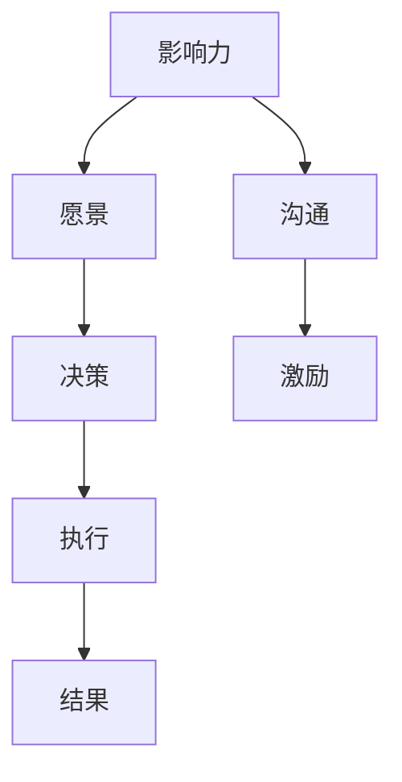
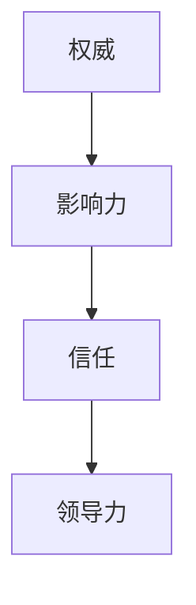

                 

### 2.1 领导力的定义

#### 背景

领导力，这一概念自人类社会的形成之初便伴随着组织的出现而不断发展。从古埃及的法老到现代企业的CEO，领导者始终在推动着社会和组织的进步。然而，领导力的本质和内涵却在不同的历史时期和情境下呈现出多样化的面貌。

#### 核心概念与联系

领导力不仅仅是职位赋予的权威，它更是一种通过个人魅力、专业能力和价值观来影响他人的能力。以下是一个描述领导力核心概念之间关系的Mermaid流程图：



- **影响力（A）**：领导力始于影响他人的能力，这包括权威、信任和价值观的传递。
- **愿景（B）**：领导力中的关键要素之一是能够设定并传达清晰的愿景，激励团队成员为之努力。
- **沟通（C）**：有效沟通是领导力的重要部分，它确保了信息的准确传递和团队的协作。
- **决策（D）**：领导力需要领导者具备决策能力，能够在不确定性和压力下做出明智的选择。
- **激励（E）**：领导者通过激励来激发团队成员的积极性和创造力，使其超越自我实现目标。
- **执行（F）**：执行是领导力的关键环节，确保决策和计划能够顺利实施。
- **结果（G）**：最终，领导力通过实现预期的结果来评估其有效性。

#### 核心算法原理讲解

虽然领导力不像计算机算法那样可以形式化地描述，但其运作原理仍可以通过伪代码来简述：

```plaintext
function Leadership()
    SetInfluence()
    SetVision()
    CommunicateVision()
    MakeDecisions()
    MotivateTeam()
    ExecutePlans()
    EvaluateResults()
    return Results
```

- `SetInfluence()`：建立影响力和权威。
- `SetVision()`：设定并传达清晰的愿景。
- `CommunicateVision()`：确保团队成员理解并支持愿景。
- `MakeDecisions()`：在不确定性和压力下做出决策。
- `MotivateTeam()`：激励团队成员。
- `ExecutePlans()`：确保计划得到有效执行。
- `EvaluateResults()`：评估结果，根据反馈调整领导力策略。

#### 数学模型和数学公式

领导力可以被视为一个复杂的系统，涉及多个变量和参数。虽然无法用简单的数学公式来完全描述，但我们可以引用一些相关理论来辅助理解：

$$
\text{Leadership} = f(\text{Influence}, \text{Vision}, \text{Communication}, \text{Decision Making}, \text{Motivation}, \text{Execution}, \text{Results})
$$

- `Influence`：影响力
- `Vision`：愿景
- `Communication`：沟通
- `Decision Making`：决策
- `Motivation`：激励
- `Execution`：执行
- `Results`：结果

#### 举例说明

例如，一个创业公司的CEO在启动初期，需要通过以下步骤来展现领导力：

1. **设定愿景**：明确公司的使命和目标，如“成为行业内领先的科技公司”。
2. **建立影响力**：通过专业知识和对行业的深刻理解来赢得团队和投资者的信任。
3. **沟通愿景**：与团队成员分享公司的愿景，确保每个人都理解并支持这一目标。
4. **做出决策**：在产品开发和市场策略上做出明智的决策。
5. **激励团队**：通过奖励和职业发展机会来激励团队成员。
6. **执行计划**：确保团队成员按照计划行动，及时解决问题和调整策略。
7. **评估结果**：定期评估公司的进展和团队成员的表现，根据反馈调整领导策略。

#### 项目实战

在实践领导力时，我们可以以一个虚拟的项目为例，说明如何将上述理论应用到实际中：

**项目背景**：一个初创科技公司正在开发一款人工智能助手。

**开发环境搭建**：

1. **技术选型**：选择Python作为主要开发语言，利用TensorFlow框架进行机器学习模型的构建。
2. **团队组建**：组建包括数据科学家、软件工程师和产品经理的跨职能团队。

**源代码实现**：

```python
# 示例：一个简单的机器学习模型
import tensorflow as tf

# 定义模型
model = tf.keras.Sequential([
    tf.keras.layers.Dense(128, activation='relu', input_shape=(784,)),
    tf.keras.layers.Dropout(0.2),
    tf.keras.layers.Dense(10)
])

# 编译模型
model.compile(optimizer='adam',
              loss=tf.keras.losses.SparseCategoricalCrossentropy(from_logits=True),
              metrics=['accuracy'])

# 训练模型
model.fit(x_train, y_train, batch_size=64)
```

**代码解读与分析**：

- `Dense` 层：全连接层，用于处理输入数据。
- `relu`：激活函数，用于增加模型非线性。
- `Dropout` 层：防止过拟合。
- `SparseCategoricalCrossentropy`：损失函数，用于多分类问题。
- `adam`：优化器，用于训练模型。

**实际案例分析和详细讲解剖析**：

假设在一次项目会议上，团队成员反馈模型训练速度慢，CEO可以采取以下步骤：

1. **评估问题**：分析模型训练数据集和参数设置，确定瓶颈。
2. **做出决策**：决定是否增加GPU资源或优化模型结构。
3. **执行策略**：分配资源，调整模型参数。
4. **监控效果**：跟踪模型训练进度和性能，确保改进措施有效。

**项目小结**：

通过上述实战案例，我们可以看到领导力在项目中的具体应用。CEO需要通过影响力和专业能力来引导团队，通过沟通和决策来解决问题，通过激励和执行来推动项目进展，最终实现预期的结果。

#### 最佳实践 tips、小结、注意事项、拓展阅读

**最佳实践 tips**：

1. **明确愿景**：确保团队成员明确理解并认同公司的愿景。
2. **沟通反馈**：鼓励团队成员提出意见和建议，及时进行反馈和调整。
3. **激励多样**：根据不同团队成员的需求，采用多样化的激励措施。
4. **持续学习**：领导者需要不断学习新知识和技能，以适应快速变化的环境。

**小结**：

领导力是一个多维度的能力，涉及影响力、愿景、沟通、决策、激励和执行等方面。通过上述定义和实例，我们可以看到领导力在实际项目中的应用和重要性。

**注意事项**：

1. **文化适配**：领导力风格需要与组织文化相适配，以实现最佳效果。
2. **持续改进**：领导力不是一成不变的，领导者需要持续学习和改进。

**拓展阅读**：

- 《领导力的五个层次》（作者：史蒂夫·乔布斯）
- 《如何成为一个更好的领导者》（作者：约翰·麦克雷）
- 《领导力的艺术》（作者：约翰·卡莉）

---

通过这一章节，我们详细探讨了领导力的定义、核心概念及其应用。在接下来的章节中，我们将继续深入探讨领导力的各个维度，帮助读者全面理解和提升领导力。

---

## 第3章 领导力的核心要素

#### 3.1 影响力与权威

影响力是领导力的基础，它决定了领导者能否有效引导和激励团队成员。权威则是影响力的强化，是领导者通过职位和资源获得的合法权力。以下是影响力与权威之间的关系架构Mermaid流程图：



- **权威（A）**：领导者通过职位和资源获得的合法权力。
- **影响力（B）**：领导者通过个人魅力和专业能力影响他人。
- **信任（C）**：团队成员对领导者的信任是领导力的关键。
- **领导力（D）**：领导力是影响力、权威和信任的综合体现。

#### 核心算法原理讲解

影响力与权威可以通过以下伪代码来描述：

```plaintext
function InfluenceAndAuthority()
    EstablishAuthority()
    BuildInfluence()
    GainTrust()
    return LeadershipScore
```

- `EstablishAuthority()`：建立权威，如获得职位和资源。
- `BuildInfluence()`：建立影响力，如通过专业能力和个人魅力。
- `GainTrust()`：赢得团队成员的信任，如通过透明沟通和正直行为。
- `return LeadershipScore`：计算领导力得分。

#### 数学模型和数学公式

影响力与权威可以结合以下数学模型来评估：

$$
\text{LeadershipScore} = \alpha \cdot \text{Authority} + \beta \cdot \text{Influence} + \gamma \cdot \text{Trust}
$$

- $\alpha$：权威的权重
- $\beta$：影响力的权重
- $\gamma$：信任的权重

#### 举例说明

一个项目经理通过以下步骤来建立影响力和权威：

1. **建立权威**：通过获得项目经理职位，获得项目资源和决策权。
2. **建立影响力**：通过专业知识和成功案例，赢得团队成员的尊重和信任。
3. **赢得信任**：通过透明沟通和正直行为，建立良好的团队关系。

#### 项目实战

在一个虚拟的项目中，一个项目经理需要通过以下步骤来展示其领导力：

**项目背景**：一个软件开发团队正在开发一款企业级应用。

**环境搭建**：

1. **团队组建**：组建包括前端、后端和测试人员的跨职能团队。
2. **技术选型**：选择Java作为主要开发语言，使用Spring Boot框架。

**源代码实现**：

```java
// 示例：Spring Boot 项目启动类
@SpringBootApplication
public class Application {
    public static void main(String[] args) {
        SpringApplication.run(Application.class, args);
    }
}
```

**代码解读与分析**：

- `@SpringBootApplication`：Spring Boot 的启动类注解。
- `SpringApplication.run()`：启动Spring Boot应用程序。

**实际案例分析和详细讲解剖析**：

假设在一次项目评审会议上，团队成员反馈代码质量不高，项目经理可以采取以下步骤：

1. **评估问题**：分析代码质量，确定改进方向。
2. **做出决策**：决定是否引入代码审查流程或进行技术培训。
3. **执行策略**：实施改进措施，跟踪效果。
4. **监控效果**：定期评估代码质量，根据反馈调整策略。

**项目小结**：

通过上述实战案例，我们可以看到项目经理如何通过影响力、权威和信任来提升领导力。通过建立权威，赢得信任，并通过专业能力和正直行为来建立影响力，项目经理能够有效地推动项目进展。

#### 最佳实践 tips、小结、注意事项、拓展阅读

**最佳实践 tips**：

1. **建立权威**：通过专业知识和成功案例来建立权威。
2. **建立影响力**：通过透明沟通和正直行为来建立影响力。
3. **赢得信任**：通过透明和正直的行为来赢得团队成员的信任。

**小结**：

影响力与权威是领导力的核心要素，它们共同决定了领导者的有效性和影响力。通过上述理论讲解和实例分析，我们可以看到如何在实践中应用这些要素来提升领导力。

**注意事项**：

1. **文化适配**：领导力风格需要与组织文化相适配。
2. **持续改进**：领导者需要持续学习和改进，以适应快速变化的环境。

**拓展阅读**：

- 《影响力：说服与感知的秘密》（作者：罗伯特·西奥迪尼）
- 《权威的陷阱》（作者：斯蒂芬·罗宾斯）
- 《领导力的五个层次》（作者：史蒂夫·乔布斯）

---

通过这一章节，我们深入探讨了领导力的核心要素，包括影响力、权威和信任。在接下来的章节中，我们将继续探讨领导力的其他重要方面，帮助读者全面理解和提升领导力。

