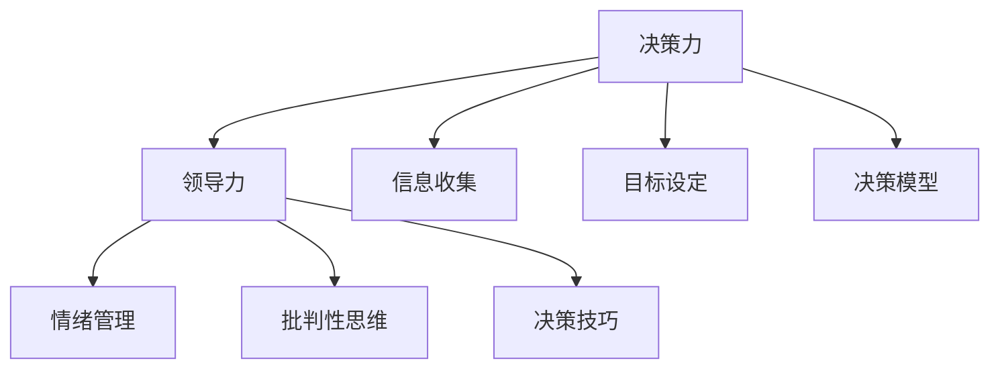

                 

## 《领导者的决断力：在关键时刻做出抉择》

### 关键词：领导者、决策力、关键时刻、抉择、技术管理

> 摘要：
> 本文深入探讨了领导者在关键时刻的决断力，分析了决策的重要性、决策过程中的关键因素、提升决断力的策略以及决策力在实践中的应用。文章通过实际案例和算法原理讲解，旨在帮助读者理解并提升领导者的决策能力。

---

## 第一部分：领导者决策的基础

### 第1章：决策力的重要性

在复杂多变的技术领域，领导者的决策力显得尤为重要。决策不仅仅是选择A或B，更是一种判断、分析和权衡。领导者决策的成功与否，直接影响到组织的战略方向、员工士气以及最终的业务成果。

#### 1.1 决策在领导中的作用

决策是领导的核心职责之一。领导者的决策不仅影响团队当前的行动，还塑造了团队未来的发展方向。成功的决策能够引领团队走出困境，实现目标；而失败的决策则可能导致资源浪费、目标偏离，甚至组织崩溃。

#### 1.2 领导决策的挑战

领导决策面临着诸多挑战。首先，信息的不确定性和复杂性使得决策者难以获取全面的信息。其次，情绪因素往往会影响决策者的判断。最后，组织内部和外部的压力也会对决策产生干扰。

#### 1.3 提升决策力的必要性

提升决策力是每个领导者必须面对的课题。有效的决策能力能够帮助领导者更好地应对挑战，抓住机遇，实现组织的目标。此外，提升决策力也是领导者在竞争激烈的商业环境中保持优势的关键。

### 第2章：决策过程中的关键因素

一个成功的决策需要考虑多个关键因素。这些因素相互作用，共同决定了决策的质量和效果。

#### 2.1 信息收集与分析

信息是决策的基础。领导者需要收集准确、全面的信息，并通过分析来识别关键因素和潜在风险。高质量的信息能够提高决策的准确性和有效性。

#### 2.2 目标设定与优先级

明确的目标是决策的指引。领导者需要设定清晰的目标，并确定各项决策的优先级。这有助于确保决策与组织的战略目标一致。

#### 2.3 决策制定与评估

制定决策是决策过程中的核心环节。领导者需要结合信息分析和目标设定，选择最佳方案。同时，决策的评估也是必不可少的，通过评估来验证决策的有效性，并为未来的决策提供反馈。

### 第3章：决策模型与工具

在决策过程中，使用适当的模型和工具能够帮助领导者更科学地进行决策。

#### 3.1 SWOT分析

SWOT分析是一种常用的战略规划工具，通过分析组织的优势、劣势、机会和威胁，帮助领导者制定更具针对性的决策。

#### 3.2 成本效益分析

成本效益分析通过比较成本和效益，帮助领导者评估不同决策方案的经济性。

#### 3.3 决策树

决策树是一种直观的决策模型，通过树状图展示不同决策路径和结果，帮助领导者进行复杂决策。

---

## 第二部分：领导者如何提高决断力

### 第4章：情绪管理

情绪管理是提升决策力的关键因素之一。领导者需要学会如何管理自己的情绪，以避免情绪干扰决策。

#### 4.1 决策中的情绪因素

情绪因素在决策中起着重要作用。积极情绪可以提高决策的质量和效率，而消极情绪则可能导致决策偏差和失误。

#### 4.2 如何管理情绪

领导者可以通过培养自我意识、学会放松和运用情绪调节技巧来管理情绪。这有助于提高决策的客观性和准确性。

#### 4.3 增强情绪智力

情绪智力是指识别、理解、管理和运用情绪的能力。领导者可以通过提升情绪智力来更好地管理自己的情绪，从而提升决策力。

### 第5章：批判性思维

批判性思维是领导者决策的重要工具。它帮助领导者从多个角度分析问题，避免盲目跟从和思维定势。

#### 5.1 批判性思维的重要性

批判性思维能够帮助领导者识别问题的本质，发现潜在的解决方案，并评估不同方案的风险和收益。

#### 5.2 如何培养批判性思维

领导者可以通过阅读、讨论和实践来培养批判性思维。这有助于提高决策的深度和广度。

#### 5.3 提升决策质量的策略

批判性思维结合以下策略，可以进一步提升决策质量：
- 多元化观点：收集不同领域的专家意见，避免单一视角。
- 前景分析：考虑长期影响，避免短期利益。
- 复盘总结：从失败中学习，不断完善决策过程。

### 第6章：决策技巧

决策技巧是领导者提升决断力的实用方法。以下技巧可以帮助领导者更高效地做出决策。

#### 6.1 快速决策

在紧急情况下，快速决策至关重要。领导者需要学会如何在压力下快速分析问题，并做出合理的决策。

#### 6.2 风险管理

风险管理是决策过程中不可或缺的一环。领导者需要评估不同决策的风险，并制定相应的应对策略。

#### 6.3 应对不确定性的策略

在不确定的环境中，领导者需要具备灵活性和适应性。通过建立应急预案和持续学习，领导者可以更好地应对不确定性。

---

## 第三部分：决策力在实践中的应用

### 第7章：领导者在危机中的决策

在危机中，领导者的决策力显得尤为重要。危机识别、应急决策和危机后的恢复与反思是领导者应对危机的关键步骤。

#### 7.1 危机识别

及时识别危机是成功应对的前提。领导者需要保持警惕，及时发现潜在的危机信号。

#### 7.2 应急决策

在危机爆发时，领导者需要迅速做出决策，采取有效措施来控制局面。这要求领导者具备快速反应和果断决策的能力。

#### 7.3 危机后的恢复与反思

危机过后，领导者需要总结经验教训，反思决策过程中的得失，并为未来的危机应对做好准备。

### 第8章：决策力在团队管理中的应用

团队决策的质量直接影响组织的效果。领导者需要掌握团队决策的技巧，提高决策效率。

#### 8.1 团队决策的挑战

团队决策面临沟通不畅、利益冲突、决策效率低等问题。领导者需要解决这些挑战，提高团队决策的质量。

#### 8.2 提高团队决策效率

领导者可以通过以下策略提高团队决策效率：
- 明确目标：确保团队成员对决策目标有清晰的理解。
- 增强沟通：鼓励团队成员开放沟通，共享信息。
- 利用工具：运用决策模型和工具，帮助团队做出更科学的决策。

#### 8.3 决策失误的应对

即使团队做出了错误的决策，领导者也需要积极应对。通过总结经验、调整策略，领导者可以带领团队走出困境。

### 第9章：领导者的持续成长

持续成长是领导者提升决策力的关键。以下策略可以帮助领导者实现持续成长。

#### 9.1 决策学习的路径

领导者需要不断学习，通过阅读、培训和实战来提升自己的决策能力。

#### 9.2 反思与自我评估

反思决策过程，自我评估决策效果，是领导者提升决策力的重要手段。

#### 9.3 持续改进决策力

领导者需要不断反思和改进决策过程，以适应不断变化的环境。

---

## 附录

### 附录A：决策力提升工具与方法

#### A.1 决策日记

通过记录决策过程和结果，领导者可以更好地总结经验，改进决策方法。

#### A.2 决策研讨会

通过团队讨论和头脑风暴，领导者可以激发创意，提高决策质量。

#### A.3 决策支持系统

利用先进的技术工具，领导者可以更高效地进行决策分析和评估。

### 附录B：领导决策经典案例

#### B.1 企业的成功决策案例

通过分析企业的成功决策案例，领导者可以学习到有效的决策策略和方法。

#### B.2 决策失误的案例分析

通过分析决策失误的案例，领导者可以了解错误决策的成因，并避免重蹈覆辙。

---

**核心概念与联系**



**核心算法原理讲解**

```python
# 决策树算法伪代码
def DecisionTree(data, target_variable):
    if (pureness_of_data(data, target_variable)):
        return majority_class(data, target_variable)
    else:
        # 选择最优特征
        best_feature = find_best_feature(data)
        # 创建决策树节点
        node = Node(best_feature)
        # 对数据进行分组
        for value in unique_values_of(best_feature, data):
            sub_data = subset_of_data(data, value)
            node.add_child(DecisionTree(sub_data, target_variable))
        return node

# 计算数据纯度
def pureness_of_data(data, target_variable):
    # ...

# 找到多数类
def majority_class(data, target_variable):
    # ...
```

**数学模型和数学公式**

决策质量评估公式：
$$ \text{Quality} = \frac{\sum_{i=1}^{n} p_i \cdot r_i}{n} $$

其中，\( p_i \) 为决策成功的概率，\( r_i \) 为决策带来的收益。

**项目实战**

**案例1：企业战略决策**

- 开发环境：Microsoft Excel
- 实现步骤：
  1. 收集市场信息
  2. 设定目标（如市场份额增长5%）
  3. 使用成本效益分析和决策树进行评估
  4. 制定决策方案

- 代码解读与分析：

```python
# 假设收集到的市场信息为字典形式
market_info = {'产品A': {'成本': 100, '预期收益': 200}, '产品B': {'成本': 150, '预期收益': 300}}

# 成本效益分析
def cost_benefit_analysis(products):
    total_cost = 0
    total_revenue = 0
    for product in products:
        total_cost += product['成本']
        total_revenue += product['预期收益']
    return total_revenue - total_cost

# 决策树评估
def decision_tree_evaluation(products):
    # 建立决策树
    root = DecisionTree(products, '预期收益')
    # 遍历决策树，评估每个产品的收益
    for product in products:
        node = root
        for value in product.keys():
            node = node.children[value]
        product['评估收益'] = node.value

# 实际应用
products = market_info.values()
cb_result = cost_benefit_analysis(products)
for product in products:
    product['成本效益比'] = cb_result / product['预期收益']
    decision_tree_evaluation(product)

# 输出结果
for product in products:
    print(f"产品名称：{product['名称']}, 预期收益：{product['预期收益']}, 成本效益比：{product['成本效益比']}")
```

**案例2：技术团队的决策**

- 开发环境：Python
- 实现步骤：
  1. 收集技术需求
  2. 设定项目目标（如提高系统性能10%）
  3. 使用SWOT分析和决策树进行评估
  4. 制定技术方案

- 代码解读与分析：

```python
# 假设收集到的技术需求为列表形式
tech_requirements = [
    {'名称': '优化数据库查询', '成本': 100, '预期收益': 200},
    {'名称': '引入缓存机制', '成本': 150, '预期收益': 300},
    {'名称': '优化网络传输', '成本': 200, '预期收益': 250},
]

# SWOT分析
def swot_analysis(requirements):
    strengths = []
    weaknesses = []
    opportunities = []
    threats = []
    for requirement in requirements:
        # 根据实际情况进行判断，以下为示例
        strengths.append(requirement) if requirement['成本'] < requirement['预期收益'] else weaknesses.append(requirement)
        opportunities.append(requirement) if '机会' in requirement.keys() else threats.append(requirement)
    return strengths, weaknesses, opportunities, threats

# 决策树评估
def decision_tree_evaluation(requirements):
    # 建立决策树
    root = DecisionTree(requirements, '预期收益')
    # 遍历决策树，评估每个需求的收益
    for requirement in requirements:
        node = root
        for value in requirement.keys():
            node = node.children[value]
        requirement['评估收益'] = node.value

# 实际应用
strengths, weaknesses, opportunities, threats = swot_analysis(tech_requirements)
for requirement in tech_requirements:
    requirement['SWOT分析结果'] = [strengths, weaknesses, opportunities, threats]
    decision_tree_evaluation(requirement)

# 输出结果
for requirement in tech_requirements:
    print(f"需求名称：{requirement['名称']}, 预期收益：{requirement['预期收益']}, SWOT分析结果：{requirement['SWOT分析结果']}")
```

---

**最佳实践 tips**

- **定期反思**：领导者应定期反思决策过程和结果，找出成功和失败的原因，为未来的决策提供参考。
- **团队合作**：在决策过程中，领导者应充分调动团队成员的积极性，鼓励他们参与讨论，共同制定决策。
- **持续学习**：领导者应保持学习的热情，关注行业动态和新兴技术，不断提升自己的专业能力和决策水平。

**小结**

本文深入探讨了领导者在关键时刻的决断力，分析了决策的重要性、决策过程中的关键因素、提升决断力的策略以及决策力在实践中的应用。通过实际案例和算法原理讲解，本文旨在帮助读者理解并提升领导者的决策能力。

**注意事项**

- 决策过程中，领导者应充分考虑各种因素，避免片面决策。
- 面对不确定性，领导者应保持冷静，灵活应对。
- 在团队管理中，领导者应注重沟通与协作，提高团队决策效率。

**拓展阅读**

- 《决策分析：技术与应用》
- 《领导者的决策艺术》
- 《危机管理：应对不确定性的策略》

---

作者：AI天才研究院/AI Genius Institute & 禅与计算机程序设计艺术 /Zen And The Art of Computer Programming

