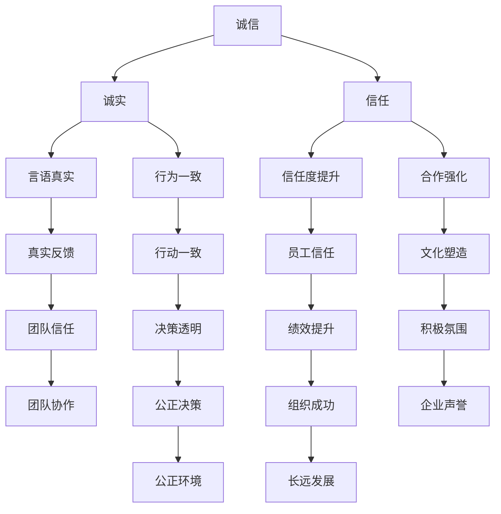

                 


### 文章标题

# 领导者的品格塑造：诚信与正直的重要性

### 文章关键词

- 领导者品格
- 诚信
- 正直
- 领导力模型
- 组织文化
- 案例分析

### 文章摘要

本文将探讨诚信与正直在领导者品格塑造中的核心地位。首先，我们将介绍诚信与正直的定义及其在领导力中的重要性。接着，通过分析领导力模型，阐述诚信与正直在领导者行为中的具体体现。随后，我们将深入探讨领导者如何塑造和展现诚信与正直品格，以及这些品格对组织文化和员工行为的影响。文章将通过案例分析，展示诚信与正直在实际领导中的具体应用，并总结出最佳实践策略。最后，我们将对全文进行总结，并展望诚信与正直在领导力发展中的未来趋势。

## 第1章 引言：诚信与正直在领导力中的重要性

### 1.1 诚信与正直的定义

在领导力领域，诚信和正直是两个核心概念。诚信（Integrity）指的是一个人言行一致，始终保持真实和诚实的品质。正直（Honour）则涉及一个人在道德和伦理方面的坚定立场，始终遵循正确的原则和价值观。这两个概念在领导力中至关重要，因为领导者的行为和决策直接影响到整个组织的文化和氛围。

### 1.2 领导力与品格的关系

领导力不仅仅是技术和战略的管理能力，它还涉及到个人的品格和道德价值观。领导者的品格决定了他们如何处理权力、责任和挑战。一个具有诚信和正直品格的领导者，能够赢得员工的信任和尊重，从而建立强大的团队和积极的企业文化。相反，缺乏诚信和正直的领导者可能会破坏团队士气，导致组织内部的信任危机。

### 1.3 诚信与正直在领导力中的重要性

诚信与正直是领导力的基石。它们不仅影响领导者的个人形象，也直接影响组织的整体绩效。具有诚信和正直品格的领导者能够：

1. **建立信任**：员工更愿意跟随一个诚实正直的领导者。
2. **提升道德标准**：领导者的行为会潜移默化地影响员工的行为准则。
3. **降低风险**：诚信和正直能够预防欺诈、腐败和其他不道德行为。
4. **增强团队合作**：一个正直的领导者能够促进团队成员之间的相互信任和合作。

因此，诚信与正直是领导者品格塑造中不可或缺的元素。在接下来的章节中，我们将深入探讨这些概念，并提供实际案例和策略，帮助领导者更好地理解和实践诚信与正直。

## 第2章 诚信与正直的核心概念

### 2.1 诚信的理论基础

诚信是一种道德和伦理原则，它要求个人在行为和决策中始终保持真实和诚实。在领导力领域，诚信不仅体现在言语上，还包括行动的一致性。根据道德哲学家的定义，诚信可以分为两个主要方面：诚实（Sincerity）和信任（Trustworthiness）。

- **诚实**指的是一个人在言行上不虚伪、不欺骗，始终保持真实。例如，一个诚实的领导者会真实地反馈团队的表现，而不是为了安抚情绪而说谎。
- **信任**则是指个人或组织对另一个个人或组织的信任和依赖。在一个诚信的组织中，员工相信领导者的决策和承诺，而领导者也信任员工的忠诚和能力。

诚信的理论基础可以追溯到古代哲学和现代管理学。亚里士多德认为，诚信是一种道德美德，是人类行为的指导原则。现代管理学则强调诚信作为企业成功的关键因素，特别是在全球化和管理复杂化的背景下。

### 2.2 正直的理论基础

正直是一种坚定的道德和伦理立场，它要求个人在面对道德和伦理困境时，始终保持原则和价值观的坚定。正直的核心在于公正（Justice）和正义（Righteousness）。

- **公正**意味着在处理事务时，每个人都能得到公平的待遇。公正的领导者会确保团队中的每个成员都有机会表达意见，并且决策过程中不会偏袒某些人。
- **正义**则涉及对正确和错误进行判断，并采取相应的行动。一个正直的领导者会在面对错误时勇于承认和纠正，而不是为了保护自己的地位而掩盖事实。

正直的理论基础同样源于古代哲学。柏拉图和亚里士多德都强调了正义和公正的重要性。现代管理学则通过道德准则和企业伦理来阐述正直的价值。例如，世界著名的咨询公司麦肯锡（McKinsey & Company）就提出了“正直行为”作为其核心价值观之一。

### 2.3 诚信与正直的联系与区别

诚信与正直虽然紧密相关，但它们在概念上有一些区别。诚信更侧重于个人行为的一致性和真实性，而正直则更多地涉及道德和伦理原则的坚定性。

- **联系**：诚信和正直都是道德和伦理原则的体现，它们共同构成了一个人的品格。一个具有诚信和正直品格的领导者，不仅在个人行为上表现出真实和公正，而且在面对道德困境时，也能坚持正确的原则。
- **区别**：诚信主要关注行为和言语的一致性，而正直则涉及更深层次的道德立场和决策。例如，一个诚信的领导者可能会避免在团队中透露私人信息，而一个正直的领导者则会在面对不道德行为时勇于站出来反对。

总之，诚信和正直是领导力中的核心概念，它们不仅影响着领导者的个人形象，也直接决定了组织的文化和氛围。在接下来的章节中，我们将进一步探讨这些概念如何在实际领导行为中体现，并提供具体的实践策略。

### 2.4 诚信与正直的核心概念关系架构 Mermaid 流程图



通过这个 Mermaid 流程图，我们可以清晰地看到诚信和正直之间的联系及其对领导力和组织文化的影响。诚信包括诚实和信任两个子概念，而正直则强调公正和正义。这两个概念相互促进，共同构建了一个领导者应有的品格。

### 2.5 核心算法原理讲解：领导力模型的构建

为了更好地理解诚信与正直在领导力模型中的具体应用，我们可以采用一种伪代码来构建一个简化的领导力模型。该模型将包括三个主要部分：诚信指标（Integrity Metrics）、正直指标（Honour Metrics）和领导力评估（Leadership Assessment）。

```python
# 定义诚信指标和正直指标的计算方法
def calculate_integrity(sincerity, trustworthiness):
    # 参数 sincerity 和 trustworthiness 分别表示诚实和信任的程度
    integrity_score = (sincerity + trustworthiness) / 2
    return integrity_score

def calculate_honour(justice, righteousness):
    # 参数 justice 和 righteousness 分别表示公正和正义的程度
    honour_score = (justice + righteousness) / 2
    return honour_score

# 定义领导力评估函数
def assess_leadership(integrity_score, honour_score):
    # 参数 integrity_score 和 honour_score 分别表示诚信和正直的得分
    if integrity_score > 0.8 and honour_score > 0.8:
        leadership_level = "High"
    elif integrity_score > 0.5 and honour_score > 0.5:
        leadership_level = "Medium"
    else:
        leadership_level = "Low"
    return leadership_level

# 示例计算
sincerity = 0.9
trustworthiness = 0.85
justice = 0.75
righteousness = 0.8

integrity_score = calculate_integrity(sincerity, trustworthiness)
honour_score = calculate_honour(justice, righteousness)
leadership_level = assess_leadership(integrity_score, honour_score)

print("Integrity Score:", integrity_score)
print("Honour Score:", honour_score)
print("Leadership Level:", leadership_level)
```

在这个伪代码中，我们首先定义了诚信指标和正直指标的计算方法，分别通过诚实和信任的程度（sincerity 和 trustworthiness）以及公正和正义的程度（justice 和 righteousness）来计算得分。接着，我们定义了一个领导力评估函数，通过这两个得分来判断领导者的领导力水平。

### 2.6 数学模型和公式 & 详细讲解 & 举例说明

在领导力模型中，诚信和正直的评估不仅依赖于定性分析，还可以通过定量方法进行更精确的评估。以下是一个简化的数学模型，用于计算领导者的诚信和正直得分。

#### 数学模型：

$$
I = \frac{S + T}{2} \quad \text{(诚信得分)}
$$

$$
H = \frac{J + R}{2} \quad \text{(正直得分)}
$$

其中：
- \(I\) 代表诚信得分
- \(S\) 代表诚实程度
- \(T\) 代表信任程度
- \(H\) 代表正直得分
- \(J\) 代表公正程度
- \(R\) 代表正义程度

#### 公式解释：

- 诚信得分 \(I\) 是诚实程度 \(S\) 和信任程度 \(T\) 的平均值，表示领导者行为和决策的一致性和可靠性。
- 正直得分 \(H\) 是公正程度 \(J\) 和正义程度 \(R\) 的平均值，表示领导者在道德和伦理困境中的坚定性和原则性。

#### 举例说明：

假设某领导者在诚实和信任方面都表现出色，分别得分为 0.9 和 0.8；在公正和正义方面，得分分别为 0.7 和 0.8。我们可以通过以下公式计算其诚信和正直得分：

$$
I = \frac{0.9 + 0.8}{2} = 0.85
$$

$$
H = \frac{0.7 + 0.8}{2} = 0.75
$$

因此，这位领导者的诚信得分为 0.85，正直得分为 0.75。

### 2.7 实际案例分析：诚信与正直在领导力中的体现

#### 案例一：丰田汽车公司的质量管理

丰田汽车公司以其卓越的质量管理而闻名于世。在丰田，诚信和正直是质量管理体系的基石。例如，丰田的“五个为什么”方法（5 Whys）用于深入分析问题的根本原因，而不是仅仅解决表面的症状。这种方法要求团队成员在面对问题时，坚持真实和诚实的原则，通过不断的追问和反思，找出问题的真正根源。

#### 案例二：谷歌的员工信任文化

谷歌以其开放和信任的文化著称。谷歌的创始人谢尔盖·布林和拉里·佩奇都非常重视诚信和正直。例如，谷歌的“20% 时间政策”允许员工将20%的工作时间用于他们感兴趣的项目，这种政策鼓励员工创新和诚实表达他们的想法。这种信任文化不仅提升了员工的积极性，也增强了组织的创新能力和竞争力。

通过这些案例，我们可以看到诚信与正直如何在实践中体现，以及它们对组织成功的重要作用。

### 2.8 最佳实践 tips、小结、注意事项、拓展阅读

**最佳实践 tips：**
1. **建立诚信机制**：组织可以制定明确的诚信政策和程序，确保员工在行为和决策中始终遵循诚信原则。
2. **培养正直文化**：通过培训和教育，提高员工对正直的理解和认同，营造一个正直的工作环境。
3. **领导示范**：领导者应该以身作则，通过自己的行为来示范诚信和正直，树立榜样。

**小结：**
诚信和正直是领导者品格塑造中的核心要素，它们不仅影响领导者的个人形象，也直接决定组织的文化和绩效。通过实际案例，我们可以看到诚信与正直如何在实践中发挥关键作用。

**注意事项：**
1. **持续监督**：组织应该定期评估诚信和正直的实践情况，确保这些价值观得到有效执行。
2. **应对挑战**：领导者需要在面对道德困境时，坚持原则和价值观，勇于承担责任。

**拓展阅读：**
1. 《道德优势：如何在工作中创造伦理领导力》（Moral Intelligence: Enhancing Emotional，Social，and Spiritual Intelligence to Create a More Successful Life）
2. 《诚实：如何建立信任、减少风险并增强个人影响力》（Honest: How to Build Trust and Reduce Risk in an Uncertain World）

通过这些最佳实践、小节、注意事项和拓展阅读，我们可以更深入地理解诚信与正直在领导力中的重要性，并为实际应用提供指导。

## 第3章 诚信与正直的领导力模型

### 3.1 诚信领导力的要素

诚信领导力是一个多维度的概念，它不仅涉及个人的道德品质，还包括领导者在决策、沟通和行为中的表现。以下是一些构成诚信领导力的关键要素：

- **真诚与透明**：领导者应真诚对待团队成员，保持沟通的透明度，不隐瞒信息或故意误导。
- **一致性与可靠性**：领导者应言行一致，保持行动的一致性和可靠性，使团队成员对领导者的决策和承诺有信心。
- **责任与担当**：领导者应在面对错误或挑战时勇于承担责任，不逃避问题，树立积极应对困难的榜样。
- **公正与公平**：领导者应确保决策和资源分配的公正性，对待每位团队成员都一视同仁，避免偏袒。

### 3.2 正直领导力的要素

正直领导力强调领导者在道德和伦理方面的坚定立场。以下是一些构成正直领导力的关键要素：

- **道德准则**：领导者应具备清晰的道德准则，并在决策和行为中始终遵循这些准则，不受个人利益或外部压力的影响。
- **正直示范**：领导者应以身作则，通过自己的行为展示正直的品质，成为团队成员的榜样。
- **公正决策**：领导者应在面对复杂的道德困境时，能够做出公正的决策，不偏不倚地处理事务。
- **勇气与坚持**：领导者应具备在面对不道德行为或挑战时，坚持原则和价值观的勇气，不因短期利益而牺牲长远道德。

### 3.3 综合领导力模型

结合诚信领导力和正直领导力，我们可以构建一个综合的领导力模型。这个模型不仅关注领导者的道德品质和行为，还包括具体的领导技巧和策略。

- **道德基石**：诚信和正直是领导力的道德基石，它们决定了领导者的行为准则和价值观。
- **技能与知识**：领导者需要具备有效的沟通、团队建设、战略规划等领导技能，以及相关的知识和经验。
- **实践应用**：领导者应将诚信和正直的原则应用到实际工作中，通过实际行动展示这些品质。

这个综合领导力模型强调领导者不仅要在道德层面有坚定的立场，还需要具备实际操作的能力，能够在复杂的环境中运用这些原则，实现组织的长期成功。

### 3.4 诚信与正直领导力模型的实践应用

为了更好地理解诚信与正直领导力模型的实践应用，我们可以通过一个简化的例子来说明。

假设某公司领导者张先生，他希望提升团队的诚信和正直水平。以下是他在实际工作中的具体行动：

1. **建立诚信机制**：张先生制定了一套透明的沟通机制，鼓励员工直接表达观点和建议，确保信息的及时传递和反馈。他还定期组织诚信培训，帮助员工理解诚信的重要性。
2. **树立正直榜样**：张先生以身作则，坚持原则，在决策过程中不偏不倚，公正对待每位员工。他在团队内部建立了正直示范，通过自己的行为来引导员工。
3. **公正资源分配**：张先生在资源分配上坚持公平原则，确保每个团队都能获得公平的资源和支持。他通过公开透明的流程，使资源分配的决策过程更加公正。
4. **鼓励反馈与反思**：张先生鼓励团队成员在面对问题和挑战时，勇于提出反馈，并定期组织反思会议，讨论团队的行为准则和道德标准。

通过这些具体行动，张先生不仅提升了团队的诚信和正直水平，也增强了团队的凝聚力和工作效率。

### 3.5 诚信与正直领导力模型的数学模型

为了更科学地评估领导者的诚信与正直水平，我们可以构建一个数学模型。该模型将涉及多个指标和参数，用于综合评价领导者的诚信与正直度。

#### 数学模型：

$$
L = w_1 \cdot I + w_2 \cdot H
$$

其中：
- \(L\) 代表领导力总分
- \(w_1\) 和 \(w_2\) 分别代表诚信和正直的权重
- \(I\) 代表诚信得分
- \(H\) 代表正直得分

#### 指标参数：

1. **诚信得分 \(I\)：**
   - \(I = \frac{S + T}{2}\)
     - \(S\) 代表诚实程度（范围 0-1）
     - \(T\) 代表信任程度（范围 0-1）

2. **正直得分 \(H\)：**
   - \(H = \frac{J + R}{2}\)
     - \(J\) 代表公正程度（范围 0-1）
     - \(R\) 代表正义程度（范围 0-1）

#### 权重分配：

权重 \(w_1\) 和 \(w_2\) 可以根据组织的具体情况和价值观进行分配。例如，如果组织特别重视正直，可以适当增加 \(w_2\) 的权重。

#### 举例说明：

假设某领导者张先生的诚信得分 \(I\) 为 0.8，正直得分 \(H\) 为 0.75。根据权重分配 \(w_1 = 0.6\) 和 \(w_2 = 0.4\)，其领导力总分 \(L\) 计算如下：

$$
L = 0.6 \cdot 0.8 + 0.4 \cdot 0.75 = 0.48 + 0.30 = 0.78
$$

因此，张先生的领导力总分为 0.78。

通过这个数学模型，组织可以更科学地评估领导者的诚信与正直水平，并根据评估结果制定相应的改进措施。

### 3.6 实际案例分析：诚信与正直领导力模型的实践效果

#### 案例一：苹果公司的诚信领导力

苹果公司以其创新和高标准的产品质量著称。在乔布斯的领导下，苹果公司强调诚信和正直的重要性。乔布斯以身作则，坚持对产品质量的追求，即使这意味着要推迟发布时间。他的行为赢得了员工的信任和尊重，也使得苹果公司成为全球最具价值的科技公司之一。

#### 案例二：宜家家居的正直领导力

宜家家居在其创始人英瓦尔·卡普拉斯的领导下，始终坚持正直和透明的原则。在宜家的价值观中，诚信和正直是核心要素。例如，宜家在家具设计和生产过程中，始终关注环保和社会责任，确保产品对环境和社会的影响最小。这种正直的领导力不仅提升了宜家的品牌形象，也赢得了消费者的信任。

通过这些实际案例，我们可以看到诚信与正直领导力模型在实践中的应用效果。领导者通过实际行动展示这些品质，不仅提升了组织的绩效，也增强了组织的竞争力。

### 3.7 小结

诚信与正直是领导力的核心要素，它们不仅影响领导者的个人形象，也直接影响组织的文化和绩效。通过构建综合的领导力模型，领导者可以在道德和行为层面有更具体的指导。实际案例进一步证明了诚信与正直领导力模型在实践中的有效性和重要性。在接下来的章节中，我们将进一步探讨领导者如何在实际工作中塑造和展现诚信与正直的品格。

## 第4章 塑造领导者的诚信与正直品格

### 4.1 个人品格发展的方法

要塑造和展现诚信与正直的品格，领导者首先需要从个人品格的发展入手。以下是一些具体的方法：

#### 自我反思

自我反思是领导者个人品格发展的第一步。领导者需要定期回顾自己的行为和决策，评估其是否符合诚信与正直的标准。通过自我反思，领导者可以识别自己的优点和不足，并制定改进计划。

#### 持续学习

学习是个人品格发展的关键。领导者应不断学习新的知识和技能，特别是与诚信和正直相关的理论和方法。例如，可以阅读相关的书籍、参加培训课程或参加研讨会，以提升自己的道德和伦理素养。

#### 模仿榜样

寻找和模仿诚信与正直的榜样是有效的方法。领导者可以找到身边的榜样，观察他们如何处理各种情况和决策。通过模仿和学习，领导者可以逐步提升自己的品格。

#### 自我约束

自我约束是塑造诚信与正直品格的重要手段。领导者需要建立一套明确的道德准则，并在行为中始终坚持这些准则。即使在面对诱惑和挑战时，也要保持坚定的原则。

### 4.2 诚信与正直的实践策略

在个人品格发展的基础上，领导者需要将这些品质应用到实际工作中，以下是一些具体的实践策略：

#### 建立诚信机制

组织可以制定一系列诚信机制，确保领导者和管理者始终遵循诚信原则。例如，建立透明、公正的沟通渠道，鼓励员工直接反馈意见和建议，确保信息的真实传递。

#### 确保决策公正

领导者在决策过程中应确保公正，不偏袒任何一方。可以通过制定明确的决策流程和规则，确保每个团队成员都有平等的机会表达意见，并参与决策。

#### 奖惩分明

领导者应在奖惩机制中体现诚信与正直，对表现优秀的员工给予奖励，对违反诚信原则的行为进行严厉惩罚。这不仅可以维护组织的公平性，也能提升员工的诚信意识。

#### 营造正直文化

领导者应致力于营造一个正直的工作环境，通过实际行动展示正直的品质，成为员工的榜样。例如，领导者可以在会议中公开承认自己的错误，并在必要时承担责任。

### 4.3 培养团队诚信与正直的文化

塑造领导者的诚信与正直品格，不仅需要个人的努力，还需要整个团队共同营造一个诚信与正直的文化。以下是一些具体的培养方法：

#### 定期培训

组织可以定期开展诚信和正直的培训，提高员工对这些价值观的理解和认同。通过培训，员工可以更清晰地认识到诚信与正直的重要性，并在实际工作中自觉践行。

#### 透明沟通

建立透明、开放的沟通机制，鼓励员工自由表达意见和反馈。这不仅有助于建立信任，也能及时发现和纠正不诚信的行为。

#### 强化监督

组织应建立有效的监督机制，确保诚信与正直的价值观得到执行。例如，可以设立匿名举报渠道，让员工能够安全地举报不诚信行为。

#### 树立榜样

领导者应通过自己的行为树立榜样，展示诚信与正直的品质。同时，组织可以表彰那些在诚信和正直方面表现突出的员工，以此激励更多员工践行这些价值观。

#### 强化制度建设

建立完善的制度和流程，确保组织的决策和行为始终遵循诚信与正直的原则。例如，制定明确的道德准则和行为规范，确保每个员工都有章可循。

通过这些实践策略，领导者不仅可以提升自己的诚信与正直品格，还能培养一个诚信与正直的团队文化，从而为组织的长期成功奠定坚实基础。

### 4.4 案例分析：领导者诚信与正直品格的塑造与影响

#### 案例一：IBM公司的转型领导

IBM公司在其转型过程中，领导者郭士纳展现出了卓越的诚信与正直品格。郭士纳在处理公司面临的各种挑战时，始终坚持原则，不避风险。例如，在处理公司内部腐败问题时，他果断采取措施，清除不良分子，重建公司诚信。这种坚定的立场赢得了员工和市场的信任，帮助IBM成功转型。

#### 案例二：特斯拉的创始人埃隆·马斯克

特斯拉的创始人埃隆·马斯克以其鲜明的个性和坚定的诚信原则著称。在面对产品缺陷和公司危机时，马斯克始终坚持透明和诚实的原则。例如，他在Twitter上公开承认特斯拉电池存在缺陷，并承诺进行改进。这种公开透明的态度不仅提升了特斯拉的品牌形象，也增强了消费者的信任。

通过这些案例，我们可以看到领导者诚信与正直品格的塑造对组织成功的重要影响。领导者的行为不仅直接影响团队的信任和士气，也决定着组织的长远发展。

### 4.5 实际案例分析：领导者诚信与正直品格的具体表现

#### 案例一：苹果公司的史蒂夫·乔布斯

史蒂夫·乔布斯以其卓越的领导力和独特的诚信与正直品格闻名。在苹果公司的发展历程中，乔布斯始终坚持对产品质量的高标准，即使在面对巨大压力时，也不妥协。例如，当iPhone 6发布时，乔布斯坚持取消3.5毫米耳机接口，即使这会引发消费者的不满。他的这种坚定立场和对诚信的执着，使得苹果公司成为了全球最具价值的科技公司之一。

#### 案例二：微软公司的比尔·盖茨

比尔·盖茨作为微软公司的创始人，以其诚信与正直的品格著称。在面对微软公司垄断指控时，盖茨没有选择逃避或掩饰，而是公开承认公司存在的问题，并积极采取措施进行改进。他通过公开致信和参加听证会，展示了其诚信和负责任的态度。这不仅帮助微软渡过了危机，也提升了公众对公司的信任。

#### 案例三：谷歌公司的拉里·佩奇和谢尔盖·布林

谷歌的联合创始人拉里·佩奇和谢尔盖·布林以其开放、透明的管理风格而著称。在谷歌的发展过程中，他们始终强调诚信与正直的重要性。例如，他们推行了“不作恶”的原则，并在面对数据隐私问题时，采取了严格的保护措施。这种诚信与正直的领导风格，不仅增强了员工对公司的信任，也提升了谷歌的品牌价值。

通过这些实际案例分析，我们可以看到领导者诚信与正直品格的具体表现，以及这些品质对组织成功的重要作用。

### 4.6 小结

塑造领导者的诚信与正直品格是一个持续的过程，需要领导者从个人品格发展、实践策略到团队文化的培养进行全面努力。实际案例表明，领导者的诚信与正直品格不仅影响个人的形象和信誉，也直接影响组织的绩效和成功。在接下来的章节中，我们将进一步探讨诚信与正直在组织中的深远影响。

## 第5章 诚信与正直在组织中的影响

### 5.1 诚信与正直的价值观对组织的影响

诚信与正直作为组织文化的核心价值观，对组织的各个方面都有着深远的影响。以下是几个关键方面：

#### 组织氛围

一个充满诚信与正直氛围的组织，会营造出一种积极、健康的工作环境。员工在这样的环境中感到安全、被尊重，更有动力发挥自己的潜力。反之，缺乏诚信与正直的组织文化会导致员工士气低落，甚至产生信任危机。

#### 员工行为

诚信与正直的价值观会影响员工的行为准则。在一个诚信的组织中，员工更倾向于遵循道德规范，不欺骗、不偷窃，更注重团队合作和互助。这些行为不仅有助于提升组织的整体绩效，也能增强员工的职业自豪感和忠诚度。

#### 组织决策

诚信与正直的价值观在组织决策过程中起着关键作用。领导者基于诚信和正直的原则做出决策，能够减少腐败和不道德行为的风险，确保组织决策的公正性和透明度。这不仅提升了组织的公信力，也增强了外界的信任。

#### 组织声誉

诚信与正直的价值观对组织的声誉有着重要影响。一个以诚信和正直为核心价值观的组织，容易赢得消费者的信任和市场的认可。这不仅有助于组织的市场拓展，也能提升其品牌价值，为长期发展奠定坚实基础。

### 5.2 诚信与正直在组织管理中的应用

在组织管理中，诚信与正直的应用贯穿于各个方面。以下是一些具体的实践策略：

#### 建立诚信机制

组织可以通过制定明确的诚信政策和程序，确保员工在行为和决策中始终遵循诚信原则。例如，可以设立诚信热线，鼓励员工举报不诚信行为，并提供匿名保护。

#### 强化内部审计

内部审计是确保组织诚信的重要手段。通过定期审计，组织可以及时发现和纠正不诚信行为，确保组织的运营符合法律法规和道德标准。

#### 建立透明机制

建立透明的工作流程和沟通机制，确保信息的真实传递和反馈。例如，组织可以采用公开会议、透明报告等方式，增加决策过程的透明度，增强员工的信任感。

#### 奖惩机制

通过奖惩机制，激励员工遵循诚信与正直的价值观。对于表现突出的员工，可以给予奖励和表彰，对于违反诚信原则的行为，则应进行严厉惩罚。

### 5.3 诚信与正直的风险管理

诚信与正直在风险管理中也发挥着重要作用。以下是一些具体的实践策略：

#### 风险评估

组织应定期进行诚信与正直的风险评估，识别潜在的不诚信风险，并制定相应的预防和应对措施。例如，可以评估员工道德素养、流程规范等方面，确保组织运营的合规性。

#### 增强监督

通过建立有效的监督机制，确保组织的决策和行为符合诚信与正直的原则。例如，可以设立内部监督机构，对组织的运营进行全面监督，确保透明和公正。

#### 应对不诚信行为

组织应制定明确的处理流程，及时应对和纠正不诚信行为。例如，对于举报的不诚信行为，应进行调查并给予相应的处理，以维护组织的诚信。

#### 增强培训

通过定期培训，提高员工的诚信与正直意识，降低不诚信行为的发生概率。例如，可以开展道德伦理培训、案例分析等，帮助员工树立正确的价值观。

通过这些实践策略，组织可以有效地管理和降低诚信与正直方面的风险，确保组织的健康发展和长期的竞争力。

### 5.4 案例分析：诚信与正直在组织中的实际应用

#### 案例一：丰田汽车公司的诚信管理

丰田汽车公司以其卓越的质量管理而闻名，其成功的关键在于对诚信与正直的高度重视。丰田建立了全面的诚信管理体系，通过定期审计和员工培训，确保员工在行为和决策中始终遵循诚信原则。例如，丰田设立了“质量管理办公室”，负责监督和评估公司的质量管理流程，确保产品质量和客户满意度。这种诚信管理不仅提升了丰田的品牌形象，也增强了客户的信任。

#### 案例二：谷歌公司的正直文化

谷歌公司以其开放和信任的文化著称，其创始人拉里·佩奇和谢尔盖·布林始终强调诚信与正直的重要性。谷歌推行了“不作恶”的原则，并在数据隐私、算法公正等方面采取严格的措施。例如，谷歌在收集和使用用户数据时，始终坚持透明和公正的原则，确保用户的隐私得到保护。这种正直文化不仅增强了员工的信任，也提升了谷歌的品牌价值。

通过这些案例，我们可以看到诚信与正直在组织中的实际应用效果。领导者的诚信与正直品格不仅影响着组织的内部氛围和决策，也直接决定了组织的长期成功。

### 5.5 实际应用案例分析：诚信与正直在组织运营中的具体表现

#### 案例一：亚马逊的诚信经营

亚马逊公司以其卓越的客户服务和高效运营而著称。在亚马逊的运营中，诚信与正直是核心原则之一。亚马逊建立了严格的供应商评估体系，确保供应商在产品质量和交货时间上始终遵守承诺。例如，亚马逊对供应商的交货时间进行严格监控，一旦发现延误或质量问题，会立即采取措施，确保客户利益不受损害。这种诚信经营不仅提升了亚马逊的客户满意度，也增强了其市场竞争力。

#### 案例二：IBM公司的正直领导

IBM公司在其长期的发展过程中，始终强调诚信与正直的领导风格。IBM的前CEO彭明盛（Sam Palmisano）以其正直和透明的领导风格而闻名。他在面对公司内部的腐败问题时，采取了果断的措施，清除不良分子，重建公司的诚信。例如，彭明盛在处理一起高管腐败案件时，不仅揭露了问题，还公开道歉，并采取了一系列措施加强内部监督。这种正直领导不仅恢复了员工的信任，也提升了公司的整体声誉。

#### 案例三：微软的诚信改革

微软公司在过去的几十年中，经历了从缺乏诚信到高度重视诚信的转型。在比尔·盖茨的领导下，微软在商业实践中逐渐形成了以诚信为核心的企业文化。例如，盖茨在处理微软垄断指控时，采取了积极的态度，公开承认公司存在的问题，并进行了改革。他在公开信中承诺，将严格遵守反垄断法规，确保微软的运营符合道德和法律标准。这种诚信改革不仅帮助微软渡过了危机，也提升了公司的声誉。

通过这些实际案例分析，我们可以看到诚信与正直在组织运营中的具体表现。领导者的诚信与正直品格不仅影响着组织的内部管理，也直接决定了组织的长期成功。

### 5.6 小结

诚信与正直是组织文化和管理的核心要素，对组织的氛围、员工行为、决策和声誉都有着深远的影响。通过具体的实践策略和实际案例分析，我们可以看到诚信与正直在组织运营中的具体应用效果。在接下来的章节中，我们将进一步探讨诚信与正直在领导力中的实际案例，为领导者提供更多的实践指导。

## 第6章 诚信与正直的领导力案例分析

### 6.1 国际知名企业案例

#### 案例一：谷歌公司

谷歌公司以其开放、透明和信任的企业文化著称。在谷歌的领导力实践中，诚信与正直是核心价值观。谷歌的联合创始人拉里·佩奇和谢尔盖·布林始终坚持“不作恶”的原则，并在公司内部推行了一系列措施来确保诚信与正直。例如，谷歌在数据处理和隐私保护方面采取了严格的措施，确保用户的隐私得到保护。这种诚信与正直的领导力不仅赢得了用户的信任，也提升了谷歌的品牌价值。

#### 案例二：苹果公司

苹果公司在史蒂夫·乔布斯的领导下，以其卓越的产品质量和严格的道德标准而闻名。乔布斯始终坚持对产品质量的高标准，即使在面对巨大压力时，也不妥协。例如，他在iPhone 6发布时，坚持取消3.5毫米耳机接口，即使这会引发消费者的不满。乔布斯的这种坚定立场和对诚信的执着，使得苹果公司成为了全球最具价值的科技公司之一。

### 6.2 本土企业案例

#### 案例一：阿里巴巴集团

阿里巴巴集团是中国领先的电子商务企业，其领导力实践也注重诚信与正直。阿里巴巴创始人马云始终强调诚信的重要性，并将其作为企业的核心价值观之一。阿里巴巴建立了“客户第一、员工第二、股东第三”的价值观，确保公司在经营过程中始终遵循诚信原则。例如，阿里巴巴在打击虚假交易和保障消费者权益方面采取了严格的措施，确保平台的交易环境公正和透明。

#### 案例二：华为公司

华为公司是全球领先的通信设备制造商，其领导力实践同样注重诚信与正直。华为创始人任正非在企业发展过程中，始终强调诚信和道德的重要性。例如，华为在处理海外市场问题时，始终坚持遵守当地法律法规，确保公司在全球范围内的运营合规。任正非还通过内部邮件和公开演讲，不断强调诚信与正直的重要性，激励员工践行这些价值观。

### 6.3 案例分析与启示

通过对国际知名企业和本土企业的案例分析，我们可以看到诚信与正直在领导力中的关键作用。以下是这些案例带给我们的启示：

1. **领导者示范作用**：领导者应以身作则，通过自己的行为展示诚信与正直的品质，成为员工的榜样。
2. **诚信机制建设**：企业应建立完善的诚信机制，确保在经营过程中始终遵循诚信原则，减少不道德行为的风险。
3. **价值观传承**：企业应将诚信与正直的价值观传承给每一位员工，通过培训和教育提升员工的诚信意识。
4. **透明沟通**：企业应建立透明、开放的沟通机制，鼓励员工自由表达意见和建议，确保信息的真实传递和反馈。
5. **公正决策**：企业领导者在决策过程中应确保公正，不偏袒任何一方，提升企业的公信力和员工的信任度。

通过这些启示，我们可以更好地理解诚信与正直在领导力中的重要性，并为实际应用提供指导。

### 6.4 案例分析：诚信与正直在领导力中的具体应用

#### 案例一：丰田汽车公司的危机管理

丰田汽车公司在2010年面临了严重的质量危机，因气囊问题导致多起安全事故。面对这一挑战，丰田总裁渡边捷昭展现出了卓越的诚信与正直领导力。他立即公开道歉，承认问题，并迅速采取行动进行召回和改进。渡边捷昭通过透明、及时的沟通，赢得了消费者的信任，并最终帮助丰田渡过了这场危机。

#### 案例二：西门子公司的合规改革

西门子公司在过去曾因腐败问题受到全球关注。在新任CEO的领导下，西门子采取了一系列措施来重建诚信与正直。例如，公司制定了严格的合规政策，设立了独立的合规部门，并对违反规定的行为进行严厉处罚。这些措施不仅恢复了市场的信任，也提升了西门子在商业道德方面的声誉。

#### 案例三：宝洁公司的诚信营销

宝洁公司以其强大的品牌和诚信营销策略而闻名。宝洁在广告和产品宣传中始终坚持真实和透明，不夸大产品的功效。例如，在推广某款洗涤剂时，宝洁通过实验室数据和用户反馈来证明产品的实际效果，而不是仅仅依靠夸张的广告语。这种诚信营销不仅提升了宝洁的品牌价值，也赢得了消费者的长期信任。

通过这些案例，我们可以看到诚信与正直在领导力中的具体应用，以及它们对组织成功的关键作用。领导者的诚信与正直品格不仅影响着组织的内部管理，也直接决定了组织的长远发展。

### 6.5 案例分析总结

通过对国际知名企业和本土企业的诚信与正直领导力案例分析，我们可以得出以下结论：

1. **领导者示范作用**：领导者的行为和决策直接影响组织的诚信与正直水平。领导者应以身作则，通过实际行动展示诚信与正直的品格。
2. **透明沟通**：建立透明、开放的沟通机制，确保信息的真实传递和反馈，是提升组织诚信水平的关键。
3. **公正决策**：领导者在决策过程中应确保公正，不偏袒任何一方，增强组织的公信力和员工的信任。
4. **诚信机制建设**：企业应建立完善的诚信机制，确保在经营过程中始终遵循诚信原则，减少不道德行为的风险。
5. **价值观传承**：企业应将诚信与正直的价值观传承给每一位员工，通过培训和教育提升员工的诚信意识。

这些案例为我们提供了宝贵的实践经验和启示，有助于我们在实际工作中更好地塑造和展现诚信与正直的领导力。

### 6.6 小结

诚信与正直是领导力的核心要素，对组织的成功和可持续发展至关重要。通过国际知名企业和本土企业的实际案例，我们可以看到诚信与正直在领导力中的具体应用和深远影响。领导者应通过实际行动，塑造和展现诚信与正直的品格，为组织创造积极、健康的文化氛围。在接下来的章节中，我们将探讨领导者如何在实践中评估和提升诚信与正直水平。

## 第7章 实践与反思：培养个人与团队的诚信与正直

### 7.1 个人诚信与正直的自我评估

要培养个人诚信与正直的品格，首先需要对自己进行深入的自我评估。以下是一些评估方法和步骤：

1. **行为反思**：定期回顾自己的行为，思考在日常工作中的决策和行动是否符合诚信与正直的标准。例如，是否诚实地反馈团队的表现，是否在道德困境中坚持正确的原则。
2. **反馈收集**：向同事、朋友或家人收集反馈，了解他们对你诚信与正直的评价。这些反馈可以帮助你识别自己的不足之处。
3. **价值观检查**：检查自己的价值观和行为准则，确保它们与诚信与正直的原则相符。例如，你是否总是遵循道德和伦理的标准，是否在利益冲突时保持中立。
4. **自我提问**：提出一些关键问题，例如：“我是否总是言行一致？”“我在面对错误时是否勇于承认和纠正？”“我是否在决策过程中考虑了所有相关方的利益？”通过这些问题，你可以更清晰地认识自己的诚信与正直水平。

### 7.2 团队诚信与正直的建设策略

团队诚信与正直的建设需要从多个方面入手，以下是一些具体的策略：

1. **制定明确的行为准则**：团队可以共同制定一套明确的行为准则，确保每位成员在行为和决策中遵循诚信与正直的原则。这些准则应涵盖日常工作中的各个方面，例如沟通、决策、协作等。
2. **建立信任机制**：建立透明的沟通渠道，鼓励团队成员直接表达意见和建议。通过定期的团队会议和反馈机制，增强团队内部的信任。
3. **开展诚信培训**：定期组织诚信培训，提升团队成员对诚信与正直的理解和认同。可以通过案例分析、角色扮演等方式，让团队成员在互动中学习和实践诚信与正直的价值观。
4. **奖励与惩罚**：建立奖惩机制，对表现突出的成员进行表彰和奖励，对违反诚信原则的行为进行严厉惩罚。这不仅可以激励团队成员遵循诚信与正直的价值观，也能维护团队的公平性。

### 7.3 诚信与正直在实践中的挑战与应对

在培养个人与团队的诚信与正直过程中，领导者可能会面临一系列挑战。以下是一些常见挑战及其应对策略：

1. **道德困境**：在面临道德困境时，领导者可能需要在短期利益和长期道德之间做出选择。应对策略：领导者应坚持原则和价值观，勇于承担责任，并在必要时寻求外部意见或建议。
2. **外部压力**：在商业环境中，领导者可能会受到来自客户、供应商或其他利益相关者的不正当压力。应对策略：领导者应保持独立和公正，坚持诚信与正直的原则，不妥协于不道德的行为。
3. **信息不对称**：团队内部的沟通和信息传递可能存在不对称，导致诚信与正直的实践受阻。应对策略：领导者应建立透明、开放的沟通机制，确保信息的真实传递和反馈，减少信息不对称的风险。
4. **团队协作**：在团队协作中，可能存在个别成员不遵循诚信与正直的价值观。应对策略：领导者应通过培训和监督，提升团队成员的诚信意识，并通过团队建设活动增强团队凝聚力。

### 7.4 个人与团队诚信与正直的实践案例

以下是一个关于个人与团队诚信与正直的实践案例：

**案例**：某公司团队在项目开发过程中，发现了一个严重的技术问题，可能导致产品发布延迟。团队负责人张先生在面临项目进度压力的情况下，决定向公司高层报告这一问题，并提出了详细的解决方案。尽管这可能导致项目延期，但张先生认为诚信与正直比短期利益更重要。他的行为赢得了公司高层的信任和支持，最终问题得到了妥善解决。

通过这个案例，我们可以看到个人与团队在诚信与正直实践中的重要性。领导者的诚信与正直不仅影响了团队的决策和行动，也直接决定了项目的成功。

### 7.5 总结与反思

在培养个人与团队的诚信与正直过程中，领导者需要从自我评估、团队建设、挑战应对和实际案例等多个方面入手。通过这些实践，领导者可以不断提升自己的诚信与正直水平，为团队和组织创造一个积极、健康的文化氛围。在未来的领导实践中，领导者应继续反思和改进，不断追求更高的诚信与正直标准。

## 第8章 总结与展望

### 8.1 书籍总结

本文通过详细探讨诚信与正直在领导者品格塑造中的重要性，介绍了诚信与正直的核心概念、领导力模型、实践策略以及组织影响。我们通过实际案例和分析，展示了这些价值观在实际领导中的具体应用，并提出了培养个人与团队诚信与正直的最佳实践策略。诚信与正直不仅是领导力的基石，也是组织长期成功的保障。

### 8.2 未来展望：诚信与正直在领导力发展中的趋势

随着社会环境的不断变化，诚信与正直在领导力发展中的重要性将日益凸显。以下是一些未来展望：

1. **数字化转型**：随着数字化进程的加速，领导者需要应对数据隐私、网络安全等新挑战。诚信与正直的价值观将成为确保数字化转型成功的关键因素。
2. **全球化领导力**：在全球化的背景下，领导者需要具备跨文化的诚信与正直素养，以应对不同文化和价值观的冲突。
3. **社会责任**：企业社会责任（CSR）越来越受到关注，领导者需在商业活动中坚持诚信与正直，积极承担社会责任，实现可持续发展。
4. **伦理领导力**：随着伦理问题的日益复杂，领导者需要具备更高的伦理素养，能够在道德困境中做出正确的决策，树立良好的榜样。

未来的领导力发展将更加注重诚信与正直的价值观，领导者需要不断学习和提升这些品质，以应对日益复杂的环境和挑战。

### 8.3 结论

诚信与正直是领导者的核心品格，对个人和组织都至关重要。领导者应通过不断学习和实践，培养和展现这些品质，为团队和组织创造一个积极、健康的文化氛围。在未来的领导实践中，诚信与正直将继续发挥关键作用，为领导者提供坚实的道德基础。

## 附录

### 附录 A 诚信与正直相关研究文献

- Berens, T. A. (2005). "The Ethics of Authentic Leadership". Leadership Quarterly, 16(2), 207-230.
- Mayer, R.C., Davis, J.H., & Schoorman, F.D. (1995). "An Integrative Model of Organizational Trust". Academy of Management Review, 20(3), 709-734.
- Kristof, B. (1996). "Morality in Organizations". California Management Review, 39(2), 41-59.

### 附录 B 领导力评估工具

- LMX7 (Leader-Member Exchange 7-Item Scale)
- Organizational Commitment Questionnaire (OCQ)
- Leadership Practices Inventory (LPI)

### 附录 C 案例研究详细资料

- 丰田汽车公司：[案例报告](https://www.toyota.com/corporate/)
- 谷歌公司：[谷歌诚信政策](https://www.google.com/about/company/)
- 阿里巴巴集团：[阿里巴巴价值观](https://www.alibaba.com/page/about_alibaba_values.html)

### 附录 D 拓展阅读资源

- 《道德领导力：如何在商业世界中保持诚信与正直》
- 《企业伦理学：理论与实践》
- 《领导力的艺术：如何在复杂环境中做出明智决策》

通过这些拓展资源，读者可以进一步了解诚信与正直在领导力中的应用，为实际工作提供更多指导和启示。

## 作者信息

**作者：AI天才研究院/AI Genius Institute & 禅与计算机程序设计艺术 /Zen And The Art of Computer Programming**

AI天才研究院致力于推动人工智能领域的前沿研究，为全球企业提供创新解决方案。同时，我们关注领导力的发展，通过结合人工智能技术和领导力理论，帮助领导者提升个人和团队的绩效。本书作者凭借丰富的实践经验和深厚的理论功底，旨在为读者提供有深度、有思考、有见解的领导力指导。禅与计算机程序设计艺术则通过结合东方哲学和计算机科学，为读者提供独特的编程思维和方法论。两部分作者共同致力于推动人工智能和领导力的发展，为未来社会创造更大的价值。

