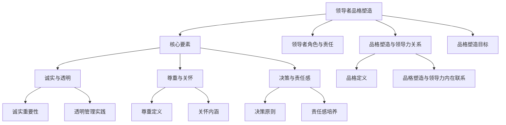

                 

### 《领导者的品格塑造：赢得团队尊重与信任》

#### 关键词

- 领导者品格
- 领导力
- 团队尊重
- 信任
- 塑造实践

> 摘要：本文深入探讨了领导者品格塑造的重要性，分析了领导者品格的核心要素，包括诚实与透明、尊重与关怀、决策与责任感，以及这些要素对团队绩效的影响。文章结合理论分析和实践案例，提出了领导者品格塑造的方法和策略，为领导者提供了有价值的参考。

## 第1章 引言：领导者的品格塑造的重要性

### 1.1 领导者的角色与责任

领导者是团队的核心，他们的行为和品格直接影响到整个团队的氛围和绩效。领导者的定义与基本职责包括：

- **定义**：领导者是那些能够激励、引导和协调团队成员，共同实现目标的人。
- **基本职责**：
  - 指明方向：设定团队的愿景和目标，确保团队成员明确自己的职责和期望。
  - 激励团队：激发团队成员的潜力，鼓励他们克服困难，实现卓越表现。
  - 决策：在关键时刻做出明智的决策，确保团队的方向和目标的实现。
  - 沟通：建立有效的沟通渠道，确保信息传递的准确性和及时性。
  - 协调：协调团队成员的工作，解决团队内部的冲突，确保团队的和谐与效率。

### 1.2 品格塑造与领导力的关系

品格是指一个人的道德品质和性格特征。品格塑造与领导力的关系密切，良好的品格是领导力的基础。以下是品格塑造与领导力的内在联系：

- **诚实与透明**：诚实是领导者最基本的品格，它建立了领导者与团队成员之间的信任。透明管理则使团队成员能够了解领导者的决策过程，增强他们的参与感和责任感。
- **尊重与关怀**：领导者尊重团队成员，关心他们的成长和发展，能够增强团队的凝聚力和归属感。
- **决策与责任感**：领导者需要具备良好的决策能力和责任感，能够在复杂的环境中做出明智的决策，并为决策结果承担责任。

### 1.3 领导者品格塑造的目标

领导者品格塑造的目标是赢得团队的信任、增强团队凝聚力和提高团队绩效。具体目标包括：

- **赢得团队的信任**：信任是团队合作的基石，领导者通过诚实、透明和负责任的行为赢得团队的信任，建立良好的团队氛围。
- **增强团队凝聚力**：领导者通过关心和尊重团队成员，增强团队的凝聚力和归属感，使团队成员更加愿意为团队的目标而努力。
- **提高团队绩效**：领导者通过正确的决策和高效的沟通，提高团队的工作效率和绩效。

## 第2章 领导者品格的核心要素

### 2.1 诚实与透明

#### 2.1.1 诚实的重要性

诚实是领导者品格的核心要素之一，它是建立信任的基础。一个诚实领导者会：

- **确保信息准确**：领导者会确保团队成员获取到的信息是准确的，避免误导或欺骗。
- **建立信任**：诚实的行为能够赢得团队成员的信任，使团队成员愿意与领导者分享他们的想法和问题。
- **提升团队士气**：当团队成员知道他们的领导者是诚实的，他们会更有信心和动力去完成工作。

#### 2.1.2 透明管理的实践

透明管理是一种领导风格，它要求领导者公开他们的决策过程和结果，使团队成员能够了解他们的工作环境和工作任务。透明管理的实践包括：

- **公开决策过程**：领导者应该公开他们的决策过程，使团队成员了解决策的依据和考虑因素。
- **分享结果**：领导者应该与团队成员分享决策的结果，无论结果是好是坏，这样能够增强团队成员的责任感和参与感。

#### 2.1.3 假设诚实与透明失败的案例

在某些情况下，即使领导者表现出诚实和透明，但如果他们的行为缺乏一致性或可信度，也会导致失败。以下是一个失败的案例：

- **案例**：某公司的CEO在与员工会议中表示，公司将进行大规模的成本削减，并解释了这一决策的必要性。然而，不久之后，CEO被发现隐瞒了公司的财务状况，导致员工对公司失去了信任。这一事件不仅损害了CEO的声誉，也削弱了团队的凝聚力和士气。

### 2.2 尊重与关怀

#### 2.2.1 尊重的定义与表现

尊重是指对他人的人格、观点和劳动的认可和重视。尊重的表现包括：

- **倾听**：领导者应该认真倾听团队成员的意见和反馈，即使他们不同意。
- **认可**：领导者应该对团队成员的工作成果给予认可和赞赏。
- **公正**：领导者应该公平对待所有团队成员，不偏袒任何一个人。

#### 2.2.2 关怀的内涵与实施

关怀是指对团队成员的情感支持和关注。关怀的内涵包括：

- **关心团队成员的成长**：领导者应该关心团队成员的职业发展和个人成长。
- **提供支持**：领导者应该为团队成员提供必要的资源和支持，帮助他们克服困难。
- **关注团队成员的福祉**：领导者应该关注团队成员的生活和工作状况，确保他们的健康和幸福。

#### 2.2.3 缺乏尊重与关怀的后果

如果领导者缺乏尊重和关怀，可能会导致以下后果：

- **团队士气下降**：团队成员可能会感到不被重视，导致士气低落。
- **团队凝聚力减弱**：缺乏关怀和支持会导致团队成员之间的关系紧张，降低团队的凝聚力。
- **工作效率降低**：团队成员可能会因为不满而减少工作投入，导致工作效率下降。

### 2.3 决策与责任感

#### 2.3.1 决策的原则与方法

决策是指领导者根据实际情况和目标，选择最佳行动方案的过程。决策的原则包括：

- **全面性**：在决策时，领导者应该考虑所有相关的因素和可能的后果。
- **科学性**：领导者应该基于数据和事实进行决策，避免主观臆断。
- **及时性**：领导者应该在必要时迅速做出决策，避免拖延。

决策的方法包括：

- **头脑风暴**：通过集思广益，产生多个可能的解决方案。
- **SWOT分析**：分析每个方案的优点、缺点、机会和威胁。
- **成本效益分析**：评估每个方案的成本和效益。

#### 2.3.2 责任感的培养与提升

责任感是指领导者对团队和任务承担的责任。培养和提升责任感的策略包括：

- **设定明确的期望**：领导者应该明确团队成员的职责和期望，使他们了解自己的责任。
- **提供反馈**：领导者应该定期给予团队成员反馈，鼓励他们承担责任。
- **树立榜样**：领导者应该通过自己的行为展示责任感，成为团队成员的榜样。

#### 2.3.3 决策失误的责任承担

即使领导者做出了错误的决策，他们也应该承担责任，并向团队成员解释决策失误的原因和教训。这样能够增强团队成员对领导者的信任，并提高他们的责任感。

### 第3章 领导者品格的塑造与实践

#### 3.1 品格塑造的方法

领导者品格的塑造需要通过以下方法：

- **自我反思**：领导者应该定期反思自己的行为和决策，识别自己的优点和不足，并制定改进计划。
- **良好的榜样**：领导者应该通过自己的行为树立榜样，展示良好的品格。
- **培训与学习**：领导者应该参加培训和学习，提高自己的领导能力和品格。

#### 3.2 领导者品格的实践

领导者品格的实践包括以下方面：

- **情境领导**：领导者应根据不同的情境和团队成员的需求，采取适当的领导风格。
- **知人善任**：领导者应该了解团队成员的才能和兴趣，合理分配任务，使每个人都能发挥自己的优势。
- **沟通艺术**：领导者应该学会有效沟通，确保信息的准确传递和理解。

#### 3.3 品格塑造的挑战与应对

领导者品格塑造过程中可能会遇到以下挑战：

- **变化的环境**：领导者需要适应不断变化的环境，保持品格的稳定性。
- **团队冲突**：领导者需要处理团队内部的冲突，维护团队的和谐。
- **个人压力**：领导者需要应对工作压力，保持良好的心态和品格。

应对策略包括：

- **持续学习**：领导者应该不断学习新知识和技能，提高自己的领导能力。
- **寻求反馈**：领导者应该主动寻求团队成员和同事的反馈，了解自己的优点和不足。
- **培养团队文化**：领导者应该培养积极向上的团队文化，增强团队的凝聚力和归属感。

### 第4章 领导者的品格与团队文化

#### 4.1 团队文化的定义与作用

团队文化是指团队在长期合作中形成的共同价值观、行为规范和工作方式。团队文化的作用包括：

- **增强团队凝聚力**：团队文化能够增强团队成员之间的联系和归属感，提高团队的凝聚力。
- **提升团队绩效**：团队文化能够激发团队成员的潜力和创造力，提高团队的工作效率和绩效。
- **塑造团队形象**：团队文化能够塑造团队的形象和品牌，增强团队在社会中的影响力。

#### 4.2 领导者品格与团队文化的关系

领导者品格与团队文化之间存在密切的关系。领导者的品格直接影响团队文化的形成和发展：

- **领导者品格塑造团队文化**：领导者通过自己的行为和决策，塑造团队的文化氛围和行为规范。
- **团队文化影响领导者品格**：团队文化对领导者的行为和决策产生影响，良好的团队文化能够促进领导者品格的提升。

#### 4.3 塑造积极团队文化的策略

领导者可以通过以下策略塑造积极的团队文化：

- **增强团队凝聚力**：通过团队建设活动、共享目标和共同经历，增强团队成员之间的凝聚力。
- **提高团队成员的归属感**：通过关注团队成员的需求和提供支持，提高他们的归属感。
- **建立开放的沟通机制**：通过鼓励团队成员分享意见和反馈，建立开放的沟通机制，促进团队文化的建设。

### 第5章 领导者品格对团队绩效的影响

#### 5.1 品格与团队绩效的关系

领导者品格对团队绩效具有显著的影响。良好的品格能够：

- **提高员工满意度**：领导者通过诚实、透明和负责任的行为，提高员工对工作环境的满意度。
- **增强团队创新能力**：领导者通过鼓励团队成员的参与和创新，增强团队的创新能力。
- **提升团队工作效率**：领导者通过高效的沟通和协调，提升团队的工作效率。

#### 5.2 品格塑造对团队绩效的具体影响

品格塑造对团队绩效的具体影响包括：

- **提高员工满意度**：领导者通过关心员工的需求和提供支持，提高员工的满意度和忠诚度。
- **增强团队创新能力**：领导者通过鼓励团队成员的参与和创新，激发团队的潜力，提高团队的创新能力和竞争力。
- **提升团队工作效率**：领导者通过高效的沟通和协调，确保团队目标的实现，提高团队的工作效率和绩效。

#### 5.3 案例分析：领导者品格对团队绩效的实际影响

以下是一个案例分析，展示了领导者品格对团队绩效的实际影响：

- **案例背景**：某互联网公司在竞争激烈的市场中，面临巨大的压力。公司的CEO意识到，要提升团队绩效，首先要提升领导者的品格。
- **领导者品格塑造**：CEO通过自我反思和培训，提高了自己的诚实、透明和负责任的行为。他建立了开放的沟通机制，鼓励团队成员分享意见和反馈，建立了积极向上的团队文化。
- **团队绩效提升**：在CEO的领导下，团队的员工满意度显著提高，团队成员更加愿意为公司的发展贡献力量。团队的创新能力也得到了提升，推出了一系列创新产品，取得了市场成功。团队的工作效率也大幅提升，完成了多项重要项目，取得了良好的绩效。

### 第6章 领导者品格塑造的未来趋势

#### 6.1 科技进步对领导者品格塑造的影响

科技进步对领导者品格塑造产生了深远的影响。以下是一些主要的影响：

- **数据驱动领导力**：随着大数据和人工智能技术的发展，领导者需要具备数据分析和决策的能力，通过数据来指导决策，提高决策的准确性。
- **人工智能与领导者品格塑造**：人工智能技术可以帮助领导者更好地了解团队成员的需求和行为，提供个性化的支持和指导，促进领导者品格的提升。

#### 6.2 全球化对领导者品格塑造的挑战

全球化对领导者品格塑造提出了新的挑战。以下是一些主要的挑战：

- **多元文化领导**：领导者需要适应多元文化的环境，尊重和理解不同文化背景的团队成员，促进团队的和谐与合作。
- **国际化视野的培养**：领导者需要具备国际化的视野，了解全球市场的动态和趋势，为团队制定正确的战略方向。

#### 6.3 未来领导者品格塑造的趋势

未来领导者品格塑造的趋势包括：

- **持续学习与自我提升**：领导者需要不断学习和适应新的知识和技能，提升自己的领导能力。
- **社会责任与道德领导**：领导者需要承担社会责任，关注团队成员的福祉，践行道德领导，为团队和社会创造更大的价值。

### 第7章 结论：领导者品格塑造的持续之路

#### 7.1 领导者品格塑造的总结

领导者品格塑造是一个持续的过程，它关系到团队的成功和绩效。以下是领导者品格塑造的核心要点：

- **诚实与透明**：诚实是建立信任的基础，透明管理能够增强团队成员的参与感和责任感。
- **尊重与关怀**：尊重和关怀能够增强团队的凝聚力和归属感，提高团队的工作效率。
- **决策与责任感**：领导者需要具备良好的决策能力和责任感，为团队的发展提供正确的方向。
- **自我反思与持续学习**：领导者需要通过自我反思和持续学习，提升自己的领导能力。

#### 7.2 对领导者的期望与建议

对领导者的期望和建议包括：

- **践行诚实与透明**：领导者应该以身作则，践行诚实和透明，建立良好的团队氛围。
- **培养尊重与关怀**：领导者应该尊重团队成员，关心他们的成长和发展，提供必要的支持。
- **提升决策与责任感**：领导者应该通过学习和实践，提升自己的决策能力和责任感，为团队的发展提供正确的方向。
- **持续学习与自我提升**：领导者应该不断学习和适应新的知识和技能，提升自己的领导能力。

#### 7.3 对团队的期望与建议

对团队的期望与建议包括：

- **积极参与与反馈**：团队成员应该积极参与团队的工作，提出意见和建议，为团队的发展贡献力量。
- **相互尊重与支持**：团队成员应该相互尊重，关心和支持彼此，共同营造积极向上的团队文化。
- **共享目标与责任**：团队成员应该明确自己的目标和责任，共同为实现团队的目标而努力。

### 附录

#### 附录 A 领导者品格塑造的资源与工具

以下是一些推荐的资源与工具，供领导者参考：

- **书籍**：《领导者品格塑造》、《领导力是一门艺术》
- **网络资源**：领导力论坛、领导力博客、在线培训课程
- **培训课程**：领导力培训课程、沟通技巧培训、团队建设培训

#### 附录 B 案例分析

以下是对国内外成功领导者品格塑造的案例分析：

- **国内成功领导者案例分析**：马云、马化腾等企业家的领导力实践。
- **国际成功领导者案例分析**：乔布斯、比尔·盖茨等企业家的领导力实践。

## Mermaid 流程图



## 伪代码与数学公式

#### 2.1 决策原则的伪代码

```python
def make_decision(problem):
    decision = None
    choices = get_choices(problem)
    for choice in choices:
        benefit = calculate_benefit(problem, choice)
        if benefit > current_max_benefit:
            current_max_benefit = benefit
            decision = choice
    return decision
```

#### 数学公式

$$
1 + 1 = 2
$$

$$
x^2 + y^2 = r^2
$$

$$
f(x) = x^2
$$

