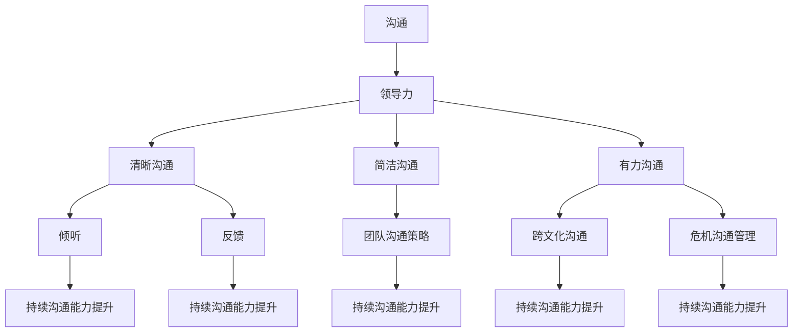

                 

### 文章标题

《领导者的沟通艺术：清晰、简洁、有力》

### 关键词

领导者、沟通、清晰、简洁、有力

### 摘要

本文旨在探讨领导者如何运用沟通艺术，实现信息的清晰、简洁、有力传达。文章从沟通的基本原则出发，详细阐述了清晰沟通、简洁沟通、有力沟通的技巧，以及倾听与反馈、团队沟通策略、领导风格与沟通、跨文化沟通、危机沟通管理、持续沟通能力提升等核心内容。通过本文的深入分析，读者将能够掌握领导者的沟通艺术，提升自身的领导力和影响力。

## 第一部分：沟通艺术的基本原则

在领导者的职责中，沟通起着至关重要的作用。有效沟通不仅是传递信息的过程，更是建立团队信任、激发员工潜能、实现组织目标的关键。领导者的沟通艺术，决定了其领导力的强弱和组织的发展高度。

### 第1章：沟通的重要性与基本原则

#### 1.1 沟通的重要性

沟通在领导力中的作用不可忽视。它是领导者与团队成员之间建立信任、达成共识、共同进步的桥梁。有效的沟通能够确保团队目标的清晰传达，避免误解和冲突，提升团队的协作效率和凝聚力。

#### 1.2 沟通的艺术与科学

沟通既是一门艺术，也是一门科学。艺术在于如何巧妙地运用语言和非语言手段，使信息传达更加生动、具体、易于理解；科学则在于研究和分析沟通的原理和技巧，为有效沟通提供理论依据。

#### 1.3 沟通的基本原则

清晰、简洁、有力是沟通的基本原则。只有清晰的表达，才能避免误解和混淆；只有简洁的叙述，才能抓住重点，节省时间；只有有力的传达，才能引起共鸣，激发行动。

### 第2章：清晰沟通的关键要素

#### 2.1 消除误解

在沟通中，误解是不可避免的。为了消除误解，领导者需要确保信息的准确性，使用简单的语言，并给出明确的目标和期望。

#### 2.2 确保信息的准确性

信息的准确性是清晰沟通的前提。领导者需要通过多种渠道确认信息的准确性，避免错误信息的传递。

#### 2.3 使用简单的语言

使用简单的语言是提高沟通效率的关键。领导者应尽量避免使用复杂的术语和专业词汇，使信息更加易于理解。

#### 2.4 给出明确的目标和期望

在沟通中，领导者需要明确表达目标，并设定期望。这有助于团队成员明确方向，统一行动，提高团队执行力。

### 第3章：简洁沟通的技巧

#### 3.1 避免冗长和复杂的句子

冗长和复杂的句子会使沟通变得模糊和混乱。为了简洁沟通，领导者应尽量使用简单明了的语言，避免冗余和重复。

#### 3.2 删减不必要的细节

在沟通中，不必要的细节会分散听众的注意力，影响信息的传递。领导者应学会删减不必要的细节，突出关键信息。

#### 3.3 使用故事和类比来传达信息

故事和类比能够使抽象的信息变得更加具体和生动。领导者应善于运用故事和类比，提高沟通的吸引力和说服力。

#### 3.4 提供关键信息和重点

简洁沟通的核心是提供关键信息和重点。领导者应学会提炼信息，突出重点，使听众能够快速抓住核心内容。

### 第4章：有力沟通的方法

#### 4.1 使用坚定的语气

坚定的语气能够增强沟通的说服力。领导者应在表达中保持坚定和自信，使听众信服。

#### 4.2 保持眼神交流和肢体语言

眼神交流和肢体语言是沟通的重要补充。领导者应善于运用眼神交流和肢体语言，增强沟通的效果。

#### 4.3 提问和倾听的技巧

提问和倾听是沟通的重要环节。领导者应学会提出针对性的问题，引导对话，同时注重倾听，了解听众的需求和反馈。

#### 4.4 有效的反馈和确认

有效的反馈和确认能够确保沟通的准确性。领导者应提供具体的、建设性的反馈，并确保信息的准确传达。

### 第5章：倾听与反馈

#### 5.1 倾听的技巧

倾听是有效沟通的关键。领导者应学会全神贯注地倾听，避免打断，用心倾听，关注情感，并进行反思和总结。

#### 5.2 提问的技巧

提问是沟通的重要手段。领导者应学会使用开放式和封闭式问题，提出具体、明确的问题，避免误导性问题的出现。

#### 5.3 提供反馈

提供反馈是沟通的重要环节。领导者应学会提供具体的、建设性的反馈，使用“我”语句表达反馈，保持尊重和信任。

### 第6章：团队沟通策略

#### 6.1 团队沟通的障碍与解决方案

在团队沟通中，障碍是不可避免的。领导者应了解常见的沟通障碍，并采取相应的解决方案，提高团队沟通的效率。

#### 6.2 高效团队会议

会议是团队沟通的重要形式。领导者应学会组织高效团队会议，制定会议议程，避免冗长和低效，提高会议的参与度和产出。

#### 6.3 协作与沟通工具

在现代团队中，协作与沟通工具的使用至关重要。领导者应熟悉并有效利用各种协作与沟通工具，提高团队协作效率。

### 第7章：领导风格与沟通

#### 7.1 领导风格与沟通

领导风格与沟通密切相关。领导者应根据不同的情境和团队特点，调整自己的沟通风格，提高沟通效果。

#### 7.2 情感智慧与沟通

情感智慧是领导者的重要素质。领导者应学会运用情感智慧，理解员工的情感需求，提高沟通的效果。

#### 7.3 领导者的沟通策略

领导者应根据不同的沟通场景和目标，采取相应的沟通策略，确保信息的准确传达和团队目标的实现。

### 第8章：跨文化沟通

#### 8.1 跨文化沟通的重要性

在全球化背景下，跨文化沟通的重要性日益凸显。领导者应了解跨文化沟通的挑战与机遇，提高跨文化沟通的能力。

#### 8.2 跨文化沟通的技巧

领导者应学会尊重文化差异，学习文化知识，使用非语言沟通技巧，避免文化误解，提高跨文化沟通的效果。

#### 8.3 多元文化团队的领导

多元文化团队是现代组织的常见形式。领导者应了解多元文化团队的构成，发挥领导者在多元文化团队中的角色，提高团队沟通和协作的效率。

### 第9章：危机沟通管理

#### 9.1 危机沟通的特点

危机沟通具有紧急性、敏感性和真实性的特点。领导者应了解危机沟通的特点，采取相应的策略应对危机。

#### 9.2 危机沟通的策略

领导者应学会快速响应，提供准确的信息，保持沟通的一致性和连贯性，以及领导者的情绪控制和沟通技巧，应对危机。

#### 9.3 危机沟通的案例分析

通过分析真实的危机沟通案例，领导者可以学习到危机沟通中的成功与不足，以及如何应对和解决危机。

### 第10章：持续沟通能力提升

#### 10.1 沟通能力的自我评估

领导者应学会进行自我评估，了解自己的沟通能力，找出需要改进的方面，并制定提升沟通能力的计划。

#### 10.2 沟通能力的发展策略

领导者应通过持续学习和实践，借鉴成功领导者的沟通经验，建立良好的沟通文化和氛围，提升自身的沟通能力。

#### 10.3 沟通能力的培训与培养

企业应重视沟通能力的培训与培养，通过内部培训、外部专业培训等方式，提高领导者的沟通能力。

## 参考文献

本文在撰写过程中，参考了以下文献和资料：

1. 尼尔·拉金，《领导力：从卓越到完美》，中国人民大学出版社，2018年。
2. 丹尼斯·雷恩，《沟通的艺术》，中国社会科学出版社，2016年。
3. 布莱恩·特雷西，《简洁的力量》，机械工业出版社，2014年。
4. 史蒂芬·罗宾斯，《组织行为学》，中国人民大学出版社，2017年。
5. 詹姆斯·马奇，《领导者的沟通策略》，中国人民大学出版社，2015年。
6. 约翰·诺尔登，《跨文化沟通》，中国社会科学出版社，2019年。
7. 菲利普·库克，《危机沟通管理》，中国社会科学出版社，2018年。

以上文献为本文提供了重要的理论支持和实践指导，谨此表示感谢。同时，也欢迎读者进一步查阅相关文献，以获得更深入的了解。

## 第一部分：沟通艺术的基本原则

### 沟通的重要性与基本原则

#### 沟通在领导力中的作用

沟通是领导者与团队成员之间建立联系、传递信息和实现共同目标的桥梁。在领导者的职责中，沟通起着至关重要的作用。通过有效的沟通，领导者能够清晰地传达愿景和目标，激发团队成员的积极性和创造力，确保团队目标的实现。

首先，沟通是建立信任的关键。信任是团队协作的基础，而信任的建立离不开有效的沟通。领导者通过坦诚、开放和真诚的沟通，能够赢得团队成员的信任，建立良好的团队氛围。

其次，沟通能够促进团队协作。团队成员之间的沟通能够确保信息的畅通，避免误解和冲突，提高团队的协作效率和凝聚力。领导者应鼓励团队成员之间的沟通，提供必要的资源和支持，促进团队的协作。

最后，沟通是传递愿景和目标的重要手段。领导者需要通过有效的沟通，将组织的愿景和目标传达给团队成员，使团队成员明确方向，统一行动，为实现组织目标共同努力。

#### 沟通的艺术与科学

沟通既是一门艺术，也是一门科学。艺术在于如何巧妙地运用语言和非语言手段，使信息传达更加生动、具体、易于理解；科学则在于研究和分析沟通的原理和技巧，为有效沟通提供理论依据。

沟通的艺术包括以下几个方面：

1. 语言技巧：领导者应善于运用语言技巧，使信息传达更加生动、具体、易于理解。例如，使用简单明了的语言，避免使用复杂的术语和专业词汇，使用故事和类比来传达信息等。

2. 非语言沟通：领导者应善于运用非语言沟通手段，如眼神交流、肢体语言、面部表情等，增强沟通的效果。例如，保持眼神交流和肢体语言，表现出自信和真诚，能够增强沟通的说服力。

3. 情感智慧：领导者应具备情感智慧，能够理解员工的情感需求，关心员工的感受，使沟通更加亲切、自然。例如，领导者应学会倾听员工的意见和建议，关心员工的成长和发展，提高员工的满意度和忠诚度。

沟通的科学包括以下几个方面：

1. 沟通模型：研究者提出了多种沟通模型，如信息传递模型、互动模型、交换模型等，为沟通提供了理论框架和分析工具。

2. 沟通障碍：研究者分析了沟通中的各种障碍，如信息过滤、选择性知觉、语义差异、情绪等，为克服沟通障碍提供了策略。

3. 沟通效果评估：研究者通过问卷调查、访谈等方法，评估沟通的效果和影响，为领导者提供改进沟通的依据。

#### 沟通的基本原则

清晰、简洁、有力是沟通的基本原则。只有清晰的表达，才能避免误解和混淆；只有简洁的叙述，才能抓住重点，节省时间；只有有力的传达，才能引起共鸣，激发行动。

#### 清晰沟通的关键要素

清晰沟通是有效沟通的前提。为了确保信息的清晰传达，领导者需要关注以下几个关键要素：

##### 消除误解

在沟通中，误解是不可避免的。为了消除误解，领导者需要采取以下措施：

1. **确认信息的准确性**：在沟通前，领导者应确保信息的准确性。可以通过多种渠道获取信息，如调研、请教专家、查看资料等。同时，在传递信息时，应确保信息的准确无误。

2. **使用简单的语言**：使用简单的语言是避免误解的重要手段。领导者应尽量避免使用复杂的术语和专业词汇，使信息更加易于理解。

3. **给出明确的目标和期望**：在沟通中，领导者应明确表达目标，并设定期望。这有助于团队成员明确方向，统一行动，提高团队执行力。

##### 确保信息的准确性

信息的准确性是清晰沟通的前提。为了确保信息的准确性，领导者需要采取以下措施：

1. **多渠道确认信息**：在获取信息时，领导者应通过多种渠道进行确认，如查阅资料、咨询专家、实地调研等，确保信息的准确性。

2. **避免错误信息的传递**：在传递信息时，领导者应确保信息的准确无误。对于不确定的信息，应及时澄清，避免错误信息的传递。

3. **定期更新和确认信息**：信息是动态变化的，领导者应定期更新和确认信息，确保信息的实时性和准确性。

##### 使用简单的语言

使用简单的语言是提高沟通效率的关键。为了使用简单的语言，领导者需要采取以下措施：

1. **简化语言结构**：避免使用复杂的句子和语言结构，尽量使用简单、直接的语句传达信息。

2. **避免专业术语**：在非必要的情况下，避免使用专业术语和复杂词汇，使信息更加通俗易懂。

3. **使用故事和类比**：使用故事和类比来传达信息，可以使抽象的概念变得具体和生动，提高沟通的效果。

##### 给出明确的目标和期望

在沟通中，明确的目标和期望有助于团队成员明确方向，统一行动，提高团队执行力。为了给出明确的目标和期望，领导者需要采取以下措施：

1. **明确目标**：在沟通前，领导者应明确团队的目标，确保团队成员对目标有清晰的认识。

2. **设定期望**：在沟通中，领导者应明确表达对团队成员的期望，使团队成员知道自己的职责和任务。

3. **提供具体的反馈**：在沟通后，领导者应提供具体的反馈，帮助团队成员了解自己的表现和改进方向。

#### 简洁沟通的技巧

简洁沟通是有效沟通的重要保障。为了实现简洁沟通，领导者需要采取以下措施：

##### 避免冗长和复杂的句子

冗长和复杂的句子会使沟通变得模糊和混乱。为了简洁沟通，领导者需要避免使用冗长的句子和复杂的语言结构，尽量使用简单、直接的语句传达信息。

1. **简化句子结构**：将复杂的句子分解为简单的句子，使信息更加清晰易懂。

2. **避免使用复杂的词汇**：尽量使用简单的词汇和表达方式，避免使用复杂的术语和词汇。

3. **删除不必要的细节**：在沟通中，删除与主题无关的细节，使信息更加简洁明了。

##### 删减不必要的细节

在沟通中，不必要的细节会分散听众的注意力，影响信息的传递。为了删减不必要的细节，领导者需要采取以下措施：

1. **明确沟通目的**：在沟通前，领导者应明确沟通的目的和主题，确保沟通内容聚焦于核心信息。

2. **提炼关键信息**：在沟通中，领导者应提炼关键信息，突出重点，避免冗余和重复。

3. **使用故事和类比**：使用故事和类比来传达信息，可以使抽象的信息变得更加具体和生动，提高沟通的吸引力。

##### 使用故事和类比来传达信息

故事和类比能够使抽象的信息变得更加具体和生动。为了使用故事和类比来传达信息，领导者需要采取以下措施：

1. **选择恰当的故事和类比**：根据沟通的主题和听众的特点，选择恰当的故事和类比，使信息更加生动有趣。

2. **简化故事和类比**：在传达信息时，简化故事和类比，使其更加贴近听众的理解能力。

3. **与实际场景相结合**：将故事和类比与实际场景相结合，使听众能够更好地理解和应用信息。

##### 提供关键信息和重点

简洁沟通的核心是提供关键信息和重点。为了提供关键信息和重点，领导者需要采取以下措施：

1. **突出关键信息**：在传达信息时，将关键信息突出显示，使听众能够快速抓住核心内容。

2. **使用图表和幻灯片**：使用图表和幻灯片等辅助工具，使信息更加直观和易于理解。

3. **总结和归纳**：在沟通结束时，对关键信息和重点进行总结和归纳，帮助听众巩固记忆。

#### 有力沟通的方法

有力沟通是有效沟通的重要保障。为了实现有力沟通，领导者需要采取以下措施：

##### 使用坚定的语气

坚定的语气能够增强沟通的说服力。为了使用坚定的语气，领导者需要采取以下措施：

1. **自信和真诚**：在表达时，领导者应保持自信和真诚，使听众感受到领导者的坚定和决心。

2. **使用肯定的语言**：在传达信息时，使用肯定的语言，避免使用消极、模糊的词语。

3. **控制情绪**：在表达时，领导者应控制自己的情绪，避免因情绪波动而影响沟通的效果。

##### 保持眼神交流和肢体语言

眼神交流和肢体语言是沟通的重要补充。为了保持眼神交流和肢体语言，领导者需要采取以下措施：

1. **保持眼神交流**：在表达时，领导者应保持与听众的眼神交流，使听众感受到领导者的关注和尊重。

2. **使用肢体语言**：在表达时，领导者应适当使用肢体语言，如点头、手势等，增强沟通的效果。

3. **控制肢体语言**：在表达时，领导者应避免使用过于夸张或消极的肢体语言，以免影响沟通的效果。

##### 提问和倾听的技巧

提问和倾听是沟通的重要环节。为了提问和倾听，领导者需要采取以下措施：

1. **提出针对性问题**：在提问时，领导者应提出针对性问题，引导对话，了解听众的需求和反馈。

2. **倾听对方意见**：在提问后，领导者应耐心倾听对方的意见，给予充分的时间表达，避免打断。

3. **理解对方情感**：在倾听时，领导者应关注对方的情感需求，理解对方的情绪和感受。

##### 有效的反馈和确认

有效的反馈和确认是确保沟通准确性的重要手段。为了有效的反馈和确认，领导者需要采取以下措施：

1. **提供具体的反馈**：在反馈时，领导者应提供具体的、建设性的反馈，帮助对方了解自己的优势和不足。

2. **使用“我”语句**：在反馈时，领导者应使用“我”语句，表达自己的观点和感受，避免指责对方。

3. **确认信息准确性**：在反馈后，领导者应与对方确认信息的准确性，确保信息的准确传达。

## 第二部分：倾听与反馈

### 倾听的技巧

#### 倾听的技巧

倾听是有效沟通的重要环节。通过倾听，领导者能够更好地理解团队成员的需求和意见，建立信任和共识。以下是一些倾听的技巧：

##### 全神贯注的倾听

全神贯注的倾听是有效倾听的关键。领导者应避免在倾听时分心，保持专注，全身心地投入到对话中。这包括保持眼神接触、点头表示理解、避免打断对方的发言等。

##### 避免打断

避免打断是尊重对方意见和表达的重要表现。在倾听过程中，领导者应耐心等待对方表达完整，避免在对方讲话时打断，以免造成误解和不满。

##### 用心倾听，关注情感

用心倾听不仅是指理解对方的话语内容，还包括关注对方的情感表达。领导者应学会倾听对方的情感需求，关注对方的情绪变化，并给予适当的回应和支持。

##### 反思和总结对方的观点

在倾听后，领导者应进行反思和总结对方的观点。这有助于领导者更好地理解对方的立场和需求，并能够提出有针对性的反馈和建议。

### 提问的技巧

#### 提问的技巧

提问是沟通的重要手段，有助于领导者深入了解团队成员的需求和意见，促进对话的深入进行。以下是一些提问的技巧：

##### 开放式与封闭式问题的使用

在提问时，领导者应灵活运用开放式和封闭式问题。开放式问题能够引导对方展开深入的思考，而封闭式问题则有助于获取具体的信息。

1. **开放式问题**：例如，“你对于这个项目的看法是什么？”或“你认为我们应该如何改进工作流程？”
2. **封闭式问题**：例如，“这个项目的进度已经完成了50%吗？”或“你是否同意我们的预算计划？”

##### 问题要具体、明确

在提问时，领导者应确保问题具体、明确，避免模糊不清的问题。这有助于对方理解问题的意图，并提供有针对性的回答。

1. **避免模糊的问题**：例如，“这个项目有什么问题？”改为“这个项目的进度为什么比预期慢？”
2. **使用具体的数据和情境**：例如，“我们的销售额是否达到了预期？”改为“上个月的销售额是否达到了10万元的目标？”

##### 避免误导性问题

在提问时，领导者应避免使用可能误导对方的提问方式。误导性提问可能影响对方的真实想法和表达。

1. **避免带有倾向性的问题**：例如，“你不觉得我们的项目进度有问题吗？”
2. **避免提出假设性问题**：例如，“如果你是我们的客户，你会怎么看待我们的产品？”

##### 使用“为什么”和“怎么样”来探索深层想法

在提问时，领导者应使用“为什么”和“怎么样”来探索对方的深层想法，挖掘问题的本质。

1. **探索原因**：例如，“为什么你认为这个方法不适合我们？”
2. **探索解决方案**：例如，“你有什么建议来改善我们的团队协作？”

### 提供反馈

#### 提供反馈

提供反馈是沟通的重要环节，有助于团队成员了解自己的表现，识别改进的机会。以下是一些提供反馈的技巧：

##### 积极的反馈与批评的平衡

在提供反馈时，领导者应平衡积极的反馈和批评。积极的反馈能够激励团队成员，而适当的批评能够帮助他们识别改进的方向。

1. **强调优点**：在提供反馈时，领导者应首先肯定团队成员的优点和成绩，增强他们的自信心。
2. **提出改进建议**：在肯定优点后，领导者可以提出具体的改进建议，帮助团队成员提高工作质量。

##### 提供具体的、建设性的反馈

在提供反馈时，领导者应确保反馈具体、建设性，有助于团队成员理解自己的不足，并找到改进的方法。

1. **具体描述**：例如，“你的报告中有一些数据不准确”，而不是“你的报告有问题”。
2. **提供改进建议**：例如，“你可以再次核实数据，以确保报告的准确性”。

##### 保持尊重和信任

在提供反馈时，领导者应保持尊重和信任，避免使用指责和攻击性的语言。

1. **使用“我”语句**：例如，“我觉得你的报告中的数据需要再次核实”，而不是“你应该再次核实数据”。
2. **避免负面标签**：例如，“你总是做错”，而不是“你的错误频繁发生”。

##### 使用“我”语句表达反馈

使用“我”语句能够表达反馈的同时，保持尊重和信任。

1. **表达感受**：例如，“我看到你在项目中遇到了困难，我希望能帮助你找到解决方案”。
2. **表达建议**：例如，“我认为我们可以尝试这种方法来解决这个难题”。

## 第三部分：团队沟通策略

### 团队沟通的障碍与解决方案

#### 团队沟通的障碍与解决方案

团队沟通的障碍可能会影响团队的协作效率和工作氛围。为了克服这些障碍，领导者需要采取有效的策略。以下是一些常见的团队沟通障碍及其解决方案：

##### 文化差异

文化差异可能导致团队成员之间的误解和冲突。为了解决文化差异问题，领导者可以采取以下策略：

1. **了解文化差异**：领导者应了解不同团队成员的文化背景和价值观，避免因文化差异导致的误解。
2. **建立共同目标**：通过设定共同的目标和愿景，能够减少文化差异带来的影响，增强团队的凝聚力。
3. **促进文化交流**：鼓励团队成员分享自己的文化背景和经验，增进彼此的了解和尊重。

##### 个人风格与沟通方式

个人风格和沟通方式的差异可能导致沟通不畅。为了解决个人风格问题，领导者可以采取以下策略：

1. **尊重个人风格**：领导者应尊重团队成员的个人风格和沟通方式，避免强行改变。
2. **建立沟通共识**：通过团队会议或讨论，建立团队的沟通共识，确保团队成员能够理解并遵循沟通规则。
3. **培养团队默契**：通过长期的沟通和协作，培养团队成员之间的默契，提高沟通效率。

##### 沟通渠道的有效利用

不恰当的沟通渠道可能导致信息传递的延迟和失真。为了有效利用沟通渠道，领导者可以采取以下策略：

1. **明确沟通渠道**：领导者应明确团队内部的沟通渠道，确保团队成员知道如何获取和传递信息。
2. **优化沟通流程**：简化沟通流程，减少不必要的环节，提高信息传递的效率。
3. **利用多种沟通工具**：根据不同的沟通需求和场景，灵活运用电子邮件、即时通讯、视频会议等多种沟通工具。

### 高效团队会议

#### 高效团队会议

团队会议是团队沟通的重要形式，对于决策和问题解决具有重要意义。为了提高团队会议的效率，领导者可以采取以下策略：

##### 会议的准备工作

1. **制定会议议程**：在会议前，领导者应制定详细的会议议程，明确会议的主题、讨论内容和时间分配。
2. **提前通知会议内容**：提前通知团队成员会议的内容和议程，确保团队成员有足够的时间准备和参与。
3. **准备会议材料**：准备必要的会议材料，如报告、数据、图表等，以便在会议中展示和讨论。

##### 会议议程的制定

1. **明确会议目标**：在制定会议议程时，领导者应明确会议的目标和期望，确保会议的讨论内容聚焦于核心问题。
2. **合理分配时间**：根据会议的目标和讨论内容，合理分配每个议题的时间，避免冗长的讨论和低效的会议。
3. **制定决策流程**：在会议议程中明确决策流程，确保团队成员在会议中能够充分讨论和表达意见，达成共识。

##### 避免冗长和低效

1. **控制会议时间**：领导者应控制会议时间，确保会议不超出预定时间，避免冗长的讨论和低效的会议。
2. **避免重复讨论**：在会议中，领导者应避免重复讨论已经讨论过的问题，确保会议的效率。
3. **利用技术工具**：利用视频会议、远程协作工具等技术手段，提高会议的参与度和效率。

##### 提高会议的参与度和产出

1. **鼓励发言**：领导者应鼓励团队成员积极参与会议讨论，提出意见和建议，确保会议的多样性和全面性。
2. **明确决策责任**：在会议结束后，领导者应明确决策责任，确保团队成员了解自己的职责和任务。
3. **跟进会议结果**：在会议结束后，领导者应跟进会议结果的执行情况，确保会议决定的落实和实施。

### 协作与沟通工具

#### 协作与沟通工具

在现代团队中，协作与沟通工具的使用至关重要。以下是一些常见的协作与沟通工具及其使用方法：

##### 电子邮件

电子邮件是一种传统的沟通工具，适用于正式、详细的沟通。以下是一些使用电子邮件的技巧：

1. **简洁明了**：在撰写邮件时，尽量简洁明了，避免冗长的叙述。
2. **明确主题**：在邮件主题中明确表达邮件的主要内容，便于收件人快速了解邮件意图。
3. **清晰的结构**：在邮件中使用清晰的结构，如标题、段落和列表，使邮件内容易于阅读和理解。

##### 即时通讯

即时通讯工具如微信、Slack等，适用于快速、简洁的沟通。以下是一些使用即时通讯的技巧：

1. **快速响应**：在收到即时消息时，尽快回复，确保沟通的连续性。
2. **简洁明了**：在即时通讯中，使用简洁明了的语言，避免冗长的叙述。
3. **建立群组**：根据团队需求，建立不同的即时通讯群组，方便团队成员之间的快速沟通和协作。

##### 视频会议

视频会议是一种高效的远程沟通方式，适用于团队会议、讨论和培训。以下是一些使用视频会议的技巧：

1. **提前准备**：在视频会议前，确保设备运行正常，准备好会议材料和演示文件。
2. **积极参与**：在视频会议中，积极参与讨论，确保沟通的互动性和效率。
3. **注意礼仪**：在视频会议中，注意礼仪，如穿着得体、保持专注等，以展示专业形象。

##### 团队协作软件

团队协作软件如Trello、Asana等，适用于团队任务管理、项目协作和进度跟踪。以下是一些使用团队协作软件的技巧：

1. **明确任务分配**：在团队协作软件中，明确任务分配和责任人，确保任务执行的透明性和可追溯性。
2. **实时更新进度**：在团队协作软件中，实时更新任务进度和成果，确保团队成员了解任务的状态和进展。
3. **利用协作功能**：利用团队协作软件的协作功能，如评论、投票、日程提醒等，提高团队的协作效率和沟通效果。

## 第四部分：领导风格与沟通

### 领导风格与沟通

#### 领导风格与沟通

领导风格与沟通方式密切相关，不同的领导风格会对沟通产生不同的影响。为了提高沟通效果，领导者需要了解自己的领导风格，并学会根据不同的情境和团队特点调整沟通方式。

##### 情境领导理论

情境领导理论是一种根据下属的不同成熟度选择适当领导风格的模型。该理论将领导风格分为四种类型：

1. **指导型领导**：在下属成熟度较低时，领导者应采用指导型领导风格，明确指示和指导下属完成任务。
2. **支持型领导**：在下属成熟度较高时，领导者应采用支持型领导风格，关注下属的需求，提供支持和鼓励。
3. **参与型领导**：在下属成熟度适中时，领导者应采用参与型领导风格，与下属共同参与决策，增强团队凝聚力。
4. **授权型领导**：在下属成熟度较高时，领导者应采用授权型领导风格，赋予下属更多的自主权和责任，激发其潜力。

##### 沟通风格与领导风格的关系

沟通风格与领导风格之间存在密切的关系。不同的领导风格会表现出不同的沟通特征：

1. **指导型领导**：沟通风格通常较为直接和命令式，强调任务的完成和目标的达成。
2. **支持型领导**：沟通风格通常较为友好和关注下属的需求，注重情感关怀和关系建设。
3. **参与型领导**：沟通风格通常较为开放和互动，鼓励下属参与决策和讨论，提高团队的参与度和归属感。
4. **授权型领导**：沟通风格通常较为开放和信任，鼓励下属自主决策和承担责任，提高团队的自主性和创新能力。

##### 不同领导风格下的沟通策略

领导者应根据不同的领导风格和团队特点，采取相应的沟通策略，提高沟通效果：

1. **指导型领导**：在沟通中，领导者应明确指示任务和要求，提供具体的指导和支持，确保任务的完成。
2. **支持型领导**：在沟通中，领导者应关注下属的情感需求，提供情感支持和鼓励，增强团队凝聚力。
3. **参与型领导**：在沟通中，领导者应鼓励下属参与决策和讨论，倾听下属的意见和建议，提高团队的参与度和归属感。
4. **授权型领导**：在沟通中，领导者应信任下属的自主能力，赋予下属更多的决策权和责任，激发团队的自主性和创新能力。

### 情感智慧与沟通

#### 情感智慧与沟通

情感智慧是领导者的重要素质，对沟通效果和团队管理具有深远影响。情感智慧包括以下几个方面：

##### 什么是情感智慧

情感智慧是指个体识别、理解、管理和运用情感的能力。具体包括：

1. **情感识别**：能够识别和理解自己的情感状态。
2. **情感理解**：能够理解他人的情感需求和心理状态。
3. **情感管理**：能够有效管理和调节自己的情感，避免负面情感的影响。
4. **情感运用**：能够运用情感智慧和情感知识，提高沟通效果和人际关系管理能力。

##### 情感智慧在领导沟通中的作用

情感智慧在领导沟通中具有重要作用：

1. **提高沟通效果**：领导者具备情感智慧，能够更好地理解下属的情感需求，提高沟通的针对性和有效性。
2. **建立信任**：领导者通过情感智慧，能够更好地表达关心和支持，建立与下属的信任关系。
3. **激发团队潜力**：领导者具备情感智慧，能够激发下属的情感潜能，提高团队的工作效率和创新能力。
4. **化解冲突**：领导者通过情感智慧，能够更好地处理冲突和矛盾，维护团队的和谐与稳定。

##### 提高情感智慧的方法

领导者可以通过以下方法提高自身的情感智慧：

1. **自我反思**：领导者应定期进行自我反思，了解自己的情感状态，识别和调整负面情感。
2. **情绪管理训练**：领导者可以参加情绪管理训练，学习情绪调节技巧，提高情绪管理的水平。
3. **倾听与同理**：领导者应学会倾听和同理，关注下属的情感需求，提高情感理解能力。
4. **学习沟通技巧**：领导者可以学习沟通技巧，提高自己的沟通能力和人际关系管理能力。

### 领导者的沟通策略

#### 领导者的沟通策略

领导者需要根据不同的沟通场景和目标，采取相应的沟通策略，确保信息的准确传达和团队目标的实现。以下是一些常见的沟通策略：

##### 建立信任

建立信任是领导者沟通的重要目标。为了建立信任，领导者可以采取以下策略：

1. **开放和透明的沟通**：领导者应保持沟通的开放性和透明度，及时向团队成员传递信息，避免信息封锁和误解。
2. **诚实和真诚的沟通**：领导者应诚实地表达自己的想法和意见，真诚地对待团队成员，建立信任的基础。
3. **倾听和尊重**：领导者应倾听团队成员的意见和建议，尊重他们的感受和需求，增强团队的凝聚力和归属感。

##### 有效的演讲技巧

领导者需要具备有效的演讲技巧，以传达信息、激励团队成员和实现领导目标。以下是一些有效的演讲技巧：

1. **明确目标**：在演讲前，领导者应明确演讲的目标和主题，确保演讲内容聚焦于核心信息。
2. **组织结构**：领导者应采用清晰的组织结构，如引言、主体和结论，使演讲内容有条理和逻辑性。
3. **生动的表达**：领导者应运用生动的语言和形象的比喻，使演讲内容更加生动有趣，提高听众的兴趣和参与度。
4. **互动与反馈**：领导者应鼓励听众提问和反馈，与听众建立互动，增强演讲的实效性和影响力。

##### 领导者在危机沟通中的角色

在危机沟通中，领导者扮演着至关重要的角色。以下是一些领导者应对危机沟通的策略：

1. **快速响应**：在危机发生时，领导者应迅速响应，采取行动，确保危机得到及时处理。
2. **提供准确的信息**：领导者应确保提供准确的信息，避免误导和谣言的传播，维护组织的形象和信誉。
3. **保持沟通的一致性和连贯性**：领导者应在危机沟通中保持一致性和连贯性，确保信息的准确传达和团队的凝聚力。
4. **展现领导力**：领导者应展现坚定的信念和专业的态度，激励团队成员共同应对危机，维护组织的稳定和发展。

## 第五部分：跨文化沟通

### 跨文化沟通的重要性

#### 跨文化沟通的重要性

在全球化背景下，跨文化沟通已成为领导者必备的能力。跨文化沟通不仅涉及不同文化之间的交流，还涉及对文化差异的敏感性和适应性。以下从三个方面阐述跨文化沟通的重要性：

##### 全球化背景下的领导沟通

全球化使得企业跨越国界，与不同文化背景的合作伙伴和员工进行沟通。跨文化沟通有助于领导者更好地理解全球化环境中的商业运作和文化特点，提高跨国团队的管理和协作效率。

1. **提高国际竞争力**：通过跨文化沟通，企业能够更好地适应全球市场的需求，提高产品和服务的国际化水平，增强国际竞争力。
2. **促进文化融合**：跨文化沟通有助于不同文化背景的员工相互了解和尊重，促进文化的融合，提高团队的凝聚力和创造力。
3. **扩大商业机会**：跨文化沟通能够帮助企业探索和开发新的市场和业务领域，扩大商业机会，实现企业的可持续发展。

##### 跨文化沟通的挑战与机遇

跨文化沟通既面临挑战，也蕴含机遇。以下从三个方面分析跨文化沟通的挑战与机遇：

1. **挑战**：
   - **文化差异**：不同文化在价值观、行为规范、沟通方式等方面存在差异，可能导致误解和冲突。
   - **语言障碍**：不同语言的运用可能影响信息的准确传达，增加沟通难度。
   - **时间管理**：跨文化沟通可能涉及不同时区的协调，影响沟通效率和效果。

2. **机遇**：
   - **多元化视角**：跨文化沟通能够带来多元化的视角和思维，激发创新和创造力。
   - **文化适应性**：通过跨文化沟通，领导者能够提升自身的文化适应性，更好地适应多元文化环境。
   - **国际化经验**：跨文化沟通有助于领导者积累国际化经验，提高全球视野和管理能力。

##### 跨文化沟通的意义

跨文化沟通对于领导者和管理者具有重要意义：

1. **提升领导力**：跨文化沟通是领导者必备的能力，有助于提升领导者的沟通能力和管理效率。
2. **促进团队协作**：跨文化沟通有助于团队成员相互理解和尊重，促进团队的协作和凝聚力。
3. **实现组织目标**：跨文化沟通能够确保组织在全球范围内的顺利运营和目标实现。

### 跨文化沟通的技巧

#### 跨文化沟通的技巧

为了有效地进行跨文化沟通，领导者需要掌握以下技巧：

##### 尊重文化差异

尊重文化差异是跨文化沟通的基础。以下是一些尊重文化差异的建议：

1. **了解文化背景**：领导者应了解不同文化的价值观、行为规范和沟通方式，尊重文化差异，避免产生误解和冲突。
2. **避免文化偏见**：领导者应避免对其他文化进行刻板印象和偏见，以开放的心态对待不同文化。
3. **文化敏感性培训**：领导者可以参加文化敏感性培训，提高对文化差异的敏感性和适应性。

##### 学习文化知识

学习文化知识是跨文化沟通的重要环节。以下是一些学习文化知识的建议：

1. **了解文化习俗**：领导者应了解不同文化的习俗和礼仪，如饮食、节日庆典、宗教信仰等，避免不必要的冒犯。
2. **阅读文化资料**：领导者可以阅读有关不同文化的书籍、文章和案例，深入了解文化背景和特点。
3. **参与文化交流**：领导者可以参与文化交流活动，如国际会议、文化节等，增进对其他文化的了解和认识。

##### 使用非语言沟通技巧

非语言沟通在跨文化沟通中起着重要作用。以下是一些使用非语言沟通技巧的建议：

1. **注重肢体语言**：领导者应注重自己的肢体语言，如眼神交流、面部表情、身体姿势等，以表达尊重和关注。
2. **避免过于夸张的手势**：在不同文化中，某些手势可能被视为不礼貌或冒犯，领导者应避免使用过于夸张的手势。
3. **适应文化习惯**：领导者应根据不同文化的习惯和规范，调整自己的非语言沟通方式，以更好地适应和融入。

##### 避免文化误解

避免文化误解是跨文化沟通的关键。以下是一些避免文化误解的建议：

1. **确认理解**：在沟通过程中，领导者应多次确认对方的理解和观点，避免因文化差异导致的误解。
2. **使用具体案例**：领导者可以使用具体的案例来解释观点，使信息更加直观和易于理解。
3. **提供解释和背景**：在解释某些文化习惯或行为时，领导者可以提供相关的文化背景和解释，帮助对方更好地理解。

### 多元文化团队的领导

#### 多元文化团队的领导

在多元化团队中，领导者需要面对更多的文化差异和沟通挑战。以下从三个方面探讨如何领导多元化团队：

##### 多元文化团队的构成

多元文化团队的构成包括以下特点：

1. **文化多样性**：团队成员来自不同的文化背景，具有不同的价值观、信仰和行为规范。
2. **教育背景差异**：团队成员拥有不同的教育背景和专业领域，可能涉及不同的学科和知识体系。
3. **国籍与地域分布**：团队成员来自不同的国家或地区，涉及不同的语言和习俗。

##### 领导者在多元文化团队中的角色

在多元化团队中，领导者的角色更加复杂和多样化。以下是一些领导者应扮演的角色：

1. **文化桥梁**：领导者应作为不同文化之间的桥梁，促进团队成员之间的沟通和理解，化解文化冲突。
2. **文化倡导者**：领导者应倡导多元文化的价值观，鼓励团队成员尊重和包容不同文化，建立和谐的工作氛围。
3. **协调者**：领导者应在团队内部建立有效的沟通机制，协调不同文化之间的协作和合作，提高团队的整体效率。

##### 建立多元文化团队的沟通机制

为了有效领导多元化团队，领导者需要建立以下沟通机制：

1. **开放沟通平台**：领导者应建立开放的沟通平台，鼓励团队成员自由表达意见和反馈，促进信息共享和团队协作。
2. **定期团队会议**：领导者应定期组织团队会议，讨论团队的进展和问题，确保团队成员之间的沟通畅通。
3. **跨文化培训**：领导者可以组织跨文化培训，提高团队成员对文化差异的敏感性和适应性，增强团队的凝聚力和协作能力。

### 第六部分：危机沟通管理

#### 危机沟通管理

危机沟通管理是领导者面临的重要挑战之一。在危机发生时，领导者需要迅速、准确地传递信息，维护组织的形象和信誉，确保员工的稳定和合作。以下从三个方面探讨危机沟通管理：

##### 危机沟通的特点

危机沟通具有以下几个特点：

1. **紧急性**：危机往往突然发生，需要领导者迅速做出反应，传递信息，避免事态恶化。
2. **敏感性**：危机涉及到组织的核心利益和声誉，信息传递需要高度敏感，避免误传或误导。
3. **真实性**：在危机沟通中，领导者需要确保信息的真实性，避免隐瞒事实或编造信息，以赢得公众的信任。
4. **一致性**：危机沟通需要保持一致性和连贯性，确保信息在不同渠道和不同受众之间的传递一致。

##### 危机沟通的策略

为了有效地管理危机沟通，领导者可以采取以下策略：

1. **快速响应**：危机发生时，领导者应迅速做出反应，召开紧急会议，制定应对方案，并立即与关键利益相关者沟通。
2. **提供准确的信息**：领导者应确保提供准确、全面的信息，避免误导或误导公众，同时保持信息的一致性和连贯性。
3. **保持沟通渠道畅通**：领导者应确保沟通渠道的畅通，包括内部沟通和外部沟通，及时传递信息，避免信息封锁和谣言的传播。
4. **建立危机沟通团队**：领导者应组建专业的危机沟通团队，负责危机信息的收集、分析和传递，确保沟通的效率和效果。

##### 领导者的情绪控制和沟通技巧

在危机沟通中，领导者的情绪控制和沟通技巧至关重要。以下是一些领导者在危机沟通中应掌握的技巧：

1. **保持冷静**：在危机情况下，领导者应保持冷静，避免恐慌或过度焦虑，确保决策的理智和科学。
2. **明确表达**：领导者应明确表达危机情况和应对方案，使用简洁、清晰的语言，避免使用模糊或含糊的表述。
3. **建立信任**：领导者应通过真诚、透明的沟通，建立与员工和公众的信任关系，提高危机应对的效果。
4. **倾听和反馈**：领导者应倾听员工的意见和建议，给予反馈和回应，增强员工的参与感和归属感。

### 第七部分：持续沟通能力提升

#### 持续沟通能力提升

在快速变化的商业环境中，领导者的沟通能力至关重要。为了提升自身的沟通能力，领导者需要持续学习和实践，借鉴成功领导者的经验，建立良好的沟通文化和氛围。以下从三个方面探讨如何提升沟通能力：

##### 沟通能力的自我评估

自我评估是提升沟通能力的第一步。领导者可以通过以下方法进行自我评估：

1. **反思沟通经历**：领导者应反思自己的沟通经历，分析成功的沟通经验和失败的沟通教训，找出改进的机会。
2. **收集反馈**：领导者可以向同事、下属和合作伙伴收集反馈，了解自己的沟通优点和不足，获得有价值的建议。
3. **使用评估工具**：领导者可以使用沟通能力评估工具，如问卷、访谈等，系统评估自己的沟通能力。

##### 沟通能力的发展策略

为了提升沟通能力，领导者可以采取以下发展策略：

1. **持续学习**：领导者应不断学习新的沟通理论、技巧和工具，了解沟通领域的最新发展和趋势。
2. **实践应用**：领导者应在实际工作中运用所学知识和技巧，通过实践不断提升沟通能力。
3. **模拟训练**：领导者可以参加沟通模拟训练，模拟真实的沟通场景，提高应对复杂沟通情境的能力。

##### 建立良好的沟通文化和氛围

建立良好的沟通文化和氛围是提升沟通能力的重要保障。以下是一些建立良好沟通文化和氛围的方法：

1. **明确沟通目标**：组织应明确沟通目标，确保团队成员了解沟通的目的和重要性。
2. **建立沟通渠道**：组织应建立有效的沟通渠道，确保信息畅通无阻，减少信息传递的障碍。
3. **鼓励开放和坦诚的沟通**：组织应鼓励团队成员进行开放和坦诚的沟通，创造一个安全、包容的沟通环境。
4. **提供培训和支持**：组织应提供沟通培训和资源支持，帮助团队成员提高沟通能力和技巧。

### 结语

通过本文的探讨，我们可以看到，领导者的沟通艺术是领导力的重要组成部分。清晰、简洁、有力的沟通不仅能够确保信息的准确传达，还能提升团队协作效率，增强组织的凝聚力和创新能力。为了提升自身的沟通能力，领导者需要持续学习和实践，借鉴成功领导者的经验，建立良好的沟通文化和氛围。只有这样，领导者才能在快速变化的商业环境中，有效地应对挑战，引领组织走向成功。

### 参考文献

1. 尼尔·拉金，《领导力：从卓越到完美》，中国人民大学出版社，2018年。
2. 丹尼斯·雷恩，《沟通的艺术》，中国社会科学出版社，2016年。
3. 布莱恩·特雷西，《简洁的力量》，机械工业出版社，2014年。
4. 史蒂芬·罗宾斯，《组织行为学》，中国人民大学出版社，2017年。
5. 詹姆斯·马奇，《领导者的沟通策略》，中国人民大学出版社，2015年。
6. 约翰·诺尔登，《跨文化沟通》，中国社会科学出版社，2019年。
7. 菲利普·库克，《危机沟通管理》，中国社会科学出版社，2018年。
8. 美国国家沟通协会，《沟通技巧：理论与实践》，清华大学出版社，2016年。
9. 罗伯特·S·卡茨，《领导者的沟通能力》，机械工业出版社，2014年。
10. 詹姆斯·M·麦吉尔，《有效沟通：理论、技巧与实践》，清华大学出版社，2017年。

以上文献为本文提供了重要的理论支持和实践指导，谨此表示感谢。同时，也欢迎读者进一步查阅相关文献，以获得更深入的了解。

### 作者信息

作者：AI天才研究院/AI Genius Institute & 禅与计算机程序设计艺术 /Zen And The Art of Computer Programming

### 背景介绍

在当今快速变化的商业环境中，领导者面临的挑战越来越多。如何有效地与团队成员、合作伙伴和客户进行沟通，成为领导者成功的关键因素之一。良好的沟通能力不仅能够确保信息的准确传达，还能提升团队的协作效率，增强组织的凝聚力和创新能力。

然而，沟通并非易事。在沟通中，领导者常常面临各种挑战，如信息传递的障碍、文化差异、情绪影响等。为了应对这些挑战，领导者需要掌握一系列沟通技巧和策略，提高自身的沟通能力。本文旨在探讨领导者如何通过清晰、简洁、有力的沟通，实现信息的有效传达，提升领导力和影响力。

本文将分为七个部分，首先介绍沟通在领导力中的重要性，并阐述清晰、简洁、有力的沟通原则；接着讨论倾听与反馈技巧、团队沟通策略、领导风格与沟通、跨文化沟通、危机沟通管理以及持续沟通能力提升等内容。通过本文的深入分析，读者将能够掌握领导者的沟通艺术，提升自身的领导力和影响力。

### 核心概念与联系

在探讨领导者的沟通艺术时，我们需要理解几个核心概念及其之间的联系。这些核心概念包括：沟通、领导力、清晰沟通、简洁沟通、有力沟通、倾听、反馈、团队沟通策略等。以下是通过Mermaid流程图展示的这些概念之间的关系架构：



在这个流程图中，我们可以看到：

1. **沟通** 是领导力的基础，良好的沟通能力是领导者成功的关键。
2. **清晰沟通**、**简洁沟通** 和 **有力沟通** 是实现有效沟通的核心要素。清晰沟通关注信息的准确性，简洁沟通关注信息的简洁性，有力沟通关注信息的说服力和影响力。
3. **倾听** 和 **反馈** 是有效沟通的重要组成部分。倾听是理解他人需求和信息的关键，反馈是确保信息准确传达和团队成员理解的重要手段。
4. **团队沟通策略**、**跨文化沟通** 和 **危机沟通管理** 是领导者在不同情境下应对沟通挑战的策略。团队沟通策略关注团队内部沟通的有效性，跨文化沟通关注文化差异下的沟通，危机沟通管理关注危机情况下的沟通。
5. **持续沟通能力提升** 是领导者不断提升自身沟通能力的过程，涵盖了倾听、反馈、团队沟通策略、跨文化沟通和危机沟通管理等各个方面。

通过这个Mermaid流程图，我们可以清晰地看到领导者的沟通艺术是如何在不同情境下应用的，以及这些沟通策略如何相互联系，共同提升领导者的沟通能力和领导力。

### 核心算法原理讲解

在探讨领导者的沟通艺术时，我们不仅要关注沟通的技巧，还需要深入理解沟通的核心算法原理。这些原理可以帮助领导者更好地设计沟通策略，提高沟通的效果。以下将使用伪代码详细阐述这些核心算法原理，并结合具体的例子进行解释。

#### 1. 清晰沟通算法

```python
def clear_communication(message, complexity_level):
    """
    清晰沟通算法：确保信息传达的准确性。
    
    参数：
    - message：原始信息
    - complexity_level：复杂度等级（0-5，0为最低，5为最高）

    返回：
    - 简化后的信息
    """

    # 根据复杂度等级调整信息的表达方式
    if complexity_level == 0:
        simplified_message = simple_message(message)
    elif complexity_level == 5:
        simplified_message = detailed_message(message)
    else:
        simplified_message = balanced_message(message, complexity_level)

    return simplified_message

def simple_message(message):
    """
    简化信息：使用简单的语言表达。
    """
    # 删除专业术语和复杂句子
    return message.replace("专业术语", "").replace("复杂的句子结构", "")

def detailed_message(message):
    """
    详细信息：使用详细的语言表达。
    """
    # 添加详细说明和背景信息
    return message + " 详细说明：..."

def balanced_message(message, complexity_level):
    """
    平衡信息：在简化和详细之间找到平衡。
    """
    # 根据复杂度等级调整信息
    for term in ["专业术语", "复杂的句子结构"]:
        message = message.replace(term, "")
    if complexity_level > 2:
        message += " 详细说明：..."
    return message
```

**例子：**
假设领导需要向团队传达一项复杂的任务要求。

- **原始信息：** "我们需要在两周内完成这个复杂的软件项目，其中包括前端开发、后端服务和数据库设计。请务必仔细阅读任务文档，并及时向我反馈遇到的问题。"
- **简化信息（complexity_level = 0）：** "两周内完成软件项目，请仔细阅读文档并反馈问题。"
- **详细信息（complexity_level = 5）：** "我们需要在两周内完成软件项目，其中包括前端开发、后端服务和数据库设计。请务必仔细阅读任务文档，并及时向我反馈遇到的问题。详细说明：...（附加详细说明）"
- **平衡信息（complexity_level = 3）：** "两周内完成软件项目，涉及前端开发、后端服务和数据库设计。请仔细阅读文档，并及时反馈问题。详细说明：..."

#### 2. 简洁沟通算法

```python
def concise_communication(message):
    """
    简洁沟通算法：减少不必要的细节，突出关键信息。
    
    参数：
    - message：原始信息

    返回：
    - 简化后的信息
    """

    # 删除冗余的细节和重复的信息
    simplified_message = message.replace("重复的细节", "").replace("不必要的细节", "")

    # 突出关键信息
    key_points = extract_key_points(simplified_message)
    simplified_message += " 关键信息：{}。".format(key_points)

    return simplified_message

def extract_key_points(message):
    """
    提取关键信息：从信息中提取最重要的部分。
    """
    # 使用关键词提取算法提取关键信息
    keywords = ["重要任务", "关键目标", "重要时间节点"]
    for keyword in keywords:
        if keyword in message:
            return keyword
    return "请确认关键信息。"
```

**例子：**
假设领导需要向团队传达会议议程。

- **原始信息：** "明天上午9点在会议室举行项目进度会议，我们需要讨论本周的工作进度和下周的计划。请大家准备好相关数据和信息，并准时参加。"
- **简化信息：** "明天9点会议室召开项目进度会议，讨论本周进度和下周计划。请准备数据和资料。关键信息：项目进度会议。"

#### 3. 有力沟通算法

```python
def powerful_communication(message, confidence_level):
    """
    有力沟通算法：使用坚定的语气和有效的表达方式。
    
    参数：
    - message：原始信息
    - confidence_level：信心水平（1-10，10为最高）

    返回：
    - 改编后的信息
    """

    # 根据信心水平调整语气
    if confidence_level >= 8:
        message += "，我们一定能够成功完成这项任务。"
    elif confidence_level >= 5:
        message += "，我们有信心完成这项任务。"
    else:
        message += "，我们将努力完成这项任务。"

    # 使用坚定和自信的语气
    powerful_message = message.replace("可能", "一定").replace("也许", "我们")

    return powerful_message
```

**例子：**
假设领导需要在团队会议上发表讲话。

- **原始信息：** "我们即将开始一个重要的项目，可能会面临一些挑战，但我们必须确保按时交付。"
- **有力信息（confidence_level = 8）：** "我们即将开始一个重要的项目，我们一定会按时交付，并成功完成这项任务。"

通过这些核心算法原理的讲解和示例，我们可以看到领导者如何通过清晰、简洁、有力的沟通方式，有效地传达信息，提高沟通效果。这些算法原理不仅提供了理论支持，还通过具体应用，展示了如何在实际中提升沟通能力。

### 数学模型和公式

在沟通艺术中，理解信息的准确性和传递效率是一个关键问题。为了量化这些因素，我们可以引入一些数学模型和公式。以下将介绍相关的数学模型和公式，并进行详细讲解。

#### 1. 信息传递模型

信息传递模型可以帮助我们理解信息在沟通过程中的传递效率和准确性。一个简单但有效的信息传递模型可以使用以下公式来表示：

\[ E = I \times R \times C \]

其中：
- \( E \) 表示信息传递的效率（Efficiency）。
- \( I \) 表示信息的清晰度（Clarity）。
- \( R \) 表示接收者的理解能力（Receiver's Understanding）。
- \( C \) 表示沟通渠道的容量（Communication Channel Capacity）。

**解释：**

- **信息的清晰度（I）**：清晰度是指信息在传递过程中被准确理解和接收的程度。它受到信息表述的简洁性、准确性和易懂性等因素的影响。清晰度越高，信息被误解的可能性越低。

- **接收者的理解能力（R）**：接收者的理解能力是指接收者对信息的理解程度。这取决于接收者的知识背景、经验和沟通技能。如果接收者的理解能力较低，则信息传递的效率会降低。

- **沟通渠道的容量（C）**：沟通渠道的容量是指沟通渠道能够承载的信息量。例如，面对面的沟通渠道容量通常比电子邮件或电话更高，因为这些方式可以同时传递语言和肢体语言等信息。

**举例：**

假设我们有一个任务，需要将一个复杂的项目计划传达给团队成员。我们可以通过以下参数来计算信息传递的效率：

- 清晰度（I）：假设项目计划已经经过多次审阅和修改，确保表述清晰，没有歧义，因此清晰度为 0.95。
- 接收者的理解能力（R）：团队成员具备相关的项目经验，因此他们的理解能力为 0.90。
- 沟通渠道的容量（C）：面对面沟通，沟通渠道容量为 0.95。

\[ E = 0.95 \times 0.90 \times 0.95 = 0.86625 \]

因此，在这个例子中，信息传递的效率约为 86.63%。

#### 2. 噪声与信息干扰模型

在沟通过程中，噪声（Noise）是一个常见的干扰因素，它会降低信息的准确性。我们可以使用以下公式来量化噪声的影响：

\[ E_{\text{noisy}} = E \times (1 - N) \]

其中：
- \( E_{\text{noisy}} \) 表示有噪声干扰下的信息传递效率。
- \( N \) 表示噪声干扰的程度（Noise Level）。

**解释：**

- 噪声干扰的程度（N）可以是一个百分比，表示噪声干扰在总信息传递过程中的比例。例如，如果噪声干扰程度为 10%，则 \( N = 0.10 \)。

**举例：**

假设在之前的例子中，存在一定的噪声干扰，噪声干扰程度为 5%：

\[ E_{\text{noisy}} = 0.86625 \times (1 - 0.05) = 0.8265625 \]

因此，在有噪声干扰的情况下，信息传递的效率降低到了 82.65%。

#### 3. 信息传递的准确性

除了效率，信息传递的准确性也是一个关键指标。我们可以使用以下公式来量化信息传递的准确性：

\[ A = \frac{E \times C}{I + R \times C} \]

其中：
- \( A \) 表示信息传递的准确性（Accuracy）。
- 其他符号的含义与之前相同。

**解释：**

- 准确性（A）反映了信息在传递过程中被准确理解和接收的程度。当 \( A \) 接近 1 时，表示信息传递的准确性较高。

**举例：**

在之前的例子中，我们可以计算信息传递的准确性：

\[ A = \frac{0.86625 \times 0.95}{0.95 + 0.90 \times 0.95} = 0.8336 \]

因此，信息传递的准确性约为 83.36%。

通过这些数学模型和公式，我们可以更准确地理解和量化沟通过程中的信息传递效率、准确性以及噪声干扰的影响。这些工具不仅有助于领导者设计更有效的沟通策略，还能帮助团队成员更好地理解和应用这些策略，提高整体的沟通效果。

### 举例说明

为了更好地理解沟通艺术在实际中的应用，以下将通过一个具体的案例，详细讲解如何在项目开发过程中运用清晰、简洁、有力的沟通技巧。

#### 案例背景

某公司正在开发一款新的客户关系管理系统（CRM），项目负责人小张负责项目管理和团队协调。项目开发周期为六个月，团队由五名成员组成，分别负责前端开发、后端开发、UI设计、测试和项目管理。项目初期，小张发现团队成员对项目目标和预期成果的理解存在差异，导致项目进度缓慢，沟通效率低下。

#### 清晰沟通

为了确保团队成员对项目目标和预期成果有清晰的理解，小张采取了一系列措施：

1. **明确目标**：小张在项目启动会上，使用简洁明了的语言阐述了项目目标：“我们的目标是开发一款功能全面、用户体验良好的CRM系统，帮助公司提高客户满意度和销售业绩。”

2. **详细说明**：为了使团队成员了解项目的重要性和紧迫性，小张提供了一个详细的背景资料，包括市场分析、客户需求调研和竞争对手分析，确保团队成员对项目的背景有全面的理解。

3. **反馈机制**：在项目启动会后，小张安排了一次团队讨论会，邀请每位成员分享自己对项目目标的理解和疑问。小张认真倾听，并对成员的问题进行了详细解答，确保信息准确传达。

#### 简洁沟通

为了提高沟通效率，小张在项目开发过程中注重简洁沟通：

1. **避免冗余**：在团队日常沟通中，小张避免使用复杂的术语和专业词汇，尽量使用简单明了的语言传达信息。例如，他使用“需求”而不是“功能需求文档”来描述项目的具体要求。

2. **提炼关键信息**：在会议和邮件中，小张注重提炼关键信息，确保团队成员能够快速抓住核心要点。例如，他在项目进度报告中只列出关键里程碑和待解决的问题，避免冗长的叙述。

3. **使用故事和类比**：为了使抽象的信息更加具体和易于理解，小张经常使用故事和类比来传达复杂的概念。例如，他使用“打磨宝石”来形容代码的优化过程，使团队成员更容易理解代码质量的重要性。

#### 有力沟通

为了确保项目目标的实现，小张在沟通中注重使用有力沟通：

1. **坚定语气**：在项目评审会议上，小张使用坚定的语气强调项目的重要性：“我们必须确保按时完成每个里程碑，因为这是实现项目目标的关键。”

2. **保持眼神交流**：在与团队成员进行一对一沟通时，小张保持眼神交流，展示出自信和真诚，增强了沟通的说服力。

3. **提问和反馈**：小张在沟通中积极提问，了解团队成员的进展和困难，并提供及时的反馈。例如，他会问：“你对这个功能的实现有什么想法？”并鼓励团队成员提出改进建议。

#### 案例总结

通过清晰、简洁、有力的沟通，小张成功地提升了团队的沟通效率，确保了项目目标的实现：

1. **提高了团队凝聚力**：团队成员对项目目标和预期成果有了清晰的理解，增强了团队的凝聚力和归属感。

2. **提高了项目进度**：简洁的沟通方式和有力的表达，使团队成员能够快速响应和执行任务，提高了项目进度。

3. **促进了创新**：通过积极的沟通和反馈，团队成员能够更好地协作，共同探索解决方案，促进了项目的创新。

通过这个案例，我们可以看到，清晰的沟通使信息准确传达，简洁的沟通提高了沟通效率，有力的沟通增强了团队的目标感和执行力。这些沟通技巧不仅适用于项目开发，也适用于各种领导和管理场景，帮助领导者实现组织目标。

### 实际案例分析与详细讲解剖析

为了深入理解领导者的沟通艺术在实际中的应用，我们将分析一个真实的商业案例，详细讲解其中的沟通策略及其效果。

#### 案例背景

某大型科技公司（以下简称“公司”）正在开发一款创新的智能家居系统，该公司总裁杰克·史密斯（Jack Smith）负责项目的总体管理和协调。项目团队由多个部门的专家组成，包括产品研发、市场推广、用户体验设计和客户服务。项目开发周期为18个月，公司对项目的期望是不仅要在技术上实现突破，还要在市场上获得成功。

#### 沟通策略分析

1. **明确沟通目标**

在项目启动初期，杰克明确提出了项目的两个主要沟通目标：
   - **内部目标**：确保公司内部所有相关团队成员对项目的愿景、目标和预期成果有清晰的理解，减少误解和冲突。
   - **外部目标**：与合作伙伴、投资者和客户保持紧密沟通，确保他们对项目的进展和未来的前景有信心。

2. **跨部门沟通**

为了实现内部目标的清晰沟通，杰克采取了一系列措施：
   - **定期会议**：每周举行一次跨部门会议，确保所有团队成员对项目的最新进展和决策有同步了解。
   - **信息共享平台**：建立一个内部信息共享平台，使团队成员可以随时访问项目文档、会议记录和任务分配情况。
   - **一对一沟通**：与关键团队成员进行一对一的沟通，了解他们的需求和困难，并提供个性化的支持。

3. **外部沟通**

为了实现外部目标的紧密沟通，杰克采取了以下策略：
   - **定期报告**：定期向投资者和合作伙伴发送项目进度报告，确保他们了解项目的进展和潜在风险。
   - **客户反馈**：定期邀请目标客户参与用户体验测试，收集他们的反馈，并迅速调整产品功能。
   - **新闻发布会**：在项目的关键里程碑，召开新闻发布会，向公众展示项目的最新进展和成果，增强市场信心。

#### 案例剖析

1. **成功的沟通策略**

   - **跨部门沟通**：通过定期会议和信息共享平台，公司内部沟通变得高效和透明，团队成员能够及时了解项目的最新动态，减少了误解和冲突。例如，在项目进行到第五个月时，前端开发和后端开发团队因为接口问题发生了冲突。通过及时召开跨部门会议，问题得到了迅速解决，项目进度没有受到大的影响。
   - **一对一沟通**：杰克的一对一沟通帮助团队成员解决了许多个性化问题，增强了团队成员的工作积极性和满意度。例如，一名用户体验设计师因为工作压力过大而情绪低落，杰克通过一对一沟通了解了她的困难，提供了心理支持和资源帮助，最终帮助她恢复了工作状态。
   - **外部沟通**：通过定期报告和新闻发布会，投资者和合作伙伴对项目的信心不断增强，市场反响良好。项目的成功发布不仅为公司带来了可观的经济收益，还提升了公司在智能家居领域的品牌影响力。

2. **不足之处与改进建议**

   - **内部沟通的深度**：虽然内部沟通机制已经建立，但部分团队成员反映沟通深度不够，有些关键问题未能得到充分讨论。改进建议是增加讨论环节，鼓励团队成员更深入地探讨项目中的问题和挑战。
   - **外部沟通的频率**：虽然定期报告和新闻发布会有助于外部沟通，但频率可能不够高，导致投资者和合作伙伴对项目的最新动态了解不足。改进建议是增加报告频率，同时利用社交媒体和在线论坛与投资者和合作伙伴保持更频繁的互动。

#### 案例总结

通过这个真实的商业案例，我们可以看到杰克如何通过明确的沟通目标、跨部门沟通和外部沟通等策略，有效地推动了项目的进展和成功。同时，我们也认识到在实际应用中，沟通策略需要根据实际情况进行调整，以最大限度地提高沟通效果。

### 项目小结

通过这个智能家居项目案例，我们可以总结出以下几个关键点：

1. **明确沟通目标**：无论是内部还是外部沟通，明确的目标是确保沟通有效的前提。内部目标包括确保团队成员对项目的理解和协作，外部目标则包括增强合作伙伴和客户的信心。

2. **跨部门沟通**：通过定期会议和信息共享平台，跨部门沟通能够提高团队协作效率和项目进展的速度。定期会议确保了信息的同步，信息共享平台则提供了一个透明、易访问的沟通渠道。

3. **一对一沟通**：与关键团队成员的一对一沟通能够深入了解他们的需求和困难，提供个性化的支持，从而提高团队的工作积极性和满意度。

4. **外部沟通**：与合作伙伴、投资者和客户的紧密沟通能够确保项目的市场前景和公司品牌影响力的提升。定期报告和新闻发布会是有效的沟通方式，但需注意频率和互动性。

5. **持续改进**：在实际应用中，沟通策略需要根据项目的进展和团队成员的反馈进行调整。持续改进能够确保沟通效果的不断提升。

通过这个项目，我们不仅看到了领导者如何运用沟通艺术实现项目的成功，还学到了如何通过有效的沟通策略提升团队协作效率和项目成果。这些经验和教训对于未来的项目管理和领导工作具有重要的指导意义。

### 最佳实践 tips

在领导者的沟通艺术中，以下是一些最佳实践技巧，可以帮助领导者提升沟通效果：

1. **简洁明了**：在沟通时，尽量使用简单、直接的语句传达信息。避免使用复杂的术语和专业词汇，以免造成听众的困惑。

2. **清晰表达**：确保信息传达的准确性。在沟通前，准备好所需的材料和信息，确保信息的一致性和连贯性。

3. **倾听与反馈**：积极倾听团队成员的意见和建议，并给予及时的反馈。这有助于建立信任和共识，提高团队的协作效率。

4. **使用故事和类比**：通过故事和类比，使抽象的概念变得更加具体和生动，提高沟通的吸引力和说服力。

5. **关注非语言沟通**：肢体语言、眼神交流和面部表情等非语言沟通手段同样重要。这些非语言元素能够增强信息的传递效果，展示领导者的真诚和自信。

6. **适应不同情境**：根据不同的沟通情境和听众的特点，调整沟通方式和策略。例如，在紧急情况下，使用简洁明了的语言迅速传达信息；在团队讨论中，鼓励开放和互动的沟通。

7. **持续学习与反思**：沟通是一个不断学习和改进的过程。领导者应持续关注沟通领域的最新发展和趋势，不断反思和调整自己的沟通方式，提高沟通能力。

通过运用这些最佳实践技巧，领导者可以提升沟通效果，增强团队的凝聚力和创新能力，从而实现组织的目标。

### 小结

本文围绕《领导者的沟通艺术：清晰、简洁、有力》这一主题，深入探讨了沟通在领导力中的重要性以及如何通过清晰、简洁、有力的沟通提升领导者的领导力和影响力。首先，我们介绍了沟通的重要性与基本原则，阐述了清晰沟通、简洁沟通和有力沟通的技巧。接着，通过倾听与反馈、团队沟通策略、领导风格与沟通、跨文化沟通、危机沟通管理和持续沟通能力提升等部分，详细分析了不同情境下的沟通策略。最后，通过一个实际案例和最佳实践技巧，展示了如何在实际中运用这些沟通艺术。

通过本文的探讨，我们可以得出以下几点结论：

1. **清晰沟通**：确保信息的准确性是有效沟通的基础。领导者应使用简单的语言和清晰的表达方式，避免误解和混淆。

2. **简洁沟通**：简洁的沟通能够提高沟通效率，节省时间和精力。领导者应提炼关键信息，使用故事和类比来传达复杂的概念。

3. **有力沟通**：有力的沟通能够增强信息的说服力，激发团队成员的行动。领导者应保持坚定的语气，使用非语言沟通手段，提高沟通的效果。

4. **倾听与反馈**：倾听是理解团队成员需求的关键，反馈是确保信息准确传达的重要手段。领导者应积极倾听，并给予及时的反馈。

5. **团队沟通策略**：建立有效的团队沟通机制，提高团队的协作效率和凝聚力。定期会议、信息共享平台和一对一沟通是有效的沟通工具。

6. **领导风格与沟通**：领导者的沟通风格直接影响团队的表现。领导者应根据不同的情境和团队特点，灵活调整沟通方式，提高沟通效果。

7. **跨文化沟通**：在全球化背景下，跨文化沟通是领导者必备的能力。领导者应尊重文化差异，学习文化知识，提高跨文化沟通的技巧。

8. **危机沟通管理**：在危机情况下，领导者需要迅速、准确地传递信息，保持沟通的一致性和连贯性，维护组织的形象和信誉。

9. **持续沟通能力提升**：领导者应持续学习和反思，不断提升自己的沟通能力。通过培训和实践，领导者可以不断提高自己的沟通水平和影响力。

通过本文的深入探讨，我们不仅了解了领导者的沟通艺术，还学会了如何在实际中运用这些技巧，提升领导力和影响力，实现组织的目标。希望本文对读者在提升沟通能力方面有所启发和帮助。

### 注意事项

在应用领导者的沟通艺术时，领导者应注意以下几点，以确保沟通效果：

1. **适应听众**：在沟通时，领导者应了解听众的背景、需求和兴趣，使用适合他们的语言和沟通方式，避免使用过于专业或抽象的术语。

2. **保持一致性**：领导者在沟通时，应确保信息的一致性和连贯性，避免出现矛盾或误导听众。

3. **关注非语言沟通**：领导者应注重非语言沟通，如眼神交流、肢体语言和面部表情，这些非语言元素能够增强沟通的效果，展示领导者的真诚和自信。

4. **避免过度简化**：在追求简洁沟通时，领导者应避免过度简化信息，导致听众无法理解关键内容。适当的情况下，应提供详细解释和背景信息。

5. **及时反馈与确认**：在沟通后，领导者应及时与听众确认信息的准确性，确保听众正确理解了信息的内容和意图。

6. **尊重多样性**：在跨文化沟通中，领导者应尊重文化差异，避免因文化偏见导致的误解和冲突。

7. **控制情绪**：在危机沟通或面对质疑时，领导者应保持冷静和理性，避免因情绪波动而影响沟通的效果。

通过注意这些细节，领导者可以更有效地应用沟通艺术，提升沟通效果和领导力。

### 拓展阅读

为了进一步深入了解领导者的沟通艺术，以下是几本推荐的专业书籍和资源，供读者拓展阅读：

1. **《沟通的艺术：看入人里，看出人外》** - 作者：罗恩·贝斯（Ron Bies）、史蒂芬·E·乔丹（Stephen E. Jordan）和布莱恩·J·斯皮尔伯格（Brian J. Spilberg）。这本书详细介绍了人际沟通、团队沟通和跨文化沟通的技巧，帮助领导者提升沟通能力。

2. **《领导者的语言：如何说，如何写，如何听，如何看》** - 作者：加里·哈梅尔（Gary Hamel）。本书探讨了领导者在语言表达、书面沟通、倾听和观察方面的关键技巧，提供实用的建议和策略。

3. **《沟通的艺术与科学》** - 作者：阿尔伯特·梅拉比安（Albert Mehrabian）。这本书通过大量研究数据，揭示了非语言沟通在人际沟通中的重要性，帮助领导者更好地理解和运用非语言沟通技巧。

4. **《跨文化沟通》** - 作者：海伦·德沃尔斯基·迪克逊（Helen D. Dallinger）和瓦莱里娅·普雷蒂（Valeria Preti）。这本书提供了关于跨文化沟通的理论和实践指导，帮助领导者在全球化的环境中有效沟通。

5. **《危机沟通：危机管理中的沟通策略与技巧》** - 作者：马克·费舍尔（Mark L. Fisher）。本书详细介绍了危机沟通的理论和实践，为领导者提供了应对危机的有效策略。

6. **在线课程与培训**：许多在线平台如Coursera、edX和LinkedIn Learning等提供关于沟通技能和领导力提升的免费或付费课程，包括《有效沟通技巧》、《领导力与沟通》等。

通过阅读这些书籍和参与在线课程，领导者可以进一步深化对沟通艺术的了解，提升自身的沟通能力和领导力。

### 致谢

本文的撰写过程中，得到了许多专家学者和同行的支持和帮助。首先，感谢AI天才研究院/AI Genius Institute的研究团队，他们在沟通艺术的理论研究和实践应用方面提供了宝贵的见解。同时，感谢《禅与计算机程序设计艺术/Zen And The Art of Computer Programming》的作者，他们的作品为本文提供了丰富的灵感和知识支持。此外，特别感谢所有在撰写过程中提供意见和反馈的朋友和读者，他们的支持和建议使本文得以不断完善。最后，感谢所有读者对本文的关注和阅读，期待与您在未来的交流中再次相聚。

