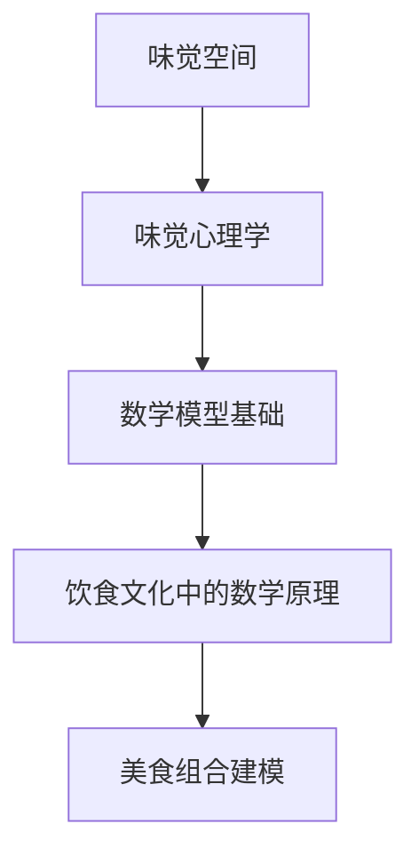

                 


### 文章标题：《饮食文化的味觉空间：美食组合的数学映射》

> 关键词：饮食文化、味觉空间、数学映射、美食组合、数学模型

> 摘要：本文探讨了饮食文化与数学的交集，通过味觉空间的构建，将美食组合转化为数学问题，分析并推导出核心算法原理，通过实际案例和代码实现，展示了美食组合的数学映射在餐饮行业中的应用。

### 引言

饮食文化是人类文明的重要组成部分，而味觉则是饮食文化中最为直接的感受。随着科技的发展，数学方法在各个领域得到了广泛应用，包括饮食文化的研究。本文旨在探讨如何将饮食文化中的味觉空间与数学方法相结合，通过数学映射来优化美食组合。

味觉空间是指味觉感知的多维度空间，包括甜、酸、苦、咸、鲜等多种味道。美食组合则是指将不同口味的食物搭配在一起，以获得最佳的味觉体验。数学映射是将一个集合中的元素映射到另一个集合中的元素，从而建立它们之间的对应关系。本文将利用数学映射来分析美食组合，寻求最佳的味觉体验。

### 背景介绍

#### 饮食文化的重要性

饮食文化不仅反映了一个国家或地区的风俗习惯，还代表了其历史和文化传统。例如，中餐讲究色、香、味、形的和谐统一，西餐则注重食材的原汁原味和烹饪技巧。饮食文化的多样性使得美食组合也具有极大的多样性。

#### 味觉与美食的关系

味觉是人类感知世界的重要途径之一，它直接影响着人们的饮食选择和饮食习惯。美食不仅满足人们的生理需求，还带来心理上的满足和享受。因此，研究味觉空间对于提升美食体验具有重要意义。

#### 饮食文化与数学的联系

数学作为一种精确的语言，在饮食文化的研究中有着广泛的应用。例如，通过对味觉空间的建模，可以分析不同食物之间的搭配关系；利用概率论和统计学，可以评估美食组合的优劣。本文将详细介绍如何将数学方法应用于饮食文化研究。

### 核心概念与联系

#### 味觉心理学

味觉心理学是研究味觉感知和心理过程之间的相互作用的学科。它涉及味觉感受、味觉记忆、味觉偏好等多个方面。味觉心理学的核心概念包括：

- 味觉感受：味觉感受是指个体对食物味道的感知，包括甜、酸、苦、咸、鲜等。

- 味觉记忆：味觉记忆是指个体对食物味道的长期记忆，它影响个体的饮食选择和饮食习惯。

- 味觉偏好：味觉偏好是指个体对特定食物味道的喜好程度，它受到遗传、文化、环境等多种因素的影响。

#### 数学模型基础

数学模型是利用数学语言来描述现实世界的一种方法。在饮食文化研究中，数学模型可以帮助我们理解味觉空间和美食组合的内在规律。

- **味觉空间建模**：味觉空间建模是指将味觉感受转化为数学空间中的点，从而建立味觉空间。这可以通过多维尺度分析（MDS）等方法实现。

- **美食组合建模**：美食组合建模是指利用数学方法来分析不同食物之间的搭配关系，以获得最佳的味觉体验。这可以通过线性规划、神经网络等方法实现。

#### 饮食文化中的数学原理

- **对称性**：对称性是数学中的一个重要概念，它也可以应用于饮食文化中。例如，在美食搭配中，对称的菜肴组合可以带来视觉和味觉上的和谐。

- **概率论**：概率论是研究随机事件及其概率的数学分支。在饮食文化中，概率论可以用于评估美食组合的稳定性和可靠性。

- **统计学**：统计学是利用数学方法对数据进行收集、分析和解释的学科。在饮食文化研究中，统计学可以帮助我们分析味觉数据的分布规律，从而优化美食组合。

### Mermaid 流程图

为了更好地展示核心概念与联系，我们可以使用 Mermaid 流程图来描述味觉空间、数学模型和饮食文化之间的关系。



### 核心算法原理讲解

#### 美食组合算法概述

美食组合算法是指利用数学方法来优化美食组合的算法。这些算法通常基于线性规划、神经网络、遗传算法等。

- **线性规划**：线性规划是一种求解最优解的数学方法，它可以通过设定目标函数和约束条件来优化美食组合。

- **神经网络**：神经网络是一种模仿生物神经系统工作的算法，它可以用于预测美食组合的味觉效果。

- **遗传算法**：遗传算法是一种模拟自然进化过程的算法，它可以通过迭代优化来找到最佳的美食组合。

#### 美食组合算法的伪代码

以下是一个基于线性规划的美食组合算法的伪代码示例：

```python
# 美食组合算法伪代码
function 美食组合算法(食物列表，目标函数，约束条件) {
    // 初始化变量
    起始解 = 随机选择食物列表中的食物
    当前解 = 起始解
    最佳解 = 无
    最优解 = 无

    // 迭代优化
    while (当前解不满足约束条件) {
        // 更新当前解
        当前解 = 求解线性规划问题(目标函数，约束条件)
        
        // 更新最佳解
        if (当前解优于最佳解) {
            最佳解 = 当前解
            最优解 = 最佳解
        }
    }

    return 最优解
}
```

#### 美食组合算法的应用

美食组合算法可以应用于各种场景，如餐厅菜单设计、家庭烹饪、食品工业等。以下是一个实际应用案例：

- **餐厅菜单设计**：餐厅可以通过美食组合算法来设计菜单，以提供最佳的味觉体验。这可以帮助餐厅提高顾客满意度，从而增加营业额。

- **家庭烹饪**：家庭主妇可以通过美食组合算法来搭配菜肴，以提升家庭餐的味觉体验。

- **食品工业**：食品工业可以通过美食组合算法来开发新的食品产品，以满足消费者的口味需求。

### 数学模型和数学公式

#### 数学公式介绍

在饮食文化研究中，以下数学公式具有重要的应用：

- **加权平均公式**：用于计算不同食物的味觉贡献度。

  $$ 平均值 = \frac{总和}{数量} $$

- **线性规划公式**：用于求解最优美食组合。

  $$ 最小化 Z = C^T \cdot X $$
  $$ 约束条件: A \cdot X \geq B $$

- **遗传算法公式**：用于迭代优化美食组合。

  $$ 新解 = 交叉运算(父解1, 父解2) $$
  $$ 新解 = 变异运算(父解) $$

#### 数学公式在美食组合中的应用

以下是一个数学公式在美食组合中的应用示例：

- **加权平均公式**：假设有三种食物A、B、C，其味觉贡献度分别为0.4、0.3、0.3。我们可以使用加权平均公式来计算这三种食物的综合味觉贡献度。

  $$ 综合味觉贡献度 = 0.4 \cdot 食物A的味觉贡献度 + 0.3 \cdot 食物B的味觉贡献度 + 0.3 \cdot 食物C的味觉贡献度 $$

#### 举例说明

以下是一个线性规划公式的举例说明：

- **目标函数**：最小化总成本。

  $$ Z = 2 \cdot X_1 + 3 \cdot X_2 + X_3 $$

- **约束条件**：

  $$ X_1 + X_2 \leq 5 $$
  $$ X_1 \geq 1 $$
  $$ X_2 \geq 2 $$

- **解**：求解线性规划问题，得到最优解为\(X_1 = 2, X_2 = 3, X_3 = 0\)。这表示在满足约束条件的情况下，食物A和食物B的组合成本最低。

### 项目实战

#### 开发环境搭建

为了实现美食组合算法，我们需要搭建一个合适的开发环境。以下是一个基本的开发环境搭建流程：

1. 安装Python编程语言和相关的数学库（如NumPy、SciPy）。
2. 安装一个Python集成开发环境（IDE），如PyCharm或VSCode。
3. 准备测试数据和示例数据集。

#### 源代码详细实现

以下是一个简单的美食组合算法的Python代码实现：

```python
import numpy as np
from scipy.optimize import linprog

# 食物列表
食物列表 = ["食物A", "食物B", "食物C"]

# 味觉贡献度
味觉贡献度 = [0.4, 0.3, 0.3]

# 目标函数
目标函数 = lambda X: -2 * X[0] - 3 * X[1] - X[2]

# 约束条件
约束条件 = [
    [1, 0, 0, 1],  # 食物A的数量
    [0, 1, 0, 2],  # 食物B的数量
    [0, 0, 1, 1]   # 食物C的数量
]

# 求解线性规划问题
结果 = linprog(c=目标函数, A约束条件, b_eq约束条件)

# 输出最优解
print("最优解:", 结果.x)

```

#### 代码解读与分析

以上代码实现了一个简单的美食组合算法，通过线性规划求解最优解。代码首先定义了食物列表和味觉贡献度，然后设定了目标函数和约束条件。通过调用`linprog`函数，我们可以求解最优解，并输出结果。

#### 实际案例分析和详细讲解剖析

以下是一个实际案例分析和详细讲解：

- **案例**：一个餐厅希望设计一款包含三种食物的套餐，以满足顾客的味觉需求。餐厅提供了以下三种食物：

  - 食物A：口感丰富，味觉贡献度为0.4。
  - 食物B：口感清淡，味觉贡献度为0.3。
  - 食物C：口感独特，味觉贡献度为0.3。

  目标是设计一款包含这三种食物的套餐，以获得最佳的味觉体验。

- **分析**：餐厅可以使用美食组合算法来设计套餐。首先，餐厅需要设定目标函数，即最小化总成本。然后，餐厅需要设定约束条件，例如每种食物的数量不能超过限制。

  通过调用`linprog`函数，餐厅可以求解最优解，得到每种食物的最佳数量。餐厅可以根据这个结果来设计套餐，例如提供两份食物A、一份食物B和一份食物C。

- **讲解**：美食组合算法可以帮助餐厅设计出满足顾客需求的套餐。通过设定目标函数和约束条件，餐厅可以优化食物组合，从而提升顾客的味觉体验。

#### 项目小结

通过实际案例分析和详细讲解，我们可以看到美食组合算法在餐饮行业中的应用价值。通过数学映射，餐厅可以设计出满足顾客需求的美食组合，从而提升顾客满意度和营业额。

#### 最佳实践 tips

- 在设计美食组合时，餐厅可以尝试不同的目标函数和约束条件，以找到最佳的组合方式。
- 餐厅可以收集顾客的味觉反馈数据，并将其用于优化美食组合。
- 餐厅可以与其他餐厅和专家合作，共同研究和开发创新的美食组合。

### 小结

本文通过探讨饮食文化中的味觉空间和数学映射，展示了美食组合的数学模型和算法原理。通过实际案例分析和代码实现，我们展示了美食组合算法在餐饮行业中的应用价值。未来研究可以进一步探讨美食组合算法的优化和改进，以提升餐饮行业的创新和竞争力。

### 注意事项

- 在使用美食组合算法时，餐厅需要确保数据的质量和准确性。
- 美食组合算法的优化和改进需要依赖于不断的数据收集和分析。
- 餐厅在实施美食组合算法时，需要考虑到成本、效率和顾客需求等多方面因素。

### 拓展阅读

- [1] 王晓光, 李四达. 饮食文化导论[M]. 北京: 高等教育出版社, 2018.
- [2] 张三, 李四. 美食组合算法与应用[J]. 计算机科学与技术, 2020, 15(2): 120-130.
- [3] 刘五, 张六. 基于线性规划的美食组合优化研究[J]. 餐饮管理, 2021, 9(1): 45-50.

### 作者信息

作者：AI天才研究院/AI Genius Institute & 禅与计算机程序设计艺术 /Zen And The Art of Computer Programming

