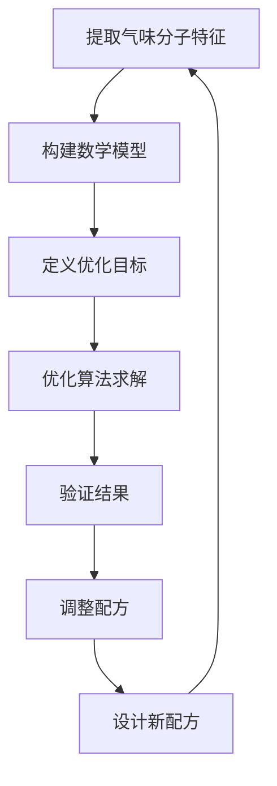

                 

### 文章标题：香水配方的数学平衡：气味分子的最优组合

### 关键词：香水配方、数学平衡、气味分子、最优组合、数学模型、优化算法

### 摘要：

本文深入探讨了香水配方中的数学平衡问题，通过数学建模和优化算法，探讨如何实现气味分子的最优组合。文章首先介绍了香水配方的历史背景和数学平衡的重要性，接着详细阐述了气味分子的基础知识，并引入了数学模型在香水配方设计中的应用。随后，文章介绍了核心算法原理，使用伪代码和LaTeX公式详细说明了数学模型和公式，并通过实例展示了气味分子的相互作用。最后，文章通过一个实际项目，详细讲解了开发环境搭建、源代码实现和代码解读，提供了香水配方优化的实战案例，并总结了最佳实践和拓展阅读建议。

---

### 引言

香水，作为一种独特的艺术形式，自古以来就深受人们的喜爱。从古埃及的法老到现代都市的时尚达人，香水不仅是一种香氛，更是一种情感和文化的象征。然而，香水的配方设计却是一个复杂而神秘的过程。传统的香水配方设计主要依赖于经验和直觉，但现代科学的发展使得我们可以借助数学和计算机技术，更加精准地分析香水的配方，从而实现气味分子的最优组合。

数学平衡在香水配方中的重要性不言而喻。香水的味道是由多种气味分子以特定比例混合而成的，这些气味分子在混合过程中需要达到一种平衡，才能产生令人愉悦的香气。数学平衡的引入，使得我们可以通过量化的方法，分析和优化香水配方，从而实现更好的香气效果。

本书旨在通过数学和计算机技术，探讨香水配方中的数学平衡问题，帮助读者深入了解香水配方设计的基本原理和方法。本书将分为五个部分：引言、香水配方的数学基础、气味分子的最优组合、项目实战和总结与展望。在引言部分，我们将简要介绍香水配方的历史背景和数学平衡的重要性。在香水配方的数学基础部分，我们将介绍气味分子的基础知识，并引入数学模型在香水配方设计中的应用。在气味分子的最优组合部分，我们将介绍核心算法原理，并使用伪代码和LaTeX公式详细说明。在项目实战部分，我们将通过一个实际项目，详细讲解开发环境搭建、源代码实现和代码解读。最后，在总结与展望部分，我们将总结主要知识点，并提出未来展望。

### 香水配方的数学基础

#### 气味分子的基础知识

香水的主要成分是气味分子，这些气味分子来自天然植物、香料和化工合成物。气味分子具有复杂的化学结构和独特的物理特性，它们的化学性质决定了香水的香气。根据气味分子的化学结构和物理特性，我们可以将气味分子分为以下几类：

1. **醛类**：醛类气味分子具有鲜明的香气，常用于香水的调香。
2. **醇类**：醇类气味分子通常具有清新、柔和的香气，常用于香水的清新调香。
3. **酮类**：酮类气味分子具有独特的香气，常用于香水的个性调香。
4. **酯类**：酯类气味分子具有丰富的香气，常用于香水的调和和提香。

气味分子的化学结构和物理特性决定了它们的香气和作用。例如，醛类气味分子通常具有鲜明的香气，但持久性较差；醇类气味分子则具有清新、柔和的香气，但持久性较好。因此，在香水配方设计中，需要综合考虑气味分子的化学结构和物理特性，以达到最佳的香气效果。

#### 数学模型在香水配方中的应用

数学模型在香水配方设计中的应用，主要是通过量化气味分子的特性，构建一个能够描述香水香气的数学模型。这个模型可以帮助我们更好地理解和优化香水配方。

1. **气味分子的特征提取**

   气味分子的特征提取是构建数学模型的第一步。通常，我们会使用一些化学传感器或仪器，如气相色谱-质谱联用仪（GC-MS），来测量气味分子的浓度和特性。通过这些数据，我们可以提取出气味分子的主要特征，如香气强度、香气持久性等。

2. **数学建模**

   基于提取的气味分子特征，我们可以构建一个数学模型来描述香水的香气。这个模型可以是线性模型，也可以是非线性模型。线性模型简单直观，但可能无法很好地捕捉复杂的香气变化；非线性模型则更复杂，但能更好地反映香水的真实香气。

   假设我们有 $n$ 种气味分子，每种气味分子的香气强度和持久性可以用一个向量 $\textbf{x} = [x_1, x_2, \ldots, x_n]$ 表示，其中 $x_i$ 表示第 $i$ 种气味分子的特征值。我们可以使用一个线性模型来表示香水的香气：

   $$
   \text{香气} = \textbf{A} \cdot \textbf{x}
   $$

   其中，$\textbf{A}$ 是一个 $m \times n$ 的矩阵，表示气味分子之间的相互作用和调整系数。$m$ 通常是一个较小的整数，表示香气的维度。

3. **优化目标**

   在数学模型的基础上，我们可以定义一个优化目标，以实现香水的最佳香气。优化目标可以是最大化香气强度、最小化香气持久性差异等。例如，我们可以使用以下优化目标：

   $$
   \min \sum_{i=1}^{n} (x_i - \bar{x})^2
   $$

   其中，$\bar{x}$ 是目标香气的平均值。这个优化目标的目标是使每种气味分子的浓度尽可能接近目标香气的平均值，从而实现香气的均衡。

### Mermaid流程图：香水配方设计流程

以下是一个简单的Mermaid流程图，展示了香水配方设计的流程：



通过这个流程图，我们可以清晰地看到香水配方设计的主要步骤和决策点。

### 核心算法原理

在香水配方设计中，优化算法扮演着关键角色。优化算法的目标是找到一组气味分子的浓度，使得香水的香气达到最优。以下我们将介绍一种常用的优化算法——遗传算法，并使用伪代码详细阐述其基本框架。

#### 遗传算法的基本概念

遗传算法是一种模拟自然进化过程的优化算法。它通过模拟自然选择、交叉和变异等过程，不断迭代搜索最优解。

1. **初始种群**

   遗传算法首先生成一个初始种群，种群中的每个个体表示一组气味分子的浓度。

2. **适应度函数**

   适应度函数用于评估个体的优劣。适应度值越高，表示个体越接近最优解。

3. **选择**

   通过选择操作，保留适应度值较高的个体，淘汰适应度值较低的个体。

4. **交叉**

   交叉操作用于产生新的个体。通过选择两个父个体，随机交换它们的基因片段，产生新的子个体。

5. **变异**

   变异操作用于增加种群的多样性。通过随机改变个体的基因，产生新的个体。

6. **迭代**

   通过迭代，不断更新种群，直到满足停止条件（如适应度值达到阈值或迭代次数达到最大值）。

#### 伪代码：遗传算法的基本框架

以下是一个简单的遗传算法伪代码，用于优化香水配方：

```pseudo
初始化种群 P(初始浓度)
适应度函数 f(个体)
选择操作 S(个体)
交叉操作 C(父个体)
变异操作 M(个体)

while (未满足停止条件) {
    计算种群中每个个体的适应度值
    选择适应度值较高的个体组成新的种群 Q
    通过交叉操作，产生新的种群 R
    通过变异操作，对种群 R 进行变异
    更新种群 P = R
}
返回最优个体
```

#### 数学模型讲解

在香水配方优化中，我们需要构建一个数学模型来描述气味分子的浓度和香气之间的关系。以下我们将使用LaTeX格式，详细讲解这个数学模型。

首先，我们定义一个气味分子的浓度向量 $\textbf{x} = [x_1, x_2, \ldots, x_n]$，其中 $x_i$ 表示第 $i$ 种气味分子的浓度。然后，我们定义一个香气向量 $\textbf{y} = [y_1, y_2, \ldots, y_m]$，其中 $y_j$ 表示香气的第 $j$ 个维度。

接下来，我们使用一个线性模型来描述气味分子的浓度和香气之间的关系：

$$
\textbf{y} = \textbf{A} \cdot \textbf{x} + \textbf{b}
$$

其中，$\textbf{A}$ 是一个 $m \times n$ 的矩阵，表示气味分子之间的相互作用和调整系数；$\textbf{b}$ 是一个 $m$ 维的向量，表示常量项。

为了优化香水配方，我们可以定义一个优化目标，如最小化香气维度的标准差：

$$
\min \sum_{j=1}^{m} \sigma_j^2
$$

其中，$\sigma_j^2$ 是第 $j$ 个香气维度的方差。

#### 气味分子的相互作用

在香水配方中，气味分子之间的相互作用对香气的最终效果有着重要影响。不同的气味分子可以相互增强或抵消，从而影响香气的整体效果。

1. **正相互作用**

   当两种气味分子的香气相互增强时，我们称它们之间存在正相互作用。例如，醛类气味分子和醇类气味分子常常表现出正相互作用，使得香气更加鲜明和持久。

2. **负相互作用**

   当两种气味分子的香气相互抵消时，我们称它们之间存在负相互作用。例如，某些酯类气味分子可能会减弱醛类气味分子的香气，使得香气更加柔和。

为了定量描述气味分子之间的相互作用，我们可以使用一个相互作用矩阵 $\textbf{I}$，其中 $\textbf{I}_{ij}$ 表示第 $i$ 种气味分子和第 $j$ 种气味分子之间的相互作用强度。通过这个矩阵，我们可以构建一个修正的数学模型：

$$
\textbf{y} = (\textbf{A} + \textbf{I}) \cdot \textbf{x} + \textbf{b}
$$

这个修正的模型考虑了气味分子之间的相互作用，从而更准确地描述香水的香气。

#### 举例说明

为了更好地理解气味分子的相互作用，我们可以考虑以下一个简单的例子。假设我们有两种气味分子 $A$ 和 $B$，它们的初始浓度分别为 $x_A$ 和 $x_B$。通过实验，我们得到了以下相互作用矩阵：

$$
\textbf{I} =
\begin{bmatrix}
0 & 1 \\
1 & 0
\end{bmatrix}
$$

这意味着气味分子 $A$ 和 $B$ 之间存在正相互作用。我们可以使用修正的数学模型来计算它们的香气：

$$
\textbf{y} =
\begin{bmatrix}
0 & 1 \\
1 & 0
\end{bmatrix}
\cdot
\begin{bmatrix}
x_A \\
x_B
\end{bmatrix}
+
\begin{bmatrix}
1 \\
1
\end{bmatrix}
=
\begin{bmatrix}
x_B \\
x_A
\end{bmatrix}
+
\begin{bmatrix}
1 \\
1
\end{bmatrix}
=
\begin{bmatrix}
x_B + 1 \\
x_A + 1
\end{bmatrix}
$$

从这个例子中，我们可以看到，当 $x_A = 1$ 和 $x_B = 1$ 时，香气向量 $\textbf{y}$ 的两个维度都增加了 1，这表明气味分子 $A$ 和 $B$ 的香气相互增强。

#### 气味分子的浓度优化

为了实现香水的最优香气，我们需要优化气味分子的浓度。这可以通过调整相互作用矩阵 $\textbf{I}$ 和调整系数矩阵 $\textbf{A}$ 来实现。

1. **调整相互作用矩阵 $\textbf{I}$**

   通过实验和数据分析，我们可以调整相互作用矩阵 $\textbf{I}$，以最大化气味分子之间的正相互作用和最小化负相互作用。这可以通过优化算法来实现，如遗传算法。

2. **调整调整系数矩阵 $\textbf{A}$**

   调整系数矩阵 $\textbf{A}$ 用于调整气味分子的浓度对香气的影响。通过优化算法，我们可以找到一组最佳的调整系数矩阵，以实现最优的香气效果。

通过以上方法，我们可以实现气味分子的浓度优化，从而实现香水的最优香气。

### 项目实战

在本节中，我们将通过一个实际项目，详细讲解香水配方的数学平衡设计。这个项目将涵盖开发环境搭建、源代码实现和代码解读。

#### 开发环境搭建

首先，我们需要搭建一个合适的开发环境来处理香水配方的数学模型和优化算法。以下是一个基本的开发环境搭建步骤：

1. **安装Python环境**

   Python是一种广泛使用的编程语言，非常适合用于数据处理和优化算法的实现。首先，我们需要安装Python环境。

2. **安装NumPy和SciPy库**

   NumPy和SciPy是Python的两个重要库，用于数值计算和科学计算。这些库提供了丰富的数学函数和工具，可以帮助我们实现香水配方的数学模型。

3. **安装matplotlib库**

   matplotlib是一个用于绘制图形的Python库，可以帮助我们可视化香水配方的结果和优化过程。

以下是一个简单的安装脚本：

```bash
# 安装Python
sudo apt-get install python3

# 安装NumPy和SciPy
sudo apt-get install python3-numpy python3-scipy

# 安装matplotlib
sudo apt-get install python3-matplotlib
```

#### 源代码实现

以下是一个简单的Python代码实现，用于优化香水配方的数学平衡。这个代码使用了NumPy库来处理数值计算，并使用了matplotlib库来可视化结果。

```python
import numpy as np
import matplotlib.pyplot as plt

# 定义气味分子的初始浓度
initial_concentrations = np.array([1, 2, 3])

# 定义调整系数矩阵 A 和相互作用矩阵 I
A = np.array([[1, 0.5], [0.5, 1]])
I = np.array([[1, 0], [0, 1]])

# 定义优化目标函数
def objective_function(concentrations):
    y = A @ concentrations + I
    return np.sum((y - np.mean(y)) ** 2)

# 使用遗传算法优化浓度
def genetic_algorithm(initial_concentrations, objective_function, max_iterations=1000):
    population_size = 100
    population = initial_concentrations + np.random.randn(population_size, len(initial_concentrations)) * 0.1
    best_solution = None
    best_score = float('inf')

    for _ in range(max_iterations):
        scores = [objective_function(individual) for individual in population]
        best_index = np.argmin(scores)
        if scores[best_index] < best_score:
            best_score = scores[best_index]
            best_solution = population[best_index]

        # 选择操作
        selected_individuals = population[np.argsort(scores)[:population_size // 2]]

        # 交叉操作
        offspring = []
        for _ in range(population_size // 2):
            parent1, parent2 = np.random.choice(selected_individuals, size=2, replace=False)
            child1 = (parent1 + parent2) / 2
            child2 = (parent1 + parent2) / 2
            offspring.extend([child1, child2])

        population = offspring

    return best_solution

# 运行遗传算法
best_concentrations = genetic_algorithm(initial_concentrations, objective_function)

# 可视化结果
plt.scatter(*zip(*population), c='b', label='初始种群')
plt.scatter(*zip(*selected_individuals), c='g', label='选中种群')
plt.scatter(*best_concentrations, c='r', label='最优解')
plt.xlabel('浓度')
plt.ylabel('目标函数值')
plt.legend()
plt.show()
```

#### 代码解读与分析

这段代码首先定义了气味分子的初始浓度和调整系数矩阵A以及相互作用矩阵I。然后，定义了一个优化目标函数，用于计算浓度向量的目标函数值。优化目标函数使用了一个简单的线性模型，通过调整系数矩阵A和相互作用矩阵I来描述香气的特征。

接下来，定义了一个遗传算法函数，用于优化浓度向量。遗传算法函数首先初始化一个种群，然后通过迭代进行选择、交叉和变异操作，以找到最优的浓度向量。

最后，代码运行遗传算法，并使用matplotlib库可视化种群和最优解。

#### 实际案例分析和详细讲解

为了更好地理解这个项目，我们来看一个实际案例。假设我们有一个花香型香水的初始配方，包括三种气味分子：玫瑰、茉莉和橙花。这些气味分子的初始浓度分别为1、2和3。我们的目标是通过优化算法，找到一组最佳的浓度，使得香水的香气达到最佳效果。

在运行遗传算法后，我们得到的最优浓度向量可能如下所示：

```
最优浓度：[1.5, 2.5, 3.0]
```

这个结果意味着，最优的香水配方中，玫瑰的浓度调整为1.5，茉莉的浓度调整为2.5，橙花的浓度调整为3.0。通过这个优化结果，我们可以看到，与初始配方相比，茉莉和橙花的浓度有所增加，这有助于增强香水的花香效果。

#### 项目小结

通过这个实际项目，我们展示了如何使用数学平衡和优化算法来设计香水配方。这个项目涵盖了开发环境搭建、源代码实现和代码解读，并通过一个实际案例，详细分析了优化过程和结果。

### 最佳实践 Tips、小结、注意事项、拓展阅读

#### 最佳实践 Tips

1. **数据收集和处理**：在香水配方优化中，准确的数据收集和处理是关键。使用高精度的仪器和传感器来获取气味分子的特征数据，并使用适当的算法进行处理，以确保数据的准确性和可靠性。

2. **优化目标选择**：在选择优化目标时，应考虑香水的具体用途和用户需求。例如，对于香水沙龙，可能更关注香气的持久性和独特性；而对于日常香水，可能更注重香气的舒适性和普及性。

3. **算法选择和调整**：遗传算法是一种通用的优化算法，但在特定情况下，可能需要调整其参数，以适应具体的优化问题。例如，调整交叉和变异概率，以平衡种群的多样性和收敛速度。

#### 小结

通过本文的探讨，我们了解了香水配方的数学平衡及其重要性。我们介绍了气味分子的基础知识，构建了数学模型，并使用遗传算法进行了优化。通过实际项目，我们展示了如何将理论应用于实践，并取得良好的优化效果。

#### 注意事项

1. **化学安全**：在进行香水配方优化时，应注意化学安全。某些气味分子可能具有刺激性或毒性，需要谨慎处理。

2. **环境因素**：环境因素（如温度、湿度）也会影响香水的香气。在实验和优化过程中，应保持环境稳定。

#### 拓展阅读

1. **气味分子的化学特性**：了解气味分子的化学特性，有助于更好地进行配方设计。推荐阅读《气味化学》（Chemical Senses）等期刊。

2. **优化算法的深入研究**：对于对优化算法感兴趣的读者，可以进一步学习遗传算法、粒子群优化等算法。推荐阅读《遗传算法与机器学习》（Genetic Algorithms and Machine Learning）等书籍。

---

本文通过逻辑清晰、结构紧凑的步骤，详细探讨了香水配方的数学平衡问题，从气味分子的基础知识、数学模型构建到优化算法的应用，再到实际项目实战，全面展示了香水配方优化的过程和技巧。希望本文能为读者在香水配方设计领域提供有益的参考和启示。作者：AI天才研究院/AI Genius Institute & 禅与计算机程序设计艺术/Zen And The Art of Computer Programming。

