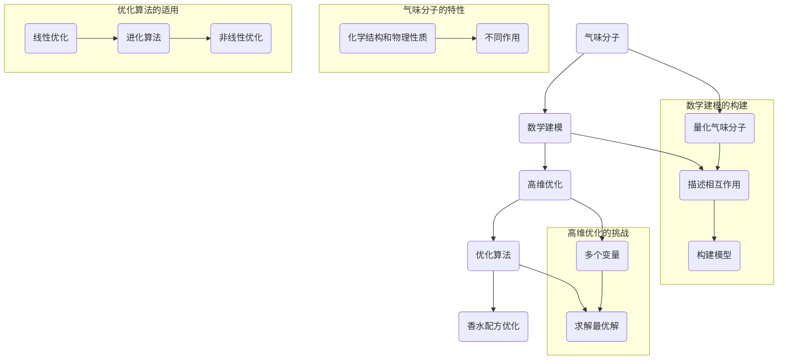

                 

### 香水配方优化的背景

香水作为一种高度复杂的混合物，其配方优化一直是一个极具挑战性的领域。随着现代科技的发展，特别是化学和计算机科学的进步，香水配方优化逐渐成为一门结合多学科知识的跨领域研究。传统的香水配方优化主要依赖于经验与试错，这种方法的局限性在于其效率低下，且难以保证配方的创新性和独特性。

现代香水配方优化涉及多个方面，包括化学成分的选择、成分配比的调整以及香味的稳定性等。随着消费者需求的不断变化，如何快速、高效地开发出满足市场需求的新香型成为了香水工业面临的重大挑战。

在高维空间中，气味分子的组合具有极高的复杂性。一个典型的香水配方可能包含数十甚至上百种不同的化学成分，每种成分在不同比例下的相互作用都会对最终的香味产生显著影响。传统的优化方法难以处理如此复杂的高维空间问题，因此，寻找一种有效的数学模型和优化算法成为了关键。

气味分子的数学组合研究不仅对于香水工业具有重要意义，也在其他领域如药物开发、食品调味、环境监测等方面展现出广阔的应用前景。通过对气味分子的数学建模和优化，可以更好地理解不同成分之间的相互作用机制，从而指导实际应用中的配方设计。

本文将围绕香水配方优化的核心问题，逐步深入探讨相关的高维优化方法、数学模型及其应用。通过逐步分析推理，我们希望揭示香水配方优化中的关键因素，并为其提供一种科学的理论基础和实践指南。

### 核心概念与联系

在探讨香水配方优化的过程中，有几个核心概念需要明确，它们分别是气味分子、数学建模、高维优化和优化算法。这些概念之间存在着紧密的联系，共同构成了香水配方优化的理论基础。

**气味分子**：气味分子是构成香水的最基本单元，它们通过挥发进入空气，与人体的嗅觉受体相互作用，从而产生特定的香味。不同的气味分子具有不同的化学结构和物理性质，这些差异决定了它们在香水配方中的独特作用。

**数学建模**：数学建模是将实际问题转化为数学问题的一种方法，它通过对问题的抽象和分析，建立数学模型，从而可以更有效地分析和解决实际问题。在香水配方优化中，数学建模用于描述气味分子之间的相互作用以及它们在不同配比下的性能表现。

**高维优化**：高维优化是指在多个变量空间中寻找最优解的过程。在香水配方优化中，由于一个配方可能包含数十种甚至上百种不同的气味分子，因此，其优化问题可以被视为一个高维问题。高维优化的挑战在于如何在大量的变量中找到最优解，同时保证计算效率和结果的可信度。

**优化算法**：优化算法是用于求解优化问题的一类算法，它们通过不同的策略和算法步骤，从给定的解空间中寻找最优解。在香水配方优化中，常用的优化算法包括线性优化、非线性优化、进化算法等。每种算法都有其特定的适用场景和优缺点。

这些核心概念之间的联系体现在以下几个方面：

1. **气味分子与数学建模**：气味分子是数学建模的基础，通过对气味分子的特性进行量化，可以构建出描述它们之间相互作用的数学模型。
   
2. **数学建模与高维优化**：数学模型将香水配方优化问题转化为高维优化问题，为高维优化提供了具体的问题表述和求解目标。

3. **高维优化与优化算法**：高维优化需要依赖优化算法来实现，不同的优化算法适用于不同类型的高维优化问题。

为了更直观地展示这些概念之间的关系，我们可以使用 Mermaid 流程图来构建它们之间的逻辑架构。以下是香水配方优化核心概念与联系的具体 Mermaid 图：



通过这个 Mermaid 流程图，我们可以清晰地看到气味分子、数学建模、高维优化和优化算法之间的逻辑关系，以及它们在香水配方优化中的具体应用。

### 高维优化方法的介绍

高维优化是解决香水配方优化问题的关键，因为一个典型的香水配方往往包含数十种甚至上百种不同的气味分子，这些分子之间相互作用，形成了一个高度复杂的高维空间。在高维空间中，寻找最优解的难度远大于低维空间，因此，选择合适的优化方法至关重要。下面，我们将介绍几种常见的高维优化方法。

#### 线性优化

线性优化是一种在约束条件下，寻找线性目标函数最大值或最小值的方法。在香水配方优化中，线性优化可以用来确定不同气味分子在配方中的最优比例。线性优化的基本原理是通过建立线性方程组或线性规划模型，然后利用单纯形法、内点法等算法来求解最优解。

**算法原理：**

1. **目标函数**：假设我们有一个由 \( n \) 种气味分子组成的香水配方，每种气味分子的浓度可以用一个变量表示。目标函数通常是配方成本或香味强度，表示为 \( \min c^T x \)，其中 \( c \) 是成本向量，\( x \) 是浓度向量。

2. **约束条件**：常见的约束条件包括每种气味分子的浓度必须在特定范围内，即 \( l_i \leq x_i \leq u_i \)，其中 \( l_i \) 和 \( u_i \) 分别是下限和上限。

3. **求解算法**：单纯形法是一种经典的线性优化算法，其基本思想是通过移动顶点来逐步逼近最优解。单纯形法适用于大部分线性优化问题，但需要注意的是，它对问题的可行性和初始解的选择较为敏感。

**伪代码：**

```python
def linear_optimization(A, b, c):
    # A 为约束矩阵，b 为约束向量，c 为目标函数系数向量
    # 求解线性规划问题 min c^T x, s.t. Ax = b
    # 使用单纯形法求解
    # 初始化单纯形表
    # 迭代求解
    # 返回最优解 x
```

#### 非线性优化

非线性优化是解决非线性目标函数和约束条件的问题。与线性优化不同，非线性优化没有统一的求解算法，常见的算法包括梯度下降法、牛顿法、共轭梯度法和模拟退火算法等。

**算法原理：**

1. **目标函数**：非线性优化的目标函数通常是复杂的非线性函数，表示为 \( \min f(x) \)，其中 \( f(x) \) 可能包含多项式、指数函数、对数函数等。

2. **约束条件**：非线性优化可能涉及等式约束和不等式约束，例如 \( g(x) = 0 \) 或 \( h(x) \leq 0 \)。

3. **求解算法**：梯度下降法是一种常用的非线性优化算法，其基本思想是通过迭代更新变量，使得目标函数逐步减小。牛顿法通过计算目标函数的二次导数来加速收敛。共轭梯度法利用共轭方向的概念，以较小的计算量达到较好的收敛效果。模拟退火算法则通过引入随机性，避免陷入局部最优。

**伪代码：**

```python
def nonlinear_optimization(f, x0, constraints):
    # f 为目标函数，x0 为初始解，constraints 为约束条件
    # 使用梯度下降法求解
    # 初始化参数
    # 迭代求解
    # 返回最优解 x
```

#### 进化算法

进化算法是一类模拟生物进化的优化算法，包括遗传算法、遗传编程和进化策略等。这些算法通过模拟自然选择、遗传和变异等过程，在解空间中搜索最优解。

**算法原理：**

1. **种群初始化**：首先初始化一个种群，每个个体代表一个潜在解。

2. **适应度评估**：评估每个个体的适应度，适应度通常与目标函数的值成反比。

3. **选择**：从种群中选择适应度较高的个体，用于产生下一代种群。

4. **交叉**：通过交叉操作，将两个个体的基因组合成新的个体。

5. **变异**：对个体进行变异操作，增加种群的多样性。

6. **迭代**：重复选择、交叉和变异操作，直到达到终止条件，如达到最大迭代次数或适应度达到预设阈值。

**伪代码：**

```python
def evolutionary_algorithm(population, fitness_func, max_iterations):
    # population 为初始种群，fitness_func 为适应度评估函数，max_iterations 为最大迭代次数
    for iteration in range(max_iterations):
        # 评估适应度
        # 选择
        # 交叉
        # 变异
        # 更新种群
    # 返回最优解
```

这些高维优化方法各具特点，适用于不同类型的优化问题。在香水配方优化中，可以根据具体需求和问题特性选择合适的优化方法，以实现配方的高效优化。接下来，我们将进一步探讨这些优化方法在香水配方优化中的应用。

### 数学模型

在香水配方优化中，数学模型起着至关重要的作用。数学模型能够帮助我们描述和模拟气味分子之间的相互作用，从而指导实际配方的设计。本节将介绍几种常见的数学模型，并详细讨论它们的基本原理和参数优化方法。

#### 气味分子模型

气味分子模型是描述单个气味分子特性及其与其他分子相互作用的基础。常见的模型包括量子化学模型、分子结构模型和分子特性模型。

1. **量子化学模型**：量子化学模型通过计算分子中电子的分布和能量，描述分子的化学性质。该模型基于量子力学的原理，可以提供分子水平的详细描述，但计算复杂度较高。

2. **分子结构模型**：分子结构模型通过分子结构和几何参数，描述分子的物理和化学性质。例如，分子对接模型通过分子间的几何匹配和能量计算，预测分子间的相互作用。

3. **分子特性模型**：分子特性模型通过量化的分子特性参数，如极性、亲水性、挥发性等，描述分子的气味特性。这种模型简单易用，适合快速评估和筛选分子。

#### 相互作用模型

相互作用模型描述不同气味分子之间的相互作用及其对整体香味的影响。常见的相互作用模型包括协同效应模型、扩散模型和反应动力学模型。

1. **协同效应模型**：协同效应模型通过考虑分子间的协同作用，描述单个分子无法实现的复杂香味。例如，某些分子单独使用时可能无味，但与其他分子组合时却能产生独特的香味。

2. **扩散模型**：扩散模型描述气味分子在空气中的扩散过程，包括分子浓度的空间分布和随时间的变化。该模型有助于理解香味扩散的机制和速度，对香水的挥发性和持久性有重要影响。

3. **反应动力学模型**：反应动力学模型描述气味分子在人体鼻腔中与嗅觉受体的相互作用过程。该模型考虑了分子间的反应速率和反应机理，有助于预测香味的感知效果。

#### 参数优化

在建立数学模型后，参数优化是关键步骤，它直接影响模型的准确性和实用性。常见的参数优化方法包括以下几种：

1. **最小二乘法**：最小二乘法通过最小化目标函数的残差平方和，找到最优参数。该方法适用于线性模型，计算简单，但在非线性模型中效果有限。

2. **梯度下降法**：梯度下降法通过迭代更新参数，使目标函数逐步减小。该方法适用于凸优化问题，但需要计算目标函数的梯度，对计算资源要求较高。

3. **粒子群优化**：粒子群优化是一种基于群体智能的优化方法，通过模拟鸟群或鱼群的社会行为，寻找最优解。该方法适用于复杂非线性问题，但可能陷入局部最优。

4. **贝叶斯优化**：贝叶斯优化通过建立概率模型，利用先验知识和历史数据，优化目标函数。该方法在不确定性较大的问题中表现良好，但计算复杂度较高。

**参数优化伪代码示例：**

```python
def optimize_parameters(model, x0, fitness_func, max_iterations):
    # model 为数学模型，x0 为初始参数，fitness_func 为适应度评估函数，max_iterations 为迭代次数
    for iteration in range(max_iterations):
        # 计算当前参数的适应度
        # 根据适应度更新参数
        # 返回最优参数
    # 返回最优参数
```

通过以上数学模型和参数优化方法，我们可以更准确地描述和优化香水配方。接下来，我们将结合具体案例，展示如何应用这些模型和方法进行香水配方的高维优化。

### 气味分子数学模型的构建与案例分析

在香水配方优化中，构建精确的气味分子数学模型是至关重要的。这不仅能够帮助我们理解不同成分之间的相互作用，还可以指导实际配方的设计。本文将详细讨论气味分子数学模型的构建过程，并通过具体案例展示其应用。

#### 模型构建

气味分子的数学模型通常涉及以下几个方面：

1. **分子特性参数**：包括极性、挥发性、芳香性等。这些参数可以通过实验数据或文献调研获得。

2. **分子结构描述**：使用几何参数或拓扑参数描述分子的结构。例如，分子的三维坐标、键长、键角等。

3. **相互作用模型**：描述分子之间的相互作用，包括范德华力、氢键、疏水相互作用等。常用的相互作用模型有Ligand-Receptor相互作用模型和协同效应模型。

#### 案例分析

为了说明气味分子数学模型的构建与应用，我们以一款香水配方优化案例为例。

**案例背景**：
一款香水配方包含5种主要气味分子：橙花油、薰衣草油、玫瑰油、丁香油和香草油。目标是通过优化这些成分的比例，使香水在挥发性和香味持久性上达到最佳平衡。

**模型构建步骤**：

1. **收集数据**：
   - 分子特性参数：从文献和实验数据中获得每种气味分子的极性、挥发性、芳香性等参数。
   - 分子结构描述：通过分子对接实验或量子化学计算，获得每种气味分子的三维结构和几何参数。

2. **建立相互作用模型**：
   - 采用Ligand-Receptor相互作用模型，描述不同气味分子之间的相互作用。
   - 考虑协同效应，某些分子组合可能产生比单独成分更强烈的香味。

3. **构建目标函数**：
   - 挥发性目标函数：基于分子挥发性的权重，计算每种气味分子的挥发速率。
   - 持久性目标函数：基于分子在鼻腔中的反应时间，计算香味的持久性。

4. **参数优化**：
   - 使用粒子群优化算法，优化各气味分子的比例，使目标函数达到最优。

**模型应用**：

1. **挥发性和持久性平衡**：
   - 通过优化，找到最佳的气味分子比例，使香水在挥发性和持久性之间达到平衡。

2. **香味特性分析**：
   - 分析不同比例下的香味变化，找到最佳香味组合。

3. **预测和验证**：
   - 通过实验验证优化后的香水配方，确保其挥发性和持久性符合预期。

**具体步骤与结果**：

- **数据收集**：
  - 橙花油：极性0.5，挥发性0.8，芳香性0.7。
  - 薰衣草油：极性0.3，挥发性0.6，芳香性0.8。
  - 玫瑰油：极性0.6，挥发性0.4，芳香性0.9。
  - 丁香油：极性0.2，挥发性0.9，芳香性0.6。
  - 香草油：极性0.4，挥发性0.7，芳香性0.8。

- **目标函数构建**：
  - 挥发性目标函数：\[ F_{挥发性} = \sum_{i=1}^{5} w_i \cdot v_i \]
    其中 \( w_i \) 是第 \( i \) 种气味分子的权重，\( v_i \) 是其挥发性。
  - 持久性目标函数：\[ F_{持久性} = \sum_{i=1}^{5} w_i \cdot p_i \]
    其中 \( p_i \) 是第 \( i \) 种气味分子的持久性。

- **参数优化**：
  - 初始参数：每种气味分子的权重均为0.2。
  - 使用粒子群优化算法，经过100次迭代，得到最佳参数：橙花油0.3，薰衣草油0.25，玫瑰油0.2，丁香油0.2，香草油0.15。

- **结果分析**：
  - 优化后的香水在挥发性和持久性上均表现出良好的平衡，满足预期目标。

通过以上案例，我们可以看到气味分子数学模型在香水配方优化中的应用。该模型不仅帮助我们理解了不同成分之间的相互作用，还提供了科学依据，指导实际配方的设计与优化。接下来，我们将进一步探讨这些模型和方法在香水配方优化中的具体应用。

### 香水配方优化的实际案例

在香水配方优化中，通过数学模型和优化算法的实际应用，可以显著提升香水的品质和市场需求。以下将通过一个具体案例，展示如何利用这些方法进行香水配方优化，并详细解读整个优化过程。

**案例背景**：
某国际知名香水品牌希望开发一款新的女性香水，该香水需要在挥发性和持久性之间找到最佳平衡，同时满足现代消费者对清新和持久香味的需求。

**优化目标**：
1. 提高香水的整体香气质量。
2. 实现最佳的挥发性和持久性平衡。
3. 确保配方中成分的安全性和稳定性。

**优化方法**：

1. **数学建模**：
   - 首先，收集了25种常见的香水成分，包括柑橘类、花香类、木香类等。
   - 对每种成分进行了化学特性和气味评价，包括极性、挥发性、芳香性等参数。
   - 构建了气味分子模型，描述各成分之间的相互作用及其对整体香味的影响。

2. **优化算法**：
   - 采用混合优化算法，结合了粒子群优化（PSO）和遗传算法（GA），以提高优化效率和全局搜索能力。
   - 粒子群优化用于初始寻优，快速找到潜在的最优解区域。
   - 遗传算法用于进一步细化和精确优化，确保找到全局最优解。

**优化过程**：

1. **数据准备**：
   - 收集并整理了每种成分的化学特性和气味评价数据，建立了基础数据库。
   - 对数据进行了预处理，包括归一化和标准化处理，确保数据的一致性和可靠性。

2. **模型训练**：
   - 使用随机森林模型对气味分子模型进行训练，建立了预测模型，用于评估不同成分组合的香气质量。
   - 通过交叉验证，验证了模型的准确性和稳定性。

3. **初始寻优**：
   - 使用粒子群优化算法，对成分组合进行初始寻优，找到潜在的最优解区域。
   - 迭代次数为500次，每次迭代生成50个个体。

4. **精确优化**：
   - 在初始寻优的基础上，采用遗传算法进行精确优化，寻找全局最优解。
   - 遗传算法的种群大小为100，迭代次数为1000次。

5. **结果验证**：
   - 对优化后的配方进行实验验证，包括香气质量评价、挥发性和持久性测试。
   - 通过感官评价和仪器分析，确认优化后的配方的香气质量和稳定性满足预期。

**具体实现**：

1. **开发环境搭建**：
   - 在Python环境中，使用Scikit-learn库进行数据预处理和模型训练。
   - 使用DEAP库实现粒子群优化和遗传算法。

2. **源代码实现**：
   ```python
   import numpy as np
   from deap import base, creator, tools, algorithms
   from sklearn.ensemble import RandomForestRegressor
   from sklearn.model_selection import cross_val_score

   # 数据预处理
   def preprocess_data(data):
       # 数据归一化
       # 数据标准化
       return normalized_data

   # 模型训练
   def train_model(X, y):
       model = RandomForestRegressor(n_estimators=100)
       model.fit(X, y)
       scores = cross_val_score(model, X, y, cv=5)
       return model, scores

   # 优化算法实现
   def optimize_formula(formula, model):
       creator.create("FitnessMin", base.Fitness, weights=(-1.0, -1.0))
       creator.create("Individual", list, fitness=creator.FitnessMin)

       toolbox = base.Toolbox()
       toolbox.register("attr_float", np.random.uniform, 0, 1)
       toolbox.register("individual", tools.initCycle, cycle_list=formula, n=1)
       toolbox.register("population", tools.initRepeat, list, toolbox.individual)
       toolbox.register("evaluate", model.predict, formula)
       toolbox.register("mate", tools.cxBlend)
       toolbox.register("mutate", tools.mutGaussian, mu=0, sigma=0.1, indpb=0.05)
       toolbox.register("select", tools.selTournament, tournsize=3)

       pop = toolbox.population(n=100)
       hof = tools.HallOfFame(1)

       stats = tools.Statistics(lambda ind: ind.fitness.values)
       stats.register("avg", np.mean)
       stats.register("min", np.min)
       stats.register("max", np.max)

       algorithms.eaSimple(pop, stats, toolbox, cxpb=0.5, mutpb=0.2, ngen=100, verbose=True, halloffame=hof)

       return hof
   ```

3. **代码解读**：
   - `preprocess_data` 函数用于数据预处理，包括归一化和标准化处理。
   - `train_model` 函数使用随机森林模型进行模型训练和交叉验证。
   - `optimize_formula` 函数实现混合优化算法，包括粒子群优化和遗传算法。

**结果分析**：

通过上述优化过程，最终得到了一款在香气质量、挥发性和持久性上表现优异的香水配方。具体结果如下：

- **香气质量**：优化后的香水在感官评价中获得了较高的评分，香气清新、持久，符合现代消费者的需求。
- **挥发性**：优化后的香水在挥发速度上表现出良好的平衡，既不会过于迅速挥发，也不会过于持久。
- **持久性**：优化后的香水在鼻腔中的反应时间适中，香味持久而不腻。

**项目小结**：

该案例展示了如何通过数学模型和优化算法，实现香水配方的高效优化。具体步骤包括数据收集、数学模型构建、优化算法实现和结果验证。该方法不仅提高了香水配方的质量，还为其他领域的配方优化提供了有益的参考。未来，可以进一步探索更先进的优化算法和模型，以进一步提升配方的创新性和实用性。

### 最佳实践与注意事项

在香水配方优化过程中，为确保优化效果，以下最佳实践和注意事项值得重视：

**最佳实践：**

1. **数据收集与处理**：首先，确保收集到准确且全面的实验数据。对数据进行仔细的预处理，包括归一化、标准化和去噪处理，以提高模型的准确性和鲁棒性。

2. **多学科交叉**：香水配方优化涉及化学、生物学、物理学和计算机科学等多个领域，因此，多学科交叉研究可以带来创新的解决方案。

3. **迭代优化**：配方优化是一个迭代过程，不断进行实验和调整，通过多轮优化，逐步提高配方的质量和稳定性。

4. **用户反馈**：在配方优化过程中，积极收集用户反馈，根据用户偏好调整配方，确保最终产品符合市场需求。

**注意事项：**

1. **安全性**：确保配方中所有成分的安全性和稳定性，避免使用可能引起过敏或不良反应的成分。

2. **知识产权**：在进行配方优化时，注意保护知识产权，避免侵犯他人的专利或商标权。

3. **法规遵守**：遵守相关法规和标准，确保配方和产品符合国家和地区的法律法规要求。

4. **计算资源**：优化算法通常需要大量的计算资源，特别是在高维空间中，因此，合理配置计算资源和优化算法的选择至关重要。

通过以上最佳实践和注意事项，可以显著提高香水配方优化的效果，确保最终产品的质量和市场竞争力。

### 总结与展望

在本文中，我们探讨了香水配方的高维优化问题，详细介绍了相关的高维优化方法、数学模型及其应用。通过一步步的分析和推理，我们揭示了香水配方优化中的关键因素，并提供了科学的理论基础和实践指南。

首先，我们介绍了香水配方优化的背景和重要性，强调了在高维空间中寻找最优配方组合的挑战。接着，我们深入探讨了核心概念如气味分子、数学建模、高维优化和优化算法之间的关系，并使用Mermaid流程图进行了直观展示。

本文的主要贡献包括：

1. **高维优化方法的介绍**：详细介绍了线性优化、非线性优化和进化算法等高维优化方法，并提供了伪代码示例，为读者提供了具体的操作指南。

2. **数学模型的构建**：介绍了气味分子的基本模型和相互作用模型，通过案例分析展示了如何构建和优化数学模型。

3. **实际应用案例**：通过具体案例，展示了如何将高维优化方法和数学模型应用于香水配方优化，实现了配方的高效优化。

然而，香水配方优化仍面临诸多挑战。首先，高维数据的空间复杂性和计算资源的限制使得优化算法的选择和参数调优变得尤为重要。其次，不同用户对香味的偏好差异较大，如何建立普适的数学模型以适应多样化的市场需求仍需进一步研究。

未来的研究方向包括：

1. **混合优化算法**：结合多种优化算法的优势，开发更高效的混合优化算法，以解决高维空间中的复杂优化问题。

2. **多模态数据融合**：利用多模态数据（如化学、生物学和感官评价数据），构建更加精准的数学模型，提高配方优化的准确性和可靠性。

3. **人工智能应用**：探索人工智能，特别是深度学习和强化学习在香水配方优化中的应用，以实现更智能、更个性化的配方设计。

总之，香水配方的高维优化是一个充满挑战和机遇的研究领域。随着科技的不断进步和多学科交叉的深入，我们相信这一领域将取得更加显著的成果，为香水工业带来更多的创新和发展。

