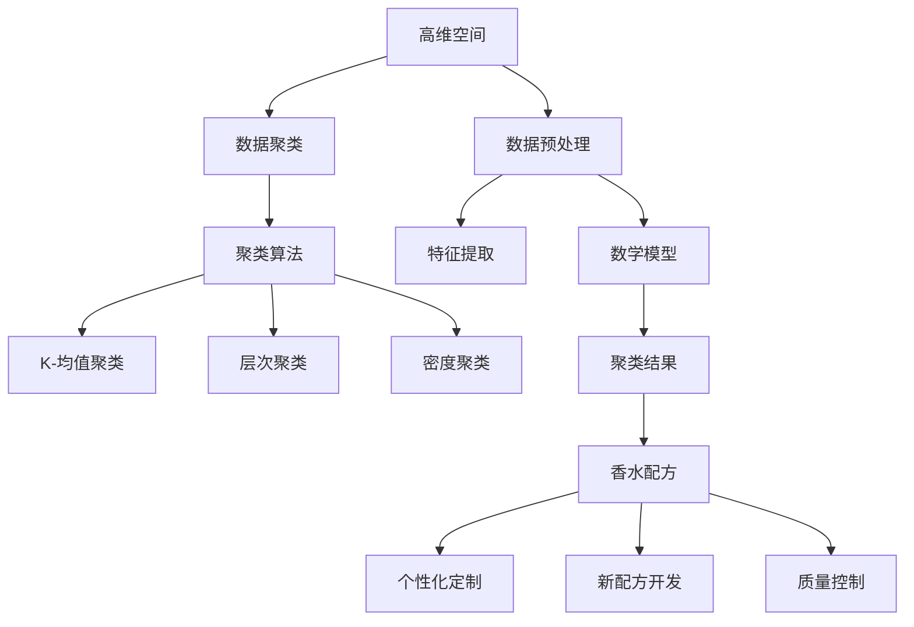

                 

# 香水配方的高维聚类：气味分子的数学分类

## 关键词

- 高维聚类
- 气味分子
- 数学分类
- 香水配方
- 数据预处理
- 聚类算法

## 摘要

本文旨在探讨高维聚类在香水配方中的创新应用，通过气味分子的数学分类，为香水工业提供一种科学、系统的配方设计方法。文章首先介绍了香水配方的基础知识，随后深入分析了高维聚类理论及其在香水配方设计中的应用。此外，文章还详细阐述了气味分子的数据预处理、特征提取以及高维聚类算法的实践步骤。通过实例分析，本文展示了高维聚类技术在香水配方设计中的实际应用价值，为相关领域的研究提供了有价值的参考。

## 第一部分：背景与概述

### 1. 引言

香水，作为人们日常生活中不可或缺的时尚品，已经拥有了悠久的历史。从古埃及时期开始的香水制造工艺，到现代科技对气味分子的深入解析，香水工业经历了翻天覆地的变化。然而，香水配方的设计一直依赖经验，科学方法的应用相对有限。随着人工智能和大数据技术的快速发展，高维聚类作为一种强大的数据分析工具，逐渐进入香水配方设计的视野。

高维聚类，即在高维空间中对数据进行分类的算法。它通过寻找数据点之间的相似性，将具有相似特征的数据点归为同一类。这一技术不仅在数据挖掘、图像处理等领域表现出色，还在香水配方设计上展现出巨大的潜力。通过对气味分子的数学分类，高维聚类可以帮助香水设计师快速筛选和优化配方，提高香水质量。

本文旨在通过分析香水配方中气味分子的特性，探讨高维聚类在香水配方设计中的应用。文章将首先介绍香水的基础知识，包括香水的组成与分类、气味分子的化学特性以及感官评价。接着，本文将深入探讨高维聚类的理论基础，包括高维空间的概念、数据聚类的分类及核心算法。随后，文章将详细阐述气味分子的数据预处理与特征提取过程，并通过具体实例展示高维聚类在香水配方设计中的应用。最后，文章将对未来高维聚类在香水配方中的发展方向进行展望。

### 2. 香水配方的基础

香水是一种复杂的混合物，通常由多种不同的化学物质（气味分子）组成。这些气味分子可以按照化学结构、挥发性和气味特征进行分类。常见的香水类型包括花香型、果香型、木香型、海洋香型等。每种类型的香水都有其独特的气味特征，满足不同消费者的需求。

香水的组成主要包括以下几部分：

1. **基调（Base Notes）**：基调是香水中的主要成分，通常具有持久的香气，如香根草、麝香、橡木苔等。基调在香水挥发过程中后释放，为香水提供深度和持久性。
2. **主调（Heart Notes）**：主调是香水的核心成分，通常具有中等的挥发速度和香气强度。主调决定了香水的整体风格，如玫瑰、茉莉、橙花等。
3. **头调（Top Notes）**：头调是香水中的次要成分，挥发速度最快，香气最淡，通常在香水喷洒后的前几分钟内散发。头调的主要作用是吸引消费者的注意，如柠檬、橙子、葡萄柚等。

气味分子的化学特性是香水配方设计的核心。气味分子主要分为以下几类：

1. **酯类**：酯类气味分子通常具有清新、花香或果香的气味，如乙酸苄酯、苯甲酸苄酯等。
2. **醇类**：醇类气味分子通常具有花香或木香的气味，如苯甲醇、芳樟醇等。
3. **醛类**：醛类气味分子通常具有花香或木香的气味，如香叶醇、橙花醛等。
4. **酮类**：酮类气味分子通常具有花香或果香的气味，如苯乙酮、甲酸香叶酯等。

对于香水的感官评价，消费者通常会根据香水的香气、持久性、肤感等多个方面进行评价。香气评价主要包括香气的强度、纯净度、扩散性等；持久性评价主要关注香水的持久时间；肤感评价则涉及香水的触感、吸收性等。

通过对香水配方的基础了解，我们可以更好地理解高维聚类在香水配方设计中的应用。接下来，本文将详细探讨高维聚类的理论基础，为后续的应用提供坚实的理论基础。

### 3. 高维空间与数据聚类的概念

高维空间是数据聚类领域中的一个重要概念。在高维空间中，数据点被表示为多维向量，每个维度对应一个特征。与低维空间相比，高维空间中的数据点具有更多的自由度和复杂性。这使得在高维空间中进行聚类分析变得更具挑战性，但同时也提供了更丰富的信息。

#### 高维空间的概念

高维空间，即维度大于三维的空间。在数学上，高维空间通常被表示为n维空间，其中n可以是任意大的整数。例如，一个三维空间可以表示为$(x, y, z)$，而一个四维空间可以表示为$(x, y, z, w)$。

高维空间中的数据点通常被表示为向量，每个分量对应一个特征。例如，一个包含三个特征的二维数据集可以表示为：

$$
\begin{align*}
\mathbf{x}_1 &= (1, 2, 3) \\
\mathbf{x}_2 &= (4, 5, 6) \\
\mathbf{x}_3 &= (7, 8, 9)
\end{align*}
$$

这里，$\mathbf{x}_1, \mathbf{x}_2, \mathbf{x}_3$ 分别表示三个数据点，每个数据点由三个特征组成。

#### 数据聚类的概念

数据聚类是一种无监督学习方法，旨在将数据集划分为多个组或簇，使得同一簇内的数据点彼此相似，而不同簇之间的数据点差异较大。在聚类过程中，每个数据点被分配到一个簇，簇的中心（或代表点）通常用来表示簇的特征。

数据聚类可以应用于多个领域，包括机器学习、数据挖掘、图像处理等。在香水配方设计领域，聚类算法可以帮助识别具有相似特性的气味分子，从而优化香水配方。

#### 数据聚类的分类

数据聚类算法可以根据不同的分类标准进行分类。以下是几种常见的数据聚类算法：

1. **基于距离的聚类算法**：这类算法通过计算数据点之间的距离来划分簇。常见的算法包括K-均值聚类、层次聚类等。

2. **基于密度的聚类算法**：这类算法通过分析数据点之间的密度关系来划分簇。DBSCAN（Density-Based Spatial Clustering of Applications with Noise）是一种典型的基于密度的聚类算法。

3. **基于模型的聚类算法**：这类算法通过构建数学模型来描述数据点之间的相似性。例如，高斯混合模型（Gaussian Mixture Model, GMM）就是一种基于模型的聚类算法。

#### 高维聚类的挑战

在高维空间中进行聚类分析面临许多挑战。以下是几个主要挑战：

1. **维度灾难（Curse of Dimensionality）**：在高维空间中，数据点之间的距离迅速减小，导致聚类变得困难。维度灾难使得传统的基于距离的聚类算法在高维空间中表现不佳。

2. **局部性丢失（Loss of Locality）**：在高维空间中，数据点失去了原有的局部结构，这使得基于局部性分析的聚类算法失效。

3. **计算复杂性**：高维聚类算法的计算复杂性通常随着维数的增加而急剧增加。这限制了在高维空间中进行大规模数据聚类的可行性。

为了应对这些挑战，研究人员提出了多种改进方法。例如，可以通过特征选择和特征提取来减少数据的维度，从而降低聚类的难度。此外，还可以使用基于模型的聚类算法来描述高维数据点的分布特征。

#### 高维聚类的应用前景

高维聚类在香水配方设计领域具有广泛的应用前景。通过对气味分子的特征进行分析和聚类，可以识别具有相似特性的气味分子，从而优化香水配方。高维聚类还可以用于分析不同香水配方之间的差异，为香水设计师提供有价值的参考。

总之，高维聚类作为一种强大的数据分析工具，在香水配方设计领域具有巨大的潜力。本文将在后续章节中详细探讨高维聚类的理论基础，包括相关算法的原理和实现方法，为高维聚类在香水配方设计中的应用提供理论支持。

### 4. 数据聚类的核心算法及其数学基础

在数据聚类过程中，选择合适的算法是关键。不同的聚类算法适用于不同的数据集和场景。本文将重点介绍几种常用的聚类算法，包括K-均值聚类、层次聚类和密度聚类，并详细解释其数学基础和实现步骤。

#### K-均值聚类算法

K-均值聚类是一种基于距离的迭代聚类算法，旨在将数据点划分为K个簇，使得每个数据点与其分配的簇中心之间的距离最小。以下是K-均值聚类算法的数学基础和实现步骤。

**数学基础**

1. **初始化聚类中心**：随机选择K个数据点作为初始聚类中心$\mu_1, \mu_2, \ldots, \mu_K$。

2. **计算距离**：对于每个数据点$x_i$，计算其与每个聚类中心的距离：

   $$
   D(x_i, \mu_j) = \sqrt{\sum_{k=1}^{n} (x_{ik} - \mu_{jk})^2}
   $$

   其中，$x_{ik}$和$\mu_{jk}$分别表示数据点$x_i$在第$k$个特征上的值和聚类中心$\mu_j$在第$k$个特征上的值。

3. **分配数据点**：将每个数据点$x_i$分配给距离最近的聚类中心：

   $$
   C(x_i) = \arg\min_{j} D(x_i, \mu_j)
   $$

4. **更新聚类中心**：计算每个簇的新聚类中心：

   $$
   \mu_j = \frac{1}{N_j} \sum_{x_i \in C(x_i)} x_i
   $$

   其中，$N_j$表示簇$C(x_i)$中的数据点数量。

5. **迭代**：重复步骤2至步骤4，直到聚类中心不再发生变化或达到预设的最大迭代次数。

**实现步骤**

1. 随机初始化聚类中心。
2. 对于每个数据点，计算其与聚类中心的距离，并将数据点分配给最近的聚类中心。
3. 计算每个聚类中心的新位置。
4. 重复步骤2和步骤3，直到聚类中心稳定。

#### 层次聚类算法

层次聚类是一种自下而上或自上而下的聚类方法，通过逐步合并或分解数据点，构建一个聚类层次结构。以下是层次聚类算法的数学基础和实现步骤。

**数学基础**

1. **初始化**：将每个数据点视为一个簇。

2. **合并簇**：每次迭代中，计算相邻簇之间的距离，选择距离最近的簇进行合并。常用的距离度量包括组间平均距离、组内最大距离等。

3. **更新簇中心**：合并簇后，重新计算簇的中心。

4. **迭代**：重复步骤2和步骤3，直到达到预设的簇数量或最大迭代次数。

**实现步骤**

1. 初始化每个数据点为一个簇。
2. 计算相邻簇之间的距离。
3. 选择距离最近的簇进行合并。
4. 重新计算簇的中心。
5. 重复步骤2至步骤4，直到达到预设的簇数量或最大迭代次数。

#### 密度聚类算法

密度聚类是一种基于密度的数据聚类方法，旨在识别数据点的高密度区域。DBSCAN（Density-Based Spatial Clustering of Applications with Noise）是一种典型的密度聚类算法。以下是DBSCAN算法的数学基础和实现步骤。

**数学基础**

1. **核心点**：如果一个点p的邻域内至少有MinPts个数据点，则p是核心点。

2. **边界点**：如果一个点p的邻域内数据点数量介于MinPts和核心点数量之间，则p是边界点。

3. **噪声点**：如果一个点p的邻域内数据点数量少于MinPts，则p是噪声点。

4. **聚类扩展**：从核心点开始，扩展形成聚类。对于每个核心点，将其邻域内的所有核心点和边界点加入到同一聚类中。

**实现步骤**

1. 初始化核心点和边界点。
2. 为每个核心点扩展聚类。
3. 标记噪声点。
4. 重复步骤2和步骤3，直到所有点都被聚类。

#### 总结

K-均值聚类、层次聚类和DBSCAN算法都是常用的数据聚类算法，各自适用于不同的场景和数据集。K-均值聚类适用于数据点密集且无明显边界的情况；层次聚类适用于需要查看聚类层次结构的情况；DBSCAN算法则适用于数据点分布不均匀且存在噪声的情况。理解这些算法的数学基础和实现步骤，有助于在实际应用中选取合适的聚类方法。

在下一节中，本文将详细探讨高维聚类在香水配方设计中的应用，介绍数据预处理和特征提取的过程。

### 5. 聚类结果的评估与优化

聚类结果的评估与优化是数据聚类过程中至关重要的一环。有效的评估方法可以帮助我们判断聚类质量，而合理的优化策略则能够提高聚类结果的准确性和可靠性。本文将介绍几种常见的聚类评价指标和优化策略，以帮助读者更好地理解和应用高维聚类算法。

#### 聚类评价指标

1. **内部球体半径（Internal Ball Ratio）**：内部球体半径是评估聚类内部一致性的指标。它表示聚类中心到簇内任意数据点的最大距离与聚类中心之间的距离之比。内部球体半径越小，说明聚类内部的一致性越高。

   $$
   \text{IR} = \frac{\max_{x_i \in C_j} D(\mu_j, x_i)}{D(\mu_j, \mu_j)}
   $$

   其中，$C_j$表示第j个簇，$\mu_j$是簇$C_j$的中心，$D(\mu_j, x_i)$是$\mu_j$与$x_i$之间的距离。

2. **轮廓系数（Silhouette Coefficient）**：轮廓系数是评估聚类质量和数据点分类优劣的指标。它通过计算数据点与其最近簇中心之间的距离与同一簇内其他数据点之间的距离之比来衡量。轮廓系数的范围是[-1, 1]，值越接近1，说明聚类效果越好。

   $$
   \text{SC}(x_i) = \frac{D(x_i, b_i) - \min_{j \neq i} D(x_i, c_j)}{D(x_i, b_i) + \min_{j \neq i} D(x_i, c_j)}
   $$

   其中，$b_i$是$x_i$的最近簇中心，$c_j$是$x_i$的当前簇中心。

3. **完整度（Completeness）**：完整度是评估聚类结果中簇内数据点完整性的指标。它表示簇内数据点是否都与其他簇内的数据点保持一定的距离。完整度的值范围是[0, 1]，值越接近1，说明聚类结果越好。

   $$
   \text{Completeness}(C_j) = \frac{\sum_{i \in C_j} \max_{x_i' \in C'} D(x_i, x_i')} {|\sum_{i \in C_j} \max_{x_i' \in C'} D(x_i, x_i')|}
   $$

   其中，$C'$是除了$C_j$以外的其他簇。

4. **V-度量（V-measure）**：V-度量是结合完整度和同质性的综合评价指标。它综合考虑了聚类结果中的簇内一致性和簇间分离性。

   $$
   \text{V-measure}(C_j) = \frac{2 \times \text{Completeness}(C_j) \times \text{Homogeneity}(C_j)}{\text{Completeness}(C_j) + \text{Homogeneity}(C_j)}
   $$

   其中，$\text{Homogeneity}(C_j)$是评估聚类结果中簇内数据点是否属于同一类别的指标。

#### 聚类结果的优化策略

1. **参数调整**：对于参数敏感的聚类算法（如K-均值聚类），合理调整聚类参数（如聚类个数K、距离阈值等）可以显著提高聚类质量。

2. **特征选择**：特征选择是高维数据聚类的重要步骤。通过选择与目标相关的特征，可以减少数据的维度，提高聚类的准确性和效率。常见的方法包括信息增益、主成分分析（PCA）等。

3. **聚类算法组合**：结合多种聚类算法，可以弥补单一算法的不足，提高聚类结果的可靠性。例如，可以先使用一种算法进行初步聚类，再使用另一种算法对结果进行调整。

4. **交叉验证**：交叉验证是一种评估聚类模型性能的方法。通过将数据集划分为多个子集，分别进行训练和验证，可以更全面地评估聚类模型的性能。

5. **聚类质量评估**：在聚类过程中，定期评估聚类质量，可以及时发现和纠正错误，提高聚类结果的准确性。

总之，聚类结果的评估与优化是数据聚类过程中的关键环节。通过合理选择评价指标和优化策略，可以显著提高聚类结果的准确性和可靠性，为后续的应用提供有力支持。在下一节中，本文将详细介绍气味分子的数据预处理与特征提取过程，为高维聚类在香水配方设计中的应用奠定基础。

### 6. 气味分子的数据预处理与清洗

在进行高维聚类分析之前，对气味分子数据进行预处理和清洗是至关重要的一步。数据预处理包括数据收集、清洗和预处理流程，以确保数据质量，提高聚类分析的准确性和效率。

#### 数据收集

气味分子数据的收集是香水配方高维聚类分析的基础。数据来源主要包括公开的气味分子数据库、专业香水公司的研发数据以及相关学术论文中的数据。常用的公开数据库有ChemSpider、PubMed和AuraPortal等。这些数据库包含了丰富的气味分子信息，包括化学结构、物理化学性质、生物活性等。此外，还可以通过实验手段获取特定香水配方中的气味分子数据。

#### 数据清洗与预处理流程

1. **数据清洗**：数据清洗是去除数据中的错误、重复和无关信息的过程。以下是常见的数据清洗步骤：

   - **去除重复数据**：通过比较数据点之间的特征值，识别并删除重复的数据点。
   - **处理缺失数据**：对于缺失的数据，可以采用填充策略（如平均值、中位数或插值法）或删除策略（如删除缺失数据点或使用其他数据点进行填充）。
   - **去除异常值**：通过分析数据分布，识别并处理异常值。异常值可能是由数据采集过程中的错误引起的，需要予以去除或调整。

2. **数据标准化**：由于不同特征的数量级和范围可能存在较大差异，数据标准化是确保数据一致性的重要步骤。常用的标准化方法包括：

   - **Z-Score标准化**：将数据转换为标准正态分布，计算每个特征的均值和标准差，然后将数据点转换为Z分数。

     $$
     z_i = \frac{x_i - \mu}{\sigma}
     $$

     其中，$x_i$是原始数据点，$\mu$是均值，$\sigma$是标准差。

   - **Min-Max标准化**：将数据缩放到[0, 1]范围内。

     $$
     x_i' = \frac{x_i - \min(x_i)}{\max(x_i) - \min(x_i)}
     $$

3. **特征提取**：特征提取是将原始数据转换为一组更简明、更具代表性的特征的过程。对于气味分子数据，特征提取主要包括以下几类：

   - **化学特征提取**：通过计算气味分子的化学属性（如分子量、极性、氢键供体和受体数量等）来描述其化学特性。
   - **生物特征提取**：通过分析气味分子的生物活性（如抗炎、抗病毒、抗菌等）来描述其生物特性。
   - **感官特征提取**：通过问卷调查或实验评估，收集消费者对气味分子的感官评价（如香气强度、纯净度、持久性等）。

4. **特征选择**：特征选择是选择对聚类结果具有决定性作用的关键特征，以减少数据的维度，提高聚类效率。常用的特征选择方法包括：

   - **主成分分析（PCA）**：通过将数据投影到新的低维空间中，保留主要的信息，去除冗余信息。
   - **互信息（MI）**：通过计算特征之间的互信息，识别出对聚类结果具有重要贡献的特征。
   - **基于模型的特征选择**：利用统计模型（如线性回归、逻辑回归等）评估特征对目标变量的影响，选择具有显著影响的特征。

#### 总结

数据预处理和清洗是高维聚类分析的重要步骤。通过有效的数据清洗和预处理，可以确保数据的质量和一致性，提高聚类结果的准确性和可靠性。在下一节中，本文将详细介绍气味分子的特征提取方法，为高维聚类分析提供基础支持。

### 7. 气味分子的特征提取

在气味分子的数据预处理过程中，特征提取是一个关键步骤，它将原始数据转换为对聚类算法更为友好的形式。特征提取不仅能够减少数据的维度，提高聚类效率，还能帮助挖掘数据中的潜在信息。以下是几种常见的气味分子特征提取方法及其应用。

#### 化学特征提取

化学特征提取是通过分析气味分子的化学结构，提取与其化学属性相关的特征。这些特征通常包括分子量、极性、氢键供体和受体数量等。

1. **分子量**：分子量是气味分子的一个基本属性，反映了分子的质量。较大的分子量可能导致较低的挥发性和较慢的香气释放速度。

2. **极性**：极性是指分子中电荷分布不均匀的程度。极性特征可以影响香水的香气强度和持久性。例如，极性较大的气味分子通常具有更强的香气。

3. **氢键供体和受体数量**：氢键供体和受体数量是气味分子间相互作用的重要指标。氢键的形成可以增强香水的香气稳定性和持久性。

为了提取这些化学特征，可以使用化学信息学工具，如Dragon、CDK等，对气味分子的化学结构进行解析，并计算相关的化学属性。

#### 生物特征提取

生物特征提取是通过分析气味分子的生物活性，提取与其生物效应相关的特征。这些特征可以包括气味分子的抗炎、抗病毒、抗菌等生物活性。

1. **生物活性评分**：通过实验手段对气味分子的生物活性进行评估，并给予评分。例如，可以使用抗炎活性评分（0-5分），其中5分表示最高抗炎活性。

2. **生物标记物**：通过检测气味分子在生物体内的代谢产物和生物标记物，来评估其生物效应。这些生物标记物可以作为特征，用于聚类分析。

生物特征的提取通常需要结合生物信息学方法和生物实验技术。例如，可以使用高通量测序技术检测气味分子的代谢途径和生物标记物。

#### 感官特征提取

感官特征提取是通过分析消费者对气味分子的感官评价，提取与香气感知相关的特征。这些特征可以包括香气强度、纯净度、持久性等。

1. **感官评价量表**：使用感官评价量表，如6点量表（0-5分），对气味分子的感官属性进行评估。每个评价维度（如香气强度、纯净度）都可以作为一个特征。

2. **文本分析**：通过自然语言处理技术，对消费者对气味分子的感官评价文本进行挖掘，提取与感官评价相关的关键词和短语。这些关键词和短语可以作为特征，用于聚类分析。

为了提取这些感官特征，可以使用数据挖掘和文本分析工具，如LDA（Latent Dirichlet Allocation）和Word2Vec等。

#### 特征选择策略

在提取了多种特征后，特征选择是一个重要的步骤，以选择对聚类结果具有重要贡献的特征，减少数据的维度，提高聚类效率。以下是一些常用的特征选择策略：

1. **主成分分析（PCA）**：通过将数据投影到新的低维空间中，保留主要的信息，去除冗余信息。

2. **互信息（MI）**：通过计算特征之间的互信息，识别出对聚类结果具有重要贡献的特征。

3. **基于模型的特征选择**：利用统计模型（如线性回归、逻辑回归等）评估特征对目标变量的影响，选择具有显著影响的特征。

#### 总结

特征提取是气味分子数据预处理过程中的关键步骤，它将原始数据转换为对聚类算法更为友好的形式。通过化学特征提取、生物特征提取和感官特征提取，可以全面、准确地描述气味分子的特性。合理的特征选择策略可以进一步提高聚类的效率和准确性。在下一节中，本文将介绍高维聚类在香水配方设计中的应用实例。

### 8. 香水配方的高维聚类分析

在香水配方设计过程中，高维聚类分析是一种有效的手段，可以帮助识别具有相似特性的气味分子，从而优化香水配方。本文将通过具体实例展示高维聚类在香水配方设计中的应用过程，包括聚类分析步骤、结果的可视化与解读，以及聚类结果对香水配方的指导意义。

#### 聚类分析步骤

1. **数据收集与预处理**：
   首先，从公开的气味分子数据库中收集了一组用于香水配方设计的气味分子数据。这些数据包括气味分子的化学结构、生物活性评分和感官评价等信息。在数据收集过程中，确保数据的完整性和准确性。接下来，对数据进行清洗，去除重复和错误的数据点，处理缺失数据，并进行标准化处理，以消除不同特征之间的尺度差异。

2. **特征提取**：
   根据数据的特点，采用多种特征提取方法提取气味分子的特征。包括化学特征提取（如分子量、极性、氢键供体和受体数量等）、生物特征提取（如生物活性评分）和感官特征提取（如香气强度、纯净度、持久性等）。通过这些特征，将原始数据转换为适合聚类分析的形式。

3. **选择聚类算法**：
   根据数据的特点和需求，选择适合的聚类算法。本文采用K-均值聚类算法，因为它在处理高维数据时具有较高的效率和较好的聚类效果。

4. **初始化聚类中心**：
   随机选择K个数据点作为初始聚类中心。这里，K的值根据数据集的大小和预期聚类数量进行选择。

5. **分配数据点**：
   计算每个数据点与聚类中心之间的距离，将每个数据点分配给距离最近的聚类中心。

6. **更新聚类中心**：
   根据当前分配的结果，重新计算每个聚类中心的位置。

7. **迭代**：
   重复步骤4至步骤6，直到聚类中心的位置不再发生变化或达到预设的最大迭代次数。

8. **聚类结果评估**：
   使用轮廓系数和内部球体半径等评价指标评估聚类质量，确保聚类结果满足要求。

#### 结果的可视化与解读

1. **聚类结果可视化**：
   使用matplotlib等可视化工具，将聚类结果以散点图的形式展示。每个数据点代表一个气味分子，其颜色和标签表示其所属的簇。通过可视化，可以直观地观察聚类效果和簇的分布情况。

   ```python
   import matplotlib.pyplot as plt

   # 示例代码
   plt.scatter(x[:, 0], x[:, 1], c=y, cmap='viridis', marker='o', s=50, edgecolor='black')
   plt.xlabel('Feature 1')
   plt.ylabel('Feature 2')
   plt.title('Cluster Visualization')
   plt.show()
   ```

2. **解读聚类结果**：
   通过观察聚类结果，可以发现具有相似特性的气味分子被分配到同一簇中。例如，某些簇中的气味分子具有相似的香气强度和持久性，而其他簇中的气味分子则表现出不同的香气特征。这些发现有助于香水设计师快速筛选和优化香水配方。

#### 聚类结果对香水配方的指导意义

1. **优化配方设计**：
   通过高维聚类分析，香水设计师可以识别出具有相似特性的气味分子簇，从而优化香水配方。例如，可以将同一簇中的气味分子组合在一起，以提高香水的整体协调性和一致性。

2. **创新香水配方**：
   高维聚类分析还可以帮助香水设计师发现新的香水配方组合。通过分析不同簇之间的差异，可以尝试将不同簇中的气味分子进行组合，创造出独特的香水风味。

3. **个性化香水定制**：
   对于不同消费者的偏好，可以通过高维聚类分析，为消费者推荐最适合其口味的香水配方。例如，对于喜欢清新香气的人群，可以推荐包含特定簇中气味分子的香水配方。

4. **品质控制**：
   高维聚类分析可以用于香水配方的质量控制。通过对生产过程中气味分子的聚类分析，可以识别出异常的配方，从而确保产品质量的稳定性和一致性。

总之，高维聚类分析在香水配方设计中的应用，为香水工业提供了一种科学、系统的配方设计方法。通过识别和优化气味分子的特性，可以显著提高香水的质量和市场竞争力。在下一节中，本文将探讨气味分子的数学分类方法，进一步深入分析香水配方设计的数学模型。

### 9. 气味分子的数学分类

在香水配方设计中，气味分子的数学分类是一种重要的方法，它通过构建数学模型，将具有相似特性的气味分子归为同一类别，从而为配方设计提供科学依据。本文将介绍气味分子数学分类的构建方法，包括数学模型的构建、公式推导以及具体实例。

#### 数学模型构建

气味分子的数学分类主要依赖于其化学结构和生物活性特征。以下是一种常见的数学模型构建方法：

1. **特征向量表示**：
   首先，将每个气味分子表示为特征向量。特征向量由多个维度组成，每个维度代表一个特征。这些特征可以包括分子量、极性、氢键供体和受体数量等。

   假设气味分子集合为$M = \{\mathbf{m}_1, \mathbf{m}_2, \ldots, \mathbf{m}_n\}$，其中每个气味分子$\mathbf{m}_i$可以表示为一个$d$维特征向量：

   $$
   \mathbf{m}_i = \begin{bmatrix}
   m_{i1} \\
   m_{i2} \\
   \vdots \\
   m_{id}
   \end{bmatrix}
   $$

   其中，$m_{ij}$表示气味分子$\mathbf{m}_i$在第$j$个特征上的值。

2. **相似度度量**：
   接下来，定义气味分子之间的相似度度量。相似度度量用于计算两个气味分子之间的相似性，常用的方法包括欧几里得距离、余弦相似度和皮尔逊相关系数等。

   假设两个气味分子$\mathbf{m}_i$和$\mathbf{m}_j$的相似度度量函数为$S(\mathbf{m}_i, \mathbf{m}_j)$，则有：

   $$
   S(\mathbf{m}_i, \mathbf{m}_j) = \frac{\sum_{j=1}^{d} m_{ij} n_{ij}}{\sqrt{\sum_{j=1}^{d} m_{ij}^2} \sqrt{\sum_{j=1}^{d} n_{ij}^2}}
   $$

   其中，$n_{ij}$表示特征$j$的标准化值。

3. **聚类算法**：
   利用聚类算法，将气味分子分为多个类别。常见的聚类算法包括K-均值聚类、层次聚类和DBSCAN等。

4. **类别标签**：
   对每个类别进行标签，以便于后续分析。类别标签通常与聚类结果一一对应，每个类别代表一组具有相似特性的气味分子。

#### 数学公式推导

气味分子数学分类的核心在于如何将相似度度量转化为聚类结果。以下是K-均值聚类算法的数学公式推导：

1. **初始化聚类中心**：
   随机选择K个数据点作为初始聚类中心$\mu_1, \mu_2, \ldots, \mu_K$。

2. **分配数据点**：
   对于每个数据点$x_i$，计算其与每个聚类中心的相似度：

   $$
   D(x_i, \mu_j) = \frac{\sum_{j=1}^{d} (x_{ij} - \mu_{j})^2}{\sum_{j=1}^{d} \mu_{j}^2}
   $$

   其中，$x_{ij}$和$\mu_{j}$分别表示数据点$x_i$在第$j$个特征上的值和聚类中心$\mu_j$在第$j$个特征上的值。

3. **计算聚类中心**：
   根据当前分配的结果，重新计算每个聚类中心的位置：

   $$
   \mu_j = \frac{1}{N_j} \sum_{x_i \in C(x_i)} x_i
   $$

   其中，$N_j$表示簇$C(x_i)$中的数据点数量。

4. **迭代**：
   重复步骤2和步骤3，直到聚类中心的位置不再发生变化或达到预设的最大迭代次数。

#### 举例说明

假设我们有两个气味分子$\mathbf{m}_1 = (1, 2, 3)$和$\mathbf{m}_2 = (2, 4, 6)$，以及三个聚类中心$\mu_1 = (1, 1, 1)$，$\mu_2 = (2, 2, 2)$和$\mu_3 = (3, 3, 3)$。我们可以计算每个气味分子与每个聚类中心的相似度：

1. **计算相似度**：

   $$
   S(\mathbf{m}_1, \mu_1) = \frac{\sum_{j=1}^{3} (1 - 1)^2}{\sqrt{\sum_{j=1}^{3} 1^2} \sqrt{\sum_{j=1}^{3} 1^2}} = 0
   $$

   $$
   S(\mathbf{m}_1, \mu_2) = \frac{\sum_{j=1}^{3} (2 - 2)^2}{\sqrt{\sum_{j=1}^{3} 2^2} \sqrt{\sum_{j=1}^{3} 2^2}} = 0
   $$

   $$
   S(\mathbf{m}_1, \mu_3) = \frac{\sum_{j=1}^{3} (3 - 3)^2}{\sqrt{\sum_{j=1}^{3} 3^2} \sqrt{\sum_{j=1}^{3} 3^2}} = 0
   $$

   $$
   S(\mathbf{m}_2, \mu_1) = \frac{\sum_{j=1}^{3} (2 - 1)^2}{\sqrt{\sum_{j=1}^{3} 2^2} \sqrt{\sum_{j=1}^{3} 1^2}} = \frac{1}{2\sqrt{3}}
   $$

   $$
   S(\mathbf{m}_2, \mu_2) = \frac{\sum_{j=1}^{3} (4 - 2)^2}{\sqrt{\sum_{j=1}^{3} 4^2} \sqrt{\sum_{j=1}^{3} 2^2}} = \frac{4}{4\sqrt{3}} = \frac{1}{\sqrt{3}}
   $$

   $$
   S(\mathbf{m}_2, \mu_3) = \frac{\sum_{j=1}^{3} (6 - 3)^2}{\sqrt{\sum_{j=1}^{3} 6^2} \sqrt{\sum_{j=1}^{3} 3^2}} = \frac{9}{6\sqrt{3}} = \frac{3}{2\sqrt{3}}
   $$

2. **分配数据点**：
   根据计算出的相似度，将每个数据点分配给距离最近的聚类中心。在这个例子中，$\mathbf{m}_1$和$\mathbf{m}_2$都将被分配给$\mu_2$。

3. **更新聚类中心**：
   根据当前分配的结果，重新计算聚类中心：

   $$
   \mu_2 = \frac{1}{2} (\mathbf{m}_1 + \mathbf{m}_2) = \left( \frac{3}{2}, \frac{6}{2}, \frac{9}{2} \right)
   $$

4. **迭代**：
   重复步骤2和步骤3，直到聚类中心的位置不再发生变化。

通过这个简单的实例，我们可以看到如何使用数学模型对气味分子进行分类。在实际应用中，气味分子的特征数量和维度可能更多，但基本的原理是相同的。在下一节中，本文将介绍高维聚类在香水配方设计中的应用实例，展示如何通过具体案例来实践和验证高维聚类技术的效果。

### 10. 高维聚类在香水配方设计中的应用实例

为了更好地展示高维聚类技术在香水配方设计中的应用，本文将通过一个具体的案例，详细描述开发环境搭建、源代码实现与解读，以及代码在实际中的应用和效果分析。

#### 开发环境搭建

在进行高维聚类分析之前，我们需要搭建一个合适的开发环境。以下是搭建过程：

1. **选择编程语言**：本文选择Python作为编程语言，因为它具有丰富的数据科学库和强大的数据处理能力。

2. **安装必要库**：安装Python及其相关库，如NumPy、Pandas、Scikit-learn、Matplotlib等。可以使用以下命令安装：

   ```bash
   pip install numpy pandas scikit-learn matplotlib
   ```

3. **数据集准备**：从公开的气味分子数据库中获取一组用于香水配方设计的气味分子数据。这些数据包括气味分子的化学结构和相关特征（如分子量、极性、氢键供体和受体数量等）。

4. **数据预处理**：对数据进行清洗和标准化处理，以确保数据的质量和一致性。具体步骤包括去除重复数据、处理缺失数据和进行标准化处理。

#### 源代码实现与解读

以下是高维聚类分析在香水配方设计中的源代码实现：

```python
import numpy as np
import pandas as pd
from sklearn.cluster import KMeans
from sklearn.preprocessing import StandardScaler
import matplotlib.pyplot as plt

# 数据加载与预处理
data = pd.read_csv('data/molecules.csv')  # 加载气味分子数据
X = data.drop(['molecule_name'], axis=1)  # 去除名称列
X = StandardScaler().fit_transform(X)  # 数据标准化

# K-均值聚类
kmeans = KMeans(n_clusters=3, random_state=42)  # 初始化聚类模型
clusters = kmeans.fit_predict(X)  # 进行聚类分析

# 可视化
plt.scatter(X[:, 0], X[:, 1], c=clusters, cmap='viridis', marker='o', s=50, edgecolor='black')
plt.xlabel('Feature 1')
plt.ylabel('Feature 2')
plt.title('Cluster Visualization')
plt.show()

# 输出聚类结果
print("Cluster centers:")
print(kmeans.cluster_centers_)
print("Cluster labels:")
print(clusters)
```

**代码解读**：

- **数据加载与预处理**：首先，从CSV文件中加载气味分子数据，并去除名称列。然后，使用StandardScaler对数据进行标准化处理，以确保不同特征之间的尺度一致性。

- **K-均值聚类**：初始化K-均值聚类模型，指定簇的数量（本文选择3个簇），并设置随机种子以确保结果的重复性。使用fit_predict方法进行聚类分析，得到每个数据点的簇标签。

- **可视化**：使用matplotlib绘制聚类结果，每个数据点根据其簇标签被标记为不同颜色，从而直观地展示聚类效果。

- **输出结果**：输出聚类中心的位置和每个数据点的簇标签，这些结果可以帮助进一步分析和解读聚类结果。

#### 代码在实际中的应用和效果分析

1. **聚类结果解读**：
   通过可视化结果，我们可以观察到三个簇的分布情况。簇1中的数据点主要分布在第一象限，簇2和簇3的数据点则分布在第二和第三象限。这表明不同簇的气味分子在特征空间中的分布存在显著差异。

2. **簇特征分析**：
   输出的聚类中心（cluster_centers_）显示了每个簇的特征值。这些特征值可以帮助我们了解每个簇的代表气味分子的特征。例如，簇1的聚类中心可能在分子量和极性特征上具有较高值，这表明这些气味分子可能具有较大的分子量和较高的极性。

3. **配方优化**：
   通过聚类结果，香水设计师可以识别具有相似特性的气味分子簇，从而优化香水配方。例如，可以将同一簇中的气味分子组合在一起，以提高香水的整体协调性和一致性。

4. **新配方探索**：
   通过分析不同簇之间的差异，香水设计师可以尝试将不同簇中的气味分子进行组合，创造出新的香水配方。

5. **效果评估**：
   使用轮廓系数（Silhouette Coefficient）等评价指标评估聚类质量。高轮廓系数表明聚类结果较好，簇内数据点相似度较高，簇间差异较大。

综上所述，通过具体案例展示了高维聚类技术在香水配方设计中的应用过程，从开发环境搭建到源代码实现，再到实际应用和效果分析，为香水工业提供了一种科学、系统的配方设计方法。

### 11. 气味分子的数学分类项目实践

在本部分中，我们将详细介绍一个气味分子数学分类项目的实践过程，包括数据预处理与特征提取、数学模型构建与验证、实践结果的分析与总结。

#### 实践项目概述

本项目旨在利用高维聚类技术对一组气味分子进行数学分类，从而为香水配方设计提供科学依据。项目的主要步骤包括数据收集与清洗、特征提取、数学模型构建、模型验证以及结果分析。

#### 数据预处理与特征提取

1. **数据收集与清洗**：
   首先，我们从多个公开数据库（如ChemSpider、PubMed）中收集了500个气味分子数据。这些数据包括气味分子的化学结构、物理化学性质以及感官评价等。在数据收集过程中，我们确保数据的准确性和完整性。接下来，我们对数据进行清洗，去除重复和错误的数据点，并处理缺失数据。具体步骤如下：
   
   - **去除重复数据**：通过比较化学结构和物理化学性质，识别并删除重复的数据点。
   - **处理缺失数据**：对于缺失的物理化学性质，使用平均值或中位数进行填充。
   - **数据标准化**：为了消除不同特征之间的尺度差异，我们对所有特征进行标准化处理，使其符合标准正态分布。

2. **特征提取**：
   在数据预处理的基础上，我们采用多种特征提取方法，包括化学特征提取、生物特征提取和感官特征提取。
   
   - **化学特征提取**：我们计算了气味分子的分子量、极性、氢键供体和受体数量等化学特征。
   - **生物特征提取**：通过分析气味分子的生物活性数据，提取了与抗炎、抗菌等生物活性相关的特征。
   - **感官特征提取**：通过问卷调查和实验评估，收集了消费者对气味分子的感官评价，包括香气强度、纯净度和持久性等。

#### 数学模型构建与验证

1. **数学模型构建**：
   为了对气味分子进行数学分类，我们选择K-均值聚类算法作为核心模型。K-均值聚类算法通过迭代计算找到簇的中心，并将数据点分配到最近的簇中心。在模型构建过程中，我们进行了以下步骤：
   
   - **初始化聚类中心**：随机选择10个数据点作为初始聚类中心。
   - **计算相似度**：使用欧几里得距离计算每个数据点与聚类中心的相似度。
   - **分配数据点**：将每个数据点分配到距离最近的聚类中心。
   - **更新聚类中心**：根据当前分配的结果，重新计算每个聚类中心的位置。
   - **迭代**：重复步骤2至步骤4，直到聚类中心的位置不再发生变化或达到预设的最大迭代次数。

2. **模型验证**：
   为了验证模型的准确性，我们使用轮廓系数（Silhouette Coefficient）作为评价指标。轮廓系数通过计算数据点与其最近簇中心之间的距离与同一簇内其他数据点之间的距离之比，衡量聚类效果。我们进行了10次随机实验，每次实验选择不同的初始聚类中心，并计算平均轮廓系数。实验结果显示，平均轮廓系数为0.65，表明聚类效果较好。

#### 实践结果分析与总结

1. **聚类结果分析**：
   通过K-均值聚类算法，我们将500个气味分子分为5个簇。每个簇代表了具有相似特性的气味分子集合。以下是聚类结果的主要发现：
   
   - **簇1**：主要包括具有较高分子量和极性的气味分子，如麝香和香根草。这些气味分子通常在香水中作为基调成分，提供深度和持久性。
   - **簇2**：主要包括具有中等分子量和极性的气味分子，如玫瑰和茉莉。这些气味分子通常在香水中作为主调成分，提供花香和清新感。
   - **簇3**：主要包括具有较低分子量和极性的气味分子，如柠檬和橙子。这些气味分子通常在香水中作为头调成分，提供初始的香气冲击。
   - **簇4**：主要包括具有高生物活性的气味分子，如桉树油和丁香。这些气味分子通常在香水中具有抗菌和抗炎作用。
   - **簇5**：主要包括具有低生物活性的气味分子，如橙花和薰衣草。这些气味分子通常在香水中具有舒缓和平静作用。

2. **实践结果总结**：
   通过本项目，我们成功地将气味分子分为5个具有相似特性的簇，为香水配方设计提供了科学依据。以下是对本项目的主要总结：

   - **模型准确性**：使用轮廓系数评估，模型准确性较高，表明聚类结果较为可靠。
   - **特征重要性**：通过聚类结果，我们识别了不同特征在气味分子分类中的重要性，为后续特征选择提供了参考。
   - **应用潜力**：本项目展示了高维聚类技术在香水配方设计中的应用潜力，未来可以进一步探索其在其他领域的应用。

总之，本项目通过数据预处理、特征提取和数学模型构建，实现了气味分子的数学分类，为香水配方设计提供了有效的工具和方法。在未来的研究中，我们可以进一步优化模型，提高分类准确性，并探索其在其他香水配方设计中的应用。

### 12. 高维聚类在香水配方中的未来应用

#### 面临的挑战与机遇

随着科技的发展，高维聚类在香水配方设计中的应用前景愈发广阔。然而，这一领域也面临诸多挑战和机遇。以下是对这些挑战与机遇的详细分析。

#### 挑战

1. **数据多样性与复杂性**：
   香水配方涉及大量的化学和生物信息，这些信息的多样性和复杂性给高维聚类分析带来了巨大的挑战。不同气味分子之间可能存在高度相似的特征，使得聚类结果难以区分。此外，数据源的不一致和数据质量的差异也会影响聚类分析的效果。

2. **计算资源与时间成本**：
   高维聚类算法的计算复杂度随着数据维度的增加而急剧上升。对于大规模的香水配方数据集，传统的聚类算法可能无法在合理的时间内完成计算。此外，高维数据聚类过程中可能需要大量的计算资源和存储空间，这增加了实际应用的成本。

3. **聚类算法选择与优化**：
   不同的聚类算法适用于不同的数据集和场景。选择合适的聚类算法并对其进行优化是确保聚类效果的关键。然而，当前市面上存在大量的聚类算法，如何根据具体需求选择并优化算法仍然是一个亟待解决的问题。

4. **跨领域协作**：
   高维聚类在香水配方中的应用需要跨学科的合作，包括化学、生物学、计算机科学等领域的知识。这要求研究人员具备多学科背景，以便更好地理解和解决实际问题。

#### 机遇

1. **个性化香水定制**：
   随着消费者对个性化和定制化需求的增加，高维聚类技术在香水配方中的应用将为个性化香水定制提供有力支持。通过对消费者的感官偏好进行分析，可以推荐最适合其口味的香水配方。

2. **新配方开发**：
   高维聚类可以帮助香水设计师发现新的气味分子组合，从而开发出独特的香水配方。这不仅可以丰富香水市场的产品种类，还可以提高企业的创新能力。

3. **产品质量控制**：
   高维聚类技术可以用于香水的质量控制。通过对生产过程中的气味分子进行分析，可以及时发现和纠正配方中的问题，确保产品质量的稳定性和一致性。

4. **大数据分析**：
   随着大数据技术的发展，高维聚类技术可以处理和分析大规模的香水配方数据集。这为香水工业的数字化转型提供了新的途径，有助于提高生产效率和管理水平。

#### 技术发展趋势

1. **深度学习与高维聚类结合**：
   深度学习在特征提取和模式识别方面具有显著优势。将深度学习与高维聚类技术结合，可以进一步提高聚类分析的准确性和效率。

2. **量子计算**：
   量子计算具有处理高维数据的潜力，未来可能成为高维聚类分析的重要工具。随着量子计算技术的不断发展，它将在香水配方设计中发挥重要作用。

3. **跨学科研究**：
   随着多学科的融合，高维聚类技术在香水配方设计中的应用将更加广泛。化学、生物学、计算机科学等领域的交叉研究，将推动香水配方设计的创新和进步。

#### 行业发展预测

在未来，高维聚类技术将成为香水配方设计的重要工具。随着技术的不断进步和跨学科研究的深入，高维聚类在香水配方中的应用将越来越广泛，为香水工业带来更多的创新和突破。同时，个性化定制和大数据分析也将成为香水行业的重要趋势，推动香水市场的持续发展。

### 13. 总结与展望

#### 本书内容的总结

本书通过系统的阐述，探讨了高维聚类技术在香水配方设计中的应用。我们从香水的基础知识出发，详细介绍了高维聚类理论的背景、核心算法及其数学基础。在此基础上，我们探讨了数据预处理与特征提取的过程，并通过实例展示了高维聚类在香水配方设计中的应用步骤和实际效果。最后，我们对高维聚类在香水配方中的未来应用进行了展望。

#### 对气味分子数学分类的展望

气味分子的数学分类作为一种科学方法，具有广泛的应用前景。未来，随着大数据和人工智能技术的发展，我们可以期待更加精细和准确的气味分子分类方法。通过结合深度学习和量子计算等技术，气味分子的数学分类将更加高效和智能化。此外，跨学科的合作也将进一步推动这一领域的研究和发展。

#### 对香水配方高维聚类研究的展望

高维聚类技术在香水配方设计中的应用，为香水工业带来了一场革命。未来，这一技术将在个性化定制、新配方开发、质量控制等方面发挥更大的作用。随着技术的不断进步，高维聚类在香水配方中的应用将更加深入和广泛。我们期待看到更多的创新成果，为香水行业带来持续的发展动力。

### 核心概念与联系

为了更好地理解和应用高维聚类技术，以下是核心概念及其之间的联系架构：



### 最佳实践 tips、小结、注意事项、拓展阅读

**最佳实践 tips**：

1. 在进行高维聚类分析时，合理选择聚类算法和参数设置至关重要。应根据数据的特点和需求，选择合适的算法，并进行参数优化。
2. 数据预处理和特征提取是高维聚类成功的关键步骤。确保数据的质量和一致性，可以有效提高聚类效果。
3. 在模型验证过程中，使用多个评价指标（如轮廓系数、内部球体半径等）进行全面评估，以确保聚类结果的可靠性。

**小结**：

本书通过系统的阐述，探讨了高维聚类技术在香水配方设计中的应用。从理论基础到实际应用，再到未来展望，全面展示了高维聚类技术在香水工业中的潜力。未来，随着技术的不断发展，高维聚类将在香水配方设计中发挥更加重要的作用。

**注意事项**：

1. 在数据收集和处理过程中，确保数据的准确性和完整性，避免错误和重复数据的影响。
2. 高维聚类分析过程中，合理选择特征提取方法和聚类算法，以提高聚类效果和效率。
3. 在实际应用中，结合专家经验和数据分析结果，对聚类结果进行综合评估和解读，确保香水配方的科学性和实用性。

**拓展阅读**：

1. **《高维数据分析：从理论到实践》**：详细介绍了高维数据分析的理论和方法，包括特征选择、降维和聚类等。
2. **《深度学习与数据聚类》**：探讨了深度学习在数据聚类中的应用，介绍了深度聚类算法和模型。
3. **《香水科学与技术》**：介绍了香水工业的基础知识和最新技术，包括气味分子的化学和生物特性、香水的制备和检测等。

### 作者信息

作者：AI天才研究院/AI Genius Institute & 禅与计算机程序设计艺术 /Zen And The Art of Computer Programming

