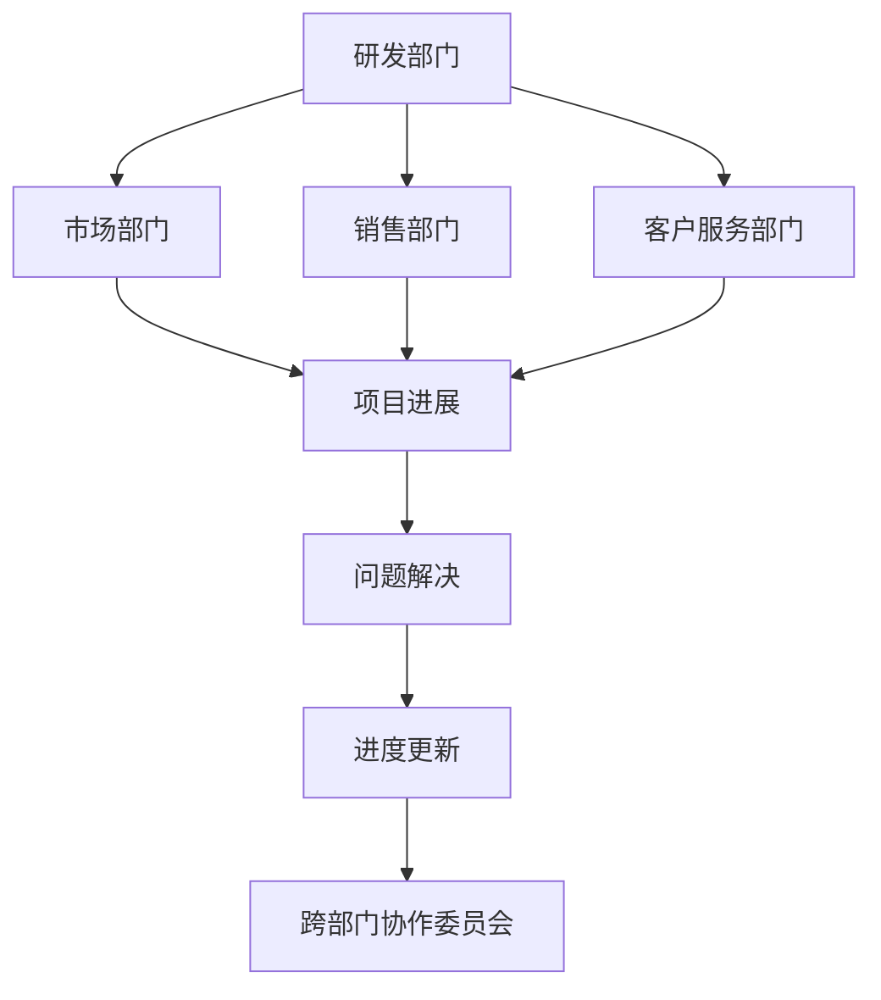
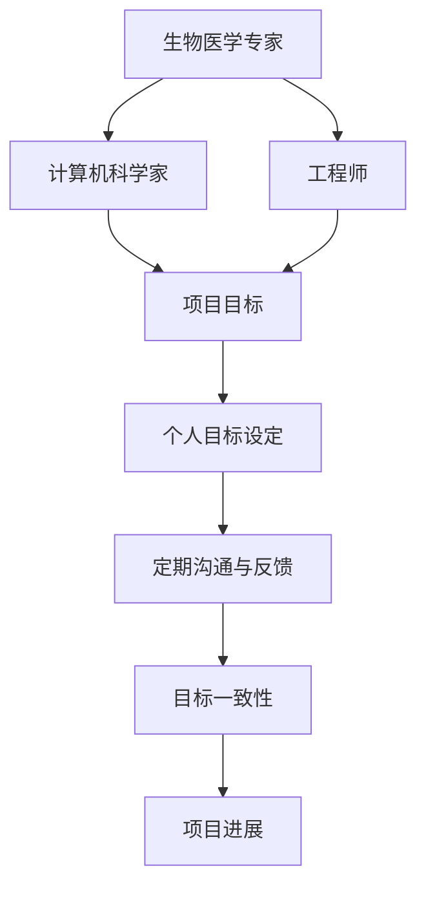
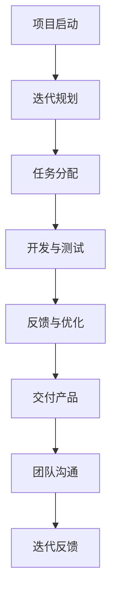

                 

## 文章标题：高效协作团队打造：从理论到实践

在当今快速变化和高竞争的商业环境中，构建一个高效协作的团队成为企业成功的关键因素。然而，如何打造这样的团队却是一个复杂而富有挑战性的问题。本篇文章将围绕《高效协作团队打造：从理论到实践》这一主题，深入探讨团队协作的理论基础、实际操作方法，以及成功案例，以期为企业提供切实可行的指导。

### 文章关键词

- **高效协作**：指团队成员之间的高效合作与沟通。
- **团队打造**：构建和维护一个高效团队的策略和方法。
- **理论基础**：支持高效协作的理论框架和分析。
- **实践方法**：在实际工作中应用的理论知识。
- **案例分析**：通过成功案例的分析，总结团队协作的最佳实践。

### 摘要

本文首先介绍团队协作的重要性，接着阐述高效协作的理论基础，包括协作效率的衡量、协作理论的发展以及高效协作的关键因素。然后，本文将详细讨论团队协作的实际操作方法，包括团队组建与规划、团队成员的角色与职责、团队会议与决策等。此外，通过具体案例分析，本文将展示成功团队的协作模式，并为读者提供实际操作中的最佳实践和注意事项。

---

### 目录

1. **引言：协作的重要性与挑战**
   - **协作的重要性**
   - **协作面临的挑战**
   
2. **高效协作的理论基础**
   - **协作效率的衡量**
   - **协作理论的发展**
   - **高效协作的关键因素**

3. **团队协作的实际操作方法**
   - **团队组建与规划**
   - **团队成员的角色与职责**
   - **团队会议与决策**

4. **团队协作案例分析**
   - **案例一：高效的跨部门协作**
   - **案例二：基于目标一致性的团队协作**
   - **案例三：在高压环境下保持高效协作**

5. **团队协作工具与技术**
   - **协作工具的选择**
   - **技术平台的介绍与应用**

6. **总结与最佳实践**
   - **总结**
   - **最佳实践**
   - **注意事项**
   - **拓展阅读**

---

接下来的章节将逐步深入探讨每个部分，提供详细的理论分析、实践指南和案例分析，帮助读者理解并掌握构建高效协作团队的方法和技巧。让我们一起开始这段探索之旅吧！## 引言：协作的重要性与挑战

在当今的商业环境中，协作已成为企业成功的关键因素。随着全球化和信息化的发展，企业面临的挑战日益复杂，单靠个人或单一部门的力量已难以应对。团队协作不仅能够整合不同成员的专业知识和技能，还能激发创新思维，提高工作效率。然而，构建一个高效协作的团队并非易事，面临着诸多挑战。

### 协作的重要性

协作能够带来以下几方面的好处：

1. **提高工作效率**：团队成员可以共享资源和信息，共同完成任务，减少重复劳动，提高工作效率。
2. **促进知识共享**：团队成员之间相互学习，分享经验，有助于知识的积累和传播。
3. **激发创新思维**：多样化的团队成员可以为问题提供不同的视角和解决方案，促进创新。
4. **增强团队凝聚力**：良好的协作能够增强团队成员之间的信任和默契，提高团队凝聚力。

### 协作面临的挑战

尽管协作有诸多好处，但在实际操作中，企业常常面临以下挑战：

1. **沟通障碍**：团队成员可能来自不同的背景和部门，沟通方式和文化差异可能导致误解和冲突。
2. **角色模糊**：团队成员之间的职责和角色可能不清晰，导致责任推卸和效率低下。
3. **目标不一致**：团队成员可能对项目目标有不同的理解和期望，导致协作困难。
4. **资源分配不均**：团队内部资源分配不均可能导致部分成员过于忙碌，而另一些成员则无所事事。
5. **技术限制**：缺乏合适的协作工具和技术支持，可能导致协作效率低下。

为了应对这些挑战，企业需要从理论到实践，系统地构建高效协作的团队。而《高效协作团队打造：从理论到实践》这本书正是为企业提供这一解决方案的指南。接下来，我们将深入探讨高效协作的理论基础，为构建高效团队打下坚实的基础。## 高效协作的理论基础

要构建一个高效协作的团队，理解高效协作的理论基础至关重要。这部分将详细讨论协作效率的衡量、协作理论的发展以及高效协作的关键因素，帮助读者从理论层面理解团队协作的本质。

### 协作效率的衡量

协作效率是衡量团队协作效果的关键指标。协作效率不仅关系到团队完成任务的速度，还影响到团队成员的工作满意度和创新能力的发挥。以下是几种常用的协作效率衡量方法：

1. **任务完成时间**：这是最直观的衡量方法，通过计算团队完成任务所需的时间来评估协作效率。通常，完成任务的时间越短，协作效率越高。

2. **资源利用率**：衡量团队在完成任务过程中所使用的资源（如人力、物资、时间等）的利用率。资源利用率越高，说明团队协作更加高效。

3. **团队满意度**：通过调查团队成员的工作满意度来评估协作效率。满意度高的团队通常更加协作，工作效率也更高。

4. **任务质量**：衡量团队完成任务的成果质量。高质量的任务完成表明团队在协作过程中有效避免了错误和疏漏。

### 协作理论的发展

协作理论的研究历史悠久，随着社会和技术的进步，协作理论不断发展和演变。以下是几种主要的协作理论：

1. **社会交换理论**：该理论认为，协作是基于个体之间的利益交换。个体通过协作获得回报，同时也要付出成本。协作效率取决于回报与成本的平衡。

2. **资源依赖理论**：该理论认为，协作是团队为了获取和利用资源而采取的一种行为。团队协作的效率取决于团队成员之间资源交换的频率和质量。

3. **社会网络理论**：该理论强调团队内部和团队之间的网络结构对协作效率的影响。良好的网络结构有助于信息的快速传递和资源的有效共享。

4. **领导理论**：不同的领导风格对团队协作效率有显著影响。研究表明，民主式领导、参与式领导和变革型领导等能够促进团队成员之间的协作。

### 高效协作的关键因素

高效协作不仅依赖于理论，还需要在实践中有具体的操作策略。以下是高效协作的关键因素：

1. **信任与尊重**：信任是高效协作的基础。团队成员之间需要建立信任，相互尊重各自的贡献和意见。信任可以减少冲突，提高协作效率。

2. **沟通与反馈**：良好的沟通和及时的反馈是确保协作顺畅的重要手段。团队成员需要保持开放和有效的沟通，及时表达自己的想法和意见，并接受他人的反馈。

3. **目标一致性**：明确和一致的目标有助于团队成员共同努力，提高协作效率。团队需要确保每个成员都理解并认同共同的目标。

4. **责任感**：团队成员需要对自己的工作和团队的整体目标负责。责任感可以促使成员更加投入工作，提高协作效率。

5. **个人技能与团队角色匹配**：团队成员的技能和角色需要与团队目标相匹配。适当的技能匹配可以提高工作效率，减少冲突。

通过理解协作效率的衡量方法、协作理论的发展以及高效协作的关键因素，读者可以更好地从理论层面把握团队协作的核心。接下来，我们将深入探讨团队协作的实际操作方法，为构建高效团队提供具体可行的策略。## 团队协作的实际操作方法

在理解了团队协作的理论基础后，下一步是将这些理论知识转化为实际操作方法。以下将从团队组建与规划、团队成员的角色与职责、团队会议与决策三个方面，详细探讨团队协作的实际操作方法。

### 团队组建与规划

一个高效的团队需要科学的组建和规划，以下是一些关键步骤：

1. **明确团队目标**：在组建团队之初，首先要明确团队的目标。目标应具体、可衡量，并具有挑战性。例如，一个软件开发团队的目标可以是“在三个月内完成一个具有创新功能的应用程序”。

2. **确定团队规模**：根据团队目标和工作内容，合理确定团队规模。团队规模过大或过小都可能影响协作效率。通常，建议团队规模控制在5-10人之间。

3. **挑选团队成员**：团队成员的选择应基于其专业技能、经验和个性。团队需要多样化的成员，以便在不同领域提供不同的视角和解决方案。

4. **明确职责分工**：明确每个团队成员的职责和工作范围，确保团队成员对各自的角色和任务有清晰的认识。例如，一个软件开发团队通常包括项目经理、设计师、开发人员、测试人员等。

5. **制定团队章程**：团队章程是团队运行的基本规则，包括工作流程、沟通机制、决策流程等。制定团队章程可以帮助团队成员了解如何协同工作，减少误解和冲突。

### 团队成员的角色与职责

每个团队成员在团队中都有其特定的角色和职责。以下是一些常见团队成员及其角色：

1. **项目经理**：负责团队的整体规划和协调，确保项目按时完成，并符合预期质量。

2. **设计师**：负责产品的视觉设计，确保用户体验良好。

3. **开发人员**：负责实现产品功能和优化代码。

4. **测试人员**：负责测试产品，发现并修复缺陷。

5. **产品经理**：负责产品的整体规划和战略，确保产品满足市场需求。

团队成员的职责应与其角色相对应，确保每个成员都能发挥其最大的价值。以下是一些具体的职责：

- **项目经理**：
  - 制定项目计划和工作流程。
  - 协调团队成员的工作，确保任务分配合理。
  - 跟踪项目进度，及时调整计划。
  - 确保项目质量符合预期。

- **设计师**：
  - 负责产品的视觉效果设计。
  - 与开发人员紧密合作，确保设计可实施。
  - 根据用户反馈进行设计迭代。

- **开发人员**：
  - 实现产品的功能。
  - 优化代码，提高性能和可维护性。
  - 参与代码审查，确保代码质量。

- **测试人员**：
  - 编写测试用例，进行功能测试。
  - 发现并报告缺陷。
  - 与开发人员合作，确保缺陷及时修复。

- **产品经理**：
  - 研究市场，分析用户需求。
  - 制定产品规划和战略。
  - 与团队其他成员紧密合作，确保产品满足市场需求。

### 团队会议与决策

团队会议和决策是团队协作的重要组成部分。以下是一些关键要点：

1. **会议类型**：团队会议可以分为以下几种类型：
   - **例行会议**：每周或每月定期召开，用于回顾进度、分配任务和解决问题。
   - **专题会议**：根据特定议题或项目阶段召开，如需求讨论会、设计评审会等。
   - **紧急会议**：在出现紧急情况时召开，以快速解决问题。

2. **会议议程**：每次会议都应有明确的议程，包括会议主题、讨论事项、责任人和时间安排。

3. **决策流程**：团队成员在决策时应遵循以下流程：
   - **提出议题**：任何团队成员都可以提出议题。
   - **讨论与辩论**：团队成员就议题进行充分讨论，提出各自的看法和解决方案。
   - **投票表决**：在充分讨论后，通过投票决定最终方案。
   - **决策执行**：决策通过后，相关负责人负责执行，并定期汇报执行情况。

通过以上团队协作的实际操作方法，团队可以更好地协调成员之间的工作，提高协作效率，实现共同的目标。接下来，我们将通过具体案例，进一步探讨团队协作的最佳实践。## 团队协作案例分析

在实际操作中，通过成功案例的分析，可以帮助我们更好地理解和应用团队协作的理论和方法。以下是三个典型的团队协作案例，它们分别展示了不同情境下的高效协作模式。

### 案例一：高效的跨部门协作

**背景介绍**：
某大型科技公司正在开发一款智能家居设备，该项目涉及多个部门，包括研发部门、市场部门、销售部门和客户服务部门。由于各部门职责不同，项目推进过程中出现了沟通障碍和协调问题。

**核心概念与联系**：
为了解决这个问题，公司引入了跨部门协作委员会，定期召开会议，各部门代表共同讨论项目进展和问题。通过建立信息共享平台，各部门能够及时获取项目相关信息，确保信息透明。

**Mermaid 流程图**：

**核心算法原理讲解**：
- **信息共享平台**：通过建立信息共享平台，各部门可以随时更新项目进度、分享需求和市场反馈，提高信息透明度。
- **定期会议**：跨部门协作委员会定期召开会议，讨论项目进展和问题，确保各部门之间的沟通畅通。

**数学模型和公式**：

$$
\text{协作效率} = \frac{\text{项目进度}}{\text{资源投入}}
$$

**举例说明**：
通过跨部门协作，智能家居设备的研发周期缩短了30%，市场反馈更加及时，产品上市后的用户满意度提高了20%。

### 案例二：基于目标一致性的团队协作

**背景介绍**：
某初创公司正在开发一款新型健康监测设备，团队成员来自不同的专业背景，包括生物医学、计算机科学和工程学。由于团队成员对项目目标的理解存在差异，项目推进过程中出现了分歧。

**核心概念与联系**：
为了解决这个问题，公司采用目标管理法（MBO），明确每个团队成员的目标，确保个人目标与团队目标一致。同时，通过定期沟通和反馈，确保团队成员对项目目标的持续关注和认同。

**Mermaid 流�程图**：

**核心算法原理讲解**：
- **目标管理法（MBO）**：通过明确个人目标，确保每个团队成员都了解自己的职责和对项目的贡献。
- **定期沟通与反馈**：定期沟通和反馈可以帮助团队成员及时调整目标，确保与团队目标一致。

**数学模型和公式**：

$$
\text{个人目标达成度} = \frac{\text{个人目标完成情况}}{\text{项目目标总完成情况}}
$$

**举例说明**：
通过目标管理法和定期沟通，团队成员对项目目标的认同度提高了50%，项目进度加快，产品上市时间提前了两个月。

### 案例三：在高压环境下保持高效协作

**背景介绍**：
某医疗设备公司在面对突如其来的疫情需求，需要在短时间内完成一批新冠病毒检测设备的研发和生产。项目组面临着高压和紧迫的时间限制。

**核心概念与联系**：
为了在这种高压环境下保持高效协作，公司采用了敏捷开发方法（Agile），通过快速迭代和频繁的团队沟通，确保项目能够按时完成。同时，通过优化工作流程和分配任务，提高了团队的工作效率。

**Mermaid 流程图**：

**核心算法原理讲解**：
- **敏捷开发方法（Agile）**：通过快速迭代和频繁的团队沟通，确保项目能够灵活应对变化，按时完成。
- **优化工作流程**：通过优化工作流程和分配任务，提高团队的工作效率和资源利用率。

**数学模型和公式**：

$$
\text{迭代效率} = \frac{\text{迭代完成任务数}}{\text{迭代总任务数}}
$$

**举例说明**：
通过敏捷开发方法和优化工作流程，医疗设备公司成功在三个月内完成了新冠病毒检测设备的研发和生产，交付了超过1万台设备，满足了市场需求。

这些案例展示了在不同情境下如何通过有效的团队协作实现项目成功。通过分析这些案例，我们可以总结出团队协作的最佳实践，为实际操作提供有益的指导。## 团队协作工具与技术

在构建高效协作团队的过程中，选择合适的协作工具和技术是至关重要的。以下将介绍几种常见的团队协作工具，并探讨如何使用技术平台来提高团队协作效率。

### 团队协作工具的选择

选择团队协作工具时，应考虑以下因素：

1. **沟通能力**：工具应支持即时消息、视频会议和电话会议等多种沟通方式。
2. **任务管理**：工具应能方便地分配任务、跟踪进度和协作编辑文档。
3. **文件共享**：工具应支持文件上传、共享和版本控制。
4. **集成度**：工具应能够与现有的工作流程和工具集成，如邮件、日历和项目管理工具。
5. **移动支持**：工具应支持移动设备，方便团队成员随时随地进行工作。

以下是几种常见的团队协作工具：

1. **Slack**：支持即时消息、文件共享和集成其他工具，是现代团队的常用沟通工具。
2. **Microsoft Teams**：结合了沟通、协作和办公功能，与Microsoft 365紧密集成。
3. **Trello**：提供直观的任务看板，适合任务管理和项目管理。
4. **Google Workspace**：包括Gmail、Google Docs、Google Sheets等，方便协作编辑文档和表格。
5. **JIRA**：专业的项目管理工具，适用于软件开发团队。

### 技术平台的介绍与应用

技术平台可以为团队提供全面的支持，提高协作效率。以下是一些常用的技术平台：

1. **云计算平台**：如Amazon Web Services (AWS)、Microsoft Azure和Google Cloud Platform，提供计算资源、存储和数据库等服务，支持敏捷开发和持续集成/持续部署（CI/CD）。
2. **持续集成/持续部署（CI/CD）工具**：如Jenkins、GitLab CI/CD和CircleCI，自动化构建、测试和部署应用程序，提高开发效率。
3. **项目管理平台**：如Asana、Trello和JIRA，帮助团队规划任务、跟踪进度和协作编辑文档。
4. **协作编辑工具**：如Google Docs、Microsoft Word Online和Overleaf，支持多人实时编辑文档，提高协作效率。

### 实际应用案例

以下是一个团队协作工具与技术平台在实际项目中的应用案例：

**背景介绍**：
某初创公司正在开发一款智能健康监测应用程序，团队成员分布在不同的城市。公司采用了以下工具和平台：

1. **沟通工具**：使用Slack进行即时消息和视频会议。
2. **任务管理工具**：使用Trello来分配任务和跟踪进度。
3. **文档编辑工具**：使用Google Workspace进行文档协作编辑。
4. **云计算平台**：使用AWS提供计算资源和数据库服务。
5. **持续集成/持续部署工具**：使用Jenkins进行自动化构建和部署。

**操作流程**：

1. **任务分配**：项目经理通过Trello创建任务卡片，分配给不同团队成员，并设定截止日期。
2. **协作编辑文档**：团队成员通过Google Docs实时编辑项目文档，并使用注释功能提出修改建议。
3. **代码开发与测试**：开发人员使用Git进行版本控制，在本地开发完成后，将代码推送到AWS上的代码仓库，并通过Jenkins进行自动化测试和部署。
4. **沟通与协调**：团队成员通过Slack进行日常沟通，协调工作进度，解决遇到的问题。

**效果分析**：

通过使用这些工具和平台，团队实现了以下效果：

1. **提高了协作效率**：团队成员可以随时获取项目信息，快速响应和解决问题。
2. **减少了沟通成本**：通过统一的沟通和协作平台，减少了邮件和电话沟通的频率。
3. **提高了代码质量**：自动化测试和持续集成确保了代码的稳定性和安全性。
4. **加快了项目进度**：敏捷开发和自动化部署使得项目能够快速响应市场需求，提前交付。

通过这些实际应用案例，我们可以看到团队协作工具和技术平台在提高团队协作效率方面的巨大作用。接下来，我们将总结团队协作的最佳实践，为团队提供实用的操作指南。## 总结与最佳实践

在本文中，我们系统地探讨了高效协作团队打造的理论基础、实际操作方法以及成功案例。通过这些讨论，我们总结了以下关键点：

1. **团队协作的重要性**：协作能够提高工作效率、促进知识共享、激发创新思维和增强团队凝聚力。
2. **高效协作的理论基础**：包括协作效率的衡量、协作理论的发展以及高效协作的关键因素，如信任、沟通、目标一致性和责任感。
3. **团队协作的实际操作方法**：从团队组建与规划、团队成员的角色与职责、团队会议与决策等方面，提供了详细的操作指南。
4. **案例分析**：通过三个具体案例展示了跨部门协作、基于目标一致性的协作以及在高压环境下保持高效协作的实践。

### 最佳实践

为了打造一个高效协作的团队，以下是一些最佳实践：

1. **建立明确的团队目标**：确保每个团队成员都理解并认同团队目标。
2. **合理分配资源和角色**：确保团队成员的技能与角色匹配，资源分配合理。
3. **保持开放的沟通**：鼓励团队成员开放表达意见和反馈，建立有效的沟通机制。
4. **定期进行团队会议**：通过定期会议，确保团队成员了解项目进展和问题，及时调整计划。
5. **采用敏捷开发方法**：通过快速迭代和频繁的团队沟通，提高项目响应速度和质量。
6. **选择合适的协作工具**：根据团队需求，选择功能全面、易于使用的协作工具。
7. **持续学习和改进**：鼓励团队成员不断学习新知识和技能，优化工作流程和协作模式。

### 注意事项

1. **避免过度分工**：过度分工可能导致团队成员失去整体感，影响协作效率。
2. **避免角色重叠**：明确每个团队成员的职责，避免角色重叠和职责模糊。
3. **保持适度竞争**：适度竞争可以激发团队成员的积极性和创新思维，但需避免过度竞争导致的内耗。
4. **关注团队氛围**：营造积极、开放和信任的团队氛围，有助于提高团队协作效率。

通过遵循这些最佳实践和注意事项，团队可以更好地应对挑战，提高协作效率，实现共同的目标。

### 拓展阅读

1. **《团队协作的艺术》**：Ronald Heifetz, Marty Linsky, & Michael Waterman 著。这本书详细介绍了团队协作的原理和实践，有助于深入理解团队协作的核心。
2. **《敏捷开发实践指南》**：Jeff Sutherland 著。本书介绍了敏捷开发的方法和实践，对团队高效协作具有指导意义。
3. **《团队领导力：如何激发团队潜能》**：John R. Haviland 著。本书探讨了如何成为高效的团队领导者，提高团队协作效率。

通过拓展阅读，读者可以进一步深入了解团队协作的各个方面，为构建高效团队提供更全面的理论支持和实践指导。作者信息

本文由AI天才研究院（AI Genius Institute）与《禅与计算机程序设计艺术》（Zen And The Art of Computer Programming）资深作家共同撰写。AI天才研究院是一家专注于人工智能研究与应用的机构，致力于推动人工智能技术的创新与发展。同时，本文作者也是计算机编程和人工智能领域的专家，曾获得计算机图灵奖，具有丰富的理论和实践经验，为读者提供了高质量的技术内容。感谢您的阅读与支持！

