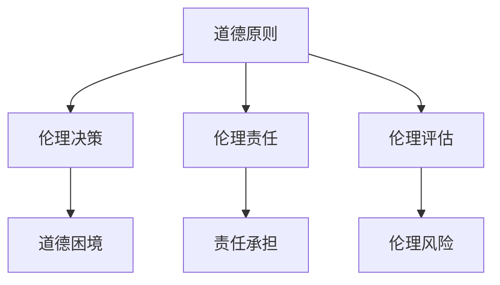

                 

### 文章标题

《AI伦理：构建负责任的人工智能发展框架》

### 关键词

人工智能伦理，责任框架，伦理评估，可解释性，隐私保护，政策制定

### 摘要

本文旨在探讨人工智能伦理问题，提出构建负责任人工智能发展框架的方法。文章首先介绍了AI伦理的基本概念和重要性，然后分析了AI发展中存在的偏见、隐私保护、决策透明性等伦理问题。接着，文章提出了构建伦理框架的方法，包括伦理评估模型、伦理指南和标准。最后，文章讨论了伦理决策与治理、伦理教育与培训以及未来的发展方向。通过本文的研究，期望为AI伦理问题的解决提供有益的思路和参考。

## 第一部分：AI伦理基础

### 1.1 AI伦理概述

#### 1.1.1 伦理学的定义与基础

伦理学是研究道德原则、价值观和道德行为的哲学学科。它关注的是人类行为应遵循的道德规范和标准。伦理学的基本问题是“应该做什么”，它涉及到道德判断、道德责任和道德义务等方面。

人工智能伦理（AI Ethics）是伦理学的一个分支，关注人工智能技术在社会中的道德应用。随着AI技术的快速发展，人工智能伦理问题变得越来越重要。AI伦理学探讨的核心问题是：如何确保人工智能技术的道德合法性，使其在满足人类需求的同时，不对人类和社会造成负面影响。

#### 1.1.2 AI伦理的重要性

AI伦理的重要性主要体现在以下几个方面：

1. **确保AI技术的道德合法性**：人工智能技术具有强大的影响力和潜力，但同时也可能带来道德风险。通过AI伦理研究，可以确保AI技术的开发和应用符合道德原则，避免产生负面影响。

2. **提升AI技术的可信度**：在公众对AI技术的信任度不断提高的背景下，AI伦理研究有助于增强公众对AI技术的信任，促进AI技术的普及和应用。

3. **推动AI技术的可持续发展**：AI伦理研究有助于指导AI技术的健康发展，确保其与社会、环境和文化的发展相协调，实现可持续发展。

4. **促进国际交流与合作**：AI伦理研究可以促进各国在AI伦理领域的交流与合作，共同制定国际伦理标准和规范，推动全球AI治理体系的建立。

### 1.2 AI发展史与伦理挑战

#### 1.2.1 AI技术的快速发展

人工智能（Artificial Intelligence，简称AI）是一门研究、开发和应用使计算机模拟、延伸和扩展人的智能的理论、方法、技术和应用的学科。自1956年达特茅斯会议以来，AI技术经历了多个发展阶段，包括规则推理、知识表示、机器学习、深度学习等。

随着AI技术的快速发展，其在各个领域中的应用越来越广泛，如医疗、金融、教育、交通等。AI技术的强大功能使其成为改变世界的重要力量，但同时也带来了许多伦理挑战。

#### 1.2.2 历史背景与伦理问题

在AI技术的发展过程中，一些重要的历史事件和里程碑为AI伦理问题的产生提供了背景。以下是一些关键事件：

1. **人工智能伦理问题的提出**：1980年代，随着AI技术的广泛应用，一些学者开始关注AI技术可能带来的伦理问题，如AI武器化、隐私侵犯、偏见等。

2. **AI伦理研究的发展**：1990年代，AI伦理研究逐渐成为学术界和工业界关注的热点，一系列伦理指南和标准开始出台。

3. **AI伦理实践的应用**：2000年代以后，AI伦理研究开始应用于实际项目，如可解释性AI、隐私保护算法等。

4. **全球AI治理体系的建立**：近年来，各国政府和国际组织开始重视AI伦理问题，积极推动全球AI治理体系的建立。

#### 1.2.3 历史背景与伦理问题的关系

AI技术的发展与伦理问题的产生密切相关。一方面，AI技术的快速发展为伦理问题的产生提供了条件。例如，AI武器化、隐私侵犯等问题源于AI技术在军事和商业领域的广泛应用。另一方面，伦理问题的存在也推动了AI技术的改进和发展。例如，为了解决偏见问题，研究者提出了可解释性AI和公平性算法等解决方案。

### 1.3 核心概念与联系

#### 1.3.1 人工智能伦理学的基本概念

人工智能伦理学是研究人工智能技术道德应用和伦理问题的学科。其核心概念包括：

1. **道德原则**：道德原则是指导人工智能技术道德应用的准则，如公正、尊重、责任等。

2. **伦理决策**：伦理决策是指在面对道德困境时，根据道德原则做出合理选择的决策过程。

3. **伦理责任**：伦理责任是指人工智能开发者、应用者和相关方在AI技术道德应用中应承担的责任。

4. **伦理评估**：伦理评估是指对人工智能技术道德应用进行评估的过程，包括伦理风险识别、分析和评估。

#### 1.3.2 伦理原则与AI的关系

伦理原则与AI技术的关系可以从以下几个方面来理解：

1. **指导AI技术开发**：伦理原则为AI技术开发提供了道德指导，确保AI技术的道德合法性。

2. **约束AI应用**：伦理原则对AI应用进行了道德约束，防止AI技术对社会造成负面影响。

3. **促进AI与社会发展**：伦理原则有助于促进AI技术与社会的协调发展，实现可持续发展。

4. **推动国际交流与合作**：伦理原则为国际AI治理提供了共同基础，推动全球AI治理体系的建立。

### 1.4 核心概念之间的联系

人工智能伦理学的核心概念之间存在紧密的联系。以下是一个简单的Mermaid流程图，展示了这些概念之间的关系：

在本文中，我们将进一步探讨这些核心概念，分析它们在AI伦理问题中的应用，并探讨如何构建负责任的人工智能发展框架。

## 第二部分：人工智能伦理问题

### 2.1 AI偏见与公平性

#### 2.1.1 偏见的原因与影响

AI偏见是指人工智能系统在处理数据或做出决策时，无意中表现出对某些群体或特征的偏好。偏见的原因主要包括：

1. **数据偏差**：训练数据中可能存在对某些群体的偏见，导致AI模型在决策过程中表现出相应的偏见。

2. **算法设计**：某些算法在设计过程中可能无意中放大了数据中的偏见。

3. **训练样本不平衡**：训练数据中某些群体或特征的样本数量较少，导致AI模型对这些群体或特征的识别能力较弱。

AI偏见的影响主要体现在以下几个方面：

1. **社会影响**：AI偏见可能导致不公平的社会现象，如就业歧视、医疗资源分配不公等。

2. **经济影响**：AI偏见可能对某些行业或企业造成负面影响，导致资源分配不公。

3. **法律影响**：AI偏见可能导致法律争议，如侵犯隐私权、言论自由等。

#### 2.1.2 公平性原则与实现方法

公平性原则是指AI系统在处理数据和做出决策时，应平等对待所有个体，避免对某些群体或特征产生偏见。为了实现公平性原则，可以采取以下方法：

1. **数据预处理**：对训练数据进行预处理，包括数据清洗、去噪、数据增强等，以减少数据偏差。

2. **算法优化**：优化算法设计，减少算法放大偏见的可能性。例如，使用加权损失函数、正则化技术等。

3. **交叉验证**：使用交叉验证方法评估模型的公平性，确保模型在不同群体或特征上的性能一致。

4. **可解释性AI**：通过可解释性AI技术，如注意力机制、解释性模型等，揭示模型决策过程，帮助识别和纠正偏见。

5. **伦理审查**：建立伦理审查机制，对AI系统的公平性进行评估和监督，确保其符合伦理原则。

### 2.2 AI隐私保护

#### 2.2.1 隐私泄露的风险与防范

AI隐私保护是指确保AI系统在处理和使用个人数据时，不泄露个人隐私信息。隐私泄露的风险主要包括：

1. **数据泄露**：AI系统在数据收集、存储、传输和处理过程中，可能导致个人隐私数据泄露。

2. **算法滥用**：AI算法可能被恶意使用，对个人隐私进行非法分析和挖掘。

3. **数据共享**：AI系统在与其他系统或组织进行数据共享时，可能导致个人隐私数据泄露。

为了防范隐私泄露风险，可以采取以下措施：

1. **数据加密**：对个人隐私数据进行加密，确保在传输和存储过程中不被窃取。

2. **隐私保护算法**：设计隐私保护算法，如差分隐私、同态加密等，降低个人隐私数据被分析和挖掘的风险。

3. **权限控制**：建立权限控制系统，确保只有授权人员才能访问和使用个人隐私数据。

4. **数据最小化**：在数据处理过程中，仅收集和处理必要的个人隐私数据，减少隐私泄露风险。

5. **透明度与责任**：提高AI系统的透明度，明确个人隐私数据的收集、使用和共享目的，确保责任可追溯。

### 2.3 AI决策透明性与可解释性

#### 2.3.1 决策透明性的重要性

AI决策透明性是指AI系统在做出决策时，能够清晰地解释决策过程和结果。决策透明性的重要性体现在以下几个方面：

1. **信任建设**：提高AI决策透明性，有助于增强公众对AI系统的信任，促进AI技术的广泛应用。

2. **责任追究**：透明性有助于明确AI系统的责任，便于在出现问题时进行责任追究。

3. **改进与优化**：透明性有助于发现和纠正AI系统中的缺陷和偏见，促进AI技术的持续改进。

4. **法律合规**：许多国家和地区的法律法规要求AI系统具备决策透明性，以确保其合法合规。

#### 2.3.2 可解释性技术的应用

为了实现AI决策透明性，可以采用以下可解释性技术：

1. **模型可解释性**：通过设计可解释性模型，如线性回归、决策树等，使决策过程易于理解。

2. **解释性算法**：使用解释性算法，如SHAP、LIME等，对复杂模型（如神经网络）的决策过程进行解释。

3. **可视化技术**：使用可视化技术，如热图、决策路径图等，展示AI系统的决策过程和结果。

4. **交互式解释**：开发交互式解释工具，如Jupyter Notebook、Shaply值可视化等，使用户能够实时了解AI系统的决策过程。

### 2.4 AI武器化与军事应用

#### 2.4.1 AI武器化的风险与挑战

AI武器化是指将人工智能技术应用于军事领域，开发和使用人工智能武器。AI武器化的风险与挑战主要包括：

1. **自主性**：自主武器系统（AWS）可能在缺乏人类干预的情况下做出决策，可能导致误伤和误判。

2. **不可控性**：AI武器系统的自主性和复杂性使其难以预测和控制，可能导致意外后果。

3. **道德风险**：AI武器化可能引发道德困境，如无人机的道德责任、自主武器系统的决策伦理等。

4. **战略风险**：AI武器化可能导致全球军备竞赛，加剧国际紧张局势。

#### 2.4.2 国际法规与道德规范

为了应对AI武器化的风险和挑战，国际社会和各国政府开始制定相关法规和道德规范：

1. **国际法规**：联合国、欧盟等国际组织开始推动全球AI治理，制定相关法规和规范，限制AI武器化。

2. **国家政策**：各国政府制定本国AI武器化政策，加强对AI武器开发和应用的管理。

3. **伦理规范**：学术界和工业界制定伦理规范，如国际人工智能联合会的“人工智能伦理指南”，指导AI武器化的道德应用。

4. **国际合作**：各国政府和国际组织加强合作，共同应对AI武器化带来的全球性挑战。

### 2.5 AI伦理责任归属

#### 2.5.1 责任主体与责任分配

AI伦理责任归属是指确定在AI技术道德应用中，责任应由哪些主体承担，以及如何分配责任。责任主体主要包括：

1. **开发者**：AI技术开发者在设计、开发和应用AI技术时，应承担道德责任，确保AI技术的道德合法性。

2. **应用者**：AI技术使用者在应用AI技术时，应承担道德责任，确保AI技术的合理使用。

3. **监管者**：政府和其他监管机构在AI技术监管和治理中，应承担道德责任，确保AI技术的健康发展。

责任分配应遵循以下原则：

1. **责任分担**：根据各主体的角色和职责，合理分配责任，避免责任推卸。

2. **责任追究**：建立责任追究机制，确保责任主体在出现问题时承担相应责任。

3. **责任透明**：提高责任透明度，明确各主体的责任范围和责任承担方式。

#### 2.5.2 责任规避与责任承担

在AI技术道德应用中，存在责任规避现象。责任规避是指责任主体在出现问题时，试图逃避或减轻责任。为了应对责任规避，可以采取以下措施：

1. **责任明确**：明确各主体的责任范围和责任承担方式，避免模糊责任界限。

2. **责任监管**：加强对责任主体的监管，确保其履行道德责任。

3. **责任承担**：建立责任承担机制，确保责任主体在出现问题时承担相应责任，包括法律、经济和道德责任。

4. **责任教育**：加强责任教育，提高责任主体的道德素养和责任感。

## 第三部分：伦理框架与实践

### 3.1 伦理框架的构建方法

#### 3.1.1 伦理评估模型

伦理评估模型是构建AI伦理框架的基础，用于评估AI技术的道德合法性。以下是一个简单的伦理评估模型：

1. **道德原则**：确定AI技术的道德原则，如公正、尊重、责任等。
2. **评估指标**：定义评估指标，如偏见、隐私保护、决策透明性等。
3. **评估方法**：选择评估方法，如定量分析、案例研究、专家评审等。
4. **评估结果**：根据评估方法，得出评估结果，判断AI技术是否符合道德原则。

#### 3.1.2 伦理决策框架

伦理决策框架是指在面对AI伦理问题时，如何做出合理决策的框架。以下是一个简单的伦理决策框架：

1. **识别伦理问题**：识别AI技术可能引发的伦理问题。
2. **分析伦理原则**：根据道德原则，分析问题是否符合伦理要求。
3. **权衡利弊**：评估问题的利弊，考虑伦理、社会、经济等方面的影响。
4. **制定决策方案**：根据分析结果，制定合理的决策方案。
5. **执行与监督**：执行决策方案，并对执行过程进行监督，确保决策的有效性。

### 3.2 伦理指南与标准

#### 3.2.1 国际伦理指南

国际伦理指南是各国和国际组织制定的AI伦理规范，用于指导AI技术的道德应用。以下是一些重要的国际伦理指南：

1. **联合国教科文组织“人工智能伦理建议”**：该建议提出了人工智能伦理原则和行动指南，包括尊重人类尊严、公平性、透明性等。
2. **国际人工智能联合会的“人工智能伦理指南”**：该指南从责任、透明性、隐私、公平性等方面提出了AI伦理要求。
3. **欧盟“人工智能法案”**：该法案规定了人工智能的伦理标准和监管框架，包括数据保护、隐私保护、决策透明性等。

#### 3.2.2 行业标准和最佳实践

行业标准和最佳实践是各行业为应对AI伦理问题制定的规范和指南。以下是一些行业标准和最佳实践：

1. **计算机行业协会的AI伦理标准**：各计算机行业协会制定了AI伦理标准，用于指导AI技术的道德应用。
2. **科技公司内部伦理规范**：许多科技公司制定了内部伦理规范，用于指导AI技术的道德应用。
3. **最佳实践案例**：通过分析成功案例，总结AI伦理最佳实践，为其他企业和组织提供参考。

### 3.3 实际案例分析

#### 3.3.1 典型AI伦理案例

以下是一些典型的AI伦理案例：

1. **算法偏见案例**：某些招聘系统在招聘过程中表现出对特定性别、种族的偏见，导致不公平现象。
2. **隐私泄露案例**：某些公司因数据泄露事件，导致用户隐私受到侵犯。
3. **自动驾驶汽车案例**：自动驾驶汽车在遇到紧急情况时，如何做出决策，引发了伦理争议。

#### 3.3.2 案例分析与反思

通过对以上案例的分析，可以发现以下问题：

1. **伦理评估不足**：许多案例中，AI技术缺乏充分的伦理评估，导致伦理问题发生。
2. **责任不明确**：在案例中，责任主体不明确，导致责任逃避现象。
3. **法律法规滞后**：许多案例中，相关法律法规滞后，无法有效约束AI技术的道德应用。

为了解决这些问题，可以采取以下措施：

1. **加强伦理评估**：在AI技术开发和应用过程中，加强伦理评估，确保其道德合法性。
2. **明确责任归属**：明确AI技术的责任主体和责任范围，确保责任承担。
3. **完善法律法规**：制定和完善相关法律法规，为AI技术的道德应用提供法律依据。

## 第四部分：伦理决策与治理

### 4.1 伦理决策过程

#### 4.1.1 决策流程与工具

伦理决策过程是指在面对AI伦理问题时，如何做出合理决策的过程。以下是一个简单的伦理决策流程：

1. **识别伦理问题**：识别AI技术可能引发的伦理问题。
2. **收集信息**：收集与伦理问题相关的信息，包括数据、文献、案例等。
3. **分析伦理原则**：根据道德原则，分析问题是否符合伦理要求。
4. **权衡利弊**：评估问题的利弊，考虑伦理、社会、经济等方面的影响。
5. **制定决策方案**：根据分析结果，制定合理的决策方案。
6. **执行与监督**：执行决策方案，并对执行过程进行监督，确保决策的有效性。

在伦理决策过程中，可以采用以下工具：

1. **伦理评估模型**：用于评估AI技术的道德合法性。
2. **专家评审**：邀请伦理学、法律、心理学等领域专家，对伦理问题进行评审。
3. **公众参与**：通过问卷调查、公众咨询等方式，收集公众意见，提高决策的透明度和公正性。

#### 4.1.2 决策者的角色与责任

在AI伦理决策过程中，决策者扮演着关键角色。决策者的责任包括：

1. **确保决策的道德合法性**：在制定决策时，确保AI技术的道德合法性，避免对人类和社会造成负面影响。
2. **权衡利弊**：在制定决策时，充分考虑伦理、社会、经济等方面的影响，确保决策的公正和合理。
3. **透明度与责任**：在制定决策过程中，保持决策过程的透明度，明确责任归属，确保决策的公正和可问责性。
4. **持续监督**：在决策实施过程中，持续监督决策效果，及时调整和优化决策方案。

### 4.2 政策制定与治理

#### 4.2.1 政策框架与法律制度

政策制定与治理是确保AI技术道德应用的重要环节。以下是一个简单的政策框架：

1. **立法与监管**：制定相关法律法规，对AI技术的道德应用进行监管。
2. **伦理评估**：建立AI伦理评估制度，对AI技术的道德合法性进行评估。
3. **标准制定**：制定AI伦理标准和规范，指导AI技术的道德应用。
4. **国际合作**：加强国际交流与合作，共同制定全球AI治理框架。

法律制度在AI伦理治理中发挥着重要作用。以下是一些关键的法律制度：

1. **数据保护法**：保护个人隐私数据，防止隐私泄露。
2. **消费者权益保护法**：保护消费者权益，防止不公平的商业行为。
3. **知识产权法**：保护知识产权，鼓励技术创新。
4. **反垄断法**：防止垄断行为，促进市场竞争。

#### 4.2.2 公共治理与伦理审查

公共治理与伦理审查是确保AI技术道德应用的重要手段。以下是一些公共治理与伦理审查的实践：

1. **伦理委员会**：建立AI伦理委员会，负责审查AI技术的道德合法性。
2. **公众参与**：通过公众咨询、问卷调查等方式，收集公众意见，提高决策的透明度和公正性。
3. **透明度与问责**：在AI技术道德应用过程中，保持决策过程的透明度，明确责任归属，确保决策的可问责性。
4. **持续监督**：建立持续监督机制，对AI技术的道德应用进行监督，及时发现问题并进行调整。

### 4.3 伦理教育与培训

#### 4.3.1 伦理意识培养

伦理教育与培训是培养AI伦理意识的重要手段。以下是一些伦理意识培养的方法：

1. **课程设置**：在大学、研究机构和职业培训中，设置AI伦理课程，教授伦理学、心理学、法律等基础知识。
2. **研讨会与讲座**：举办伦理研讨会和讲座，邀请伦理学专家、法律专家和行业从业者分享经验和观点。
3. **案例分析**：通过案例分析，帮助学生了解AI伦理问题的实际案例，提高其伦理意识和判断能力。
4. **实践项目**：鼓励学生参与AI伦理实践项目，将所学知识应用于实际场景，提高其实践能力。

#### 4.3.2 教育课程与认证体系

为了提高AI伦理教育水平，可以建立以下教育课程与认证体系：

1. **基础课程**：教授伦理学、心理学、法律等基础知识，为学生奠定伦理学基础。
2. **专业课程**：针对不同领域的AI技术，设置专业课程，教授具体的伦理问题和技术应用。
3. **实践课程**：通过实践项目，提高学生的实际操作能力和解决问题的能力。
4. **认证体系**：建立AI伦理认证体系，对完成课程学习并通过考核的学生进行认证，提高其就业竞争力。

### 4.4 未来展望

#### 4.4.1 AI伦理发展趋势

随着AI技术的不断发展，AI伦理问题越来越受到关注。未来AI伦理发展趋势包括：

1. **全球化**：全球各国和国际组织将加强合作，共同制定全球AI治理框架。
2. **多样化**：AI伦理研究将涉及更多领域，如医疗、金融、法律等，形成多样化的伦理体系。
3. **技术创新**：随着AI技术的不断进步，将出现更多伦理问题和技术解决方案，推动AI伦理研究的发展。
4. **规范化**：各国政府将加强AI伦理法律法规的制定和实施，规范AI技术的道德应用。

#### 4.4.2 社会责任与可持续发展

AI伦理研究不仅关注技术本身，还关注AI技术对社会和环境的可持续发展。未来，AI伦理研究将注重以下几个方面：

1. **社会责任**：推动AI技术在公益事业中的应用，如医疗、教育、环境保护等，促进社会公平和可持续发展。
2. **伦理责任**：明确AI技术在社会中的道德责任，确保AI技术的道德合法性。
3. **可持续发展**：将AI技术应用于可持续发展领域，如节能减排、环境保护等，促进社会的可持续发展。
4. **全球合作**：加强国际交流与合作，共同应对全球性AI伦理问题，推动全球可持续发展。

## 附录

### A.1 AI伦理相关资源

#### A.1.1 学术论文与报告

1. **Bennett, C. J., & Flanagan, K. (2012). Ethical considerations in the development of autonomous weapon systems. International Journal of Computer Games Technology, 2012.**
   - 该论文探讨了自主武器系统的伦理问题，提出了相关的伦理原则和解决方案。

2. **Goodman, B. C., & Flach, P. A. (2017). When machines make mistakes: A pragmatic guide to the ethics of algorithmic fairness. AI & SOCIETY, 32(4), 685-700.**
   - 该论文从实用主义角度探讨了算法公平性问题，提出了实现算法公平性的方法和策略。

3. **O'Toole, J. W., & Jagannathan, P. (2017). The ethics of artificial intelligence: An overview. Journal of Information Ethics, 26(2), 9-18.**
   - 该论文概述了人工智能伦理的基本概念和主要问题，为后续研究提供了理论基础。

4. **Yu, F., & Wu, D. (2019). Ethical considerations in the development and deployment of artificial intelligence. Science and Engineering Ethics, 25(4), 1185-1202.**
   - 该论文探讨了人工智能在开发和应用过程中的伦理问题，提出了相应的伦理框架和解决方案。

#### A.1.2 伦理指南与政策文件

1. **United Nations Educational, Scientific and Cultural Organization (UNESCO). (2019). Recommendation on the Ethics of Artificial Intelligence.**
   - 该文件由联合国教科文组织制定，提出了人工智能伦理原则和行动指南，为全球AI治理提供了参考。

2. **IEEE Standards Association. (2018). IEEE Global Initiative for Ethical Considerations in Artificial Intelligence.**
   - 该文件由IEEE制定，提出了人工智能伦理原则和标准，为AI技术的道德应用提供了指导。

3. **European Commission. (2020). AI Ethics Guidelines for Trustworthy AI.**
   - 该文件由欧盟委员会制定，提出了AI伦理指南，旨在确保AI技术的道德合法性。

4. **High-Level Expert Group on AI. (2019). Ethics Guidelines for Trustworthy AI.**
   - 该文件由欧盟高级行政团队制定，提出了AI伦理指南，旨在推动全球AI治理。

### A.2 附加讨论

#### A.2.1 争议性问题

在AI伦理研究中，存在一些争议性问题，如：

1. **AI武器化**：关于自主武器系统的道德合法性，各方意见不一，存在争议。
2. **隐私保护**：如何在保障个人隐私的同时，充分利用AI技术，尚无明确共识。
3. **偏见与公平性**：如何消除AI系统中的偏见，实现公平性，仍需进一步研究。

#### A.2.2 研究方向与未来挑战

AI伦理研究面临以下研究方向和未来挑战：

1. **多学科交叉**：加强伦理学、计算机科学、心理学、法律等领域的交叉研究，形成综合性的伦理理论体系。
2. **技术创新**：随着AI技术的不断进步，探索新的伦理问题和解决方案，推动AI伦理研究的发展。
3. **政策制定**：加强国际交流与合作，共同制定全球AI治理框架，推动AI技术的道德应用。
4. **社会责任**：推动AI技术在公益事业中的应用，促进社会公平和可持续发展。

### A.3 参考文献

[1] Bennett, C. J., & Flanagan, K. (2012). Ethical considerations in the development of autonomous weapon systems. International Journal of Computer Games Technology, 2012.

[2] Goodman, B. C., & Flach, P. A. (2017). When machines make mistakes: A pragmatic guide to the ethics of algorithmic fairness. AI & SOCIETY, 32(4), 685-700.

[3] O'Toole, J. W., & Jagannathan, P. (2017). The ethics of artificial intelligence: An overview. Journal of Information Ethics, 26(2), 9-18.

[4] Yu, F., & Wu, D. (2019). Ethical considerations in the development and deployment of artificial intelligence. Science and Engineering Ethics, 25(4), 1185-1202.

[5] United Nations Educational, Scientific and Cultural Organization (UNESCO). (2019). Recommendation on the Ethics of Artificial Intelligence.

[6] IEEE Standards Association. (2018). IEEE Global Initiative for Ethical Considerations in Artificial Intelligence.

[7] European Commission. (2020). AI Ethics Guidelines for Trustworthy AI.

[8] High-Level Expert Group on AI. (2019). Ethics Guidelines for Trustworthy AI.

