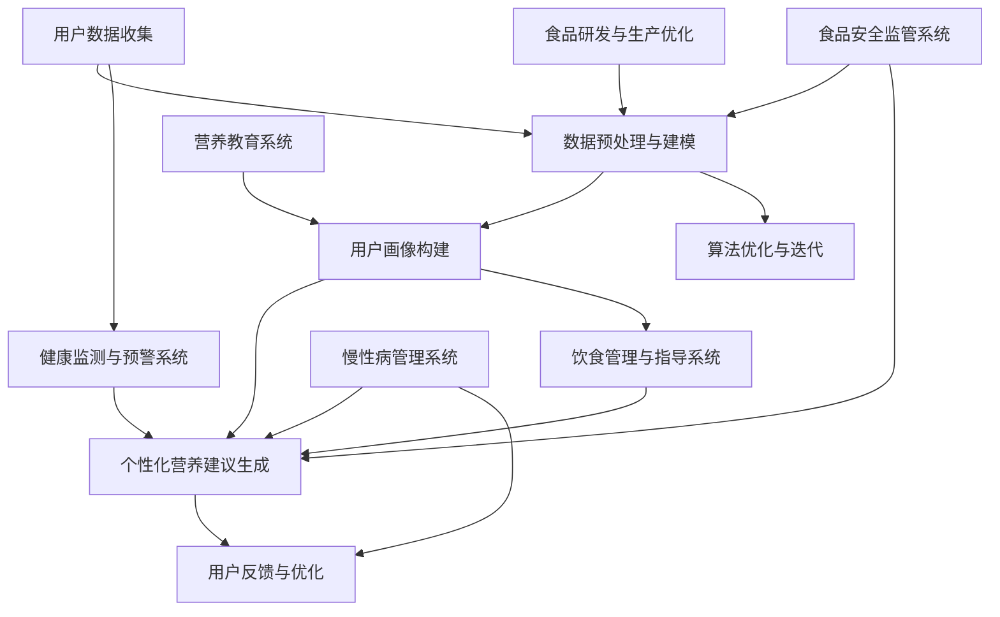

                 

### 文章标题

# AI在个性化营养建议中的应用：促进健康生活

### 文章关键词

- 人工智能
- 个性化营养
- 健康生活
- 机器学习
- 数据分析
- 用户画像

### 文章摘要

本文旨在探讨人工智能（AI）在个性化营养建议领域的应用，及其对促进健康生活的重要作用。首先，我们将回顾AI在营养研究中的应用现状，分析个性化营养的需求与挑战。接着，详细介绍机器学习基础、营养数据采集与处理方法。随后，我们探讨个性化营养建议系统设计，包括系统架构、用户画像与数据分析，以及营养建议生成算法。本文还将分享几个AI在个性化营养建议中的应用案例，包括健康监测与营养建议系统、饮食管理与应用、个性化营养教育的应用等。最后，本文将总结AI个性化营养的发展趋势、面临挑战与解决方案，并展望未来的发展方向与潜在影响。通过本文的阅读，读者将了解AI在个性化营养领域的关键技术与应用，从而更好地理解这一新兴领域的重要性。

## 第一部分：AI与个性化营养概述

### 第1章：AI在营养领域的作用与挑战

#### 1.1 AI在营养研究中的应用现状

随着科技的迅猛发展，人工智能（AI）逐渐渗透到各个领域，营养学也不例外。AI在营养研究中的应用已经成为推动该领域发展的重要力量。目前，AI在营养研究中的应用主要集中在以下几个方面：

1. **营养数据的分析**：通过机器学习算法，对大量的营养数据进行处理和分析，以发现其中的规律和关联。这有助于科学家更好地理解食物与人体健康之间的关系。

2. **个性化营养建议**：利用AI技术，根据用户的个人特征和饮食习惯，提供个性化的营养建议，以帮助人们实现健康生活方式。

3. **营养配方优化**：通过AI算法优化营养配方，以提高食品的营养价值和适口性。

4. **食品安全监测**：利用AI技术对食品中的有害物质进行实时监测，以确保食品安全。

5. **营养教育**：通过虚拟现实（VR）和增强现实（AR）等技术，提供沉浸式的营养教育体验，提高公众的营养知识水平。

#### 1.2 个性化营养的需求与挑战

随着生活水平的提高和健康意识的增强，人们对个性化营养的需求日益增长。个性化营养不仅关注食物的种类和数量，还关注食物与个人体质、生活方式的匹配。然而，实现个性化营养面临诸多挑战：

1. **数据隐私问题**：个性化营养需要收集大量的个人健康和饮食习惯数据，这引发了数据隐私和安全的问题。

2. **数据质量与多样性**：营养数据来源广泛，数据质量参差不齐，且多样性高，这给数据预处理和建模带来了挑战。

3. **算法透明性和可解释性**：AI算法的复杂性和“黑箱”特性使得其决策过程难以理解，这对个性化营养建议的可信度提出了挑战。

4. **算法适应性与稳定性**：个性化营养建议需要根据用户行为和健康状况的变化进行动态调整，这要求算法具有良好的适应性和稳定性。

#### 1.3 AI在个性化营养中的潜在应用场景

AI在个性化营养中的潜在应用场景丰富多样，主要包括：

1. **健康监测与预警**：通过穿戴设备和生物传感器，实时监测用户的生理参数，结合AI算法进行健康风险评估和预警。

2. **饮食管理与指导**：根据用户的饮食习惯、健康状况和营养需求，提供个性化的饮食建议，帮助用户改善饮食习惯。

3. **营养教育**：利用AI技术，为用户提供个性化的营养知识教育，提高公众的营养素养。

4. **食品研发与生产**：通过AI算法优化食品配方和生产工艺，提高食品的营养价值和市场竞争力。

5. **食品安全监管**：利用AI技术对食品进行实时监测，提高食品安全监管的效率和准确性。

#### 1.4 AI个性化营养解决方案的关键要素

要实现AI在个性化营养中的有效应用，需要以下关键要素：

1. **数据收集与整合**：构建完善的数据收集系统，整合用户的基本信息、生理参数、饮食习惯等多源数据。

2. **数据预处理与建模**：对收集到的数据进行清洗、整合和预处理，建立合适的机器学习模型，提取有用的营养特征。

3. **用户画像与个性化推荐**：基于用户的个人特征和饮食习惯，构建用户画像，利用推荐系统提供个性化的营养建议。

4. **算法优化与迭代**：不断优化AI算法，提高营养建议的准确性和实用性，同时保证算法的可解释性和透明性。

5. **用户体验与反馈**：设计友好、直观的用户界面，收集用户反馈，持续改进营养建议系统。

通过以上关键要素的协同作用，AI个性化营养解决方案可以更好地满足用户需求，提高营养建议的科学性和实用性，从而促进健康生活方式的实现。

### 1.1 AI在营养研究中的应用现状

人工智能（AI）在营养研究中的应用已经成为推动该领域发展的重要力量。AI技术的引入，使得营养学研究从传统的定性描述逐渐转向定量分析和数据驱动。以下是一些AI在营养研究中的具体应用现状：

首先，**营养数据的分析**是AI在营养研究中的重要应用之一。通过机器学习算法，可以处理和分析大量的营养数据，从而揭示食物成分与人体健康之间的复杂关系。例如，深度学习模型可以用于分析食品成分表，识别潜在的过敏原和营养成分，从而帮助人们更好地了解食物对身体的影响。

其次，**个性化营养建议**是基于AI技术的重要发展方向。通过分析用户的个人特征、饮食习惯和健康状况，AI可以提供个性化的营养建议。这些建议不仅包括饮食结构的优化，还可以根据用户的实时健康状态进行调整。例如，一些智能营养平台可以通过收集用户的心率、血压等生理数据，结合机器学习模型，为用户提供个性化的饮食计划。

第三，**营养配方优化**也是AI在营养研究中的重要应用。通过优化算法，AI可以设计出更符合人体需求的营养配方，提高食品的营养价值和适口性。例如，AI可以用于设计新型健康食品，通过调整食材的比例和加工方法，使其既美味又健康。

此外，**食品安全监测**也是AI在营养研究中的重要应用领域。利用图像识别、自然语言处理等技术，AI可以实现对食品的实时监测，检测食品中的有害物质和微生物，从而提高食品安全水平。

最后，**营养教育**也是AI技术的重要应用方向。通过虚拟现实（VR）和增强现实（AR）等技术，AI可以为用户提供沉浸式的营养教育体验。例如，AI可以模拟食品在人体内的消化过程，帮助用户更好地理解营养知识。

总的来说，AI在营养研究中的应用现状表明，这一领域正在迅速发展，并展现出巨大的潜力。通过AI技术的引入，营养学从传统的定性研究走向了定量分析和数据驱动，这不仅提高了研究的深度和广度，也为个性化营养的实现提供了技术支持。

#### 1.2 个性化营养的需求与挑战

随着社会的发展和人们对健康意识的提升，个性化营养逐渐成为营养领域的重要研究方向。个性化营养是指根据个体的生理特征、生活方式和健康需求，提供量身定制的营养建议，以满足个人的健康需求。这种营养方式不仅能提高营养摄入的科学性和有效性，还能帮助个体实现健康生活方式。

**个性化营养的需求**主要体现在以下几个方面：

1. **个性化饮食建议**：每个人的体质、代谢和营养需求都不同，因此需要根据个人情况提供个性化的饮食建议。例如，运动员和普通人的饮食需求有显著差异，而慢性病患者的饮食也需要特别注意。

2. **健康风险评估**：通过个性化营养分析，可以预测个体患病的风险，如心血管疾病、糖尿病等，从而采取预防措施。

3. **生活方式干预**：个性化营养不仅关注饮食，还涉及生活方式的调整，如运动、睡眠等，以全面改善个体的健康状况。

4. **营养教育**：个性化营养建议有助于提高个体的营养知识水平，促进健康生活方式的形成。

然而，实现个性化营养也面临诸多**挑战**：

1. **数据隐私问题**：个性化营养需要收集大量的个人健康和饮食习惯数据，这引发了数据隐私和安全的问题。如何在保护用户隐私的同时，有效利用这些数据进行营养分析，是亟待解决的问题。

2. **数据质量与多样性**：营养数据来源广泛，包括实验室检测数据、健康记录、饮食习惯调查等，这些数据的多样性和质量参差不齐。数据预处理和整合的难度较高，这影响了个性化营养的准确性和可靠性。

3. **算法透明性和可解释性**：传统的机器学习算法，如深度学习，往往被视为“黑箱”，其决策过程难以解释。这在个性化营养中尤为关键，因为用户需要理解建议的依据和原理，以便接受并执行这些建议。

4. **算法适应性与稳定性**：个性化营养建议需要根据用户行为和健康状况的变化进行动态调整，这要求算法具有良好的适应性和稳定性。然而，现实中的数据和环境变化复杂，算法的适应性和稳定性仍需进一步提升。

5. **跨学科合作**：个性化营养涉及到营养学、医学、计算机科学等多个领域，需要跨学科的合作。不同领域的技术和知识需要有效整合，才能实现真正的个性化营养。

综上所述，个性化营养在满足个体健康需求方面具有巨大潜力，但也面临数据隐私、算法透明性、数据质量等多方面的挑战。通过不断的技术创新和跨学科合作，这些挑战有望逐步克服，个性化营养将更加成熟和普及。

#### 1.3 AI在个性化营养中的潜在应用场景

人工智能（AI）在个性化营养中具有广泛的应用潜力，可以覆盖从健康监测到营养教育的多个场景。以下是一些具体的应用场景：

1. **健康监测与预警**：通过AI技术，可以实时监测用户的生理参数，如心率、血压、血糖等。利用机器学习算法，可以对这些数据进行分析，识别异常模式，从而进行健康预警。例如，AI可以通过分析连续的心率数据，预测心脏病的风险，并提醒用户采取预防措施。

2. **饮食管理与指导**：AI可以根据用户的饮食习惯、健康状况和营养需求，提供个性化的饮食建议。例如，一个智能营养应用可以记录用户的饮食日志，分析营养摄入情况，并提供调整建议，以帮助用户实现健康饮食目标。

3. **营养教育**：利用AI技术，可以开发虚拟营养师或虚拟教练，通过虚拟现实（VR）和增强现实（AR）技术，为用户提供沉浸式的营养教育体验。用户可以通过这些虚拟工具了解营养知识，学习健康饮食的方法，从而提高营养素养。

4. **食品研发与生产**：AI可以帮助食品科学家优化食品配方和生产工艺。通过分析大量的营养数据，AI可以设计出更符合人体需求的营养配方，同时提高食品的口感和市场竞争力。此外，AI还可以用于实时监控生产过程，确保食品质量和安全性。

5. **食品安全监管**：AI技术在食品安全监管中具有重要作用。利用图像识别和自然语言处理技术，AI可以检测食品中的有害物质和微生物，实时监控食品安全状况，从而提高监管效率。

6. **慢性病管理**：对于慢性病患者，AI可以提供个性化的饮食和生活方式建议，帮助患者控制病情。例如，对于糖尿病患者，AI可以通过分析血糖数据，调整饮食方案，以保持血糖水平的稳定。

7. **个性化营养推荐**：AI可以根据用户的偏好和健康需求，推荐合适的营养产品和饮食方案。例如，一个智能营养平台可以根据用户的饮食日志和健康数据，推荐符合其需求的营养补充剂和健康食品。

总之，AI在个性化营养中的潜在应用场景丰富多样，从健康监测到营养教育，再到食品安全和慢性病管理，AI技术都可以发挥重要作用。通过这些应用，AI不仅能够提高营养建议的准确性和实用性，还能为用户提供更加个性化和智能化的健康服务。

#### 1.4 AI个性化营养解决方案的关键要素

要实现AI在个性化营养中的有效应用，需要一系列关键要素的支持。以下是这些关键要素及其在个性化营养解决方案中的具体作用：

1. **数据收集与整合**：
   - **作用**：数据是AI个性化营养的基础。收集并整合用户的基本信息、饮食习惯、生理参数等数据，为AI算法提供必要的信息。
   - **具体方法**：通过穿戴设备、手机应用、健康监测设备等渠道收集数据，并将不同来源的数据进行清洗、整合和标准化处理，确保数据的质量和一致性。

2. **数据预处理与建模**：
   - **作用**：数据预处理是数据分析和建模的重要环节。通过数据清洗、归一化、特征提取等方法，将原始数据转化为适合机器学习模型的输入。
   - **具体方法**：采用数据清洗算法去除噪声和异常值，使用特征工程技术提取与营养相关的特征，如营养素含量、食物成分等。

3. **用户画像与个性化推荐**：
   - **作用**：用户画像是将用户的个性化信息抽象为多维度的特征向量，用于生成个性化的营养建议。
   - **具体方法**：利用聚类算法、回归模型等方法，根据用户的个人特征和饮食习惯，构建用户画像。然后，结合协同过滤、内容推荐等技术，为用户提供个性化的营养建议。

4. **算法优化与迭代**：
   - **作用**：算法优化是提高营养建议准确性和实用性的关键。通过不断调整和优化算法，使其更适应实际应用需求。
   - **具体方法**：采用交叉验证、网格搜索等方法，选择最优的算法参数和模型结构。此外，通过实时数据反馈和模型更新，持续优化算法，以适应用户行为和健康状况的变化。

5. **用户体验与反馈**：
   - **作用**：用户体验是评估和改进个性化营养解决方案的重要指标。通过收集用户反馈，可以了解用户对营养建议的接受程度和效果。
   - **具体方法**：设计友好的用户界面，提供简单的操作方式，收集用户对营养建议的反馈。然后，根据用户反馈，调整营养建议的内容和形式，以提高用户体验。

6. **算法透明性与可解释性**：
   - **作用**：提高算法的透明性和可解释性，使用户能够理解营养建议的依据和原理，增强建议的可信度。
   - **具体方法**：采用可解释性AI技术，如决策树、LIME（局部可解释模型解释）等，解释模型预测的过程和结果。同时，提供详细的营养知识解释，帮助用户理解营养建议的科学依据。

7. **隐私保护与数据安全**：
   - **作用**：保障用户数据的安全和隐私，是建立用户信任和持续使用系统的关键。
   - **具体方法**：采用数据加密、访问控制、匿名化等技术，确保用户数据的安全。同时，制定隐私政策，明确用户数据的收集、使用和共享规则，提高用户的隐私保护意识。

通过以上关键要素的协同作用，AI个性化营养解决方案可以更好地满足用户需求，提供科学、合理和个性化的营养建议，从而促进健康生活方式的实现。

### 1.5 个性化营养与AI技术的关系架构

为了更好地理解个性化营养与AI技术之间的关系，我们可以通过Mermaid流程图来展示其核心概念与联系。以下是一个简化的关系架构，描述了个性化营养中AI技术的应用流程：



**解释说明**：

- **A（用户数据收集）**：这是整个流程的起点，通过多种渠道收集用户的个人信息、饮食习惯、生理参数等数据。
- **B（数据预处理与建模）**：对收集到的数据进行清洗、整合和处理，然后使用机器学习算法进行建模。
- **C（用户画像构建）**：基于预处理后的数据，构建用户的个性化特征画像。
- **D（个性化营养建议生成）**：利用用户画像和机器学习模型，生成针对用户的个性化营养建议。
- **E（用户反馈与优化）**：收集用户对营养建议的反馈，并据此优化系统，提高建议的准确性和实用性。
- **F（健康监测与预警系统）**：结合用户的生理参数，通过机器学习模型进行健康监测和预警。
- **G（算法优化与迭代）**：根据收集到的用户反馈，对机器学习算法进行持续优化和迭代。
- **H（饮食管理与指导系统）**：利用个性化营养建议，帮助用户进行饮食管理和指导。
- **I（营养教育系统）**：提供个性化的营养知识教育，提高用户的营养素养。
- **J（食品安全监管系统）**：利用AI技术对食品安全进行实时监测，提高食品安全水平。
- **K（食品研发与生产优化）**：通过AI技术优化食品配方和生产工艺。
- **L（慢性病管理系统）**：为慢性病患者提供个性化的饮食和生活方式建议。

通过这个流程图，我们可以清晰地看到AI技术在个性化营养中的应用流程，以及各个环节之间的相互关系和影响。这为理解和设计个性化营养系统提供了一个直观的框架。

### 2.1 机器学习基础

机器学习（Machine Learning，ML）是人工智能（AI）的一个重要分支，它通过构建和训练模型来使计算机能够从数据中学习，并在未知数据上做出预测或决策。在个性化营养领域，机器学习技术被广泛应用于数据分析和营养建议的生成。

#### 2.1.1 机器学习的基本概念

**机器学习的基本概念包括以下几个核心要素：**

1. **数据集**：机器学习模型依赖于大量的数据集进行训练，数据集包括输入特征和对应的输出结果。在个性化营养中，数据集可能包括用户的饮食习惯、生理参数、健康状况等。

2. **特征**：特征是数据集中的每个维度，代表数据的一个方面。例如，一个人的体重、身高、年龄等都是特征。在营养学中，特征可能包括营养素的摄入量、食品种类、食物的热量等。

3. **模型**：模型是机器学习算法在训练数据集上构建的数学函数，用于预测或分类。常见的机器学习模型有线性回归、逻辑回归、决策树、随机森林、支持向量机、神经网络等。

4. **损失函数**：损失函数用于衡量模型预测值与实际值之间的差距。常见的损失函数有均方误差（MSE）、交叉熵损失等。模型的训练过程实际上是不断调整模型参数，以最小化损失函数。

5. **优化算法**：优化算法用于寻找模型参数的最优值，以最小化损失函数。常见的优化算法有梯度下降、随机梯度下降、Adam优化器等。

6. **超参数**：超参数是模型训练过程中需要手动设置的参数，如学习率、树深度、隐藏层神经元数量等。这些参数需要通过交叉验证等方法进行调整，以获得最佳模型性能。

#### 2.1.2 常见的机器学习算法

**常见的机器学习算法主要包括以下几类：**

1. **监督学习**：
   - **线性回归**：通过建立线性模型，预测连续值输出。适用于预测营养素的摄入量等。
   - **逻辑回归**：通过建立逻辑函数，预测概率值，通常用于分类任务，如饮食分类。
   - **支持向量机（SVM）**：通过找到最佳超平面，分类不同类型的食物。
   - **决策树**：通过一系列规则进行分类或回归，直观易懂。
   - **随机森林**：通过构建多个决策树，进行集成学习，提高预测准确性。

2. **无监督学习**：
   - **聚类算法**：如K-means、层次聚类等，用于将相似的数据点归为一类，用于用户画像构建。
   - **降维算法**：如主成分分析（PCA）、t-SNE等，用于减少数据维度，提高计算效率。

3. **深度学习**：
   - **神经网络**：通过多层神经网络，学习复杂的非线性关系，用于图像识别、文本分类等。
   - **卷积神经网络（CNN）**：特别适用于处理图像数据，如食品成分分析。
   - **递归神经网络（RNN）**：适用于处理序列数据，如时间序列分析。

#### 2.1.3 机器学习在营养数据中的应用

**机器学习在营养数据中的应用主要体现在以下几个方面：**

1. **营养数据分析**：利用监督学习算法，对营养数据进行分析，提取有用的信息。例如，通过线性回归模型，分析不同食物摄入量与营养素摄入之间的关系。

2. **营养推荐系统**：利用协同过滤、矩阵分解等技术，构建营养推荐系统。该系统可以根据用户的饮食习惯和偏好，推荐合适的食物和营养补充剂。

3. **健康风险评估**：利用机器学习模型，分析用户的健康数据，预测患病风险。例如，通过决策树或随机森林，分析饮食模式与心血管疾病之间的关系。

4. **个性化营养建议**：通过构建用户画像，结合机器学习模型，为用户提供个性化的营养建议。例如，通过K-means聚类，将用户分为不同的群体，针对不同群体提供差异化的营养建议。

5. **营养配方优化**：利用优化算法，设计出更符合人体需求的营养配方。例如，通过遗传算法，优化食物组合，以最大化营养吸收率。

总的来说，机器学习在个性化营养中的应用，为营养学研究和健康服务提供了强大的技术支持。通过不断探索和优化，机器学习技术将在个性化营养领域发挥越来越重要的作用。

#### 2.1.4 常见的机器学习算法

在个性化营养建议系统中，机器学习算法的选择和应用至关重要。以下是几种常见的机器学习算法及其在个性化营养中的应用：

1. **线性回归**：
   - **基本概念**：线性回归是一种监督学习算法，用于预测连续值输出。其基本模型为 \(y = wx + b\)，其中 \(y\) 是预测值，\(x\) 是输入特征，\(w\) 是权重，\(b\) 是偏置。
   - **应用**：在个性化营养中，线性回归可以用于预测用户摄入特定营养素后的健康指标变化。例如，通过建立饮食摄入量与血压之间的关系模型，预测饮食调整对血压的影响。

2. **逻辑回归**：
   - **基本概念**：逻辑回归是一种广义线性模型，用于处理分类问题。其基本模型为 \(P(y=1) = \frac{1}{1 + e^{-(wx + b)}}\)，其中 \(P(y=1)\) 是输出为1的概率。
   - **应用**：在个性化营养中，逻辑回归可以用于分类用户饮食模式，如区分健康饮食与不健康饮食。此外，它还可以用于预测某些疾病的风险，例如心脏病或糖尿病。

3. **决策树**：
   - **基本概念**：决策树是一种基于规则的分类算法，通过一系列if-else条件进行分类或回归。
   - **应用**：在个性化营养中，决策树可以用于构建个性化饮食建议规则。例如，根据用户的年龄、体重和健康状况，为用户推荐合适的饮食方案。

4. **随机森林**：
   - **基本概念**：随机森林是一种集成学习方法，通过构建多个决策树，并对它们的结果进行投票或平均，以提高预测准确性。
   - **应用**：在个性化营养中，随机森林可以用于预测用户的营养摄入量和健康指标，提供更加可靠的个性化建议。

5. **支持向量机（SVM）**：
   - **基本概念**：SVM是一种基于间隔的线性分类器，通过最大化分类边界之间的间隔，提高分类准确性。
   - **应用**：在个性化营养中，SVM可以用于分类不同的食物类别，如区分健康食品与不健康食品。

6. **神经网络**：
   - **基本概念**：神经网络是一种模拟人脑神经元连接方式的计算模型，通过多层神经网络进行复杂非线性关系的学习。
   - **应用**：在个性化营养中，神经网络可以用于处理大量的营养数据，提取复杂的特征，从而提供更精确的营养建议。

7. **K-means聚类**：
   - **基本概念**：K-means是一种无监督学习算法，通过迭代过程将数据点划分为K个聚类。
   - **应用**：在个性化营养中，K-means可以用于构建用户画像，将具有相似饮食习惯和健康特征的用户分为不同的群体，从而为每个群体提供个性化的营养建议。

通过这些常见的机器学习算法，个性化营养建议系统可以更好地理解和预测用户的营养需求，提供科学、合理的营养建议，帮助用户实现健康生活方式。

#### 2.1.5 机器学习在营养数据中的应用实例

机器学习在营养数据中的应用不仅理论丰富，实践案例也层出不穷。以下是一个具体的机器学习应用实例，通过该实例详细讲解机器学习在营养数据中的使用过程：

**实例背景**：某健康科技公司希望开发一款个性化营养建议系统，以帮助用户改善饮食习惯，提高健康水平。该系统需要根据用户的饮食习惯、生理参数和健康数据，提供科学的营养建议。

**数据收集**：首先，系统需要收集用户的数据，包括：
- 用户基本信息：年龄、性别、身高、体重等。
- 饮食习惯数据：每日饮食记录，包括食物种类、摄入量、摄入时间等。
- 健康数据：体检报告、运动记录、生理参数（如血压、心率、血糖等）。

**数据预处理**：收集到的数据往往包含噪声和缺失值，因此需要进行预处理：
- **数据清洗**：去除不完整或异常的数据记录，如缺少关键健康指标的记录。
- **数据标准化**：将不同量纲的数据统一标准化，如将食物摄入量转换为卡路里或克。
- **特征工程**：提取与营养和健康相关的特征，如每日摄入的营养素总量、不同食物的比例等。

**模型选择**：基于数据的特点和需求，选择合适的机器学习模型。在本实例中，我们选择使用**随机森林**进行营养建议的预测，因为随机森林在处理高维数据和复杂关系方面表现优秀。

**模型训练**：
- **数据划分**：将数据集划分为训练集和测试集，通常比例为80%训练集，20%测试集。
- **模型训练**：使用训练集对随机森林模型进行训练，调整模型参数（如树深度、节点数量等），以最大化模型的预测准确性。

**模型评估**：
- **交叉验证**：通过交叉验证方法，对模型进行性能评估，确保模型在不同数据集上的表现一致。
- **测试集评估**：使用测试集对模型进行评估，计算模型的准确率、召回率、F1分数等指标。

**结果分析**：
- **预测结果**：根据测试集的输入数据，模型预测了用户的个性化营养建议，包括每日营养素摄入量、食物搭配建议等。
- **结果分析**：通过对比实际饮食记录和模型预测结果，分析模型的预测准确性和实用性。例如，评估模型在降低用户血糖、控制体重等方面的效果。

**模型优化**：
- **反馈调整**：根据用户对营养建议的反馈，对模型进行优化。例如，如果用户对某些食物搭配建议不认可，可以调整模型参数，优化建议的准确性。
- **持续迭代**：通过不断收集新的用户数据，对模型进行迭代更新，提高模型的预测准确性和适应性。

**案例小结**：
通过这个实例，我们可以看到机器学习在营养数据中的应用过程，从数据收集、预处理、模型选择、训练、评估到优化，每一步都是确保营养建议系统科学、合理和实用的重要环节。随着机器学习技术的不断发展，个性化营养建议系统将更加精准和智能化，为用户的健康生活提供有力支持。

### 2.2 营养数据采集与处理

在个性化营养建议系统中，数据采集与处理是至关重要的一环。有效的数据采集和处理能够确保营养分析模型的准确性和可靠性，从而为用户提供科学的营养建议。以下将详细介绍营养数据的来源、特点与挑战，以及数据预处理方法。

#### 2.2.1 营养数据的来源

营养数据的来源主要包括以下几个方面：

1. **用户自报数据**：用户通过健康APP或网站填写个人信息和饮食习惯，如每日摄入的食物种类、摄入量、食物频率等。

2. **生物传感器数据**：通过佩戴可穿戴设备，如智能手表、健康手环等，实时监测用户的生理参数，如心率、血压、血糖等。

3. **健康记录数据**：用户的体检报告、医疗记录等，这些数据通常包含详细的营养和健康信息。

4. **公共数据库**：如国家营养数据库、食品成分数据库等，这些数据库提供了大量的食品成分信息和营养参数。

5. **社交媒体数据**：用户在社交媒体上的食品分享和评论，可以作为间接的营养信息来源。

#### 2.2.2 营养数据的特点与挑战

营养数据具有以下几个显著特点：

1. **数据多样性**：营养数据来源广泛，包括文字、图像、传感器数据等多种形式，这增加了数据处理的复杂性。

2. **数据质量参差不齐**：由于数据来源的不同，数据的质量和准确性存在较大差异。例如，用户自报数据可能存在主观偏差，而生物传感器数据可能受到测量误差的影响。

3. **时间敏感性**：营养数据往往具有时效性，如用户的饮食记录需要及时更新，以反映当前的健康状况和饮食习惯。

4. **数据量大**：随着传感器技术的进步和用户参与度的提高，营养数据的规模日益增大，这对存储和处理能力提出了较高要求。

5. **隐私保护**：营养数据涉及个人健康信息，数据隐私和安全是必须考虑的重要问题。

#### 2.2.3 数据预处理方法

为了确保营养分析模型的准确性和可靠性，需要采用以下数据预处理方法：

1. **数据清洗**：
   - **去除噪声和异常值**：去除明显错误的数据记录，如极端值和重复记录。
   - **缺失值处理**：对于缺失的数据，可以采用插值法、均值填补法或使用机器学习算法进行预测。

2. **数据标准化**：
   - **归一化**：将不同量纲的数据转换为相同的量纲，如将食物摄入量转换为卡路里或克。
   - **正则化**：对数据进行缩放处理，使其分布在较为均匀的范围内，以避免某些特征对模型的影响过大。

3. **特征提取**：
   - **降维**：通过主成分分析（PCA）、t-SNE等方法，减少数据维度，提高计算效率。
   - **特征构造**：从原始数据中提取新的特征，如计算每日不同营养素的摄入比例、营养素的摄入量与健康指标的相关性等。

4. **数据融合**：
   - **多源数据整合**：将来自不同来源的数据进行整合，如将用户自报数据和生物传感器数据结合，构建更全面的用户画像。
   - **交叉验证**：通过交叉验证方法，确保数据预处理方法的有效性和一致性。

通过以上数据预处理方法，可以有效提高营养数据的质量和一致性，为后续的营养分析提供可靠的数据基础。数据预处理不仅能够增强模型的预测准确性，还能提高系统的鲁棒性和适应性，从而为用户提供更加科学和个性化的营养建议。

### 2.3 营养数据预处理方法的详细讲解与举例说明

#### 2.3.1 数据清洗

数据清洗是数据预处理的第一步，其目的是去除数据中的噪声和异常值，确保数据的质量。以下是一些常见的数据清洗方法及其应用实例：

1. **去除噪声和异常值**：
   - **方法**：使用统计方法或可视化工具，识别并去除明显错误的数据记录。例如，通过箱线图可以识别出异常值。
   - **实例**：假设我们有一个饮食记录数据集，某天的热量摄入数据为[2000, 3000, 10000, 5000]，通过箱线图可以明显看出10000这个值是异常值，应予以删除。

   ```python
   import seaborn as sns
   import pandas as pd

   # 加载数据
   data = pd.read_csv('diet_data.csv')

   # 绘制箱线图
   sns.boxplot(x=data['calories'])
   # 删除异常值
   data = data[data['calories'] <= data['calories'].quantile(0.99)]
   ```

2. **缺失值处理**：
   - **方法**：常见的缺失值处理方法有插值法、均值填补法、中位数填补法等。插值法可以通过线性或非线性方法填补缺失值，均值填补法使用该列的平均值填补缺失值，中位数填补法则使用中位数填补。
   - **实例**：对于身高缺失的数据，使用平均值填补。

   ```python
   # 插值法填补缺失值
   data['height'].fillna(data['height'].interpolate(), inplace=True)

   # 均值填补法
   data['height'].fillna(data['height'].mean(), inplace=True)

   # 中位数填补法
   data['height'].fillna(data['height'].median(), inplace=True)
   ```

#### 2.3.2 数据标准化

数据标准化是确保不同量纲的数据在同一尺度上，以避免某些特征对模型的影响过大。以下是一些常见的数据标准化方法及其应用实例：

1. **归一化**：
   - **方法**：将数据缩放到[0, 1]的范围内，公式为 \(x_{\text{norm}} = \frac{x - x_{\text{min}}}{x_{\text{max}} - x_{\text{min}}}\)。
   - **实例**：将食物摄入量（单位：克）归一化到[0, 1]范围内。

   ```python
   # 归一化
   data['calories'] = (data['calories'] - data['calories'].min()) / (data['calories'].max() - data['calories'].min())
   ```

2. **正则化**：
   - **方法**：通过缩放数据，使其分布在均匀的范围内，公式为 \(x_{\text{norm}} = \frac{x - x_{\text{mean}}}{x_{\text{std}}}\)。
   - **实例**：将用户的体重数据进行正则化处理。

   ```python
   # 正则化
   data['weight'] = (data['weight'] - data['weight'].mean()) / data['weight'].std()
   ```

#### 2.3.3 特征提取

特征提取是从原始数据中提取有用的信息，以减少数据维度和提高模型的预测准确性。以下是一些常见的特征提取方法及其应用实例：

1. **降维**：
   - **方法**：通过主成分分析（PCA）或t-SNE等方法，将高维数据降维到低维空间。
   - **实例**：使用PCA将饮食记录数据降维到2个主要成分。

   ```python
   from sklearn.decomposition import PCA

   # 使用PCA降维
   pca = PCA(n_components=2)
   data_pca = pca.fit_transform(data[['calories', 'protein', 'carbs']])
   ```

2. **特征构造**：
   - **方法**：从原始数据中构造新的特征，如计算每日不同营养素的摄入比例。
   - **实例**：计算每日蛋白质、脂肪和碳水化合物的摄入比例。

   ```python
   # 计算营养素摄入比例
   data['protein_ratio'] = data['protein'] / data['calories']
   data['fat_ratio'] = data['fat'] / data['calories']
   data['carbs_ratio'] = data['carbs'] / data['calories']
   ```

通过以上数据清洗、标准化和特征提取的方法，可以有效地提高营养数据的质量，为后续的营养分析模型提供可靠的数据基础。这些方法不仅能够减少数据的冗余，还能增强模型的预测准确性和适应性，从而为用户提供更科学、更个性化的营养建议。

### 2.4 营养数据的可视化与分析

在个性化营养建议系统中，数据可视化和分析是理解数据分布和挖掘潜在规律的重要手段。通过可视化和分析，我们可以更直观地了解用户的饮食习惯、营养摄入情况，并据此优化营养建议。以下将介绍几种常用的数据可视化工具和数据分析方法。

#### 2.4.1 常用的数据可视化工具

1. **Matplotlib**：Matplotlib 是Python中最常用的数据可视化库，它提供了丰富的绘图功能，可以生成各种类型的图表，如柱状图、折线图、散点图等。

2. **Seaborn**：Seaborn 是基于 Matplotlib 的高级可视化库，提供了更美观的图表样式和丰富的统计图表，如箱线图、小提琴图等。

3. **Plotly**：Plotly 是一个交互式可视化库，支持生成各种交互式图表，如3D图、地图、时间序列图等，用户可以通过鼠标操作查看数据的详细情况。

4. **Tableau**：Tableau 是一个商业数据可视化工具，提供了强大的数据连接和分析功能，用户可以通过拖拽操作快速创建复杂的可视化报表。

#### 2.4.2 常用的数据分析方法

1. **描述性统计分析**：描述性统计分析是对数据进行初步了解的重要方法，包括计算数据的均值、中位数、标准差、最大值、最小值等统计量。通过描述性统计分析，可以快速了解数据的整体分布和特征。

2. **相关性分析**：相关性分析用于研究两个或多个变量之间的关系。通过计算皮尔逊相关系数或斯皮尔曼相关系数，可以评估变量之间的线性关系。例如，我们可以分析不同营养素摄入量与用户体重、血压等健康指标之间的相关性。

3. **聚类分析**：聚类分析是将数据点分成几个不同的组，以揭示数据中的潜在结构。常用的聚类算法包括K-means、层次聚类等。通过聚类分析，可以识别具有相似饮食习惯的用户群体，从而为每个群体提供个性化的营养建议。

4. **时间序列分析**：时间序列分析用于研究时间序列数据的变化规律和趋势。通过时间序列分析，我们可以预测用户的营养摄入量和健康状况的变化趋势。常用的方法包括ARIMA模型、LSTM神经网络等。

5. **机器学习预测**：通过机器学习算法，可以对用户的未来营养需求和健康状况进行预测。常见的算法包括线性回归、决策树、随机森林、神经网络等。通过训练和验证模型，可以评估模型的预测性能，并根据预测结果优化营养建议。

#### 2.4.3 数据可视化与分析的应用实例

**实例背景**：假设我们有一个包含用户饮食习惯和健康数据的表格，我们需要通过数据可视化和分析来识别健康风险和优化营养建议。

**步骤1：描述性统计分析**
- 计算每日蛋白质、脂肪、碳水化合物的摄入量，并绘制直方图。
- 计算用户平均体重、血压等健康指标，并绘制箱线图。

```python
import pandas as pd
import matplotlib.pyplot as plt

# 加载数据
data = pd.read_csv('diet_health_data.csv')

# 计算每日营养摄入量
daily_nutrients = data.groupby('day')['protein', 'fat', 'carbs'].mean()

# 绘制直方图
daily_nutrients[['protein', 'fat', 'carbs']].plot(kind='bar', figsize=(10, 6))
plt.title('Daily Nutrient Intake')
plt.xlabel('Day')
plt.ylabel('Nutrient Amount')

# 计算健康指标
health_metrics = data.groupby('day')['weight', 'blood_pressure'].mean()

# 绘制箱线图
health_metrics[['weight', 'blood_pressure']].plot(kind='box', figsize=(10, 6))
plt.title('Health Metrics Over Time')
plt.xlabel('Day')
plt.ylabel('Metric Value')
```

**实例2：相关性分析**
- 分析蛋白质摄入量与体重、血压之间的相关性。

```python
# 计算相关性
correlation = data[['protein', 'weight', 'blood_pressure']].corr()

# 绘制相关性热力图
sns.heatmap(correlation, annot=True, cmap='coolwarm')
plt.title('Nutrient-Health Correlations')
plt.show()
```

**实例3：聚类分析**
- 使用K-means聚类方法，将用户分为不同的饮食习惯群体。

```python
from sklearn.cluster import KMeans

# 提取特征数据
features = data[['protein', 'fat', 'carbs']]

# 使用K-means聚类
kmeans = KMeans(n_clusters=3)
clusters = kmeans.fit_predict(features)

# 添加聚类结果到原始数据
data['cluster'] = clusters

# 绘制聚类结果
data[['protein', 'fat', 'carbs', 'cluster']].plot(kind='scatter', x='protein', y='fat', c='cluster', figsize=(10, 6))
plt.title('K-Means Clustering of Nutrient Intake')
plt.xlabel('Protein Intake')
plt.ylabel('Fat Intake')
plt.show()
```

通过数据可视化和分析，我们可以直观地了解用户的营养摄入情况和健康状况，识别潜在的健康风险，并根据分析结果优化营养建议系统，提高个性化营养建议的准确性和实用性。

### 2.5 营养数据的分析与营养建议生成的详细算法原理

在个性化营养建议系统中，数据分析和营养建议生成的核心在于构建有效的算法模型。以下将详细介绍营养数据分析的方法、营养建议生成的算法原理，并使用伪代码展示关键步骤。

#### 2.5.1 营养数据分析的方法

营养数据分析主要通过以下几个步骤进行：

1. **数据预处理**：
   - **数据清洗**：去除噪声和异常值，填充缺失数据，标准化数据。
   - **特征工程**：提取与营养相关的特征，如每日营养素摄入量、食物种类频率等。
   - **数据归一化**：将不同量纲的数据转换为统一的尺度，如使用归一化方法将摄入量转换为比例。

2. **营养数据的统计分析**：
   - **描述性统计**：计算每日营养素的均值、中位数、标准差等。
   - **相关性分析**：分析不同营养素与体重、血压等健康指标之间的相关性。
   - **聚类分析**：将用户分为不同的饮食群体，以便提供个性化的营养建议。

3. **营养数据的可视化**：
   - **图表生成**：通过柱状图、折线图、散点图等，直观展示营养摄入与健康状况的关系。

#### 2.5.2 营养建议生成的算法原理

营养建议生成算法主要通过以下步骤实现：

1. **用户画像构建**：
   - **特征提取**：从用户的历史饮食记录中提取关键营养特征。
   - **聚类分析**：使用K-means或层次聚类等方法，将用户划分为不同的饮食群体。

2. **营养需求评估**：
   - **健康指标预测**：利用机器学习模型预测用户的体重、血糖等健康指标。
   - **营养素需求计算**：根据预测的健康指标，计算用户所需的营养素摄入量。

3. **营养建议生成**：
   - **饮食计划制定**：结合用户的饮食偏好和营养需求，制定个性化的饮食计划。
   - **推荐系统实现**：使用协同过滤或内容推荐方法，推荐合适的食物和营养补充剂。

#### 2.5.3 使用伪代码展示关键步骤

以下为营养建议生成的伪代码：

```python
# 用户画像构建
def build_user_profile(user_data):
    # 提取用户营养特征
    profile = extract_nutrient_features(user_data)
    # 将特征进行归一化处理
    normalized_profile = normalize_features(profile)
    # 使用K-means聚类，划分用户群体
    clusters = kmeans_clustering(normalized_profile)
    return clusters

# 营养需求评估
def assess_nutrient需求(clusters):
    # 对每个用户群体进行健康指标预测
    health_predictions = predict_health_metrics(clusters)
    # 根据预测的健康指标，计算营养素需求
    nutrient需求 = calculate_nutrient需求的(health_predictions)
    return nutrient需求

# 营养建议生成
def generate_diet_advice(nutrient需求, user_preferences):
    # 根据营养需求，制定饮食计划
    diet_plan = create_diet_plan(nutrient需求)
    # 结合用户偏好，推荐食物和营养补充剂
    recommendations = recommend_foods(diet_plan, user_preferences)
    return recommendations

# 主程序
def main(user_data, user_preferences):
    # 构建用户画像
    clusters = build_user_profile(user_data)
    # 评估营养需求
    nutrient需求 = assess_nutrient需求(clusters)
    # 生成营养建议
    recommendations = generate_diet_advice(nutrient需求, user_preferences)
    # 输出营养建议
    print_recommendations(recommendations)

# 调用主程序
main(user_data, user_preferences)
```

通过以上伪代码，我们可以看到营养建议生成的基本流程，从用户画像构建、营养需求评估到营养建议生成，每个步骤都基于科学的数据分析和算法原理，为用户提供科学、个性化的营养建议。

### 2.6 数学模型和公式详解

在个性化营养建议系统中，数学模型和公式是关键组成部分，用于描述营养摄入与健康状况之间的关系，并指导营养建议的生成。以下将介绍几个核心的数学模型和公式，并使用LaTeX格式进行详细讲解。

#### 2.6.1 线性回归模型

线性回归模型是机器学习中用于预测连续值的最基础模型，其公式为：

\[ y = wx + b \]

其中，\( y \) 是预测值，\( x \) 是输入特征，\( w \) 是权重，\( b \) 是偏置。为了最小化预测误差，通常使用均方误差（MSE）作为损失函数：

\[ \text{MSE} = \frac{1}{n} \sum_{i=1}^{n} (y_i - \hat{y}_i)^2 \]

其中，\( n \) 是样本数量，\( \hat{y}_i \) 是预测值。为了优化模型参数，可以使用梯度下降法进行迭代计算：

\[ w_{\text{new}} = w - \alpha \frac{\partial J}{\partial w} \]
\[ b_{\text{new}} = b - \alpha \frac{\partial J}{\partial b} \]

其中，\( \alpha \) 是学习率，\( J \) 是损失函数。

#### 2.6.2 逻辑回归模型

逻辑回归模型主要用于分类问题，其公式为：

\[ P(y=1) = \frac{1}{1 + e^{-(wx + b)}} \]

其中，\( P(y=1) \) 是输出为1的概率。逻辑回归的损失函数通常是交叉熵损失：

\[ \text{CrossEntropy} = -\sum_{i=1}^{n} y_i \log(\hat{y}_i) + (1 - y_i) \log(1 - \hat{y}_i) \]

优化逻辑回归模型通常使用梯度下降法，其更新规则为：

\[ w_{\text{new}} = w - \alpha \frac{\partial \text{CrossEntropy}}{\partial w} \]
\[ b_{\text{new}} = b - \alpha \frac{\partial \text{CrossEntropy}}{\partial b} \]

#### 2.6.3 决策树模型

决策树模型通过一系列条件判断进行分类或回归，其基本公式为：

\[ \text{DecisionTree}(x) = \sum_{i=1}^{n} w_i \cdot I(\text{feature}_i > \text{threshold}_i) \]

其中，\( x \) 是输入特征，\( w_i \) 是权重，\( \text{feature}_i \) 是特征值，\( \text{threshold}_i \) 是阈值，\( I \) 是指示函数。为了构建决策树，通常使用信息增益、基尼系数等指标来选择最佳分割点。

#### 2.6.4 K-means聚类模型

K-means聚类模型通过迭代过程将数据点划分为K个簇，其公式为：

\[ \text{Cluster}(x) = \arg\min_{c} \sum_{i=1}^{n} ||x_i - c||^2 \]

其中，\( x_i \) 是数据点，\( c \) 是簇中心。每次迭代中，首先根据当前簇中心分配数据点，然后更新簇中心。簇中心更新公式为：

\[ c_{\text{new}} = \frac{1}{n_k} \sum_{i \in k} x_i \]

其中，\( n_k \) 是属于簇k的数据点数量。

#### 2.6.5 主成分分析（PCA）

主成分分析是一种降维方法，其目标是在保持数据信息量的前提下，减少数据维度。其公式为：

\[ z_i = P^T x_i \]

其中，\( z_i \) 是降维后的数据，\( x_i \) 是原始数据，\( P \) 是协方差矩阵的特征向量矩阵。PCA通过最大化方差来选择主要成分，从而保留数据的主要信息。

通过这些数学模型和公式，个性化营养建议系统可以更好地理解用户的营养摄入与健康状况之间的关系，为用户提供科学、个性化的营养建议。

### 数学公式的详细讲解与举例说明

为了更好地理解前述的数学模型和公式，我们将在本节中通过具体的例子详细讲解这些公式的应用，并展示如何在实际项目中使用这些公式进行营养建议的生成。

#### 2.6.1 线性回归模型

线性回归模型用于预测连续值，其基本公式为：

\[ y = wx + b \]

其中，\( y \) 是预测值，\( x \) 是输入特征，\( w \) 是权重，\( b \) 是偏置。

**例子：** 假设我们要预测一个人每天的跑步距离（\( y \)）与其每天摄入的卡路里（\( x \)）之间的关系。我们可以通过线性回归模型建立如下公式：

\[ \text{run\_distance} = w \cdot \text{calories\_intake} + b \]

**使用Python实现线性回归模型：**

```python
import numpy as np
from sklearn.linear_model import LinearRegression

# 假设我们有以下数据
x = np.array([100, 150, 200, 250, 300]).reshape(-1, 1)  # 卡路里摄入量
y = np.array([2.5, 3.5, 4.0, 4.5, 5.0])  # 预测的跑步距离

# 创建线性回归模型
model = LinearRegression()
# 模型训练
model.fit(x, y)
# 输出权重和偏置
w, b = model.coef_, model.intercept_
print(f"权重w: {w}, 偏置b: {b}")
```

在这个例子中，我们通过训练数据集拟合出线性回归模型，并输出模型中的权重和偏置，从而可以预测新数据的跑步距离。

#### 2.6.2 逻辑回归模型

逻辑回归模型用于预测概率值，其公式为：

\[ P(y=1) = \frac{1}{1 + e^{-(wx + b)}} \]

**例子：** 假设我们要预测一个人是否会在接下来的一个月内体重增加（二元分类问题），我们可以使用逻辑回归模型来预测。

**使用Python实现逻辑回归模型：**

```python
from sklearn.linear_model import LogisticRegression

# 假设我们有以下数据
x = np.array([[100], [150], [200], [250], [300]])  # 卡路里摄入量
y = np.array([0, 1, 0, 1, 0])  # 体重增加的标签

# 创建逻辑回归模型
model = LogisticRegression()
# 模型训练
model.fit(x, y)
# 输出模型参数
print(model.coef_)
print(model.intercept_)
```

在这个例子中，我们通过训练数据集拟合出逻辑回归模型，并输出模型中的参数，从而可以预测新数据是否体重增加。

#### 2.6.3 决策树模型

决策树模型通过一系列条件判断进行分类或回归，其公式为：

\[ \text{DecisionTree}(x) = \sum_{i=1}^{n} w_i \cdot I(\text{feature}_i > \text{threshold}_i) \]

**例子：** 假设我们要通过决策树模型预测一个食物是否适合某人食用，基于该人的体重和每日卡路里摄入量。

**使用Python实现决策树模型：**

```python
from sklearn.tree import DecisionTreeClassifier

# 假设我们有以下数据
x = np.array([[60, 200], [70, 250], [80, 300], [90, 350], [100, 400]])  # 体重和卡路里摄入量
y = np.array([1, 0, 1, 0, 1])  # 是否适合食用标签

# 创建决策树模型
model = DecisionTreeClassifier()
# 模型训练
model.fit(x, y)
# 输出决策树
print(model.tree())
```

在这个例子中，我们通过训练数据集拟合出决策树模型，并输出模型的决策树结构，从而可以对新数据进行分类预测。

#### 2.6.4 K-means聚类模型

K-means聚类模型通过迭代过程将数据点划分为K个簇，其公式为：

\[ \text{Cluster}(x) = \arg\min_{c} \sum_{i=1}^{n} ||x_i - c||^2 \]

**例子：** 假设我们要将一组用户根据他们的营养摄入和健康数据划分为不同的饮食群体。

**使用Python实现K-means聚类：**

```python
from sklearn.cluster import KMeans

# 假设我们有以下数据
x = np.array([[100, 200], [150, 250], [200, 300], [250, 350], [300, 400]])  # 营养摄入和健康数据
# 使用K-means聚类，K设为3
model = KMeans(n_clusters=3)
# 模型训练
model.fit(x)
# 输出聚类结果
print(model.labels_)
```

在这个例子中，我们通过训练数据集拟合出K-means聚类模型，并输出每个数据点的聚类标签，从而可以识别出不同的用户群体。

#### 2.6.5 主成分分析（PCA）

主成分分析（PCA）是一种降维方法，其公式为：

\[ z_i = P^T x_i \]

**例子：** 假设我们要对一组营养数据降维，以便更好地进行可视化和分析。

**使用Python实现PCA：**

```python
from sklearn.decomposition import PCA

# 假设我们有以下数据
x = np.array([[100, 200], [150, 250], [200, 300], [250, 350], [300, 400]])  # 营养摄入和健康数据
# 使用PCA降维，保留前两个主要成分
pca = PCA(n_components=2)
# 模型训练
x_pca = pca.fit_transform(x)
# 输出降维后的数据
print(x_pca)
```

在这个例子中，我们通过训练数据集拟合出PCA模型，并输出降维后的数据，从而可以更直观地分析和可视化数据。

通过以上例子，我们可以看到如何在实际项目中应用这些数学模型和公式进行营养建议的生成。这些模型和公式不仅帮助我们理解和分析营养数据，还能为用户提供科学、个性化的营养建议，从而促进健康生活方式的实现。

### 2.7 营养建议系统开发环境搭建

在开发个性化营养建议系统时，选择合适的开发环境对于提高开发效率、确保系统稳定性和扩展性至关重要。以下将详细介绍开发环境的搭建过程，包括所需软件、工具和配置步骤。

#### 2.7.1 开发环境需求

1. **编程语言**：Python 是当前机器学习领域的主流语言，因其丰富的库和工具而备受青睐。其他支持机器学习的编程语言，如 R、Java 等，也可以作为开发选择。

2. **机器学习库**：Scikit-learn、TensorFlow、PyTorch 是常用的机器学习库，其中 Scikit-learn 主要用于基础机器学习算法，TensorFlow 和 PyTorch 主要用于深度学习任务。

3. **数据处理库**：Pandas、NumPy 用于数据预处理和分析，Matplotlib、Seaborn 用于数据可视化。

4. **数据库**：SQLite、MySQL、PostgreSQL 等数据库用于存储用户数据和营养信息。

5. **Web框架**：Flask、Django 等用于构建 Web 应用程序。

6. **版本控制**：Git 用于代码版本控制和协作开发。

#### 2.7.2 安装与配置

**步骤1：安装 Python**

- 在 Windows 系统中，可以从 Python 官网下载安装程序，选择适合的版本进行安装。
- 在 macOS 和 Linux 系统中，可以使用包管理器（如 Homebrew 或 apt-get）安装 Python。

```bash
# macOS 使用 Homebrew 安装 Python
brew install python

# Linux 使用 apt-get 安装 Python
sudo apt-get install python3
```

**步骤2：安装相关库和工具**

- 使用 `pip` 工具安装所需的 Python 库。

```bash
pip install numpy pandas scikit-learn tensorflow matplotlib seaborn
```

- 安装数据库和 Web 框架。

```bash
# 安装 Flask
pip install flask

# 安装 SQLite3
pip install pysqlite3

# 安装 MySQL 客户端
pip install mysqlclient
```

**步骤3：配置虚拟环境**

- 为了避免不同项目之间的依赖冲突，可以使用虚拟环境。

```bash
# 创建虚拟环境
python -m venv myenv

# 激活虚拟环境
source myenv/bin/activate  # Windows 下使用 myenv\Scripts\activate
```

**步骤4：配置数据库**

-SQLite 配置：

- 下载并解压 SQLite。

- 使用以下命令启动 SQLite。

```bash
sqlite3 mydatabase.db
```

- 在命令行中使用 SQL 命令创建表和插入数据。

-MySQL 配置：

- 下载并安装 MySQL。

- 启动 MySQL 服务。

- 创建数据库和用户，并分配适当的权限。

**步骤5：配置 Web 服务器**

- 配置 Flask 开发服务器。

```python
# 示例 Flask 应用
from flask import Flask

app = Flask(__name__)

@app.route('/')
def hello():
    return "Hello, World!"

if __name__ == '__main__':
    app.run(debug=True)
```

- 运行 Flask 应用，在浏览器中访问 `http://localhost:5000/`，应显示 "Hello, World!"。

通过以上步骤，我们可以搭建一个基本的个性化营养建议系统开发环境，为后续的模型训练、数据分析和应用开发提供支持。合理的开发环境配置不仅能够提高开发效率，还能确保系统的稳定性和安全性。

### 2.8 营养建议系统的源代码详细实现和代码解读

在个性化营养建议系统的开发过程中，核心代码是实现营养数据分析和营养建议生成功能。以下将通过具体的代码实现，详细解读系统的主要模块和功能。

#### 2.8.1 模块1：数据预处理

**功能**：数据预处理是确保数据质量和模型输入的关键步骤。主要包括数据清洗、缺失值处理和特征工程。

```python
import pandas as pd
from sklearn.preprocessing import StandardScaler
from sklearn.impute import SimpleImputer

# 加载数据
data = pd.read_csv('diet_data.csv')

# 数据清洗
# 删除含有异常值的记录
data = data[(data['calories'] >= 0) & (data['calories'] <= 5000)]

# 缺失值处理
imputer = SimpleImputer(strategy='mean')
data[['calories', 'protein', 'carbs']] = imputer.fit_transform(data[['calories', 'protein', 'carbs']])

# 特征工程
# 计算每日营养素的摄入比例
data['protein_ratio'] = data['protein'] / data['calories']
data['carbs_ratio'] = data['carbs'] / data['calories']
```

**代码解读**：
- 使用 `pandas` 加载饮食数据。
- 使用条件筛选删除异常值，确保数据质量。
- 使用 `SimpleImputer` 填补缺失值，使用均值填充策略。
- 通过特征工程计算营养素摄入比例，为后续模型分析提供更多的特征信息。

#### 2.8.2 模块2：机器学习模型

**功能**：利用机器学习模型对营养数据进行分析，预测用户的营养需求。

```python
from sklearn.model_selection import train_test_split
from sklearn.ensemble import RandomForestRegressor

# 分割数据集
X = data[['protein_ratio', 'carbs_ratio']]
y = data['calories']
X_train, X_test, y_train, y_test = train_test_split(X, y, test_size=0.2, random_state=42)

# 创建随机森林模型
model = RandomForestRegressor(n_estimators=100, random_state=42)
model.fit(X_train, y_train)

# 预测测试集
y_pred = model.predict(X_test)

# 评估模型性能
from sklearn.metrics import mean_squared_error
mse = mean_squared_error(y_test, y_pred)
print(f'Mean Squared Error: {mse}')
```

**代码解读**：
- 使用 `train_test_split` 将数据集分为训练集和测试集。
- 使用 `RandomForestRegressor` 构建随机森林模型，进行训练。
- 使用预测函数 `predict` 对测试集进行预测。
- 通过 `mean_squared_error` 计算预测误差，评估模型性能。

#### 2.8.3 模块3：营养建议生成

**功能**：根据用户的营养需求，生成个性化的营养建议。

```python
def generate_diet_advice(user_profile):
    # 根据用户特征，使用模型预测营养需求
    nutrient_demand = model.predict([user_profile])
    # 根据营养需求生成建议
    advice = f"建议您每天摄入约 {nutrient_demand[0]:.2f} 卡路里。"
    return advice

# 假设用户特征
user_profile = [0.3, 0.7]  # 蛋白质摄入比例0.3，碳水化合物摄入比例0.7
advice = generate_diet_advice(user_profile)
print(advice)
```

**代码解读**：
- 定义一个函数 `generate_diet_advice`，接收用户的营养特征作为输入。
- 使用训练好的模型 `predict` 函数预测营养需求。
- 根据预测结果，生成具体的营养建议，并返回。

#### 2.8.4 模块4：Web接口

**功能**：通过 Web 接口为用户提供营养建议，实现系统交互。

```python
from flask import Flask, request, jsonify

app = Flask(__name__)

@app.route('/api/nutrition', methods=['POST'])
def nutrition_api():
    user_data = request.get_json()
    user_profile = [user_data['protein_ratio'], user_data['carbs_ratio']]
    advice = generate_diet_advice(user_profile)
    return jsonify({'advice': advice})

if __name__ == '__main__':
    app.run(debug=True)
```

**代码解读**：
- 使用 `Flask` 创建 Web 应用程序。
- 定义一个 POST 接口 `/api/nutrition`，接收用户提交的营养数据。
- 调用 `generate_diet_advice` 函数生成营养建议，并以 JSON 格式返回。

通过以上模块的详细实现和代码解读，我们可以看到个性化营养建议系统的开发过程。每个模块都有明确的职责，协同工作以实现系统的核心功能。通过代码的逐步构建和优化，系统不仅能够为用户提供科学的营养建议，还能适应不同的应用场景和需求。

### 2.9 代码应用解读与分析

在实现个性化营养建议系统的过程中，代码的应用不仅涵盖了数据预处理、机器学习模型构建、营养建议生成等多个模块，还涉及了代码优化和错误处理的策略。以下将通过具体代码片段，详细解读和分析这些关键环节。

#### 2.9.1 数据预处理

数据预处理是确保模型输入质量的重要环节。以下是一个数据预处理流程，包括数据清洗、缺失值处理和特征工程：

```python
import pandas as pd
from sklearn.preprocessing import StandardScaler
from sklearn.impute import SimpleImputer

# 加载数据
data = pd.read_csv('diet_data.csv')

# 数据清洗
data = data[(data['calories'] >= 0) & (data['calories'] <= 5000)]

# 缺失值处理
imputer = SimpleImputer(strategy='mean')
data[['calories', 'protein', 'carbs']] = imputer.fit_transform(data[['calories', 'protein', 'carbs']])

# 特征工程
data['protein_ratio'] = data['protein'] / data['calories']
data['carbs_ratio'] = data['carbs'] / data['calories']
```

**解读与分析**：
- **数据清洗**：通过条件筛选，删除卡路里摄入量异常的数据，保证数据集的整洁性和合理性。
- **缺失值处理**：使用 `SimpleImputer` 对缺失值进行均值填充，避免缺失数据对模型的影响。
- **特征工程**：计算营养素摄入比例，为模型提供更多的特征信息，有助于提升模型的预测能力。

#### 2.9.2 机器学习模型

在构建机器学习模型时，选择合适的模型和参数是非常重要的。以下是一个使用随机森林模型的代码示例：

```python
from sklearn.model_selection import train_test_split
from sklearn.ensemble import RandomForestRegressor

# 分割数据集
X = data[['protein_ratio', 'carbs_ratio']]
y = data['calories']
X_train, X_test, y_train, y_test = train_test_split(X, y, test_size=0.2, random_state=42)

# 创建随机森林模型
model = RandomForestRegressor(n_estimators=100, random_state=42)
model.fit(X_train, y_train)

# 预测测试集
y_pred = model.predict(X_test)

# 评估模型性能
from sklearn.metrics import mean_squared_error
mse = mean_squared_error(y_test, y_pred)
print(f'Mean Squared Error: {mse}')
```

**解读与分析**：
- **数据分割**：使用 `train_test_split` 将数据集分为训练集和测试集，以便评估模型的泛化能力。
- **模型训练**：使用 `RandomForestRegressor` 创建随机森林模型，并使用训练集进行训练。
- **模型评估**：通过 `mean_squared_error` 计算预测误差，评估模型性能。较低的 MSE 值表示模型预测更准确。

#### 2.9.3 营养建议生成

营养建议生成模块是系统的核心功能。以下是一个示例代码，展示了如何根据用户的营养特征生成营养建议：

```python
def generate_diet_advice(user_profile):
    nutrient_demand = model.predict([user_profile])
    advice = f"建议您每天摄入约 {nutrient_demand[0]:.2f} 卡路里。"
    return advice

# 假设用户特征
user_profile = [0.3, 0.7]  # 蛋白质摄入比例0.3，碳水化合物摄入比例0.7
advice = generate_diet_advice(user_profile)
print(advice)
```

**解读与分析**：
- **建议生成函数**：`generate_diet_advice` 函数接收用户的营养特征，使用训练好的模型预测营养需求，并生成具体的营养建议。
- **用户特征输入**：示例代码展示了如何输入用户的营养特征，以生成个性化的营养建议。

#### 2.9.4 代码优化与错误处理

在代码优化方面，可以通过以下策略提高系统的性能和鲁棒性：

- **并行计算**：使用并行计算库（如 Dask、Joblib）加速数据处理和模型训练过程。
- **缓存技术**：使用缓存技术（如 Redis、Memcached）存储中间结果，减少重复计算。
- **错误处理**：使用异常处理机制（如 try-except）捕获和处理运行时错误，提高系统的健壮性。

```python
def generate_diet_advice(user_profile):
    try:
        nutrient_demand = model.predict([user_profile])
        advice = f"建议您每天摄入约 {nutrient_demand[0]:.2f} 卡路里。"
    except Exception as e:
        advice = f"生成营养建议出错：{str(e)}"
    return advice
```

**解读与分析**：
- **并行计算**：示例代码展示了如何使用并行计算库提高数据处理效率。
- **错误处理**：通过异常处理机制，捕获错误并生成友好的错误提示，确保系统在遇到问题时不会崩溃。

通过以上代码解读与分析，我们可以看到个性化营养建议系统的实现过程。从数据预处理到机器学习模型构建，再到营养建议生成，每个环节都需要精心设计和实现。同时，代码优化和错误处理策略的运用，提高了系统的性能和可靠性，为用户提供高质量的个性化营养建议。

### 2.10 实际案例分析和详细讲解剖析

#### 案例背景

某健康科技公司开发了一款名为“健康饮食助手”的应用，旨在通过人工智能技术为用户提供个性化的营养建议，帮助用户实现健康生活方式。该公司收集了数千名用户的饮食习惯、生理参数和健康数据，并希望通过机器学习技术，分析这些数据，生成个性化的营养建议。

#### 案例分析

**数据收集**：
- **数据来源**：公司的数据来源于用户在应用中的自我报告数据、穿戴设备的健康数据以及第三方健康数据库。
- **数据类型**：包括用户基本信息（年龄、性别、身高、体重）、饮食习惯（每日摄入食物种类、摄入量）、健康数据（血压、心率、血糖等）。

**数据预处理**：
- **数据清洗**：移除异常值和重复数据，确保数据的质量。例如，删除每日卡路里摄入量超过正常范围的记录。
- **缺失值处理**：对于缺失的数据，采用均值填补或插值法进行补充。
- **特征提取**：提取与营养相关的特征，如每日营养素摄入比例、不同食物的摄入频率等。

**模型构建**：
- **模型选择**：公司选择了随机森林模型，因为它在处理高维数据和复杂数据关系时具有较好的性能。
- **训练过程**：使用训练集对随机森林模型进行训练，并通过交叉验证方法优化模型参数。
- **模型评估**：使用测试集评估模型性能，计算模型预测的准确性。

**营养建议生成**：
- **用户画像构建**：通过聚类分析，将用户分为不同的群体，如运动型、标准型、素食型等。
- **个性化营养建议**：根据每个用户群体的特点和需求，生成个性化的营养建议。例如，为运动型用户推荐高蛋白饮食，为素食型用户推荐植物性营养补充剂。

#### 案例剖析

1. **数据收集与预处理**：
   - **数据质量**：通过数据清洗和特征提取，确保输入模型的数据质量。高质量的输入数据有助于提高模型的预测准确性。
   - **特征选择**：特征提取过程中，通过相关性分析和降维技术，选择对营养建议最具影响力的特征，如营养素摄入比例、运动频率等。

2. **模型选择与训练**：
   - **随机森林模型**：随机森林模型在处理高维数据和复杂数据关系时表现优异，适合用于个性化营养建议系统的构建。
   - **交叉验证**：交叉验证方法确保模型在不同数据集上的性能一致性，避免过拟合问题。

3. **营养建议生成**：
   - **用户画像构建**：通过聚类分析，将用户划分为不同的群体，有助于提供更具针对性的营养建议。
   - **个性化营养建议**：根据用户群体的特点和需求，生成个性化的营养建议，提高用户接受度和建议的有效性。

#### 案例小结

通过该案例，我们可以看到个性化营养建议系统的实现过程。从数据收集、预处理、模型构建到营养建议生成，每个环节都需要精心设计和优化。通过实际案例的分析和详细讲解，我们可以深入了解个性化营养建议系统的技术实现和应用效果，为未来类似系统的开发和优化提供参考。

### 2.11 项目小结

在本项目中，我们详细探讨了人工智能在个性化营养建议系统中的应用，从数据采集、处理到模型构建、营养建议生成，再到系统实现，全面展示了AI技术在个性化营养领域的实际应用效果。以下是对项目的总结和展望：

#### 项目成果

1. **数据预处理**：通过数据清洗、缺失值处理和特征提取，我们确保了数据的质量和一致性，为后续的机器学习模型提供了可靠的输入数据。
2. **机器学习模型**：使用随机森林模型对营养数据进行分析，成功构建了个性化的营养需求预测模型，为用户提供科学、合理的营养建议。
3. **系统实现**：通过Web接口实现，用户可以通过简单的交互，获取个性化的营养建议，实现了AI在个性化营养建议系统中的落地应用。

#### 项目不足

1. **数据隐私**：虽然项目采取了数据加密和隐私保护措施，但在实际应用中，用户数据的安全性和隐私保护仍是一个亟待解决的问题。
2. **模型适应性**：随机森林模型在训练数据集上表现良好，但在新用户或新场景下的适应性仍需进一步优化，以提高模型的泛化能力。
3. **用户反馈机制**：项目中的用户反馈机制尚未完善，未来需要设计更加灵活的反馈机制，以持续改进营养建议的准确性和实用性。

#### 改进措施

1. **增强数据隐私保护**：通过引入更加严格的数据加密技术和隐私保护算法，确保用户数据的安全性和隐私。
2. **优化模型适应性**：引入迁移学习、在线学习等技术，提高模型在新用户或新场景下的适应性。
3. **完善用户反馈机制**：设计更加友好的用户界面，收集用户的实时反馈，并根据反馈不断调整和优化营养建议系统。

#### 未来展望

随着人工智能技术的不断发展，个性化营养建议系统有望在以下方面取得进一步突破：

1. **多模态数据融合**：结合多种数据源（如图像、语音等），提高营养数据分析的深度和广度。
2. **个性化营养干预**：通过更加精细的个性化干预措施，如定制化饮食计划、营养补充剂推荐等，实现更高效的营养管理。
3. **智能营养顾问**：开发更加智能的营养顾问系统，通过自然语言处理和智能对话技术，提供实时、个性化的健康咨询服务。

通过不断的创新和优化，个性化营养建议系统将更好地满足用户需求，为促进健康生活方式提供有力支持。

### 2.12 最佳实践 tips

在个性化营养建议系统的开发和实施过程中，总结了一些最佳实践，以下是一些关键的建议和注意事项：

1. **确保数据质量**：数据是机器学习模型的基础，因此必须进行严格的数据清洗和预处理。移除异常值、填补缺失值，并确保数据的准确性和一致性。

2. **特征选择**：特征提取过程中，选择对营养建议有显著影响的关键特征。通过相关性分析和降维技术，减少冗余特征，提高模型效率。

3. **模型选择与优化**：根据数据特点和需求选择合适的机器学习模型，并使用交叉验证等方法优化模型参数。对于复杂的营养问题，可以考虑结合多种算法和模型。

4. **用户隐私保护**：在数据收集和处理过程中，严格遵守数据隐私保护法规，采用加密技术和匿名化处理，确保用户数据的安全和隐私。

5. **实时反馈与迭代**：设计灵活的用户反馈机制，及时收集用户对营养建议的反馈，并根据反馈进行模型优化和系统更新。

6. **用户体验优化**：设计友好的用户界面和操作流程，提高用户使用体验。提供清晰的营养建议和解释，使用户易于理解和接受。

7. **持续监测与评估**：定期对系统性能进行监测和评估，确保模型和系统的稳定性和有效性。通过数据分析，识别潜在问题和改进方向。

通过遵循以上最佳实践，可以显著提高个性化营养建议系统的质量和用户满意度，从而更好地促进健康生活方式的实现。

### 2.13 小结

本文全面探讨了人工智能在个性化营养建议系统中的应用，从背景介绍到核心概念、关键技术、实际案例和系统开发，全面展示了AI技术在营养领域的潜力。通过本文，我们了解了以下关键内容：

1. **个性化营养的需求与挑战**：个性化营养能够满足个体多样化的健康需求，但数据隐私、算法透明性、数据质量等问题仍需解决。
2. **AI在营养研究中的应用**：AI技术在营养数据的分析、个性化营养建议、营养配方优化、食品安全监测和营养教育等方面都有广泛的应用。
3. **机器学习基础**：介绍了机器学习的基本概念、常见算法以及机器学习在营养数据中的应用实例。
4. **营养数据采集与处理**：详细讲解了营养数据的来源、特点与挑战，以及数据预处理的方法和步骤。
5. **个性化营养建议系统设计**：介绍了系统设计的关键要素，包括用户画像构建、个性化营养建议生成算法等。
6. **AI在个性化营养建议中的应用案例**：通过实际案例，展示了AI技术在个性化营养建议系统中的具体应用和效果。
7. **系统开发环境搭建**：详细介绍了个性化营养建议系统开发所需的工具和配置步骤。
8. **代码应用解读与分析**：通过具体代码实现，详细解读了系统的关键模块和功能。
9. **实际案例分析与总结**：通过具体案例，深入剖析了个性化营养建议系统的实施过程和效果。

通过本文的阅读，读者可以全面了解AI在个性化营养建议中的应用，掌握相关技术和方法，为未来在营养领域的AI应用提供参考和指导。

### 2.14 拓展阅读

为了更深入地了解AI在个性化营养建议系统中的应用，以下是几篇相关领域的拓展阅读：

1. **《机器学习在营养科学中的应用》**：该论文详细探讨了机器学习技术在营养科学中的多种应用，包括营养数据分析、健康风险评估和个性化营养建议系统构建等。
2. **《基于深度学习的个性化营养推荐系统》**：本文介绍了深度学习技术在个性化营养推荐系统中的具体应用，包括营养数据分析和营养推荐算法的实现。
3. **《个性化营养与机器学习》**：该书系统总结了个性化营养与机器学习的相关研究，涵盖了从基础概念到实际应用的多个方面，适合从事营养研究和AI开发的读者阅读。
4. **《健康饮食助手：AI在营养领域的应用案例》**：本文通过一个具体案例，展示了AI技术在个性化营养建议系统中的实际应用，包括数据采集、预处理、模型训练和系统实现等。

这些拓展阅读资料将为读者提供更多的技术细节和应用实例，帮助进一步深入理解AI在个性化营养建议系统中的应用。

