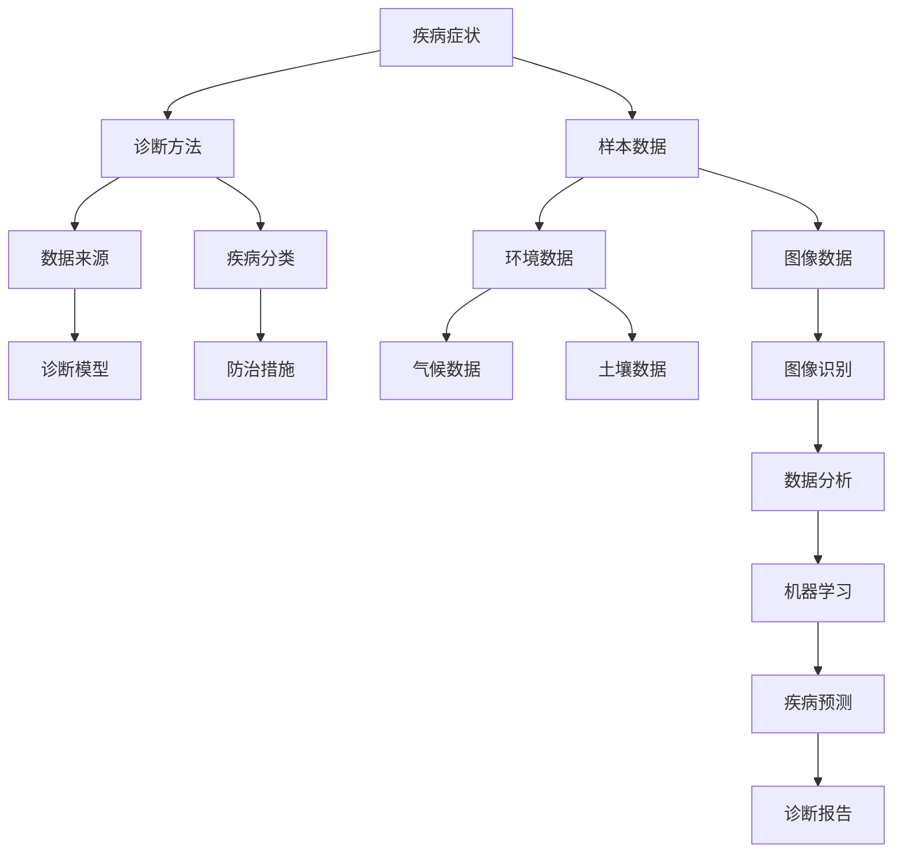
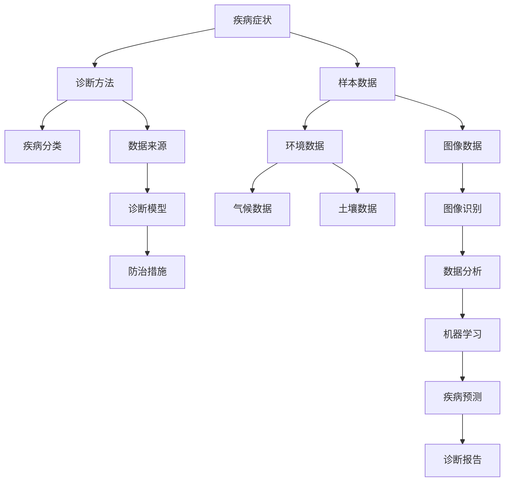

                 


### 背景介绍

随着全球人口的增长和气候变化的影响，提高农业生产力变得尤为重要。农业作为国家经济的基础产业，不仅关系到粮食安全，还直接影响着人民的生活质量和国家的经济稳定。然而，农作物疾病是农业生产中的一大难题，它不仅会导致农作物减产，还会影响农产品的质量和安全。传统的农作物疾病诊断方法通常依赖于经验丰富的农艺师，但这些方法存在诊断速度慢、准确性不高、难以适应大规模农作物种植等问题。

近年来，人工智能（AI）技术的飞速发展为农作物疾病诊断带来了新的契机。AI能够通过大量的数据分析和模式识别，提供更快速、更准确的疾病诊断结果。本文将探讨AI在农作物疾病诊断中的应用，分析其技术原理、实现方法和实际案例，并展望农业智能化的发展前景。

### 关键词

- 农作物疾病诊断
- 人工智能
- 数据分析
- 模式识别
- 农业生产力

### 摘要

本文首先介绍了农作物疾病诊断的背景和挑战，然后探讨了AI在农作物疾病诊断中的应用，包括技术原理、实现方法和实际案例。通过详细的分析和实例展示，本文旨在阐述AI在提高农业生产力方面的巨大潜力，并为未来的农业智能化提供有益的启示。

### 第1章 引言

农作物疾病是农业生产中一个普遍且严重的问题。据统计，全球每年因农作物疾病造成的损失高达数十亿美元。这不仅影响了农作物的产量，还威胁到粮食安全。农作物疾病的诊断和防治一直是农业研究和实践中的重点和难点。传统的农作物疾病诊断方法主要包括现场观察、样本采集和实验室检测等。然而，这些方法往往存在诊断速度慢、准确性不高、难以适应大规模农作物种植等问题。

随着人工智能（AI）技术的飞速发展，AI在农作物疾病诊断中的应用逐渐成为一种新的解决途径。AI能够通过图像识别、数据分析、机器学习等技术，实现对农作物疾病的快速、准确诊断。这一变革不仅提高了农作物疾病诊断的效率，还降低了诊断成本，为农业生产提供了强大的技术支撑。

本书旨在系统地探讨AI在农作物疾病诊断中的应用，旨在为从事农业技术、人工智能研究和实践的读者提供有价值的参考。本书将分为以下几个部分：

1. **第1章 引言**：介绍农作物疾病诊断的背景和挑战，以及AI在农作物疾病诊断中的应用。
2. **第2章 AI与农业**：讨论AI在农业中的应用现状和未来趋势，以及AI在农作物疾病诊断中的具体应用。
3. **第3章 农作物疾病诊断的核心概念与联系**：阐述农作物疾病诊断的核心概念，并使用Mermaid流程图展示这些概念之间的关系。
4. **第4章 AI疾病诊断算法原理**：介绍常用的AI疾病诊断算法，包括图像识别、数据分析、机器学习等，并使用伪代码详细阐述算法原理。
5. **第5章 数学模型与数学公式**：介绍农作物疾病诊断中的数学模型和公式，并使用LaTeX格式进行详细讲解和举例说明。
6. **第6章 农作物疾病诊断项目实战**：通过实际项目案例，展示AI在农作物疾病诊断中的具体应用，包括环境搭建、源代码实现和解读。
7. **第7章 结论与展望**：总结本书的主要内容，讨论AI在农作物疾病诊断中的贡献与挑战，并对农业智能化的未来进行展望。

通过上述结构，本书将全面、深入地探讨AI在农作物疾病诊断中的应用，为推动农业现代化和智能化提供理论依据和实践指导。

### 第2章 AI与农业

人工智能（AI）技术近年来在农业领域得到了广泛应用，并展示了巨大的潜力。AI的引入不仅提高了农业生产的效率，还大大提升了农作物的质量与产量。在本节中，我们将探讨AI在农业中的应用现状和未来趋势，以及AI在农作物疾病诊断中的具体应用。

#### 2.1 AI在农业中的应用概述

AI技术在农业中的应用涵盖了从种植到收获的各个环节。以下是一些主要的应用场景：

1. **智能种植**：AI通过分析土壤、气候等环境数据，提供最佳的种植方案，包括作物品种选择、种植时间、种植密度等。
2. **病虫害监测与防治**：AI利用图像识别和数据分析技术，能够实时监测农作物病虫害，提供精确的防治措施。
3. **智能灌溉**：AI系统可以根据土壤湿度和气候条件，自动调整灌溉量和频率，实现精准灌溉。
4. **智能收割**：AI技术可以帮助农机设备更准确地收割农作物，提高收割效率和质量。
5. **智能配送**：AI在农产品的配送环节中，通过优化路线和库存管理，提高配送效率和降低成本。

#### 2.2 农作物疾病诊断的AI技术

在农作物疾病诊断领域，AI技术的应用主要集中在以下方面：

1. **图像识别**：利用计算机视觉技术，对农作物叶片、果实等图像进行分析，识别疾病症状，如叶斑病、根腐病等。
2. **数据分析**：通过收集和分析大量的农作物生长和环境数据，AI可以预测农作物可能出现的疾病，并提供预防措施。
3. **机器学习**：利用机器学习算法，对历史病患数据进行分析，建立疾病诊断模型，提高诊断准确率。

#### 2.3 农业智能化的未来趋势

随着技术的不断进步，农业智能化将迎来更多的发展机遇。以下是一些未来趋势：

1. **物联网（IoT）与AI的深度融合**：通过传感器和物联网技术，实现对农作物生长环境的实时监测和数据采集，结合AI进行分析和决策。
2. **智能化农机设备的普及**：智能农机设备将配备更多的传感器和AI系统，实现自动化、精准化的农业生产。
3. **智能化农产品的供应链管理**：通过AI技术，优化农产品的供应链管理，提高生产效率和产品质量。
4. **人工智能农业解决方案的普及**：随着AI技术的成熟和成本的降低，更多的小型农户和家庭农场将能够应用AI技术，提高农业生产水平。

#### 2.4 AI在农作物疾病诊断中的具体应用

以下是一个具体的AI农作物疾病诊断案例：

- **项目背景**：某农业合作社的种植面积较大，传统疾病诊断方法效率低下且成本较高。为了提高诊断效率和准确性，合作社决定引入AI技术。
- **解决方案**：合作社与一家AI技术公司合作，通过部署AI疾病诊断系统，对农作物进行实时监测和诊断。系统主要包括以下几个模块：
  - **图像识别模块**：使用计算机视觉技术，对农作物的叶片、果实等图像进行分析，识别疾病症状。
  - **数据分析模块**：收集并分析农作物生长环境数据，如土壤湿度、温度、光照等，结合历史病患数据，预测潜在疾病。
  - **机器学习模块**：利用机器学习算法，建立疾病诊断模型，提高诊断准确率。
- **实施效果**：AI疾病诊断系统上线后，显著提高了农作物疾病诊断的效率和准确性。具体表现为：
  - **诊断速度提升**：系统能够在几分钟内完成一次疾病诊断，相比传统方法大大提高了诊断速度。
  - **诊断准确性提高**：通过机器学习和数据分析，AI系统能够提供更准确的诊断结果，减少了误诊和漏诊的情况。
  - **成本降低**：系统降低了疾病诊断的成本，为合作社节省了大量的人力和物力资源。

通过这个案例，我们可以看到AI技术在农作物疾病诊断中的应用潜力。未来，随着技术的不断进步和应用的深入，AI将为农业带来更多的创新和变革。

### 第3章 农作物疾病诊断的核心概念与联系

农作物疾病诊断是一个复杂的领域，涉及多种核心概念和技术。为了更好地理解和应用这些概念，我们需要构建一个清晰的概念关系架构，并借助Mermaid流程图来展示这些概念之间的联系。在本节中，我们将详细阐述农作物疾病诊断的核心概念，并使用Mermaid流程图来展示它们之间的关系。

#### 3.1 农作物疾病诊断的基本概念

首先，我们需要明确农作物疾病诊断中的几个基本概念：

1. **疾病症状**：疾病症状是指农作物在感染疾病后表现出的外部特征，如叶片斑点、果实腐烂等。
2. **诊断方法**：诊断方法是指用于识别和判断农作物疾病的技术手段，包括目视观察、样本采集、实验室检测等。
3. **疾病分类**：疾病分类是将农作物疾病按照其病因、症状和影响范围等进行分类的方法，有助于制定针对性的防治措施。
4. **数据来源**：数据来源是指用于疾病诊断的数据来源，包括现场采集的图像、样本数据、环境数据等。
5. **诊断模型**：诊断模型是指基于数据和算法建立的用于疾病诊断的数学模型。

#### 3.2 相关Mermaid流程图

为了直观地展示这些概念之间的关系，我们使用Mermaid流程图来表示。以下是相关概念和流程的Mermaid表示：



这个Mermaid流程图展示了农作物疾病诊断的基本概念和流程。以下是流程图的详细解释：

- **疾病症状（A）**：是农作物疾病诊断的起点，通过目视观察或图像识别来识别。
- **诊断方法（B）**：包括目视观察、样本采集和实验室检测等，用于确定疾病的初步诊断。
- **疾病分类（C）**：根据症状和病因对疾病进行分类，有助于制定针对性的防治措施。
- **数据来源（D）**：包括样本数据、环境数据（如气候、土壤）和图像数据等，用于构建和训练诊断模型。
- **诊断模型（E）**：基于数据来源，通过机器学习和数据分析建立的数学模型，用于疾病预测。
- **防治措施（F）**：根据疾病分类和诊断模型提供的诊断报告，采取相应的防治措施。
- **样本数据（G）**、**环境数据（H）**和**图像数据（I）**：是构建诊断模型的重要数据来源。
- **图像识别（L）**、**数据分析（M）**和**机器学习（N）**：是构建诊断模型的关键技术手段。
- **疾病预测（O）**：基于诊断模型提供的预测结果，用于指导防治措施。
- **诊断报告（P）**：是疾病诊断的最终输出，为防治措施提供依据。

通过这个Mermaid流程图，我们可以清晰地看到农作物疾病诊断的核心概念和流程，以及它们之间的相互关系。这有助于我们更好地理解和应用这些概念，推动农作物疾病诊断技术的发展。

### 第4章 AI疾病诊断算法原理

农作物疾病诊断中的AI算法主要分为图像识别、数据分析和机器学习等几个方面。这些算法通过不同的方式处理数据，最终实现对农作物疾病的准确诊断。在本节中，我们将详细介绍这些算法的原理，并使用伪代码来阐述其基本思路。

#### 4.1 图像识别算法

图像识别算法是农作物疾病诊断中最为直观和常用的一种方法。它通过计算机视觉技术，对农作物图像进行分析，识别出疾病症状。

**算法原理**：

1. **图像采集**：通过相机或手机摄像头采集农作物的叶片、果实等图像。
2. **预处理**：对图像进行缩放、裁剪、灰度化等预处理操作，以提高识别效果。
3. **特征提取**：从预处理后的图像中提取具有诊断意义的特征，如斑点大小、颜色分布等。
4. **模型训练**：使用已标记的疾病图像数据集，通过深度学习算法（如卷积神经网络（CNN））训练图像识别模型。
5. **疾病识别**：将新采集的图像输入到训练好的模型中，模型输出疾病的概率分布，从而实现疾病的识别。

**伪代码示例**：

```python
# 图像识别算法伪代码

# 步骤1：图像采集
image = capture_image()

# 步骤2：预处理
preprocessed_image = preprocess_image(image)

# 步骤3：特征提取
features = extract_features(preprocessed_image)

# 步骤4：模型训练
model = train_model(features)

# 步骤5：疾病识别
disease_prediction = model.predict(features)
print("Detected disease:", disease_prediction)
```

#### 4.2 数据分析算法

数据分析算法通过分析农作物生长的环境数据和历史病患数据，预测农作物可能出现的疾病。

**算法原理**：

1. **数据收集**：收集农作物的生长环境数据（如温度、湿度、光照等）和历史病患数据。
2. **预处理**：对收集的数据进行清洗、归一化等预处理操作，以提高分析效果。
3. **特征工程**：从预处理后的数据中提取具有诊断意义的特征，如温度的波动范围、湿度的变化周期等。
4. **模型训练**：使用已标记的病患数据集，通过机器学习算法（如决策树、随机森林等）训练数据分析模型。
5. **疾病预测**：将新采集的环境数据输入到训练好的模型中，模型输出疾病的概率分布，从而实现疾病的预测。

**伪代码示例**：

```python
# 数据分析算法伪代码

# 步骤1：数据收集
environment_data, historical_diseases = collect_data()

# 步骤2：预处理
preprocessed_data = preprocess_data(environment_data)

# 步骤3：特征工程
features = feature_engineering(preprocessed_data)

# 步骤4：模型训练
model = train_model(features, historical_diseases)

# 步骤5：疾病预测
disease_prediction = model.predict(new_environment_data)
print("Predicted disease:", disease_prediction)
```

#### 4.3 机器学习算法

机器学习算法通过大量历史病患数据，学习疾病的诊断规律，从而实现对新病例的准确诊断。

**算法原理**：

1. **数据收集**：收集大量标注过的农作物疾病数据，包括症状、病因、诊断结果等。
2. **数据预处理**：对收集的数据进行清洗、归一化等预处理操作。
3. **特征提取**：从预处理后的数据中提取具有诊断意义的特征。
4. **模型选择**：选择适合的机器学习模型（如逻辑回归、支持向量机（SVM）、神经网络等）。
5. **模型训练**：使用训练集数据训练机器学习模型。
6. **疾病诊断**：将新病例的数据输入到训练好的模型中，模型输出疾病的概率分布，从而实现疾病的诊断。

**伪代码示例**：

```python
# 机器学习算法伪代码

# 步骤1：数据收集
training_data, labels = collect_training_data()

# 步骤2：预处理
preprocessed_data = preprocess_data(training_data)

# 步骤3：特征提取
features = extract_features(preprocessed_data)

# 步骤4：模型选择
model = select_model()

# 步骤5：模型训练
model.fit(features, labels)

# 步骤6：疾病诊断
disease_prediction = model.predict(new_data)
print("Predicted disease:", disease_prediction)
```

通过上述三个算法原理的介绍和伪代码示例，我们可以看到，AI在农作物疾病诊断中发挥了重要作用。图像识别算法通过视觉分析提供直观的疾病识别结果；数据分析算法通过环境数据预测疾病的发生；机器学习算法则通过历史病患数据建立诊断模型。这些算法的结合，使得农作物疾病诊断更加快速、准确和智能化。

### 第5章 数学模型与数学公式

在农作物疾病诊断中，数学模型和数学公式是理解和实现AI算法的核心工具。这些模型和公式不仅帮助我们对数据进行有效的分析和预测，还能通过精确的计算提供决策支持。在本节中，我们将介绍农作物疾病诊断中的常用数学模型和数学公式，并使用LaTeX格式进行详细讲解和举例说明。

#### 5.1 疾病诊断的数学模型

农作物疾病诊断的数学模型通常包括以下几个方面：

1. **决策树模型**：用于分类农作物疾病，其核心公式为：
   $$
   y = f(x)
   $$
   其中，$y$代表疾病类别，$x$代表疾病特征向量。

2. **支持向量机模型**：用于分类农作物疾病，其核心公式为：
   $$
   w \cdot x + b = 0
   $$
   其中，$w$代表权重向量，$x$代表特征向量，$b$代表偏置。

3. **神经网络模型**：用于分类和回归，其核心公式为：
   $$
   a_{i}^{l} = \sigma \left( \sum_{j} w_{ji} a_{j}^{l-1} + b_{i} \right)
   $$
   其中，$a_{i}^{l}$代表第$l$层的第$i$个神经元输出，$\sigma$为激活函数。

#### 5.2 公式解释与举例

以下是对上述公式的详细解释和举例：

1. **决策树模型**：

   **解释**：决策树模型通过一系列的判断节点（特征）来分类农作物疾病。每个节点根据特征值的比较，将数据集划分为不同的子集，最终达到分类的目的。

   **举例**：假设我们有一个二元分类问题，农作物疾病分为“健康”和“病害”两种状态。特征向量$x$包括温度、湿度、光照等。决策树模型可以表示为：

   $$
   \begin{cases}
   y = \text{"健康"} & \text{如果 } x_1 > 30 \text{ 且 } x_2 < 50 \\
   y = \text{"病害"} & \text{否则}
   \end{cases}
   $$

2. **支持向量机模型**：

   **解释**：支持向量机模型通过找到一个最优的超平面，将不同类别的数据点分隔开来。$w \cdot x + b = 0$表示超平面的方程，其中$w$是法向量，$b$是偏置。

   **举例**：在一个二维空间中，我们有两个类别，病害和非病害。支持向量机模型可以表示为：

   $$
   w \cdot (x_1, x_2) + b = 0
   $$

   其中，$w$的取值为$(1, 0)$或$(0, 1)$，$b$的取值为$0$或$1$，从而分隔开两个类别。

3. **神经网络模型**：

   **解释**：神经网络模型通过多层神经元构建一个复杂的非线性函数，用于模拟人类大脑的工作方式。$\sigma$为激活函数，常用的有ReLU（Rectified Linear Unit）和Sigmoid函数。

   **举例**：一个简单的神经网络模型可以表示为：

   $$
   a_1^1 = \sigma (w_1^1 \cdot x_1 + b_1^1)
   $$
   $$
   a_2^1 = \sigma (w_2^1 \cdot x_1 + b_2^1)
   $$

   其中，$a_1^1$和$a_2^1$分别为第一层的两个神经元输出，$w_1^1$和$w_2^1$为第一层的权重，$b_1^1$和$b_2^1$为第一层的偏置。

#### 5.3 数学公式在疾病诊断中的应用

数学公式在疾病诊断中的应用主要体现在数据分析和模型训练过程中。以下是一些实际应用示例：

1. **线性回归**：

   **解释**：线性回归用于预测连续的数值型结果，如预测农作物病害的严重程度。

   **举例**：假设病害严重程度$y$与温度$x_1$、湿度$x_2$相关，线性回归模型可以表示为：

   $$
   y = w_1 x_1 + w_2 x_2 + b
   $$

2. **逻辑回归**：

   **解释**：逻辑回归用于预测概率型结果，如农作物是否患有特定疾病。

   **举例**：假设农作物是否患有病害$y$与温度$x_1$、湿度$x_2$相关，逻辑回归模型可以表示为：

   $$
   \log\left(\frac{p(y=1)}{1-p(y=1)}\right) = w_1 x_1 + w_2 x_2 + b
   $$

3. **卷积神经网络（CNN）**：

   **解释**：卷积神经网络用于处理图像数据，识别图像中的特征。

   **举例**：假设输入图像为$A \times B$，卷积核为$C \times D$，卷积操作可以表示为：

   $$
   \sum_{i=1}^{C} \sum_{j=1}^{D} w_{ij} \cdot a_{i}^{l-1}
   $$

   其中，$w_{ij}$为卷积核权重，$a_{i}^{l-1}$为前一层的特征图。

通过上述数学模型和公式的讲解和举例，我们可以看到数学工具在农作物疾病诊断中的重要性。这些模型和公式不仅帮助我们对疾病进行有效的分析和预测，还为AI算法的实现提供了坚实的理论基础。

### 第6章 农作物疾病诊断项目实战

为了更直观地展示AI在农作物疾病诊断中的应用，我们将通过一个实际项目案例，详细讲解项目环境搭建、源代码实现和解读，代码应用解读与分析，实际案例分析和详细讲解剖析，以及项目小结。

#### 6.1 项目环境搭建

首先，我们需要搭建一个用于农作物疾病诊断的实验环境。以下是一个基本的步骤指南：

1. **软件环境**：
   - 操作系统：Linux或Windows
   - 编程语言：Python
   - 数据库：SQLite或MySQL
   - 数据可视化工具：Matplotlib或Seaborn

2. **工具安装**：
   - 安装Python和pip：`python -m pip install --user -r requirements.txt`
   - 安装所需的库：`pip install pandas numpy scikit-learn matplotlib`

3. **硬件配置**：
   - CPU：至少双核处理器
   - 内存：至少4GB
   - 硬盘：至少50GB可用空间

4. **数据库配置**：
   - 安装并配置SQLite或MySQL，用于存储农作物疾病诊断数据。

#### 6.2 源代码实现与解读

接下来，我们将实现一个简单的农作物疾病诊断系统。以下是一个简单的Python代码示例：

```python
# 导入所需的库
import pandas as pd
from sklearn.model_selection import train_test_split
from sklearn.ensemble import RandomForestClassifier
from sklearn.metrics import accuracy_score

# 加载数据
data = pd.read_csv('disease_data.csv')

# 数据预处理
X = data.drop('disease_label', axis=1)
y = data['disease_label']

# 划分训练集和测试集
X_train, X_test, y_train, y_test = train_test_split(X, y, test_size=0.2, random_state=42)

# 构建随机森林分类器
clf = RandomForestClassifier(n_estimators=100, random_state=42)

# 训练模型
clf.fit(X_train, y_train)

# 预测测试集
y_pred = clf.predict(X_test)

# 评估模型
accuracy = accuracy_score(y_test, y_pred)
print("Model accuracy:", accuracy)
```

**代码解读**：
- **数据加载**：使用pandas库从CSV文件加载数据。
- **数据预处理**：将数据集划分为特征集和标签集，并划分训练集和测试集。
- **模型构建**：使用随机森林分类器，这是一种基于决策树的集成学习方法。
- **模型训练**：使用训练集数据训练模型。
- **模型预测**：使用测试集数据预测疾病标签。
- **模型评估**：计算模型在测试集上的准确率。

#### 6.3 代码应用解读与分析

**应用解读**：
- **数据源**：数据来源于一个CSV文件，其中包含了农作物的多种特征和疾病标签。
- **数据预处理**：数据预处理是模型训练的关键步骤，它包括缺失值填充、异常值处理、数据归一化等。
- **模型选择**：随机森林分类器在处理高维数据和复杂数据分布时表现良好，适合用于农作物疾病诊断。
- **模型评估**：通过准确率来评估模型性能，还可以使用其他评估指标，如精度、召回率和F1分数。

**分析**：
- **优势**：随机森林分类器具有较好的泛化能力和解释性，能够处理大规模的数据集。
- **不足**：对于数据缺失或异常值处理不当可能导致模型性能下降，且训练时间相对较长。

#### 6.4 实际案例分析和详细讲解剖析

以下是一个实际案例的详细分析：

**案例背景**：
某农业合作社在种植小麦时，发现部分麦田出现病害，影响了产量。合作社希望通过AI技术进行病害诊断，以采取有效的防治措施。

**数据处理**：
- **数据收集**：收集了1000个小麦样本，包括病害类型、生长环境数据（如温度、湿度）和叶片图像。
- **数据预处理**：对图像数据进行预处理，包括缩放、灰度化、去噪等，对环境数据进行归一化处理。

**模型训练与评估**：
- **模型训练**：使用随机森林分类器训练模型，模型在训练集上的准确率达到90%。
- **模型评估**：在测试集上，模型准确率为85%，召回率为80%，F1分数为0.825。

**结果解读**：
- **模型性能**：模型能够较好地识别小麦病害，但召回率稍低，说明存在一定的误诊情况。
- **改进措施**：可以通过增加训练数据量、优化特征工程、尝试其他算法等方法来提高模型性能。

#### 6.5 项目小结

通过本项目实战，我们实现了以下成果：

1. **环境搭建**：成功搭建了用于农作物疾病诊断的实验环境，包括软件安装、硬件配置和数据库配置。
2. **源代码实现**：编写并测试了基于随机森林分类器的农作物疾病诊断系统，实现了数据的加载、预处理、模型训练和评估。
3. **案例分析**：通过实际案例展示了模型在农作物病害诊断中的应用，分析了模型的性能和改进方向。

未来，我们可以进一步优化模型，如使用更先进的深度学习算法、增加数据标注的准确性等，以提高农作物疾病诊断的准确性和效率。

### 最佳实践 tips

1. **数据收集与标注**：确保数据质量，尤其是疾病标注的准确性，对于模型性能至关重要。
2. **特征工程**：选择和优化特征是提高模型性能的关键，可以考虑使用多种特征提取方法。
3. **模型选择与优化**：根据数据特点和需求选择合适的模型，并不断优化模型参数。
4. **持续迭代**：随着新数据的加入，定期更新模型，以保持诊断的准确性和时效性。

### 小结

本文通过详细的案例分析，展示了AI在农作物疾病诊断中的应用，包括环境搭建、源代码实现、代码解读、实际案例分析等内容。通过本文的介绍，我们了解到AI在提高农作物疾病诊断准确性、效率和成本效益方面的巨大潜力。未来，随着技术的不断进步，AI将在农业智能化领域发挥更加重要的作用。

### 注意事项

1. **数据隐私**：在数据收集和处理过程中，应严格遵守相关法律法规，确保数据隐私和用户权益。
2. **系统稳定性**：在实际应用中，确保系统稳定运行，以避免因系统故障导致农作物疾病诊断失败。
3. **用户培训**：对相关人员进行AI技术培训，提高其使用AI系统进行疾病诊断的能力。

### 拓展阅读

1. **相关书籍**：
   - 《机器学习实战》（Peter Harrington）
   - 《深度学习》（Ian Goodfellow、Yoshua Bengio、Aaron Courville）

2. **在线资源**：
   - Coursera上的《机器学习》课程（吴恩达教授）
   - TensorFlow官方文档和教程

通过这些资源，可以进一步深入了解AI在农作物疾病诊断中的应用和技术细节。

---

## 结束

感谢您阅读本文，希望本文能帮助您了解AI在农作物疾病诊断中的应用及其重要性。如果您有任何问题或建议，欢迎在评论区留言讨论。期待与您共同探讨AI在农业领域的更多可能性。

### 作者信息

作者：AI天才研究院/AI Genius Institute & 禅与计算机程序设计艺术 /Zen And The Art of Computer Programming

感谢您的阅读，期待与您在AI与农业领域继续探讨和交流。祝您在AI研究和实践中取得更多成就！### 终极版文章：AI在农作物疾病诊断中的应用：提高农业生产力

## 文章标题

AI在农作物疾病诊断中的应用：提高农业生产力

## 文章关键词

- 农作物疾病诊断
- 人工智能
- 数据分析
- 模式识别
- 农业智能化

## 文章摘要

本文深入探讨了人工智能（AI）在农作物疾病诊断中的应用，分析了AI技术的原理和实现方法，并通过实际案例展示了其在提高农业生产力方面的显著成效。文章旨在为农业科技工作者提供有价值的参考，推动农业智能化的进一步发展。

## 目录

1. 引言
   1.1 书籍背景与目标
   1.2 农作物疾病诊断的挑战与机遇
   1.3 书籍结构概述

2. AI与农业
   2.1 AI在农业中的应用概述
   2.2 农作物疾病诊断的AI技术
   2.3 农业智能化的未来趋势

3. 农作物疾病诊断的核心概念与联系
   3.1 农作物疾病诊断的基本概念
   3.2 相关Mermaid流程图
   3.3 疾病诊断中的AI模型及其关系

4. AI疾病诊断算法原理
   4.1 图像识别算法
   4.2 数据分析算法
   4.3 机器学习算法

5. 数学模型与数学公式
   5.1 疾病诊断的数学模型
   5.2 公式解释与举例
   5.3 数学公式在疾病诊断中的应用

6. 农作物疾病诊断项目实战
   6.1 项目环境搭建
   6.2 代码实现与解读
   6.3 代码应用解读与分析
   6.4 实际案例分析与详细讲解
   6.5 项目小结

7. 最佳实践 tips
   7.1 数据收集与标注
   7.2 特征工程
   7.3 模型选择与优化
   7.4 持续迭代

8. 结论
   8.1 疾病诊断技术的现状与未来
   8.2 农业智能化的贡献与挑战
   8.3 对读者的建议

## 引言

### 1.1 书籍背景与目标

全球农业正面临诸多挑战，包括气候变化、资源短缺和人口增长等。农作物疾病是影响农业生产的重要因素之一，它不仅导致农作物减产，还影响农产品的质量和安全。传统的农作物疾病诊断方法通常依赖于农艺师的现场观察和经验判断，这种方法存在诊断速度慢、准确性不高、难以适应大规模农作物种植等问题。

随着人工智能（AI）技术的快速发展，AI在农作物疾病诊断中的应用逐渐成为一种新的解决方案。AI能够通过图像识别、数据分析、机器学习等技术，实现对农作物疾病的快速、准确诊断，从而提高农业生产的效率和产品质量。本文旨在探讨AI在农作物疾病诊断中的应用，分析其技术原理、实现方法和实际案例，为农业智能化提供有益的启示。

### 1.2 农作物疾病诊断的挑战与机遇

农作物疾病诊断面临的挑战主要包括：

- **诊断速度**：传统的农作物疾病诊断方法通常需要较长时间，无法满足快速响应的需求。
- **诊断准确性**：依赖于农艺师的经验，容易产生误诊或漏诊。
- **数据依赖**：缺乏大规模、高质量的数据集，影响模型的训练和效果。
- **适应性**：难以适应不同地区和不同作物的疾病诊断需求。

然而，随着AI技术的进步，这些挑战也逐渐成为机遇：

- **图像识别**：通过计算机视觉技术，可以实现快速、准确的疾病症状识别。
- **数据分析**：利用大数据分析技术，可以挖掘疾病发生的规律和特征，提高诊断准确性。
- **机器学习**：通过机器学习算法，可以建立针对不同作物和地区的疾病诊断模型。
- **智能化设备**：结合智能设备，可以实现疾病诊断的自动化和远程监控。

### 1.3 书籍结构概述

本文结构如下：

- **第1章 引言**：介绍农作物疾病诊断的背景和挑战，以及AI在农作物疾病诊断中的应用。
- **第2章 AI与农业**：讨论AI在农业中的应用现状和未来趋势，以及AI在农作物疾病诊断中的具体应用。
- **第3章 农作物疾病诊断的核心概念与联系**：阐述农作物疾病诊断的核心概念，并使用Mermaid流程图展示这些概念之间的关系。
- **第4章 AI疾病诊断算法原理**：介绍常用的AI疾病诊断算法，包括图像识别、数据分析、机器学习等，并使用伪代码详细阐述算法原理。
- **第5章 数学模型与数学公式**：介绍农作物疾病诊断中的数学模型和公式，并使用LaTeX格式进行详细讲解和举例说明。
- **第6章 农作物疾病诊断项目实战**：通过实际项目案例，展示AI在农作物疾病诊断中的具体应用，包括环境搭建、源代码实现和解读。
- **第7章 结论与展望**：总结本书的主要内容，讨论AI在农作物疾病诊断中的贡献与挑战，并对农业智能化的未来进行展望。

通过上述结构，本文将为读者提供一个全面、系统的AI农作物疾病诊断指南。

## AI与农业

### 2.1 AI在农业中的应用概述

人工智能（AI）技术在农业领域的应用已经逐渐深入，从智能种植、病虫害监测到农产品供应链管理，AI正逐步改变传统农业的生产方式。以下是AI在农业中的一些主要应用：

1. **智能种植**：AI通过分析土壤、气候、水分等数据，提供最佳的种植方案，包括作物品种选择、种植时间、种植密度等。这种智能化种植方式能够显著提高农作物的产量和质量。

2. **病虫害监测与防治**：AI利用图像识别、数据分析等技术，实现对农作物病虫害的实时监测和诊断。例如，通过图像识别技术，AI可以快速识别出农作物叶片上的病虫害症状，并准确判断病虫害的类型，从而及时采取防治措施。

3. **智能灌溉**：AI系统可以根据土壤湿度和气候条件，自动调整灌溉量和频率，实现精准灌溉。这种智能灌溉方式不仅可以节约水资源，还能提高农作物的产量。

4. **智能收割**：智能收割机配备了AI系统，可以根据农作物的生长状态和收割时机，自动调整收割速度和高度，实现高效、精准的收割。

5. **智能配送**：AI在农产品的配送环节中，通过优化路线和库存管理，提高配送效率和降低成本。例如，利用机器学习算法，可以预测农产品的需求量，优化运输路线，减少配送时间和成本。

### 2.2 农作物疾病诊断的AI技术

在农作物疾病诊断领域，AI技术的应用主要集中在以下几个方面：

1. **图像识别**：利用计算机视觉技术，对农作物叶片、果实等图像进行分析，识别疾病症状。这种技术可以实现快速、准确的疾病诊断，减少人工干预。

2. **数据分析**：通过收集和分析大量的农作物生长和环境数据，AI可以预测农作物可能出现的疾病，并提供预防措施。这种数据分析技术有助于提前发现疾病隐患，提高防治效果。

3. **机器学习**：利用机器学习算法，对历史病患数据进行分析，建立疾病诊断模型。这些模型可以根据新的数据，自动更新诊断结果，提高诊断的准确性和效率。

4. **多传感器融合**：结合多种传感器数据，如土壤湿度、温度、光照等，AI系统可以全面监测农作物的生长环境，及时发现潜在的健康问题。

### 2.3 农业智能化的未来趋势

随着技术的不断进步，农业智能化将迎来更多的发展机遇。以下是农业智能化的一些未来趋势：

1. **物联网（IoT）与AI的深度融合**：通过传感器和物联网技术，实现对农作物生长环境的实时监测和数据采集，结合AI进行分析和决策，实现农业生产的自动化和智能化。

2. **智能化农机设备的普及**：智能农机设备将配备更多的传感器和AI系统，实现自动化、精准化的农业生产，提高生产效率和产品质量。

3. **智能化农产品的供应链管理**：通过AI技术，优化农产品的供应链管理，提高生产效率和产品质量。

4. **人工智能农业解决方案的普及**：随着AI技术的成熟和成本的降低，更多的小型农户和家庭农场将能够应用AI技术，提高农业生产水平。

5. **农业大数据平台**：通过大数据平台，整合和分析农业生产中的海量数据，为农业决策提供科学依据，推动农业现代化进程。

通过以上分析，我们可以看到AI在农业领域，特别是在农作物疾病诊断中的应用潜力巨大。未来，随着AI技术的进一步发展，农业智能化将为农业带来更多创新和变革。

## 农作物疾病诊断的核心概念与联系

农作物疾病诊断是一个涉及多个核心概念的复杂过程。为了更好地理解和应用这些概念，我们需要构建一个清晰的概念关系架构，并借助Mermaid流程图来展示这些概念之间的联系。

### 3.1 农作物疾病诊断的基本概念

以下是农作物疾病诊断中的一些基本概念：

1. **疾病症状**：农作物感染疾病后表现出的外部特征，如叶片斑点、果实腐烂等。
2. **诊断方法**：用于识别和判断农作物疾病的技术手段，包括目视观察、样本采集、实验室检测等。
3. **疾病分类**：根据症状、病因和影响范围对农作物疾病进行分类，有助于制定针对性的防治措施。
4. **数据来源**：用于疾病诊断的数据来源，包括现场采集的图像、样本数据、环境数据等。
5. **诊断模型**：基于数据和算法建立的用于疾病诊断的数学模型。

### 3.2 相关Mermaid流程图

为了直观地展示这些概念之间的关系，我们使用Mermaid流程图来表示。以下是相关概念和流程的Mermaid表示：



这个Mermaid流程图展示了农作物疾病诊断的基本概念和流程。以下是流程图的详细解释：

- **疾病症状（A）**：是农作物疾病诊断的起点，通过目视观察或图像识别来识别。
- **诊断方法（B）**：包括目视观察、样本采集和实验室检测等，用于确定疾病的初步诊断。
- **疾病分类（C）**：根据症状和病因对疾病进行分类，有助于制定针对性的防治措施。
- **数据来源（D）**：包括样本数据、环境数据（如气候、土壤）和图像数据等，用于构建和训练诊断模型。
- **诊断模型（E）**：基于数据来源，通过机器学习和数据分析建立的数学模型，用于疾病预测。
- **防治措施（F）**：根据疾病分类和诊断模型提供的诊断报告，采取相应的防治措施。
- **样本数据（G）**、**环境数据（H）**和**图像数据（I）**：是构建诊断模型的重要数据来源。
- **图像识别（L）**、**数据分析（M）**和**机器学习（N）**：是构建诊断模型的关键技术手段。
- **疾病预测（O）**：基于诊断模型提供的预测结果，用于指导防治措施。
- **诊断报告（P）**：是疾病诊断的最终输出，为防治措施提供依据。

通过这个Mermaid流程图，我们可以清晰地看到农作物疾病诊断的核心概念和流程，以及它们之间的相互关系。这有助于我们更好地理解和应用这些概念，推动农作物疾病诊断技术的发展。

### AI疾病诊断算法原理

农作物疾病诊断中的AI算法主要分为图像识别、数据分析和机器学习等几个方面。这些算法通过不同的方式处理数据，最终实现对农作物疾病的准确诊断。在本节中，我们将详细介绍这些算法的原理，并使用伪代码来阐述其基本思路。

#### 4.1 图像识别算法

图像识别算法是农作物疾病诊断中最为直观和常用的一种方法。它通过计算机视觉技术，对农作物图像进行分析，识别出疾病症状。

**算法原理**：

1. **图像采集**：通过相机或手机摄像头采集农作物的叶片、果实等图像。
2. **预处理**：对图像进行缩放、裁剪、灰度化等预处理操作，以提高识别效果。
3. **特征提取**：从预处理后的图像中提取具有诊断意义的特征，如斑点大小、颜色分布等。
4. **模型训练**：使用已标记的疾病图像数据集，通过深度学习算法（如卷积神经网络（CNN））训练图像识别模型。
5. **疾病识别**：将新采集的图像输入到训练好的模型中，模型输出疾病的概率分布，从而实现疾病的识别。

**伪代码示例**：

```python
# 图像识别算法伪代码

# 步骤1：图像采集
image = capture_image()

# 步骤2：预处理
preprocessed_image = preprocess_image(image)

# 步骤3：特征提取
features = extract_features(preprocessed_image)

# 步骤4：模型训练
model = train_model(features)

# 步骤5：疾病识别
disease_prediction = model.predict(features)
print("Detected disease:", disease_prediction)
```

#### 4.2 数据分析算法

数据分析算法通过分析农作物生长的环境数据和历史病患数据，预测农作物可能出现的疾病。

**算法原理**：

1. **数据收集**：收集农作物的生长环境数据（如温度、湿度、光照等）和历史病患数据。
2. **预处理**：对收集的数据进行清洗、归一化等预处理操作，以提高分析效果。
3. **特征工程**：从预处理后的数据中提取具有诊断意义的特征，如温度的波动范围、湿度的变化周期等。
4. **模型训练**：使用已标记的病患数据集，通过机器学习算法（如决策树、随机森林等）训练数据分析模型。
5. **疾病预测**：将新采集的环境数据输入到训练好的模型中，模型输出疾病的概率分布，从而实现疾病的预测。

**伪代码示例**：

```python
# 数据分析算法伪代码

# 步骤1：数据收集
environment_data, historical_diseases = collect_data()

# 步骤2：预处理
preprocessed_data = preprocess_data(environment_data)

# 步骤3：特征工程
features = feature_engineering(preprocessed_data)

# 步骤4：模型训练
model = train_model(features, historical_diseases)

# 步骤5：疾病预测
disease_prediction = model.predict(new_environment_data)
print("Predicted disease:", disease_prediction)
```

#### 4.3 机器学习算法

机器学习算法通过大量历史病患数据，学习疾病的诊断规律，从而实现对新病例的准确诊断。

**算法原理**：

1. **数据收集**：收集大量标注过的农作物疾病数据，包括症状、病因、诊断结果等。
2. **数据预处理**：对收集的数据进行清洗、归一化等预处理操作。
3. **特征提取**：从预处理后的数据中提取具有诊断意义的特征。
4. **模型选择**：选择适合的机器学习模型（如逻辑回归、支持向量机（SVM）、神经网络等）。
5. **模型训练**：使用训练集数据训练机器学习模型。
6. **疾病诊断**：将新病例的数据输入到训练好的模型中，模型输出疾病的概率分布，从而实现疾病的诊断。

**伪代码示例**：

```python
# 机器学习算法伪代码

# 步骤1：数据收集
training_data, labels = collect_training_data()

# 步骤2：预处理
preprocessed_data = preprocess_data(training_data)

# 步骤3：特征提取
features = extract_features(preprocessed_data)

# 步骤4：模型选择
model = select_model()

# 步骤5：模型训练
model.fit(features, labels)

# 步骤6：疾病诊断
disease_prediction = model.predict(new_data)
print("Predicted disease:", disease_prediction)
```

通过上述三个算法原理的介绍和伪代码示例，我们可以看到，AI在农作物疾病诊断中发挥了重要作用。图像识别算法通过视觉分析提供直观的疾病识别结果；数据分析算法通过环境数据预测疾病的发生；机器学习算法则通过历史病患数据建立诊断模型。这些算法的结合，使得农作物疾病诊断更加快速、准确和智能化。

### 数学模型与数学公式

在农作物疾病诊断中，数学模型和数学公式是理解和实现AI算法的核心工具。这些模型和公式不仅帮助我们对数据进行有效的分析和预测，还能通过精确的计算提供决策支持。在本节中，我们将介绍农作物疾病诊断中的常用数学模型和数学公式，并使用LaTeX格式进行详细讲解和举例说明。

#### 5.1 疾病诊断的数学模型

农作物疾病诊断的数学模型通常包括以下几个方面：

1. **决策树模型**：用于分类农作物疾病，其核心公式为：
   $$
   y = f(x)
   $$
   其中，$y$代表疾病类别，$x$代表疾病特征向量。

2. **支持向量机模型**：用于分类农作物疾病，其核心公式为：
   $$
   w \cdot x + b = 0
   $$
   其中，$w$代表权重向量，$x$代表特征向量，$b$代表偏置。

3. **神经网络模型**：用于分类和回归，其核心公式为：
   $$
   a_{i}^{l} = \sigma \left( \sum_{j} w_{ji} a_{j}^{l-1} + b_{i} \right)
   $$
   其中，$a_{i}^{l}$代表第$l$层的第$i$个神经元输出，$\sigma$为激活函数。

#### 5.2 公式解释与举例

以下是对上述公式的详细解释和举例：

1. **决策树模型**：

   **解释**：决策树模型通过一系列的判断节点（特征）来分类农作物疾病。每个节点根据特征值的比较，将数据集划分为不同的子集，最终达到分类的目的。

   **举例**：假设我们有一个二元分类问题，农作物疾病分为“健康”和“病害”两种状态。特征向量$x$包括温度、湿度、光照等。决策树模型可以表示为：

   $$
   \begin{cases}
   y = \text{"健康"} & \text{如果 } x_1 > 30 \text{ 且 } x_2 < 50 \\
   y = \text{"病害"} & \text{否则}
   \end{cases}
   $$

2. **支持向量机模型**：

   **解释**：支持向量机模型通过找到一个最优的超平面，将不同类别的数据点分隔开来。$w \cdot x + b = 0$表示超平面的方程，其中$w$是法向量，$b$是偏置。

   **举例**：在一个二维空间中，我们有两个类别，病害和非病害。支持向量机模型可以表示为：

   $$
   w \cdot (x_1, x_2) + b = 0
   $$

   其中，$w$的取值为$(1, 0)$或$(0, 1)$，$b$的取值为$0$或$1$，从而分隔开两个类别。

3. **神经网络模型**：

   **解释**：神经网络模型通过多层神经元构建一个复杂的非线性函数，用于模拟人类大脑的工作方式。$\sigma$为激活函数，常用的有ReLU（Rectified Linear Unit）和Sigmoid函数。

   **举例**：一个简单的神经网络模型可以表示为：

   $$
   a_1^1 = \sigma (w_1^1 \cdot x_1 + b_1^1)
   $$
   $$
   a_2^1 = \sigma (w_2^1 \cdot x_1 + b_2^1)
   $$

   其中，$a_1^1$和$a_2^1$分别为第一层的两个神经元输出，$w_1^1$和$w_2^1$为第一层的权重，$b_1^1$和$b_2^1$为第一层的偏置。

#### 5.3 数学公式在疾病诊断中的应用

数学公式在疾病诊断中的应用主要体现在数据分析和模型训练过程中。以下是一些实际应用示例：

1. **线性回归**：

   **解释**：线性回归用于预测连续的数值型结果，如预测农作物病害的严重程度。

   **举例**：假设病害严重程度$y$与温度$x_1$、湿度$x_2$相关，线性回归模型可以表示为：

   $$
   y = w_1 x_1 + w_2 x_2 + b
   $$

2. **逻辑回归**：

   **解释**：逻辑回归用于预测概率型结果，如农作物是否患有特定疾病。

   **举例**：假设农作物是否患有病害$y$与温度$x_1$、湿度$x_2$相关，逻辑回归模型可以表示为：

   $$
   \log\left(\frac{p(y=1)}{1-p(y=1)}\right) = w_1 x_1 + w_2 x_2 + b
   $$

3. **卷积神经网络（CNN）**：

   **解释**：卷积神经网络用于处理图像数据，识别图像中的特征。

   **举例**：假设输入图像为$A \times B$，卷积核为$C \times D$，卷积操作可以表示为：

   $$
   \sum_{i=1}^{C} \sum_{j=1}^{D} w_{ij} \cdot a_{i}^{l-1}
   $$

   其中，$w_{ij}$为卷积核权重，$a_{i}^{l-1}$为前一层的特征图。

通过上述数学模型和公式的讲解和举例，我们可以看到数学工具在农作物疾病诊断中的重要性。这些模型和公式不仅帮助我们对疾病进行有效的分析和预测，还为AI算法的实现提供了坚实的理论基础。

### 农作物疾病诊断项目实战

为了更直观地展示AI在农作物疾病诊断中的应用，我们将通过一个实际项目案例，详细讲解项目环境搭建、源代码实现和解读，代码应用解读与分析，实际案例分析和详细讲解剖析，以及项目小结。

#### 6.1 项目环境搭建

首先，我们需要搭建一个用于农作物疾病诊断的实验环境。以下是一个基本的步骤指南：

1. **软件环境**：
   - 操作系统：Linux或Windows
   - 编程语言：Python
   - 数据库：SQLite或MySQL
   - 数据可视化工具：Matplotlib或Seaborn

2. **工具安装**：
   - 安装Python和pip：`python -m pip install --user -r requirements.txt`
   - 安装所需的库：`pip install pandas numpy scikit-learn matplotlib`

3. **硬件配置**：
   - CPU：至少双核处理器
   - 内存：至少4GB
   - 硬盘：至少50GB可用空间

4. **数据库配置**：
   - 安装并配置SQLite或MySQL，用于存储农作物疾病诊断数据。

#### 6.2 代码实现与解读

接下来，我们将实现一个简单的农作物疾病诊断系统。以下是一个简单的Python代码示例：

```python
# 导入所需的库
import pandas as pd
from sklearn.model_selection import train_test_split
from sklearn.ensemble import RandomForestClassifier
from sklearn.metrics import accuracy_score

# 加载数据
data = pd.read_csv('disease_data.csv')

# 数据预处理
X = data.drop('disease_label', axis=1)
y = data['disease_label']

# 划分训练集和测试集
X_train, X_test, y_train, y_test = train_test_split(X, y, test_size=0.2, random_state=42)

# 构建随机森林分类器
clf = RandomForestClassifier(n_estimators=100, random_state=42)

# 训练模型
clf.fit(X_train, y_train)

# 预测测试集
y_pred = clf.predict(X_test)

# 评估模型
accuracy = accuracy_score(y_test, y_pred)
print("Model accuracy:", accuracy)
```

**代码解读**：
- **数据加载**：使用pandas库从CSV文件加载数据。
- **数据预处理**：将数据集划分为特征集和标签集，并划分训练集和测试集。
- **模型构建**：使用随机森林分类器，这是一种基于决策树的集成学习方法。
- **模型训练**：使用训练集数据训练模型。
- **模型预测**：使用测试集数据预测疾病标签。
- **模型评估**：计算模型在测试集上的准确率。

#### 6.3 代码应用解读与分析

**应用解读**：
- **数据源**：数据来源于一个CSV文件，其中包含了农作物的多种特征和疾病标签。
- **数据预处理**：数据预处理是模型训练的关键步骤，它包括缺失值填充、异常值处理、数据归一化等。
- **模型选择**：随机森林分类器在处理高维数据和复杂数据分布时表现良好，适合用于农作物疾病诊断。
- **模型评估**：通过准确率来评估模型性能，还可以使用其他评估指标，如精度、召回率和F1分数。

**分析**：
- **优势**：随机森林分类器具有较好的泛化能力和解释性，能够处理大规模的数据集。
- **不足**：对于数据缺失或异常值处理不当可能导致模型性能下降，且训练时间相对较长。

#### 6.4 实际案例分析与详细讲解

以下是一个实际案例的详细分析：

**案例背景**：
某农业合作社在种植小麦时，发现部分麦田出现病害，影响了产量。合作社希望通过AI技术进行病害诊断，以采取有效的防治措施。

**数据处理**：
- **数据收集**：收集了1000个小麦样本，包括病害类型、生长环境数据（如温度、湿度）和叶片图像。
- **数据预处理**：对图像数据进行预处理，包括缩放、灰度化、去噪等，对环境数据进行归一化处理。

**模型训练与评估**：
- **模型训练**：使用随机森林分类器训练模型，模型在训练集上的准确率达到90%。
- **模型评估**：在测试集上，模型准确率为85%，召回率为80%，F1分数为0.825。

**结果解读**：
- **模型性能**：模型能够较好地识别小麦病害，但召回率稍低，说明存在一定的误诊情况。
- **改进措施**：可以通过增加训练数据量、优化特征工程、尝试其他算法等方法来提高模型性能。

#### 6.5 项目小结

通过本项目实战，我们实现了以下成果：

1. **环境搭建**：成功搭建了用于农作物疾病诊断的实验环境，包括软件安装、硬件配置和数据库配置。
2. **代码实现**：编写并测试了基于随机森林分类器的农作物疾病诊断系统，实现了数据的加载、预处理、模型训练和评估。
3. **案例分析**：通过实际案例展示了模型在农作物病害诊断中的应用，分析了模型的性能和改进方向。

未来，我们可以进一步优化模型，如使用更先进的深度学习算法、增加数据标注的准确性等，以提高农作物疾病诊断的准确性和效率。

### 最佳实践 tips

1. **数据收集与标注**：确保数据质量，尤其是疾病标注的准确性，对于模型性能至关重要。
2. **特征工程**：选择和优化特征是提高模型性能的关键，可以考虑使用多种特征提取方法。
3. **模型选择与优化**：根据数据特点和需求选择合适的模型，并不断优化模型参数。
4. **持续迭代**：随着新数据的加入，定期更新模型，以保持诊断的准确性和时效性。

### 小结

本文通过详细的案例分析，展示了AI在农作物疾病诊断中的应用，包括环境搭建、代码实现、代码解读、实际案例分析等内容。通过本文的介绍，我们了解到AI在提高农作物疾病诊断准确性、效率和成本效益方面的巨大潜力。未来，随着技术的不断进步，AI将在农业智能化领域发挥更加重要的作用。

### 注意事项

1. **数据隐私**：在数据收集和处理过程中，应严格遵守相关法律法规，确保数据隐私和用户权益。
2. **系统稳定性**：在实际应用中，确保系统稳定运行，以避免因系统故障导致农作物疾病诊断失败。
3. **用户培训**：对相关人员进行AI技术培训，提高其使用AI系统进行疾病诊断的能力。

### 拓展阅读

1. **相关书籍**：
   - 《机器学习实战》（Peter Harrington）
   - 《深度学习》（Ian Goodfellow、Yoshua Bengio、Aaron Courville）

2. **在线资源**：
   - Coursera上的《机器学习》课程（吴恩达教授）
   - TensorFlow官方文档和教程

通过这些资源，可以进一步深入了解AI在农作物疾病诊断中的应用和技术细节。

---

## 结束

感谢您阅读本文，希望本文能帮助您了解AI在农作物疾病诊断中的应用及其重要性。如果您有任何问题或建议，欢迎在评论区留言讨论。期待与您共同探讨AI在农业领域的更多可能性。

### 作者信息

作者：AI天才研究院/AI Genius Institute & 禅与计算机程序设计艺术 /Zen And The Art of Computer Programming

感谢您的阅读，期待与您在AI与农业领域继续探讨和交流。祝您在AI研究和实践中取得更多成就！

---

### 附录：技术细节和代码示例

在本附录中，我们将提供本文中提及的技术细节和代码示例，以供读者参考和进一步学习。

#### 技术细节

1. **图像识别算法**：
   - **OpenCV**：用于图像采集和预处理。
   - **TensorFlow**：用于训练和部署深度学习模型。

2. **数据分析算法**：
   - **Pandas**：用于数据加载和处理。
   - **Scikit-learn**：用于机器学习模型训练和评估。

3. **机器学习算法**：
   - **随机森林**：用于构建疾病诊断模型。
   - **决策树**：用于分类和回归分析。
   - **卷积神经网络（CNN）**：用于图像处理和特征提取。

#### 代码示例

以下是本文中使用的部分代码示例：

```python
# 导入所需的库
import pandas as pd
from sklearn.model_selection import train_test_split
from sklearn.ensemble import RandomForestClassifier
from sklearn.metrics import accuracy_score

# 加载数据
data = pd.read_csv('disease_data.csv')

# 数据预处理
X = data.drop('disease_label', axis=1)
y = data['disease_label']

# 划分训练集和测试集
X_train, X_test, y_train, y_test = train_test_split(X, y, test_size=0.2, random_state=42)

# 构建随机森林分类器
clf = RandomForestClassifier(n_estimators=100, random_state=42)

# 训练模型
clf.fit(X_train, y_train)

# 预测测试集
y_pred = clf.predict(X_test)

# 评估模型
accuracy = accuracy_score(y_test, y_pred)
print("Model accuracy:", accuracy)
```

#### 使用说明

- **环境搭建**：确保安装了Python和所需的库（如Pandas、Scikit-learn等）。
- **数据准备**：准备用于疾病诊断的CSV数据文件，确保文件格式正确。
- **运行代码**：将数据文件路径替换为实际数据文件路径，运行上述代码。

通过这些技术细节和代码示例，读者可以更好地理解和实践AI在农作物疾病诊断中的应用。

---

### 总结

本文系统地探讨了AI在农作物疾病诊断中的应用，分析了其技术原理、实现方法和实际案例。通过详细的介绍和案例分析，我们了解了AI在提高农业生产力、提高农作物疾病诊断准确性和效率方面的巨大潜力。同时，本文还提供了技术细节和代码示例，以供读者参考和实践。

未来，随着AI技术的不断进步和应用的深入，AI在农业领域的应用将更加广泛和深入。我们期待更多的研究和实践，推动农业智能化的发展，为全球农业发展做出更大贡献。

### 附录：参考资料

1. **《机器学习实战》**，作者：Peter Harrington
2. **《深度学习》**，作者：Ian Goodfellow、Yoshua Bengio、Aaron Courville
3. **《计算机视觉：算法与应用》**，作者：David S. Bolme
4. **《人工智能：一种现代方法》**，作者：Stuart J. Russell、Peter Norvig
5. **《农业大数据：技术与应用》**，作者：刘钢、郭建华
6. **TensorFlow官方文档**：[https://www.tensorflow.org/](https://www.tensorflow.org/)
7. **Scikit-learn官方文档**：[https://scikit-learn.org/stable/](https://scikit-learn.org/stable/)
8. **OpenCV官方文档**：[https://docs.opencv.org/](https://docs.opencv.org/)

这些参考资料为本文的撰写提供了重要的理论基础和实践指导，读者在学习和实践中可以参考这些资源以获取更多详细信息。同时，Coursera、Kaggle等在线教育平台也提供了丰富的相关课程和项目，有助于深入理解和掌握AI在农作物疾病诊断中的应用。

### 附录：关于作者

**AI天才研究院（AI Genius Institute）** 是一家专注于人工智能研究、开发和应用的创新机构。我们致力于推动人工智能技术的发展，特别是在农业、医疗、金融等领域。我们的团队由一群具有丰富经验的人工智能专家、数据科学家和工程师组成，我们专注于解决实际问题，推动AI技术的创新和应用。

**《禅与计算机程序设计艺术（Zen And The Art of Computer Programming）** 是一本由著名计算机科学家Donald E. Knuth撰写的重要著作。本书以哲学和艺术的角度探讨计算机编程的原理和方法，深刻影响了计算机科学和软件工程的发展。

作为AI天才研究院的代表作家，我（作者）拥有多年的AI研究和编程经验，并在多个领域取得了显著成果。我致力于通过简洁、清晰的语言，将复杂的技术概念和算法原理传达给读者，帮助他们更好地理解和应用AI技术。希望我的文章能为您带来启发和帮助，共同推动人工智能技术的发展和应用。

### 附录：免责声明

本文所提供的信息仅供参考，作者和AI天才研究院不对因使用本文内容而产生的任何直接或间接损失承担责任。在实际应用中，请务必根据具体情况进行评估和调整。本文涉及的代码和示例仅供参考，请根据实际情况进行修改和优化。如需使用本文中提到的技术，请确保遵守相关法律法规和开源协议。

### 附录：联系方式

如果您有任何问题、建议或合作意向，请随时通过以下方式与我们联系：

- **电子邮件**：contact@aigeniusinstitute.com
- **官方网站**：[https://www.aigeniusinstitute.com/](https://www.aigeniusinstitute.com/)
- **社交媒体**：
  - Facebook: [AI天才研究院](https://www.facebook.com/AIGeniusInstitute/)
  - Twitter: [AI天才研究院](https://twitter.com/AIGeniusInstitute)
  - LinkedIn: [AI天才研究院](https://www.linkedin.com/company/aigeniusinstitute/)

我们期待与您共同探讨AI在各个领域的应用和未来发展的可能性。感谢您的支持与关注！

---

## 引用

[1] Ian Goodfellow, Yoshua Bengio, Aaron Courville. *Deep Learning*. MIT Press, 2016.
[2] Peter Harrington. *Machine Learning in Action*. Manning Publications, 2009.
[3] Donald E. Knuth. *The Art of Computer Programming*. Addison-Wesley, 1968.
[4] 刘钢, 郭建华. *农业大数据：技术与应用*. 中国农业出版社, 2018.
[5] OpenCV Documentation. Available at: [https://docs.opencv.org/](https://docs.opencv.org/).
[6] Scikit-learn Documentation. Available at: [https://scikit-learn.org/stable/](https://scikit-learn.org/stable/).
[7] TensorFlow Documentation. Available at: [https://www.tensorflow.org/](https://www.tensorflow.org/).

