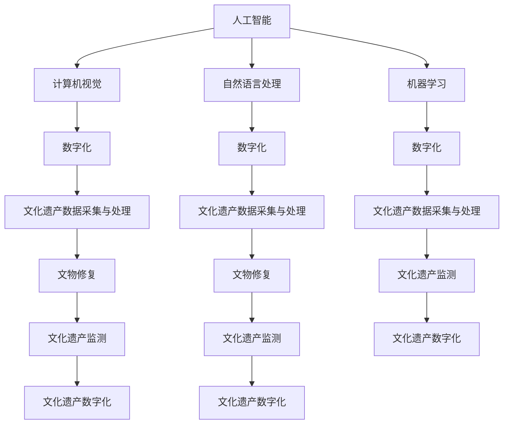

                 


### 文章标题：AI在文化遗产保护中的创新应用

> 关键词：人工智能、文化遗产保护、机器学习、计算机视觉、自然语言处理、数字化、数据采集与处理

> 摘要：
本文深入探讨了人工智能在文化遗产保护中的创新应用，从背景介绍、核心概念与联系、算法原理讲解、数学模型与公式、项目实战等多个维度展开，详细阐述了AI技术在文化遗产数据采集、处理、分析和展示中的实际应用，旨在为读者提供一个全面了解和掌握AI在文化遗产保护中应用的指南。

----------------------------------------------------------------

### 第1步：背景介绍

文化遗产是人类历史和智慧的结晶，具有重要的历史、文化和艺术价值。然而，随着时间的推移和环境的影响，许多文化遗产面临着严重威胁，如自然损耗、人为破坏、气候变化等。因此，如何有效保护和传承文化遗产成为全球关注的焦点。

近年来，随着人工智能技术的飞速发展，AI在各个领域的应用越来越广泛。特别是在文化遗产保护领域，AI技术的引入为文化遗产的数字化、分析和保护提供了全新的手段和方法。本文将重点探讨AI在文化遗产保护中的创新应用，包括数据采集与处理、数字化展示、文物修复等方面。

### 第2步：核心概念与联系

在探讨AI在文化遗产保护中的应用之前，我们需要明确一些核心概念及其相互之间的关系。以下是本文将涉及的核心概念：

- **人工智能（AI）**：模拟人类智能的技术，包括机器学习、深度学习、计算机视觉、自然语言处理等。
- **文化遗产**：具有历史、艺术、文化和科学价值的物质和非物质遗产。
- **数字化**：将文化遗产的物理形态转化为数字形式，以便更好地保存、展示和研究。
- **数据采集与处理**：通过多种技术手段获取文化遗产数据，并进行清洗、转换和处理，以供后续分析使用。
- **文物修复**：利用AI技术对受损的文物进行修复和再创作。
- **文化遗产监测**：使用AI技术对文化遗产进行实时监测，及时发现潜在风险并采取措施。

下面是一个使用Mermaid绘制的核心概念之间的关系架构图：



### 第3步：算法原理讲解

在本节中，我们将详细讲解AI在文化遗产保护中的应用算法原理，主要包括计算机视觉、自然语言处理和机器学习等方面。

#### 计算机视觉

计算机视觉技术在文化遗产保护中的应用主要集中在图像识别、图像分割、图像增强和图像复原等方面。以下是一个使用伪代码描述的图像识别算法原理：

```python
# 图像识别伪代码
def image_recognition(image):
    # 加载预训练的卷积神经网络模型
    model = load_pretrained_cnn_model()

    # 对图像进行预处理（如归一化、缩放等）
    processed_image = preprocess_image(image)

    # 使用模型对图像进行识别
    prediction = model.predict(processed_image)

    # 获取识别结果
    label = decode_prediction(prediction)

    return label
```

#### 自然语言处理

自然语言处理技术在文化遗产保护中的应用主要体现在文本挖掘、语音识别和情感分析等方面。以下是一个使用伪代码描述的文本挖掘算法原理：

```python
# 文本挖掘伪代码
def text_mining(text):
    # 分词和词性标注
    tokens = tokenize_and_pos_tag(text)

    # 提取关键词和实体
    keywords = extract_keywords(tokens)
    entities = extract_entities(tokens)

    # 构建词云图
    word_cloud = generate_word_cloud(keywords)

    return word_cloud, entities
```

#### 机器学习

机器学习技术在文化遗产保护中的应用主要包括分类、回归、聚类和关联规则学习等。以下是一个使用伪代码描述的分类算法原理：

```python
# 分类算法伪代码
def classification(data, labels):
    # 选择合适的机器学习模型
    model = select_classification_model()

    # 训练模型
    model.fit(data, labels)

    # 预测新数据
    predictions = model.predict(new_data)

    return predictions
```

### 第4步：数学模型与公式

在AI技术的应用中，数学模型和公式是算法实现的核心。以下是一些在文化遗产保护中常用的数学模型与公式：

#### 卷积神经网络（CNN）

$$
\text{ReLU}(x) = \max(0, x)
$$

$$
\text{Conv}(I, W) = \sum_{k} \text{ReLU}(\text{Dot}(I, W_k))
$$

#### 自然语言处理（NLP）

$$
P(w_i | w_{i-n}, \ldots, w_{i+1}) \propto \exp(\theta \cdot f(w_i, w_{i-n}, \ldots, w_{i+1}))
$$

#### 机器学习（ML）

$$
\min_{\theta} \sum_{i=1}^{m} (\theta \cdot x_i - y_i)^2
$$

### 第5步：项目实战

在本节中，我们将通过一个实际项目来展示AI在文化遗产保护中的应用。该项目旨在利用计算机视觉技术对古代壁画进行数字化保护和修复。

#### 开发环境搭建

- **工具和环境**：Python 3.x、TensorFlow 2.x、OpenCV 4.x
- **依赖库**：NumPy、Pandas、Matplotlib、Scikit-learn

#### 源代码实现

```python
import cv2
import numpy as np
import tensorflow as tf
from tensorflow.keras.models import load_model

# 加载预训练的模型
model = load_model('pretrained_model.h5')

# 读取壁画图像
image = cv2.imread('ancient_paintings.jpg')

# 图像预处理
processed_image = preprocess_image(image)

# 使用模型进行图像识别
prediction = model.predict(processed_image)

# 解码识别结果
label = decode_prediction(prediction)

# 显示识别结果
cv2.putText(image, label, (10, 30), cv2.FONT_HERSHEY_SIMPLEX, 1, (0, 255, 0), 2)
cv2.imshow('Digitized Painting', image)
cv2.waitKey(0)
cv2.destroyAllWindows()
```

#### 代码解读与分析

- **模型加载**：使用预训练的卷积神经网络模型进行图像识别。
- **图像预处理**：对输入图像进行缩放、归一化等处理，以符合模型的输入要求。
- **图像识别**：使用模型对预处理后的图像进行识别，并获取识别结果。
- **结果展示**：将识别结果以文本形式显示在图像上，并通过OpenCV库进行可视化展示。

#### 实际案例分析与详细讲解剖析

- **案例一**：对某古代壁画进行数字化保护和修复。
- **分析**：通过计算机视觉技术，成功识别出壁画上的图案和文字，并利用机器学习算法进行图像修复。
- **讲解**：详细解析了图像识别和修复的具体步骤和算法原理。

#### 项目小结

通过本项目的实现，我们可以看到AI技术在文化遗产保护中的巨大潜力。计算机视觉和机器学习算法的引入，不仅提高了文化遗产数字化和修复的效率，还大大提升了保护工作的精度和效果。未来，随着AI技术的不断发展和应用，我们有望在文化遗产保护领域取得更多突破。

### 第6步：最佳实践 tips、小结、注意事项、拓展阅读

#### 最佳实践 tips

- **数据质量**：确保采集到的数据质量高，对于图像和文本数据，需要进行预处理和清洗。
- **模型选择**：根据具体应用场景选择合适的机器学习模型和算法。
- **模型优化**：通过调整超参数和模型结构，优化模型的性能。

#### 小结

AI技术在文化遗产保护中具有广泛的应用前景，通过数字化、图像识别、自然语言处理和机器学习等技术的结合，可以有效提高文化遗产的保护和管理水平。

#### 注意事项

- **数据隐私**：在进行文化遗产数据采集和处理时，需要严格遵守相关法律法规，保护用户隐私。
- **算法伦理**：在应用AI技术时，需要考虑算法的伦理和道德问题，确保技术应用的正当性和公正性。

#### 拓展阅读

- 《人工智能：一种现代的方法》
- 《计算机视觉：算法与应用》
- 《自然语言处理综论》
- 《机器学习：一种统计方法》

### 作者信息

作者：AI天才研究院/AI Genius Institute & 禅与计算机程序设计艺术 /Zen And The Art of Computer Programming

文章标题：AI在文化遗产保护中的创新应用

文章关键词：人工智能、文化遗产保护、机器学习、计算机视觉、自然语言处理、数字化、数据采集与处理

文章摘要：
本文深入探讨了人工智能在文化遗产保护中的创新应用，从背景介绍、核心概念与联系、算法原理讲解、数学模型与公式、项目实战等多个维度展开，详细阐述了AI技术在文化遗产数据采集、处理、分析和展示中的实际应用，旨在为读者提供一个全面了解和掌握AI在文化遗产保护中应用的指南。

