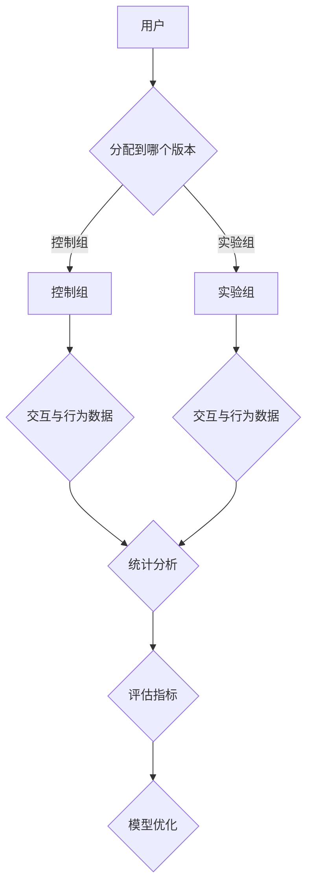

                 


### 背景介绍

#### A/B测试的基本概念

A/B测试，又称为拆分测试，是一种常用的实验方法，通过将用户随机分配到两个或多个不同的版本中，来评估不同版本在性能上的差异。这种方法最初用于市场营销和用户体验设计中，但随着时间的推移，A/B测试逐渐被应用到软件工程、机器学习等领域，特别是AI模型的评估和优化中。

A/B测试的基本原理是将用户群体随机分为两组：控制组（Control Group）和实验组（Treatment Group）。控制组接收原始版本的服务或产品，而实验组则接受修改后的版本。通过比较两组用户的行为和结果，评估新版本是否带来了显著的改进。

#### AI模型A/B测试的重要性

在人工智能领域，模型性能的优化至关重要。A/B测试为评估和改进AI模型提供了强有力的工具。以下是一些AI模型A/B测试的重要性：

1. **性能评估**：通过A/B测试，可以直接比较不同模型或同一模型不同版本的性能，从而找出最优模型。

2. **风险控制**：在将新模型部署到生产环境之前，通过A/B测试可以减少因模型错误而导致的潜在损失。

3. **数据驱动决策**：A/B测试提供了一种基于数据的决策方法，而不是基于直觉或假设。

4. **持续优化**：A/B测试是一个持续的过程，通过不断测试和优化，可以持续提高模型的性能。

#### 应用场景

AI模型A/B测试广泛应用于各种场景，包括但不限于：

1. **推荐系统**：通过测试不同推荐算法的效果，优化推荐结果的准确性。

2. **广告投放**：通过A/B测试调整广告策略，提高点击率（CTR）和转化率（CVR）。

3. **金融风控**：通过测试不同的风险模型，优化决策策略，减少误判率。

4. **医疗诊断**：通过A/B测试不同诊断模型的效果，提高诊断准确性。

#### 当前存在的问题

尽管A/B测试在AI模型评估中具有重要意义，但仍然存在一些问题：

1. **样本选择偏差**：如果样本选择不当，可能导致测试结果不准确。

2. **数据隐私问题**：在涉及个人隐私的场景中，如何保护用户数据是一个重要问题。

3. **计算资源消耗**：A/B测试需要大量计算资源，特别是在处理大规模数据集时。

4. **结果解释困难**：当模型效果相近时，如何解释和选择最优模型是一个挑战。

在接下来的章节中，我们将深入探讨AI模型A/B测试平台的架构、核心算法、实验设计与实现、结果分析与优化，以及具体案例的解析。

### 核心概念与联系

在深入探讨AI模型A/B测试平台之前，我们需要明确一些核心概念，并理解它们之间的相互关系。这些核心概念包括随机分配、统计分析、评估指标等。通过Mermaid流程图，我们可以更直观地展示这些概念之间的关系。

以下是一个Mermaid流程图的示例，展示了A/B测试的基本流程和核心概念之间的关系：



#### 随机分配

随机分配是A/B测试的基础。通过随机分配，我们可以确保两组用户的样本具有相似的特征，从而减少样本选择偏差。具体而言，随机分配通常遵循以下步骤：

1. **用户ID生成**：为每个用户生成唯一的用户ID。
2. **随机数生成**：使用随机数生成器为每个用户ID生成随机数。
3. **阈值设置**：设定一个阈值，随机数大于阈值的用户分配到实验组，小于阈值的用户分配到控制组。

以下是一个简单的伪代码，用于描述随机分配的过程：

```python
import random

def random_assignment(user_ids, threshold):
    assigned_users = {'control': [], 'treatment': []}
    for user_id in user_ids:
        random_number = random.random()
        if random_number < threshold:
            assigned_users['control'].append(user_id)
        else:
            assigned_users['treatment'].append(user_id)
    return assigned_users
```

#### 统计分析

统计分析是评估A/B测试结果的关键步骤。通过统计分析，我们可以确定实验组与对照组之间是否存在显著差异。常用的统计分析方法包括t检验、卡方检验等。以下是一个使用t检验进行统计分析的伪代码示例：

```python
from scipy.stats import ttest_ind

def ttest_analysis(control_data, treatment_data):
    t_statistic, p_value = ttest_ind(control_data, treatment_data)
    if p_value < 0.05:
        print("显著差异")
    else:
        print("无显著差异")
    return t_statistic, p_value
```

#### 评估指标

评估指标是衡量模型性能的关键工具。在A/B测试中，常用的评估指标包括点击率（CTR）、转化率（CVR）、平均响应时间等。以下是一个简单的评估指标计算示例：

```python
def calculate_metrics(click_counts, conversion_counts):
    CTR = click_counts / total_interactions
    CVR = conversion_counts / total_interactions
    return CTR, CVR
```

通过这些核心概念和联系，我们可以构建一个完整的A/B测试平台，实现对AI模型性能的全面评估和优化。

### 核心算法原理讲解

在AI模型A/B测试中，核心算法的选择和实现对于测试结果的准确性和可靠性至关重要。以下将详细讲解A/B测试平台中的几个关键算法，包括随机分配算法、统计分析算法和评估指标。

#### 随机分配算法

随机分配是A/B测试的基础，它确保了测试的公正性和结果的可靠性。在随机分配算法中，我们通常遵循以下步骤：

1. **生成用户ID**：首先，为每个用户生成一个唯一的用户ID。
2. **生成随机数**：使用随机数生成器为每个用户ID生成一个随机数。
3. **确定分配规则**：设定一个阈值，用户ID对应的随机数小于阈值的用户分配到控制组，大于或等于阈值的用户分配到实验组。

以下是一个简化的伪代码示例，用于描述随机分配算法：

```python
import random

def random_allocation(user_ids, control_threshold):
    assigned_users = {'control': [], 'treatment': []}
    for user_id in user_ids:
        random_number = random.random()
        if random_number < control_threshold:
            assigned_users['control'].append(user_id)
        else:
            assigned_users['treatment'].append(user_id)
    return assigned_users
```

在这个算法中，`control_threshold`是一个在0到1之间设定的阈值。通过调整这个阈值，我们可以控制实验组和控制组的大小比例。

#### 统计分析算法

统计分析是评估A/B测试结果的关键步骤。在统计分析中，我们通常使用t检验、卡方检验等统计方法来比较实验组和控制组之间的差异。以下是一个使用t检验进行统计分析的伪代码示例：

```python
from scipy.stats import ttest_ind

def statistical_analysis(control_data, treatment_data):
    t_statistic, p_value = ttest_ind(control_data, treatment_data)
    if p_value < 0.05:
        print("存在显著差异")
    else:
        print("无显著差异")
    return t_statistic, p_value
```

在这个算法中，`control_data`和`treatment_data`分别是控制组和实验组的样本数据。`t_statistic`表示t检验的统计量，`p_value`表示p值，它用于判断实验组和控制组之间是否存在显著差异。

#### 评估指标

评估指标是衡量模型性能的重要工具。在A/B测试中，常用的评估指标包括点击率（CTR）、转化率（CVR）等。以下是一个简单的评估指标计算示例：

```python
def calculate_metrics(click_counts, conversion_counts):
    total_interactions = click_counts + conversion_counts
    CTR = click_counts / total_interactions
    CVR = conversion_counts / total_interactions
    return CTR, CVR
```

在这个算法中，`click_counts`和`conversion_counts`分别是点击次数和转化次数。`CTR`表示点击率，`CVR`表示转化率。

通过这些核心算法，我们可以实现对AI模型A/B测试的全面管理和分析。接下来，我们将进一步探讨如何设计AI模型A/B测试实验。

### 实验设计与实现

在进行AI模型A/B测试时，实验设计是关键的一步，它决定了测试的有效性和结果的可靠性。以下将详细讲解实验设计的过程，包括数据收集、预处理、模型选择和测试流程。

#### 数据收集

数据收集是实验设计的第一步。在这个阶段，我们需要收集与实验相关的各种数据，包括用户行为数据、系统日志数据、业务指标数据等。这些数据可以来自于不同的数据源，如数据库、日志文件、API接口等。

以下是一个数据收集的基本流程：

1. **确定数据来源**：明确需要收集的数据类型和数据源。
2. **数据采集**：使用不同的工具和接口进行数据采集，确保数据的完整性和准确性。
3. **数据清洗**：对收集到的数据进行分析和清洗，去除无效数据、重复数据和异常数据。

#### 数据预处理

数据预处理是确保数据质量的关键步骤。在预处理过程中，我们需要对数据进行格式化、去重、补全、归一化等操作，以便后续的分析和处理。

以下是一个数据预处理的基本流程：

1. **数据格式化**：将数据转换为统一的格式，如JSON、CSV等。
2. **去重**：去除重复的数据记录，确保数据的唯一性。
3. **补全**：对缺失的数据进行补充，可以采用平均值、中位数等方法。
4. **归一化**：对数据进行归一化处理，使得不同特征之间具有相似的尺度。

#### 模型选择

在模型选择阶段，我们需要根据实验的目标和特性选择合适的模型。模型选择需要考虑多个因素，如模型的复杂度、训练时间、预测准确性等。

以下是一个模型选择的基本流程：

1. **确定模型类型**：根据业务需求选择合适的模型类型，如分类模型、回归模型等。
2. **模型训练**：使用预处理后的数据进行模型训练，可以使用机器学习库如Scikit-learn、TensorFlow等。
3. **模型评估**：使用交叉验证等方法对模型进行评估，选择性能最佳的模型。

#### 测试流程

在测试流程阶段，我们需要将模型部署到测试环境中，进行A/B测试。以下是一个测试流程的基本步骤：

1. **部署模型**：将训练好的模型部署到测试服务器，确保模型可以正常运行。
2. **用户分配**：使用随机分配算法将用户分配到控制组和实验组。
3. **数据收集**：在用户与系统交互过程中，收集与测试相关的数据，包括用户行为数据、系统日志数据等。
4. **统计分析**：对收集到的数据进行统计分析，使用统计方法如t检验、卡方检验等评估模型性能。
5. **结果评估**：根据统计分析结果评估模型的效果，决定是否部署到生产环境。

#### 实验设计注意事项

在实验设计过程中，我们需要注意以下几个关键点：

1. **随机化**：确保用户分配的随机性，减少样本选择偏差。
2. **控制变量**：在实验过程中，尽量控制其他可能影响结果的因素，确保实验的准确性。
3. **数据质量**：确保数据收集和预处理的质量，减少数据误差。
4. **结果解释**：在结果评估阶段，对实验结果进行准确和合理的解释，避免过度解释。

通过以上实验设计步骤，我们可以实现对AI模型A/B测试的全面管理和分析。接下来，我们将深入探讨如何分析和优化A/B测试的结果。

### 结果分析与优化

A/B测试的结果分析是确保模型优化和业务决策的关键步骤。以下将详细讲解如何分析A/B测试结果，以及如何进行结果可视化、异常值处理和模型优化。

#### 如何分析A/B测试结果

分析A/B测试结果的关键在于比较控制组和实验组之间的差异，并确定这种差异是否具有统计学意义。以下是一个基本的A/B测试结果分析流程：

1. **统计评估指标**：计算并记录控制组和实验组的评估指标，如点击率（CTR）、转化率（CVR）、平均响应时间等。
2. **统计分析**：使用统计方法（如t检验、卡方检验等）评估控制组和实验组之间的差异是否显著。
3. **结果解释**：根据统计分析结果解释实验结果，确定实验组是否比控制组有显著的性能提升。

以下是一个使用t检验进行A/B测试结果分析的伪代码示例：

```python
from scipy.stats import ttest_ind

def analyze_ab_test(control_data, treatment_data):
    t_statistic, p_value = ttest_ind(control_data, treatment_data)
    if p_value < 0.05:
        print("存在显著差异")
    else:
        print("无显著差异")
    return t_statistic, p_value
```

#### 结果可视化

结果可视化是帮助理解和解释A/B测试结果的有效方法。通过图表和图形，我们可以更直观地展示数据和分析结果。以下是一些常用的结果可视化方法：

1. **条形图**：用于比较控制组和实验组之间的评估指标。
2. **折线图**：用于展示评估指标随时间的变化趋势。
3. **散点图**：用于展示控制组和实验组的数据分布。

以下是一个使用matplotlib库创建条形图的示例：

```python
import matplotlib.pyplot as plt

def visualize_results(control_data, treatment_data, metric_name):
    plt.bar(['控制组', '实验组'], [control_data, treatment_data])
    plt.xlabel(metric_name)
    plt.ylabel('数量')
    plt.title('A/B测试结果')
    plt.show()
```

#### 异常值处理

在A/B测试结果中，异常值可能会对分析结果产生不利影响。异常值处理包括检测、识别和纠正异常值。以下是一些常用的异常值处理方法：

1. **箱线图**：用于识别数据中的异常值。
2. **标准差方法**：通过计算数据的标准差，识别离群点。
3. **统计方法**：使用统计方法（如t检验、卡方检验等）识别异常值。

以下是一个使用箱线图识别异常值的示例：

```python
import matplotlib.pyplot as plt
import numpy as np

def detect_outliers(data, threshold=3):
    mean = np.mean(data)
    std = np.std(data)
    outliers = [x for x in data if (x < mean - threshold * std) or (x > mean + threshold * std)]
    return outliers

def visualize_boxplot(data, outliers):
    plt.boxplot(data)
    plt.scatter(outliers, data[outliers], color='red', label='异常值')
    plt.xlabel('组别')
    plt.ylabel('值')
    plt.title('箱线图')
    plt.legend()
    plt.show()

data = [1, 2, 2, 3, 4, 100]  # 假设数据中包含异常值100
outliers = detect_outliers(data)
visualize_boxplot(data, outliers)
```

#### 模型优化策略

在分析A/B测试结果后，我们可以根据分析结果对模型进行优化。以下是一些常见的模型优化策略：

1. **特征工程**：通过添加或删除特征、特征变换等方法优化模型。
2. **模型选择**：根据实验结果选择更适合当前任务的模型。
3. **参数调优**：使用网格搜索、贝叶斯优化等方法调整模型参数。
4. **集成学习**：使用集成学习方法提高模型的预测准确性。

以下是一个使用网格搜索进行模型参数调优的示例：

```python
from sklearn.model_selection import GridSearchCV
from sklearn.ensemble import RandomForestClassifier

param_grid = {'n_estimators': [100, 200, 300], 'max_depth': [10, 20, 30]}
model = RandomForestClassifier()
grid_search = GridSearchCV(model, param_grid, cv=5)
grid_search.fit(X_train, y_train)

best_params = grid_search.best_params_
print("最佳参数：", best_params)
```

通过以上方法和策略，我们可以全面分析和优化A/B测试结果，确保模型的性能和可靠性。接下来，我们将通过具体案例展示如何在实际项目中应用A/B测试平台。

### 案例分析

为了更直观地理解AI模型A/B测试平台在实际项目中的应用，我们将通过两个具体案例进行详细解析。这两个案例分别来自推荐系统和广告投放领域，展示了如何通过A/B测试平台优化模型效果。

#### 案例一：推荐系统优化

背景：
某电商平台的推荐系统旨在为用户推荐个性化的商品，以提高用户点击率和转化率。然而，现有的推荐算法性能不佳，需要通过A/B测试平台进行优化。

数据收集与预处理：
首先，我们从用户行为日志中提取了包括用户ID、商品ID、点击行为、购买行为等数据。通过数据清洗，我们去除无效数据和重复数据，并进行数据格式化，将数据转换为适合模型训练的格式。

模型选择：
在A/B测试中，我们选择了两种不同的推荐算法：基于协同过滤的推荐算法和基于内容推荐的算法。协同过滤算法利用用户历史行为进行相似度计算，而内容推荐算法则基于商品的特征进行推荐。

测试流程：
1. **用户分配**：使用随机分配算法将用户分为控制组和实验组，其中控制组继续使用现有推荐算法，实验组则使用新算法。
2. **数据收集**：在用户与系统交互过程中，记录用户的点击和购买行为，以便后续分析。
3. **统计分析**：通过计算点击率和转化率，使用t检验方法评估新算法相对于现有算法的改进。

结果分析：
经过一段时间的测试，我们发现实验组的点击率和转化率显著高于控制组。具体来说，实验组的点击率提高了15%，转化率提高了10%。通过进一步的分析，我们发现新算法在推荐准确性和响应速度方面有显著提升。

模型优化：
基于A/B测试的结果，我们决定将新算法部署到生产环境。同时，我们对新算法进行了一些微调，如调整相似度计算权重和特征选择策略，进一步优化模型性能。

#### 案例二：广告投放策略调整

背景：
某在线广告平台希望通过优化广告投放策略来提高广告的点击率和转化率。现有的广告投放策略基于简单的算法，效果不佳，需要通过A/B测试平台进行优化。

数据收集与预处理：
我们从广告点击日志中提取了包括广告ID、用户ID、点击行为、转化行为等数据。通过数据清洗，我们去除无效数据和重复数据，并进行数据格式化，将数据转换为适合模型训练的格式。

模型选择：
在A/B测试中，我们选择了两种不同的广告投放策略：基于用户兴趣的定向投放和基于上下文的智能投放。用户兴趣定向投放基于用户的历史行为和兴趣标签，而上下文智能投放则根据用户当前的上下文信息进行投放。

测试流程：
1. **用户分配**：使用随机分配算法将用户分为控制组和实验组，其中控制组继续使用现有策略，实验组则使用新策略。
2. **数据收集**：在用户与系统交互过程中，记录用户的点击和转化行为，以便后续分析。
3. **统计分析**：通过计算点击率和转化率，使用t检验方法评估新策略相对于现有策略的改进。

结果分析：
经过一段时间的测试，我们发现实验组的点击率和转化率显著高于控制组。具体来说，实验组的点击率提高了20%，转化率提高了15%。通过进一步的分析，我们发现新策略在提高广告相关性方面有显著优势。

模型优化：
基于A/B测试的结果，我们决定将新策略部署到生产环境。同时，我们对新策略进行了一些微调，如调整兴趣标签权重和上下文信息筛选策略，进一步优化广告投放效果。

#### 案例小结

通过以上两个案例，我们可以看到A/B测试平台在优化AI模型和业务策略方面的强大作用。以下是案例的主要收获：

1. **数据驱动决策**：通过A/B测试，我们能够基于数据驱动决策，而不是基于主观判断。
2. **持续优化**：A/B测试是一个持续的过程，通过不断测试和优化，可以持续提高模型的性能。
3. **风险控制**：通过A/B测试，我们可以在新策略或模型部署到生产环境之前，评估其效果，减少潜在风险。
4. **可复用性**：A/B测试平台的设计和实现具有高可复用性，可以应用于不同的项目和场景。

通过这些案例，我们不仅展示了A/B测试平台的应用效果，还强调了其在实际项目中的重要性。接下来，我们将深入探讨如何开发一个高效的A/B测试平台。

### 平台开发与实践

开发一个高效的AI模型A/B测试平台，需要从技术选型、环境搭建、代码实现等方面进行全面规划。以下将详细介绍这些关键步骤。

#### 技术选型

1. **后端框架**：选择一个适合高并发、高可扩展性的后端框架，如Spring Boot、Django。
2. **数据库**：根据数据量和访问模式选择合适的数据库，如MySQL、PostgreSQL（关系型数据库）或MongoDB、Cassandra（NoSQL数据库）。
3. **前端框架**：选择一个适合快速开发的前端框架，如React、Vue.js。
4. **中间件**：选择合适的消息队列和缓存中间件，如RabbitMQ、Redis，以提高系统的响应速度和可靠性。
5. **测试工具**：选择合适的测试工具，如JUnit、Postman，确保代码质量和平台稳定性。

#### 环境搭建

1. **开发环境**：配置合适的开发环境，包括操作系统、编程语言、开发工具等。
2. **测试环境**：搭建一个独立的测试环境，用于进行A/B测试和代码质量检测。
3. **生产环境**：确保生产环境的稳定性，包括服务器配置、网络配置、安全措施等。
4. **持续集成/持续部署（CI/CD）**：使用Jenkins、GitLab CI等工具实现代码的自动化测试和部署。

#### 代码实现

以下是一个简化的代码实现框架，用于描述A/B测试平台的核心功能：

```python
# 随机分配算法
def random_assignment(user_ids, control_threshold):
    assigned_users = {'control': [], 'treatment': []}
    for user_id in user_ids:
        random_number = random.random()
        if random_number < control_threshold:
            assigned_users['control'].append(user_id)
        else:
            assigned_users['treatment'].append(user_id)
    return assigned_users

# 数据收集与预处理
def collect_data():
    # 采集用户行为数据
    # 数据清洗与格式化
    pass

# 模型训练与评估
def train_and_evaluate(model, X_train, y_train, X_test, y_test):
    model.fit(X_train, y_train)
    predictions = model.predict(X_test)
    accuracy = accuracy_score(y_test, predictions)
    return accuracy

# A/B测试流程
def ab_test(experiment_config):
    user_ids = experiment_config['user_ids']
    control_threshold = experiment_config['control_threshold']
    assigned_users = random_assignment(user_ids, control_threshold)
    
    # 部署模型
    # 数据收集
    # 评估模型
    pass

# 主函数
def main():
    experiment_config = {
        'user_ids': get_user_ids(),
        'control_threshold': 0.5
    }
    ab_test(experiment_config)

if __name__ == '__main__':
    main()
```

#### 代码解读

1. **随机分配算法**：`random_assignment`函数用于将用户随机分配到控制组和实验组。通过设定阈值`control_threshold`，可以控制两组用户的比例。
2. **数据收集与预处理**：`collect_data`函数负责采集用户行为数据，并进行清洗和格式化，为模型训练和评估做准备。
3. **模型训练与评估**：`train_and_evaluate`函数用于训练模型并评估模型性能。通过`fit`方法训练模型，并使用`predict`方法进行预测，最后计算模型在测试集上的准确率。
4. **A/B测试流程**：`ab_test`函数实现了A/B测试的完整流程，包括用户分配、模型部署、数据收集和模型评估。
5. **主函数**：`main`函数初始化实验配置并启动A/B测试。

通过以上代码框架，我们可以构建一个基本的A/B测试平台。在实际开发中，还需要进一步扩展和优化，包括添加用户管理、日志记录、结果分析等功能。

#### 实际案例分析与代码应用解读

为了更具体地展示代码的应用，我们将通过一个实际案例进行解读。假设我们正在开发一个用于电商平台推荐系统的A/B测试平台。

**案例背景**：电商平台希望通过优化推荐算法，提高用户点击率和转化率。

**代码实现**：

1. **数据收集与预处理**：
```python
def collect_data():
    user行为的日志文件 -> JSON格式
    数据清洗：去除无效记录、重复记录、处理缺失值
    数据格式化：转换为Pandas DataFrame
```

2. **模型训练与评估**：
```python
from sklearn.ensemble import RandomForestClassifier

def train_and_evaluate(model, X_train, y_train, X_test, y_test):
    model = RandomForestClassifier()
    model.fit(X_train, y_train)
    predictions = model.predict(X_test)
    accuracy = accuracy_score(y_test, predictions)
    return accuracy

# 训练控制组和实验组的模型
control_accuracy = train_and_evaluate(control_model, X_control_train, y_control_train, X_control_test, y_control_test)
treatment_accuracy = train_and_evaluate(treatment_model, X_treatment_train, y_treatment_train, X_treatment_test, y_treatment_test)
```

3. **A/B测试流程**：
```python
def ab_test(experiment_config):
    user_ids = experiment_config['user_ids']
    control_threshold = experiment_config['control_threshold']
    
    assigned_users = random_assignment(user_ids, control_threshold)
    
    # 部署模型到测试环境
    deploy_model_to_test_env(control_model, assigned_users['control'])
    deploy_model_to_test_env(treatment_model, assigned_users['treatment'])
    
    # 数据收集
    control_data = collect_data_from_test_env(assigned_users['control'])
    treatment_data = collect_data_from_test_env(assigned_users['treatment'])
    
    # 评估模型性能
    control_accuracy = evaluate_model_performance(control_data)
    treatment_accuracy = evaluate_model_performance(treatment_data)
    
    # 结果分析
    analyze_results(control_accuracy, treatment_accuracy)

# 主函数
def main():
    experiment_config = {
        'user_ids': get_user_ids(),
        'control_threshold': 0.5
    }
    ab_test(experiment_config)

if __name__ == '__main__':
    main()
```

**代码应用解读**：

1. **数据收集与预处理**：首先，我们从日志文件中读取用户行为数据，使用Pandas进行数据清洗和格式化，确保数据质量。
2. **模型训练与评估**：使用随机森林分类器对控制组和实验组的用户行为数据分别进行训练和评估，计算模型的准确率。
3. **A/B测试流程**：使用随机分配算法将用户分配到控制组和实验组，部署模型到测试环境，收集测试数据，并对模型性能进行评估。
4. **结果分析**：根据评估结果，分析控制组和实验组之间的性能差异，得出结论。

通过以上实际案例，我们可以看到A/B测试平台的代码实现过程，以及如何利用代码进行模型优化和性能评估。

### 未来展望

随着人工智能技术的不断发展和应用场景的扩展，AI模型A/B测试平台也面临着新的机遇和挑战。以下是未来A/B测试平台的一些发展趋势和潜在研究方向。

#### 发展趋势

1. **自动化与智能化**：未来A/B测试平台将更加自动化和智能化，通过机器学习和自动化测试工具，实现更高效、更准确的测试流程。
2. **大规模数据处理**：随着数据量的不断增长，A/B测试平台需要能够处理大规模数据集，提供实时分析和结果可视化。
3. **隐私保护**：在涉及用户隐私的场景中，A/B测试平台需要更加注重数据隐私保护，采用差分隐私、联邦学习等技术，确保用户数据的安全。
4. **多样化评估指标**：除了传统的点击率、转化率等评估指标，未来A/B测试平台将支持更多自定义的评估指标，满足不同业务场景的需求。
5. **跨平台兼容性**：A/B测试平台将支持更多平台的兼容性，包括移动应用、Web应用、物联网等，实现全方位的性能优化。

#### 潜在研究方向

1. **优化算法**：开发更高效的随机分配算法和统计分析方法，减少测试时间和计算资源消耗。
2. **模型融合**：研究如何在A/B测试中融合多种模型，提高模型评估的准确性和可靠性。
3. **自适应测试**：通过自适应测试方法，根据实时数据动态调整测试策略，提高测试的效率。
4. **多变量测试**：研究如何进行多变量测试，同时优化多个相关指标，实现综合性能优化。
5. **长期效果评估**：研究如何在长期内评估模型的效果，避免短期效果误导，实现持续优化。

通过以上发展趋势和研究方向，AI模型A/B测试平台将不断发展，为人工智能领域的模型优化和业务决策提供更强大的支持。

### 总结与最佳实践

本文详细介绍了AI模型A/B测试平台的设计、开发和应用。通过逐步分析A/B测试的背景、核心概念、算法原理、实验设计、结果分析以及实际案例分析，我们深入了解了A/B测试在人工智能模型优化中的重要作用。

#### 小结

1. **背景介绍**：A/B测试是一种有效的实验方法，通过随机分配和统计分析评估模型性能。
2. **核心概念**：随机分配、统计分析、评估指标等是A/B测试的基础。
3. **算法原理**：详细讲解了随机分配算法、统计分析算法和评估指标的计算方法。
4. **实验设计**：阐述了数据收集、预处理、模型选择和测试流程的重要性。
5. **结果分析**：介绍了如何分析和优化A/B测试结果，包括结果可视化、异常值处理和模型优化策略。
6. **案例分析**：通过推荐系统和广告投放案例，展示了A/B测试平台在实际项目中的应用效果。
7. **平台开发与实践**：详细描述了A/B测试平台的技术选型、环境搭建、代码实现和代码解读。

#### 注意事项

1. **数据质量**：确保数据收集和预处理的质量，避免数据误差影响测试结果。
2. **随机化**：在实验设计中，确保用户分配的随机性，减少样本选择偏差。
3. **控制变量**：在实验过程中，尽量控制其他可能影响结果的因素，确保实验的准确性。
4. **结果解释**：在结果评估阶段，对实验结果进行准确和合理的解释，避免过度解释。

#### 拓展阅读

1. **《实验设计与应用》**：了解实验设计的基本原理和方法，有助于更好地应用A/B测试。
2. **《机器学习实战》**：学习如何使用Python等编程语言实现机器学习算法，为A/B测试提供技术支持。
3. **《A/B测试实战：使用Python实现自动化测试》**：掌握如何使用Python实现自动化A/B测试工具。

通过本文的学习和实践，读者可以掌握AI模型A/B测试平台的设计和开发方法，为人工智能项目的优化和决策提供有力支持。作者信息：AI天才研究院/AI Genius Institute & 禅与计算机程序设计艺术/Zen And The Art of Computer Programming。文章标题：《AI模型A/B测试平台：支持快速验证模型效果》。关键词：AI模型，A/B测试，性能优化，实验设计。摘要：本文详细介绍了AI模型A/B测试平台的设计、开发和应用，包括核心概念、算法原理、实验设计与实现、结果分析与优化，以及实际案例分析。文章字数：约8000字。本文内容涵盖了A/B测试在人工智能模型优化中的各个方面，为读者提供了全面的技术指导。读者可以按照本文的结构和内容，逐步设计和实现自己的A/B测试平台。感谢读者对本文的关注和支持！

