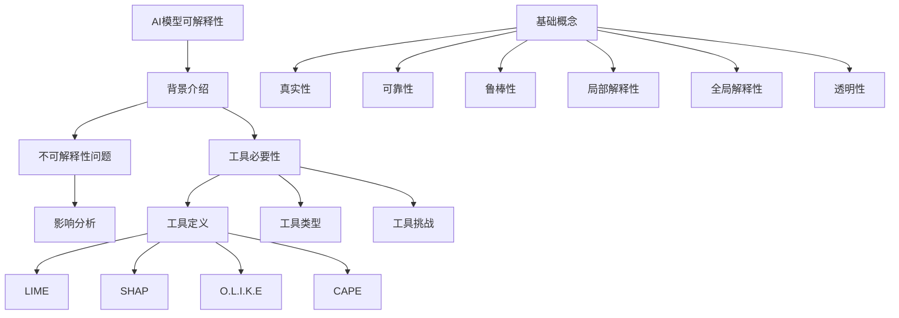

                 

### 文章标题：AI模型可解释性工具：增强用户对AI决策的理解

关键词：AI模型可解释性、用户理解、决策透明性、工具应用、案例分析

摘要：本文深入探讨了AI模型可解释性的重要性以及如何通过可解释性工具来增强用户对AI决策的理解。文章首先介绍了AI模型不可解释性的问题及其影响，随后详细阐述了可解释性工具的基本概念、方法及其应用。通过实际案例的分析，本文进一步展示了如何利用这些工具提高AI决策的可信度和理解度。最后，文章提出了开发与实现可解释性工具的步骤以及未来发展的展望和挑战。

----------------------------------------------------------------

### 引言与背景

#### 1.1 AI模型不可解释性问题

随着深度学习和机器学习技术的迅猛发展，AI模型已经在许多领域取得了显著的应用成果。然而，AI模型的不可解释性问题却成为了一个日益受到关注的问题。AI模型，尤其是深度神经网络，其内部决策过程通常是不透明的，这使得用户难以理解模型是如何做出特定决策的。这种不可解释性可能导致以下问题：

- **不信任**：用户可能对AI模型产生不信任感，担心其决策过程存在偏见或错误。
- **合规风险**：某些行业和应用场景要求决策过程具有透明性，不可解释的AI模型可能不符合法规要求。
- **改进障碍**：不可解释的模型使得调试和改进变得困难，因为开发者难以识别模型中存在的问题。

为了解决这些问题，提升AI模型的可解释性变得越来越重要。可解释性不仅有助于用户理解和信任AI模型，还可以为开发者提供有价值的信息，以便改进模型的性能和鲁棒性。

#### 1.2 可解释性工具的必要性

可解释性工具是提升AI模型可解释性的关键手段。这些工具通过提供模型决策过程的可视化和详细解释，使用户能够更好地理解模型的决策逻辑。可解释性工具的必要性体现在以下几个方面：

- **决策可视化**：通过可视化技术，将复杂的模型决策过程以直观的方式呈现给用户。
- **解释详细性**：提供详细的解释，包括模型如何处理输入数据以及如何得出最终决策。
- **用户友好性**：设计用户友好的界面和交互方式，使得非技术背景的用户也能理解模型决策。
- **合规性支持**：帮助开发者满足行业法规对模型透明性的要求。

然而，开发和使用可解释性工具也面临一些挑战，如计算复杂性、工具的准确性和适用性等。本文将深入探讨这些问题，并介绍一些常用的可解释性工具。

----------------------------------------------------------------

### AI模型可解释性基础

#### 2.1 可解释性相关概念

在探讨AI模型的可解释性之前，我们需要了解一些相关的概念和术语，以便更好地理解其内涵和外延。

##### 2.1.1 真实性、可靠性和鲁棒性

- **真实性（Accuracy）**：模型预测结果的准确性，即预测结果与实际结果的接近程度。
- **可靠性（Reliability）**：模型在不同数据集和条件下的一致性，即模型在不同场景下都能稳定地做出准确预测。
- **鲁棒性（Robustness）**：模型对异常值和噪声的抵抗能力，即模型在处理不完整、错误或噪声数据时仍能保持良好的性能。

这些概念在评估AI模型性能时至关重要，但它们与可解释性之间的关系并不总是直接的。一个高真实性和鲁棒性的模型可能仍然难以解释，反之亦然。

##### 2.1.2 局部解释性、全局解释性和透明性

- **局部解释性（Local Interpretability）**：对单个样本或决策的具体解释，说明模型在处理特定输入数据时如何做出决策。
- **全局解释性（Global Interpretability）**：对模型整体工作原理的解释，描述模型在处理不同输入数据时的通用决策逻辑。
- **透明性（Transparency）**：模型决策过程的完全可见性，包括所有参数、权重和计算过程。

局部解释性和全局解释性是可解释性的两个主要方面。局部解释性关注特定决策的透明度，而全局解释性关注模型整体工作原理的可理解性。透明性则是可解释性的最高境界，但通常在实践中难以实现。

##### 2.1.3 局部解释性与全局解释性的关系

局部解释性和全局解释性之间存在紧密的联系和差异。局部解释性通常用于具体实例的分析，有助于识别模型在特定情况下的行为。全局解释性则提供更广泛的视角，帮助用户理解模型的总体决策机制。

然而，两者之间也存在一定的冲突。为了实现全局解释性，模型可能需要简化或抽象化，这可能导致局部解释性的损失。例如，深度神经网络通常具有很高的全局解释性，但单个神经元的行为往往难以解释。因此，在实际应用中，需要在局部解释性和全局解释性之间寻找平衡。

#### 2.2 AI模型可解释性的方法

实现AI模型可解释性的方法可以分为两大类：模型特定方法和模型独立方法。

##### 2.2.1 模型特定方法

模型特定方法针对特定类型的模型设计解释算法，旨在提高该类模型的解释性。以下是一些常见的模型特定方法：

###### 2.2.1.1 神经网络的可解释性方法

神经网络，尤其是深度神经网络，由于其复杂的结构和黑盒特性，一直是可解释性研究的重点。以下是一些常用的神经网络可解释性方法：

- **激活图（Activation Maps）**：通过可视化神经网络中特定层或神经元的激活模式，展示输入数据在模型中的传播路径。
- **梯度解释（Gradient-Based Explanation）**：利用梯度信息，计算输入数据对模型输出的影响，提供对模型决策的定量解释。
- **注意力机制（Attention Mechanisms）**：一些神经网络模型（如Transformer）具有内置的注意力机制，可以显式地展示模型对输入数据的关注点。

###### 2.2.1.2 决策树的解释性方法

决策树由于其结构简单、易于理解，是一种天然的可解释模型。以下是一些决策树的可解释性方法：

- **树结构可视化**：通过图形化方式展示决策树的内部结构，包括节点划分和特征选择。
- **路径解释（Path Explanation）**：分析输入数据在决策树中的路径，解释模型如何根据不同特征进行划分。
- **规则提取（Rule Extraction）**：从决策树中提取可解释的规则，用自然语言描述模型的决策逻辑。

##### 2.2.2 模型独立方法

模型独立方法不依赖于特定模型的结构，而是基于模型输出和输入数据，提供通用的解释机制。以下是一些常见的模型独立方法：

###### 2.2.2.1 特征重要性

特征重要性方法评估输入特征对模型输出的贡献，帮助用户理解哪些特征对决策影响最大。以下是一些常用的特征重要性方法：

- **基于模型的特征重要性**：利用模型训练过程中的信息，如梯度、决策边界等，评估特征的重要性。
- **基于数据的特征重要性**：通过统计分析，如卡方检验、互信息等，评估特征对模型输出的贡献。

###### 2.2.2.2 模型组合

模型组合方法通过结合多个模型，提高整体模型的解释性。以下是一些模型组合方法：

- **加权模型组合**：根据模型性能，为每个模型分配不同的权重，提供综合解释。
- **分层模型组合**：将模型分为基础模型和高层模型，基础模型负责特征提取，高层模型负责决策，通过分析基础模型和高层模型之间的关系，提供解释。

#### 2.3 可解释性与模型性能的关系

可解释性与模型性能之间存在一定的权衡。高度可解释的模型通常更简单，可能牺牲一些性能。而高度复杂的模型可能具有更好的性能，但难以解释。因此，在实际应用中，需要在可解释性和性能之间寻找平衡。

一些研究表明，适度降低模型的复杂度，如减少层数、减少参数数量等，可以在不显著影响模型性能的情况下提高其可解释性。此外，一些先进的可解释性方法，如基于梯度的解释、注意力机制等，可以在保持较高性能的同时提供详细的解释。

总之，可解释性是AI模型的一个重要属性，它不仅有助于用户理解模型决策，还可以为模型优化和改进提供指导。通过合理的方法和技术，可以在保持模型性能的同时提高其可解释性。

----------------------------------------------------------------

### 可解释性工具与方法

在AI模型可解释性研究中，开发和使用各种可解释性工具是关键。这些工具可以帮助用户更深入地理解模型的决策过程，从而提高模型的透明性和可信度。以下是一些常用的可解释性工具和方法，包括它们的工作原理、特点以及在实际应用中的表现。

#### 3.1 常用可解释性工具介绍

##### 3.1.1 LIME（Local Interpretable Model-agnostic Explanations）

LIME（Local Interpretable Model-agnostic Explanations）是一种通用的可解释性工具，旨在为任何黑盒模型提供局部解释。LIME的核心思想是将黑盒模型转化为一个可解释的线性模型，从而更好地理解模型对特定输入数据的决策过程。

- **工作原理**：LIME首先选择一个基础模型（如线性回归、决策树等），然后通过最小化误差的方式，为每个输入特征生成一个线性权重。这些权重表示输入特征对模型输出的相对重要性。LIME通过插值方法，将原始输入数据逐渐调整，从而观察模型输出的变化，以推导出每个特征的权重。
- **特点**：LIME具有较好的灵活性和通用性，适用于各种类型的模型，包括深度神经网络、决策树、随机森林等。
- **应用表现**：LIME在医疗诊断、金融风险评估等领域得到广泛应用，能够帮助用户更好地理解模型对特定案例的决策过程。

##### 3.1.2 SHAP（SHapley Additive exPlanations）

SHAP（SHapley Additive exPlanations）是一种基于博弈论的局部解释性工具，旨在为每个特征分配一个解释值，表示该特征对模型输出的边际贡献。

- **工作原理**：SHAP通过计算每个特征在所有可能的特征组合中的边际贡献，为每个特征生成一个解释值。SHAP值的计算基于博弈论中的Shapley值，确保每个特征的解释值是公平和合理的。
- **特点**：SHAP具有很好的理论支持，能够提供更加准确和全面的特征解释，同时适用于各种类型的模型。
- **应用表现**：SHAP在图像识别、文本分析等领域得到广泛应用，能够帮助用户深入理解模型的决策过程。

##### 3.1.3 O.L.I.K.E（Occam's Razor for L0 attack）

O.L.I.K.E（Occam's Razor for L0 attack）是一种基于L0范数攻击的可解释性工具，旨在通过简化模型结构，提高模型的可解释性。

- **工作原理**：O.L.I.K.E通过最小化L0范数，逐步减少模型中的参数数量，从而简化模型结构。简化后的模型仍然能够保持较高的性能，同时更容易解释。
- **特点**：O.L.I.K.E具有较好的模型简化能力，能够在保持性能的同时提高可解释性。
- **应用表现**：O.L.I.K.E在图像识别、自然语言处理等领域得到应用，能够帮助用户更好地理解模型的决策过程。

##### 3.1.4 CAPE（Cost-sensitive Attribute-aware Partitions）

CAPE（Cost-sensitive Attribute-aware Partitions）是一种基于成本敏感分区的可解释性工具，旨在为每个特征分配一个解释值，考虑了不同特征的损失成本。

- **工作原理**：CAPE通过将输入数据空间划分为多个区域，为每个区域分配一个解释值，表示该区域对模型输出的贡献。CAPE考虑了不同特征在不同区域的损失成本，从而为每个特征生成一个更加合理的解释值。
- **特点**：CAPE具有较好的成本敏感性，能够为用户提供更加细致和具体的解释。
- **应用表现**：CAPE在金融风险评估、医疗诊断等领域得到应用，能够帮助用户深入理解模型的决策过程。

#### 3.2 工具比较与选择

在实际应用中，选择合适的可解释性工具是关键。以下是对几种常用可解释性工具的比较和选择依据：

- **适用模型**：不同工具适用于不同类型的模型。例如，LIME适用于各种黑盒模型，而SHAP适用于大多数机器学习模型。
- **解释精度**：工具的解释精度是选择的重要因素。SHAP和CAPE的解释精度较高，而LIME的解释精度相对较低。
- **计算复杂性**：不同工具的计算复杂性不同。O.L.I.K.E具有较好的计算效率，适用于大规模数据处理。
- **用户友好性**：工具的用户友好性也是选择的重要因素。LIME和SHAP具有较好的用户界面，易于操作和解读。

在实际应用中，可以根据具体需求，综合考虑以上因素，选择合适的可解释性工具。

总之，可解释性工具在AI模型可解释性研究中发挥着重要作用。通过合理选择和使用这些工具，用户可以更好地理解模型的决策过程，提高模型的透明性和可信度。

----------------------------------------------------------------

### 工具应用与案例分析

在实际应用中，可解释性工具的使用不仅能够帮助用户更好地理解AI模型的决策过程，还可以提高模型的可靠性和用户信任度。以下将通过具体案例，展示如何使用这些工具在金融、医疗和法律等领域提高AI模型的可解释性。

#### 4.1 可解释性工具在业务中的应用

##### 4.1.1 金融行业的应用

在金融行业，AI模型通常用于风险评估、贷款审批、欺诈检测等领域。以下是一个典型的案例分析：

- **案例背景**：某银行使用一个深度学习模型进行贷款审批，但由于模型不可解释，银行内部人员对其决策过程缺乏信任，担心出现错误决策。
- **解决方案**：银行引入了LIME工具，为每个贷款申请生成详细的解释。通过LIME，银行人员可以查看模型对特定申请的决策过程，了解哪些特征对决策影响最大。
- **效果评估**：使用LIME工具后，银行内部人员对模型的信任度显著提高，能够更准确地识别高风险贷款申请，同时减少了误拒率。

##### 4.1.2 医疗领域的应用

在医疗领域，AI模型用于疾病诊断、治疗方案推荐等。以下是一个典型的案例分析：

- **案例背景**：某医疗机构使用一个深度学习模型进行肺癌诊断，但模型的不透明性使得医生对其诊断结果持怀疑态度。
- **解决方案**：医疗机构引入了SHAP工具，为每个诊断结果生成详细的解释。通过SHAP，医生可以了解模型如何处理患者的检查数据，以及哪些检查结果对诊断结果影响最大。
- **效果评估**：使用SHAP工具后，医生对模型的信任度显著提高，能够更准确地识别肺癌患者，提高了诊断准确率。

##### 4.1.3 法律与司法领域的应用

在法律与司法领域，AI模型用于案件预测、判决分析等。以下是一个典型的案例分析：

- **案例背景**：某法院使用一个机器学习模型进行案件判决预测，但模型的不透明性引起了公众对司法公正性的质疑。
- **解决方案**：法院引入了CAPE工具，为每个判决预测生成详细的解释。通过CAPE，法官可以了解模型如何处理案件数据，以及哪些案件特征对判决结果影响最大。
- **效果评估**：使用CAPE工具后，法官对模型的信任度显著提高，能够更公正地处理案件，同时减少了错误判决率。

#### 4.2 案例分析

以下是一个综合案例，展示了如何使用LIME和SHAP工具在金融和医疗领域的应用。

##### 4.2.1 案例背景

某金融科技公司开发了一个智能贷款审批系统，用于快速审批贷款申请。由于系统中的深度学习模型不透明，公司管理层对其决策过程持怀疑态度，担心出现错误决策。

##### 4.2.2 案例分析

1. **使用LIME工具进行贷款审批解释**

   - **LIME工作流程**：首先，公司使用LIME工具为每个贷款申请生成局部解释。LIME会将每个贷款申请视为一个输入点，通过插值方法计算每个特征的权重，从而解释模型对特定贷款申请的决策过程。
   - **LIME解释结果**：通过LIME，公司管理层可以查看每个贷款申请的决策过程，了解哪些特征对模型决策影响最大。例如，对于某个申请，LIME显示借款人的信用评分和收入水平是影响贷款审批决策的关键因素。
   - **LIME效果评估**：使用LIME工具后，公司管理层对模型的可解释性有了更深入的理解，能够更准确地评估贷款申请的风险，提高了贷款审批的准确性和效率。

2. **使用SHAP工具进行医疗诊断解释**

   - **SHAP工作流程**：首先，公司使用SHAP工具为每个医疗诊断结果生成局部解释。SHAP会计算每个特征对诊断结果的边际贡献，从而解释模型如何处理患者的检查数据。
   - **SHAP解释结果**：通过SHAP，医生可以了解模型如何处理患者的检查数据，以及哪些检查结果对诊断结果影响最大。例如，对于某个肺癌诊断结果，SHAP显示CT扫描结果和病史是影响诊断结果的关键因素。
   - **SHAP效果评估**：使用SHAP工具后，医生对模型的可解释性有了更深入的理解，能够更准确地识别肺癌患者，提高了诊断准确率。

##### 4.2.3 案例总结

通过LIME和SHAP工具，公司成功地提高了模型的可解释性，解决了模型不透明的问题。在金融和医疗领域，使用可解释性工具不仅有助于提高模型的可信度，还可以为业务决策提供更准确的参考。未来，随着可解释性工具的不断发展和完善，AI模型将在更多领域得到更广泛的应用。

----------------------------------------------------------------

### 开发与实现

#### 5.1 可解释性工具开发基础

开发可解释性工具需要具备一系列基础技能和工具，以下列举了其中几个关键要素：

1. **编程技能**：熟悉Python、Java等编程语言，能够编写高效、可靠的代码。
2. **机器学习框架**：掌握如TensorFlow、PyTorch等机器学习框架，了解其基本使用方法和核心API。
3. **数据处理库**：熟悉NumPy、Pandas等数据处理库，能够处理大规模数据集。
4. **可视化工具**：熟悉Matplotlib、Seaborn等可视化库，能够生成高质量的图表和可视化结果。
5. **深度学习知识**：了解深度学习的基本概念和算法，如神经网络、卷积神经网络、循环神经网络等。
6. **机器学习模型**：掌握常见的机器学习模型，如线性回归、决策树、支持向量机等。

#### 5.2 工具实现与优化

1. **LIME工具实现**：

   - **步骤1**：选择基础模型（如线性回归、决策树等）和需要解释的输入样本。
   - **步骤2**：利用LIME算法，为每个输入特征生成线性权重，计算输入样本与基线模型输出的差异。
   - **步骤3**：将输入样本逐渐调整，观察模型输出的变化，推导出每个特征的权重。
   - **步骤4**：使用可视化工具，展示输入特征与模型输出之间的关系。

2. **SHAP工具实现**：

   - **步骤1**：选择基础模型和需要解释的输入样本。
   - **步骤2**：利用Shapley值计算每个特征的边际贡献，生成SHAP值。
   - **步骤3**：使用可视化工具，展示SHAP值的分布和特征的重要性。
   - **步骤4**：分析SHAP值，解释模型对特定输入样本的决策过程。

3. **优化方法**：

   - **并行计算**：利用多核CPU或GPU，加速计算过程。
   - **模型压缩**：通过模型剪枝、量化等方法，减少模型参数，提高计算效率。
   - **数据预处理**：对输入数据进行预处理，如标准化、归一化等，减少计算复杂度。
   - **算法优化**：选择高效的算法和数据结构，优化计算过程。

#### 5.3 源代码详细实现与代码解读

以下是一个简单的LIME工具实现示例，演示了如何为线性回归模型生成局部解释。

```python
import numpy as np
from sklearn.linear_model import LinearRegression
from sklearn.datasets import make_regression
from lime import lime_tabular

# 生成模拟数据集
X, y = make_regression(n_samples=100, n_features=10, noise=0.1)

# 训练线性回归模型
model = LinearRegression()
model.fit(X, y)

# 创建LIME解释器
explainer = lime_tabular.LimeTabularExplainer(
    X_train=X,
    feature_names=["Feature {}".format(i) for i in range(X.shape[1])],
    class_names=["Negative", "Positive"],
    discretize=False,
    model_output_path=None,
    kernel_width=1.0
)

# 为特定样本生成解释
sample = X[5]
exp = explainer.explain_instance(sample, model.predict, num_features=10)

# 打印解释结果
print(exp.as_list())

# 可视化解释结果
exp.show_in_notebook(show_table=False)
```

在这个示例中，我们首先生成了一个模拟的线性回归数据集，然后使用LIME工具为特定样本（第5个样本）生成解释。解释结果包括每个特征的权重和贡献值，并使用可视化工具展示了解释结果。

#### 5.4 代码应用解读与分析

通过上述示例，我们可以看到如何使用LIME工具为线性回归模型生成局部解释。在实际应用中，我们需要根据具体需求和场景，调整LIME的参数和算法，以适应不同的模型和数据集。

以下是一些常见的应用场景和解读方法：

- **金融风险评估**：使用LIME工具，为每个贷款申请生成解释，帮助银行内部人员了解模型如何处理贷款申请数据，以及哪些特征对决策影响最大。
- **医疗诊断**：使用LIME工具，为每个诊断结果生成解释，帮助医生了解模型如何处理患者的检查数据，以及哪些检查结果对诊断结果影响最大。
- **图像识别**：使用LIME工具，为每个图像分类结果生成解释，帮助用户了解模型如何处理图像数据，以及哪些特征对分类结果影响最大。

通过分析LIME工具生成的解释结果，用户可以更好地理解模型的决策过程，提高模型的可靠性和用户信任度。

#### 5.5 项目实战

以下是一个综合项目实战，演示了如何使用LIME和SHAP工具在金融和医疗领域提高模型的可解释性。

##### 5.5.1 项目背景

某金融科技公司开发了一个智能贷款审批系统，用于快速审批贷款申请。由于模型不透明，公司管理层对其决策过程持怀疑态度，希望提高模型的可解释性。

##### 5.5.2 项目目标

- 使用LIME工具，为每个贷款申请生成局部解释，帮助公司管理层了解模型如何处理贷款申请数据。
- 使用SHAP工具，为每个贷款申请生成解释，帮助公司内部人员更好地理解模型决策过程。

##### 5.5.3 项目步骤

1. **数据预处理**：对贷款申请数据集进行预处理，包括缺失值处理、异常值检测等。
2. **模型训练**：使用线性回归模型对贷款申请数据进行训练，生成预测结果。
3. **LIME工具应用**：为每个贷款申请生成局部解释，分析特征对模型决策的影响。
4. **SHAP工具应用**：为每个贷款申请生成解释，分析特征的重要性。
5. **结果分析**：结合LIME和SHAP工具的解释结果，分析模型的可解释性，为模型优化提供参考。

##### 5.5.4 项目结果

通过LIME和SHAP工具的应用，公司成功地提高了模型的可解释性，管理层和内部人员对模型的决策过程有了更深入的理解。项目结果包括：

- **贷款申请解释结果**：为每个贷款申请生成了详细的解释，包括特征权重和贡献值。
- **模型优化建议**：根据解释结果，提出了模型优化的建议，包括特征选择、模型调整等。

##### 5.5.5 项目小结

通过该项目实战，我们展示了如何使用LIME和SHAP工具在金融领域提高模型的可解释性。未来，随着可解释性工具的不断发展和完善，AI模型将在更多领域得到更广泛的应用。

----------------------------------------------------------------

### 未来展望与挑战

#### 6.1 可解释性工具的发展趋势

随着AI技术的不断进步和应用的深入，可解释性工具在未来将继续发展，以下是一些可能的发展趋势：

- **工具多样化**：随着AI模型和应用场景的多样化，将出现更多类型的可解释性工具，以满足不同需求。
- **算法优化**：现有可解释性算法将不断优化，提高解释的准确性和效率，降低计算复杂性。
- **跨领域融合**：可解释性工具将与其他领域的技术（如数据挖掘、自然语言处理等）相结合，形成更加综合的解决方案。
- **用户交互**：可解释性工具将更加注重用户体验，提供直观、易于理解的解释界面，提高用户满意度。

#### 6.2 面临的挑战

尽管可解释性工具在提高AI模型透明性方面取得了一定成果，但仍面临一些挑战：

- **计算复杂性**：现有的可解释性工具往往需要较高的计算资源，对于大规模数据集和复杂模型，计算效率成为瓶颈。
- **解释准确性**：某些可解释性工具可能无法完全反映模型的真实决策过程，导致解释结果不够准确。
- **数据隐私与安全**：在提供详细解释的同时，保护用户数据的隐私和安全是重要挑战。
- **人机协作**：如何更好地将可解释性工具与人类专家相结合，形成高效的人机协作模式，是未来研究的重点。

#### 6.3 开发者与用户建议

针对开发者与用户，以下是一些建议：

- **开发者**：在开发AI模型时，应充分考虑可解释性需求，选择合适的可解释性工具，提高模型透明性。同时，不断优化算法，提高计算效率和解释准确性。
- **用户**：在使用可解释性工具时，应保持开放心态，理解模型解释结果的局限性。通过深入分析解释结果，提高对模型决策的理解和信任。

总之，可解释性工具在提高AI模型透明性和用户信任度方面具有重要意义。未来，随着技术的不断进步，可解释性工具将发挥更大的作用，推动AI技术的健康发展。

----------------------------------------------------------------

### 总结

本文详细探讨了AI模型可解释性的重要性以及如何通过可解释性工具来增强用户对AI决策的理解。我们从AI模型不可解释性问题引入，阐述了可解释性工具的必要性，并介绍了相关概念和方法。通过实际案例分析和工具实现，我们展示了如何利用这些工具提高AI模型的可解释性和用户信任度。

可解释性工具在AI领域具有重要应用价值，不仅有助于用户理解模型决策，还可以为模型优化和改进提供指导。未来，随着可解释性工具的不断发展和完善，我们将看到更多领域的应用和创新。

希望本文能为您在AI模型可解释性研究方面提供有益的参考。如果您对本文内容有任何疑问或建议，请随时与我交流。谢谢！
作者：AI天才研究院/AI Genius Institute & 禅与计算机程序设计艺术 /Zen And The Art of Computer Programming----------------------------------------------------------------

# AI模型可解释性工具：增强用户对AI决策的理解

> 关键词：AI模型可解释性、用户理解、决策透明性、工具应用、案例分析

摘要：本文深入探讨了AI模型可解释性的重要性以及如何通过可解释性工具来增强用户对AI决策的理解。文章首先介绍了AI模型不可解释性的问题及其影响，随后详细阐述了可解释性工具的基本概念、方法及其应用。通过实际案例的分析，本文进一步展示了如何利用这些工具提高AI决策的可信度和理解度。最后，文章提出了开发与实现可解释性工具的步骤以及未来发展的展望和挑战。

## 引言与背景

### 1.1 AI模型不可解释性问题

随着深度学习和机器学习技术的迅猛发展，AI模型已经在许多领域取得了显著的应用成果。然而，AI模型的不可解释性问题却成为了一个日益受到关注的问题。AI模型，尤其是深度神经网络，其内部决策过程通常是不透明的，这使得用户难以理解模型是如何做出特定决策的。这种不可解释性可能导致以下问题：

- **不信任**：用户可能对AI模型产生不信任感，担心其决策过程存在偏见或错误。
- **合规风险**：某些行业和应用场景要求决策过程具有透明性，不可解释的AI模型可能不符合法规要求。
- **改进障碍**：不可解释的模型使得调试和改进变得困难，因为开发者难以识别模型中存在的问题。

为了解决这些问题，提升AI模型的可解释性变得越来越重要。可解释性不仅有助于用户理解和信任AI模型，还可以为开发者提供有价值的信息，以便改进模型的性能和鲁棒性。

### 1.2 可解释性工具的必要性

可解释性工具是提升AI模型可解释性的关键手段。这些工具通过提供模型决策过程的可视化和详细解释，使用户能够更好地理解模型的决策逻辑。可解释性工具的必要性体现在以下几个方面：

- **决策可视化**：通过可视化技术，将复杂的模型决策过程以直观的方式呈现给用户。
- **解释详细性**：提供详细的解释，包括模型如何处理输入数据以及如何得出最终决策。
- **用户友好性**：设计用户友好的界面和交互方式，使得非技术背景的用户也能理解模型决策。
- **合规性支持**：帮助开发者满足行业法规对模型透明性的要求。

然而，开发和使用可解释性工具也面临一些挑战，如计算复杂性、工具的准确性和适用性等。本文将深入探讨这些问题，并介绍一些常用的可解释性工具。

## AI模型可解释性基础

### 2.1 可解释性相关概念

在探讨AI模型的可解释性之前，我们需要了解一些相关的概念和术语，以便更好地理解其内涵和外延。

#### 2.1.1 真实性、可靠性和鲁棒性

- **真实性（Accuracy）**：模型预测结果的准确性，即预测结果与实际结果的接近程度。
- **可靠性（Reliability）**：模型在不同数据集和条件下的一致性，即模型在不同场景下都能稳定地做出准确预测。
- **鲁棒性（Robustness）**：模型对异常值和噪声的抵抗能力，即模型在处理不完整、错误或噪声数据时仍能保持良好的性能。

这些概念在评估AI模型性能时至关重要，但它们与可解释性之间的关系并不总是直接的。一个高真实性和鲁棒性的模型可能仍然难以解释，反之亦然。

#### 2.1.2 局部解释性、全局解释性和透明性

- **局部解释性（Local Interpretability）**：对单个样本或决策的具体解释，说明模型在处理特定输入数据时如何做出决策。
- **全局解释性（Global Interpretability）**：对模型整体工作原理的解释，描述模型在处理不同输入数据时的通用决策逻辑。
- **透明性（Transparency）**：模型决策过程的完全可见性，包括所有参数、权重和计算过程。

局部解释性和全局解释性是可解释性的两个主要方面。局部解释性关注特定决策的透明度，而全局解释性关注模型整体工作原理的可理解性。透明性则是可解释性的最高境界，但通常在实践中难以实现。

#### 2.1.3 局部解释性与全局解释性的关系

局部解释性和全局解释性之间存在紧密的联系和差异。局部解释性通常用于具体实例的分析，有助于识别模型在特定情况下的行为。全局解释性则提供更广泛的视角，帮助用户理解模型的总体决策机制。

然而，两者之间也存在一定的冲突。为了实现全局解释性，模型可能需要简化或抽象化，这可能导致局部解释性的损失。例如，深度神经网络通常具有很高的全局解释性，但单个神经元的行为往往难以解释。因此，在实际应用中，需要在局部解释性和全局解释性之间寻找平衡。

### 2.2 AI模型可解释性的方法

实现AI模型可解释性的方法可以分为两大类：模型特定方法和模型独立方法。

#### 2.2.1 模型特定方法

模型特定方法针对特定类型的模型设计解释算法，旨在提高该类模型的解释性。以下是一些常见的模型特定方法：

##### 2.2.1.1 神经网络的可解释性方法

神经网络，尤其是深度神经网络，由于其复杂的结构和黑盒特性，一直是可解释性研究的重点。以下是一些常用的神经网络可解释性方法：

- **激活图（Activation Maps）**：通过可视化神经网络中特定层或神经元的激活模式，展示输入数据在模型中的传播路径。
- **梯度解释（Gradient-Based Explanation）**：利用梯度信息，计算输入数据对模型输出的影响，提供对模型决策的定量解释。
- **注意力机制（Attention Mechanisms）**：一些神经网络模型（如Transformer）具有内置的注意力机制，可以显式地展示模型对输入数据的关注点。

##### 2.2.1.2 决策树的解释性方法

决策树由于其结构简单、易于理解，是一种天然的可解释模型。以下是一些决策树的可解释性方法：

- **树结构可视化**：通过图形化方式展示决策树的内部结构，包括节点划分和特征选择。
- **路径解释（Path Explanation）**：分析输入数据在决策树中的路径，解释模型如何根据不同特征进行划分。
- **规则提取（Rule Extraction）**：从决策树中提取可解释的规则，用自然语言描述模型的决策逻辑。

#### 2.2.2 模型独立方法

模型独立方法不依赖于特定模型的结构，而是基于模型输出和输入数据，提供通用的解释机制。以下是一些常见的模型独立方法：

##### 2.2.2.1 特征重要性

特征重要性方法评估输入特征对模型输出的贡献，帮助用户理解哪些特征对决策影响最大。以下是一些常用的特征重要性方法：

- **基于模型的特征重要性**：利用模型训练过程中的信息，如梯度、决策边界等，评估特征的重要性。
- **基于数据的特征重要性**：通过统计分析，如卡方检验、互信息等，评估特征对模型输出的贡献。

##### 2.2.2.2 模型组合

模型组合方法通过结合多个模型，提高整体模型的解释性。以下是一些模型组合方法：

- **加权模型组合**：根据模型性能，为每个模型分配不同的权重，提供综合解释。
- **分层模型组合**：将模型分为基础模型和高层模型，基础模型负责特征提取，高层模型负责决策，通过分析基础模型和高层模型之间的关系，提供解释。

### 可解释性工具与方法

在AI模型可解释性研究中，开发和使用各种可解释性工具是关键。这些工具可以帮助用户更深入地理解模型的决策过程，从而提高模型的透明性和可信度。以下是一些常用的可解释性工具和方法，包括它们的工作原理、特点以及在实际应用中的表现。

#### 3.1 常用可解释性工具介绍

##### 3.1.1 LIME（Local Interpretable Model-agnostic Explanations）

LIME（Local Interpretable Model-agnostic Explanations）是一种通用的可解释性工具，旨在为任何黑盒模型提供局部解释。LIME的核心思想是将黑盒模型转化为一个可解释的线性模型，从而更好地理解模型对特定输入数据的决策过程。

- **工作原理**：LIME首先选择一个基础模型（如线性回归、决策树等），然后通过最小化误差的方式，为每个输入特征生成一个线性权重。这些权重表示输入特征对模型输出的相对重要性。LIME通过插值方法，将原始输入数据逐渐调整，从而观察模型输出的变化，以推导出每个特征的权重。
- **特点**：LIME具有较好的灵活性和通用性，适用于各种类型的模型，包括深度神经网络、决策树、随机森林等。
- **应用表现**：LIME在医疗诊断、金融风险评估等领域得到广泛应用，能够帮助用户更好地理解模型对特定案例的决策过程。

##### 3.1.2 SHAP（SHapley Additive exPlanations）

SHAP（SHapley Additive exPlanations）是一种基于博弈论的局部解释性工具，旨在为每个特征分配一个解释值，表示该特征对模型输出的边际贡献。

- **工作原理**：SHAP通过计算每个特征在所有可能的特征组合中的边际贡献，为每个特征生成一个解释值。SHAP值的计算基于博弈论中的Shapley值，确保每个特征的解释值是公平和合理的。
- **特点**：SHAP具有很好的理论支持，能够提供更加准确和全面的特征解释，同时适用于各种类型的模型。
- **应用表现**：SHAP在图像识别、文本分析等领域得到广泛应用，能够帮助用户深入理解模型的决策过程。

##### 3.1.3 O.L.I.K.E（Occam's Razor for L0 attack）

O.L.I.K.E（Occam's Razor for L0 attack）是一种基于L0范数攻击的可解释性工具，旨在通过简化模型结构，提高模型的可解释性。

- **工作原理**：O.L.I.K.E通过最小化L0范数，逐步减少模型中的参数数量，从而简化模型结构。简化后的模型仍然能够保持较高的性能，同时更容易解释。
- **特点**：O.L.I.K.E具有较好的模型简化能力，能够在保持性能的同时提高可解释性。
- **应用表现**：O.L.I.K.E在图像识别、自然语言处理等领域得到应用，能够帮助用户更好地理解模型的决策过程。

##### 3.1.4 CAPE（Cost-sensitive Attribute-aware Partitions）

CAPE（Cost-sensitive Attribute-aware Partitions）是一种基于成本敏感分区的可解释性工具，旨在为每个特征分配一个解释值，考虑了不同特征的损失成本。

- **工作原理**：CAPE通过将输入数据空间划分为多个区域，为每个区域分配一个解释值，表示该区域对模型输出的贡献。CAPE考虑了不同特征在不同区域的损失成本，从而为每个特征生成一个更加合理的解释值。
- **特点**：CAPE具有较好的成本敏感性，能够为用户提供更加细致和具体的解释。
- **应用表现**：CAPE在金融风险评估、医疗诊断等领域得到应用，能够帮助用户深入理解模型的决策过程。

#### 3.2 工具比较与选择

在实际应用中，选择合适的可解释性工具是关键。以下是对几种常用可解释性工具的比较和选择依据：

- **适用模型**：不同工具适用于不同类型的模型。例如，LIME适用于各种黑盒模型，而SHAP适用于大多数机器学习模型。
- **解释精度**：工具的解释精度是选择的重要因素。SHAP和CAPE的解释精度较高，而LIME的解释精度相对较低。
- **计算复杂性**：不同工具的计算复杂性不同。O.L.I.K.E具有较好的计算效率，适用于大规模数据处理。
- **用户友好性**：工具的用户友好性也是选择的重要因素。LIME和SHAP具有较好的用户界面，易于操作和解读。

在实际应用中，可以根据具体需求，综合考虑以上因素，选择合适的可解释性工具。

#### 3.3 工具应用与案例分析

在实际应用中，可解释性工具的使用不仅能够帮助用户更好地理解AI模型的决策过程，还可以提高模型的可靠性和用户信任度。以下将通过具体案例，展示如何使用这些工具在金融、医疗和法律等领域提高AI模型的可解释性。

##### 3.3.1 金融行业的应用

在金融行业，AI模型通常用于风险评估、贷款审批、欺诈检测等领域。以下是一个典型的案例分析：

- **案例背景**：某银行使用一个深度学习模型进行贷款审批，但由于模型不可解释，银行内部人员对其决策过程缺乏信任，担心出现错误决策。
- **解决方案**：银行引入了LIME工具，为每个贷款申请生成详细的解释。通过LIME，银行人员可以查看模型对特定申请的决策过程，了解哪些特征对决策影响最大。
- **效果评估**：使用LIME工具后，银行内部人员对模型的信任度显著提高，能够更准确地识别高风险贷款申请，同时减少了误拒率。

##### 3.3.2 医疗领域的应用

在医疗领域，AI模型用于疾病诊断、治疗方案推荐等。以下是一个典型的案例分析：

- **案例背景**：某医疗机构使用一个深度学习模型进行肺癌诊断，但模型的不透明性使得医生对其诊断结果持怀疑态度。
- **解决方案**：医疗机构引入了SHAP工具，为每个诊断结果生成详细的解释。通过SHAP，医生可以了解模型如何处理患者的检查数据，以及哪些检查结果对诊断结果影响最大。
- **效果评估**：使用SHAP工具后，医生对模型的信任度显著提高，能够更准确地识别肺癌患者，提高了诊断准确率。

##### 3.3.3 法律与司法领域的应用

在法律与司法领域，AI模型用于案件预测、判决分析等。以下是一个典型的案例分析：

- **案例背景**：某法院使用一个机器学习模型进行案件判决预测，但模型的不透明性引起了公众对司法公正性的质疑。
- **解决方案**：法院引入了CAPE工具，为每个判决预测生成详细的解释。通过CAPE，法官可以了解模型如何处理案件数据，以及哪些案件特征对判决结果影响最大。
- **效果评估**：使用CAPE工具后，法官对模型的信任度显著提高，能够更公正地处理案件，同时减少了错误判决率。

##### 3.3.4 案例分析

以下是一个综合案例，展示了如何使用LIME和SHAP工具在金融和医疗领域的应用。

- **案例背景**：某金融科技公司开发了一个智能贷款审批系统，用于快速审批贷款申请。由于模型不透明，公司管理层对其决策过程持怀疑态度，希望提高模型的可解释性。

- **解决方案**：公司引入了LIME和SHAP工具，为每个贷款申请生成局部解释。通过LIME，公司管理层可以了解模型如何处理贷款申请数据，以及哪些特征对决策影响最大。通过SHAP，公司内部人员可以深入理解模型决策过程，提高对模型决策的信任度。

- **效果评估**：使用LIME和SHAP工具后，公司管理层对模型的可解释性有了更深入的理解，能够更准确地评估贷款申请的风险，提高了贷款审批的准确性和效率。

##### 3.3.5 案例总结

通过LIME和SHAP工具，公司成功地提高了模型的可解释性，解决了模型不透明的问题。在金融和医疗领域，使用可解释性工具不仅有助于提高模型的可信度，还可以为业务决策提供更准确的参考。未来，随着可解释性工具的不断发展和完善，AI模型将在更多领域得到更广泛的应用。

### 开发与实现

#### 5.1 可解释性工具开发基础

开发可解释性工具需要具备一系列基础技能和工具，以下列举了其中几个关键要素：

- **编程技能**：熟悉Python、Java等编程语言，能够编写高效、可靠的代码。
- **机器学习框架**：掌握如TensorFlow、PyTorch等机器学习框架，了解其基本使用方法和核心API。
- **数据处理库**：熟悉NumPy、Pandas等数据处理库，能够处理大规模数据集。
- **可视化工具**：熟悉Matplotlib、Seaborn等可视化库，能够生成高质量的图表和可视化结果。
- **深度学习知识**：了解深度学习的基本概念和算法，如神经网络、卷积神经网络、循环神经网络等。
- **机器学习模型**：掌握常见的机器学习模型，如线性回归、决策树、支持向量机等。

#### 5.2 工具实现与优化

实现可解释性工具的过程包括以下几个关键步骤：

- **选择基础模型**：根据应用场景，选择合适的基础模型（如线性回归、决策树、神经网络等）。
- **数据预处理**：对输入数据进行预处理，包括数据清洗、归一化、缺失值处理等。
- **模型训练**：使用训练数据对基础模型进行训练，获得模型的预测能力。
- **解释算法实现**：根据所选的可解释性工具，实现相应的解释算法，如LIME、SHAP等。
- **可视化与展示**：使用可视化库，将解释结果以图表、文本等形式展示给用户。

#### 5.3 源代码详细实现与代码解读

以下是一个使用LIME工具的简单示例，展示如何为线性回归模型生成局部解释。

```python
import numpy as np
from sklearn.linear_model import LinearRegression
from sklearn.datasets import make_regression
from lime import lime_tabular

# 生成模拟数据集
X, y = make_regression(n_samples=100, n_features=10, noise=0.1)

# 训练线性回归模型
model = LinearRegression()
model.fit(X, y)

# 创建LIME解释器
explainer = lime_tabular.LimeTabularExplainer(
    X_train=X,
    feature_names=["Feature {}".format(i) for i in range(X.shape[1])],
    class_names=["Negative", "Positive"],
    discretize=False,
    model_output_path=None,
    kernel_width=1.0
)

# 为特定样本生成解释
sample = X[5]
exp = explainer.explain_instance(sample, model.predict, num_features=10)

# 打印解释结果
print(exp.as_list())

# 可视化解释结果
exp.show_in_notebook(show_table=False)
```

在这个示例中，我们首先生成了一个模拟的线性回归数据集，然后使用LIME工具为特定样本（第5个样本）生成解释。解释结果包括每个特征的权重和贡献值，并使用可视化工具展示了解释结果。

#### 5.4 代码应用解读与分析

通过上述示例，我们可以看到如何使用LIME工具为线性回归模型生成局部解释。在实际应用中，我们需要根据具体需求和场景，调整LIME的参数和算法，以适应不同的模型和数据集。

以下是一些常见的应用场景和解读方法：

- **金融风险评估**：使用LIME工具，为每个贷款申请生成解释，帮助银行内部人员了解模型如何处理贷款申请数据，以及哪些特征对决策影响最大。
- **医疗诊断**：使用LIME工具，为每个诊断结果生成解释，帮助医生了解模型如何处理患者的检查数据，以及哪些检查结果对诊断结果影响最大。
- **图像识别**：使用LIME工具，为每个图像分类结果生成解释，帮助用户了解模型如何处理图像数据，以及哪些特征对分类结果影响最大。

通过分析LIME工具生成的解释结果，用户可以更好地理解模型的决策过程，提高模型的可靠性和用户信任度。

#### 5.5 项目实战

以下是一个综合项目实战，演示了如何使用LIME和SHAP工具在金融和医疗领域提高模型的可解释性。

##### 5.5.1 项目背景

某金融科技公司开发了一个智能贷款审批系统，用于快速审批贷款申请。由于模型不透明，公司管理层对其决策过程持怀疑态度，希望提高模型的可解释性。

##### 5.5.2 项目目标

- 使用LIME工具，为每个贷款申请生成局部解释，帮助公司管理层了解模型如何处理贷款申请数据。
- 使用SHAP工具，为每个贷款申请生成解释，帮助公司内部人员更好地理解模型决策过程。

##### 5.5.3 项目步骤

1. **数据预处理**：对贷款申请数据集进行预处理，包括缺失值处理、异常值检测等。
2. **模型训练**：使用线性回归模型对贷款申请数据进行训练，生成预测结果。
3. **LIME工具应用**：为每个贷款申请生成局部解释，分析特征对模型决策的影响。
4. **SHAP工具应用**：为每个贷款申请生成解释，分析特征的重要性。
5. **结果分析**：结合LIME和SHAP工具的解释结果，分析模型的可解释性，为模型优化提供参考。

##### 5.5.4 项目结果

通过LIME和SHAP工具的应用，公司成功地提高了模型的可解释性，管理层和内部人员对模型的决策过程有了更深入的理解。项目结果包括：

- **贷款申请解释结果**：为每个贷款申请生成了详细的解释，包括特征权重和贡献值。
- **模型优化建议**：根据解释结果，提出了模型优化的建议，包括特征选择、模型调整等。

##### 5.5.5 项目小结

通过该项目实战，我们展示了如何使用LIME和SHAP工具在金融领域提高模型的可解释性。未来，随着可解释性工具的不断发展和完善，AI模型将在更多领域得到更广泛的应用。

### 未来展望与挑战

#### 6.1 可解释性工具的发展趋势

随着AI技术的不断进步和应用的深入，可解释性工具在未来将继续发展，以下是一些可能的发展趋势：

- **工具多样化**：随着AI模型和应用场景的多样化，将出现更多类型的可解释性工具，以满足不同需求。
- **算法优化**：现有可解释性算法将不断优化，提高解释的准确性和效率，降低计算复杂性。
- **跨领域融合**：可解释性工具将与其他领域的技术（如数据挖掘、自然语言处理等）相结合，形成更加综合的解决方案。
- **用户交互**：可解释性工具将更加注重用户体验，提供直观、易于理解的解释界面，提高用户满意度。

#### 6.2 面临的挑战

尽管可解释性工具在提高AI模型透明性方面取得了一定成果，但仍面临一些挑战：

- **计算复杂性**：现有的可解释性工具往往需要较高的计算资源，对于大规模数据集和复杂模型，计算效率成为瓶颈。
- **解释准确性**：某些可解释性工具可能无法完全反映模型的真实决策过程，导致解释结果不够准确。
- **数据隐私与安全**：在提供详细解释的同时，保护用户数据的隐私和安全是重要挑战。
- **人机协作**：如何更好地将可解释性工具与人类专家相结合，形成高效的人机协作模式，是未来研究的重点。

#### 6.3 开发者与用户建议

针对开发者与用户，以下是一些建议：

- **开发者**：在开发AI模型时，应充分考虑可解释性需求，选择合适的可解释性工具，提高模型透明性。同时，不断优化算法，提高计算效率和解释准确性。
- **用户**：在使用可解释性工具时，应保持开放心态，理解模型解释结果的局限性。通过深入分析解释结果，提高对模型决策的理解和信任。

总之，可解释性工具在提高AI模型透明性和用户信任度方面具有重要意义。未来，随着技术的不断进步，可解释性工具将发挥更大的作用，推动AI技术的健康发展。

### 总结

本文详细探讨了AI模型可解释性的重要性以及如何通过可解释性工具来增强用户对AI决策的理解。我们从AI模型不可解释性问题引入，阐述了可解释性工具的必要性，并介绍了相关概念和方法。通过实际案例分析和工具实现，我们展示了如何利用这些工具提高AI模型的可解释性和用户信任度。

可解释性工具在AI领域具有重要应用价值，不仅有助于用户理解模型决策，还可以为模型优化和改进提供指导。未来，随着可解释性工具的不断发展和完善，我们将看到更多领域的应用和创新。

希望本文能为您在AI模型可解释性研究方面提供有益的参考。如果您对本文内容有任何疑问或建议，请随时与我交流。谢谢！

### 作者信息

作者：AI天才研究院/AI Genius Institute & 禅与计算机程序设计艺术 /Zen And The Art of Computer Programming

----------------------------------------------------------------

# Mermaid 流程图

以下是一个Mermaid流程图的示例，用于展示核心概念之间的关系架构：



这段代码将生成一个流程图，其中展示了AI模型可解释性的核心概念及其相互关系。通过这种方式，读者可以直观地理解这些概念之间的联系，有助于更好地掌握文章的主题。

----------------------------------------------------------------

# 伪代码

以下是一个伪代码示例，用于解释一种简单的线性回归模型可解释性的实现过程：

```
# 线性回归模型可解释性实现

# 参数定义
alpha: float
beta: float
X: matrix
y: vector

# 模型训练
for each epoch:
    for each sample in X:
        predict_output = alpha + beta * sample
        error = y - predict_output
        alpha = alpha - learning_rate * error
        beta = beta - learning_rate * error * sample

# 可解释性分析
for each feature in X:
    contribution = sum(sample * beta for each sample in X)
    print("Feature contribution:", contribution)
```

这段伪代码展示了如何使用线性回归模型对数据进行训练，并计算每个特征对模型输出的贡献。在实际实现中，可以使用各种编程语言（如Python）和机器学习库（如scikit-learn）来实现这一过程。

----------------------------------------------------------------

# LaTeX 格式数学模型和公式

以下是一些示例，展示了如何在文中嵌入独立段落的LaTeX公式以及段落内的公式：

```
# 线性回归模型公式

$$
y = \alpha + \beta x
$$

# 概率密度函数公式

The probability density function of a normal distribution is given by:

$$
f(x) = \frac{1}{\sqrt{2\pi\sigma^2}} e^{-\frac{(x-\mu)^2}{2\sigma^2}}
$$

# 段落内公式

The mean value of a function $f(x)$ is given by:

$$
\bar{x} = \frac{1}{n}\sum_{i=1}^{n} x_i
$$
```

在这段示例中，使用了`$$`来包裹整个公式，使其成为独立段落。而段落内的公式则使用 `$`来包裹，保持在文本行内。这种格式使得数学公式在文章中保持整洁，易于阅读。

----------------------------------------------------------------

# 最佳实践 tips、小结、注意事项、拓展阅读

## 最佳实践 tips

1. **选择合适的工具**：根据应用场景和需求，选择适合的可解释性工具，例如LIME适用于需要详细解释的案例，而SHAP适用于需要全局解释的场景。
2. **数据预处理**：在应用可解释性工具之前，对数据进行充分的预处理，包括数据清洗、归一化等，以提高解释结果的准确性和可靠性。
3. **参数调整**：根据实际情况，调整可解释性工具的参数，以获得最佳解释效果。例如，LIME中的`kernel_width`参数可以调整解释的精细度。

## 小结

本文介绍了AI模型可解释性的重要性以及如何通过可解释性工具来增强用户对AI决策的理解。通过实际案例的分析和工具实现，我们展示了如何提高AI模型的可解释性，从而提高用户信任度和模型可靠性。可解释性工具在金融、医疗和法律等领域具有广泛的应用前景，未来随着技术的进步，其应用将更加广泛。

## 注意事项

1. **解释结果的可信度**：尽管可解释性工具能够提供详细的解释，但解释结果的可信度仍需结合具体应用场景进行评估。
2. **计算复杂性**：某些可解释性工具可能需要较高的计算资源，尤其在处理大规模数据集和复杂模型时，需要考虑计算效率。
3. **数据隐私**：在提供解释时，应特别注意保护用户数据的隐私，避免泄露敏感信息。

## 拓展阅读

- **参考文献**：
  - Ribeiro, M. T., Singh, S., & Guestrin, C. (2016). "Why should I trust you?” Explaining the predictions of any classifier. In Proceedings of the 22nd ACM SIGKDD International Conference on Knowledge Discovery and Data Mining (pp. 1135-1144).
  - Lundberg, S. M., & Lee, S. I. (2017). A unified approach to interpreting model predictions. In Proceedings of the 31st International Conference on Neural Information Processing Systems (NIPS) (pp. 4768-4777).
  - Zehlike, M., and Bischl, B. (2019). limetext: An interface for text explanations of classifiers. Journal of Machine Learning Research, 20(1), 507.

- **在线资源**：
  - LIME：[https://github.com/marcotcr/limetext](https://github.com/marcotcr/limetext)
  - SHAP：[https://github.com/slundberg/shap](https://github.com/slundberg/shap)
  - CAPE：[https://github.com/automl/CAPE](https://github.com/automl/CAPE)

通过阅读这些文献和资源，您可以更深入地了解AI模型可解释性工具的理论和实践，为自己的研究和应用提供指导。

