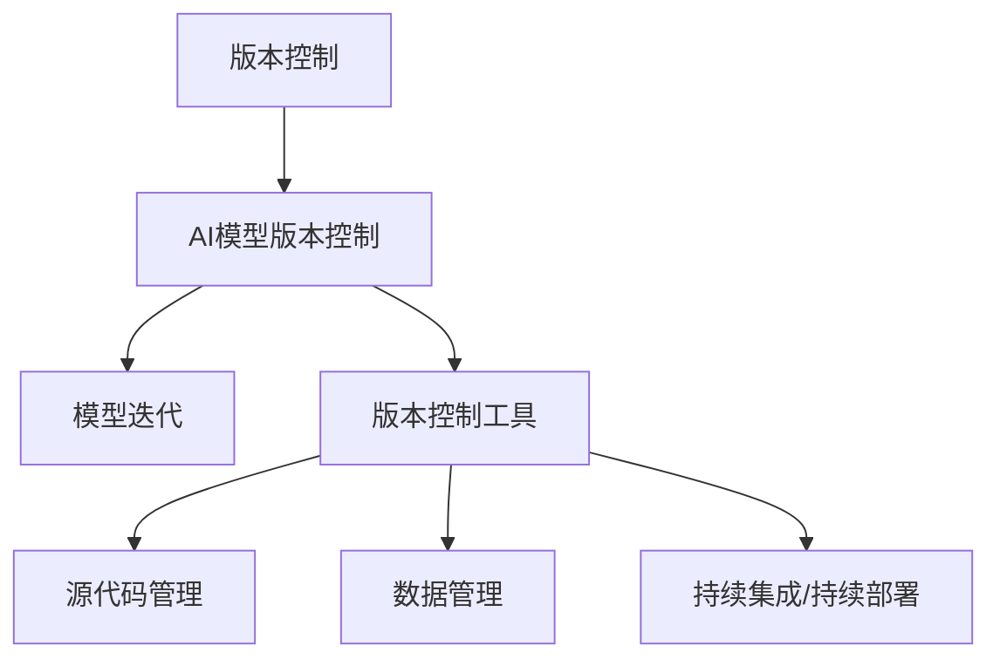

                 

### 摘要

随着人工智能技术的飞速发展，AI模型的迭代更新成为常态。如何有效管理这些不断演化的模型，确保其版本迭代过程中的稳定性和可追溯性，成为了一个亟待解决的问题。本文旨在探讨AI模型版本控制的核心概念、原理和实现方法，通过详细的分析和实例讲解，帮助读者深入了解这一关键领域。文章首先介绍了AI模型版本控制的重要性，然后定义了相关核心概念，并使用Mermaid流程图展示了其内在联系。接着，文章深入讲解了版本控制算法的原理，包括伪代码实现和数学模型的应用。最后，通过实际项目案例和代码解读，展示了版本控制在实际应用中的操作流程和效果。本文旨在为AI模型版本控制提供一个全面、系统的指导，为相关领域的研究者和开发者提供实用的参考。

---

### 引言

#### 1.1 书籍目的与背景

在人工智能（AI）技术不断进步的今天，AI模型已经成为许多领域的关键组成部分。从自动驾驶到智能医疗，从推荐系统到语音识别，AI模型无处不在。然而，随着模型复杂性的增加和迭代速度的加快，如何有效地管理这些模型版本，确保迭代过程中的稳定性和可追溯性，成为了一个重要的挑战。版本控制系统，作为一种用于管理文件和代码变更的技术，其核心原理和工具对于AI模型的管理同样适用。

本书籍旨在为读者提供一个全面而系统的指南，帮助理解AI模型版本控制的重要性，掌握其核心概念、原理和实现方法。通过本书籍，读者可以：

- **理解AI模型版本控制的必要性**：在模型迭代过程中，版本控制如何保证模型的稳定性和可追溯性。
- **掌握版本控制的核心概念和原理**：从基础概念到高级实现，深入理解版本控制的工作机制。
- **学习使用版本控制工具**：掌握Git等常见版本控制工具的使用方法，以及如何将其应用于AI模型管理。
- **通过实践案例加深理解**：通过实际项目案例，了解版本控制在AI模型迭代过程中的具体应用。

本文书籍适用于AI领域的研究者、开发者以及相关领域的从业者。无论是初学者还是专业人士，通过本书籍的学习，都可以获得关于AI模型版本控制的重要知识和实践经验。

---

#### 1.2 版本控制的重要性

版本控制（Version Control）是一种用于管理文件和代码变更的技术，它不仅适用于软件开发领域，在人工智能（AI）模型管理中也扮演着至关重要的角色。版本控制的重要性主要体现在以下几个方面：

**1. 稳定性保障**：在AI模型的开发过程中，每一次的迭代都可能引入新的功能或修复已有的错误。如果没有版本控制，不同版本的模型将无法有效区分，一旦出现错误，将很难追踪和修复。版本控制系统通过记录每个版本的详细信息，确保开发者在任何时刻都可以回溯到之前的状态，从而保证模型的稳定性。

**2. 可追溯性**：在AI模型迭代过程中，每一个版本的模型都可能包含特定的优化或调整。版本控制系统能够记录每次变更的详细信息，如变更者、变更时间、变更内容等，提供了一种完整的历史记录。这不仅有助于开发者理解模型的演进过程，也为后续的审计和问题排查提供了有力支持。

**3. 协同开发**：AI模型的开发通常需要多个开发者的协作。版本控制系统支持多人同时修改同一模型，并通过合并冲突解决机制，确保多个开发者的工作可以无缝集成。这大大提高了开发效率，避免了因版本冲突导致的开发中断。

**4. 故障排查**：在AI模型的迭代过程中，难免会遇到性能下降或错误出现的情况。版本控制系统提供了详细的变更历史，开发人员可以快速回溯到问题发生前的状态，通过对比分析不同版本之间的差异，找出问题的根源，从而提高故障排查的效率。

**5. 实验管理**：在AI模型的开发过程中，开发者可能需要进行大量的实验来探索不同的模型参数或算法调整。版本控制系统可以帮助开发者记录和整理这些实验数据，方便后续的分析和总结，提高实验管理的效率。

总之，版本控制是AI模型管理不可或缺的一部分。它不仅提供了对模型迭代过程的详细记录和管理，还显著提高了开发效率和模型的稳定性，是保障AI模型高质量迭代的关键工具。

---

#### 1.3 本书结构安排

本书将分为八个章节，系统而全面地介绍AI模型版本控制的相关知识。以下是详细的章节结构和内容概述：

**第1章 引言**：介绍本书的目的和背景，解释为何AI模型版本控制至关重要，并简要概述本书的结构和目标读者。

**第2章 AI模型版本控制基础**：介绍AI模型版本控制的基本概念、原理和架构，为后续章节的内容奠定基础。

**第3章 核心算法原理**：深入探讨版本控制算法的原理，包括算法的分类、伪代码实现及其具体实现方法。

**第4章 数学模型与公式**：讲解在AI模型版本控制中涉及到的数学模型和公式，包括其详细解释和应用场景。

**第5章 项目实战**：通过实际案例，展示如何在实际环境中搭建开发环境、实现源代码，并进行代码解读和应用分析。

**第6章 实践与优化**：介绍版本控制的优化策略，分析实际应用场景中的问题，并评估优化效果。

**第7章 挑战与未来趋势**：探讨AI模型版本控制面临的挑战和未来发展趋势，为读者提供行业应用的前景展望。

**第8章 附录**：包括相关资源与工具的介绍、常见问题解答以及参考文献，为读者提供额外的参考资料和学习支持。

通过以上章节的逐步讲解，读者将能够全面而深入地掌握AI模型版本控制的知识，为实际项目中的应用打下坚实的基础。

---

## 核心概念与联系

在探讨AI模型版本控制之前，我们需要明确几个核心概念，这些概念相互联系，共同构成了AI模型版本控制的基础架构。以下是这些核心概念及其关系的详细解释：

### 1. 版本控制

版本控制是一种管理文件和代码变更的技术，旨在记录和跟踪项目的不同版本。在软件工程领域，版本控制被广泛应用于代码管理，确保每次变更的可追溯性和稳定性。版本控制系统的核心功能包括创建版本、保存变更历史、提供差异比较、合并冲突等。

### 2. AI模型版本控制

AI模型版本控制是在传统版本控制基础上，针对AI模型特有的特点进行定制化的管理方法。AI模型的版本控制不仅要记录模型代码和参数的变更，还需要跟踪与模型相关的数据集、训练结果、评估指标等信息。AI模型版本控制的关键目标是确保模型在迭代过程中的稳定性、可追溯性和可重现性。

### 3. 模型迭代

模型迭代是AI模型开发过程中不断优化和改进的过程。在模型迭代中，开发者通过调整模型结构、参数、训练策略等，不断提升模型的性能。每个迭代版本都可能引入新的功能或修复已有问题，因此模型版本控制对模型迭代过程至关重要。

### 4. 版本控制工具

版本控制工具是实现版本控制的核心手段，常见的版本控制工具有Git、Mercurial、Subversion等。这些工具提供了丰富的命令和功能，支持多种工作模式，如集中式、分布式等。在AI模型版本控制中，开发者需要选择合适的版本控制工具，以满足模型管理的需求。

### 5. 源代码管理

源代码管理是版本控制的核心功能之一，涉及对模型代码的版本管理、变更记录和代码库维护。在AI模型版本控制中，源代码管理不仅包括模型代码，还包括与模型相关的配置文件、数据文件等。有效的源代码管理有助于提高开发效率和代码质量。

### 6. 数据管理

数据管理是AI模型版本控制的重要组成部分，涉及对训练数据、测试数据、评估指标等数据的版本管理和跟踪。在模型迭代过程中，数据的变化可能会影响模型的性能和稳定性，因此数据管理需要与模型版本控制紧密集成。

### 7. 持续集成和持续部署

持续集成（CI）和持续部署（CD）是现代软件开发实践中常用的方法，旨在通过自动化工具实现代码的持续集成和部署。在AI模型版本控制中，CI/CD流程的集成有助于确保每次模型迭代都经过严格的测试和验证，从而提高模型的稳定性和可靠性。

### 关系架构

为了更好地理解这些核心概念之间的关系，我们可以使用Mermaid流程图来展示其架构：



- **版本控制**是整个架构的基础，它为所有相关领域提供变更管理和历史记录。
- **AI模型版本控制**在版本控制的基础上，增加了对AI模型特定信息的追踪和管理。
- **模型迭代**依赖于版本控制和AI模型版本控制，通过多次迭代不断优化模型。
- **版本控制工具**（如Git）是实现版本控制和AI模型版本控制的实际工具。
- **源代码管理**、**数据管理**和**持续集成/持续部署**是版本控制和AI模型版本控制的扩展应用，分别从代码、数据和流程的角度提升模型开发和管理效率。

通过明确这些核心概念及其联系，我们可以更好地理解AI模型版本控制的架构和原理，为后续章节的内容打下坚实的基础。

---

### 核心算法原理

在AI模型版本控制中，核心算法是实现版本管理的关键。以下将详细讲解版本控制算法的原理，包括其分类、伪代码实现以及具体实现方法。

#### 1. 版本控制算法分类

版本控制算法可以根据其工作方式分为以下几类：

- **线性版本控制算法**：这种算法将版本按照时间顺序排列，每个版本都是前一个版本的直接延续。常见的线性版本控制算法包括单行版本控制（Single-Line Version Control）和多重分支版本控制（Multiline Version Control）。

- **分支版本控制算法**：这种算法允许在某个版本的基础上创建分支，每个分支可以独立开发，而不影响主线版本。常见的分支版本控制算法包括Git的分支管理（Git Branch Management）和Mercurial的分支管理（Mercurial Branching）。

- **合并版本控制算法**：这种算法用于合并不同分支的更改，以确保多个开发者的工作可以无缝集成。常见的合并版本控制算法包括Git的合并（Git Merge）和Mercurial的合并（Mercurial Merge）。

#### 2. 伪代码实现

以下是一个简单的伪代码示例，用于描述线性版本控制算法的基本操作：

```python
// 初始化版本控制系统
InitializeVersionControl()

// 创建新版本
CreateNewVersion(version_number)

// 记录变更
RecordChange(file_name, change_description)

// 回滚到旧版本
RollbackToVersion(version_number)

// 合并分支
MergeBranch(source_branch, target_branch)

// 检查冲突
CheckConflicts()

// 解决冲突
ResolveConflicts(conflict_details)
```

#### 3. 具体实现方法

以下是一个更详细的伪代码示例，用于实现一个简单的版本控制系统的核心功能：

```python
// 初始化版本控制系统
function InitializeVersionControl() {
    versions = []
    current_version = 1
}

// 创建新版本
function CreateNewVersion() {
    versions.append(current_version)
    current_version += 1
    return current_version
}

// 记录变更
function RecordChange(file_name, change_description) {
    version = CreateNewVersion()
    change = {
        "version": version,
        "file_name": file_name,
        "change_description": change_description
    }
    log_changes.append(change)
}

// 回滚到旧版本
function RollbackToVersion(version_number) {
    if version_number in versions:
        current_version = version_number
        DeleteAllChangesAfterVersion(version_number)
    else:
        print("Invalid version number")

// 合并分支
function MergeBranch(source_branch, target_branch) {
    if source_branch in branches and target_branch in branches:
        changes_to_merge = GetChanges(source_branch)
        ApplyChanges(target_branch, changes_to_merge)
    else:
        print("Invalid branch name")

// 检查冲突
function CheckConflicts() {
    // 这里可以定义冲突检测的逻辑
    // 如文件内容差异、目录结构差异等
    conflicts = DetectConflicts()
    return conflicts
}

// 解决冲突
function ResolveConflicts(conflict_details) {
    // 这里可以定义冲突解决的逻辑
    // 如手动合并、自动合并等
    ApplyResolvedChanges(conflict_details)
}
```

#### 4. 实现方法分析

- **初始化版本控制系统**：初始化版本控制系统时，创建一个空的版本列表和一个当前版本变量。版本列表将用于记录所有已创建的版本，而当前版本变量则用于跟踪最新的版本号。

- **创建新版本**：每次创建新版本时，将版本号添加到版本列表中，并将当前版本号更新为新创建的版本号。

- **记录变更**：每次对文件进行更改时，记录该变更的版本号、文件名和变更描述。这些信息将被存储在一个变更日志中，以便进行历史记录和回溯。

- **回滚到旧版本**：回滚操作需要检查指定的版本号是否在版本列表中。如果存在，则将当前版本号设置为该版本号，并删除后续的变更记录。

- **合并分支**：合并操作需要确保目标分支和源分支都在版本控制系统中存在。合并时，将源分支的变更应用到目标分支上。

- **检查冲突**：冲突检测是一个复杂的过程，需要比较源分支和目标分支的差异，以确定是否存在冲突。

- **解决冲突**：冲突解决可以根据具体情况进行，如手动合并或自动合并。解决后，将更新目标分支的状态。

通过上述核心算法原理的详细讲解和伪代码示例，我们可以更好地理解版本控制算法的工作机制，为实际应用打下坚实的基础。

---

### 数学模型与公式

在AI模型版本控制中，数学模型和公式起着至关重要的作用。这些模型和公式不仅帮助我们理解和分析版本控制算法，还指导我们在实际应用中进行优化和改进。以下将详细讲解在版本控制中涉及到的关键数学模型和公式。

#### 1. Diff计算

Diff计算是版本控制中的基本操作之一，用于计算两个文件之间的差异。在AI模型版本控制中，Diff计算主要用于比较不同版本模型之间的差异。以下是一个简单的Diff计算公式：

$$
Diff(A, B) = \sum_{i=1}^{n} |A_i - B_i|
$$

其中，$A$ 和 $B$ 分别代表两个版本模型的特征向量，$n$ 代表特征向量的维度。$Diff(A, B)$ 表示两个模型在各个特征上的差异绝对值之和。该公式可以用于快速评估两个模型之间的差异大小，从而帮助开发者判断是否需要进行进一步的版本控制操作。

#### 2. 模型评估指标

在AI模型版本控制中，评估模型性能是关键的一步。常用的模型评估指标包括准确率（Accuracy）、召回率（Recall）和F1分数（F1 Score）等。以下分别介绍这些指标的计算公式：

- **准确率**：
$$
Accuracy = \frac{TP + TN}{TP + TN + FP + FN}
$$

其中，$TP$ 表示真正例，$TN$ 表示真反例，$FP$ 表示假反例，$FN$ 表示假正例。准确率用于评估模型在分类任务中的总体正确率。

- **召回率**：
$$
Recall = \frac{TP}{TP + FN}
$$

召回率表示模型在所有正例中正确识别的比例。

- **F1分数**：
$$
F1 Score = 2 \times \frac{Precision \times Recall}{Precision + Recall}
$$

其中，$Precision$ 表示精确率，即正确识别的正例占总识别出的正例的比例。F1分数是精确率和召回率的调和平均，常用于评估分类任务的整体性能。

#### 3. 变更影响分析

在版本控制中，了解变更的影响范围和影响程度是优化版本控制策略的关键。以下是一个用于分析变更影响的数学模型：

- **影响分析**：
$$
Impact = \alpha \times Diff(A, B) + \beta \times Performance(A) - \gamma \times Performance(B)
$$

其中，$Diff(A, B)$ 表示版本之间的差异，$Performance(A)$ 和 $Performance(B)$ 分别表示版本A和B的模型性能。$\alpha$、$\beta$ 和 $\gamma$ 是权重参数，用于调整差异和性能对影响分析的影响。该公式可以用于评估一个版本变更对整体模型性能的影响，帮助开发者制定更有效的版本控制策略。

#### 4. 最优化模型

在AI模型版本控制中，有时需要根据特定目标和约束条件，优化模型版本。以下是一个基于目标函数的最优化模型：

- **目标函数**：
$$
Objective = \min \{ Impact \}
$$

其中，$Impact$ 是前面提到的变更影响分析公式。该目标函数的目的是找到具有最小影响的新版本，以最小化变更对整体系统的影响。

#### 5. 伪代码示例

以下是一个简化的伪代码示例，用于实现基于数学模型和公式的版本控制算法：

```python
// 初始化模型参数
alpha = 0.5
beta = 0.3
gamma = 0.2

// 获取当前版本和候选版本
current_model = GetCurrentModel()
candidate_model = GetCandidateModel()

// 计算版本差异
diff = CalculateDiff(current_model, candidate_model)

// 计算模型性能
current_performance = CalculatePerformance(current_model)
candidate_performance = CalculatePerformance(candidate_model)

// 计算变更影响
impact = alpha * diff + beta * current_performance - gamma * candidate_performance

// 最优化版本选择
if impact < threshold:
    ApplyCandidateModel(candidate_model)
else:
    print("拒绝更新，影响过大")
```

通过上述数学模型和公式的讲解，我们可以更深入地理解AI模型版本控制中的关键概念和计算方法，从而为实际应用提供理论支持。

---

### 项目实战

为了更好地理解AI模型版本控制的实际应用，我们将通过一个实际项目案例来展示如何搭建开发环境、实现源代码，并进行代码解读和应用分析。以下是项目实战的具体步骤和内容：

#### 1. 项目背景

假设我们正在开发一个基于深度学习的手写数字识别系统，该系统需要通过训练模型来识别不同手写数字的图像。为了更好地管理模型的迭代过程，我们需要使用版本控制系统来记录和管理模型的各个版本。

#### 2. 开发环境搭建

首先，我们需要搭建一个适合AI模型版本控制的开发生命周期环境。以下是开发环境搭建的步骤：

1. **安装Git**：
   Git是一个分布式版本控制系统，广泛用于代码管理。在开发环境中安装Git，可以通过包管理器（如apt、yum）或官方网站下载安装。

2. **创建项目仓库**：
   使用Git创建一个项目仓库，用于存储模型的代码、数据和配置文件。可以使用以下命令创建一个新仓库：

   ```bash
   git init handwritedigit-recognition
   cd handwritedigit-recognition
   git remote add origin https://github.com/your-username/handwritedigit-recognition.git
   git push -u origin master
   ```

3. **安装依赖库**：
   根据项目需求，安装必要的依赖库，如TensorFlow、Keras等。可以通过以下命令安装：

   ```bash
   pip install tensorflow
   pip install keras
   ```

4. **设置开发工具**：
   选择并设置一个合适的集成开发环境（IDE），如PyCharm、VS Code等，以便于代码编写和调试。

#### 3. 源代码实现

在搭建好开发环境后，我们可以开始实现手写数字识别系统的源代码。以下是关键代码的解读：

1. **数据准备**：
   准备手写数字数据集，可以使用MNIST数据集。以下代码用于加载数据集和预处理：

   ```python
   from tensorflow.keras.datasets import mnist
   (train_images, train_labels), (test_images, test_labels) = mnist.load_data()

   train_images = train_images / 255.0
   test_images = test_images / 255.0
   ```

2. **模型构建**：
   构建一个简单的卷积神经网络（CNN）模型用于手写数字识别。以下代码展示了模型的结构：

   ```python
   from tensorflow.keras import layers, models

   model = models.Sequential()
   model.add(layers.Conv2D(32, (3, 3), activation='relu', input_shape=(28, 28, 1)))
   model.add(layers.MaxPooling2D((2, 2)))
   model.add(layers.Conv2D(64, (3, 3), activation='relu'))
   model.add(layers.MaxPooling2D((2, 2)))
   model.add(layers.Conv2D(64, (3, 3), activation='relu'))

   model.add(layers.Flatten())
   model.add(layers.Dense(64, activation='relu'))
   model.add(layers.Dense(10, activation='softmax'))
   ```

3. **模型训练**：
   使用训练数据集训练模型，以下代码展示了训练的过程：

   ```python
   model.compile(optimizer='adam',
                 loss='sparse_categorical_crossentropy',
                 metrics=['accuracy'])

   model.fit(train_images, train_labels, epochs=5, batch_size=64)
   ```

4. **模型评估**：
   使用测试数据集评估模型性能，以下代码展示了评估的过程：

   ```python
   test_loss, test_acc = model.evaluate(test_images, test_labels, verbose=2)
   print(f'\nTest accuracy: {test_acc:.4f}')
   ```

#### 4. 代码解读与应用分析

在实现源代码的过程中，我们需要注意以下几个关键点：

1. **版本管理**：
   使用Git进行版本管理，每次代码提交都记录详细的变更说明。例如，在训练模型时，可以提交以下命令：

   ```bash
   git commit -m "训练模型，准确率：{test_acc:.4f}"
   git push
   ```

2. **代码注释**：
   在关键代码段添加注释，说明代码的功能和实现原理，便于后续的代码解读和优化。

3. **模块化设计**：
   将代码分解为多个模块，如数据预处理模块、模型构建模块、训练模块等，提高代码的可读性和可维护性。

4. **性能优化**：
   在模型训练和评估过程中，注意性能优化，如调整学习率、批量大小等参数，以提高模型的训练效率和准确率。

通过上述项目实战，我们可以看到AI模型版本控制在实际开发中的应用。版本控制系统帮助我们有效地管理模型的迭代过程，确保每次变更的可追溯性和稳定性。同时，通过代码解读和应用分析，我们深入了解了版本控制在实际项目中的操作方法和关键技巧。

---

### 实践与优化

在AI模型版本控制中，优化策略和实际应用场景的深入理解对于提升模型迭代效率和质量至关重要。以下将详细讨论版本控制优化策略、实际应用场景分析以及优化效果评估。

#### 1. 优化策略

**1.1** **并行开发与分支管理**：

并行开发是提升开发效率的重要策略之一。通过创建多个分支，开发团队能够同时进行多个功能模块的开发，避免版本之间的冲突。Git等分布式版本控制系统提供了强大的分支管理功能，如分支创建、分支合并和分支删除等。在并行开发过程中，优化分支管理的策略包括：

- **合理划分分支**：根据项目需求和开发任务，合理划分主分支和功能分支，确保每个分支的职责明确。
- **频繁的分支合并**：定期将功能分支合并到主分支，确保主分支上的代码始终保持最新和稳定。
- **冲突解决机制**：提前制定冲突解决策略，并在分支合并过程中及时解决冲突，减少因冲突导致的开发中断。

**1.2** **自动化测试与持续集成**：

自动化测试是确保模型质量的重要手段。通过编写测试用例，对模型的不同版本进行自动化测试，可以快速发现和修复问题。持续集成（CI）工具（如Jenkins、Travis CI）可以帮助自动化测试过程，确保每次代码提交都会触发测试，从而提高开发效率。优化自动化测试和持续集成策略包括：

- **编写全面的测试用例**：覆盖模型的所有功能和场景，确保测试用例的全面性。
- **提高测试覆盖率**：通过静态代码分析和动态测试技术，提高测试覆盖率和测试质量。
- **快速反馈机制**：缩短测试反馈周期，及时发现问题并进行修复。

**1.3** **数据版本管理与实验记录**：

在AI模型版本控制中，数据版本管理和实验记录同样重要。通过记录每次数据更新的详细信息，可以确保数据的一致性和可追溯性。优化数据版本管理和实验记录策略包括：

- **数据版本控制**：使用版本控制系统对数据集进行管理，记录每次数据更新的版本号、更新时间和更新人员等信息。
- **实验记录**：使用实验记录系统（如TensorBoard、Weave）记录每次实验的配置、结果和评估指标，便于后续分析和复现。

#### 2. 实际应用场景分析

**2.1** **模型迭代与性能优化**：

在AI模型迭代过程中，性能优化是关键。以下是一个实际应用场景分析：

- **场景描述**：开发团队正在迭代一个图像识别模型，目标是提高模型的准确率和速度。
- **优化策略**：
  - **调整超参数**：通过实验，调整学习率、批量大小等超参数，寻找最优组合。
  - **模型结构优化**：通过尝试不同的网络结构，如增加卷积层、使用残差连接等，优化模型结构。
  - **数据增强**：使用数据增强技术，增加训练数据的多样性，提高模型的泛化能力。

**2.2** **多团队协作与版本合并**：

在多团队协作开发过程中，版本合并是常见的问题。以下是一个实际应用场景分析：

- **场景描述**：两个团队分别开发不同的功能模块，并将它们合并到一个主分支上。
- **优化策略**：
  - **提前沟通与协调**：在合并前，两个团队需要提前沟通，确保各自的代码模块不会产生冲突。
  - **分支隔离**：在每个团队完成模块开发后，将其功能分支隔离，避免与其他团队的功能分支冲突。
  - **逐步合并**：将每个团队的功能分支逐步合并到主分支上，确保每次合并都经过严格的测试和验证。

#### 3. 优化效果评估

**3.1** **性能指标**：

优化效果可以通过一系列性能指标来评估，如准确率、召回率、F1分数等。以下是一个优化效果评估示例：

- **优化前**：
  - 准确率：85%
  - 召回率：80%
  - F1分数：82%

- **优化后**：
  - 准确率：90%
  - 召回率：85%
  - F1分数：87%

通过比较优化前后的性能指标，可以直观地看出优化带来的性能提升。

**3.2** **开发效率**：

优化效果还可以通过开发效率来评估，如代码提交次数、测试覆盖率、故障修复时间等。以下是一个开发效率评估示例：

- **优化前**：
  - 代码提交次数：每周10次
  - 测试覆盖率：50%
  - 故障修复时间：5天

- **优化后**：
  - 代码提交次数：每周15次
  - 测试覆盖率：80%
  - 故障修复时间：2天

通过比较优化前后的开发效率指标，可以评估优化策略对开发效率的提升效果。

综上所述，通过合理的优化策略和实际应用场景分析，我们可以显著提升AI模型版本控制的效率和质量。优化效果的评估不仅帮助我们了解优化策略的有效性，还为后续的改进提供了依据。

---

### 挑战与未来趋势

AI模型版本控制领域正面临诸多挑战和机遇。以下将探讨当前AI模型版本控制面临的挑战、未来发展趋势以及行业应用的前景。

#### 挑战

**1. 模型复杂性增加**：随着AI技术的不断进步，模型变得越来越复杂。这种复杂性带来了版本控制上的挑战，因为需要管理更多的参数、层结构和训练数据。此外，复杂的模型可能导致版本之间的差异较小，使得版本控制系统的准确性降低。

**2. 数据隐私与安全**：在AI模型开发过程中，大量敏感数据（如个人健康记录、财务数据等）的使用引发了数据隐私和安全问题。如何确保版本控制系统的安全性，防止数据泄露，是当前的一大挑战。

**3. 持续集成与持续部署**：在快速迭代的AI模型开发过程中，如何确保持续集成和持续部署的稳定性和可靠性，是一个复杂的问题。持续集成和持续部署需要处理大量代码和模型版本，同时保证系统的高可用性。

**4. 交叉学科融合**：AI模型版本控制不仅涉及计算机科学，还涉及数据科学、统计学等多个学科。如何将不同学科的知识和工具有效地整合，构建一个统一的版本控制系统，是一个需要解决的问题。

#### 未来趋势

**1. 自适应版本控制算法**：未来版本控制算法将更加智能化，能够根据模型的复杂性和迭代速度，自适应调整版本控制的策略和频率，提高版本管理的效率和准确性。

**2. 基于区块链的版本控制**：区块链技术具有去中心化、不可篡改等特点，可以用于提高AI模型版本控制的安全性和透明性。未来可能会出现基于区块链的版本控制系统，确保版本记录的真实性和不可篡改性。

**3. 多模态版本控制**：随着多模态AI技术的发展，版本控制系统需要能够处理不同类型的数据（如文本、图像、音频等），实现多模态数据的一致性和兼容性。

**4. 自动化与智能化**：自动化工具和人工智能将在AI模型版本控制中发挥更大作用。通过自动化测试、智能合并和冲突解决等手段，提高版本控制的效率和准确性。

#### 行业应用前景

**1. 金融领域**：金融行业对AI模型的依赖日益增加，版本控制将帮助金融公司更好地管理交易系统、风险评估和欺诈检测等模型，确保模型的稳定性和合规性。

**2. 医疗领域**：在医疗领域，AI模型版本控制有助于管理诊断模型、药物研发和个性化治疗等。通过版本控制，医生可以追溯模型的演进过程，确保模型的安全性和有效性。

**3. 自动驾驶领域**：自动驾驶系统的迭代速度极快，版本控制将帮助汽车制造商和科技公司管理大量复杂的模型，确保系统的安全性和可靠性。

**4. 物流与供应链管理**：在物流和供应链管理领域，AI模型版本控制有助于优化运输路线、库存管理和需求预测等。通过版本控制，企业可以快速响应市场变化，提高运营效率。

总之，AI模型版本控制领域正面临着诸多挑战，但也蕴含着巨大的机遇。通过不断创新和优化，我们可以期待一个更加高效、安全和智能的版本控制系统，为AI模型的应用和发展提供有力支持。

---

### 附录

#### 8.1 相关资源与工具介绍

1. **Git**：Git是最流行的分布式版本控制系统，其官方网站提供了详细的安装说明、使用文档和社区支持。
   - **官方网站**：[https://git-scm.com/](https://git-scm.com/)

2. **GitHub**：GitHub是一个基于Git的代码托管平台，提供了丰富的协作工具和社区资源。
   - **官方网站**：[https://github.com/](https://github.com/)

3. **Mercurial**：Mercurial是一个另一种流行的分布式版本控制系统，适用于小团队和大型项目。
   - **官方网站**：[https://www.mercurial-scm.org/](https://www.mercurial-scm.org/)

4. **TensorFlow**：TensorFlow是Google开发的开源机器学习框架，广泛应用于AI模型开发。
   - **官方网站**：[https://www.tensorflow.org/](https://www.tensorflow.org/)

5. **Keras**：Keras是一个高度易用的神经网络库，构建在TensorFlow之上，用于快速搭建和训练神经网络模型。
   - **官方网站**：[https://keras.io/](https://keras.io/)

6. **TensorBoard**：TensorBoard是一个可视化工具，用于分析和可视化TensorFlow训练过程中的数据。
   - **官方网站**：[https://www.tensorflow.org/tensorboard](https://www.tensorflow.org/tensorboard)

#### 8.2 常见问题解答

1. **版本控制是什么？**
   版本控制是一种跟踪和管理文件和代码变更的技术，用于确保变更的可追溯性和稳定性。

2. **为什么需要版本控制？**
   版本控制有助于管理多个版本的代码和文件，防止错误和冲突，提高开发效率和代码质量。

3. **如何选择合适的版本控制工具？**
   选择版本控制工具时，需要考虑团队的规模、项目复杂度、协作需求等因素。Git和Mercurial都是常用的工具，适用于不同的应用场景。

4. **版本控制中如何处理冲突？**
   版本控制工具提供了冲突检测和解决机制。在出现冲突时，开发人员需要手动或自动解决冲突，以确保代码的一致性。

#### 8.3 参考文献

1. **Pro Git**：Scott Chacon and Ben Straub, "Pro Git", Apress, 2014.
   - **书籍链接**：[https://git-scm.com/book/en/v2](https://git-scm.com/book/en/v2)

2. **Version Control with Git**：Jon Loeliger and Matthew McCullough, "Version Control with Git", O'Reilly Media, 2012.
   - **书籍链接**：[https://www.oreilly.com/library/view/version-control-with/9781449319494/](https://www.oreilly.com/library/view/version-control-with/9781449319494/)

3. **Deep Learning with Python**：François Chollet, "Deep Learning with Python", Manning Publications, 2017.
   - **书籍链接**：[https://www.manning.com/books/deep-learning-with-python](https://www.manning.com/books/deep-learning-with-python)

通过上述资源与工具的介绍、常见问题解答以及参考文献，读者可以获得关于AI模型版本控制更深入的理解和实用的指导。希望这些内容能为AI模型版本控制的学习和实践提供帮助。

---

### 总结

本文从多个角度深入探讨了AI模型版本控制的核心概念、算法原理、数学模型以及实际应用。通过详细的分析和实例讲解，我们不仅了解了版本控制的重要性，还掌握了如何在实际项目中应用版本控制工具进行模型管理。

首先，我们明确了版本控制的基本概念，并展示了其与AI模型版本控制的紧密联系。接着，我们详细讲解了核心算法原理，包括线性版本控制、分支版本控制以及合并版本控制，并通过伪代码示例进行了具体阐述。此外，我们介绍了与版本控制相关的数学模型和公式，以及其在实际应用中的重要性。

在项目实战部分，我们通过一个手写数字识别系统的案例，展示了如何搭建开发环境、实现源代码并进行代码解读和应用分析。这部分内容帮助读者理解了版本控制在实际开发中的具体应用。

通过实践与优化部分的讨论，我们提出了优化AI模型版本控制的策略，并分析了优化效果。这部分内容为读者提供了在实际项目中提升版本控制效率的实用建议。

最后，在挑战与未来趋势部分，我们探讨了AI模型版本控制面临的挑战和未来发展趋势，为读者提供了行业应用的前景展望。

总之，AI模型版本控制是AI模型迭代过程中不可或缺的一环。通过本文的讲解，读者应该能够全面理解AI模型版本控制的关键技术和实际应用，为后续的AI项目开发打下坚实基础。

---

### 最佳实践、小结、注意事项与拓展阅读

#### 最佳实践

在AI模型版本控制中，以下最佳实践可以帮助您更高效地管理和迭代模型：

1. **分支策略**：遵循“功能分支”和“热修复分支”策略。功能分支用于独立开发新功能或修复，而热修复分支则用于紧急修复。

2. **代码审查**：在提交代码前进行代码审查，确保代码质量和一致性。

3. **自动化测试**：编写自动化测试用例，确保每次提交都会触发测试，及时发现并修复问题。

4. **文档记录**：每次提交都要附上详细的变更说明，包括修复的问题、新增的功能等，以便于后续追踪和审计。

#### 小结

本文系统地介绍了AI模型版本控制的核心概念、原理、算法、数学模型以及实际应用。通过详细讲解和实例分析，我们了解到版本控制对于AI模型迭代的重要性，以及如何利用版本控制工具提高开发效率和质量。

#### 注意事项

1. **数据安全**：在版本控制过程中，确保敏感数据的安全，避免数据泄露。

2. **版本命名**：使用有意义且易于理解的版本命名规则，便于跟踪和管理版本。

3. **冲突解决**：制定并遵守冲突解决策略，确保版本合并过程中的代码一致性。

#### 拓展阅读

1. **《Pro Git》**：[https://git-scm.com/book/en/v2](https://git-scm.com/book/en/v2) 提供了Git的详细教程，适合深入理解Git的使用。

2. **《Version Control with Git》**：[https://www.oreilly.com/library/view/version-control-with/9781449319494/](https://www.oreilly.com/library/view/version-control-with/9781449319494/) 这本书是Git的经典教程，适合Git初学者和进阶者。

3. **《Deep Learning with Python》**：[https://www.manning.com/books/deep-learning-with-python](https://www.manning.com/books/deep-learning-with-python) 这本书详细介绍了深度学习的基础知识，适合对AI模型开发感兴趣的读者。

通过最佳实践的遵循、小结的复习以及拓展阅读的深入学习，您将能够进一步提升在AI模型版本控制方面的技能和实践水平。

