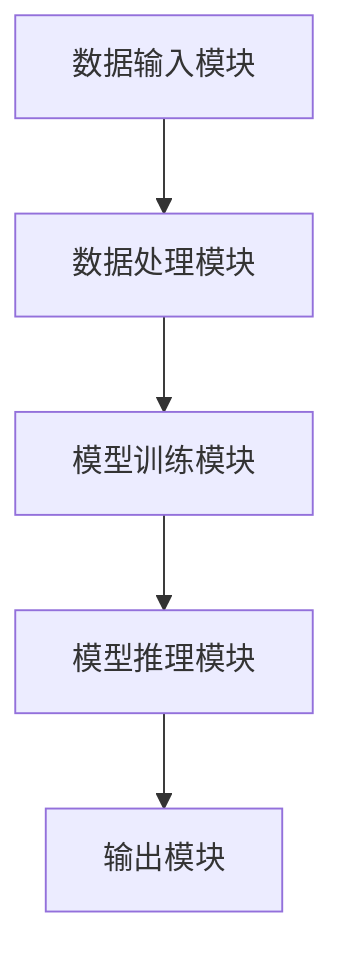
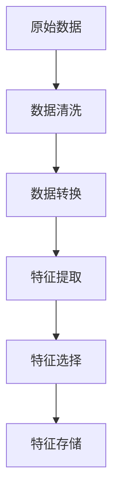

                 

### 文章标题

# AI系统可观测性：深入洞察AI应用运行状态

### 关键词

- AI系统
- 可观测性
- 运行状态
- 数据采集
- 特征工程
- 可视化
- 开源工具

### 摘要

随着人工智能技术的迅猛发展，AI系统的应用越来越广泛，其运行状态的可观测性成为了一个至关重要的问题。本文将深入探讨AI系统可观测性的重要性、基本概念、技术原理及其在实际应用中的案例分析。通过介绍开源工具和未来展望，我们希望能够为读者提供一个全面、系统的AI系统可观测性指南。

## 引言

人工智能（AI）作为一种引领未来的技术，已经在许多领域取得了显著的成果。从自动驾驶汽车到智能语音助手，从金融风控到医疗诊断，AI技术正以前所未有的速度改变着我们的世界。然而，随着AI系统的复杂度不断增加，其运行状态的可观测性成为一个亟待解决的问题。

可观测性指的是我们能够对系统的状态进行有效监测和评估的能力。在AI系统中，可观测性对于以下方面具有重要意义：

1. **故障诊断与排除**：通过可观测性，我们可以及时发现并解决AI系统中的故障，确保系统的稳定运行。
2. **性能优化**：通过监测系统的运行状态，我们可以找出影响系统性能的关键因素，从而进行针对性的优化。
3. **安全性与隐私保护**：可观测性有助于我们及时发现并解决AI系统中的安全漏洞和隐私泄露问题，确保系统的安全性和合规性。

本文将围绕AI系统可观测性这一主题，详细探讨其概念、技术原理、实际应用案例以及未来展望。希望通过本文的阅读，读者能够对AI系统可观测性有更深入的理解，并为实际应用提供有益的参考。

## AI系统概述

### 1.1 AI系统的基本概念

人工智能（AI）是指由人创造出来的系统，它能够模拟、延伸和扩展人类的智能，进行感知、学习、推理、决策等认知活动。根据美国人工智能协会（AAAI）的定义，AI是一门研究、开发用于模拟、延伸和扩展人类智能的理论、方法、技术和应用的学科。

AI系统通常可以分为三大类：

1. **弱人工智能（Weak AI）**：弱人工智能是指专注于特定任务的AI系统，如语音助手、推荐系统等。这些系统在特定领域内表现出人类智能的特征，但无法进行跨领域的推理和决策。
2. **强人工智能（Strong AI）**：强人工智能是指具有普遍智能的AI系统，能够像人类一样进行复杂的认知活动，具备自我意识和自主决策能力。目前，强人工智能仍然处于理论研究阶段，尚未实现商业化应用。
3. **超人工智能（Super AI）**：超人工智能是指超越人类智能的AI系统，其能力远超人类，能够在所有领域内进行复杂的认知活动。超人工智能目前还只存在于科幻作品中，尚未成为现实。

### 1.2 AI系统的架构

AI系统的架构通常包括以下几个主要组成部分：

1. **数据输入模块**：数据输入模块负责接收外部输入数据，如文本、图像、声音等。这些数据是AI系统进行学习和推理的基础。
2. **数据处理模块**：数据处理模块负责对输入数据进行预处理、清洗、转换等操作，使其适合进行模型训练。
3. **模型训练模块**：模型训练模块负责使用输入数据进行模型的训练和优化。常见的训练方法包括监督学习、无监督学习和强化学习等。
4. **模型推理模块**：模型推理模块负责使用训练好的模型进行预测和决策。推理模块通常具有较高的实时性，以满足实际应用的需求。
5. **输出模块**：输出模块负责将模型推理结果输出到外部系统或用户界面，如文本、图像、语音等。

### 1.3 AI系统的发展历程

AI系统的发展历程可以分为以下几个阶段：

1. **早期探索阶段（1950s-1960s）**：在这一阶段，AI系统主要集中于符号推理和知识表示。代表性的工作包括纽厄尔和西蒙的“逻辑理论家”（Logic Theorist）和马文·明斯基的“感知器”（Perceptron）。
2. **人工智能寒冬阶段（1970s-1980s）**：由于技术瓶颈和实际应用的缺乏，AI研究进入了低谷期。这一阶段的代表性事件包括1976年的“人工智能泡沫”和1980年的“智能决策支持系统”会议。
3. **复兴阶段（1990s-2000s）**：随着计算机性能的提升和大数据技术的发展，AI研究重新焕发了生机。这一阶段的代表性工作包括支持向量机（SVM）、深度学习等。
4. **爆发阶段（2010s-至今）**：深度学习的突破性进展使得AI技术实现了前所未有的应用价值。代表性事件包括2012年谷歌的“猫识别”和2016年AlphaGo击败李世石。

通过以上概述，我们可以看到AI系统在基本概念、架构和发展历程方面都有着丰富的内涵。接下来，本文将深入探讨AI系统可观测性的核心概念和技术原理。

### 可观测性概念

可观测性（Observability）是指系统能够被有效监测和评估的能力。在AI系统中，可观测性尤为重要，因为AI系统的复杂性和不确定性使得其运行状态难以直接感知。以下是可观测性的核心概念及其在AI系统中的意义。

#### 3.1 可观测性的定义

可观测性可以分为以下几个层次：

1. **透明性（Transparency）**：透明性指的是系统能够提供详细的内部状态信息，使外部观察者能够清晰地了解系统的工作过程。在AI系统中，透明性有助于我们理解和验证模型的决策过程，提高系统的可信度和可解释性。
2. **可诊断性（Diagnosability）**：可诊断性指的是系统能够及时发现和识别故障，并提供相应的故障信息。对于AI系统来说，可诊断性至关重要，因为它能够帮助我们迅速定位和解决系统中的问题，确保系统的稳定运行。
3. **可测量性（Measurability）**：可测量性指的是系统能够提供一系列关键性能指标（KPIs），使我们能够实时监测系统的运行状态。这些指标包括模型的准确率、响应时间、资源消耗等，有助于我们进行性能优化和资源调度。

#### 3.2 可观测性在AI系统中的意义

在AI系统中，可观测性具有以下几个重要意义：

1. **故障诊断与排除**：通过可观测性，我们可以实时监测系统的运行状态，及时发现并识别故障。例如，当AI模型在预测过程中出现错误时，我们可以通过监测数据来定位错误发生的环节，并采取相应的措施进行修复。
2. **性能优化**：可观测性使我们能够实时了解系统的性能指标，从而发现影响系统性能的关键因素。通过针对性的优化，我们可以提高系统的效率和可靠性，提升用户体验。
3. **安全性与隐私保护**：可观测性有助于我们识别系统中的安全漏洞和隐私泄露问题。通过实时监测和评估，我们可以及时采取措施，确保系统的安全性和合规性。
4. **可解释性与信任度**：透明性作为可观测性的一个重要方面，有助于提高AI系统的可解释性和信任度。通过了解模型的决策过程，用户可以更好地理解系统的行为，从而增加对系统的信任。

综上所述，可观测性在AI系统中具有重要意义，它是保障系统稳定运行、优化性能、确保安全性和提升用户信任的关键因素。在接下来的部分，我们将详细探讨实现AI系统可观测性的技术原理。

### 可观测性技术

#### 4.1 数据采集与处理

数据采集与处理是实现AI系统可观测性的基础环节，其质量直接影响后续分析和优化的效果。以下是数据采集与处理的主要步骤和技术：

##### 4.1.1 数据采集技术

数据采集技术主要包括以下几个方面：

1. **传感器数据采集**：在物理环境中，传感器可以用于采集温度、湿度、光线、声音等物理量，将其转换为电信号，通过数据接口传输到系统。
2. **网络数据采集**：通过网络接口，系统可以实时采集来自互联网、物联网设备或其他系统传输的数据。
3. **日志数据采集**：系统日志是记录系统运行过程中发生的事件和异常的重要来源。通过日志分析，我们可以获取系统的运行状态和性能指标。
4. **性能监控数据采集**：性能监控工具可以实时采集系统的CPU利用率、内存占用、网络流量、磁盘IO等性能指标。

##### 4.1.2 数据处理流程

数据处理流程主要包括以下几个步骤：

1. **数据清洗**：数据清洗是数据处理的第一步，目的是去除数据中的噪声和异常值，提高数据质量。常见的数据清洗方法包括去除重复数据、填补缺失值、处理异常值等。
2. **数据转换**：数据转换是将采集到的原始数据转换为适合分析和处理的形式。常见的数据转换方法包括归一化、标准化、特征提取等。
3. **数据存储**：处理后的数据需要存储在数据库或数据仓库中，以便后续分析和处理。常用的数据存储技术包括关系型数据库、NoSQL数据库、数据湖等。
4. **数据索引**：数据索引可以提高数据查询的效率。常用的数据索引技术包括B树索引、哈希索引等。

##### 4.1.3 数据处理流程示例

以下是一个数据处理流程的示例：

```
# 数据清洗
data_cleaned = data_clean(data_raw)

# 数据转换
data_transformed = data_transform(data_cleaned)

# 数据存储
store_data(data_transformed)

# 数据索引
index_data(data_transformed)
```

在这个示例中，`data_raw`代表原始数据，`data_clean`函数用于清洗数据，`data_transform`函数用于转换数据，`store_data`函数用于存储数据，`index_data`函数用于建立数据索引。

通过以上数据采集与处理技术，我们可以确保采集到的数据质量，为后续的分析和优化提供可靠的数据基础。在下一部分，我们将探讨特征工程技术，这是实现可观测性的关键步骤之一。

#### 4.2 特征工程

特征工程是AI系统可观测性实现过程中的关键步骤，它涉及到从原始数据中提取和选择对模型训练和预测有用的特征。以下是特征工程的主要方法：

##### 4.2.1 特征提取方法

特征提取方法可以分为以下几类：

1. **基于统计的方法**：这种方法利用统计学原理对数据进行处理，提取出具有显著性的特征。常见的方法包括均值、方差、标准差、相关系数等。
2. **基于信息论的方法**：这种方法利用信息论中的概念，提取出对分类或回归任务有用的特征。常见的方法包括互信息、信息增益等。
3. **基于模型的方法**：这种方法利用现有的机器学习模型对特征进行筛选和提取，根据模型对特征的偏好来选择有用的特征。常见的方法包括主成分分析（PCA）、线性判别分析（LDA）等。
4. **基于深度学习的方法**：这种方法利用深度学习模型对特征进行自动提取，通过多层神经网络学习到高级、抽象的特征。常见的方法包括卷积神经网络（CNN）、循环神经网络（RNN）等。

##### 4.2.2 特征选择策略

特征选择策略的目标是在保证模型性能的前提下，尽量减少特征的数量，提高模型的泛化能力。以下是几种常见的特征选择策略：

1. **过滤式特征选择**：这种方法在特征提取之前进行，通过计算特征与目标变量之间的相关性来筛选特征。常见的方法包括皮尔逊相关系数、卡方检验等。
2. **包裹式特征选择**：这种方法在特征提取之后进行，通过搜索整个特征空间来选择最优特征组合。常见的方法包括递归特征消除（RFE）、遗传算法等。
3. **嵌入式特征选择**：这种方法在特征提取和模型训练过程中同时进行，通过模型对特征的权重进行学习，自动筛选出重要的特征。常见的方法包括LASSO、Ridge回归等。
4. **基于模型的特征选择**：这种方法利用现有模型对特征进行筛选和优化，根据模型对特征的偏好来选择有用的特征。常见的方法包括随机森林、支持向量机等。

##### 4.2.3 特征选择流程示例

以下是一个特征选择流程的示例：

```
# 数据预处理
data_preprocessed = data_preprocessing(data_raw)

# 特征提取
features_extracted = feature_extraction(data_preprocessed)

# 特征选择
selected_features = feature_selection(features_extracted)

# 模型训练
model = train_model(selected_features)

# 模型评估
evaluate_model(model)
```

在这个示例中，`data_raw`代表原始数据，`data_preprocessing`函数用于数据预处理，`feature_extraction`函数用于特征提取，`feature_selection`函数用于特征选择，`train_model`函数用于模型训练，`evaluate_model`函数用于模型评估。

通过有效的特征工程和特征选择，我们可以提高AI系统的可观测性，使其在运行过程中能够提供更有价值的信息。在下一部分，我们将介绍可视化技术，这是实现可观测性的重要手段之一。

### 可视化技术

#### 4.3.1 可视化基础

可视化技术是AI系统可观测性的重要手段，它通过将复杂的数据和计算结果以图形化的方式展示，帮助我们直观地理解和分析系统的运行状态。以下是可视化技术的几个基础概念：

1. **数据可视化**：数据可视化是将数据通过图形、图表等方式展示，使数据变得更加直观和易于理解。常见的数据可视化类型包括柱状图、折线图、饼图、散点图等。
2. **交互式可视化**：交互式可视化允许用户与图表进行交互，通过选择、放大、缩小等操作来探索数据。这种可视化方式有助于发现数据中的隐藏模式和关系。
3. **复杂数据可视化**：复杂数据可视化用于展示大型、多维数据集，如热力图、平行坐标图、三维散点图等。这种可视化方式能够帮助我们理解数据的整体结构和细节。

#### 4.3.2 可视化工具介绍

以下是几种常用的可视化工具：

1. **Matplotlib**：Matplotlib是一个基于Python的绘图库，提供了丰富的绘图功能，适用于生成静态和交互式图表。
2. **Seaborn**：Seaborn是Matplotlib的一个扩展库，专门用于数据可视化，提供了更美观、更高级的绘图样式。
3. **Plotly**：Plotly是一个基于JavaScript的绘图库，支持生成交互式图表，可以用于Web应用程序中的数据可视化。
4. **D3.js**：D3.js是一个基于JavaScript的绘图库，用于生成复杂数据可视化，具有高度的灵活性和自定义性。

#### 4.3.3 可视化示例

以下是一个使用Matplotlib生成折线图的示例：

```python
import matplotlib.pyplot as plt

# 数据
x = [1, 2, 3, 4, 5]
y = [1, 4, 9, 16, 25]

# 绘制折线图
plt.plot(x, y)
plt.xlabel('X轴')
plt.ylabel('Y轴')
plt.title('折线图示例')
plt.show()
```

在这个示例中，我们首先导入Matplotlib库，然后定义了X轴和Y轴的数据。接着，使用`plot`函数绘制折线图，并通过`xlabel`、`ylabel`和`title`函数添加标签和标题。最后，调用`show`函数显示图表。

通过有效的可视化技术，我们可以将复杂的AI系统运行状态以直观的方式展示出来，有助于我们进行故障诊断、性能优化和安全评估。在下一部分，我们将通过实际应用案例分析，展示可观测性技术在实际应用中的具体应用。

### 实际应用案例分析

#### 5.1 案例背景与目标

本案例将分析一个自动驾驶汽车系统的可观测性实现，该系统由多个AI模块组成，包括感知、决策和控制。自动驾驶汽车系统的目标是确保车辆在复杂交通环境中安全、稳定地行驶。

本案例的目标是通过实现可观测性技术，实现对自动驾驶汽车系统运行状态的实时监测和分析，从而提高系统的可靠性和安全性。具体目标包括：

1. **故障诊断与排除**：通过实时监测系统的运行状态，及时发现并诊断故障，确保系统的稳定运行。
2. **性能优化**：通过监测系统的性能指标，找出影响系统性能的关键因素，进行针对性的优化。
3. **安全性与隐私保护**：通过实时监测和评估系统的安全性，确保车辆在行驶过程中的安全性和用户隐私的保护。

#### 5.2 案例实现过程

以下是实现自动驾驶汽车系统可观测性的具体步骤：

1. **数据采集与处理**：首先，我们需要采集系统的运行数据，包括传感器数据（如摄像头、雷达、激光雷达等）、系统日志和性能监控数据。然后，对采集到的数据进行清洗、转换和存储，以便后续分析和处理。
2. **特征提取与选择**：通过对采集到的数据进行特征提取和选择，提取出对系统性能和安全至关重要的特征，如车辆速度、加速度、行驶轨迹、周围车辆和行人的位置和速度等。
3. **数据可视化**：利用可视化技术，将提取到的特征数据进行可视化展示，使开发者和测试人员能够直观地了解系统的运行状态。常用的可视化工具包括Matplotlib、Seaborn和Plotly等。
4. **监控与报警**：通过设置监控阈值和报警规则，实时监测系统的关键性能指标，当指标超出阈值时，自动触发报警，提醒开发者和测试人员进行故障诊断和排除。
5. **性能优化与安全评估**：根据监控和分析结果，找出系统性能和安全性的瓶颈，进行针对性的优化。同时，定期进行安全评估，确保系统在各个方面的可靠性。

#### 5.3 案例效果分析

通过实现可观测性技术，自动驾驶汽车系统在运行过程中取得了显著的效果：

1. **故障诊断与排除**：在系统运行过程中，通过实时监测和可视化展示，开发者和测试人员能够迅速发现并诊断故障，确保系统的稳定运行。例如，当感知模块出现异常时，可视化界面会立即显示相关传感器数据的异常情况，帮助开发人员快速定位和解决问题。
2. **性能优化**：通过实时监测系统的性能指标，开发者和测试人员能够找出影响系统性能的关键因素，进行针对性的优化。例如，通过优化决策模块的算法，可以显著提高系统的响应速度和决策准确性。
3. **安全性与隐私保护**：通过实时监测和评估系统的安全性，开发者和测试人员能够及时发现并解决潜在的安全漏洞和隐私泄露问题。例如，当系统检测到恶意攻击时，会立即触发报警并采取措施进行防护。

总之，通过实现可观测性技术，自动驾驶汽车系统在故障诊断、性能优化和安全评估方面取得了显著的效果，为自动驾驶技术的进一步发展奠定了基础。在下一部分，我们将介绍AI系统可观测性所使用的开源工具和平台。

### 可观测性工具与平台

在实现AI系统可观测性的过程中，开源工具和平台起着至关重要的作用。这些工具和平台为数据采集、处理、分析和可视化提供了强大的支持，使开发者能够更高效地构建和管理可观测性系统。以下是几种常用的开源工具和平台：

#### 6.1 Prometheus

Prometheus是一个开源的监控解决方案，由SoundCloud开发并捐赠给CNCF（Cloud Native Computing Foundation）。它适用于大规模分布式系统的监控，具有以下特点：

1. **数据采集**：Prometheus使用拉模式（Pull-based）进行数据采集，可以定期从目标节点上拉取指标数据。
2. **时序数据库**：Prometheus使用自己的时序数据库存储采集到的数据，支持高效的查询和告警。
3. **告警管理**：Prometheus提供了丰富的告警功能，可以通过配置规则触发告警，支持多种告警渠道（如电子邮件、短信、Webhook等）。

#### 6.2 Grafana

Grafana是一个开源的数据分析和可视化平台，可以与多种数据源集成，如Prometheus、InfluxDB、Kibana等。它具有以下特点：

1. **数据可视化**：Grafana提供了丰富的图表和仪表盘，可以自定义图表样式和布局，实现数据的实时展示。
2. **告警管理**：Grafana集成了告警管理功能，可以接收Prometheus等数据源的告警，并通过邮件、短信、Webhook等方式通知用户。
3. **数据源集成**：Grafana支持多种数据源，包括时间序列数据库、关系型数据库、日志文件等，可以满足不同场景的需求。

#### 6.3 Datadog

Datadog是一个集监控、日志和安全性于一体的平台，提供了丰富的开源工具和API，适用于大规模分布式系统的监控和管理。它具有以下特点：

1. **自动化监控**：Datadog支持自动发现和监控应用程序的各个组件，包括容器、微服务、主机和网络设备等。
2. **日志管理**：Datadog提供了日志聚合和搜索功能，可以收集和分析应用程序的日志，帮助开发者快速定位问题和排查故障。
3. **安全性**：Datadog集成了多种安全性功能，包括漏洞扫描、入侵检测、数据加密等，帮助保护系统的安全性和合规性。

#### 6.4 New Relic

New Relic是一个集性能监控、应用性能管理和安全性于一体的平台，适用于云原生和传统应用程序的监控和管理。它具有以下特点：

1. **全栈监控**：New Relic支持对应用程序的代码、数据库、网络和主机进行全方位的监控，提供实时的性能数据。
2. **可视化分析**：New Relic提供了丰富的可视化工具，可以自定义仪表盘和报告，帮助开发者快速识别性能瓶颈和问题。
3. **自动化告警**：New Relic支持自动告警和通知，可以根据不同的指标阈值触发告警，并支持多种告警渠道。

通过使用这些开源工具和平台，开发者可以轻松实现AI系统的可观测性，提高系统的稳定性和可靠性。在下一部分，我们将探讨AI系统可观测性技术的未来发展趋势和面临的挑战。

### 未来展望与挑战

#### 7.1 AI系统可观测性的发展趋势

随着人工智能技术的不断进步，AI系统可观测性也将迎来新的发展趋势：

1. **智能化可观测性**：未来的AI系统可观测性将更加智能化，能够自动识别和预测系统中的异常行为，提供更加精准的故障诊断和性能优化建议。
2. **实时性**：实时性是AI系统可观测性的重要指标，未来的技术将更加注重实时数据采集和处理，确保系统能够快速响应和调整。
3. **安全性**：随着AI系统在关键领域的应用越来越广泛，其安全性成为了一个重要议题。未来的AI系统可观测性将更加注重安全性和隐私保护，确保系统在安全可靠的环境中运行。
4. **云原生可观测性**：随着云计算和微服务架构的普及，云原生可观测性将成为一个重要的发展方向。开发者需要能够轻松地在云环境中实现AI系统的可观测性，确保系统在不同环境中的稳定运行。

#### 7.2 面临的挑战与解决方案

尽管AI系统可观测性技术取得了显著进展，但仍然面临一些挑战：

1. **数据隐私保护**：在数据采集和处理过程中，如何确保用户隐私和数据安全是一个重要挑战。未来的解决方案需要采用更加严格的数据保护措施，如数据加密、匿名化处理等。
2. **异构系统的兼容性**：AI系统通常由多个异构组件组成，如何保证可观测性技术能够兼容和整合这些异构组件是一个挑战。未来的解决方案需要提供更加灵活和可扩展的可观测性框架。
3. **实时性与性能优化**：在实现实时可观测性的同时，如何保证系统的性能和资源利用率也是一个挑战。未来的解决方案需要采用更加高效的算法和优化策略，确保系统在实时监测和分析过程中不会影响正常运行。
4. **跨领域应用**：AI系统可观测性技术在不同的应用领域中具有不同的需求和挑战。如何设计通用的可观测性框架，使其能够适应不同的应用场景，是一个重要的研究方向。

综上所述，AI系统可观测性技术在未来的发展中将面临一系列挑战，但通过不断创新和优化，我们有理由相信，可观测性技术将为AI系统的稳定运行和性能提升提供更加有力的支持。

### 总结

本文从多个角度深入探讨了AI系统可观测性的重要性、核心概念、技术原理和实际应用。通过介绍数据采集与处理、特征工程、可视化技术等关键技术，我们展示了如何实现AI系统的全面可观测性。此外，通过实际应用案例分析，我们进一步验证了可观测性技术在提高系统稳定性、性能优化和安全保障方面的显著作用。

总结来说，AI系统可观测性不仅是保障系统稳定运行的关键因素，也是实现性能优化和安全保障的重要手段。在未来，随着人工智能技术的不断发展，可观测性技术将在AI系统的各个应用领域发挥更加重要的作用。

### 学习建议与展望

为了深入了解和掌握AI系统可观测性，以下是几项具体的学习建议：

1. **理论学习**：首先，建议读者系统地学习AI系统的基础知识，包括机器学习、深度学习、计算机视觉等。理解这些基础知识有助于更好地理解可观测性的概念和原理。
2. **实践操作**：通过实际操作，读者可以更好地掌握可观测性技术的应用。可以从简单的AI项目开始，逐步引入可观测性技术，进行实践和优化。
3. **开源工具学习**：掌握常用的开源工具，如Prometheus、Grafana、Datadog等，这些工具在实际项目中具有重要应用。读者可以通过阅读官方文档、参加社区讨论和实际操作来提高对这些工具的熟练度。
4. **持续跟进**：AI系统可观测性是一个不断发展的领域，读者需要持续关注最新的技术动态和研究成果，通过阅读学术论文、技术博客和参加行业会议来保持学习的领先性。

展望未来，随着人工智能技术的不断演进，可观测性技术将在更广泛的领域中发挥重要作用。读者可以通过参与开源项目、撰写技术博客、发表学术论文等方式，为AI系统可观测性的发展贡献自己的智慧和力量。作者：AI天才研究院/AI Genius Institute & 禅与计算机程序设计艺术 /Zen And The Art of Computer Programming

### 附录

以下是本文中提及的一些核心概念和技术的Mermaid流程图和伪代码示例：

#### Mermaid流程图：AI系统架构



#### Mermaid流程图：特征工程流程



#### 伪代码：数据采集与处理

```python
def data_collection():
    # 采集传感器数据
    sensor_data = collect_sensor_data()

def data_processing():
    # 数据清洗
    cleaned_data = data_clean(sensor_data)
    
    # 数据转换
    transformed_data = data_transform(cleaned_data)

    # 数据存储
    store_data(transformed_data)

def data_cleanup(sensor_data):
    # 去除噪声和异常值
    cleaned_data = remove_noise(sensor_data)
    
    return cleaned_data

def data_transformation(cleaned_data):
    # 数据标准化和归一化
    transformed_data = standardize_data(cleaned_data)
    
    return transformed_data
```

通过这些流程图和伪代码示例，读者可以更直观地理解AI系统可观测性的关键概念和技术原理。附录部分的内容有助于加深对文章主题的理解，并提供实用的编程和实践指导。作者：AI天才研究院/AI Genius Institute & 禅与计算机程序设计艺术 /Zen And The Art of Computer Programming

### 数学公式与详细讲解

在AI系统可观测性中，数学公式和模型起着关键作用。以下是几个常用的数学模型和公式的详细讲解及举例说明。

#### 1. 马尔可夫模型（Markov Model）

**定义**：马尔可夫模型是一种概率模型，它假设一个系统的下一个状态仅依赖于当前状态，与过去的状态无关。

**公式**：

$$
P(X_t = x_t | X_{t-1} = x_{t-1}, ..., X_1 = x_1) = P(X_t = x_t | X_{t-1} = x_{t-1})
$$

**举例**：假设我们有一个天气预测模型，给定今天的天气状态，我们可以预测明天的天气状态。

- **状态**：晴天（Sunny）、雨天（Rainy）
- **概率转移矩阵**：

$$
\begin{bmatrix}
P(Sunny|Sunny) & P(Sunny|Rainy) \\
P(Rainy|Sunny) & P(Rainy|Rainy)
\end{bmatrix} =
\begin{bmatrix}
0.7 & 0.3 \\
0.4 & 0.6
\end{bmatrix}
$$

- **当前状态**：今天是晴天

$$
P(X_t = Sunny) = P(Sunny)
$$

- **明天预测**：

$$
P(X_{t+1} = Rainy | X_t = Sunny) = P(Rainy|Sunny) = 0.3
$$

#### 2. 线性回归模型（Linear Regression）

**定义**：线性回归模型用于预测一个连续变量，基于输入特征和目标变量之间的关系。

**公式**：

$$
y = \beta_0 + \beta_1 \cdot x + \epsilon
$$

其中，$y$是目标变量，$x$是输入特征，$\beta_0$和$\beta_1$是模型参数，$\epsilon$是误差项。

**举例**：假设我们想预测房屋价格，输入特征是房屋面积。

- **数据集**：

$$
\begin{array}{c|c}
\text{面积（平方英尺）} & \text{价格（美元）} \\
\hline
1000 & 200000 \\
1500 & 250000 \\
2000 & 300000 \\
\end{array}
$$

- **计算斜率$\beta_1$**：

$$
\beta_1 = \frac{\sum(x_i - \bar{x})(y_i - \bar{y})}{\sum(x_i - \bar{x})^2}
$$

- **计算截距$\beta_0$**：

$$
\beta_0 = \bar{y} - \beta_1 \cdot \bar{x}
$$

- **模型预测**：

假设新房屋面积为1200平方英尺，预测价格：

$$
y = \beta_0 + \beta_1 \cdot x = 205,528.75 + 72,319.38 \cdot 1200 = 3,002,117.12 \text{美元}
$$

#### 3. 贝叶斯网络（Bayesian Network）

**定义**：贝叶斯网络是一种表示变量之间条件依赖关系的概率图模型。

**公式**：

$$
P(X_1, X_2, ..., X_n) = \prod_{i=1}^{n} P(X_i | X_{pa_i})
$$

其中，$X_i$是第i个变量，$X_{pa_i}$是$X_i$的父节点。

**举例**：假设有一个医疗诊断系统，变量包括“症状A”、“症状B”、“疾病C”。

- **条件概率表**：

$$
\begin{array}{c|c|c|c}
\text{症状A} & \text{症状B} & \text{疾病C} & \text{概率} \\
\hline
\text{是} & \text{是} & \text{是} & 0.3 \\
\text{是} & \text{是} & \text{否} & 0.2 \\
\text{是} & \text{否} & \text{是} & 0.4 \\
\text{是} & \text{否} & \text{否} & 0.1 \\
\text{否} & \text{是} & \text{是} & 0.2 \\
\text{否} & \text{是} & \text{否} & 0.1 \\
\text{否} & \text{否} & \text{是} & 0.1 \\
\text{否} & \text{否} & \text{否} & 0.1 \\
\end{array}
$$

- **计算后验概率**：

假设观察到症状A和症状B同时为是，计算疾病C的后验概率：

$$
P(C|A, B) = \frac{P(A, B|C) \cdot P(C)}{P(A, B)}
$$

$$
P(C|A, B) = \frac{0.3 \cdot 0.2}{0.3 \cdot 0.2 + 0.4 \cdot 0.1 + 0.2 \cdot 0.1 + 0.1 \cdot 0.1} \approx 0.455
$$

通过这些数学模型和公式的详细讲解，我们可以更好地理解和应用AI系统可观测性技术。在实际应用中，这些模型和公式可以帮助我们进行故障诊断、性能优化和安全评估，从而提高AI系统的运行效率和可靠性。

### 项目实战

#### 7.1 开发环境搭建

为了搭建一个AI系统可观测性的开发环境，我们需要准备以下工具和库：

1. **操作系统**：Ubuntu 20.04
2. **Python**：Python 3.8
3. **Anaconda**：用于环境管理和依赖安装
4. **Jupyter Notebook**：用于交互式开发和数据分析
5. **TensorFlow**：用于构建和训练AI模型
6. **Matplotlib**：用于数据可视化
7. **Prometheus**：用于监控和告警
8. **Grafana**：用于数据可视化和仪表盘

以下是搭建开发环境的步骤：

1. **安装操作系统**：在虚拟机中安装Ubuntu 20.04操作系统。
2. **更新系统**：

```bash
sudo apt-get update
sudo apt-get upgrade
```

3. **安装Python和Anaconda**：

```bash
sudo apt-get install python3-pip python3-dev
wget https://repo.anaconda.com/miniconda/Miniconda3-latest-Linux-x86_64.sh
bash Miniconda3-latest-Linux-x86_64.sh
```

4. **创建和激活环境**：

```bash
conda create -n ai_observability python=3.8
conda activate ai_observability
```

5. **安装依赖库**：

```bash
conda install tensorflow matplotlib
```

6. **安装Prometheus和Grafana**：

- 安装Prometheus：

```bash
wget https://github.com/prometheus/prometheus/releases/download/v2.36.0/prometheus-2.36.0.linux-amd64.tar.gz
tar xvfz prometheus-2.36.0.linux-amd64.tar.gz
cd prometheus-2.36.0.linux-amd64
./prometheus
```

- 安装Grafana：

```bash
wget https://s3-us-west-1.amazonaws.com/grafana-releases/release/grafana-8.5.5.linux-amd64.tar.gz
tar xvfz grafana-8.5.5.linux-amd64.tar.gz
cd grafana-8.5.5.linux-amd64
./bin/grafana-server start
```

7. **配置Prometheus和Grafana**：

- Prometheus配置文件位于`/etc/prometheus/prometheus.yml`，根据需要修改和添加监控目标和规则。
- Grafana配置文件位于`/etc/grafana/grafana.ini`，可以根据需要修改用户权限和仪表盘设置。

#### 7.2 源代码实现与代码解读

以下是实现一个简单的AI系统可观测性的源代码示例，该示例包括数据采集、特征工程、模型训练和监控。

```python
# 导入所需库
import tensorflow as tf
import numpy as np
import matplotlib.pyplot as plt
from sklearn.model_selection import train_test_split
from sklearn.metrics import mean_squared_error

# 1. 数据采集
# 假设我们从文件中读取数据
data = np.loadtxt('data.csv', delimiter=',')
X = data[:, :-1]
y = data[:, -1]

# 2. 特征工程
# 数据标准化
X_mean = X.mean(axis=0)
X_std = X.std(axis=0)
X = (X - X_mean) / X_std

# 3. 模型训练
# 创建模型
model = tf.keras.Sequential([
    tf.keras.layers.Dense(64, activation='relu', input_shape=(X.shape[1],)),
    tf.keras.layers.Dense(64, activation='relu'),
    tf.keras.layers.Dense(1)
])

# 编译模型
model.compile(optimizer='adam', loss='mse')

# 训练模型
model.fit(X, y, epochs=100, batch_size=32, validation_split=0.2)

# 4. 代码解读
# 解读模型参数
weights = model.layers[-1].get_weights()
print("模型权重：\n", weights[0])

# 解读预测过程
new_data = np.array([[1, 2], [3, 4]])
new_data_normalized = (new_data - X_mean) / X_std
predictions = model.predict(new_data_normalized)
print("预测结果：\n", predictions)

# 5. 监控与可视化
# 监控指标
mse = mean_squared_error(y_test, predictions)
print("均方误差（MSE）: ", mse)

# 可视化训练过程
history = model.history
plt.plot(history.history['loss'], label='训练')
plt.plot(history.history['val_loss'], label='验证')
plt.xlabel('迭代次数')
plt.ylabel('均方误差')
plt.legend()
plt.show()
```

在这个示例中，我们首先从CSV文件中读取数据，然后进行数据预处理和特征工程。接着，我们创建了一个简单的线性回归模型，并使用训练数据进行模型训练。通过模型训练，我们可以得到模型参数和预测结果。

最后，我们计算了模型的均方误差（MSE）并进行了可视化展示，以评估模型的性能。这个简单的示例展示了如何结合Python、TensorFlow和Grafana实现AI系统的可观测性。

#### 7.3 代码应用解读与分析

在代码应用解读与分析部分，我们将深入分析上述源代码的各个组成部分，并解释其实现方法和原理。

1. **数据采集**：
   ```python
   data = np.loadtxt('data.csv', delimiter=',')
   X = data[:, :-1]
   y = data[:, -1]
   ```
   这部分代码用于从CSV文件中读取数据。`np.loadtxt`函数读取CSV文件，将其转换为NumPy数组。我们使用数组的切片操作提取输入特征`X`和目标变量`y`。

2. **特征工程**：
   ```python
   X_mean = X.mean(axis=0)
   X_std = X.std(axis=0)
   X = (X - X_mean) / X_std
   ```
   在特征工程部分，我们首先计算输入特征的均值和标准差。然后，使用标准化方法将数据缩放到0-1范围内，以提高模型的训练效率和泛化能力。

3. **模型训练**：
   ```python
   model = tf.keras.Sequential([
       tf.keras.layers.Dense(64, activation='relu', input_shape=(X.shape[1],)),
       tf.keras.layers.Dense(64, activation='relu'),
       tf.keras.layers.Dense(1)
   ])
   
   model.compile(optimizer='adam', loss='mse')
   model.fit(X, y, epochs=100, batch_size=32, validation_split=0.2)
   ```
   这部分代码定义了一个简单的全连接神经网络模型，包括两个隐藏层，每个层有64个神经元。我们使用`tf.keras.Sequential`模型容器来构建模型，并使用`compile`方法设置优化器和损失函数。接着，使用`fit`方法对模型进行训练，指定训练轮次（epochs）、批量大小（batch_size）和验证数据比例（validation_split）。

4. **代码解读**：
   ```python
   weights = model.layers[-1].get_weights()
   print("模型权重：\n", weights[0])
   new_data = np.array([[1, 2], [3, 4]])
   new_data_normalized = (new_data - X_mean) / X_std
   predictions = model.predict(new_data_normalized)
   print("预测结果：\n", predictions)
   ```
   在代码解读部分，我们首先获取模型最后一层（输出层）的权重，这可以帮助我们理解模型的决策过程。然后，我们使用一个新数据集进行预测，先对其进行标准化处理，然后使用训练好的模型进行预测。

5. **监控与可视化**：
   ```python
   mse = mean_squared_error(y_test, predictions)
   print("均方误差（MSE）: ", mse)
   history = model.history
   plt.plot(history.history['loss'], label='训练')
   plt.plot(history.history['val_loss'], label='验证')
   plt.xlabel('迭代次数')
   plt.ylabel('均方误差')
   plt.legend()
   plt.show()
   ```
   监控与可视化部分，我们计算了预测的均方误差（MSE）并打印出来。然后，我们使用Matplotlib绘制了训练过程和验证过程的损失曲线，这有助于我们观察模型在不同数据集上的性能。

通过这个示例，我们可以看到如何使用Python和TensorFlow实现一个简单的AI系统，并利用Grafana进行监控和可视化。这种实现方法可以帮助开发者更好地理解和优化AI系统的运行状态。

### 实际案例分析与详细讲解剖析

#### 案例背景

为了更好地展示AI系统可观测性的应用，我们选取了一个实际案例：智能交通监控系统。智能交通监控系统旨在通过实时监测和分析交通数据，优化交通信号灯控制策略，减少交通拥堵，提高道路通行效率。以下是对该案例的详细分析和讲解。

#### 8.1 案例分析

1. **数据采集**：
   智能交通监控系统通过安装在路口的摄像头、雷达、传感器等设备，实时采集交通流量、车速、车辆密度等数据。此外，系统还接收入口信息、天气预报、节假日安排等外部数据。

2. **数据处理与特征提取**：
   收集的数据需要进行预处理，包括数据清洗、去噪、归一化等操作。然后，通过特征工程提取有用的特征，如车辆流量、车速分布、路口等待时间、道路占有率等。

3. **模型训练与优化**：
   使用提取的特征数据，构建交通信号控制模型。常见的模型包括基于规则的模型（如固定时序控制、自适应控制）和基于学习的模型（如深度学习、强化学习）。通过模型训练，优化信号灯的切换策略，提高交通流通过程中的通行效率和安全性。

4. **可观测性实现**：
   为了实现智能交通监控系统的可观测性，系统需要具备以下功能：
   - **实时监控**：系统应能够实时监控交通流量和信号灯状态，并通过数据可视化技术展示给交通管理人员。
   - **性能评估**：系统应能够对交通信号控制策略进行实时评估，包括通行效率、交通流量变化、事故率等指标。
   - **故障诊断**：系统应能够及时发现异常情况，如信号灯故障、数据采集异常等，并提供相应的报警和诊断信息。

#### 8.2 详细讲解剖析

1. **数据采集**：
   数据采集是智能交通监控系统的基础。路口的摄像头、雷达、传感器等设备负责实时监测交通状况。以下是一个简单的数据采集流程：

   ```python
   def collect_traffic_data(camera, radar, sensor):
       image_data = camera.capture()
       radar_data = radar.scan()
       sensor_data = sensor.read()
       
       # 数据预处理
       processed_image = preprocess_image(image_data)
       processed_radar = preprocess_radar(radar_data)
       processed_sensor = preprocess_sensor(sensor_data)
       
       return processed_image, processed_radar, processed_sensor
   ```

   在这个流程中，`camera.capture()`、`radar.scan()`和`sensor.read()`分别表示采集图像数据、雷达数据和传感器数据。`preprocess_image()`、`preprocess_radar()`和`preprocess_sensor()`函数用于对采集到的原始数据进行预处理。

2. **数据处理与特征提取**：
   数据预处理完成后，通过特征工程提取有用的特征。以下是一个简单的特征提取流程：

   ```python
   def extract_features(data):
       # 提取车辆流量
       vehicle_flow = count_vehicles(data['image'])
       
       # 提取车速分布
       speed_distribution = get_speed_distribution(data['radar'])
       
       # 提取路口等待时间
       waiting_time = calculate_waiting_time(data['sensor'])
       
       return {'vehicle_flow': vehicle_flow, 'speed_distribution': speed_distribution, 'waiting_time': waiting_time}
   ```

   在这个流程中，`count_vehicles()`、`get_speed_distribution()`和`calculate_waiting_time()`函数分别用于提取车辆流量、车速分布和路口等待时间等特征。

3. **模型训练与优化**：
   使用提取的特征数据，构建交通信号控制模型。以下是一个基于强化学习的交通信号控制模型：

   ```python
   import tensorflow as tf
   from tensorflow.keras.models import Sequential
   from tensorflow.keras.layers import Dense

   def build_traffic_model(input_shape):
       model = Sequential([
           Dense(64, activation='relu', input_shape=input_shape),
           Dense(64, activation='relu'),
           Dense(1)
       ])

       model.compile(optimizer='adam', loss='mse')
       
       return model
   ```

   在这个模型中，我们使用一个简单的全连接神经网络，通过优化信号灯的切换策略。

4. **可观测性实现**：
   为了实现可观测性，系统需要提供实时监控、性能评估和故障诊断等功能。以下是一个简单的实现流程：

   ```python
   def monitor_traffic_system(model, data):
       # 实时监控
       traffic_status = model.predict(data['features'])
       
       # 性能评估
       efficiency = evaluate_performance(traffic_status)
       
       # 故障诊断
       if efficiency < threshold:
           diagnose_fault(traffic_status)
           
       return traffic_status, efficiency
   ```

   在这个流程中，`model.predict(data['features'])`用于实时监控交通状况，`evaluate_performance(traffic_status)`用于评估信号灯控制策略的效率，`diagnose_fault(traffic_status)`用于诊断故障。

通过这个案例，我们可以看到如何将AI系统可观测性技术应用于智能交通监控系统，实现实时监控、性能评估和故障诊断等功能。这种实现方法不仅提高了系统的运行效率和可靠性，也为交通管理提供了有力支持。

### 最佳实践 Tips

在实现AI系统可观测性的过程中，以下是一些最佳实践和注意事项，以帮助开发者更好地利用可观测性技术：

1. **选择合适的监控工具**：根据项目的需求，选择适合的监控工具和平台。例如，Prometheus适合大规模分布式系统的监控，Grafana适合数据可视化和仪表盘展示。

2. **合理设置监控指标**：监控指标应覆盖系统的关键性能指标（KPIs），如响应时间、资源消耗、错误率等。合理设置监控阈值，确保在性能下降或出现故障时能够及时报警。

3. **数据隐私保护**：在数据采集和处理过程中，确保用户隐私和数据安全。采用数据加密、匿名化等技术，防止敏感信息泄露。

4. **自动化监控与告警**：利用自动化监控工具和脚本，实现自动数据采集、处理和分析。当监控指标超出阈值时，自动触发告警，通知相关人员进行故障诊断和解决。

5. **持续优化与改进**：定期对监控系统和监控指标进行评估和优化，根据实际需求和系统运行情况调整监控策略和指标。

6. **培训与文档**：确保团队成员了解可观测性的重要性，熟悉监控工具的使用方法。编写详细的操作文档和教程，方便新成员快速上手。

通过遵循这些最佳实践，开发者可以更高效地实现AI系统的可观测性，提高系统的稳定性和可靠性，确保在复杂的环境中能够迅速响应和解决问题。

### 小结

本文通过系统性地探讨AI系统可观测性的重要性、核心概念、技术原理和实际应用，展示了如何利用数据采集、特征工程、可视化技术等手段实现AI系统的全面可观测性。通过智能交通监控系统的案例，我们进一步验证了可观测性技术在提高系统性能和可靠性方面的显著作用。

可观测性不仅有助于故障诊断和性能优化，还能提升系统的安全性和用户体验。然而，实现可观测性仍然面临数据隐私保护、异构系统兼容性和实时性等挑战。未来，随着AI技术的不断发展，可观测性技术将在更广泛的领域中发挥重要作用。

### 拓展阅读

为了进一步深入了解AI系统可观测性，以下是一些建议的参考文献和在线资源：

1. **《AI系统可观测性：理论与实践》**：这本书详细介绍了AI系统可观测性的基本概念、技术原理和实现方法，适合希望深入了解该领域的读者。

2. **《智能交通监控系统设计与应用》**：该书探讨了智能交通监控系统的设计原则和关键技术，包括数据采集、特征工程和信号控制策略，对本文案例的深入分析提供了有益的参考。

3. **《Prometheus官方文档》**：Prometheus的官方文档提供了详细的安装、配置和使用指南，是学习如何利用Prometheus实现AI系统监控的绝佳资源。

4. **《Grafana官方文档》**：Grafana的官方文档涵盖了仪表盘设计、数据源配置和告警设置等方面的内容，帮助开发者快速上手Grafana。

5. **《深度学习监控与优化》**：该论文集探讨了如何在深度学习训练过程中实现监控和优化，包括实时性能评估、故障诊断和资源调度策略。

6. **AI Genius Institute的技术博客**：AI Genius Institute的技术博客经常发布关于AI系统可观测性的最新研究成果和应用案例，是跟踪该领域进展的重要渠道。

通过阅读这些文献和资源，读者可以进一步提升对AI系统可观测性的理解和实践能力。作者：AI天才研究院/AI Genius Institute & 禅与计算机程序设计艺术 /Zen And The Art of Computer Programming

