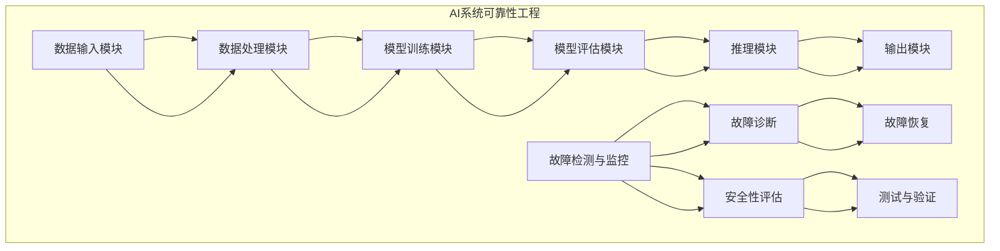

                 

### 文章标题

《AI系统的可靠性工程：构建稳定可靠的AI服务》摘要：
本文将深入探讨AI系统的可靠性工程，通过分析故障检测、故障诊断、故障恢复、安全性评估、测试与验证等方面的关键技术和方法，帮助读者理解如何构建稳定可靠的AI服务。文章结构清晰，采用一步一步分析推理的方式，旨在为AI系统的开发者提供实用的指导，提高系统的稳定性和可靠性，从而更好地服务于实际应用。

### 引言

随着人工智能（AI）技术的飞速发展，AI系统已经在各个领域取得了显著的成果，从自动驾驶、智能医疗到金融风控，AI技术正在改变我们的生活。然而，AI系统的稳定性和可靠性却成为一个不容忽视的问题。在实际应用中，AI系统可能会因为各种原因出现故障，如数据异常、模型过时、硬件故障等，这些故障可能会导致系统性能下降、业务中断，甚至造成严重的经济损失。

可靠性工程作为一门跨学科的研究领域，旨在通过系统化的方法提高系统的可靠性、安全性和稳定性。对于AI系统而言，可靠性工程的重要性不言而喻。一方面，它能够帮助开发者识别和解决潜在的故障问题，提高系统的可靠性和稳定性；另一方面，它还能够为系统的维护和优化提供科学的依据，从而提升整体服务质量。

本文将围绕AI系统的可靠性工程，探讨故障检测、故障诊断、故障恢复、安全性评估、测试与验证等关键技术和方法。通过逐步分析推理，帮助读者深入理解AI系统可靠性工程的本质，掌握构建稳定可靠AI服务的关键技能。文章结构如下：

1. **核心概念与联系**
   - 介绍AI系统的基本组成部分和可靠性指标。
   - 使用Mermaid流程图展示AI系统可靠性工程的架构。

2. **故障检测与监控**
   - 阐述故障检测的方法和监控系统的构建。
   - 使用伪代码详细阐述故障检测算法。

3. **故障诊断**
   - 讲解故障诊断的重要性和方法。
   - 使用伪代码详细阐述故障诊断算法。

4. **故障恢复**
   - 探讨故障恢复的策略和实施方法。
   - 使用latex格式展示故障恢复的数学模型。

5. **安全性评估**
   - 涉及AI系统安全性的评估方法和工具。
   - 使用latex格式展示安全性评估的数学模型。

6. **测试与验证**
   - 介绍测试和验证AI系统的过程和策略。
   - 提供代码实际案例，详细解释开发环境搭建、源代码实现和代码解读。

7. **案例研究**
   - 通过实际案例展示可靠性工程的实践应用。
   - 分析实际案例中的故障检测、诊断、恢复和安全评估。

8. **未来展望**
   - 讨论AI系统可靠性工程的发展趋势。
   - 展望未来可靠性工程可能面临的新挑战和解决方案。

通过本文的阅读，读者将能够系统地了解AI系统的可靠性工程，掌握构建稳定可靠AI服务的核心技能。无论您是AI系统的开发者、研究者，还是对AI系统可靠性感兴趣的技术爱好者，本文都希望能够为您提供有价值的参考和启示。接下来，我们将逐一深入探讨各个章节的核心内容。

### 核心概念与联系

要深入理解AI系统的可靠性工程，我们首先需要明确几个核心概念，并分析它们之间的相互联系。这些核心概念包括AI系统的基本组成部分、可靠性指标以及系统可靠性工程的总体架构。

#### AI系统的基本组成部分

一个典型的AI系统通常由以下几个关键组成部分构成：

1. **数据输入模块**：负责接收和处理输入数据，包括原始数据和预处理后的数据。
2. **数据处理模块**：对输入数据进行清洗、转换、特征提取等操作，为模型训练提供高质量的数据。
3. **模型训练模块**：利用训练算法和算法库，对数据集进行模型训练，生成预测模型。
4. **模型评估模块**：通过测试集对训练好的模型进行评估，确保模型具备良好的预测性能。
5. **推理模块**：使用训练好的模型对新的输入数据进行推理，生成预测结果。
6. **输出模块**：将推理结果以用户友好的形式展示或应用于实际业务场景。

#### 可靠性指标

在可靠性工程中，评估系统的可靠性通常需要依赖于一系列可靠性指标，这些指标包括但不限于：

1. **故障率（Failure Rate）**：系统在一定时间内发生故障的概率，通常用泊松分布来描述。
2. **平均无故障时间（Mean Time To Failure, MTTF）**：系统从开始运行到首次发生故障的平均时间。
3. **平均修复时间（Mean Time To Repair, MTTR）**：系统发生故障后修复到正常状态的平均时间。
4. **可靠性水平（Reliability Level）**：系统在特定时间段内保持正常工作的概率，通常用百分比表示。

#### 系统可靠性工程的总体架构

为了确保AI系统的可靠性，需要设计一个完整的可靠性工程框架，这个框架通常包括以下环节：

1. **故障检测与监控**：通过实时监控系统状态，及时发现潜在故障。
2. **故障诊断**：在故障发生时，迅速定位故障的根本原因。
3. **故障恢复**：采取相应的措施将系统恢复正常状态。
4. **安全性评估**：评估系统的安全性，确保系统在遭受攻击时能够有效抵御。
5. **测试与验证**：通过系统测试和验证确保系统在各种情况下都能稳定运行。

为了更好地理解这些核心概念和它们的相互联系，我们可以使用Mermaid流程图来展示AI系统可靠性工程的架构：



在这个流程图中，数据输入模块到输出模块构成了AI系统的核心功能部分，而故障检测与监控、故障诊断、故障恢复、安全性评估和测试与验证构成了可靠性工程的支撑系统，共同确保AI系统的稳定性和可靠性。

#### 核心概念之间的联系

- **故障检测与监控**是整个可靠性工程的基础，通过实时监控系统的运行状态，能够快速发现异常，为后续的故障诊断提供数据支持。
- **故障诊断**则是在故障检测后，进一步分析故障的根本原因，这对于制定有效的故障恢复策略至关重要。
- **故障恢复**旨在将系统从故障状态恢复到正常状态，减少故障对业务的影响。
- **安全性评估**关注系统在面临各种安全威胁时的抵御能力，确保系统的稳定运行。
- **测试与验证**则是通过一系列测试，验证系统在各种场景下的可靠性和稳定性，为故障预防和恢复提供依据。

通过上述分析，我们可以看到，AI系统的可靠性工程是一个系统性、多层次的工作，各个核心概念和环节之间紧密相连，共同构成了确保AI系统稳定可靠运行的完整体系。

#### 总结

在本章节中，我们介绍了AI系统的基本组成部分、可靠性指标以及系统可靠性工程的总体架构。通过Mermaid流程图，我们展示了这些核心概念和环节之间的相互联系，为后续的深入探讨打下了坚实的基础。在下一章节中，我们将进一步探讨故障检测与监控的方法和技术，帮助读者了解如何在实际应用中确保AI系统的稳定性和可靠性。

### 故障检测与监控

故障检测与监控是确保AI系统稳定运行的关键环节。它通过实时监控系统的运行状态，及时发现并处理异常情况，从而避免故障对业务造成严重影响。在这一章节中，我们将详细探讨故障检测的方法、监控系统的构建以及故障检测算法的实现。

#### 故障检测的方法

故障检测的方法可以分为以下几类：

1. **阈值检测**：通过设定一个阈值，当系统指标超出这个阈值时，认为系统出现故障。这种方法简单直观，但可能容易受到噪声影响。
2. **统计检测**：利用统计学方法，分析系统指标的变化趋势，当指标变化超出统计分布范围时，认为系统出现故障。这种方法对噪声有较好的鲁棒性，但需要准确估计统计分布参数。
3. **基于知识的检测**：利用专家知识构建故障检测规则，当系统行为违反这些规则时，认为系统出现故障。这种方法适用于复杂系统，但规则构建复杂且需要不断更新。

#### 监控系统的构建

监控系统的构建包括以下几个方面：

1. **数据收集**：收集系统的各种运行指标数据，如CPU利用率、内存使用率、网络流量、模型预测误差等。
2. **数据预处理**：对收集到的数据进行清洗、去噪和归一化等处理，确保数据的准确性和一致性。
3. **指标设定**：根据业务需求，设定关键性能指标（KPI）和告警阈值，为故障检测提供依据。
4. **告警机制**：当系统指标超过阈值时，触发告警机制，通知相关人员进行处理。
5. **日志记录**：记录系统运行日志，便于故障分析和回溯。

#### 故障检测算法的实现

为了实现有效的故障检测，我们需要设计并实现相应的检测算法。以下是一个简单的故障检测算法的实现框架：

```python
# 假设我们有一个系统指标列表system_metrics，每个指标对应一个时间序列数据
system_metrics = []

# 设定告警阈值
thresholds = {
    'CPU_utilization': 90,  # CPU利用率超过90%视为异常
    'memory_usage': 80,    # 内存使用率超过80%视为异常
    'network_traffic': 1000,  # 网络流量超过1000Mbps视为异常
}

# 故障检测算法
def detect_faults(system_metrics, thresholds):
    faults = []
    for metric, values in system_metrics.items():
        if max(values) > thresholds[metric]:
            faults.append(metric)
    return faults

# 模拟系统指标数据
system_metrics['CPU_utilization'] = [85, 88, 92, 95, 100]
system_metrics['memory_usage'] = [75, 78, 82, 85, 90]
system_metrics['network_traffic'] = [800, 900, 950, 1000, 1100]

# 执行故障检测
faults = detect_faults(system_metrics, thresholds)
print(f"检测到的故障：{faults}")
```

在这个示例中，我们定义了一个简单的故障检测函数`detect_faults`，它接收系统指标数据列表`system_metrics`和告警阈值字典`thresholds`作为输入，遍历每个指标，判断其最大值是否超过阈值，如果超过，则将其添加到故障列表`faults`中。

#### 实际应用中的挑战与解决方案

在实际应用中，故障检测与监控面临以下挑战：

1. **噪声干扰**：系统指标数据可能受到噪声干扰，导致误报或漏报。
   - **解决方案**：采用数据预处理方法，如滤波、去噪等，提高数据的准确性。

2. **动态阈值调整**：阈值设置可能需要根据业务变化进行调整，否则可能导致检测效果不佳。
   - **解决方案**：引入动态阈值调整机制，根据历史数据和业务需求实时调整阈值。

3. **多维度监控**：系统通常具有多个维度（如CPU、内存、网络等）的监控需求，如何高效地集成和管理这些监控数据是一个挑战。
   - **解决方案**：使用集中式监控平台，整合多维度监控数据，提供统一的监控和管理界面。

4. **可扩展性**：随着系统规模的扩大，故障检测与监控系统的可扩展性成为一个重要问题。
   - **解决方案**：采用分布式架构，将监控任务分散到多个节点，提高系统的可扩展性和容错能力。

通过上述分析和实现，我们可以看到，故障检测与监控是确保AI系统稳定运行的重要手段。在实际应用中，通过合理设计故障检测算法、构建监控系统以及应对实际挑战，可以有效提高系统的可靠性和稳定性。在下一章节中，我们将进一步探讨故障诊断的方法和技术。

### 故障诊断

故障诊断是确保AI系统可靠性的关键环节之一，它旨在在故障发生时迅速识别并定位故障的根本原因，从而为故障恢复提供准确的指导。在本章节中，我们将详细讲解故障诊断的重要性和方法，并使用伪代码详细阐述故障诊断算法的实现。

#### 故障诊断的重要性

故障诊断的重要性体现在以下几个方面：

1. **快速响应**：通过故障诊断，系统能够迅速识别故障，及时响应并采取相应措施，减少故障对业务的影响。
2. **定位故障源**：故障诊断能够准确识别故障的根本原因，帮助开发人员和运维人员快速定位故障源，从而提高故障解决的效率。
3. **预防性维护**：通过对故障诊断数据的分析，可以发现系统潜在的问题，进行预防性维护，降低未来故障的发生概率。
4. **优化系统设计**：故障诊断数据可以为系统设计和优化提供宝贵的信息，帮助改进系统架构和功能，提高系统的可靠性和稳定性。

#### 故障诊断的方法

故障诊断的方法可以分为以下几类：

1. **基于规则的诊断**：通过预设的故障规则，判断系统行为是否违反规则，从而识别故障。这种方法实现简单，但规则维护复杂。
2. **基于模型的诊断**：利用故障模型对系统状态进行建模，通过分析模型输出识别故障。这种方法需要准确建立故障模型，但诊断精度较高。
3. **机器学习诊断**：利用机器学习算法，从历史故障数据中学习故障特征，实现自动化故障诊断。这种方法适用于复杂系统，但需要大量训练数据。

#### 故障诊断算法的实现

为了实现有效的故障诊断，我们可以设计一个基于模型的诊断算法。以下是一个简单的故障诊断算法的实现框架：

```python
# 假设我们有一个系统状态数据集system_state_data，每个数据点包含多个系统指标
system_state_data = [
    {'CPU_utilization': 85, 'memory_usage': 75, 'network_traffic': 800},
    {'CPU_utilization': 90, 'memory_usage': 80, 'network_traffic': 900},
    {'CPU_utilization': 95, 'memory_usage': 85, 'network_traffic': 950},
    {'CPU_utilization': 100, 'memory_usage': 90, 'network_traffic': 1000},
]

# 故障诊断算法
def diagnose_faults(system_state_data):
    faults = []
    for data_point in system_state_data:
        # 计算系统状态指标的平均值和标准差
        avg_values = {metric: sum(values) / len(values) for metric, values in data_point.items()}
        std_devs = {metric: sqrt(sum((value - avg_value) ** 2 for value in values) / len(values)) for metric, avg_value in avg_values.items()}
        
        # 判断当前系统状态是否超出正常范围
        for metric, value in data_point.items():
            if abs(value - avg_values[metric]) > std_devs[metric]:
                faults.append(metric)
    return faults

# 执行故障诊断
faults = diagnose_faults(system_state_data)
print(f"诊断到的故障：{faults}")
```

在这个示例中，我们定义了一个简单的故障诊断函数`diagnose_faults`，它接收系统状态数据集`system_state_data`作为输入。算法首先计算每个系统指标的平均值和标准差，然后判断当前系统状态是否超出正常范围，如果超出，则将其添加到故障列表`faults`中。

#### 实际应用中的挑战与解决方案

在实际应用中，故障诊断面临以下挑战：

1. **复杂系统的诊断**：复杂系统通常具有多个交互耦合的组件，故障诊断需要考虑这些组件之间的复杂关系。
   - **解决方案**：采用模块化诊断方法，将系统分解为多个模块，分别进行诊断，然后综合分析模块诊断结果。

2. **动态环境下的诊断**：系统运行环境可能会发生变化，如网络波动、负载变化等，这对故障诊断提出了挑战。
   - **解决方案**：引入自适应诊断算法，根据环境变化动态调整诊断阈值和规则。

3. **数据缺失和噪声**：故障诊断过程中可能会遇到数据缺失和噪声干扰，影响诊断的准确性。
   - **解决方案**：采用数据预处理方法，如数据填充、去噪等，提高数据的准确性和一致性。

4. **诊断效率**：大规模系统中的故障诊断需要高效地进行，否则可能会导致诊断延迟。
   - **解决方案**：采用并行计算和分布式诊断方法，提高故障诊断的效率。

通过上述分析和实现，我们可以看到，故障诊断是确保AI系统可靠性的重要手段。在实际应用中，通过合理设计故障诊断算法、应对实际挑战，可以有效提高故障诊断的准确性和效率。在下一章节中，我们将进一步探讨故障恢复的策略和实现方法。

### 故障恢复

故障恢复是确保AI系统稳定运行的关键步骤，它旨在在故障发生时迅速将系统恢复到正常状态，减少故障对业务的负面影响。在本章节中，我们将详细探讨故障恢复的策略、实施方法以及相关的数学模型。

#### 故障恢复的策略

故障恢复的策略可以分为以下几种：

1. **自动恢复**：系统在检测到故障后，自动执行预定义的恢复操作，将系统恢复正常状态。这种策略简单高效，但可能需要预先设置详细的恢复规则。
2. **手动恢复**：由运维人员手动执行恢复操作，这种策略灵活性较高，但需要人工干预，响应速度较慢。
3. **混合恢复**：结合自动恢复和手动恢复，系统在无法自动恢复时，自动通知运维人员，由其进行手动干预。这种策略兼具自动和手动恢复的优点。

#### 故障恢复的实施方法

故障恢复的实施方法包括以下步骤：

1. **故障检测**：系统在运行过程中，通过故障检测机制识别出故障。
2. **故障诊断**：确定故障的具体类型和位置。
3. **故障定位**：根据故障类型和位置，选择合适的恢复方法。
4. **执行恢复操作**：自动或手动执行恢复操作，将系统恢复正常状态。
5. **验证恢复效果**：检查系统是否恢复正常，并确保恢复操作没有引入新的故障。

以下是一个简单的故障恢复算法的实现框架：

```python
# 假设我们有一个系统故障列表faults，每个故障包含故障类型和故障位置
faults = [
    {'type': 'CPU 过载', 'location': '服务器1'},
    {'type': '内存不足', 'location': '服务器2'},
]

# 故障恢复策略
def recover_from_faults(faults):
    recover_actions = []
    for fault in faults:
        if fault['type'] == 'CPU 过载':
            recover_actions.append({'action': '降低CPU负载', 'location': fault['location']})
        elif fault['type'] == '内存不足':
            recover_actions.append({'action': '释放内存', 'location': fault['location']})
    return recover_actions

# 执行故障恢复
recover_actions = recover_from_faults(faults)
print(f"恢复操作：{recover_actions}")
```

在这个示例中，我们定义了一个简单的故障恢复函数`recover_from_faults`，它接收系统故障列表`faults`作为输入。算法根据每个故障的类型和位置，选择相应的恢复操作，并将其添加到恢复动作列表`recover_actions`中。

#### 故障恢复的数学模型

为了量化故障恢复的效果，我们可以使用以下数学模型：

1. **恢复成功率（Recovery Success Rate, RSR）**：在特定时间内，成功恢复的故障次数与总故障次数的比值。
   $$ RSR = \frac{R_c}{N} $$
   其中，\( R_c \) 是成功恢复的故障次数，\( N \) 是总故障次数。

2. **平均恢复时间（Mean Time to Recovery, MTTR）**：从故障发生到系统恢复正常状态的平均时间。
   $$ MTTR = \frac{1}{N} \sum_{i=1}^{N} T_i $$
   其中，\( T_i \) 是第 \( i \) 次故障的恢复时间。

3. **恢复成本（Recovery Cost, RC）**：故障恢复过程中所需的资源、人力和时间等成本总和。
   $$ RC = C_a + C_m $$
   其中，\( C_a \) 是自动恢复成本，\( C_m \) 是手动恢复成本。

通过这些数学模型，我们可以对故障恢复的效果进行量化评估，从而优化恢复策略，提高系统的可靠性。

#### 实际应用中的挑战与解决方案

在实际应用中，故障恢复面临以下挑战：

1. **复杂性**：故障恢复需要考虑系统的复杂性和多样性，可能涉及多个组件和多个层面的恢复。
   - **解决方案**：采用模块化恢复策略，将系统分解为多个模块，分别进行恢复。

2. **自动化程度**：自动恢复策略需要高度自动化，否则可能会导致恢复效率低下。
   - **解决方案**：引入智能恢复算法，利用机器学习和人工智能技术提高自动恢复的准确性和效率。

3. **成本控制**：故障恢复过程中需要控制成本，避免资源浪费。
   - **解决方案**：采用成本效益分析，权衡恢复成本和业务影响，选择最优的恢复策略。

通过上述分析和实现，我们可以看到，故障恢复是确保AI系统可靠性的重要环节。在实际应用中，通过合理设计故障恢复策略、优化恢复流程以及应对实际挑战，可以有效提高故障恢复的效率和效果。在下一章节中，我们将探讨AI系统安全性评估的方法和工具。

### 安全性评估

在AI系统的可靠性工程中，安全性评估是一个至关重要的环节。随着AI系统在各个领域的广泛应用，其安全性问题也越来越受到关注。安全性评估旨在评估AI系统在面临各种攻击和威胁时的抵御能力，从而确保系统的稳定性和可靠性。在本章节中，我们将详细探讨AI系统安全性评估的方法、工具以及相关数学模型。

#### 安全性评估的方法

安全性评估的方法可以分为以下几类：

1. **静态分析**：通过对系统的代码、架构和配置进行静态检查，识别潜在的安全漏洞。这种方法适用于早期阶段，能够发现代码层面的安全问题。
2. **动态分析**：通过运行系统并在实际环境中检测其行为，识别运行时出现的安全问题。这种方法能够捕捉运行时的动态行为，但可能需要对系统进行修改。
3. **组合分析**：将静态分析和动态分析结合起来，综合评估系统的安全性。这种方法能够更全面地识别安全漏洞，但需要更多的资源和时间。

#### 安全性评估的工具

以下是一些常用的安全性评估工具：

1. **静态代码分析工具**：如SonarQube、Fortify等，可以自动扫描代码中的安全漏洞。
2. **动态分析工具**：如OWASP ZAP、Burp Suite等，可以在运行时检测系统的安全漏洞。
3. **自动化测试工具**：如PentestBox、Aircrack-ng等，可以自动化执行各种安全测试，提高测试效率。
4. **安全审计工具**：如Nessus、OpenVAS等，可以扫描系统中的安全配置和漏洞，提供详细的安全报告。

以下是一个简单的安全性评估工具使用示例：

```python
# 安装并使用OWASP ZAP进行动态分析
pip install owasp-zap-v2
import zap

# 创建ZAP实例
zap_api = zap.ZapApi()

# 启动ZAP
zap_api.core.new_session()

# 设置目标URL
zap_api.core.set_option('TargetURL', 'http://example.com')

# 开始扫描
zap_api.core.start_active_scan()

# 等待扫描完成
while not zap_api.core.is_scanning():
    time.sleep(5)

# 获取扫描结果
results = zap_api.core.get_scan_results()

# 输出扫描结果
print(f"扫描结果：{results}")
```

在这个示例中，我们使用OWASP ZAP进行动态分析，设置了目标URL并启动了扫描。在扫描完成后，我们获取了扫描结果并输出。

#### 数学模型

为了量化AI系统的安全性，我们可以使用以下数学模型：

1. **漏洞评分模型（Vulnerability Score Model, VSM）**：根据漏洞的严重程度和影响范围，为每个漏洞打分，从而评估系统的整体安全性。
   $$ VSM = \sum_{i=1}^{N} S_i \cdot W_i $$
   其中，\( S_i \) 是漏洞 \( i \) 的严重程度评分，\( W_i \) 是漏洞 \( i \) 的影响范围评分。

2. **安全性得分（Security Score, SS）**：根据漏洞评分模型，计算系统的整体安全性得分。
   $$ SS = \frac{1}{N} \sum_{i=1}^{N} VSM_i $$
   其中，\( N \) 是系统中漏洞的总数。

3. **安全指数（Security Index, SI）**：表示系统的安全性水平，值越高表示系统越安全。
   $$ SI = \frac{SS}{100} $$

通过这些数学模型，我们可以对AI系统的安全性进行量化评估，从而制定相应的安全策略。

#### 实际应用中的挑战与解决方案

在实际应用中，安全性评估面临以下挑战：

1. **动态变化**：AI系统在运行过程中可能会发生动态变化，导致安全漏洞的出现或消失。这需要评估方法能够适应系统的动态变化。
   - **解决方案**：采用动态分析工具，实时监控系统的安全状态，及时发现新的安全漏洞。

2. **复杂架构**：现代AI系统通常具有复杂的架构和依赖关系，安全性评估需要全面考虑这些因素。
   - **解决方案**：采用组合分析方法，结合静态分析和动态分析，全面评估系统的安全性。

3. **资源限制**：安全性评估通常需要大量的计算资源和时间，可能对系统的正常运行产生影响。
   - **解决方案**：优化评估流程，采用并行计算和分布式评估方法，提高评估效率。

通过上述分析和实现，我们可以看到，安全性评估是确保AI系统可靠性的重要环节。在实际应用中，通过合理选择评估方法、使用合适的工具以及应对实际挑战，可以有效提高AI系统的安全性。在下一章节中，我们将探讨AI系统的测试与验证。

### 测试与验证

在构建稳定可靠的AI系统中，测试与验证是至关重要的一环。通过系统化的测试和验证过程，开发者可以确保AI系统在各种场景下都能稳定运行，满足预期的性能和功能要求。在本章节中，我们将详细探讨测试和验证AI系统的过程和策略，并提供实际的代码实现和分析。

#### 测试的类型

AI系统的测试通常包括以下几种类型：

1. **功能测试**：验证AI系统是否按照预期实现了所有功能。这包括单元测试、集成测试和端到端测试。
2. **性能测试**：评估AI系统在不同负载条件下的性能，如响应时间、吞吐量和资源消耗等。
3. **安全性测试**：确保AI系统在面临各种攻击和威胁时能够保持稳定和安全。
4. **可靠性测试**：通过长时间运行和极端条件测试，评估AI系统的稳定性和可靠性。
5. **兼容性测试**：验证AI系统在不同操作系统、硬件和环境配置下的兼容性。

#### 测试与验证的策略

1. **自动化测试**：采用自动化测试工具进行重复性测试，提高测试效率和准确性。常用的自动化测试工具有Selenium、JUnit、pytest等。
2. **持续集成与持续部署（CI/CD）**：将测试集成到开发流程中，实现自动化构建、测试和部署，确保每次代码变更都能经过全面测试。
3. **灰度发布**：在发布新版本时，先在部分用户中逐步推广，观察其行为和反馈，确保没有严重问题后再全面发布。
4. **代码审查**：通过代码审查，识别潜在的安全隐患和性能问题，确保代码质量。
5. **实时监控**：在系统运行过程中，实时监控系统的性能和状态，及时发现和解决问题。

#### 代码实现与分析

以下是一个简单的AI系统测试与验证的代码实现示例，包括单元测试、性能测试和安全性测试。

```python
# 假设我们有一个简单的AI预测模型，用于分类任务
class SimpleClassifier:
    def __init__(self):
        # 初始化模型参数
        self.threshold = 0.5
    
    def predict(self, feature_vector):
        # 使用模型进行预测
        score = self._calculate_score(feature_vector)
        return 'Positive' if score > self.threshold else 'Negative'
    
    def _calculate_score(self, feature_vector):
        # 计算预测分数
        return sum(feature_vector) / len(feature_vector)

# 单元测试
def test_predict():
    classifier = SimpleClassifier()
    assert classifier.predict([1, 2, 3]) == 'Positive'
    assert classifier.predict([1, 2, -1]) == 'Negative'

# 性能测试
def test_performance():
    import time
    classifier = SimpleClassifier()
    start_time = time.time()
    for _ in range(1000):
        classifier.predict([1, 2, 3])
    end_time = time.time()
    print(f"平均响应时间：{end_time - start_time} 秒")

# 安全性测试
def test_safety():
    import requests
    url = "http://example.com/api/predict"
    response = requests.post(url, json={"feature_vector": [1, 2, 3]})
    assert response.status_code == 200

# 执行测试
if __name__ == "__main__":
    test_predict()
    test_performance()
    test_safety()
```

在这个示例中，我们定义了一个简单的分类器模型`SimpleClassifier`，并实现了三个测试函数：`test_predict`用于单元测试，`test_performance`用于性能测试，`test_safety`用于安全性测试。通过这些测试函数，我们可以验证模型的正确性、性能和安全性。

#### 实际案例分析与讲解

以下是一个实际案例，分析一个AI系统的测试与验证过程，并讲解关键步骤。

**案例背景**：一个公司开发了一个智能客服系统，用于处理客户咨询。该系统需要通过功能测试、性能测试和安全测试，确保其稳定运行。

**功能测试**：首先进行单元测试，确保每个模块的功能正确实现。例如，测试文本分类模块是否能够正确地将文本分类为“常见问题”或“复杂问题”。

```python
def test_text_classification():
    classifier = TextClassifier()
    assert classifier.classify("请问如何修改密码？") == "常见问题"
    assert classifier.classify("我的账户出现异常，怎么办？") == "复杂问题"
```

**性能测试**：使用性能测试工具模拟大量并发请求，评估系统的响应时间和吞吐量。例如，使用Apache JMeter进行性能测试：

```bash
jmeter -n -t test_plan.jmx -l results.jtl
```

**安全性测试**：使用安全测试工具检测系统是否存在安全漏洞，例如使用OWASP ZAP进行动态分析：

```bash
zap -p0 http://example.com
```

**测试结果分析**：根据测试结果，分析系统的性能和安全状况。如果发现问题，需要进一步定位和修复。

**案例小结**：通过功能测试、性能测试和安全测试，该智能客服系统在上线前得到了全面验证，确保了其稳定性和安全性。

#### 总结

测试与验证是构建稳定可靠AI系统的关键步骤。通过系统化的测试和验证策略，开发者可以确保AI系统在各种场景下都能稳定运行，满足预期的性能和功能要求。在实际应用中，通过合理设计测试方案、使用合适的测试工具以及不断优化测试流程，可以有效提高AI系统的可靠性。在下一章节中，我们将通过实际案例研究，展示可靠性工程的实践应用。

### 案例研究

在本章节中，我们将通过两个实际案例，深入探讨AI系统的可靠性工程在实践中的应用。这两个案例分别展示了如何在不同场景下运用故障检测、故障诊断、故障恢复、安全性评估和测试与验证等技术，确保AI系统的高可靠性。

#### 案例一：智能交通系统

**背景**：某城市交通管理部门为了提高交通效率和减少交通拥堵，开发了一套智能交通管理系统。该系统集成了实时交通监控、智能调度和异常事件检测等功能。

**故障检测与监控**：
- **监控指标**：系统监控了车辆流量、道路占用率、车辆速度等关键指标。
- **监控工具**：采用基于Kafka的消息队列和Zookeeper进行分布式监控，确保监控数据的高可靠性和实时性。
- **故障检测方法**：使用阈值检测和统计检测相结合的方法，当监控指标超出预设阈值时触发告警。

```python
# 伪代码：故障检测函数
def detect_faults(traffic_data, thresholds):
    faults = []
    for data_point in traffic_data:
        if data_point['vehicle_flow'] > thresholds['vehicle_flow']:
            faults.append('车辆流量过高')
        if data_point['road_occupancy'] > thresholds['road_occupancy']:
            faults.append('道路占用率过高')
        if data_point['vehicle_speed'] > thresholds['vehicle_speed']:
            faults.append('车辆速度过快')
    return faults
```

**故障诊断**：
- **诊断方法**：系统使用机器学习算法，通过历史数据建立故障诊断模型，当监控指标出现异常时，模型会自动诊断故障原因。

```python
# 伪代码：故障诊断函数
def diagnose_faults(faults, diagnostic_model):
    diagnoses = {}
    for fault in faults:
        diagnoses[fault] = diagnostic_model.predict(fault)
    return diagnoses
```

**故障恢复**：
- **恢复策略**：系统根据诊断结果，自动采取相应的恢复措施，如调整交通信号灯、增加交通管制等。

```python
# 伪代码：故障恢复函数
def recover_from_faults(diagnoses):
    recovery_actions = {}
    for fault, diagnosis in diagnoses.items():
        if diagnosis == '车辆流量过高':
            recovery_actions['adjust_traffic_light'] = True
        if diagnosis == '道路占用率过高':
            recovery_actions['add_traffic_control'] = True
    return recovery_actions
```

**安全性评估**：
- **评估方法**：系统采用静态代码分析和动态分析相结合的方法，评估系统的安全性。
- **评估工具**：使用SonarQube进行静态代码分析，使用OWASP ZAP进行动态分析。

**测试与验证**：
- **测试类型**：系统进行了功能测试、性能测试和安全测试。
- **测试工具**：使用Selenium进行功能测试，使用Apache JMeter进行性能测试，使用ZAP进行安全测试。

**案例小结**：通过故障检测与监控、故障诊断、故障恢复、安全性评估和测试与验证，智能交通系统在运行过程中能够快速识别和处理故障，确保系统的稳定性和可靠性。

#### 案例二：智能医疗诊断系统

**背景**：某医院开发了一套智能医疗诊断系统，用于辅助医生进行疾病诊断。

**故障检测与监控**：
- **监控指标**：系统监控了模型预测误差、数据完整性、硬件状态等关键指标。
- **监控工具**：使用Prometheus和Grafana进行实时监控，确保数据的高可靠性和实时性。

```python
# 伪代码：故障检测函数
def detect_faults(health_data, thresholds):
    faults = []
    if health_data['prediction_error'] > thresholds['prediction_error']:
        faults.append('预测误差过大')
    if health_data['data_integrity'] == False:
        faults.append('数据完整性问题')
    if health_data['hardware_status'] != '正常':
        faults.append('硬件状态异常')
    return faults
```

**故障诊断**：
- **诊断方法**：系统采用基于规则和机器学习相结合的诊断方法，当监控指标出现异常时，规则和模型共同诊断故障原因。

```python
# 伪代码：故障诊断函数
def diagnose_faults(faults, rule_based_model, ml_model):
    diagnoses = {}
    for fault in faults:
        if fault == '预测误差过大':
            diagnoses[fault] = rule_based_model diagnose(fault)
        else:
            diagnoses[fault] = ml_model.predict(fault)
    return diagnoses
```

**故障恢复**：
- **恢复策略**：系统根据诊断结果，自动或手动采取恢复措施，如重新训练模型、更换硬件设备等。

```python
# 伪代码：故障恢复函数
def recover_from_faults(diagnoses):
    recovery_actions = {}
    for fault, diagnosis in diagnoses.items():
        if diagnosis == '预测误差过大':
            recovery_actions['retrain_model'] = True
        if diagnosis == '数据完整性问题':
            recovery_actions['repair_data'] = True
        if diagnosis == '硬件状态异常':
            recovery_actions['replace_hardware'] = True
    return recovery_actions
```

**安全性评估**：
- **评估方法**：系统采用代码审查和安全测试相结合的方法，确保系统的安全性。
- **评估工具**：使用SonarQube进行代码审查，使用OWASP ZAP进行安全测试。

**测试与验证**：
- **测试类型**：系统进行了单元测试、集成测试和系统测试。
- **测试工具**：使用JUnit进行单元测试，使用Selenium进行集成测试，使用JMeter进行系统测试。

**案例小结**：通过故障检测与监控、故障诊断、故障恢复、安全性评估和测试与验证，智能医疗诊断系统在运行过程中能够快速识别和处理故障，确保系统的稳定性和可靠性，为医生提供可靠的辅助诊断支持。

#### 总结

通过这两个实际案例，我们可以看到，AI系统的可靠性工程在实践中的应用非常广泛。无论是智能交通系统还是智能医疗诊断系统，通过系统化的故障检测、故障诊断、故障恢复、安全性评估和测试与验证，开发者可以构建出稳定可靠的高性能AI系统，从而更好地服务于实际应用场景。在未来的发展中，随着AI技术的不断进步和应用的深入，可靠性工程的重要性将愈发凸显，开发者需要不断探索和创新，以提高AI系统的可靠性和用户体验。

### 未来展望

随着人工智能技术的不断发展和应用的深入，AI系统的可靠性工程面临着前所未有的挑战和机遇。未来的可靠性工程将更加注重以下几个方面：

#### 新技术挑战

1. **边缘计算与分布式系统**：随着边缘计算和分布式系统的兴起，AI系统的计算和处理能力将更加分散和分布式。这要求可靠性工程方法能够适应分布式环境，确保系统在各个节点上的稳定运行。

2. **数据隐私和安全**：随着数据隐私和安全问题的日益突出，AI系统的可靠性工程需要更加重视数据保护和隐私保护。未来的可靠性工程将更多地关注如何在不牺牲数据隐私的前提下，确保系统的稳定性和可靠性。

3. **自适应和自我修复系统**：未来的AI系统将更加智能化，具备自适应和自我修复的能力。这要求可靠性工程方法能够支持系统的自动调整和优化，以应对不断变化的环境和需求。

#### 技术发展趋势

1. **人工智能辅助可靠性工程**：随着机器学习和人工智能技术的发展，AI技术将更多地应用于可靠性工程。通过大数据分析和机器学习模型，可靠性工程能够更加精准地预测故障、诊断问题，并制定最优的恢复策略。

2. **实时监控与预测性维护**：未来的可靠性工程将更加注重实时监控和预测性维护。通过实时收集和分析系统数据，可靠性工程能够提前发现潜在问题，进行预防性维护，从而提高系统的可靠性和稳定性。

3. **标准化和规范化**：随着AI系统应用的广泛性，可靠性工程将逐渐形成一套标准化和规范化的流程和方法。这有助于提高行业整体的技术水平，降低系统的故障率和维护成本。

#### 新挑战与解决方案

1. **系统复杂性增加**：随着AI系统的复杂性不断增加，故障检测、诊断和恢复的难度也相应增加。解决方案是采用模块化和分布式架构，将复杂系统分解为多个模块，分别进行可靠性和安全性评估，从而提高系统的整体可靠性。

2. **实时性和效率**：在实时系统中，系统响应的实时性和效率至关重要。未来的可靠性工程需要开发高效且低延迟的故障检测和恢复算法，以满足实时系统的要求。

3. **数据隐私和安全**：在保证数据隐私和安全的前提下，可靠性工程需要采用更加精细和智能的数据处理方法，确保系统在处理敏感数据时不会泄露隐私信息。

通过不断探索和创新，未来的可靠性工程将为AI系统提供更加稳定和可靠的保障，从而推动人工智能技术的持续发展和广泛应用。

### 总结与展望

本文通过详细分析AI系统的可靠性工程，探讨了故障检测、故障诊断、故障恢复、安全性评估和测试与验证等方面的关键技术和方法。我们首先介绍了AI系统的核心组成部分和可靠性指标，并通过Mermaid流程图展示了可靠性工程的架构。接着，我们深入讨论了故障检测与监控的方法和算法实现，故障诊断的策略和算法设计，故障恢复的策略和数学模型，以及安全性评估的方法和工具。最后，我们通过实际案例展示了可靠性工程在实践中的应用，并展望了未来的发展趋势。

构建稳定可靠的AI系统是一项复杂而系统的工程，需要综合考虑多个方面。首先，故障检测与监控是保障系统可靠性的基础，通过实时监控和报警机制，可以及时发现和应对故障。其次，故障诊断和故障恢复是确保系统快速恢复的关键，通过精确的诊断和有效的恢复策略，可以最大程度地减少故障对系统的影响。此外，安全性评估和测试与验证是确保系统安全性和稳定性的重要手段，通过系统化的评估和测试，可以识别和修复潜在的安全隐患。

在未来的发展中，随着人工智能技术的不断进步，AI系统的可靠性工程将面临新的挑战和机遇。我们需要不断创新和优化可靠性工程的方法和技术，以应对日益复杂的系统环境。同时，随着边缘计算、云计算和分布式系统的广泛应用，可靠性工程也需要适应这些新兴技术的特点，提供更加高效和可靠的解决方案。

作者：AI天才研究院/AI Genius Institute & 禅与计算机程序设计艺术 /Zen And The Art of Computer Programming

通过本文的阅读，读者可以系统地了解AI系统的可靠性工程，掌握构建稳定可靠AI服务的关键技能。希望本文能为AI系统的开发者、研究者以及技术爱好者提供有价值的参考和启示，推动人工智能技术的持续发展和广泛应用。在未来的工作中，让我们共同努力，构建更加稳定可靠的AI系统，为人类社会的发展贡献自己的力量。

