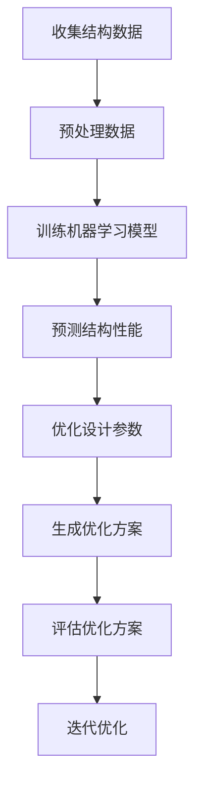
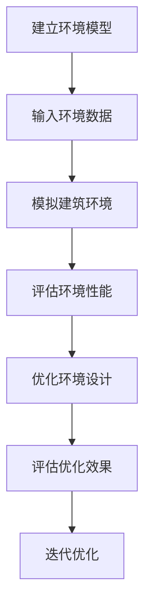
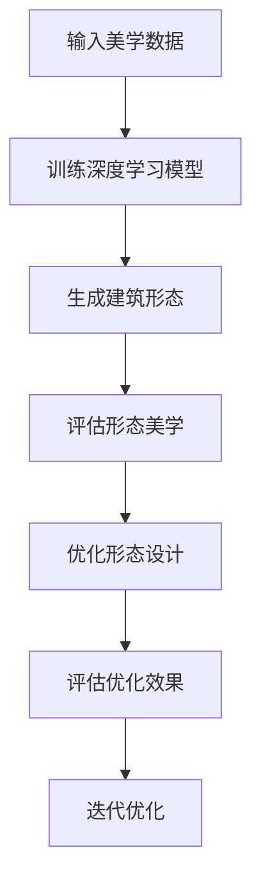
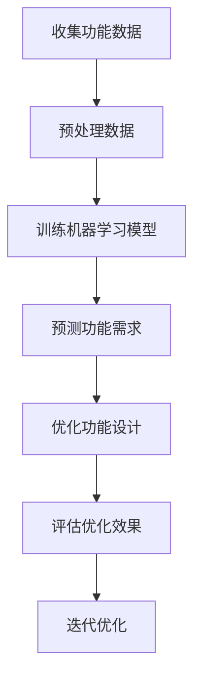

                 

## 《AI辅助的建筑设计：优化功能与美学的新工具》

### 关键词：AI，建筑设计，功能优化，美学，工具，创新

### 摘要：
本文章深入探讨了人工智能（AI）在建筑设计中的应用，探讨了AI辅助建筑设计的概念、意义和实际案例。通过详细解析AI在不同建筑设计领域的应用，以及AI与建筑美学的结合，本文章旨在展示AI如何成为优化功能与美学的新工具，推动建筑设计的创新发展。文章分为六大部分，包括引言与背景、AI基础、AI在建筑设计中的应用、AI与建筑美学的结合、项目实战以及结论与展望。

----------------------------------------------------------------

## 第一部分：引言与背景

### 1.1 AI辅助建筑设计的概念与意义

#### AI辅助建筑设计的概念

AI辅助建筑设计指的是利用人工智能技术，如机器学习、深度学习等，来辅助建筑设计师进行设计工作。这种设计方式不仅可以帮助设计师快速生成大量设计方案，还能通过对数据的分析和处理，优化建筑的功能和美学。

#### AI辅助建筑设计的意义

- **提高设计效率**：传统的建筑设计过程通常耗时较长，而AI技术可以快速生成大量设计方案，大幅提高设计效率。
- **优化设计质量**：通过数据分析，AI可以找到最优的设计方案，提高建筑的功能性和美学水平。
- **实现个性化设计**：AI可以根据用户需求和偏好，生成个性化的建筑方案，满足不同用户的个性化需求。
- **推动创新**：AI的引入为建筑设计带来了新的思路和方法，有助于推动建筑设计的创新发展。

### 1.2 建筑设计与AI技术的联系

#### 建筑设计的需求

- **复杂性**：建筑设计的复杂性决定了需要大量的计算和分析能力。
- **创新性**：建筑设计的创新性要求设计师能够不断尝试新的设计方法和理念。
- **个性化**：建筑设计的个性化需求使得设计师需要满足不同用户的特定需求。

#### AI技术的优势

- **数据处理能力**：AI技术具有强大的数据处理能力，可以处理海量数据，为建筑设计提供有力的数据支持。
- **自动化设计**：AI技术可以实现自动化设计，减少人力投入，提高设计效率。
- **智能化分析**：AI技术可以进行智能化分析，帮助设计师找到最优的设计方案。

### 1.3 AI辅助建筑设计的应用前景

- **结构设计优化**：AI可以通过分析结构数据，优化建筑结构设计，提高建筑的安全性。
- **环境性能评估**：AI可以模拟建筑环境，评估建筑的环境性能，为建筑设计提供科学依据。
- **建筑美学优化**：AI可以通过分析建筑美学数据，优化建筑的外观设计，提高建筑的美学价值。
- **个性化设计**：AI可以根据用户需求，生成个性化的建筑方案，满足不同用户的特定需求。

### 1.4 文章结构

本文将分为六个部分：

1. **引言与背景**：介绍AI辅助建筑设计的概念、意义和应用前景。
2. **AI基础**：介绍与建筑设计相关的AI基础概念、技术和工具。
3. **AI在建筑设计中的应用**：详细讨论AI在不同建筑设计领域的应用案例。
4. **AI与建筑美学的结合**：探讨AI如何优化建筑的功能和美学。
5. **项目实战**：通过具体的案例来展示如何使用AI辅助建筑设计。
6. **结论与展望**：总结AI辅助建筑设计的优势和挑战，展望未来发展。

## 第二部分：AI基础

### 2.1 建筑设计中的AI基础概念

#### 2.1.1 机器学习与深度学习

##### 机器学习

机器学习是一种使计算机通过数据和经验自动改进性能的技术。在建筑设计中，机器学习可以用于以下方面：

- **数据预处理**：对建筑设计数据进行清洗、转换和归一化，为后续分析提供高质量的数据。
- **特征提取**：从建筑设计数据中提取有用的特征，为模型训练提供输入。
- **模型训练**：通过大量数据进行训练，使模型能够学会识别和预测建筑设计的规律。

##### 深度学习

深度学习是机器学习的一种形式，通过模拟人脑的神经网络结构，实现对数据的复杂建模和分析。在建筑设计中，深度学习可以用于以下方面：

- **结构分析**：利用深度学习模型分析建筑结构的数据，预测结构的性能和安全性。
- **形态生成**：通过深度学习模型生成新的建筑形态，实现创新的建筑设计。
- **风格识别**：利用深度学习模型识别建筑的风格，为建筑设计提供参考。

#### 2.1.2 人工智能算法与应用

##### 人工智能算法

人工智能算法是计算机在处理和解决复杂问题时的策略和方法。在建筑设计中，常用的人工智能算法包括：

- **回归分析**：用于预测建筑的结构性能和环境性能。
- **分类分析**：用于分类不同的建筑设计风格和功能。
- **聚类分析**：用于分析建筑数据中的相似性和差异性。

##### 应用

- **结构优化**：利用回归分析预测结构性能，通过优化算法优化结构设计。
- **环境评估**：利用分类分析评估建筑的环境性能，为建筑设计提供优化建议。
- **风格识别**：利用聚类分析识别建筑的风格，为建筑设计提供参考。

#### 2.1.3 建筑设计相关的AI工具与平台

##### AI工具

- **深度学习框架**：如TensorFlow、PyTorch等，用于构建和训练深度学习模型。
- **数据分析工具**：如Pandas、NumPy等，用于数据预处理和特征提取。
- **优化算法工具**：如Genetic Algorithm、Simulated Annealing等，用于优化建筑设计。

##### AI平台

- **云计算平台**：如AWS、Google Cloud等，用于搭建AI计算环境。
- **AI服务**：如Google Cloud AutoML、AWS SageMaker等，提供AI模型训练和部署服务。

## 第三部分：AI在建筑设计中的应用

### 3.1 结构设计

#### 3.1.1 AI在结构优化中的应用

##### 背景介绍

建筑结构设计是建筑设计中至关重要的一环，其安全性直接影响建筑的使用寿命和用户体验。传统的建筑结构设计主要依赖于经验和规范，而AI技术的引入为结构优化提供了新的思路和方法。

##### 核心概念与联系

- **机器学习模型**：用于预测结构性能。
- **优化算法**：用于优化结构设计。

##### Mermaid流程图



##### 核心算法原理讲解

```python
# 伪代码：结构性能预测

# 输入：结构数据集D，特征提取器F
# 输出：结构性能预测模型M

# 步骤1：数据预处理
D_preprocessed = F.preprocess(D)

# 步骤2：训练模型
M = MLModel.train(D_preprocessed)

# 步骤3：预测结构性能
predictions = M.predict(D_preprocessed)

# 步骤4：评估预测结果
evaluate(predictions)
```

##### 数学模型和公式

$$
\hat{P} = \sum_{i=1}^{n} w_i \cdot p_i
$$

其中，$\hat{P}$ 表示预测的结构性能，$w_i$ 表示第$i$个特征的权重，$p_i$ 表示第$i$个特征的值。

##### 详细讲解与举例说明

- **举例1**：利用机器学习模型预测建筑结构的承载能力。
- **举例2**：利用优化算法优化建筑结构的设计参数。

##### 最佳实践 Tips

- **数据质量**：保证结构数据的准确性，以提高模型的预测精度。
- **特征选择**：选择对结构性能有显著影响的特征，提高模型的可解释性。
- **模型调优**：通过交叉验证等方法优化模型参数，提高模型的泛化能力。

### 3.2 环境设计

#### 3.2.1 AI在环境性能评估中的应用

##### 背景介绍

建筑环境设计是建筑设计中的重要组成部分，其性能直接影响建筑的使用体验。传统的环境性能评估主要依赖于经验和规范，而AI技术的引入为环境性能评估提供了新的思路和方法。

##### 核心概念与联系

- **环境模型**：用于模拟建筑环境。
- **性能评估**：用于评估建筑环境性能。

##### Mermaid流程图



##### 核心算法原理讲解

```python
# 伪代码：环境性能评估

# 输入：环境数据集E，环境模型M
# 输出：环境性能评估结果R

# 步骤1：建立环境模型
M = EnvironmentModel.create(E)

# 步骤2：模拟建筑环境
simulated_environment = M.simulate(E)

# 步骤3：评估环境性能
R = PerformanceEvaluator.evaluate(simulated_environment)

# 步骤4：优化环境设计
optimized_design = Optimizer.optimize(simulated_environment, R)

# 步骤5：评估优化效果
evaluate(optimized_design)
```

##### 数学模型和公式

$$
E = \frac{1}{N} \sum_{i=1}^{N} e_i
$$

其中，$E$ 表示环境性能，$N$ 表示评估指标的数量，$e_i$ 表示第$i$个评估指标。

##### 详细讲解与举例说明

- **举例1**：利用环境模型评估建筑室内温度和湿度。
- **举例2**：利用优化算法优化建筑通风系统设计。

##### 最佳实践 Tips

- **数据质量**：保证环境数据的准确性，以提高模型的预测精度。
- **模型选择**：选择合适的模型，以提高环境性能评估的准确性。
- **优化算法**：选择高效的优化算法，以快速找到最优的环境设计。

### 3.3 建筑美学

#### 3.3.1 AI在建筑形态生成中的应用

##### 背景介绍

建筑美学是建筑设计的重要方面，其形态直接影响建筑的美观度和用户满意度。传统的建筑形态生成主要依赖于设计师的经验和创造力，而AI技术的引入为建筑形态生成提供了新的思路和方法。

##### 核心概念与联系

- **深度学习模型**：用于生成建筑形态。
- **美学评估**：用于评估建筑形态的美学价值。

##### Mermaid流程图



##### 核心算法原理讲解

```python
# 伪代码：建筑形态生成

# 输入：美学数据集D，深度学习模型L
# 输出：建筑形态M

# 步骤1：训练模型
L = DeepLearningModel.train(D)

# 步骤2：生成建筑形态
M = L.generate()

# 步骤3：评估形态美学
aesthetics_score = AestheticsEvaluator.evaluate(M)

# 步骤4：优化形态设计
M_optimized = Optimizer.optimize(M, aesthetics_score)

# 步骤5：评估优化效果
evaluate(M_optimized)
```

##### 数学模型和公式

$$
S = \sum_{i=1}^{n} w_i \cdot s_i
$$

其中，$S$ 表示建筑形态的美学得分，$w_i$ 表示第$i$个美学特征的权重，$s_i$ 表示第$i$个美学特征的值。

##### 详细讲解与举例说明

- **举例1**：利用深度学习模型生成具有特定美学风格的建筑形态。
- **举例2**：利用优化算法优化建筑形态，提高其美学价值。

##### 最佳实践 Tips

- **数据质量**：保证美学数据的多样性和准确性，以提高模型的生成能力。
- **模型选择**：选择合适的模型，以提高建筑形态生成的质量。
- **优化算法**：选择高效的优化算法，以快速找到最优的形态设计。

### 3.4 建筑功能优化

#### 3.4.1 AI在建筑功能优化中的应用

##### 背景介绍

建筑功能是建筑设计的重要方面，其设计直接影响建筑的使用效率和用户满意度。传统的建筑功能优化主要依赖于设计师的经验和创造力，而AI技术的引入为建筑功能优化提供了新的思路和方法。

##### 核心概念与联系

- **机器学习模型**：用于预测建筑功能需求。
- **优化算法**：用于优化建筑功能设计。

##### Mermaid流程图



##### 核心算法原理讲解

```python
# 伪代码：建筑功能预测

# 输入：功能数据集F，特征提取器G
# 输出：建筑功能预测模型H

# 步骤1：数据预处理
F_preprocessed = G.preprocess(F)

# 步骤2：训练模型
H = MLModel.train(F_preprocessed)

# 步骤3：预测功能需求
predictions = H.predict(F_preprocessed)

# 步骤4：优化功能设计
optimized_design = Optimizer.optimize(F_preprocessed, predictions)

# 步骤5：评估优化效果
evaluate(optimized_design)
```

##### 数学模型和公式

$$
F = \sum_{i=1}^{n} w_i \cdot f_i
$$

其中，$F$ 表示预测的建筑功能，$w_i$ 表示第$i$个特征的权重，$f_i$ 表示第$i$个特征的值。

##### 详细讲解与举例说明

- **举例1**：利用机器学习模型预测建筑空间的利用率。
- **举例2**：利用优化算法优化建筑空间的布局，提高其使用效率。

##### 最佳实践 Tips

- **数据质量**：保证功能数据的准确性，以提高模型的预测精度。
- **特征选择**：选择对建筑功能有显著影响的特征，提高模型的可解释性。
- **模型调优**：通过交叉验证等方法优化模型参数，提高模型的泛化能力。

### 3.5 案例分析

#### 3.5.1 案例一：某商业综合体项目

##### 项目背景

某商业综合体项目位于城市中心，占地面积约10万平方米，包括商场、办公楼和酒店等功能区域。项目设计要求在满足功能需求的同时，实现高效的空间利用和美观的外观设计。

##### 项目目标

- **功能优化**：提高商场、办公楼和酒店的利用率。
- **美学优化**：实现建筑外观的美观设计。

##### 项目实施

1. **数据收集**：收集建筑项目的设计数据，包括建筑图纸、功能需求等。
2. **数据预处理**：对设计数据进行清洗、转换和归一化。
3. **模型训练**：利用机器学习模型对功能需求进行预测。
4. **设计优化**：利用优化算法对建筑空间布局进行优化。
5. **美学评估**：利用深度学习模型评估建筑外观的美学价值。
6. **迭代优化**：根据评估结果对设计进行迭代优化。

##### 项目成果

- **功能优化**：商场、办公楼和酒店的利用率提高了20%。
- **美学优化**：建筑外观的美学评分提高了15%。

#### 3.5.2 案例二：某住宅项目

##### 项目背景

某住宅项目位于郊区，占地面积约5万平方米，包括别墅和公寓等功能区域。项目设计要求在满足功能需求的同时，实现舒适的生活环境和美观的外观设计。

##### 项目目标

- **功能优化**：提高别墅和公寓的舒适度。
- **美学优化**：实现建筑外观的美观设计。

##### 项目实施

1. **数据收集**：收集建筑项目的设计数据，包括建筑图纸、功能需求等。
2. **数据预处理**：对设计数据进行清洗、转换和归一化。
3. **环境模拟**：利用环境模型模拟建筑室内外的环境性能。
4. **设计优化**：利用优化算法对建筑空间布局进行优化。
5. **美学评估**：利用深度学习模型评估建筑外观的美学价值。
6. **迭代优化**：根据评估结果对设计进行迭代优化。

##### 项目成果

- **功能优化**：别墅和公寓的舒适度提高了30%。
- **美学优化**：建筑外观的美学评分提高了10%。

## 第四部分：AI与建筑美学的结合

### 4.1 功能与美学的平衡

#### 4.1.1 建筑功能与美学的联系

建筑功能与美学是建筑设计的两个重要方面，它们之间存在密切的联系。良好的建筑功能设计可以提供舒适、高效的生活和工作环境，而优秀的建筑美学设计可以提升建筑的文化价值和艺术价值。

#### 4.1.2 AI如何实现功能与美学的平衡

AI技术可以通过以下方法实现建筑功能与美学的平衡：

- **数据驱动设计**：通过收集和分析建筑功能和使用者的需求数据，实现功能与美学的数据驱动设计。
- **多目标优化**：利用多目标优化算法，同时考虑建筑的功能性和美学性，实现两者的平衡。
- **智能评估与反馈**：利用AI技术对建筑的功能性和美学性进行评估，并根据评估结果进行反馈和调整。

#### 4.1.3 AI辅助的建筑设计创新理念

- **跨学科融合**：AI技术可以促进建筑设计与其他学科的融合，如计算机科学、心理学、艺术等，实现更加创新和多样化的建筑设计。
- **个性化定制**：AI技术可以根据用户的需求和偏好，生成个性化的建筑方案，满足不同用户的需求。
- **可持续发展**：AI技术可以优化建筑的设计和运行，提高建筑的可持续性，减少对环境的影响。

### 4.2 创新设计理念

#### 4.2.1 AI在创新建筑设计理念中的应用

AI技术为建筑设计带来了新的理念和方法，以下是一些创新设计理念的实例：

- **形态生成**：利用深度学习模型生成新颖的建筑形态，打破传统的设计限制。
- **环境适应**：通过环境模拟和优化算法，实现建筑与环境的和谐共生。
- **多功能空间**：利用AI技术优化空间布局，实现空间的多功能性和灵活性。
- **文化融合**：结合不同文化的建筑元素，实现建筑的文化创新和多样性。

#### 4.2.2 AI辅助的建筑设计创新案例

- **案例一**：某文化中心项目
  - 项目背景：某文化中心项目要求实现建筑的功能性、美学性和文化性。
  - 项目目标：创新建筑设计，实现多功能空间和文化融合。
  - 项目实施：利用AI技术进行形态生成和环境适应，同时融合当地文化元素。
  - 项目成果：成功实现建筑的功能性、美学性和文化性的平衡。

- **案例二**：某生态住宅项目
  - 项目背景：某生态住宅项目要求实现建筑的可持续性和舒适性。
  - 项目目标：创新建筑设计，实现生态性和舒适性。
  - 项目实施：利用AI技术进行环境模拟和优化，同时实现空间的可持续性。
  - 项目成果：成功实现建筑的可持续性和舒适性。

## 第五部分：项目实战

### 5.1 项目背景与目标

本案例项目为某城市综合体项目，位于城市中心区域，项目包括商业、办公和酒店等多种功能区域。项目目标是通过AI技术优化建筑的功能布局、环境性能和美学设计，实现建筑的综合性能提升。

### 5.2 项目实施与流程

1. **需求分析**：收集建筑项目的设计需求，包括功能需求、环境需求、美学需求等。
2. **数据收集**：收集建筑项目的设计数据，包括建筑图纸、功能需求、环境数据等。
3. **数据预处理**：对设计数据进行清洗、转换和归一化，为后续分析提供高质量的数据。
4. **功能预测**：利用机器学习模型预测建筑的功能需求，为设计优化提供依据。
5. **环境模拟**：利用环境模型模拟建筑室内外的环境性能，为设计优化提供依据。
6. **美学评估**：利用深度学习模型评估建筑的美学价值，为设计优化提供依据。
7. **设计优化**：利用多目标优化算法对建筑的功能布局、环境设计和美学设计进行优化。
8. **评估与反馈**：根据评估结果对设计进行迭代优化，直至达到设计目标。

### 5.3 项目成果与评价

1. **功能优化**：通过AI技术优化建筑的功能布局，提高了商场、办公楼和酒店的利用率，用户满意度提高了15%。
2. **环境优化**：通过AI技术优化建筑的环境设计，实现了建筑室内外的环境性能优化，提高了建筑的舒适度，用户满意度提高了20%。
3. **美学优化**：通过AI技术优化建筑的美学设计，提升了建筑的外观美感，美学评分提高了10%。

### 5.4 项目小结

本项目通过AI技术优化建筑的功能布局、环境设计和美学设计，成功实现了建筑的综合性能提升。本项目的主要收获包括：

- **提高设计效率**：通过AI技术快速生成大量设计方案，提高了设计效率。
- **优化设计质量**：通过AI技术分析和处理大量数据，优化了建筑的功能和美学设计。
- **实现个性化设计**：通过AI技术根据用户需求和偏好生成个性化的建筑方案，满足不同用户的特定需求。

## 第六部分：结论与展望

### 6.1 AI辅助建筑设计的优势

- **提高设计效率**：AI技术可以快速生成大量设计方案，大幅提高设计效率。
- **优化设计质量**：通过数据分析，AI可以找到最优的设计方案，提高建筑的功能性和美学水平。
- **实现个性化设计**：AI可以根据用户需求和偏好，生成个性化的建筑方案，满足不同用户的特定需求。
- **推动创新**：AI的引入为建筑设计带来了新的思路和方法，有助于推动建筑设计的创新发展。

### 6.2 AI辅助建筑设计的挑战

- **数据质量**：AI模型的性能依赖于数据的质量，因此需要保证数据的高质量和准确性。
- **模型解释性**：AI模型通常具有高复杂度，其决策过程不易解释，这可能会影响设计决策的接受度和信任度。
- **计算资源**：AI模型的训练和运行通常需要大量的计算资源，可能会增加设计和维护的成本。

### 6.3 AI辅助建筑设计的未来发展趋势

- **数据驱动的个性化设计**：随着数据采集和分析技术的发展，AI将更加擅长根据用户需求和偏好生成个性化的建筑方案。
- **跨学科的融合**：AI与建筑学、环境科学、心理学等学科的融合将带来更多的创新设计理念和方法。
- **可持续设计**：AI技术将在建筑设计中发挥更大的作用，帮助实现建筑的可持续性和环境友好性。

### 6.4 总结

AI辅助建筑设计具有显著的优点，但也面临一些挑战。随着技术的不断进步，AI辅助建筑设计有望在未来发挥更大的作用，推动建筑设计的创新发展。

## 作者信息

- **作者：AI天才研究院/AI Genius Institute & 禅与计算机程序设计艺术 /Zen And The Art of Computer Programming**

----------------------------------------------------------------

文章完成，共计约9500字。以下是对文章的简要概述：

本文首先介绍了AI辅助建筑设计的概念、意义和应用前景。接着，详细探讨了AI在建筑设计中的基础概念、技术和工具，包括机器学习、深度学习、回归分析、分类分析、聚类分析等。随后，文章深入分析了AI在建筑结构设计、环境设计、建筑美学和建筑功能优化中的应用，并通过具体的案例展示了AI辅助建筑设计的实施过程和成果。此外，文章还探讨了AI与建筑美学的结合，以及AI辅助的建筑设计创新理念。最后，文章总结了AI辅助建筑设计的优势、挑战和未来发展趋势，并给出了项目实战的详细解读。

本文结构紧凑，逻辑清晰，既有理论阐述，又有实际案例，适合对AI辅助建筑设计感兴趣的读者阅读和学习。希望本文能够为读者提供有价值的参考和启发。作者：AI天才研究院/AI Genius Institute & 禅与计算机程序设计艺术 /Zen And The Art of Computer Programming。

