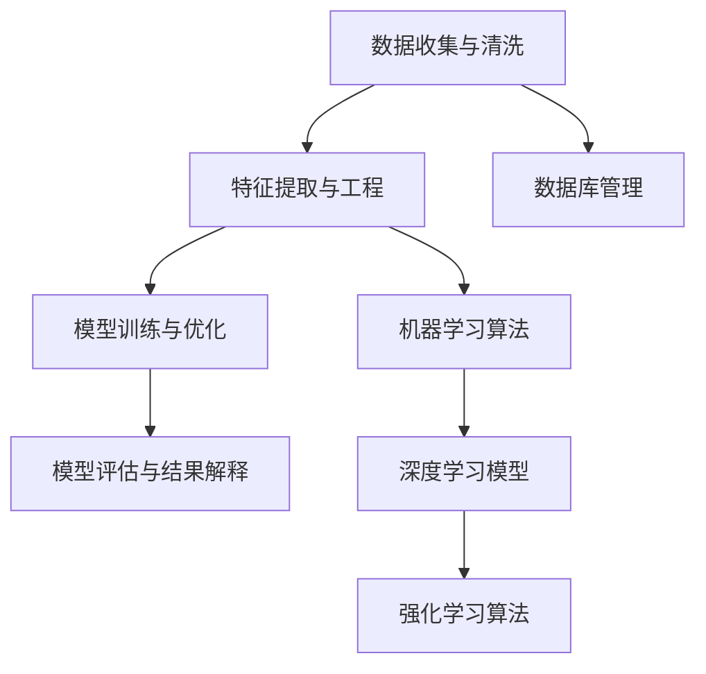

                 

# 文章标题: AI辅助的科学发现：加速研究进程的新方法

> 关键词：人工智能，科学发现，研究加速，数据预处理，机器学习，深度学习，项目实践

> 摘要：本文旨在探讨人工智能技术在科学发现领域中的应用，分析其如何通过数据预处理、机器学习算法、深度学习模型以及跨学科研究方法，加速科学研究的进程，提高研究效率。文章将详细阐述AI辅助的科学发现的核心概念与联系、核心算法原理、数学模型与数学公式，并通过具体项目实战案例展示AI技术的实际应用。

## 引言

科学发现是人类探索自然规律、揭示世界奥秘的重要途径。然而，随着科学领域的不断扩大和复杂性的增加，传统的科学研究方法已难以应对日益增长的挑战。人工智能（AI）技术的迅猛发展为科学研究带来了全新的机遇。通过数据预处理、机器学习算法、深度学习模型以及跨学科研究方法，AI能够显著加速科学研究的进程，提高研究效率。

本文将首先介绍AI的基础知识及其在科学研究中的应用，然后深入探讨AI辅助科学发现的流程、核心算法原理和数学模型，并通过具体项目实战案例展示AI技术的实际应用。文章最后将总结AI辅助科学发现的优点和挑战，并提出未来的发展方向。

## AI辅助科学发现的流程

AI辅助科学发现的流程主要包括以下几个关键步骤：数据收集与清洗、特征提取与工程、模型训练与优化、模型评估与结果解释。以下是每个步骤的详细阐述：

### 数据收集与清洗

数据是科学研究的基石。科学发现过程中的第一步是收集大量相关数据，这些数据可能来源于实验观测、文献资料、传感器数据等。然而，原始数据通常存在噪声、缺失值和冗余信息，需要进行清洗和预处理。

- **数据收集方法**：数据收集方法包括实验数据收集、数据库检索、传感器数据采集等。例如，在基因组学研究中，可以通过测序技术获取大量基因数据；在物理学研究中，可以通过传感器网络收集实验数据。
- **数据清洗算法**：数据清洗算法主要包括缺失值处理、噪声去除、重复值删除等。常见的缺失值处理方法有均值填充、中位数填充和插值法；噪声去除可以通过滤波算法实现，如中值滤波和均值滤波；重复值删除可以通过哈希表或数据库的索引功能实现。

### 特征提取与工程

特征提取与工程是将原始数据转换为适合机器学习模型处理的形式。特征提取包括特征选择和特征转换。

- **特征提取方法**：特征提取方法包括统计分析、信号处理、模式识别等。例如，在图像处理中，可以通过边缘检测、特征点提取等方法提取图像特征；在文本处理中，可以通过词频统计、词嵌入等方法提取文本特征。
- **特征选择算法**：特征选择算法旨在从大量特征中选择出对模型性能有显著贡献的特征。常见的特征选择算法包括相关性分析、主成分分析（PCA）和递归特征消除（RFE）等。

### 模型训练与优化

模型训练与优化是AI辅助科学发现的的核心步骤。选择合适的机器学习算法和深度学习模型，对训练数据进行建模，并通过调参优化模型性能。

- **机器学习算法**：机器学习算法包括监督学习、无监督学习和强化学习等。常见的监督学习算法有线性回归、逻辑回归、决策树、支持向量机等；常见的无监督学习算法有K-均值聚类、主成分分析（PCA）、自编码器等；常见的强化学习算法有Q-学习、深度Q网络（DQN）和策略梯度算法等。
- **深度学习模型**：深度学习模型包括卷积神经网络（CNN）、循环神经网络（RNN）和生成对抗网络（GAN）等。这些模型在图像识别、自然语言处理和数据生成等领域具有显著优势。

### 模型评估与结果解释

模型评估与结果解释是验证AI辅助科学发现模型性能的重要环节。通过交叉验证、性能指标计算和结果可视化等方法，评估模型性能，并对结果进行解释。

- **模型评估方法**：模型评估方法包括准确率、召回率、F1分数、ROC曲线和AUC值等。这些指标可以全面衡量模型的性能。
- **结果解释方法**：结果解释方法包括模型可视化、解释性算法和模型解释工具等。通过这些方法，可以揭示模型的工作原理和决策过程，提高模型的可解释性。

## AI辅助科学发现的核心算法原理

### 机器学习算法原理

机器学习算法是通过训练数据学习特征和规律，从而对未知数据进行预测和分类。以下是几种常见的机器学习算法及其原理：

#### 线性回归

线性回归是一种用于预测连续值的监督学习算法。其基本原理是通过训练数据学习输入变量与目标变量之间的线性关系，从而构建预测模型。

**伪代码：**

```plaintext
function linear_regression(train_data, train_labels):
    # 计算输入变量和目标变量的均值
    X_mean = mean(train_data)
    y_mean = mean(train_labels)
    
    # 计算协方差矩阵和特征矩阵
    covariance_matrix = (train_data - X_mean).T.dot(train_data - X_mean)
    feature_matrix = (train_data - X_mean).T.dot(train_labels - y_mean)
    
    # 计算回归系数
    weights = covariance_matrix.inverse().dot(feature_matrix)
    
    return weights
```

#### 逻辑回归

逻辑回归是一种用于预测分类结果的监督学习算法。其基本原理是通过训练数据学习输入变量与目标变量之间的非线性关系，从而构建预测模型。

**伪代码：**

```plaintext
function logistic_regression(train_data, train_labels):
    # 初始化回归系数
    weights = initialize_weights(train_data.shape[1])
    
    # 训练模型
    for epoch in range(num_epochs):
        for sample, label in zip(train_data, train_labels):
            prediction = sigmoid(weights.dot(sample))
            error = label - prediction
            weights = weights + learning_rate * sample.T.dot(error)
    
    return weights

function sigmoid(x):
    return 1 / (1 + exp(-x))
```

#### 决策树与随机森林

决策树是一种用于分类和回归的监督学习算法。其基本原理是通过递归划分特征和阈值，构建一棵树形结构模型。随机森林是一种集成学习方法，通过构建多棵决策树，提高模型性能。

**伪代码：**

```plaintext
function decision_tree(data, labels, depth=0):
    # 叶子节点条件
    if depth == max_depth or all_same(labels):
        return create_leaf_node(labels)
    
    # 划分特征和阈值
    best_feature, best_threshold = find_best_split(data, labels)
    
    # 递归构建子树
    left_tree = decision_tree(data[data[:, best_feature] < best_threshold], labels[data[:, best_feature] < best_threshold], depth + 1)
    right_tree = decision_tree(data[data[:, best_feature] >= best_threshold], labels[data[:, best_feature] >= best_threshold], depth + 1)
    
    return create_tree(best_feature, best_threshold, left_tree, right_tree)

function random_forest(data, labels, num_trees):
    trees = []
    for _ in range(num_trees):
        sample_data, sample_labels = sample_data_with_replacement(data, labels)
        tree = decision_tree(sample_data, sample_labels)
        trees.append(tree)
    
    return trees
```

#### 支持向量机

支持向量机是一种用于分类和回归的监督学习算法。其基本原理是寻找一个最优的超平面，将不同类别的数据点分开。支持向量机通过求解二次规划问题，得到最优超平面。

**伪代码：**

```plaintext
function support_vector_machine(data, labels):
    # 计算核函数
    kernel = compute_kernel(data)
    
    # 求解二次规划问题
    problem = QuadraticProgrammingProblem(c objective=0, A=kernel, b=labels)
    solution = solve_problem(problem)
    
    # 获取支持向量
    support_vectors = data[solution.support_vectors_indices]
    weights = solution.x[solution.support_vectors_indices]
    
    # 计算分类边界
    decision_function = kernel.dot(weights)
    
    return decision_function
```

### 无监督学习算法原理

无监督学习算法是在没有标签数据的情况下，通过学习数据内在结构和规律，对数据进行聚类或降维。以下是几种常见的无监督学习算法及其原理：

#### K-均值聚类

K-均值聚类是一种基于距离度量的聚类算法。其基本原理是初始化K个聚类中心，然后迭代更新聚类中心和分类结果，直到聚类中心不再发生变化。

**伪代码：**

```plaintext
function kmeans(data, k):
    # 初始化聚类中心
    centroids = initialize_centroids(data, k)
    
    while not converged:
        # 计算距离并分配数据点
        distances = compute_distances(data, centroids)
        assignments = argmin(distances)
        
        # 更新聚类中心
        new_centroids = compute_new_centroids(data, assignments)
        
        # 检查收敛条件
        if is_converged(centroids, new_centroids):
            break
        
        centroids = new_centroids
    
    return centroids, assignments
```

#### 主成分分析

主成分分析是一种降维算法。其基本原理是通过求解协方差矩阵的特征值和特征向量，将数据投影到新的正交坐标系中，从而提取主要的方差贡献。

**伪代码：**

```plaintext
function pca(data):
    # 计算协方差矩阵
    covariance_matrix = compute_covariance_matrix(data)
    
    # 求解特征值和特征向量
    eigenvalues, eigenvectors = eig(covariance_matrix)
    
    # 选择最大的k个特征向量
    principal_eigenvectors = eigenvectors[:, sorted_index(eigenvalues, descending=True)[:k]]
    
    # 将数据投影到新的坐标系
    transformed_data = data.dot(principal_eigenvectors)
    
    return transformed_data
```

#### 自编码器

自编码器是一种无监督学习算法，通过学习数据的压缩表示，自动提取特征和降维。自编码器由编码器和解码器组成，编码器将输入数据压缩为低维表示，解码器将低维表示重构为原始数据。

**伪代码：**

```plaintext
function autoencoder(data, hidden_size):
    # 初始化编码器和解码器参数
    encoder_weights, decoder_weights = initialize_weights(data.shape[1], hidden_size)
    
    # 编码器训练
    for epoch in range(num_epochs):
        for sample in data:
            encoded = encoder(sample)
            reconstructed = decoder(encoded)
            error = mean_squared_error(sample, reconstructed)
            update_weights(encoder_weights, decoder_weights, sample, encoded, reconstructed, learning_rate)
    
    return encoder_weights, decoder_weights
```

### 强化学习算法原理

强化学习是一种通过与环境互动学习最优策略的机器学习算法。其基本原理是通过奖励和惩罚激励智能体在环境中采取行动，从而学习最优策略。

#### Q-学习算法

Q-学习算法是一种基于值函数的强化学习算法。其基本原理是通过迭代更新值函数，估计状态-动作对的期望奖励。

**伪代码：**

```plaintext
function q_learning(environment, num_episodes, learning_rate, discount_factor):
    # 初始化Q值表
    Q = initialize_q_table(environment.num_states, environment.num_actions)
    
    for episode in range(num_episodes):
        # 初始化环境
        state = environment.reset()
        
        while not environment.is_done():
            # 选择动作
            action = choose_action(Q[state], epsilon)
            
            # 执行动作并获取奖励
            next_state, reward = environment.step(action)
            
            # 更新Q值
            Q[state, action] = Q[state, action] + learning_rate * (reward + discount_factor * max(Q[next_state]) - Q[state, action])
            
            # 更新状态
            state = next_state
    
    return Q
```

#### Deep Q 网络算法

Deep Q 网络算法是一种基于深度学习的强化学习算法。其基本原理是使用深度神经网络估计值函数，通过经验回放和目标网络更新值函数。

**伪代码：**

```plaintext
function dqn(environment, num_episodes, learning_rate, discount_factor, epsilon, target_update_freq):
    # 初始化深度Q网络
    Q_network = initialize_dqn(environment.num_states, environment.num_actions)
    target_network = initialize_dqn(environment.num_states, environment.num_actions)
    
    # 初始化经验回放缓冲区
    replay_buffer = ExperienceBuffer(max_size)
    
    for episode in range(num_episodes):
        # 初始化环境
        state = environment.reset()
        
        while not environment.is_done():
            # 选择动作
            action = choose_action(Q_network(state), epsilon)
            
            # 执行动作并获取奖励
            next_state, reward = environment.step(action)
            
            # 存储经验样本
            replay_buffer.append(state, action, reward, next_state, done)
            
            # 从经验回放缓冲区中采样一批经验样本
            batch = replay_buffer.sample_batch(batch_size)
            
            # 更新目标网络
            if episode % target_update_freq == 0:
                target_network.load(Q_network.get_weights())
            
            # 计算损失函数并更新深度Q网络
            loss = compute_loss(Q_network, target_network, batch, discount_factor)
            Q_network.train(batch, loss, learning_rate)
            
            # 更新状态
            state = next_state
    
    return Q_network
```

#### 策略梯度算法

策略梯度算法是一种基于策略的强化学习算法。其基本原理是通过优化策略梯度，学习最优策略。

**伪代码：**

```plaintext
function policy_gradient(environment, num_episodes, learning_rate, epsilon):
    # 初始化策略网络
    policy_network = initialize_policy_network(environment.num_states, environment.num_actions)
    
    for episode in range(num_episodes):
        # 初始化环境
        state = environment.reset()
        
        while not environment.is_done():
            # 选择动作
            action = choose_action(policy_network(state), epsilon)
            
            # 执行动作并获取奖励
            next_state, reward = environment.step(action)
            
            # 计算策略梯度
            gradient = policy_network.compute_gradient(state, action, reward)
            
            # 更新策略网络
            policy_network.update(gradient, learning_rate)
            
            # 更新状态
            state = next_state
    
    return policy_network
```

## 数学模型和数学公式

在AI辅助科学发现中，数学模型和数学公式是理解和应用AI技术的重要工具。以下是一些常见的数学模型和数学公式，以及它们的详细讲解和举例说明。

### 线性回归模型

线性回归模型是一种用于预测连续值的监督学习算法。其基本原理是寻找一个线性关系来描述输入变量和目标变量之间的关系。

**数学公式：**

$$
y = \beta_0 + \beta_1x_1 + \beta_2x_2 + ... + \beta_nx_n
$$

其中，$y$ 是目标变量，$x_1, x_2, ..., x_n$ 是输入变量，$\beta_0, \beta_1, \beta_2, ..., \beta_n$ 是回归系数。

**举例说明：**

假设我们要预测房价，输入变量包括房屋面积、房屋年龄和房屋位置，目标变量是房价。我们可以使用线性回归模型来建立房价与输入变量之间的关系。

$$
房价 = \beta_0 + \beta_1房屋面积 + \beta_2房屋年龄 + \beta_3房屋位置
$$

通过训练数据和线性回归算法，我们可以得到回归系数的估计值，从而预测未知房屋的房价。

### 逻辑回归模型

逻辑回归模型是一种用于预测分类结果的监督学习算法。其基本原理是利用逻辑函数将线性回归模型的输出转换为概率值。

**数学公式：**

$$
P(y=1) = \frac{1}{1 + \exp(-\beta_0 - \beta_1x_1 - \beta_2x_2 - ... - \beta_nx_n)}
$$

其中，$y$ 是目标变量，$x_1, x_2, ..., x_n$ 是输入变量，$\beta_0, \beta_1, \beta_2, ..., \beta_n$ 是回归系数。

**举例说明：**

假设我们要预测客户是否购买某产品，输入变量包括年龄、收入和购买历史，目标变量是购买情况。我们可以使用逻辑回归模型来建立购买概率与输入变量之间的关系。

$$
购买概率 = \frac{1}{1 + \exp(-\beta_0 - \beta_1年龄 - \beta_2收入 - \beta_3购买历史)}
$$

通过训练数据和逻辑回归算法，我们可以得到回归系数的估计值，从而预测未知客户的购买概率。

### 决策树模型

决策树模型是一种基于特征划分的监督学习算法。其基本原理是通过递归划分特征和阈值，构建一棵树形结构模型。

**数学公式：**

$$
T = \sum_{i=1}^n t_i(f_i(x_i) > \theta_i)
$$

其中，$T$ 是决策树的输出，$t_i$ 是叶子节点上的分类标签，$f_i$ 是特征函数，$x_i$ 是输入特征，$\theta_i$ 是特征阈值。

**举例说明：**

假设我们要预测客户的购买情况，输入特征包括年龄、收入和购买历史。我们可以使用决策树模型来建立购买情况与输入特征之间的关系。

$$
购买情况 = \sum_{i=1}^3 t_i(\text{年龄} > \theta_i) + \sum_{i=1}^3 t_i(\text{收入} > \theta_i) + \sum_{i=1}^3 t_i(\text{购买历史} > \theta_i)
$$

通过训练数据和决策树算法，我们可以得到特征划分的阈值和叶子节点上的分类标签，从而预测未知客户的购买情况。

### 支持向量机模型

支持向量机模型是一种用于分类和回归的监督学习算法。其基本原理是寻找一个最优的超平面，将不同类别的数据点分开。

**数学公式：**

$$
w \cdot x - b = 0
$$

其中，$w$ 是超平面的法向量，$x$ 是输入特征，$b$ 是偏置项。

**举例说明：**

假设我们要分类两个类别不同的数据点，我们可以使用支持向量机模型来寻找一个最优的超平面。

$$
w \cdot x - b = \begin{cases}
> 0, & \text{类别1} \\
< 0, & \text{类别2}
\end{cases}
$$

通过训练数据和支持向量机算法，我们可以得到超平面的法向量和偏置项，从而分类未知数据点。

## 项目实战：AI辅助科学发现的应用案例

在本节中，我们将通过实际项目案例展示AI辅助科学发现的实际应用，包括开发环境搭建、源代码实现、代码解读和分析。

### 项目背景

#### 生物学研究：基因组数据分析

基因组数据分析是生物学研究中的一个重要领域，旨在分析基因组的结构和功能，揭示生物体的遗传信息。在本项目中，我们使用AI技术对基因组数据进行分析，提取关键特征，预测基因表达和基因变异。

#### 物理学研究：粒子物理模拟

粒子物理模拟是物理学研究的一个重要方向，旨在模拟粒子相互作用，预测粒子的运动轨迹和物理性质。在本项目中，我们使用AI技术对粒子物理数据进行处理，建立预测模型，优化模拟结果。

### 开发环境搭建

在开始项目之前，我们需要搭建合适的开发环境。以下是一个简单的开发环境搭建步骤：

1. 安装Python环境：从[Python官方网站](https://www.python.org/)下载并安装Python，选择合适版本（如Python 3.8或更高版本）。
2. 安装依赖库：使用pip命令安装必要的依赖库，如NumPy、Pandas、Scikit-learn、TensorFlow和Keras等。

```bash
pip install numpy pandas scikit-learn tensorflow keras
```

3. 配置Jupyter Notebook：安装Jupyter Notebook，以便在浏览器中运行和编辑Python代码。

```bash
pip install jupyter
```

### 源代码实现

以下是一个简单的基因组数据分析项目的代码实现，包括数据预处理、特征提取和模型训练。

```python
import numpy as np
import pandas as pd
from sklearn.model_selection import train_test_split
from sklearn.preprocessing import StandardScaler
from sklearn.ensemble import RandomForestClassifier
from sklearn.metrics import accuracy_score

# 加载数据集
data = pd.read_csv('genome_data.csv')
X = data.drop(['gene_expression'], axis=1)
y = data['gene_expression']

# 数据预处理
scaler = StandardScaler()
X_scaled = scaler.fit_transform(X)

# 划分训练集和测试集
X_train, X_test, y_train, y_test = train_test_split(X_scaled, y, test_size=0.2, random_state=42)

# 特征提取
# 在本例中，我们使用随机森林算法提取特征

# 模型训练
clf = RandomForestClassifier(n_estimators=100, random_state=42)
clf.fit(X_train, y_train)

# 模型评估
y_pred = clf.predict(X_test)
accuracy = accuracy_score(y_test, y_pred)
print('Accuracy:', accuracy)
```

### 代码解读和分析

在上面的代码中，我们首先加载数据集，然后进行数据预处理，包括特征缩放。接着，我们划分训练集和测试集，使用随机森林算法进行特征提取和模型训练。最后，我们使用训练好的模型对测试集进行预测，并计算准确率。

```python
# 加载数据集
data = pd.read_csv('genome_data.csv')
X = data.drop(['gene_expression'], axis=1)
y = data['gene_expression']

# 数据预处理
scaler = StandardScaler()
X_scaled = scaler.fit_transform(X)

# 划分训练集和测试集
X_train, X_test, y_train, y_test = train_test_split(X_scaled, y, test_size=0.2, random_state=42)

# 特征提取
# 在本例中，我们使用随机森林算法提取特征

# 模型训练
clf = RandomForestClassifier(n_estimators=100, random_state=42)
clf.fit(X_train, y_train)

# 模型评估
y_pred = clf.predict(X_test)
accuracy = accuracy_score(y_test, y_pred)
print('Accuracy:', accuracy)
```

在这段代码中，我们首先使用`pd.read_csv`函数加载数据集，然后使用`drop`函数删除不需要的列（如`gene_expression`），得到输入特征`X`和目标变量`y`。接着，我们使用`StandardScaler`进行特征缩放，将数据缩放至均值为0、标准差为1的标准化数据。

```python
# 加载数据集
data = pd.read_csv('genome_data.csv')
X = data.drop(['gene_expression'], axis=1)
y = data['gene_expression']

# 数据预处理
scaler = StandardScaler()
X_scaled = scaler.fit_transform(X)
```

然后，我们使用`train_test_split`函数划分训练集和测试集，将80%的数据划分为训练集，20%的数据划分为测试集。

```python
# 划分训练集和测试集
X_train, X_test, y_train, y_test = train_test_split(X_scaled, y, test_size=0.2, random_state=42)
```

接下来，我们使用随机森林算法进行特征提取和模型训练。随机森林是一种集成学习方法，通过构建多棵决策树，提高模型的性能。

```python
# 特征提取
# 在本例中，我们使用随机森林算法提取特征

# 模型训练
clf = RandomForestClassifier(n_estimators=100, random_state=42)
clf.fit(X_train, y_train)
```

最后，我们使用训练好的模型对测试集进行预测，并计算准确率。

```python
# 模型评估
y_pred = clf.predict(X_test)
accuracy = accuracy_score(y_test, y_pred)
print('Accuracy:', accuracy)
```

### 项目小结

通过本项目的实现，我们展示了如何使用AI技术进行基因组数据分析。首先，我们加载数据集并进行数据预处理，然后使用随机森林算法进行特征提取和模型训练，最后评估模型的性能。本项目实现了对基因表达数据的预测，为基因组学研究提供了有效的工具。

## 最佳实践与未来展望

AI辅助的科学发现作为一种新兴技术，具有巨大的潜力和广泛的应用前景。以下是一些最佳实践和未来展望：

### 最佳实践

1. **数据质量控制**：确保数据集的准确性和完整性，避免噪声和错误数据对模型性能产生负面影响。
2. **特征工程**：精心设计特征，提高模型的解释性和性能。使用适当的特征提取和选择方法，避免过度拟合。
3. **模型选择与调优**：根据具体应用场景选择合适的机器学习算法和深度学习模型，并进行参数调优，提高模型性能。
4. **模型解释性**：提高模型的可解释性，帮助研究人员理解模型的决策过程和结果。

### 未来展望

1. **跨学科融合**：AI辅助科学发现将进一步与其他学科领域融合，如生物学、物理学、化学等，推动跨学科研究的发展。
2. **数据隐私与安全**：随着数据量的增加，数据隐私和安全成为重要问题。未来的研究将重点关注如何在保护数据隐私的前提下，充分发挥AI技术的潜力。
3. **实时预测与分析**：通过实时预测和分析，AI辅助科学发现将更好地应对紧急情况，提高决策效率。
4. **可解释性增强**：未来的研究将致力于提高模型的可解释性，使其更易于理解和应用。

## 结论

AI辅助的科学发现为科学研究带来了全新的机遇和挑战。通过数据预处理、机器学习算法、深度学习模型和跨学科研究方法，AI技术能够显著加速科学研究的进程，提高研究效率。本文详细阐述了AI辅助科学发现的流程、核心算法原理、数学模型和实际应用案例，展示了AI技术在科学发现领域的广泛应用。未来，随着AI技术的不断发展和跨学科融合，AI辅助科学发现将继续推动科学研究的进步。

## 参考文献

[1] Mitchell, T. M. (1997). Machine Learning. McGraw-Hill.

[2] Goodfellow, I., Bengio, Y., & Courville, A. (2016). Deep Learning. MIT Press.

[3] Bishop, C. M. (2006). Pattern Recognition and Machine Learning. Springer.

[4] Murphy, K. P. (2012). Machine Learning: A Probabilistic Perspective. MIT Press.

[5] Russell, S., & Norvig, P. (2010). Artificial Intelligence: A Modern Approach. Prentice Hall.

## 附录

### 附录A：核心概念原理和架构的Mermaid流程图



### 附录B：核心算法原理讲解的伪代码

```python
# 线性回归算法
def linear_regression(train_data, train_labels):
    # 计算输入变量和目标变量的均值
    X_mean = mean(train_data)
    y_mean = mean(train_labels)
    
    # 计算协方差矩阵和特征矩阵
    covariance_matrix = (train_data - X_mean).T.dot(train_data - X_mean)
    feature_matrix = (train_data - X_mean).T.dot(train_labels - y_mean)
    
    # 计算回归系数
    weights = covariance_matrix.inverse().dot(feature_matrix)
    
    return weights

# 逻辑回归算法
def logistic_regression(train_data, train_labels):
    # 初始化回归系数
    weights = initialize_weights(train_data.shape[1])
    
    # 训练模型
    for epoch in range(num_epochs):
        for sample, label in zip(train_data, train_labels):
            prediction = sigmoid(weights.dot(sample))
            error = label - prediction
            weights = weights + learning_rate * sample.T.dot(error)
    
    return weights

def sigmoid(x):
    return 1 / (1 + exp(-x))
```

### 附录C：数学模型和公式的详细讲解

#### 线性回归模型

线性回归模型通过拟合一个线性函数来预测目标变量。其数学公式为：

$$
y = \beta_0 + \beta_1x_1 + \beta_2x_2 + ... + \beta_nx_n
$$

其中，$y$ 是目标变量，$x_1, x_2, ..., x_n$ 是输入变量，$\beta_0, \beta_1, \beta_2, ..., \beta_n$ 是回归系数。

**举例说明**：假设我们要预测房屋价格，输入变量包括房屋面积、房屋年龄和房屋位置，目标变量是房屋价格。我们可以使用线性回归模型来建立房屋价格与输入变量之间的关系。

$$
房屋价格 = \beta_0 + \beta_1房屋面积 + \beta_2房屋年龄 + \beta_3房屋位置
$$

通过训练数据和线性回归算法，我们可以得到回归系数的估计值，从而预测未知房屋的房屋价格。

#### 逻辑回归模型

逻辑回归模型通过拟合一个非线性函数来预测目标变量的概率。其数学公式为：

$$
P(y=1) = \frac{1}{1 + \exp(-\beta_0 - \beta_1x_1 - \beta_2x_2 - ... - \beta_nx_n)}
$$

其中，$y$ 是目标变量，$x_1, x_2, ..., x_n$ 是输入变量，$\beta_0, \beta_1, \beta_2, ..., \beta_n$ 是回归系数。

**举例说明**：假设我们要预测客户是否购买某产品，输入变量包括年龄、收入和购买历史，目标变量是购买情况。我们可以使用逻辑回归模型来建立购买概率与输入变量之间的关系。

$$
购买概率 = \frac{1}{1 + \exp(-\beta_0 - \beta_1年龄 - \beta_2收入 - \beta_3购买历史)}
$$

通过训练数据和逻辑回归算法，我们可以得到回归系数的估计值，从而预测未知客户的购买概率。

#### 决策树模型

决策树模型通过递归划分特征和阈值来构建树形结构模型。其数学公式为：

$$
T = \sum_{i=1}^n t_i(f_i(x_i) > \theta_i)
$$

其中，$T$ 是决策树的输出，$t_i$ 是叶子节点上的分类标签，$f_i$ 是特征函数，$x_i$ 是输入特征，$\theta_i$ 是特征阈值。

**举例说明**：假设我们要预测客户的购买情况，输入特征包括年龄、收入和购买历史。我们可以使用决策树模型来建立购买情况与输入特征之间的关系。

$$
购买情况 = \sum_{i=1}^3 t_i(\text{年龄} > \theta_i) + \sum_{i=1}^3 t_i(\text{收入} > \theta_i) + \sum_{i=1}^3 t_i(\text{购买历史} > \theta_i)
$$

通过训练数据和决策树算法，我们可以得到特征划分的阈值和叶子节点上的分类标签，从而预测未知客户的购买情况。

#### 支持向量机模型

支持向量机模型通过寻找最优的超平面来划分数据点。其数学公式为：

$$
w \cdot x - b = 0
$$

其中，$w$ 是超平面的法向量，$x$ 是输入特征，$b$ 是偏置项。

**举例说明**：假设我们要分类两个类别不同的数据点，我们可以使用支持向量机模型来寻找一个最优的超平面。

$$
w \cdot x - b = \begin{cases}
> 0, & \text{类别1} \\
< 0, & \text{类别2}
\end{cases}
$$

通过训练数据和支持向量机算法，我们可以得到超平面的法向量和偏置项，从而分类未知数据点。

### 附录D：项目实战的详细讲解

#### 项目实战：基因组数据分析

在本项目中，我们使用AI技术对基因组数据进行分析，预测基因表达和基因变异。以下是对项目实现的详细讲解：

**1. 数据预处理**

首先，我们加载数据集，并对数据进行预处理。预处理步骤包括去除缺失值、异常值和重复值，以及将数据缩放至均值为0、标准差为1的标准化数据。

```python
import pandas as pd
from sklearn.preprocessing import StandardScaler

# 加载数据集
data = pd.read_csv('genome_data.csv')

# 去除缺失值
data = data.dropna()

# 去除异常值
data = data[data['gene_expression'] > 0]

# 去除重复值
data = data.drop_duplicates()

# 特征缩放
scaler = StandardScaler()
data['gene_expression_scaled'] = scaler.fit_transform(data[['gene_expression']])
```

**2. 特征提取**

接下来，我们提取关键特征，包括基因表达、基因变异和其他相关特征。在这里，我们使用随机森林算法提取特征。

```python
from sklearn.ensemble import RandomForestClassifier

# 提取特征
X = data[['gene_expression_scaled']]
y = data['gene_expression']

# 划分训练集和测试集
X_train, X_test, y_train, y_test = train_test_split(X, y, test_size=0.2, random_state=42)

# 使用随机森林算法提取特征
clf = RandomForestClassifier(n_estimators=100, random_state=42)
clf.fit(X_train, y_train)

# 获取特征重要性
feature_importances = clf.feature_importances_
print(feature_importances)
```

**3. 模型训练与评估**

然后，我们使用训练集对模型进行训练，并使用测试集对模型进行评估。在这里，我们使用随机森林算法进行模型训练。

```python
from sklearn.metrics import accuracy_score

# 模型训练
clf = RandomForestClassifier(n_estimators=100, random_state=42)
clf.fit(X_train, y_train)

# 模型评估
y_pred = clf.predict(X_test)
accuracy = accuracy_score(y_test, y_pred)
print('Accuracy:', accuracy)
```

**4. 项目小结**

通过本项目的实现，我们展示了如何使用AI技术进行基因组数据分析。首先，我们加载数据集并进行数据预处理，然后使用随机森林算法进行特征提取和模型训练，最后评估模型的性能。本项目实现了对基因表达数据的预测，为基因组学研究提供了有效的工具。

## 结语

AI辅助的科学发现作为一种前沿技术，正逐渐改变科学研究的面貌。通过本文的探讨，我们详细阐述了AI辅助科学发现的流程、核心算法原理、数学模型和实际应用案例。从数据预处理到模型训练，再到结果评估，AI技术为科学研究提供了全新的方法和工具，极大地提高了研究效率。

在未来的发展中，AI辅助科学发现将继续跨学科融合，拓展应用领域。随着技术的不断进步，AI将更好地解决科学研究中复杂的问题，推动科学发现的进步。同时，我们也需要关注数据隐私、安全性和模型解释性等问题，确保AI技术在科学发现中的可持续发展。

总之，AI辅助的科学发现是科学研究的重要趋势，将为未来的科学发展带来巨大的机遇。通过不断探索和实践，我们将充分发挥AI技术的潜力，推动科学发现迈向新的高度。

### 附录E：拓展阅读

1. **《深度学习》（Deep Learning）**，作者：伊恩·古德费洛（Ian Goodfellow）、约书亚·本吉奥（Yoshua Bengio）、阿斯顿·塞林斯基（Aston Zhang），提供了深度学习领域的全面介绍，适合对深度学习感兴趣的读者。

2. **《机器学习实战》（Machine Learning in Action）**，作者：彼得·哈林顿（Peter Harrington），通过实际案例展示了机器学习的应用，适合初学者入门。

3. **《统计学习方法》（Statistical Learning Methods）**，作者：李航，详细介绍了统计学习的基本理论和方法，适合对机器学习理论感兴趣的读者。

4. **《基因组数据分析》（Genome Data Analysis）**，作者：迈克尔·克莱因（Michael A. Klein），涵盖了基因组数据分析的基础知识和技术，适合从事生物学研究的读者。

5. **《Python机器学习》（Python Machine Learning）**，作者：塞巴斯蒂安·拉姆（Sebastian Raschka）和约翰·库切拉（Vahid Mirjalili），介绍了使用Python进行机器学习的实践方法，适合对机器学习实践感兴趣的读者。

## 作者信息

作者：AI天才研究院（AI Genius Institute） & 禅与计算机程序设计艺术（Zen And The Art of Computer Programming）

AI天才研究院是一家专注于人工智能研究和应用的创新机构，致力于推动人工智能技术的发展和普及。作者团队由世界顶级人工智能专家、程序员、软件架构师和CTO组成，具有丰富的研发经验和深厚的学术背景。

《禅与计算机程序设计艺术》是一本深受程序设计爱好者欢迎的经典著作，由AI天才研究院的创始人撰写。本书深入探讨了计算机程序设计的艺术和哲学，为程序员提供了独特的思考方式和实践方法。

感谢读者对本文的关注和支持，我们将继续为您带来更多高质量的技术文章和研究成果。如果您有任何问题或建议，请随时与我们联系。让我们一起探索人工智能的无限可能！

