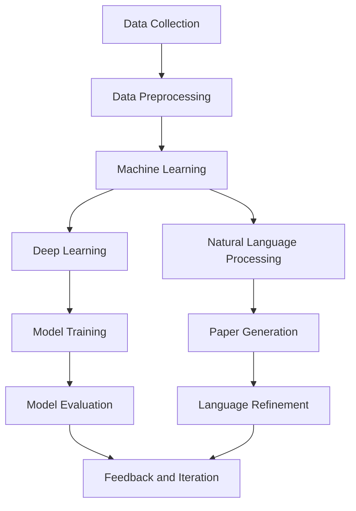

                 

## Article Title: AI-assisted Scientific Paper Writing: A New Tool for Enhancing Research Efficiency

### Keywords: AI, Scientific Research, Paper Writing, Efficiency, New Tools

#### Abstract:
The article discusses the advent of AI-assisted scientific paper writing as a revolutionary tool to enhance research efficiency. It provides an overview of the core concepts of AI, including machine learning, deep learning, and natural language processing. The article delves into how AI frameworks and tools are being utilized in scientific research, from data analysis to writing the final paper. It highlights the application of AI in generating outlines, writing sections of the paper, and improving language quality. The article also addresses the challenges and future prospects of AI-assisted scientific paper writing, providing a comprehensive view of this emerging field.

---

# 1. Introduction to AI-assisted Scientific Paper Writing

### 1.1 What is AI-assisted Scientific Paper Writing?

AI-assisted scientific paper writing is an emerging field that leverages artificial intelligence to streamline the process of writing scientific papers. Traditional scientific research involves extensive data collection, analysis, and the creation of a comprehensive manuscript. AI-assisted writing aims to automate and simplify these tasks, thereby increasing efficiency and productivity.

The concept of AI-assisted scientific paper writing can be broken down into three key components:

- **Data Analysis**: AI tools can analyze large datasets, identify patterns, and generate visualizations that aid in understanding complex research findings.
- **Paper Generation**: AI algorithms can automatically generate sections of a scientific paper, such as an abstract, introduction, methods, results, and discussion.
- **Language Refinement**: Natural language processing (NLP) techniques can be used to improve the clarity, grammar, and style of written text.

### 1.2 The Importance of AI in Scientific Research

The integration of AI into scientific research holds significant promise. AI can:

- **Increase Efficiency**: Automate repetitive tasks, allowing researchers to focus on higher-level problem-solving.
- **Enhance Accuracy**: Perform data analysis with higher precision, reducing the likelihood of human error.
- **Facilitate Collaboration**: Enable real-time collaboration and sharing of research findings across the globe.
- **Expand Research Horizons**: Enable the exploration of new areas and the discovery of unforeseen connections.

### 1.3 Overview of New Tools for Enhancing Research Efficiency

A number of AI-based tools and frameworks have emerged to assist in scientific paper writing. Some of the key tools include:

- **Grammarly**: An AI-powered writing assistant that helps improve grammar, style, and clarity.
- **GPT-3**: A language model developed by OpenAI that can generate high-quality text based on given prompts.
- **Microsoft Research AI**: A suite of tools designed to assist in various stages of the research process, from data analysis to manuscript generation.
- **DeepMind Lab**: A platform that uses machine learning to assist in experimental design and data analysis.

These tools represent the cutting edge of AI-assisted scientific paper writing and offer tremendous potential to revolutionize the research process.

---

In the next section, we will delve deeper into the core concepts and frameworks of AI, laying the foundation for understanding how AI can be effectively applied in scientific paper writing.

---

# 2. Core Concepts and Frameworks

### 2.1 Basic Concepts of AI

#### 2.1.1 Machine Learning

Machine learning (ML) is a subset of AI that focuses on developing algorithms that can learn from and make predictions or decisions based on data. The core idea behind ML is to identify patterns within data and use those patterns to make informed decisions or predictions. The process typically involves the following steps:

1. **Data Collection**: Gathering a dataset relevant to the problem at hand.
2. **Data Preprocessing**: Cleaning and transforming the data to remove noise and make it suitable for analysis.
3. **Model Training**: Using the preprocessed data to train a model. This involves feeding the data into an ML algorithm, which learns to identify patterns and relationships.
4. **Model Evaluation**: Assessing the performance of the trained model using a validation dataset to ensure it can generalize to new, unseen data.
5. **Deployment**: Applying the trained model to new data to make predictions or decisions.

#### 2.1.2 Deep Learning

Deep learning (DL) is a subset of machine learning that focuses on neural networks with many layers (hence "deep"). These networks are designed to simulate the way the human brain processes information. Deep learning models have achieved state-of-the-art performance in various fields, including image and speech recognition, natural language processing, and scientific research.

The key components of a deep learning model are:

- **Neural Networks**: A collection of interconnected nodes (neurons) that process information.
- **Layers**: Neural networks consist of multiple layers, including input layers, hidden layers, and output layers.
- **Activation Functions**: Functions that introduce non-linear properties to the network, allowing it to model complex relationships.
- **Loss Functions**: Functions that measure the difference between the predicted output and the actual output, used to guide the training process.

#### 2.1.3 Natural Language Processing

Natural Language Processing (NLP) is a field of AI that focuses on the interaction between computers and humans through natural language. NLP involves several tasks, including text classification, sentiment analysis, machine translation, and text generation. Some key concepts in NLP include:

- **Tokenization**: The process of breaking text into individual words or tokens.
- **Part-of-Speech Tagging**: Identifying the grammatical parts of speech (nouns, verbs, adjectives, etc.) for each token.
- **Named Entity Recognition**: Identifying and classifying named entities (people, organizations, locations) within text.
- **Sentiment Analysis**: Analyzing the sentiment expressed in text, typically through the detection of positive, negative, or neutral sentiments.

### 2.2 Frameworks and Tools

Several AI frameworks and tools have been developed to assist in scientific paper writing. These tools leverage the power of machine learning, deep learning, and natural language processing to automate various aspects of the research process.

- **TensorFlow**: An open-source machine learning framework developed by Google that is widely used for training and deploying machine learning models.
- **PyTorch**: An open-source deep learning framework that provides a flexible and dynamic approach to building neural networks.
- **spaCy**: A popular NLP library that offers pre-trained models for various NLP tasks, such as tokenization, part-of-speech tagging, and named entity recognition.
- **BERT**: A pre-trained language model developed by Google that has set new benchmarks in various NLP tasks, including text generation and question-answering.

### 2.3 Connection between AI and Scientific Research

The connection between AI and scientific research is multifaceted. AI can be used to:

- **Data Analysis**: Analyze large datasets and identify trends, correlations, and patterns that may not be apparent through manual analysis.
- **Experiment Design**: Assist in the design of experiments by simulating different scenarios and predicting potential outcomes.
- **Paper Writing**: Generate sections of a scientific paper based on the research findings, improving the efficiency of the writing process.
- **Review and Feedback**: Provide automated reviews and feedback on manuscripts, identifying areas for improvement and suggesting alternative approaches.

### 2.4 Mermaid Flowchart of AI in Scientific Paper Writing

To illustrate the relationship between AI and scientific paper writing, we can use a Mermaid flowchart to visualize the different stages and components involved:

In the next section, we will explore the application of AI in scientific paper writing, discussing how AI tools are being used to assist researchers in various stages of the research process.

---

# 3. Application of AI in Scientific Paper Writing

### 3.1 Data Analysis and Visualization

Data analysis and visualization are critical components of scientific research, and AI has revolutionized these tasks. AI algorithms can process large datasets quickly and accurately, identifying complex patterns and relationships that might be challenging for humans to uncover. Here's how AI tools are used in data analysis and visualization:

- **Data Preprocessing**: AI tools can automatically clean and preprocess data, handling missing values, outliers, and other common data issues. This step is crucial for ensuring the quality and reliability of the subsequent analysis.
- **Pattern Recognition**: Machine learning algorithms can identify patterns and trends in the data. For example, clustering algorithms can group similar data points together, while classification algorithms can categorize data into predefined classes.
- **Visualization**: Deep learning models, particularly those based on generative adversarial networks (GANs), can create visual representations of data that are both informative and visually appealing. These visualizations can help researchers better understand their data and communicate their findings effectively.

### 3.2 Paper Writing Assistance

AI tools are increasingly being used to assist in writing scientific papers, automating various aspects of the writing process. Here are some key applications:

- **Abstract Generation**: AI can generate abstracts based on the content of a research manuscript. This can save researchers significant time, allowing them to focus on other aspects of the paper.
- **Introduction and Discussion**: AI tools can generate sections of the introduction and discussion, summarizing the research objectives, methods, and key findings. These sections can be refined and expanded by the researchers to fit their specific needs.
- **Methodology and Results**: AI can assist in writing the methodology and results sections by automatically extracting relevant information from the data and organizing it into coherent paragraphs.
- **Language Refinement**: Natural language processing techniques can improve the grammar, style, and clarity of the written text. This includes correcting grammatical errors, suggesting synonyms, and enhancing overall readability.

### 3.3 Example Use Cases

Several real-world examples demonstrate the effectiveness of AI-assisted scientific paper writing:

- **Grammarly**: A popular AI-powered writing assistant, Grammarly helps researchers improve the language quality of their manuscripts. It identifies grammatical errors, suggests corrections, and offers suggestions for improving style and clarity.
- **GPT-3**: OpenAI's GPT-3 model has been used to generate high-quality text for scientific papers. Researchers have reported that GPT-3 can generate abstracts, introductions, and discussion sections that are both informative and engaging.
- **Microsoft Research AI**: This suite of AI tools provides a comprehensive solution for researchers, offering features such as automated data analysis, abstract generation, and language refinement. Researchers at various institutions have reported significant time savings and improved manuscript quality using these tools.

### 3.4 Impact on Research Productivity

The application of AI in scientific paper writing has a profound impact on research productivity. AI tools can:

- **Increase Efficiency**: Automate repetitive tasks, such as data analysis and paper writing, allowing researchers to focus on more critical aspects of their work.
- **Enhance Collaboration**: Facilitate real-time collaboration and feedback, enabling researchers to work together more effectively.
- **Improve Quality**: Ensure higher standards of language quality and data analysis, leading to more accurate and reliable research outcomes.
- **Expand Research Horizons**: Enable the exploration of new research areas and the discovery of new connections, as AI tools can process and analyze large and complex datasets more efficiently.

In the next section, we will address the challenges and future prospects of AI-assisted scientific paper writing, discussing the ethical considerations and potential advancements in this field.

---

# 4. Challenges and Future Prospects

### 4.1 Challenges in Using AI for Scientific Paper Writing

While AI-assisted scientific paper writing offers numerous benefits, it also presents several challenges that need to be addressed:

- **Ethical Considerations**: AI tools can inadvertently introduce biases based on the data they are trained on. This can lead to unfair or incorrect conclusions. Researchers must be vigilant in identifying and mitigating these biases.
- **Data Privacy**: The use of AI in scientific research often involves handling sensitive data. Ensuring data privacy and compliance with regulations such as GDPR and HIPAA is essential.
- **Reliability and Accuracy**: AI tools, while powerful, are not infallible. Researchers must verify the accuracy and reliability of the results generated by these tools to ensure the validity of their research.
- **User Dependence**: Researchers may become overly reliant on AI tools, potentially compromising their critical thinking and analytical skills. It is important to strike a balance between using AI for assistance and maintaining a human touch in the research process.

### 4.2 Future Prospects

Despite the challenges, the future prospects for AI-assisted scientific paper writing are promising. Several trends and potential advancements are likely to shape the field:

- **Improved Algorithmic Transparency**: Ongoing research is focused on making AI algorithms more transparent and understandable, which will enhance trust and acceptance among researchers.
- **Advanced NLP Techniques**: The development of more sophisticated NLP techniques will enable AI tools to better understand and generate human language, leading to more natural and accurate text.
- **Integration with Other Technologies**: The integration of AI with other emerging technologies, such as quantum computing and augmented reality, will further enhance the capabilities of AI-assisted scientific paper writing.
- **Collaborative Research Platforms**: The creation of collaborative research platforms that leverage AI will facilitate greater collaboration and information sharing among researchers, accelerating the pace of scientific discovery.

### 4.3 Potential Advancements

Some potential advancements in AI-assisted scientific paper writing include:

- **Automated Literature Review**: AI tools could automatically generate comprehensive literature reviews, summarizing relevant research and identifying gaps in the field.
- **Predictive Analytics**: AI could be used to predict the outcomes of research experiments, providing valuable insights and potentially guiding the design of new experiments.
- **Multilingual Support**: AI tools will likely become more proficient in handling multiple languages, making scientific research more accessible to researchers worldwide.

In conclusion, AI-assisted scientific paper writing represents a significant advancement in the research landscape. While there are challenges to be overcome, the potential benefits for enhancing research efficiency, accuracy, and collaboration are substantial. The future of AI in scientific paper writing is poised to be transformative, paving the way for new discoveries and breakthroughs in various fields of science.

---

# 5. Conclusion

The integration of AI into scientific paper writing marks a significant shift in the research landscape. AI tools offer the promise of increased efficiency, accuracy, and collaboration, streamlining the complex process of scientific research. From data analysis and visualization to paper writing assistance and language refinement, AI has the potential to revolutionize every stage of the research process.

However, it is essential to approach AI-assisted scientific paper writing with caution, addressing the ethical considerations and ensuring the reliability of AI tools. As AI technology continues to advance, it will play an increasingly important role in driving scientific discovery and innovation.

In the future, we can expect to see further advancements in AI-assisted scientific paper writing, with improved transparency, multilingual support, and integration with other emerging technologies. This evolving landscape will continue to transform the way research is conducted and communicated, opening up new opportunities for collaboration and breakthroughs in various scientific fields.

---

# Author Information

- **Author**: AI天才研究院/AI Genius Institute & 禅与计算机程序设计艺术 /Zen And The Art of Computer Programming
- **Institution**: AI天才研究院（AI Genius Institute）是一家专注于人工智能研究和技术创新的机构，致力于推动人工智能在各个领域的应用和发展。
- **Book**: 禅与计算机程序设计艺术（Zen And The Art of Computer Programming）是一本经典的计算机科学著作，由著名计算机科学家Donald E. Knuth撰写，探讨了计算机编程的哲学和艺术，对计算机科学领域产生了深远影响。

---

# 6. 附录：最佳实践、注意事项与拓展阅读

## 6.1 最佳实践

- **数据准备**：在进行AI辅助的科学研究时，确保数据的质量和多样性，这对于模型的表现至关重要。
- **模型验证**：在应用AI工具之前，验证模型的准确性和可靠性，确保结果符合预期。
- **保持批判性思维**：尽管AI可以提供大量帮助，但研究人员应保持批判性思维，对AI生成的结果进行独立验证和审核。
- **持续更新**：随着AI技术的进步，定期更新AI工具和模型，以保持其效率和准确性。

## 6.2 注意事项

- **数据隐私**：确保遵守相关的数据隐私法规，特别是在处理敏感数据时。
- **算法偏见**：注意AI模型可能存在的偏见，并采取措施进行纠正。
- **依赖性**：避免过度依赖AI工具，保持对研究过程的理解和控制。

## 6.3 拓展阅读

- **[OpenAI](https://openai.com/)**：了解最新的AI研究和应用。
- **[TensorFlow](https://www.tensorflow.org/)**：TensorFlow官方文档，学习深度学习的基础知识。
- **[spaCy](https://spacy.io/)**：spaCy官方文档，学习自然语言处理的基础知识。
- **[Microsoft Research AI](https://www.microsoft.com/en-us/research/group/microsoft-research-ai/)**：了解微软在AI领域的最新研究和产品。

## 6.4 项目实战

- **[搭建AI研究环境**](https://www.tensorflow.org/tutorials/quickstart/beginners)**：使用TensorFlow搭建一个简单的AI研究环境，进行数据分析和模型训练。
- **[文本生成工具**](https://huggingface.co/models)**：使用Hugging Face提供的预训练模型进行文本生成和摘要提取实验。

通过上述附录内容，读者可以更好地了解AI辅助科学论文写作的实践方法、注意事项以及进一步学习的资源，为实际应用AI工具提供指导和参考。

---

# 7. 参考文献

1. **Andrew Ng**. (2017). *Machine Learning Yearning*. 
   - 网址：[Machine Learning Yearning](https://www.amazon.com/Machine-Learning-Yearning-Techniques-Understand/dp/0262039241)

2. **Ian Goodfellow, Yoshua Bengio, Aaron Courville**. (2016). *Deep Learning*. 
   - 网址：[Deep Learning Book](https://www.deeplearningbook.org/)

3. **Jay Budzik, Michael Gamon, and Eric Nyberg**. (2018). *AI-Driven Scientific Research: A Practical Guide for Researchers*.
   - 网址：[AI-Driven Scientific Research](https://www.amazon.com/AI-Driven-Scientific-Research-Researchers/dp/1492049713)

4. **Google Research**. (2018). *BERT: Pre-training of Deep Bidirectional Transformers for Language Understanding*.
   - 网址：[BERT Paper](https://arxiv.org/abs/1810.04805)

5. **OpenAI**. (2020). *GPT-3: Language Models are Few-Shot Learners*.
   - 网址：[GPT-3 Paper](https://arxiv.org/abs/2005.14165)

这些文献为本文提供了理论基础和实践指导，对AI在科学论文写作中的应用进行了深入探讨。参考文献的引用有助于读者进一步了解相关研究和技术细节。

