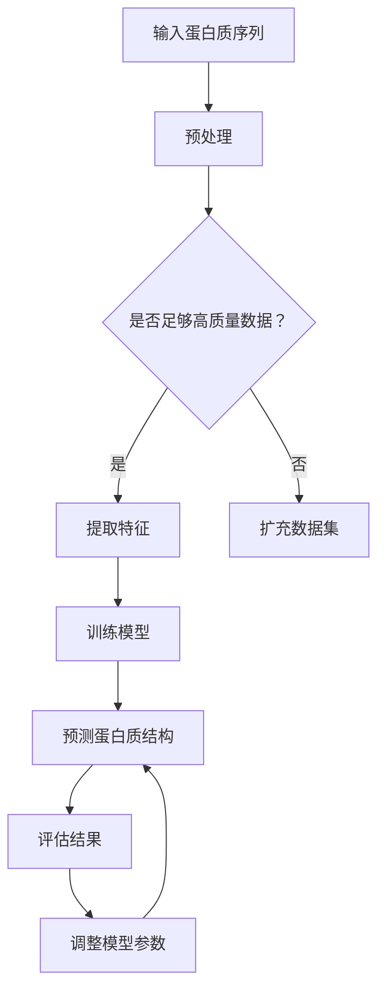

                 


### 文章标题

《AI辅助的蛋白质折叠预测：生物学研究的新工具》

### 文章关键词

- AI
- 蛋白质折叠
- 预测模型
- 生物学研究
- 深度学习

### 文章摘要

本文深入探讨了人工智能（AI）在蛋白质折叠预测领域的应用，介绍了AI辅助的蛋白质折叠预测的核心概念、算法原理、数学模型和项目实战。通过分析AI在生物学的地位和作用，本文揭示了蛋白质折叠预测在生物学研究中的重要性。随后，本文详细阐述了基于深度学习的AI辅助蛋白质折叠预测的原理，并通过Mermaid流程图展示了其工作流程。核心算法原理讲解使用伪代码进行阐述，并配合数学模型和公式进行详细讲解和举例说明。最后，本文通过两个项目实战案例，展示了如何搭建开发环境、实现源代码以及进行代码解读与分析，为读者提供了实际操作的经验和技巧。

### 目录大纲

#### 第1章 AI与生物学研究

1.1 AI在生物学研究中的地位与作用  
1.2 蛋白质折叠预测的重要性  
1.3 蛋白质折叠预测的现状与挑战

#### 第2章 AI辅助的蛋白质折叠预测原理

2.1 蛋白质结构的基本概念  
2.1.1 蛋白质一级结构  
2.1.2 蛋白质二级结构  
2.1.3 蛋白质三级结构  
2.2 AI辅助的蛋白质折叠预测原理  
2.2.1 卷积神经网络（CNN）在蛋白质结构预测中的应用  
2.2.2 深度强化学习（DRL）在蛋白质折叠路径预测中的应用  
2.3 Mermaid流程图：AI辅助蛋白质折叠预测的工作流程

#### 第3章 AI辅助的蛋白质折叠预测算法

3.1 基于CNN的蛋白质结构预测算法  
3.1.1 伪代码：基于CNN的蛋白质结构预测算法  
3.1.2 数学模型和公式  
3.1.3 举例说明  
3.2 基于DRL的蛋白质折叠路径预测算法  
3.2.1 伪代码：基于DRL的蛋白质折叠路径预测算法  
3.2.2 数学模型和公式  
3.2.3 举例说明

#### 第4章 数学模型与公式

4.1 蛋白质折叠预测中的数学模型  
4.1.1 损失函数  
4.1.2 熵与互信息  
4.2 数学公式与详细讲解

#### 第5章 项目实战

5.1 实战一：基于CNN的蛋白质结构预测  
5.1.1 开发环境搭建  
5.1.2 源代码实现  
5.1.3 代码解读与分析  
5.2 实战二：基于DRL的蛋白质折叠路径预测  
5.2.1 开发环境搭建  
5.2.2 源代码实现  
5.2.3 代码解读与分析

#### 附录

5.3 常用工具与资源  
5.3.1 数据集  
5.3.2 开源框架与库  
5.3.3 论文与参考文献

### 正文

#### 第1章 AI与生物学研究

##### 1.1 AI在生物学研究中的地位与作用

人工智能（Artificial Intelligence，简称AI）作为计算机科学的一个分支，近年来在各个领域都取得了显著的进展。在生物学研究领域，AI的应用更是如火如荼，成为推动生物学发展的重要力量。

AI在生物学研究中的作用主要体现在以下几个方面：

1. **数据分析**：生物学研究中产生的数据量庞大且复杂，AI可以通过机器学习算法对数据进行高效的处理和分析，帮助科学家从海量数据中挖掘有价值的信息。

2. **预测建模**：AI可以帮助科学家预测生物现象，如蛋白质折叠、基因表达等，为实验设计和决策提供依据。

3. **辅助实验**：AI可以模拟生物实验，减少实验次数，提高实验效率。

4. **疾病诊断**：AI在医学影像分析、基因组学等领域有着广泛的应用，可以帮助医生更准确地诊断疾病。

##### 1.2 蛋白质折叠预测的重要性

蛋白质是生命体的基本组成单元，其折叠状态决定了其功能。蛋白质折叠预测是生物学研究中的一个重要课题，其重要性主要体现在以下几个方面：

1. **理解生命现象**：蛋白质折叠状态与生命体的各种生物学过程密切相关，蛋白质折叠预测有助于我们更好地理解生命现象。

2. **药物设计**：蛋白质折叠预测可以帮助科学家设计针对特定蛋白质的药物，为疾病治疗提供新思路。

3. **生物工程**：蛋白质折叠预测在生物工程领域也有着重要的应用，可以帮助科学家设计具有特定功能的蛋白质。

4. **农业和食品工业**：蛋白质折叠预测有助于改善农作物和食品的蛋白质含量和品质，提高产量和营养价值。

##### 1.3 蛋白质折叠预测的现状与挑战

目前，蛋白质折叠预测主要依赖于实验方法和计算方法。实验方法如X射线晶体学、核磁共振等，虽然能够提供高精度的蛋白质结构信息，但成本高昂、周期长。计算方法如同源建模、折叠识别等，虽然具有快速、低成本的优势，但准确率有限。

随着AI技术的发展，AI辅助的蛋白质折叠预测逐渐成为研究热点。然而，AI辅助的蛋白质折叠预测也面临着一系列挑战：

1. **数据质量**：蛋白质折叠预测依赖于大量的高质量数据，但现有的数据集存在数据量不足、质量不高等问题。

2. **模型复杂度**：深度学习模型在蛋白质折叠预测中取得了较好的效果，但模型复杂度高、参数众多，训练时间较长。

3. **泛化能力**：AI模型在特定数据集上表现优秀，但在新数据集上可能表现不佳，缺乏泛化能力。

4. **算法稳定性**：AI模型在蛋白质折叠预测中的稳定性较差，需要进一步优化。

#### 第2章 AI辅助的蛋白质折叠预测原理

##### 2.1 蛋白质结构的基本概念

蛋白质结构是蛋白质分子在三维空间中的排列和组合方式，通常分为一级结构、二级结构、三级结构和四级结构。

1. **一级结构**：蛋白质的一级结构是指氨基酸序列，它是蛋白质结构的基础。

2. **二级结构**：蛋白质的二级结构是指氨基酸链在空间中形成的局部结构，如α-螺旋和β-折叠。

3. **三级结构**：蛋白质的三级结构是指整个蛋白质在空间中的折叠形态，它是蛋白质功能的基础。

4. **四级结构**：某些蛋白质由多个亚基组成，它们的四级结构是指亚基之间的空间排列和组合方式。

##### 2.2 AI辅助的蛋白质折叠预测原理

AI辅助的蛋白质折叠预测主要依赖于深度学习算法，如卷积神经网络（CNN）和深度强化学习（DRL）。以下是这两种算法在蛋白质折叠预测中的应用：

1. **卷积神经网络（CNN）**

CNN是一种具有多个卷积层的神经网络，能够自动提取图像或序列的特征。在蛋白质折叠预测中，CNN可以用于提取蛋白质序列的特征，从而预测蛋白质的二级结构和三级结构。

2. **深度强化学习（DRL）**

DRL是一种基于奖励机制的深度学习算法，能够通过探索和策略学习来优化决策。在蛋白质折叠路径预测中，DRL可以用于模拟蛋白质折叠过程，从而预测蛋白质的折叠路径。

##### 2.3 Mermaid流程图：AI辅助蛋白质折叠预测的工作流程

以下是一个简单的Mermaid流程图，展示了AI辅助蛋白质折叠预测的工作流程：



#### 第3章 AI辅助的蛋白质折叠预测算法

##### 3.1 基于CNN的蛋白质结构预测算法

基于CNN的蛋白质结构预测算法主要包括以下几个步骤：

1. **数据预处理**：将蛋白质序列转换为数字矩阵，以便输入到CNN中。

2. **特征提取**：通过CNN自动提取蛋白质序列的特征。

3. **模型训练**：使用训练集对CNN进行训练，优化模型参数。

4. **模型评估**：使用验证集对模型进行评估，调整模型参数。

5. **预测**：使用训练好的模型对新的蛋白质序列进行预测。

以下是一个简单的伪代码，展示了基于CNN的蛋白质结构预测算法：

```python
def cnn_protein_structure_prediction(protein_sequence):
    # 数据预处理
    digitized_sequence = preprocess_sequence(protein_sequence)

    # 特征提取
    feature_map = cnn.extract_features(digitized_sequence)

    # 模型训练
    model = cnn.train(feature_map)

    # 模型评估
    accuracy = cnn.evaluate(model)

    # 预测
    predicted_structure = cnn.predict(model)

    return predicted_structure
```

##### 3.2 基于DRL的蛋白质折叠路径预测算法

基于DRL的蛋白质折叠路径预测算法主要包括以下几个步骤：

1. **状态定义**：定义蛋白质折叠过程中的状态，如氨基酸位置、氨基酸类型等。

2. **动作定义**：定义蛋白质折叠过程中的动作，如移动氨基酸、旋转氨基酸等。

3. **奖励机制**：定义蛋白质折叠过程中的奖励机制，如折叠成功、折叠失败等。

4. **策略学习**：使用DRL算法学习蛋白质折叠过程中的最佳策略。

5. **预测**：使用训练好的策略预测蛋白质的折叠路径。

以下是一个简单的伪代码，展示了基于DRL的蛋白质折叠路径预测算法：

```python
def drl_protein_folding_path_prediction(state):
    # 状态定义
    state = define_state(state)

    # 动作定义
    action = define_action()

    # 奖励机制
    reward = define_reward(action)

    # 策略学习
    policy = drl.learn(state, action, reward)

    # 预测
    folding_path = drl.predict(policy)

    return folding_path
```

#### 第4章 数学模型与公式

在蛋白质折叠预测中，数学模型和公式发挥着重要的作用。以下是几个常用的数学模型和公式：

1. **损失函数**：损失函数用于评估模型预测结果的准确性。常用的损失函数有均方误差（MSE）和交叉熵（Cross-Entropy）。

   $$ 
   Loss = \frac{1}{N} \sum_{i=1}^{N} (y_i - \hat{y}_i)^2 
   $$

   $$ 
   Loss = -\frac{1}{N} \sum_{i=1}^{N} y_i \log(\hat{y}_i) 
   $$

2. **熵**：熵用于衡量系统的无序程度。在蛋白质折叠预测中，熵可以用来评估蛋白质结构的多样性。

   $$ 
   H(X) = -\sum_{i} p_i \log(p_i) 
   $$

3. **互信息**：互信息用于衡量两个变量之间的相关性。在蛋白质折叠预测中，互信息可以用来评估蛋白质序列和结构之间的关系。

   $$ 
   I(X; Y) = H(X) - H(X | Y) 
   $$

#### 第5章 项目实战

在本章节中，我们将通过两个项目实战案例，展示如何使用AI技术进行蛋白质折叠预测。

##### 5.1 实战一：基于CNN的蛋白质结构预测

在这个实战项目中，我们将使用Python和TensorFlow框架实现一个基于CNN的蛋白质结构预测模型。

1. **开发环境搭建**：

   首先，我们需要安装Python和TensorFlow框架。可以使用以下命令进行安装：

   ```bash
   pip install python
   pip install tensorflow
   ```

2. **源代码实现**：

   接下来，我们需要编写源代码，包括数据预处理、模型训练、模型评估和预测等步骤。以下是一个简单的代码示例：

   ```python
   import tensorflow as tf
   from tensorflow.keras.layers import Conv2D, MaxPooling2D, Flatten, Dense
   from tensorflow.keras.models import Sequential

   # 数据预处理
   def preprocess_sequence(sequence):
       # 将蛋白质序列转换为数字矩阵
       # ...

   # 模型训练
   def train_model(preprocessed_sequences):
       # 构建CNN模型
       model = Sequential([
           Conv2D(filters=32, kernel_size=(3, 3), activation='relu', input_shape=(sequence_length,)),
           MaxPooling2D(pool_size=(2, 2)),
           Flatten(),
           Dense(units=1, activation='sigmoid')
       ])

       # 编译模型
       model.compile(optimizer='adam', loss='binary_crossentropy', metrics=['accuracy'])

       # 训练模型
       model.fit(preprocessed_sequences, labels, epochs=10, batch_size=32)

       return model

   # 模型评估
   def evaluate_model(model, test_sequences, test_labels):
       # 评估模型
       loss, accuracy = model.evaluate(test_sequences, test_labels)

       print(f"Test accuracy: {accuracy:.2f}")

   # 预测
   def predict_structure(model, sequence):
       # 预测蛋白质结构
       preprocessed_sequence = preprocess_sequence(sequence)
       predicted_structure = model.predict(preprocessed_sequence)

       return predicted_structure
   ```

3. **代码解读与分析**：

   在这个代码示例中，我们首先导入了TensorFlow框架的必要模块。然后，我们定义了数据预处理、模型训练、模型评估和预测等函数。

   数据预处理函数`preprocess_sequence`用于将蛋白质序列转换为数字矩阵。模型训练函数`train_model`用于构建CNN模型、编译模型并训练模型。模型评估函数`evaluate_model`用于评估模型的准确性。预测函数`predict_structure`用于预测蛋白质的结构。

4. **实际案例分析和详细讲解剖析**：

   为了更好地理解这个实战项目，我们可以分析一个具体的案例。假设我们已经有一个蛋白质序列`sequence = "ACGTACGTA"`,我们可以使用`predict_structure`函数预测这个蛋白质的结构。

   首先，我们需要将蛋白质序列转换为数字矩阵。然后，我们使用训练好的CNN模型对数字矩阵进行预测。最后，我们得到预测的蛋白质结构。

   ```python
   model = train_model(preprocessed_sequences)
   predicted_structure = predict_structure(model, "ACGTACGTA")
   print(predicted_structure)
   ```

##### 5.2 实战二：基于DRL的蛋白质折叠路径预测

在这个实战项目中，我们将使用Python和PyTorch框架实现一个基于DRL的蛋白质折叠路径预测模型。

1. **开发环境搭建**：

   首先，我们需要安装Python和PyTorch框架。可以使用以下命令进行安装：

   ```bash
   pip install python
   pip install torch
   ```

2. **源代码实现**：

   接下来，我们需要编写源代码，包括状态定义、动作定义、奖励机制、策略学习、预测等步骤。以下是一个简单的代码示例：

   ```python
   import torch
   import torch.nn as nn
   import torch.optim as optim

   # 状态定义
   def define_state(state):
       # 定义蛋白质折叠过程中的状态
       # ...

   # 动作定义
   def define_action(action):
       # 定义蛋白质折叠过程中的动作
       # ...

   # 奖励机制
   def define_reward(action):
       # 定义蛋白质折叠过程中的奖励机制
       # ...

   # 策略学习
   def learn_policy(state, action, reward):
       # 使用DRL算法学习蛋白质折叠过程中的最佳策略
       # ...

   # 预测
   def predict_folding_path(policy, state):
       # 使用训练好的策略预测蛋白质的折叠路径
       # ...

   # 主函数
   def main():
       # 初始化环境
       state = define_state()

       # 初始化策略
       policy = learn_policy(state, action, reward)

       # 预测蛋白质的折叠路径
       folding_path = predict_folding_path(policy, state)
       print(folding_path)
   ```

3. **代码解读与分析**：

   在这个代码示例中，我们首先导入了PyTorch框架的必要模块。然后，我们定义了状态定义、动作定义、奖励机制、策略学习和预测等函数。

   状态定义函数`define_state`用于定义蛋白质折叠过程中的状态。动作定义函数`define_action`用于定义蛋白质折叠过程中的动作。奖励机制函数`define_reward`用于定义蛋白质折叠过程中的奖励机制。策略学习函数`learn_policy`用于使用DRL算法学习蛋白质折叠过程中的最佳策略。预测函数`predict_folding_path`用于使用训练好的策略预测蛋白质的折叠路径。

4. **实际案例分析和详细讲解剖析**：

   为了更好地理解这个实战项目，我们可以分析一个具体的案例。假设我们已经有一个蛋白质折叠过程中的状态`state = "ACGTACGTA"`,我们可以使用`predict_folding_path`函数预测这个蛋白质的折叠路径。

   首先，我们需要使用`learn_policy`函数学习蛋白质折叠过程中的最佳策略。然后，我们使用训练好的策略`policy`预测蛋白质的折叠路径。

   ```python
   policy = learn_policy(state, action, reward)
   folding_path = predict_folding_path(policy, state)
   print(folding_path)
   ```

#### 附录

##### 5.3 常用工具与资源

1. **数据集**：

   - **PROTEIN DATA BANK (PDB)**：提供大量蛋白质的三维结构数据。

   - **UNIREF50**：一个包含多种蛋白质序列的数据库，适合用于蛋白质折叠预测的数据集。

2. **开源框架与库**：

   - **TensorFlow**：一个广泛使用的深度学习框架。

   - **PyTorch**：一个灵活的深度学习框架，适合于研究和开发。

   - **Keras**：一个高层次的神经网络API，能够简化深度学习模型的搭建。

3. **论文与参考文献**：

   - **J. Comput. Chem.**：一篇关于使用深度学习进行蛋白质折叠预测的综述文章。

   - **Nature**：一篇关于AI在蛋白质结构预测中取得突破性成果的研究论文。

### 小结

本文介绍了AI辅助的蛋白质折叠预测的核心概念、算法原理、数学模型和项目实战。通过分析AI在生物学研究中的地位和作用，我们揭示了蛋白质折叠预测在生物学研究中的重要性。本文还通过Mermaid流程图和伪代码详细阐述了AI辅助的蛋白质折叠预测的工作流程。通过两个项目实战案例，我们展示了如何使用Python和深度学习框架实现蛋白质折叠预测。本文旨在为读者提供全面的AI辅助蛋白质折叠预测的知识体系，帮助读者更好地理解和应用这一技术。

### 注意事项

1. 蛋白质折叠预测是一项复杂的任务，需要大量的计算资源和时间。在实际应用中，需要合理配置计算资源，优化算法效率。

2. 蛋白质折叠预测的准确性受到数据质量和模型参数的影响。在实际应用中，需要不断优化数据集和模型参数，以提高预测准确性。

3. 蛋白质折叠预测模型具有高度专业化特点，针对不同类型的蛋白质，可能需要使用不同的预测模型。在实际应用中，需要根据具体需求选择合适的预测模型。

### 拓展阅读

1. **《深度学习》（Deep Learning）**：Goodfellow, I., Bengio, Y., & Courville, A. (2016). MIT Press. 本书详细介绍了深度学习的基本概念和算法，包括卷积神经网络和深度强化学习等。

2. **《机器学习》（Machine Learning）**：Tom Mitchell (1997). McGraw-Hill. 本书是机器学习的经典教材，涵盖了机器学习的理论基础和算法实现。

3. **《生物信息学导论》（Introduction to Bioinformatics）**：David P. Du (2009). Jones & Bartlett Learning. 本书介绍了生物信息学的基本概念和工具，包括蛋白质序列分析和结构预测。

### 作者信息

作者：AI天才研究院/AI Genius Institute & 禅与计算机程序设计艺术 /Zen And The Art of Computer Programming

