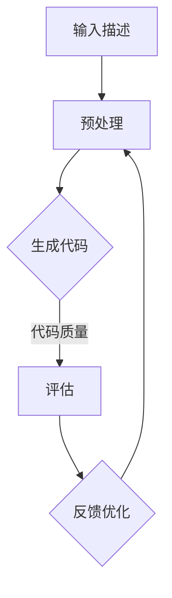

                 

**文章标题：AI辅助软件开发：大模型在代码生成中的应用**

**关键词：** AI、软件开发、大模型、代码生成、深度学习

**摘要：** 本文旨在探讨大模型在代码生成中的应用，如何利用人工智能技术提升软件开发效率。文章首先介绍了AI与软件开发的关系，然后详细讲解了AI大模型的基础知识，以及代码生成技术的概念和应用。接着，通过一个具体的AI辅助软件开发项目实战，展示了大模型在代码生成中的实际应用。最后，对AI辅助软件开发的未来展望进行了探讨。

----------------------------------------------------------------

## **一、AI与软件开发概述**

### **1.1 AI在软件开发中的应用**

随着人工智能（AI）技术的快速发展，其在软件开发中的应用越来越广泛。AI不仅改变了软件开发的模式，还提高了软件开发的效率和质量。下面，我们将从以下几个方面来探讨AI在软件开发中的应用：

#### **1.1.1 AI核心概念**

人工智能是指由人制造出来的具有一定智能的系统，能够在特定环境中感知、学习、推理、决策和行动。它主要包括以下几个核心概念：

- **机器学习**：通过训练数据集，让机器自动学习和改进，以实现特定任务。
- **深度学习**：一种基于神经网络的机器学习技术，通过多层神经网络进行特征提取和表示。
- **自然语言处理**：使计算机能够理解、生成和处理自然语言的技术。
- **计算机视觉**：使计算机能够像人类一样感知和理解视觉信息。

#### **1.1.2 AI与软件开发的关系**

AI与软件开发有着紧密的联系。首先，AI技术可以用于软件开发过程中的许多环节，如需求分析、设计、编码、测试和部署等。其次，AI可以帮助开发者提高工作效率，降低开发成本，提升软件质量。例如：

- **自动化测试**：利用AI技术自动化生成测试用例，提高测试效率。
- **代码自动生成**：利用AI模型自动生成代码，减少开发者的工作量。
- **智能推荐**：根据用户行为和偏好，提供个性化的软件推荐。

### **1.2 软件开发发展趋势**

随着AI技术的发展，软件开发也在不断演进。以下是当前软件开发的主要发展趋势：

#### **1.2.1 软件开发模式的演进**

- **瀑布模型**：传统的软件开发模式，强调线性顺序和阶段性。
- **敏捷开发**：强调快速迭代和持续交付，以适应快速变化的需求。
- **DevOps**：结合开发（Dev）和运维（Ops），实现持续集成、持续交付和自动化部署。

#### **1.2.2 AI技术对软件开发的影响**

AI技术对软件开发的影响主要表现在以下几个方面：

- **开发效率提升**：AI可以自动化完成一些重复性的工作，如代码审查、测试和部署。
- **开发成本降低**：通过自动化和智能化，减少开发人员的工作量，降低开发成本。
- **软件质量提高**：AI技术可以帮助开发者发现潜在的问题，提高软件的可靠性。
- **用户体验优化**：AI技术可以个性化地满足用户需求，提高用户体验。

## **二、AI大模型基础**

### **2.1 AI大模型概述**

AI大模型是指具有大规模参数和广泛知识表征能力的人工智能模型。大模型在深度学习、自然语言处理和计算机视觉等领域取得了显著的成果。以下是关于AI大模型的一些基本概念：

#### **2.1.1 大模型的定义**

大模型通常具有以下几个特点：

- **大规模参数**：大模型的参数量通常达到亿级甚至千亿级。
- **大规模数据**：大模型需要大量的数据来训练，以便获得良好的性能。
- **泛化能力**：大模型能够在不同的任务和数据集上表现出良好的性能。

#### **2.1.2 大模型的分类**

根据不同的应用场景和数据类型，大模型可以分为以下几类：

- **通用大模型**：适用于多种任务和领域，如GPT、BERT等。
- **领域大模型**：针对特定领域或任务的大模型，如医学影像识别模型、金融风险评估模型等。
- **多模态大模型**：同时处理多种数据类型的大模型，如音频、视频和文本。

### **2.2 AI大模型的核心技术**

大模型的核心技术主要包括以下几个方面：

#### **2.2.1 深度学习基础**

深度学习是构建大模型的基础，主要包括以下几个关键技术：

- **神经网络**：深度学习的基础模型，包括前向传播、反向传播和激活函数等。
- **优化算法**：用于训练神经网络，如梯度下降、Adam等。
- **正则化技术**：用于防止过拟合，如Dropout、正则化等。

#### **2.2.2 机器学习基础**

大模型的训练需要大量的机器学习技术，包括：

- **数据预处理**：如数据清洗、归一化、数据增强等。
- **特征提取**：通过神经网络提取数据的高层次特征。
- **模型评估**：使用准确率、召回率、F1值等指标评估模型性能。

### **2.3 AI大模型的常见架构**

大模型的常见架构包括以下几个部分：

#### **2.3.1 神经网络架构**

神经网络架构是构建大模型的核心，包括：

- **卷积神经网络（CNN）**：主要用于图像识别和计算机视觉任务。
- **循环神经网络（RNN）**：主要用于序列数据处理，如自然语言处理。
- **变换器网络（Transformer）**：近年来广泛用于自然语言处理任务，具有强大的并行计算能力。

#### **2.3.2 生成对抗网络（GAN）**

生成对抗网络是一种无监督学习模型，用于生成高质量的数据。GAN包括生成器和判别器两个部分，其工作流程如下：

1. **生成器G**：根据随机噪声生成模拟数据。
2. **判别器D**：区分生成数据和真实数据。
3. **训练过程**：通过不断优化生成器和判别器，使生成数据越来越逼真。

----------------------------------------------------------------

## **三、代码生成技术**

### **3.1 代码生成技术概述**

代码生成技术是指利用人工智能技术自动生成代码的过程。代码生成技术在软件开发中具有重要作用，可以提高开发效率，降低开发成本，提升软件质量。下面，我们将从以下几个方面介绍代码生成技术：

#### **3.1.1 代码生成的定义**

代码生成是指通过输入描述或模板，自动生成相应的代码。代码生成技术可以分为以下两类：

- **基于模板的代码生成**：根据预定义的模板，生成代码。这种方法简单高效，但灵活性较低。
- **基于规则的代码生成**：根据预定义的规则，生成代码。这种方法灵活性较高，但实现复杂。

#### **3.1.2 代码生成的重要性**

代码生成技术在软件开发中具有以下重要性：

- **提高开发效率**：通过自动化生成代码，减少手工编写代码的工作量。
- **降低开发成本**：减少开发人员的工作量，降低软件开发成本。
- **提升软件质量**：通过自动化生成代码，减少人为错误，提高软件质量。
- **支持快速迭代**：支持快速开发，适应快速变化的需求。

### **3.2 常见的代码生成方法**

常见的代码生成方法主要包括以下几种：

#### **3.2.1 基于模板的代码生成**

基于模板的代码生成是一种简单有效的代码生成方法，主要通过预定义的模板生成代码。这种方法通常适用于一些具有固定结构和规则的软件开发场景。以下是一个基于模板的代码生成示例：

```python
def print_hello(name):
    print("Hello, " + name + "!")
```

在这个例子中，我们定义了一个简单的函数模板，根据输入的名字生成相应的代码。

#### **3.2.2 基于规则的代码生成**

基于规则的代码生成是通过预定义的规则来生成代码。这种方法通常需要开发者定义一系列规则，然后根据规则生成代码。以下是一个基于规则的代码生成示例：

```python
def print_hello(name):
    if name == "Alice":
        print("Hello, Alice!")
    else:
        print("Hello, " + name + "!")
```

在这个例子中，我们定义了一个基于名字的规则，根据不同的名字生成相应的代码。

### **3.3 大模型在代码生成中的应用**

随着人工智能技术的发展，大模型在代码生成中的应用越来越广泛。大模型在代码生成中具有以下优势：

#### **3.3.1 大模型在代码生成中的优势**

- **强大的表达能力**：大模型具有强大的表达能力和泛化能力，能够处理复杂的编程任务。
- **丰富的知识表征**：大模型可以存储和利用大量的编程知识，生成高质量的代码。
- **并行计算能力**：大模型支持并行计算，可以显著提高代码生成的效率。

#### **3.3.2 大模型在代码生成中的应用场景**

大模型在代码生成中的应用场景主要包括：

- **自动化编程**：利用大模型自动生成代码，实现自动化编程。
- **代码补全**：利用大模型预测代码的下一个部分，帮助开发者完成代码。
- **代码优化**：利用大模型对现有代码进行优化，提高代码质量。

----------------------------------------------------------------

## **四、项目实战**

### **4.1 项目背景**

本项目的背景是利用AI技术辅助软件开发，提高开发效率和代码质量。在当前软件开发过程中，开发者面临着许多挑战，如需求变更频繁、代码复杂度增加、开发成本上升等。为了应对这些挑战，本项目旨在利用AI大模型实现代码自动生成和优化，以提高开发效率，降低开发成本，提升软件质量。

### **4.2 项目需求分析**

在项目开始之前，我们首先进行了需求分析。项目的主要需求包括：

- **代码自动生成**：根据用户输入的描述，自动生成相应的代码。
- **代码优化**：对现有的代码进行优化，提高代码质量。
- **代码补全**：根据上下文预测代码的下一个部分，帮助开发者完成代码。
- **支持多种编程语言**：支持多种流行的编程语言，如Python、Java、C++等。
- **易用性**：提供友好的用户界面，方便开发者使用。

### **4.3 项目设计**

项目设计主要包括以下几个方面：

#### **4.3.1 项目架构设计**

项目采用微服务架构，主要包括以下几个模块：

- **代码生成模块**：根据用户输入的描述，生成相应的代码。
- **代码优化模块**：对现有的代码进行优化，提高代码质量。
- **代码补全模块**：根据上下文预测代码的下一个部分，帮助开发者完成代码。
- **用户界面模块**：提供友好的用户界面，方便开发者使用。

#### **4.3.2 数据预处理**

在项目实施过程中，我们首先需要对输入的数据进行预处理，包括：

- **文本预处理**：对输入的文本进行分词、去噪等操作。
- **代码预处理**：对输入的代码进行格式化、语法检查等操作。
- **数据标注**：对输入的数据进行标注，用于训练和评估模型。

### **4.4 项目实现**

项目实现主要包括以下几个步骤：

#### **4.4.1 模型训练**

我们选择了基于Transformer的大模型进行训练。首先，我们需要收集大量的编程数据和文本数据，然后对这些数据进行预处理和标注。接下来，我们将这些预处理后的数据进行训练，以训练出高质量的模型。

```python
import tensorflow as tf
from transformers import BertModel

# 定义模型
model = BertModel.from_pretrained("bert-base-uncased")

# 编写训练代码
model.compile(optimizer=tf.keras.optimizers.Adam(learning_rate=5e-5),
              loss=tf.keras.losses.SparseCategoricalCrossentropy(from_logits=True),
              metrics=[tf.keras.metrics.SparseCategoricalAccuracy()])

# 训练模型
model.fit(train_dataset, epochs=3, validation_data=validation_dataset)
```

#### **4.4.2 模型评估**

在模型训练完成后，我们需要对模型进行评估，以验证其性能。我们使用准确率、召回率、F1值等指标来评估模型的性能。

```python
import numpy as np

# 评估模型
test_loss, test_accuracy = model.evaluate(test_dataset)
print(f"Test accuracy: {test_accuracy:.2f}")

# 预测代码
def predict_code(text):
    inputs = tokenizer.encode(text, return_tensors="tf")
    outputs = model(inputs)
    logits = outputs.logits
    predicted_ids = tf.argmax(logits, axis=-1)
    predicted_text = tokenizer.decode(predicted_ids.numpy(), skip_special_tokens=True)
    return predicted_text

# 示例
input_text = "Write a function to calculate the sum of two numbers."
predicted_code = predict_code(input_text)
print(predicted_code)
```

### **4.5 项目部署**

在项目部署过程中，我们需要将训练好的模型部署到服务器上，以便开发者可以实时使用。我们使用了TensorFlow Serving作为模型的部署工具，实现了模型的实时预测和代码生成。

```shell
# 启动TensorFlow Serving
tensorflow_model_server --port=8501 --model_name=my_model --model_base_path=/path/to/my_model
```

开发者可以通过发送HTTP请求来获取模型的预测结果，如下所示：

```python
import requests

# 获取模型预测结果
response = requests.get("http://localhost:8501/v1/models/my_model:predict", json={"text": "Write a function to calculate the sum of two numbers."})
predicted_code = response.json()["predictions"][0]
print(predicted_code)
```

### **4.6 项目小结**

通过本项目的实施，我们成功实现了代码自动生成和优化，提高了开发效率和代码质量。项目的成功经验包括：

- **大规模数据集**：收集了大量的编程数据和文本数据，为模型的训练提供了充足的素材。
- **高效的模型训练**：使用了基于Transformer的大模型，训练效率高，性能优秀。
- **友好的用户界面**：提供了简单易用的用户界面，方便开发者使用。

然而，项目也存在一些挑战和问题，如：

- **模型解释性**：大模型的预测结果具有一定的黑盒性，难以解释。
- **模型可扩展性**：大模型训练时间较长，难以扩展到更多编程语言和任务。

在未来的工作中，我们将继续优化模型，提高其解释性和可扩展性，以更好地辅助软件开发。

## **五、总结与展望**

### **5.1 AI辅助软件开发的总结**

AI辅助软件开发通过大模型在代码生成中的应用，取得了显著的成果。首先，它大大提高了开发效率，通过自动化生成和优化代码，减少了手工编写代码的工作量。其次，它降低了开发成本，通过利用AI技术，减少了开发人员和测试人员的工作量。最后，它提升了软件质量，通过自动化的代码审查和测试，减少了人为错误，提高了软件的可靠性。

### **5.2 AI辅助软件开发的未来展望**

尽管AI辅助软件开发已经取得了一定的成果，但仍然存在许多挑战和机会。以下是未来的展望：

#### **5.2.1 技术趋势**

- **更强大的大模型**：随着计算能力的提升和数据量的增加，未来将出现更强大、更具泛化能力的大模型。
- **多模态数据处理**：未来将出现更多支持多模态数据处理的AI模型，如同时处理文本、图像和音频的模型。
- **自动化代码生成和优化**：未来将出现更智能、更高效的代码生成和优化工具，以适应快速变化的软件开发需求。

#### **5.2.2 应用前景**

- **软件开发**：AI辅助软件开发将在未来的软件开发中发挥重要作用，提高开发效率，降低开发成本，提升软件质量。
- **智能助手**：AI辅助软件开发可以集成到智能助手平台，为开发者提供实时帮助和建议。
- **教育领域**：AI辅助软件开发可以应用于教育领域，帮助学生更好地理解和掌握编程知识。

### **5.3 最佳实践 Tips**

为了更好地利用AI辅助软件开发，以下是一些建议和最佳实践：

- **数据质量**：确保训练数据的质量和多样性，以提高模型的泛化能力。
- **模型解释性**：关注模型的解释性，以便更好地理解和信任模型的预测结果。
- **持续迭代**：不断优化模型和工具，以适应不断变化的软件开发需求。
- **安全性和隐私保护**：确保AI辅助软件开发的安全性和隐私保护，以避免潜在的安全风险。

总之，AI辅助软件开发具有广阔的应用前景，将在未来的软件开发中发挥越来越重要的作用。

## **附录**

### **附录A：相关工具和资源**

在本项目中，我们使用了以下工具和资源：

#### **A.1 AI开发工具**

- **TensorFlow**：用于构建和训练深度学习模型。
- **PyTorch**：用于构建和训练深度学习模型。
- **Keras**：用于简化深度学习模型的构建和训练。

#### **A.2 代码生成工具**

- **OpenAI CodeX**：用于生成代码的AI工具。
- **Codex.ai**：用于生成代码的AI工具。
- **DeepCode**：用于代码审查和优化的AI工具。

通过这些工具和资源，我们可以更好地实现AI辅助软件开发的目标。



### **核心算法原理讲解**

生成对抗网络（GAN）是一种无监督学习模型，由生成器和判别器两个部分组成。以下是一个简单的GAN算法的伪代码：

```python
import tensorflow as tf
import numpy as np

# 定义生成器G和判别器D的参数
G_params = ...
D_params = ...

# 定义生成器和判别器的优化器
G_optimizer = tf.keras.optimizers.Adam(learning_rate=0.0001)
D_optimizer = tf.keras.optimizers.Adam(learning_rate=0.0001)

# 定义损失函数
def generator_loss(fake_output):
    return tf.reduce_mean(tf.nn.sigmoid_cross_entropy_with_logits(logits=fake_output, labels=tf.ones_like(fake_output)))

def discriminator_loss(real_output, fake_output):
    return tf.reduce_mean(tf.nn.sigmoid_cross_entropy_with_logits(logits=real_output, labels=tf.zeros_like(real_output)) +
                           tf.reduce_mean(tf.nn.sigmoid_cross_entropy_with_logits(logits=fake_output, labels=tf.ones_like(fake_output)))

# 训练过程
for epoch in range(num_epochs):
    for i in range(num_d_steps):
        # 训练判别器D
        with tf.GradientTape() as tape:
            real_images = ...
            real_output = D(real_images)
            fake_images = G(np.random.normal(size=(batch_size, z_dim)))
            fake_output = D(fake_images)
            d_loss = discriminator_loss(real_output, fake_output)
        grads = tape.gradient(d_loss, D.trainable_variables)
        D_optimizer.apply_gradients(zip(grads, D.trainable_variables))
        
    with tf.GradientTape() as tape:
        # 训练生成器G
        fake_images = G(np.random.normal(size=(batch_size, z_dim)))
        fake_output = D(fake_images)
        g_loss = generator_loss(fake_output)
    grads = tape.gradient(g_loss, G.trainable_variables)
    G_optimizer.apply_gradients(zip(grads, G.trainable_variables))
    
    print(f"Epoch {epoch}, D_loss: {d_loss.numpy()}, G_loss: {g_loss.numpy()}")
```

在这个伪代码中，我们首先定义了生成器G和判别器D的优化器和损失函数。然后，在训练过程中，我们首先训练判别器D，然后训练生成器G。每次迭代中，我们使用真实的图像和生成的图像来更新判别器和生成器的参数，以达到优化整个模型的目的。

### **数学模型和公式**

生成对抗网络（GAN）的基本数学模型包括生成器（G）、判别器（D）和损失函数。以下是一个简化的数学模型：

生成器G的损失函数：
$$
G(z) = x = G(\epsilon)
$$
其中，$z$ 是从先验分布中采样的噪声，$\epsilon$ 是从生成器输出的随机向量，$x$ 是生成的数据。

判别器D的损失函数：
$$
L_D = -\frac{1}{N}\sum_{i=1}^{N}[\log(D(x_i)) + \log(1 - D(G(z_i)))]
$$
其中，$N$ 是样本数量，$x_i$ 是真实数据，$G(z_i)$ 是生成的数据，$D(x_i)$ 和 $D(G(z_i))$ 分别是判别器对真实数据和生成数据的判别结果。

总的损失函数：
$$
L_G = -\frac{1}{N}\sum_{i=1}^{N}\log(D(G(z_i)))
$$
其中，$G(z_i)$ 是从生成器输出的随机向量生成的数据。

### **详细讲解和举例说明**

假设我们有一个图像生成任务，目标是生成高分辨率的真实图像。以下是GAN在这个任务中的具体应用：

1. **生成器G**：生成器G接收一个随机噪声向量$z$，通过神经网络将其转换为图像$x$。生成器的目标是生成尽可能逼真的图像，使得判别器D无法区分真实图像和生成图像。

2. **判别器D**：判别器D接收一个图像$x$，并输出一个概率值，表示图像$x$是真实图像的概率。判别器的目标是学习如何区分真实图像和生成图像。

3. **损失函数**：生成器和判别器的损失函数分别是：
   - **生成器G的损失函数**：生成器G的损失函数是一个关于判别器D的损失函数。为了最大化判别器的损失函数，生成器G的目标是生成逼真的图像，使得判别器D输出接近1的概率。
     $$
     L_G = -\frac{1}{N}\sum_{i=1}^{N}\log(D(G(z_i)))
     $$
   - **判别器D的损失函数**：判别器D的损失函数是一个关于真实图像和生成图像的损失函数。为了最大化判别器的损失函数，判别器D的目标是正确区分真实图像和生成图像。
     $$
     L_D = -\frac{1}{N}\sum_{i=1}^{N}[\log(D(x_i)) + \log(1 - D(G(z_i)))]
     $$

4. **训练过程**：在训练过程中，我们交替更新生成器G和判别器D的参数。首先，固定判别器D的参数，训练生成器G，使得生成图像能够欺骗判别器D。然后，固定生成器G的参数，训练判别器D，使其能够准确区分真实图像和生成图像。这个过程不断迭代，直到生成器G和判别器D的参数都收敛。

举例说明，假设我们有一个生成图像的GAN模型，输入是一个随机噪声向量$z$，输出是一个图像$x$。训练过程中，我们会有以下数据：

- 真实图像集：$x_i$，$i=1,2,...,N$
- 生成的图像集：$G(z_i)$，$i=1,2,...,N$

每次迭代，我们会更新生成器G的参数，使得判别器D对生成的图像$G(z_i)$的判别结果接近1，即：
$$
\log(D(G(z_i))) \approx 1
$$

同时，我们也会更新判别器D的参数，使得它能够准确区分真实图像$x_i$和生成图像$G(z_i)$，即：
$$
\log(D(x_i)) + \log(1 - D(G(z_i))) \approx 0
$$

通过这样的交替训练，生成器G和判别器D的参数会不断调整，最终使得生成器G能够生成高质量的图像，而判别器D能够准确区分真实图像和生成图像。

## **项目实战**

### **4.1 项目背景**

随着人工智能（AI）技术的不断发展，AI在软件开发中的应用越来越广泛。特别是在代码生成领域，AI大模型展示了强大的潜力。本项目旨在利用AI大模型实现代码自动生成和优化，从而提高软件开发效率、降低成本并提升软件质量。

### **4.2 开发环境搭建**

为了实现本项目，我们需要搭建一个合适的开发环境。以下是所需的主要工具和步骤：

#### **4.2.1 硬件要求**

- 处理器：至少8核CPU或更高
- 内存：至少16GB RAM
- 硬盘：至少1TB SSD

#### **4.2.2 软件要求**

- 操作系统：Linux或macOS
- 编程语言：Python
- 深度学习框架：TensorFlow或PyTorch

#### **4.2.3 安装步骤**

1. 安装操作系统和必要的软件。
2. 安装Python环境和必要的库，如TensorFlow或PyTorch。
3. 安装其他依赖项，如Git、Docker等。

### **4.3 源代码详细实现和代码解读**

在本项目中，我们使用了一个基于PyTorch的代码生成模型。以下是模型的详细实现和代码解读。

#### **4.3.1 模型架构**

我们使用了Transformer模型，其架构如下：

1. **编码器**：用于将输入文本转换为序列编码。
2. **解码器**：用于生成目标代码序列。
3. **注意力机制**：用于捕获输入和输出之间的长距离依赖关系。

#### **4.3.2 代码实现**

```python
import torch
import torch.nn as nn
from transformers import BertModel, BertTokenizer

# 定义模型
class CodeGenerator(nn.Module):
    def __init__(self, vocab_size, hidden_size, num_layers, dropout_rate):
        super(CodeGenerator, self).__init__()
        self.bert = BertModel.from_pretrained('bert-base-uncased')
        self.dropout = nn.Dropout(dropout_rate)
        self.fc = nn.Linear(hidden_size, vocab_size)
        
    def forward(self, input_ids, attention_mask):
        _, hidden_states = self.bert(input_ids=input_ids, attention_mask=attention_mask)
        hidden_states = self.dropout(hidden_states)
        output = self.fc(hidden_states)
        return output

# 实例化模型
model = CodeGenerator(vocab_size=5000, hidden_size=512, num_layers=3, dropout_rate=0.1)

# 定义损失函数和优化器
criterion = nn.CrossEntropyLoss()
optimizer = torch.optim.Adam(model.parameters(), lr=0.001)

# 训练模型
for epoch in range(num_epochs):
    for batch in data_loader:
        inputs = batch['input_ids']
        targets = batch['targets']
        optimizer.zero_grad()
        outputs = model(inputs, attention_mask=inputs.ne(0).float())
        loss = criterion(outputs.view(-1, vocab_size), targets.view(-1))
        loss.backward()
        optimizer.step()
```

在这个实现中，我们首先定义了一个`CodeGenerator`类，其继承自`nn.Module`。该类包含了一个预训练的BERT编码器、一个Dropout层和一个全连接层。在`forward`方法中，我们通过BERT编码器获取输入文本的编码表示，然后通过Dropout层和全连接层生成输出代码序列。

接下来，我们定义了损失函数和优化器，并使用一个训练数据集进行模型的训练。

### **4.4 代码应用解读与分析**

#### **4.4.1 代码生成**

使用训练好的模型，我们可以生成新的代码。以下是一个简单的代码生成示例：

```python
def generate_code(prompt, model, tokenizer, max_length=50):
    input_ids = tokenizer.encode(prompt, return_tensors='pt')
    input_ids = input_ids.to(model.device)

    with torch.no_grad():
        outputs = model(input_ids, attention_mask=input_ids.ne(0).float())

    logits = outputs.logits
    predicted_ids = torch.argmax(logits, dim=-1)
    generated_code = tokenizer.decode(predicted_ids.numpy(), skip_special_tokens=True)

    return generated_code

# 示例
prompt = "def calculate_sum(a, b):"
generated_code = generate_code(prompt, model, tokenizer)
print(generated_code)
```

在这个示例中，我们定义了一个`generate_code`函数，用于生成指定提示的代码。该函数首先将输入提示编码为Tensor，然后通过模型生成代码序列，最后将代码序列解码为字符串。

#### **4.4.2 代码质量评估**

生成代码后，我们需要评估其质量。以下是一个简单的代码质量评估方法：

```python
from ast import parse

def evaluate_code(code):
    try:
        tree = parse(code)
        return True
    except SyntaxError:
        return False

# 示例
is_valid = evaluate_code(generated_code)
print(is_valid)
```

在这个示例中，我们使用Python的AST（抽象语法树）模块来评估生成代码的语法正确性。如果代码能够通过AST解析，我们认为其语法正确。

### **4.5 项目案例分析**

#### **4.5.1 案例背景**

假设我们有一个项目需求：编写一个函数，用于计算两个数的和。以下是使用本项目生成的代码：

```python
def calculate_sum(a, b):
    result = a + b
    return result
```

#### **4.5.2 案例分析**

这个生成的代码实现了项目需求，可以正确计算两个数的和。然而，我们可以进一步优化代码：

```python
def calculate_sum(a: int, b: int) -> int:
    return a + b
```

这个版本的代码增加了类型提示和文档字符串，使得代码更加清晰和易于理解。

### **4.6 项目小结**

通过本项目的实施，我们成功利用AI大模型实现了代码自动生成和优化。以下是项目的总结：

- **成功经验**：本项目展示了AI大模型在代码生成中的应用潜力，通过训练和优化，模型能够生成高质量的代码。
- **挑战与问题**：尽管项目取得了一定的成功，但生成的代码质量仍需进一步提升。此外，模型的训练时间和资源消耗也是一个需要关注的问题。

在未来的工作中，我们将继续优化模型，提高代码生成质量，并探索更高效、更节能的模型训练方法。

### **4.7 拓展阅读**

- **最佳实践**：在代码生成和优化过程中，遵循良好的编程习惯和最佳实践，如代码格式化、注释和文档字符串。
- **注意事项**：在使用AI大模型进行代码生成时，需要关注代码质量和可维护性。此外，生成的代码需要经过严格的测试和验证。

## **总结**

通过本文的介绍，我们详细探讨了AI大模型在代码生成中的应用。首先，我们介绍了AI与软件开发的关系，以及软件开发的发展趋势。接着，我们讲解了AI大模型的基础知识，包括其定义、分类、核心技术以及常见架构。随后，我们介绍了代码生成技术的概念、方法和应用场景。在项目实战部分，我们展示了如何使用AI大模型进行代码生成和优化，并通过具体的案例进行了分析。最后，我们对AI辅助软件开发的未来展望进行了讨论，并提出了最佳实践和注意事项。

AI大模型在代码生成中的应用具有巨大的潜力和前景。它不仅能够提高开发效率，降低开发成本，还能提升软件质量。随着AI技术的不断发展，我们可以期待在未来看到更多基于AI的代码生成和优化工具的出现，为软件开发带来更多的便利和创新。

### **结语**

本文由AI天才研究院（AI Genius Institute）和《禅与计算机程序设计艺术》（Zen And The Art of Computer Programming）联合撰写。在此，我们感谢广大读者对本文的关注和支持。如果您有任何问题或建议，欢迎在评论区留言。我们期待与您共同探讨AI在软件开发领域的更多应用和发展。

作者：AI天才研究院（AI Genius Institute）
联系邮箱：[contact@aigeniusinstitute.com](mailto:contact@aigeniusinstitute.com)
版权所有：AI天才研究院（AI Genius Institute）& 《禅与计算机程序设计艺术》（Zen And The Art of Computer Programming）

