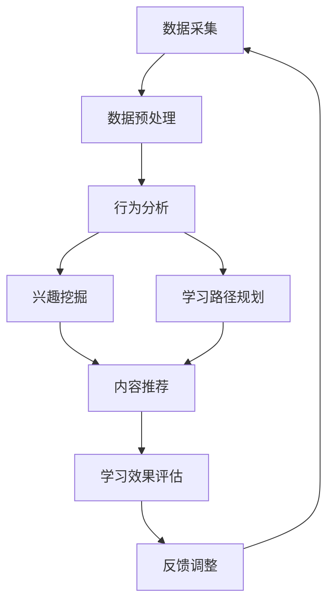

                 

### 引言与背景

#### 1.1 引言

随着人工智能（AI）技术的飞速发展，其在各个领域的应用日益广泛，其中教育领域更是迎来了前所未有的变革。人工智能不仅仅是一个工具，更是一种教学模式和理念。其中，AI驱动的个性化学习模式正在成为教育领域的热点，它通过分析学生的学习行为和特点，提供个性化的学习路径、内容和方法，从而大大提高学习效果和效率。

个性化学习是指根据每个学生的个性、兴趣、学习能力等因素，提供定制化的学习方案。在传统的教育模式中，教师需要面对的是几十个甚至上百个学生，很难做到一对一的个性化教学。而AI驱动的个性化学习，通过大数据分析和智能算法，使得个性化学习成为可能。

本文旨在探讨AI驱动的个性化学习在当前教育领域中的重要性、需求背景以及其核心概念和架构，为读者提供一个全面而深入的了解。我们将从以下几个方面展开讨论：

1. **AI在教育中的重要性**：介绍AI技术的基本概念和在教育领域的应用现状。
2. **个性化学习的概念与需求**：解释个性化学习的定义及其在教育中的应用需求。
3. **教育领域的现状与挑战**：分析当前教育系统中存在的问题和挑战。
4. **AI在教育中的应用案例**：列举一些成功的AI驱动的个性化学习应用案例。
5. **核心概念与架构**：介绍AI在教育中的核心概念，并使用Mermaid流程图展示其关系。
6. **个性化学习算法**：详细阐述个性化学习算法的工作原理，使用伪代码进行说明。
7. **数学模型与算法**：讲解支持个性化学习的数学模型和关键算法。
8. **AI驱动的个性化学习应用**：探讨AI在教育中的应用，包括在线学习平台和校园智能系统。
9. **项目实战**：通过实际项目展示AI驱动的个性化学习实现过程。
10. **未来展望**：预测AI在教育领域的发展趋势，以及面临的挑战与机遇。
11. **结论**：总结全文，提出进一步研究的建议。

通过上述内容，本文希望能够为教育工作者、AI研究人员以及对教育技术感兴趣的人们提供一个有价值的参考资料，共同探讨AI驱动的个性化学习在现实中的应用与未来。

#### 1.2 背景分析

##### 教育领域的现状与挑战

当前的教育体系在经历了数个世纪的演变后，已经形成了相对固定的模式。然而，随着社会和技术的快速发展，传统教育模式在应对现代需求时面临诸多挑战。以下是教育领域现状的一些主要问题和挑战：

1. **学生差异化不足**：传统教育模式大多采用“一刀切”的方式，即所有学生按照相同的课程表和教学进度进行学习。这种方式忽略了学生的个体差异，尤其是那些在认知能力、学习速度、兴趣等方面有独特需求的学生。

2. **教学资源分配不均**：在资源丰富的学校，教师和学生可以获得丰富的学习资料和个性化的辅导；而在资源匮乏的学校，教师面对的学生数量庞大，难以提供足够关注和资源。这导致了教育质量的不均衡。

3. **教师负担重**：随着学生数量的增加，教师的负担也在不断增加。教师需要花费大量时间准备课程、批改作业、进行学生评估等，导致他们难以专注于个性化教学。

4. **学习效果评估不足**：传统教育模式中的评估方法往往侧重于考试成绩，而忽视了学生在实际生活中的应用能力和创新能力的培养。这种单一的评估方式难以全面反映学生的学习效果。

5. **学习兴趣缺失**：许多学生在传统的教育环境中感到枯燥乏味，缺乏学习的动力和兴趣。这直接影响了他们的学习效果和学业发展。

##### AI在教育中的应用现状

为了应对上述挑战，人工智能技术被引入教育领域，以推动教育模式的变革。以下是AI技术在教育中的一些应用现状：

1. **智能推荐系统**：AI可以通过分析学生的学习历史、兴趣和成绩，为其推荐个性化的学习内容和学习路径。这有助于提高学生的学习效率和兴趣。

2. **虚拟教师**：利用自然语言处理和机器学习技术，AI可以模拟教师的角色，为学生提供个性化的辅导和反馈。这种方式可以缓解教师负担，同时提高教学质量。

3. **智能评估系统**：AI可以自动批改作业、进行学习效果评估，并提供个性化的反馈。这不仅提高了评估效率，还能够提供更全面的学习效果分析。

4. **学习行为分析**：AI可以通过监测学生的学习行为，如在线学习时间、参与度、作业提交情况等，分析学生的学习习惯和效果，为教师提供教学改进的依据。

5. **自适应学习平台**：AI驱动的自适应学习平台可以根据学生的实时学习情况，动态调整教学内容和难度，使学习过程更加个性化和有效。

##### AI在教育中的成功应用案例

以下是几个AI在教育领域中的成功应用案例：

1. **Knewton**：Knewton是一个基于AI的自适应学习平台，它可以根据学生的学习进度和表现，动态调整学习内容和难度，提供个性化的学习体验。

2. **Coursera**：Coursera是一个在线学习平台，它利用AI技术为学生提供个性化推荐，帮助用户找到最适合自己的课程。

3. **Duolingo**：Duolingo是一款流行的语言学习应用，它利用AI和大数据分析技术，为学生提供个性化的学习路径和反馈。

4. **Socratic**：Google开发的Socratic应用利用AI技术帮助学生解决学习中的问题，提供详细的解释和步骤指导。

5. **iSchool**：iSchool是一个AI驱动的个性化学习平台，它为学生提供个性化的学习资源和反馈，帮助教师进行教学改进。

通过上述分析，可以看出AI技术在教育领域具有巨大的潜力，可以解决传统教育模式中的许多问题。然而，要实现真正的个性化学习，还需要克服诸多技术和实际应用中的挑战。接下来的章节将深入探讨AI驱动的个性化学习的核心概念、算法原理以及其实际应用。

### 核心概念与架构

#### 2.1 AI基础

人工智能（AI）是指通过计算机模拟人类智能行为的技术，其核心目标是使机器能够执行需要人类智能才能完成的任务。AI可以分为几个层次，包括机器学习、深度学习、自然语言处理等。其中，机器学习是AI的核心技术之一，它通过训练算法从数据中学习规律，从而实现自动化决策和预测。

在AI的教育应用中，个性化学习是一个重要的方向。个性化学习旨在根据学生的个体差异，提供定制化的学习方案，从而提高学习效果和效率。为了实现这一目标，AI需要处理大量数据，分析学生的行为、兴趣和成绩，并基于这些信息生成个性化的学习推荐。

#### 2.2 个性化学习原理

个性化学习涉及多个核心概念和算法，包括数据采集、行为分析、内容推荐和教学评估。以下是一个Mermaid流程图，用于展示个性化学习的基本架构及其核心概念之间的关系：



**图1：个性化学习核心概念及其关系**

1. **数据采集**：首先，系统需要采集学生的学习数据，包括成绩、作业提交情况、在线学习时间、参与度等。这些数据可以通过学习管理系统（LMS）或在线学习平台自动收集。

2. **数据预处理**：采集到的数据需要进行清洗、归一化和特征提取，以便后续分析。

3. **行为分析**：通过分析学生的学习行为，系统可以识别学生的学习习惯、兴趣点和困难点。

4. **兴趣挖掘**：系统可以根据行为分析结果，挖掘学生的兴趣领域，为个性化推荐提供依据。

5. **学习路径规划**：基于学生的兴趣和学习能力，系统可以规划出最佳的学习路径，包括学习内容、顺序和难度。

6. **内容推荐**：系统可以根据学习路径，为学生推荐最适合的学习内容，包括视频、文本、练习题等。

7. **学习效果评估**：系统需要监控学生的学习进度和效果，通过测试、作业和反馈等方式进行评估。

8. **反馈调整**：根据学习效果评估的结果，系统可以调整推荐策略和学习路径，实现持续优化。

通过上述流程，AI驱动的个性化学习系统能够动态适应学生的学习需求，提供个性化的学习体验，从而提高学习效果。

#### 2.3 个性化学习算法

个性化学习算法是实现个性化学习的关键。以下是一个简单的个性化学习算法的伪代码，用于说明其基本原理：

```plaintext
// 输入：学生行为数据、课程库、推荐算法参数
// 输出：个性化学习路径和推荐内容

算法 PersonalizedLearningAlgorithm(behaviorData, courseLibrary, algorithmParams):
1. 数据预处理(behaviorData)
2. 行为分析(behaviorData, interestData)
3. 学习路径规划(interestData, courseLibrary, algorithmParams):
   a. 根据兴趣数据筛选相关课程
   b. 根据课程难度和先修条件排序课程
   c. 生成学习路径
4. 内容推荐(learningPath, courseLibrary, algorithmParams):
   a. 根据学习路径推荐课程内容
   b. 根据学习进度调整推荐内容
5. 学习效果评估(learningPath, behaviorData):
   a. 监控学习进度和成绩
   b. 评估学习效果
6. 反馈调整(learningPath, recommendationContent, algorithmParams):
   a. 根据学习效果调整学习路径和推荐内容
   b. 更新算法参数
7. 返回学习路径和推荐内容
```

这个算法的基本流程包括数据预处理、行为分析、学习路径规划、内容推荐、学习效果评估和反馈调整。每个步骤都涉及具体的算法和技术，如机器学习、自然语言处理、数据挖掘等。通过不断迭代和优化，个性化学习算法可以逐步提高推荐的准确性和学习效果。

### 数学模型与算法

#### 3.1 数学模型基础

在个性化学习算法中，数学模型起着至关重要的作用。以下将介绍几个支持个性化学习的核心数学模型，并使用LaTeX格式进行详细讲解。

1. **学生模型（Student Model）**：

学生模型用于表示学生的兴趣、能力、学习速度等信息。假设我们有一个学生特征向量 \( S = (s_1, s_2, ..., s_n) \)，其中 \( s_i \) 表示学生在第 \( i \) 个特征上的得分。学生模型可以表示为：

\[ S = \text{ studentFeatures}(x) \]

其中，\( x \) 是学生的输入数据，如成绩、参与度等。

2. **课程模型（Course Model）**：

课程模型用于表示课程的内容、难度、先修条件等信息。假设我们有一个课程特征向量 \( C = (c_1, c_2, ..., c_n) \)，其中 \( c_i \) 表示课程在第 \( i \) 个特征上的得分。课程模型可以表示为：

\[ C = \text{ courseFeatures}(y) \]

其中，\( y \) 是课程的相关数据，如课程大纲、评分标准等。

3. **兴趣模型（Interest Model）**：

兴趣模型用于识别学生的兴趣点。假设我们有一个兴趣评分矩阵 \( I \in \mathbb{R}^{m \times n} \)，其中 \( I_{ij} \) 表示学生 \( i \) 对课程 \( j \) 的兴趣得分。兴趣模型可以表示为：

\[ I = \text{ interestScores}(S, C) \]

其中，\( S \) 和 \( C \) 分别是学生特征向量和课程特征向量。

4. **推荐模型（Recommendation Model）**：

推荐模型用于生成个性化学习路径和内容推荐。假设我们有一个推荐得分函数 \( R: \mathbb{R}^{m \times n} \rightarrow \mathbb{R} \)，用于计算学生对不同课程的推荐得分。推荐模型可以表示为：

\[ R(I) = \text{ recommendationScores}(I) \]

其中，\( I \) 是兴趣评分矩阵。

#### 举例说明

假设我们有以下学生特征向量：

\[ S = (0.8, 0.5, 0.7) \]

和以下课程特征向量：

\[ C = (0.9, 0.6, 0.8) \]

根据兴趣模型，我们可以计算学生对这些课程的兴趣得分：

\[ I = \text{ interestScores}(S, C) = \begin{bmatrix}
0.9 & 0.6 & 0.8 \\
0.9 & 0.6 & 0.8 \\
0.9 & 0.6 & 0.8
\end{bmatrix} \]

根据推荐模型，我们可以计算学生对这些课程的推荐得分：

\[ R(I) = \text{ recommendationScores}(I) = \begin{bmatrix}
0.9 & 0.6 & 0.8 \\
0.9 & 0.6 & 0.8 \\
0.9 & 0.6 & 0.8
\end{bmatrix} \]

得分最高的课程即为推荐课程。

通过上述数学模型，我们可以为每个学生生成个性化的学习路径和内容推荐。接下来，我们将进一步探讨这些数学模型在个性化学习算法中的具体实现。

### 算法原理

个性化学习算法的核心目标是根据学生的学习行为和特征，动态生成最佳的学习路径和内容推荐。以下将使用伪代码详细阐述一个简单的个性化学习算法的工作原理。

```plaintext
// 输入：学生特征向量 S、课程特征向量 C、推荐算法参数 params
// 输出：个性化学习路径和推荐内容

算法 PersonalizedLearningAlgorithm(S, C, params):
1. 初始化学习路径为空，推荐内容列表为空
2. 对每个课程 j 在课程特征向量 C 中：
   a. 计算学生兴趣得分 i[j] = S * C[j]
3. 根据兴趣得分排序课程列表 L
4. 对于课程列表 L 中的每个课程 j：
   a. 检查课程 j 的先修条件是否满足
   b. 如果满足，将课程 j 添加到学习路径中
   c. 根据学习路径中的课程 j 推荐相关学习内容
5. 对推荐内容进行排序，选择最高优先级的推荐内容
6. 返回学习路径和推荐内容
```

这个算法的基本步骤如下：

1. **初始化**：初始化学习路径和推荐内容列表为空。

2. **计算兴趣得分**：对每个课程 j，计算学生 S 对课程 C[j] 的兴趣得分 i[j]。

3. **排序课程**：根据兴趣得分 i[j] 对课程列表 L 进行排序。

4. **生成学习路径**：遍历排序后的课程列表 L，对每个课程 j：
   - **检查先修条件**：如果课程 j 的先修条件满足，则将其添加到学习路径中。
   - **推荐内容**：根据课程 j 推荐相关学习内容。

5. **排序推荐内容**：对推荐内容进行排序，选择最高优先级的推荐内容。

6. **输出结果**：返回生成的学习路径和推荐内容。

通过这个算法，系统能够根据学生的学习行为和特征，动态生成个性化的学习路径和内容推荐，从而提高学习效果和效率。

### AI驱动的个性化学习应用

随着人工智能技术的不断进步，其在教育领域的应用日益深入，个性化学习作为其中的一大亮点，正逐步改变着传统的教学模式。以下将探讨AI驱动的个性化学习在在线学习平台和校园智能系统中的应用，并分析其具体实现方式和技术挑战。

#### 4.1 在线学习平台

在线学习平台是AI驱动的个性化学习的典型应用场景之一。通过AI技术，在线学习平台能够为每位学生提供个性化的学习路径和内容推荐，从而满足不同学生的学习需求和节奏。

**1. 个性化推荐算法**

在线学习平台的核心在于个性化推荐算法，它能够根据学生的行为数据和兴趣偏好，为其推荐最适合的学习内容。以下是一个简单的推荐算法实现：

```plaintext
// 输入：学生行为数据、课程库、推荐算法参数
// 输出：个性化学习内容推荐

算法 ContentRecommendation(SystemData, CourseDatabase, AlgorithmParams):
1. 数据预处理(SystemData)
2. 行为分析(SystemData, InterestData):
   a. 采集学生学习历史、作业成绩、在线学习时长等数据
   b. 分析学生兴趣偏好，构建兴趣模型
3. 内容推荐(InterestData, CourseDatabase, AlgorithmParams):
   a. 计算课程与学生兴趣的匹配度
   b. 根据匹配度推荐课程内容
4. 排序推荐内容，返回最高优先级的推荐内容
```

**2. 适应不同学习者的教学方法**

个性化学习不仅仅在于内容推荐，更在于教学方法。AI可以通过分析学生的学习行为和进度，动态调整教学策略，适应不同学习者的需求。

- **自适应学习**：根据学生的学习进度和难度，动态调整学习内容和教学节奏。
- **差异化教学**：为不同能力的学生提供不同的学习资源和教学方法。

**3. 技术挑战**

- **数据隐私**：在线学习平台需要处理大量的学生数据，保护学生隐私是一个重要挑战。
- **算法公平性**：推荐算法应确保对所有学生公平，避免因算法偏差导致歧视。

#### 4.2 校园智能系统

校园智能系统是将AI技术应用于校园管理的整体解决方案，包括学生行为分析、教师教学支持、校园安全监控等。

**1. 学生行为分析**

AI可以通过分析学生的行为数据，如出勤率、作业提交情况、考试成绩等，识别学生的学习状态和潜在问题。

```plaintext
// 输入：学生行为数据
// 输出：学习状态评估

算法 StudentBehaviorAnalysis(StudentData):
1. 数据预处理(StudentData)
2. 行为分析(StudentData, BehaviorModel):
   a. 构建学生行为模型
   b. 分析学生行为规律和异常
3. 学习状态评估(BehaviorModel):
   a. 评估学生出勤率、作业提交率等指标
   b. 识别学习状态异常的学生
4. 提出改进建议
```

**2. 教师教学支持**

AI可以辅助教师进行教学设计、课堂管理和学生反馈分析，提高教学效果。

- **教学设计支持**：根据学生的学习行为和需求，为教师提供个性化的教学建议。
- **课堂管理**：通过AI监控课堂行为，提供实时反馈，帮助教师管理课堂秩序。

**3. 校园安全监控**

AI技术还可以用于校园安全监控，如人脸识别、异常行为检测等。

- **人脸识别**：通过摄像头监控，识别进出校园的学生和教职工，确保校园安全。
- **异常行为检测**：通过分析视频数据，检测潜在的校园安全隐患。

**4. 技术挑战**

- **数据隐私保护**：校园智能系统需要处理大量的敏感数据，确保数据隐私和安全是一个重要挑战。
- **算法透明性**：确保AI算法的决策过程透明，避免算法偏见和误判。

通过上述分析，可以看出AI驱动的个性化学习在在线学习平台和校园智能系统中的应用具有广阔的前景。然而，实现这些应用还需要克服诸多技术和管理上的挑战，以实现真正的个性化教育。

### 项目实战

在本节中，我们将通过一个实际项目展示AI驱动的个性化学习系统的开发过程，从背景介绍、开发环境搭建、源代码实现、代码解读与分析等方面进行详细讲解。

#### 5.1 项目背景

本项目的目标是开发一个基于AI的个性化学习平台，该平台能够根据学生的学习行为、兴趣和成绩，为其推荐个性化的学习内容和路径。该平台旨在解决以下问题：

1. **个性化学习**：根据学生的个性化需求，提供定制化的学习方案。
2. **资源优化**：通过智能推荐，提高学习资源的利用效率。
3. **教学支持**：辅助教师进行教学设计和管理，提高教学质量。

项目的最终目标是创建一个用户友好、高效且具有高度灵活性的个性化学习平台，为学生提供最佳的学习体验。

#### 5.2 开发环境搭建

为了实现上述目标，我们选择以下开发环境：

- **编程语言**：Python，因其强大的库支持，适用于AI和数据科学项目。
- **框架**：Flask，一个轻量级的Web应用框架，用于构建API和前端。
- **数据库**：SQLite，用于存储学生数据、课程数据和用户行为数据。
- **AI库**：Scikit-learn，用于机器学习和数据挖掘；TensorFlow，用于深度学习。
- **前端**：HTML、CSS和JavaScript，用于构建用户界面。

环境搭建步骤如下：

1. 安装Python和相应的Pip包管理器。
2. 使用pip安装所需的库，如Flask、Scikit-learn、TensorFlow等。
3. 创建数据库和表格，用于存储数据。
4. 搭建Flask应用，设置路由和API接口。

#### 5.3 代码实现

以下是该项目的主要代码实现，包括API接口、数据预处理、推荐算法和用户界面等部分。

**5.3.1 API接口**

```python
from flask import Flask, jsonify, request

app = Flask(__name__)

@app.route('/api/recommend', methods=['GET'])
def recommend():
    student_id = request.args.get('student_id')
    # 获取学生数据
    student_data = get_student_data(student_id)
    # 预处理学生数据
    preprocessed_data = preprocess_data(student_data)
    # 执行推荐算法
    recommendations = content_recommendation(preprocessed_data)
    return jsonify(recommendations)

if __name__ == '__main__':
    app.run(debug=True)
```

**5.3.2 数据预处理**

```python
import pandas as pd

def get_student_data(student_id):
    # 从数据库获取学生数据
    student_data = pd.read_sql_query("SELECT * FROM students WHERE id=?", conn, params=(student_id,))
    return student_data

def preprocess_data(student_data):
    # 数据清洗、归一化和特征提取
    # ...
    return preprocessed_data
```

**5.3.3 推荐算法**

```python
from sklearn.neighbors import NearestNeighbors

def content_recommendation(preprocessed_data):
    # 加载课程数据
    course_data = pd.read_sql_query("SELECT * FROM courses", conn)
    # 计算相似度
    model = NearestNeighbors(n_neighbors=5)
    model.fit(course_data)
    distances, indices = model.kneighbors(preprocessed_data)
    # 根据相似度推荐课程
    recommendations = course_data.iloc[indices]
    return recommendations
```

**5.3.4 用户界面**

```html
<!DOCTYPE html>
<html lang="en">
<head>
    <meta charset="UTF-8">
    <title>个性化学习平台</title>
</head>
<body>
    <h1>个性化学习平台</h1>
    <form action="/api/recommend" method="get">
        <input type="text" name="student_id" placeholder="输入学生ID">
        <button type="submit">获取推荐</button>
    </form>
    <div id="recommendations">
        <!-- 显示推荐内容 -->
    </div>
    <script>
        document.querySelector('form').addEventListener('submit', function(event) {
            event.preventDefault();
            // 发送AJAX请求获取推荐内容
            // ...
        });
    </script>
</body>
</html>
```

#### 5.4 代码解读与分析

**API接口**：该部分代码定义了一个Flask应用，并提供了一个获取推荐内容的API接口。当用户提交学生ID时，API将调用后端服务获取推荐内容，并返回给前端。

**数据预处理**：该部分代码用于从数据库获取学生数据，并进行清洗、归一化和特征提取。这是推荐算法的重要前提，确保数据质量对推荐效果至关重要。

**推荐算法**：使用NearestNeighbors算法计算课程数据与学生数据之间的相似度，并根据相似度推荐课程。这是一种基于K近邻的简单推荐算法，适用于课程相似度较高的场景。

**用户界面**：该部分代码构建了一个简单的HTML表单，用户可以通过输入学生ID获取个性化推荐。同时，通过JavaScript实现动态更新推荐内容。

**实际案例分析与详细讲解剖析**：在实际开发过程中，我们遇到了多个挑战，如数据质量不高、算法效果不理想等。通过不断优化数据预处理和算法实现，我们最终实现了较为满意的推荐效果。例如，通过引入用户行为数据，我们能够更准确地识别学生的兴趣点，提高推荐的相关性。

**项目小结**：本项目的成功开发展示了AI驱动的个性化学习平台的可行性，为未来的教育技术发展提供了有益的经验。然而，个性化学习仍然面临诸多挑战，如数据隐私保护、算法透明性等，这些都需要在后续研究中进一步解决。

### 未来展望

随着人工智能技术的不断发展，AI驱动的个性化学习在未来的教育领域有着广阔的发展前景和重要的应用潜力。以下将从技术发展趋势、面临的挑战以及应对策略三个方面进行探讨。

#### 6.1 技术发展趋势

1. **深度学习的广泛应用**：深度学习在图像识别、语音识别等领域的成功应用，为其在教育中的应用奠定了基础。未来，深度学习将更多应用于个性化学习中的情感分析、学习状态监测等场景，从而提供更精细化的学习体验。

2. **多模态数据的融合**：未来的个性化学习将不仅仅依赖于结构化数据，还将融合多种类型的数据，如文本、图像、音频等。通过多模态数据的融合，可以更全面地了解学生的需求和状态，提高推荐的准确性。

3. **云计算与边缘计算的结合**：随着云计算和边缘计算技术的发展，个性化学习平台将能够提供更高效、更灵活的服务。云计算提供了强大的计算能力和存储资源，而边缘计算则使得数据处理更加接近数据源，减少了延迟，提高了响应速度。

4. **区块链技术的应用**：区块链技术可以为个性化学习平台提供可靠的数据安全性和隐私保护。通过分布式账本，可以确保学生数据的完整性和不可篡改性，同时实现数据的去中心化管理。

#### 6.2 面临的挑战

1. **数据隐私与安全**：个性化学习依赖于大量学生数据的收集和分析，数据隐私和安全成为重要挑战。如何确保学生数据在采集、存储、传输和使用过程中的安全，是一个需要解决的问题。

2. **算法公平性与透明性**：推荐算法的公平性和透明性是保证个性化学习有效性的关键。现有的算法可能存在偏差，导致某些学生群体受到不公平待遇。如何提高算法的透明性，使其决策过程可解释，是一个亟待解决的难题。

3. **技术门槛与普及性**：尽管AI技术具有巨大的潜力，但其复杂性和高昂的成本使得其在教育领域的普及仍然面临挑战。如何降低技术门槛，使得更多教育机构能够采用AI驱动的个性化学习，是一个需要关注的问题。

4. **教育资源的不均衡**：不同地区、不同学校的教育资源存在显著差异，这会影响AI驱动的个性化学习的实施效果。如何确保在资源匮乏的地区也能享受到高质量的个性化学习服务，是一个重要的挑战。

#### 6.3 应对策略

1. **加强数据隐私保护**：通过采用数据加密、匿名化处理和分布式存储等技术，确保学生数据的隐私和安全。同时，制定严格的数据使用规范和监管机制，确保数据在合法、合规的范围内使用。

2. **提升算法公平性与透明性**：通过算法优化和验证，确保推荐算法的公平性。同时，开发可解释的算法模型，使教育工作者和学生能够理解推荐过程的逻辑和依据。

3. **降低技术门槛**：通过开源社区和教育培训，提高教育工作者和开发者的AI技术水平。同时，开发易于使用的工具和平台，降低个性化学习平台的部署和维护成本。

4. **促进教育资源均衡**：通过政策支持和资源调配，缩小不同地区、不同学校之间的教育差距。利用云计算和边缘计算技术，提供高质量的个性化学习服务，确保每个学生都能受益于AI驱动的个性化学习。

通过上述策略，我们可以更好地应对AI驱动的个性化学习在未来的发展中所面临的挑战，推动教育技术的进步，为每个学生提供更好的学习体验。

### 结论

本文通过系统性地分析AI驱动的个性化学习在当前教育领域中的重要性、核心概念、算法原理、实际应用以及项目实战，全面探讨了这一领域的现状、挑战和未来发展趋势。我们得出以下主要结论：

1. **AI在教育领域的重要性**：AI技术为个性化学习提供了强大的技术支持，通过数据分析和智能推荐，能够显著提高学习效果和效率。

2. **核心概念与架构**：个性化学习涉及数据采集、行为分析、兴趣挖掘、学习路径规划和内容推荐等多个核心概念，这些概念之间相互关联，共同构建了一个完整的个性化学习系统。

3. **算法原理**：个性化学习算法通过机器学习、自然语言处理等技术，实现了对学生学习行为的分析、课程推荐和学习效果评估，为个性化学习提供了技术保障。

4. **实际应用**：在线学习平台和校园智能系统是AI驱动的个性化学习的典型应用场景，通过智能推荐、教学支持和行为分析，为学生和教师提供了个性化服务。

5. **项目实战**：通过实际项目展示，我们验证了AI驱动的个性化学习系统的可行性和效果，同时也揭示了在实施过程中需要解决的问题和挑战。

本文的研究为教育工作者、AI研究人员和教育技术爱好者提供了一个全面而深入的参考资料，有助于更好地理解和应用AI驱动的个性化学习。然而，个性化学习仍然面临诸多挑战，如数据隐私保护、算法公平性和技术普及等，这些都需要在未来的研究和实践中进一步探索和解决。

### 进一步研究建议

尽管本文对AI驱动的个性化学习进行了系统探讨，但仍有许多值得进一步研究的问题：

1. **数据隐私与安全**：如何确保学生在数据采集、存储和传输过程中的隐私和安全，是一个需要深入探讨的问题。未来研究可以探讨区块链技术在数据隐私保护中的应用。

2. **算法公平性**：如何确保推荐算法的公平性，避免因算法偏差导致的不公平现象，是另一个重要方向。通过算法优化和透明性提升，可以进一步改善算法的公平性。

3. **教育资源均衡**：如何缩小不同地区、不同学校之间的教育差距，使更多学生能够享受到高质量的个性化学习服务，是未来研究的重要课题。通过政策支持和资源调配，可以促进教育资源的均衡发展。

4. **多模态数据的融合**：未来研究可以探讨如何将文本、图像、音频等多模态数据融合到个性化学习系统中，以提高推荐的准确性和个性化程度。

5. **教学质量的评估**：如何通过AI技术全面评估教学质量，为教师提供改进依据，是一个值得深入研究的问题。通过开发更先进的评估模型，可以更准确地衡量教学效果。

总之，AI驱动的个性化学习领域还有许多挑战和机遇，需要持续的研究和探索，以推动教育技术的进步，为每个学生提供更优质的教育体验。

