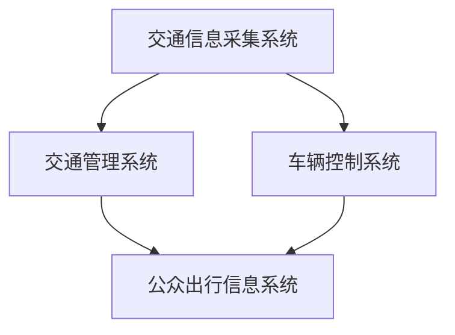

                 

### 《AI驱动的智能交通系统：缓解城市拥堵的新方案》

## 关键词
- AI驱动的智能交通系统
- 城市交通拥堵
- 交通流量预测
- 自动驾驶
- 交通信号优化

## 摘要
本文深入探讨了AI驱动的智能交通系统（ITS）在缓解城市交通拥堵中的应用。首先，我们介绍了智能交通系统的基本概念、发展历程和主要目标。随后，详细解析了AI技术在交通领域的各种应用，包括机器学习在交通流量预测中的运用、深度学习在图像识别和目标检测中的作用、自然语言处理在交通信号优化中的应用，以及强化学习在自动驾驶和路径规划中的贡献。接着，我们剖析了交通流量预测与交通信号优化、图像识别与目标检测、自然语言处理与交通信号优化、自动驾驶与路径规划的核心技术与原理。文章还通过具体的项目实战，展示了如何开发一个AI驱动的智能交通系统，并对未来的发展趋势进行了展望。最后，我们提供了一些相关的开发工具和资源，以供读者进一步学习和实践。

### 第1章：智能交通系统（ITS）基础

#### 1.1 智能交通系统的定义与发展

智能交通系统（Intelligent Transportation System，简称ITS）是集成了多种先进技术和设备的交通管理系统，旨在提高交通效率、改善交通安全和减少环境污染。ITS的概念起源于20世纪70年代的美国，其核心思想是利用信息技术和通信技术来实现交通的智能管理和控制。

#### 1.1.1 智能交通系统的定义

ITS是由多个子系统组成的综合性系统，包括但不限于以下几个主要部分：

- **交通信息采集系统**：通过传感器、摄像头、无线通信等设备，实时收集交通数据。
- **交通管理系统**：利用收集到的交通信息，进行交通流量分析、交通信号控制和路线规划等。
- **车辆控制系统**：通过车载设备，实现车辆的智能驾驶、远程控制和故障诊断等功能。
- **公众出行信息系统**：为公众提供实时交通信息、路线规划和出行建议等服务。

#### 1.1.2 智能交通系统的发展历程

智能交通系统的发展经历了几个重要阶段：

- **第一阶段（20世纪70年代至80年代）**：以交通信号控制和电子收费系统为主要内容。
- **第二阶段（20世纪90年代）**：引入了车载信息系统和车辆监控系统。
- **第三阶段（21世纪以来）**：随着互联网、物联网和人工智能技术的发展，智能交通系统开始迈向更加智能化和自主化的阶段。

#### 1.1.3 智能交通系统的主要目标

智能交通系统的主要目标包括：

- **提高交通效率**：通过实时交通信息传输和智能交通管理，优化交通流量，减少拥堵。
- **提升交通安全**：通过实时监测和预警，降低交通事故发生率。
- **减少能源消耗**：通过智能调度和路线规划，减少交通能源消耗。
- **改善空气质量**：通过减少车辆排放，改善城市空气质量。

#### 1.2 智能交通系统的组成部分

智能交通系统主要由以下几个部分组成：

- **交通信息采集系统**：包括交通流量监测传感器、摄像头、车载通信设备等。
- **交通管理系统**：包括交通信号控制、交通流量预测、路线规划等功能模块。
- **车辆控制系统**：包括自动驾驶、远程控制、故障诊断等车载智能系统。
- **公众出行信息系统**：为公众提供交通信息查询、路线规划、出行建议等服务。

**图1.1 智能交通系统组成部分架构图**

#### 1.3 AI在智能交通系统中的应用前景

随着人工智能技术的快速发展，AI在智能交通系统中的应用前景越来越广阔。以下是AI在智能交通系统中的几个潜在应用领域：

- **交通流量预测**：通过大数据分析和机器学习算法，预测未来的交通流量，为交通管理和信号控制提供依据。
- **自动驾驶**：利用深度学习和强化学习，实现车辆的自主驾驶，减少人为驾驶错误，提高交通安全。
- **交通信号优化**：通过自然语言处理和优化算法，实现交通信号的智能化控制，提高交通效率。
- **交通违规监控**：利用计算机视觉和目标检测技术，实时监控交通违规行为，提升交通安全。

在未来，随着技术的不断进步，AI在智能交通系统中的应用将更加深入和广泛，为解决城市交通拥堵、提升交通服务质量提供强有力的技术支持。

### **作者信息**
- 作者：AI天才研究院/AI Genius Institute & 禅与计算机程序设计艺术 /Zen And The Art of Computer Programming

---

接下来的章节将详细探讨AI技术在交通领域的具体应用，包括机器学习、深度学习、自然语言处理和强化学习等。我们还将通过具体案例，展示这些技术在交通流量预测、自动驾驶和交通信号优化中的实际应用。请读者继续关注下一章节的内容。

