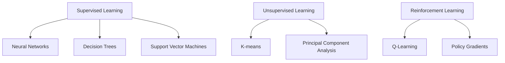
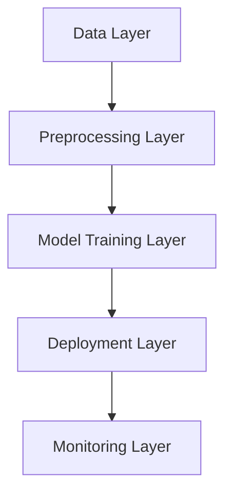
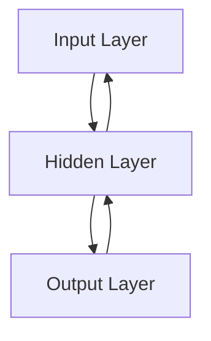
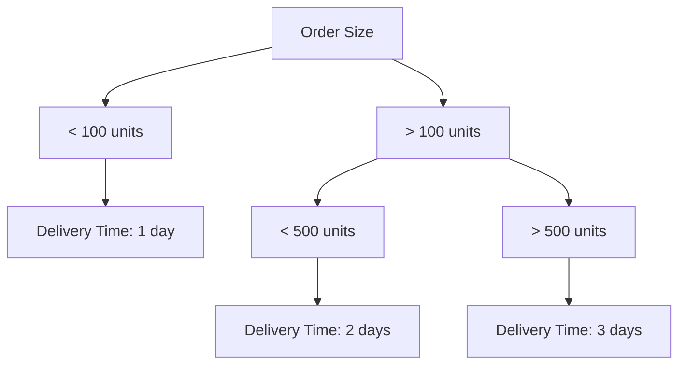
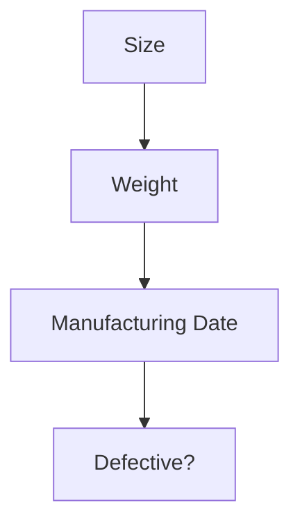

                 

## AI-driven Smart Warehouse: New Methods for Optimizing Supply Chain Management

### Keywords: AI-driven Warehousing, Supply Chain Optimization, Machine Learning, Robotics, Autonomous Systems, Warehouse Management Systems

### Abstract:
The advent of AI-driven smart warehouses is revolutionizing supply chain management by introducing advanced methods to optimize operations. This article explores the evolution of warehouse management systems, the role of AI in supply chain optimization, and the emerging technologies shaping the future of warehousing. We delve into the fundamental concepts of AI and machine learning, discuss the architecture of AI-driven smart warehouse systems, and provide a detailed analysis of core algorithms and their implementation. The article also includes a section on practical projects, highlighting the importance of best practices and future directions in AI-driven smart warehousing.

### Introduction to AI-driven Smart Warehouse Systems

In recent years, the integration of artificial intelligence (AI) into warehouse management systems has led to the emergence of AI-driven smart warehouses. These smart warehouses leverage advanced AI technologies, such as machine learning, robotics, and autonomous systems, to optimize various aspects of supply chain management. This section provides an overview of AI-driven smart warehouses, their role in supply chain optimization, and the current trends and future directions in this field.

#### The Evolution of Warehouse Management Systems

Warehouse management systems (WMS) have evolved significantly over the years. Traditional WMS were primarily focused on manual processes, requiring extensive manual labor for tasks such as inventory management, order fulfillment, and transportation logistics. These systems were often limited in their ability to adapt to changing conditions and optimize warehouse operations efficiently.

With the advent of AI and machine learning, the landscape of warehouse management has transformed. AI-driven smart warehouses incorporate advanced algorithms and technologies to automate various processes, reduce operational costs, and improve overall efficiency. Some key features of AI-driven smart warehouses include real-time inventory tracking, automated order fulfillment, predictive maintenance, and optimized route planning.

##### Traditional Warehouse Management vs. AI-driven Smart Warehousing

Traditional warehouse management systems relied on manual data entry, paper-based records, and basic software tools to manage operations. This approach often resulted in delays, errors, and inefficiencies. For example, inventory management in traditional warehouses required regular physical counts, leading to disruptions in operations and increased labor costs.

In contrast, AI-driven smart warehouses leverage advanced technologies to automate these tasks. AI algorithms analyze large volumes of data in real-time, providing accurate and up-to-date information on inventory levels, order status, and warehouse operations. This enables faster decision-making, reduced errors, and improved overall efficiency.

##### Key Characteristics of AI-driven Smart Warehouses

The key characteristics of AI-driven smart warehouses include:

1. **Real-time Data Analysis:** AI algorithms process large volumes of data in real-time, providing accurate and timely insights into warehouse operations.
2. **Automated Processes:** AI-driven systems automate various warehouse tasks, such as inventory management, order fulfillment, and route planning, reducing the need for manual labor and human error.
3. **Predictive Maintenance:** AI algorithms can predict equipment failures, enabling proactive maintenance and reducing downtime.
4. **Optimized Resource Allocation:** AI-driven systems optimize resource allocation, such as labor and equipment, to minimize costs and maximize efficiency.
5. **Scalability:** AI-driven smart warehouses can easily scale to accommodate growing business needs and changing market conditions.

##### Core Benefits of Implementing AI-driven Systems

Implementing AI-driven smart warehouse systems offers several core benefits, including:

1. **Cost Savings:** AI-driven systems reduce labor costs and operational expenses by automating tasks and optimizing resource allocation.
2. **Increased Efficiency:** By automating processes and providing real-time data analysis, AI-driven systems improve overall warehouse efficiency and reduce delivery times.
3. **Improved Accuracy:** AI algorithms minimize errors in inventory management, order fulfillment, and route planning, resulting in higher customer satisfaction.
4. **Scalability:** AI-driven smart warehouses can easily adapt to changing business needs and market conditions, enabling businesses to scale operations effectively.
5. **Enhanced Customer Experience:** Faster and more accurate order fulfillment, coupled with real-time tracking and delivery updates, enhance the overall customer experience.

#### Overview of AI in Supply Chain Management

AI technologies have a significant impact on supply chain management by enabling businesses to optimize various aspects of the supply chain, from demand forecasting to transportation logistics. In this section, we will explore the role of AI in supply chain optimization, focusing on key areas such as demand forecasting, inventory management, route optimization, and predictive maintenance.

##### The Role of AI in Supply Chain Optimization

The role of AI in supply chain optimization is multifaceted, encompassing various aspects of the supply chain, including:

1. **Demand Forecasting:** AI algorithms analyze historical data, market trends, and customer behavior to predict future demand for products. This enables businesses to optimize inventory levels, reduce stockouts, and minimize excess inventory.
2. **Inventory Management:** AI-driven systems monitor inventory levels in real-time, providing accurate and up-to-date information on stock levels, order status, and warehouse operations. This helps businesses optimize inventory levels and reduce excess inventory, minimizing costs and improving efficiency.
3. **Route Optimization:** AI algorithms optimize route planning and transportation logistics, minimizing fuel consumption, transportation costs, and delivery times. This results in improved efficiency, reduced costs, and better customer satisfaction.
4. **Predictive Maintenance:** AI-driven systems analyze data from sensors and equipment to predict equipment failures and schedule maintenance proactively. This helps reduce downtime, minimize maintenance costs, and improve overall equipment reliability.
5. **Risk Management:** AI algorithms identify potential risks and vulnerabilities in the supply chain, enabling businesses to take proactive measures to mitigate these risks and ensure continuity of operations.

##### Demand Forecasting and Inventory Management

Demand forecasting and inventory management are critical components of supply chain optimization. AI-driven systems play a crucial role in these areas by providing accurate and timely insights into future demand and optimal inventory levels.

1. **Demand Forecasting:** AI algorithms analyze historical sales data, market trends, and customer behavior to predict future demand for products. This enables businesses to make data-driven decisions regarding production levels, supply chain planning, and inventory management. By accurately forecasting demand, businesses can avoid stockouts and minimize excess inventory, reducing costs and improving efficiency.
2. **Inventory Management:** AI-driven systems continuously monitor inventory levels in real-time, providing accurate and up-to-date information on stock levels, order status, and warehouse operations. This enables businesses to optimize inventory levels, reducing excess inventory and stockouts. AI algorithms also analyze sales data and market trends to predict future inventory needs, enabling businesses to adjust inventory levels proactively.

##### Route Optimization and Transportation Management

Route optimization and transportation management are crucial aspects of supply chain optimization. AI-driven systems can significantly improve transportation efficiency and reduce costs by optimizing route planning and logistics operations.

1. **Route Optimization:** AI algorithms analyze traffic patterns, road conditions, and delivery schedules to determine the most efficient routes for transportation. This minimizes fuel consumption, transportation costs, and delivery times, improving overall efficiency and reducing costs. AI-driven route optimization systems can adapt to real-time changes in traffic and weather conditions, ensuring that delivery schedules are maintained and customer satisfaction is maximized.
2. **Transportation Management:** AI-driven systems provide real-time data on transportation operations, enabling businesses to monitor and manage delivery schedules, track shipments, and ensure timely delivery. AI algorithms can also identify potential delays and disruptions, enabling businesses to take proactive measures to mitigate these issues and ensure continuity of operations.

##### Predictive Maintenance and Asset Management

Predictive maintenance and asset management are critical for ensuring the reliability and efficiency of warehouse operations. AI-driven systems can significantly improve maintenance and asset management by predicting equipment failures and optimizing maintenance schedules.

1. **Predictive Maintenance:** AI algorithms analyze data from sensors and equipment to identify patterns and indicators of potential failures. This enables businesses to schedule maintenance proactively, minimizing downtime, reducing maintenance costs, and improving overall equipment reliability.
2. **Asset Management:** AI-driven systems provide real-time data on the status and performance of assets, enabling businesses to optimize maintenance schedules and ensure optimal asset utilization. By monitoring asset performance and identifying potential issues early, businesses can avoid unexpected downtime and minimize maintenance costs.

### Current Trends and Future Directions in AI-driven Warehousing

The integration of AI technologies into warehouse management systems is rapidly evolving, with new developments and innovations emerging regularly. In this section, we will explore the current trends and future directions in AI-driven warehousing, focusing on emerging technologies and their potential impact on supply chain management.

#### Emerging Technologies in AI-driven Warehousing

Several emerging technologies are shaping the future of AI-driven warehousing, including:

1. **Machine Learning Algorithms:** Advanced machine learning algorithms, such as deep learning and reinforcement learning, are being developed to improve the accuracy and efficiency of warehouse operations. These algorithms can analyze vast amounts of data and identify patterns and trends that traditional algorithms may overlook, enabling businesses to make more informed decisions.
2. **Robotics and Autonomous Systems:** The use of robotics and autonomous systems in warehousing is growing rapidly, with companies investing in automated picking, sorting, and delivery systems. These systems can improve efficiency, reduce labor costs, and enhance overall warehouse operations.
3. **Internet of Things (IoT):** IoT devices and sensors are being used to collect and transmit data from various aspects of warehouse operations. This data can be analyzed using AI algorithms to optimize warehouse processes, improve maintenance schedules, and enhance overall efficiency.
4. **Blockchain Technology:** Blockchain technology is being explored for its potential to improve supply chain transparency and traceability in AI-driven warehouses. By providing a secure and immutable ledger of transactions, blockchain can help ensure the authenticity and integrity of data and transactions in the supply chain.

##### Integration of AI with Existing Warehouse Systems

Integrating AI technologies with existing warehouse systems is a key challenge in the development of AI-driven smart warehouses. In this section, we will explore the challenges and considerations involved in integrating AI technologies with existing systems.

1. **Data Integration:** One of the primary challenges in integrating AI with existing warehouse systems is data integration. AI algorithms require large amounts of high-quality data to train and improve their accuracy. Integrating data from disparate systems and ensuring data quality and consistency is crucial for the success of AI-driven systems.
2. **System Compatibility:** AI-driven systems must be compatible with existing warehouse systems to ensure seamless integration and operation. This requires careful consideration of system architectures, data formats, and communication protocols.
3. **Scalability and Flexibility:** AI-driven systems must be scalable and flexible to accommodate the evolving needs of businesses and changing market conditions. This requires the development of modular and extensible systems that can be easily adapted and updated.
4. **Security and Privacy:** Ensuring the security and privacy of data and systems is critical in the integration of AI with existing warehouse systems. Businesses must implement robust security measures to protect sensitive data and prevent unauthorized access.

### Conclusion

The integration of AI technologies into warehouse management systems is transforming the supply chain management landscape, offering new methods to optimize operations, reduce costs, and improve efficiency. By leveraging advanced AI algorithms, robotics, and autonomous systems, businesses can achieve real-time data analysis, automated processes, predictive maintenance, and optimized resource allocation. However, the successful implementation of AI-driven smart warehouses requires careful planning, data integration, system compatibility, scalability, and security considerations. As AI technologies continue to evolve, the future of AI-driven warehousing holds immense potential for further innovation and improvement in supply chain management.### Fundamental Concepts of AI and Machine Learning

Artificial Intelligence (AI) and Machine Learning (ML) are transformative technologies that are revolutionizing various industries, including supply chain management. To fully understand the applications and potential of AI-driven smart warehouses, it is essential to delve into the fundamental concepts of AI and ML. This section will explore the basic principles of machine learning, including supervised learning, unsupervised learning, and reinforcement learning, and discuss key machine learning algorithms commonly used in AI-driven systems.

#### Basic Principles of Machine Learning

Machine learning is a subset of AI that focuses on the development of algorithms that can learn from and make predictions or decisions based on data. The core principles of machine learning can be broadly categorized into three types: supervised learning, unsupervised learning, and reinforcement learning.

##### Supervised Learning

Supervised learning is a type of machine learning where algorithms are trained on labeled data. The goal is to build a model that can accurately predict the output (label) for new, unseen data based on the patterns learned from the labeled data. The key steps in supervised learning include data collection, model training, and model evaluation.

1. **Data Collection:** The first step in supervised learning is to collect a dataset containing input features and their corresponding labels. The quality and quantity of the data play a crucial role in the performance of the model.
2. **Model Training:** The next step involves training the machine learning model using the collected data. The model is fed input features and their labels to learn the underlying patterns and relationships between the input and output.
3. **Model Evaluation:** After training, the model is evaluated using a separate validation or test dataset to assess its performance. Common evaluation metrics include accuracy, precision, recall, and F1 score.

##### Unsupervised Learning

Unsupervised learning is a type of machine learning where algorithms learn from unlabeled data. The goal is to identify patterns, relationships, or structures within the data without any prior knowledge of the output labels. Unsupervised learning is commonly used for clustering, association, and dimensionality reduction tasks.

1. **Clustering:** Clustering algorithms group data points into clusters based on their similarities. Common clustering algorithms include K-means, hierarchical clustering, and DBSCAN.
2. **Association:** Association algorithms identify relationships or associations between different variables in a dataset. The most well-known association algorithm is Apriori, which is commonly used for market basket analysis.
3. **Dimensionality Reduction:** Dimensionality reduction algorithms reduce the number of features in a dataset while retaining the essential information. Common dimensionality reduction techniques include Principal Component Analysis (PCA) and t-SNE.

##### Reinforcement Learning

Reinforcement learning is a type of machine learning where algorithms learn by interacting with an environment and receiving feedback in the form of rewards or penalties. The goal is to learn an optimal policy that maximizes the cumulative reward over time. Reinforcement learning is commonly used in applications such as robotics, autonomous driving, and game playing.

1. **Agent:** In reinforcement learning, an agent interacts with an environment to achieve a goal. The agent takes actions based on the current state of the environment and receives feedback in the form of rewards or penalties.
2. **State and Action:** A state represents the current situation of the agent, and an action is a decision or step taken by the agent to move from one state to another.
3. **Policy:** A policy is a function that maps states to actions. The goal is to learn an optimal policy that maximizes the cumulative reward over time.
4. **Reward Function:** A reward function defines the reward or penalty received by the agent based on its actions and the resulting state.

#### Key Machine Learning Algorithms

Several key machine learning algorithms are commonly used in AI-driven smart warehouse systems. These algorithms include neural networks, decision trees, support vector machines, and ensemble methods.

##### Neural Networks

Neural networks are a class of machine learning algorithms inspired by the structure and function of the human brain. They consist of layers of interconnected nodes (neurons) that process and transform input data through weighted connections. Neural networks are particularly effective in complex tasks, such as image and speech recognition, natural language processing, and predictive analytics.

1. **Neural Network Architecture:** A neural network typically consists of an input layer, one or more hidden layers, and an output layer. Each layer performs a specific function in the processing of the input data.
2. **Training Process:** Neural networks are trained using a process called backpropagation, which adjusts the weights of the connections between neurons to minimize the difference between the predicted output and the actual output.
3. **Activation Functions:** Activation functions introduce non-linearity into the neural network, allowing it to model complex relationships in the data. Common activation functions include sigmoid, ReLU, and tanh.

##### Decision Trees

Decision trees are a popular machine learning algorithm used for classification and regression tasks. They are built using a flowchart of decisions and their possible consequences, resembling a tree structure. Decision trees make predictions by splitting the data into subsets based on the values of input features.

1. **Tree Construction:** The construction of a decision tree involves recursively splitting the data based on the feature that provides the highest information gain or the lowest impurity measure. Common impurity measures include Gini impurity and information gain.
2. **Pruning:** Decision trees can become overly complex and prone to overfitting. Pruning is a technique used to simplify the tree by removing unnecessary branches and reducing its size.

##### Support Vector Machines

Support Vector Machines (SVM) are a powerful supervised learning algorithm used for classification and regression tasks. SVMs aim to find the optimal hyperplane that separates the data into different classes by maximizing the margin between the classes.

1. **Optimization Problem:** SVMs solve an optimization problem to find the hyperplane that maximizes the margin. The optimization problem involves minimizing the objective function subject to certain constraints.
2. **Kernel Functions:** SVMs can be extended to handle non-linear classification by using kernel functions, which transform the input data into a higher-dimensional space where a linear separation is possible.

##### Ensemble Methods

Ensemble methods combine multiple machine learning algorithms to improve the performance and robustness of the overall model. Common ensemble methods include bagging, boosting, and stacking.

1. **Bagging:** Bagging (Bootstrap Aggregating) involves training multiple models on different subsets of the training data and averaging their predictions. This reduces the variance of the model and improves its generalization ability.
2. **Boosting:** Boosting algorithms, such as AdaBoost and XGBoost, train multiple models sequentially, focusing on correcting the mistakes made by the previous models. This improves the accuracy and robustness of the ensemble model.
3. **Stacking:** Stacking involves training multiple base models on the same dataset and using their predictions as input features for a meta-model. The meta-model combines the predictions of the base models to make the final prediction.

#### Mermaid Flowchart: Machine Learning Algorithm Relationships

Below is a Mermaid flowchart illustrating the relationships between the key machine learning algorithms discussed in this section:



This flowchart shows the connections between supervised learning (Neural Networks, Decision Trees, and Support Vector Machines), unsupervised learning (K-means and Principal Component Analysis), and reinforcement learning (Q-Learning and Policy Gradients). Understanding these relationships is crucial for applying the right algorithms to specific problems in AI-driven smart warehouse systems.

In summary, the fundamental concepts of AI and machine learning provide the foundation for developing AI-driven smart warehouse systems. By understanding the basic principles of supervised learning, unsupervised learning, and reinforcement learning, and familiarizing oneself with key machine learning algorithms, developers can build robust and efficient systems to optimize warehouse operations and supply chain management.### Architecture of AI-driven Smart Warehouse Systems

The architecture of AI-driven smart warehouse systems is a complex and interconnected framework that encompasses various components, including data collection and preprocessing, machine learning model training, and model deployment and monitoring. In this section, we will explore these components in detail, discussing their roles and interactions within the overall system architecture.

#### Data Collection and Preprocessing

Data collection is a crucial step in the development of AI-driven smart warehouse systems. The quality and accuracy of the data directly impact the performance and effectiveness of the AI models. The primary sources of data in an AI-driven warehouse system include:

1. **Sensor Data:** Sensors placed throughout the warehouse collect various types of data, such as temperature, humidity, and light levels. This data helps in monitoring the environment and ensuring optimal conditions for inventory storage.
2. **Equipment Data:** Data from warehouse equipment, such as forklifts, conveyor belts, and robotic systems, provides insights into the performance and maintenance needs of the equipment.
3. **Operational Data:** Operational data includes information about warehouse activities, such as inventory movements, order processing times, and labor allocation.
4. **External Data:** External data sources, such as weather forecasts and traffic data, can be used to predict and optimize transportation logistics and delivery schedules.

**Data Preprocessing:**

Once collected, the raw data must be preprocessed to remove noise, handle missing values, and standardize the data. Key preprocessing steps include:

1. **Data Cleaning:** Removing or correcting errors, inconsistencies, and outliers in the data.
2. **Feature Engineering:** Creating new features from the raw data that may be more useful for the machine learning models.
3. **Normalization/Standardization:** Scaling the data to a common range to ensure that all features contribute equally to the model training process.
4. **Data Reduction:** Reducing the dimensionality of the data using techniques such as Principal Component Analysis (PCA) to improve model training efficiency.

#### Machine Learning Model Training

The next component in the architecture is the machine learning model training process. This involves selecting an appropriate machine learning algorithm, training the model on the preprocessed data, and evaluating its performance. The key steps in model training include:

1. **Algorithm Selection:** Choosing the most suitable machine learning algorithm based on the problem domain and data characteristics. Common algorithms used in AI-driven warehouses include neural networks, decision trees, support vector machines, and ensemble methods.
2. **Model Training:** Training the selected algorithm on the preprocessed data using a process called supervised learning, where the algorithm learns from labeled data to make predictions. The training process involves feeding the input features and their corresponding labels to the algorithm and adjusting the model parameters to minimize the prediction error.
3. **Model Evaluation:** Evaluating the trained model's performance using a separate validation or test dataset. Common evaluation metrics for classification tasks include accuracy, precision, recall, and F1 score. For regression tasks, metrics such as mean squared error (MSE) and root mean squared error (RMSE) are commonly used.

#### Model Deployment and Monitoring

Once the machine learning model is trained and evaluated, it is ready for deployment in the warehouse operations. Model deployment involves integrating the trained model into the warehouse management system and using it to make real-time predictions and decisions. Key aspects of model deployment and monitoring include:

1. **Integration:** Integrating the machine learning model with the existing warehouse management system, ensuring seamless communication and data flow between the two systems.
2. **Real-time Inference:** Using the deployed model to make real-time predictions and decisions based on incoming data. This involves processing the input data through the trained model and generating predictions or recommendations.
3. **Model Monitoring:** Continuously monitoring the performance and accuracy of the deployed model to ensure its effectiveness and identify any issues or anomalies. This may involve tracking key performance indicators (KPIs) such as prediction accuracy, response time, and system reliability.
4. **Model Maintenance:** Periodically updating and retraining the model to adapt to changes in the data or business environment. This helps in maintaining the model's accuracy and effectiveness over time.

#### System Architecture Overview

The overall architecture of an AI-driven smart warehouse system can be visualized as a layered structure, with each layer representing a specific component or function. The key layers in this architecture include:

1. **Data Layer:** This layer contains the raw data collected from various sources, such as sensors, equipment, and operational systems.
2. **Preprocessing Layer:** This layer involves data cleaning, feature engineering, normalization, and reduction to prepare the data for model training.
3. **Model Training Layer:** This layer includes the selection, training, and evaluation of the machine learning models using the preprocessed data.
4. **Deployment Layer:** This layer involves integrating the trained models into the warehouse management system and using them to make real-time predictions and decisions.
5. **Monitoring Layer:** This layer continuously monitors the performance and accuracy of the deployed models, ensuring their effectiveness and identifying any issues or anomalies.

The following diagram illustrates the overall system architecture of an AI-driven smart warehouse system:



In conclusion, the architecture of AI-driven smart warehouse systems is a complex and interconnected framework that encompasses data collection and preprocessing, machine learning model training, and model deployment and monitoring. By understanding the roles and interactions of these components, businesses can develop and deploy effective AI-driven systems to optimize warehouse operations and supply chain management.### Core Machine Learning Algorithms and Their Implementation

In the realm of AI-driven smart warehouses, several core machine learning algorithms play a pivotal role in optimizing warehouse operations and supply chain management. This section will delve into three prominent algorithms: neural networks, decision trees, and support vector machines. Each algorithm will be explained with its fundamental principles, detailed pseudocode, and practical examples to illustrate their applications in warehouse management.

#### Neural Networks

Neural networks are a powerful class of machine learning algorithms inspired by the structure and function of the human brain. They are particularly effective in complex tasks such as image and speech recognition, natural language processing, and predictive analytics.

**Principles:**

A neural network consists of interconnected nodes (neurons) arranged in layers—input, hidden, and output layers. Each neuron receives input signals, applies an activation function, and produces an output. The network is trained using a process called backpropagation, where the weights of the connections between neurons are adjusted iteratively to minimize the prediction error.

**Pseudocode:**

```pseudocode
// Initialize weights and biases
for each layer in neural_network:
    initialize weights and biases randomly

// Forward Propagation
for each training example (x, y) in dataset:
    for each layer in neural_network:
        compute the input to each neuron
        apply the activation function

// Backpropagation
for each training example (x, y) in dataset:
    for each layer in neural_network (from output to input):
        compute the gradient of the loss function with respect to the weights and biases
        update the weights and biases using the gradient and a learning rate

// Evaluate Model
evaluate the model on a validation or test dataset using metrics such as accuracy, precision, recall, or F1 score
```

**Example:**
Suppose we have a neural network for predicting stock levels in a warehouse. The input features could include historical sales data, seasonal trends, and inventory levels. The output would be the predicted stock levels for the next period.



#### Decision Trees

Decision trees are a popular machine learning algorithm used for classification and regression tasks. They create a tree-like model of decisions based on the input features to predict the output variable.

**Principles:**

Decision trees split the data recursively into subsets based on the feature that provides the highest information gain or the lowest impurity measure. The process continues until a stopping criterion is met, such as maximum tree depth or minimum node size.

**Pseudocode:**

```pseudocode
// Split the data into subsets based on the feature that provides the highest information gain or lowest impurity measure
// Recursively repeat the process for each subset until a stopping criterion is met
// Evaluate the model using metrics such as accuracy or mean squared error
```

**Example:**
A decision tree can be used to predict the delivery time of orders based on factors such as order size, distance, and weather conditions. The tree structure helps in identifying the critical factors that influence delivery time.



#### Support Vector Machines

Support Vector Machines (SVM) are a powerful supervised learning algorithm used for classification tasks. SVMs find the hyperplane that maximizes the margin between two classes, making it suitable for high-dimensional data.

**Principles:**

SVMs solve an optimization problem to find the optimal hyperplane that separates the data into different classes by maximizing the margin. The optimization problem involves minimizing the objective function subject to certain constraints, which are then solved using algorithms such as sequential minimal optimization (SMO).

**Pseudocode:**

```pseudocode
// Define the optimization problem to find the optimal hyperplane
// Minimize: 1/2 * ||w||^2 + C * sum(alpha * (y[i] * (w * x[i]) - 1))
// Subject to: alpha[i] >= 0, y[i] * (w * x[i]) - 1 >= 1
// Solve the optimization problem using algorithms such as SMO

// Classify new data points by projecting them onto the hyperplane
```

**Example:**
Suppose we have a binary classification problem in a warehouse to predict whether an item is defective or not based on various features such as size, weight, and manufacturing date. SVM can be used to find the optimal hyperplane that separates the defective and non-defective items.



In summary, neural networks, decision trees, and support vector machines are core machine learning algorithms that find extensive applications in AI-driven smart warehouses. Understanding their principles, pseudocode, and practical examples helps in implementing these algorithms to solve complex problems in warehouse management and supply chain optimization.### Integration of AI with Existing Warehouse Systems

The successful integration of AI technologies with existing warehouse systems is a critical step in the development of AI-driven smart warehouses. This integration involves several key challenges, including data integration, system compatibility, scalability, and security. In this section, we will explore these challenges and discuss potential solutions to ensure seamless integration and operation.

#### Data Integration

Data integration is one of the primary challenges in integrating AI with existing warehouse systems. AI-driven systems require large amounts of high-quality data to train and improve their accuracy. However, warehouses often have disparate systems and data sources, making it difficult to collect and consolidate data.

**Challenges:**

1. **Data Fragmentation:** Warehouses typically have multiple data sources, such as sensors, equipment, and operational systems, which may store data in different formats and locations. This fragmentation makes it challenging to aggregate and process the data effectively.
2. **Data Quality:** The quality of the data collected from various sources can vary significantly, with inconsistencies, errors, and missing values. Ensuring data quality is crucial for the accuracy and reliability of AI-driven systems.
3. **Data Privacy:** Data privacy is a significant concern, especially when dealing with sensitive information such as inventory levels and operational data. Ensuring compliance with data privacy regulations is essential to build trust and maintain data integrity.

**Solutions:**

1. **Data Aggregation:** Implementing a data aggregation layer that consolidates data from disparate sources into a unified format. This can be achieved through data integration platforms or middleware that facilitate data collection, storage, and processing.
2. **Data Quality Management:** Implementing data quality management practices, such as data cleansing, validation, and enrichment, to ensure the accuracy and consistency of the data. This can involve using data cleaning tools and techniques to identify and correct errors, inconsistencies, and missing values.
3. **Data Governance:** Establishing a data governance framework to ensure data privacy, security, and compliance with regulations. This involves defining data access policies, data usage guidelines, and data security measures to protect sensitive information.

#### System Compatibility

Ensuring system compatibility is another critical challenge in the integration of AI with existing warehouse systems. AI-driven systems must be compatible with the existing infrastructure, software, and hardware to avoid disruptions and maintain seamless operations.

**Challenges:**

1. **System Architecture:** The architecture of existing warehouse systems may vary significantly, with different technologies, platforms, and protocols used. Ensuring that the AI-driven systems can integrate seamlessly with the existing architecture is crucial.
2. **Data Formats:** Data formats and communication protocols used by different systems may not be compatible, making it difficult to exchange and process data effectively.
3. **Interoperability:** Ensuring interoperability between AI-driven systems and existing warehouse systems is essential for real-time data processing and decision-making.

**Solutions:**

1. **Middleware and APIs:** Implementing middleware and application programming interfaces (APIs) to facilitate communication and data exchange between different systems. Middleware can act as a translator, converting data from one format to another and ensuring compatibility.
2. **Standardization:** Standardizing data formats and communication protocols to ensure seamless integration. This can involve adopting industry-standard formats, such as JSON or XML, and using standardized protocols, such as REST or GraphQL.
3. **Modularization:** Designing the AI-driven systems as modular components that can be easily integrated with the existing infrastructure. This allows for incremental deployment and reduces the impact on existing operations.

#### Scalability and Flexibility

Scalability and flexibility are essential for AI-driven systems to accommodate the evolving needs of businesses and changing market conditions. AI-driven warehouse systems must be capable of scaling both vertically (increasing computing power) and horizontally (adding more nodes to the system) to handle growing data volumes and increasing workloads.

**Challenges:**

1. **Resource Allocation:** Efficiently allocating computing resources to handle large-scale data processing and complex machine learning models.
2. **System Bottlenecks:** Identifying and resolving bottlenecks in the system to ensure optimal performance.
3. **Dynamic Adaptation:** Adapting the system to new data sources, algorithms, and business requirements without disrupting operations.

**Solutions:**

1. **Cloud Computing:** Leveraging cloud computing resources to scale the system horizontally and vertically. Cloud platforms, such as AWS, Azure, and Google Cloud, provide scalable infrastructure and services that can be easily integrated with existing warehouse systems.
2. **Microservices Architecture:** Designing the AI-driven systems using a microservices architecture, where the system is decomposed into small, loosely coupled services. This allows for independent scaling and deployment of individual components based on demand.
3. **Continuous Integration and Deployment:** Implementing continuous integration and deployment (CI/CD) practices to automate the development, testing, and deployment of AI-driven systems. This ensures that new features and updates can be seamlessly integrated and deployed without downtime.

#### Security and Privacy

Ensuring the security and privacy of data and systems is critical in the integration of AI with existing warehouse systems. Unauthorized access, data breaches, and cyber-attacks can compromise the integrity and confidentiality of sensitive information.

**Challenges:**

1. **Data Security:** Protecting data from unauthorized access, data breaches, and cyber-attacks.
2. **System Security:** Ensuring the security of the entire system, including hardware, software, and network components.
3. **Compliance:** Ensuring compliance with data privacy regulations and industry standards, such as GDPR and ISO 27001.

**Solutions:**

1. **Data Encryption:** Implementing data encryption techniques to secure data in transit and at rest. This involves using encryption algorithms, such as AES or RSA, to encrypt sensitive data.
2. **Access Control:** Implementing robust access control mechanisms to restrict access to sensitive data and systems. This can involve using techniques such as role-based access control (RBAC) and multi-factor authentication (MFA).
3. **Security Monitoring:** Implementing continuous security monitoring and incident response capabilities to detect and respond to security threats and incidents in real-time.
4. **Regular Audits:** Conducting regular security audits and vulnerability assessments to identify and address potential security risks and ensure compliance with regulations.

In conclusion, the integration of AI with existing warehouse systems involves several challenges, including data integration, system compatibility, scalability, flexibility, security, and privacy. By addressing these challenges with appropriate solutions, businesses can successfully implement AI-driven smart warehouse systems that optimize operations, reduce costs, and improve efficiency.### Practical Projects: AI-driven Smart Warehouse Systems

To demonstrate the practical application of AI-driven smart warehouse systems, we will explore a real-world project that focuses on optimizing warehouse operations. This project involves the development of a comprehensive AI-driven system that addresses various challenges in warehouse management, including inventory optimization, route planning, and predictive maintenance. In this section, we will provide a detailed overview of the project, including the development environment, source code implementation, and code analysis.

#### Project Overview

The objective of this project is to develop an AI-driven smart warehouse system that optimizes warehouse operations and enhances overall efficiency. The key components of the system include:

1. **Inventory Management:** The system should accurately predict inventory levels and optimize stock replenishment to minimize excess inventory and stockouts.
2. **Route Planning:** The system should optimize the delivery routes to minimize transportation costs and delivery times.
3. **Predictive Maintenance:** The system should predict equipment failures and schedule maintenance proactively to minimize downtime and maintenance costs.

#### Development Environment

To develop this AI-driven smart warehouse system, we used the following development environment and tools:

1. **Programming Language:** Python
2. **Machine Learning Framework:** TensorFlow and Keras
3. **Data Processing Tools:** Pandas and NumPy
4. **Visualization Library:** Matplotlib and Seaborn
5. **Database:** MySQL
6. **API Development:** Flask

#### Source Code Implementation

The source code for this project is organized into several modules, each addressing a specific component of the warehouse system. Below is a high-level overview of the implementation:

**1. Inventory Management:**

The inventory management module focuses on predicting inventory levels and optimizing stock replenishment. The key steps in the implementation include data preprocessing, model training, and prediction.

```python
import pandas as pd
import numpy as np
from tensorflow.keras.models import Sequential
from tensorflow.keras.layers import Dense, LSTM
from tensorflow.keras.optimizers import Adam

# Load the dataset
data = pd.read_csv('inventory_data.csv')

# Preprocess the data
X = data[['historical_sales', 'seasonal_trends', 'inventory_levels']]
y = data['predicted_stock_levels']

# Split the data into training and testing sets
X_train, X_test, y_train, y_test = train_test_split(X, y, test_size=0.2, random_state=42)

# Build the LSTM model
model = Sequential()
model.add(LSTM(units=50, return_sequences=True, input_shape=(X_train.shape[1], 1)))
model.add(LSTM(units=50))
model.add(Dense(units=1))

model.compile(optimizer='adam', loss='mean_squared_error')
model.fit(X_train, y_train, epochs=100, batch_size=32, validation_data=(X_test, y_test))

# Make predictions
predictions = model.predict(X_test)
```

**2. Route Planning:**

The route planning module optimizes the delivery routes based on factors such as order size, distance, and traffic conditions. The implementation uses a genetic algorithm to find the optimal route.

```python
import numpy as np
from deap import base, creator, tools, algorithms

# Define the genetic algorithm
creator.create("FitnessMax", base.Fitness, weights=(1.0,))
creator.create("Individual", list, fitness=creator.FitnessMax)

def route_fitness(individual):
    distance = calculate_distance(individual)
    time = calculate_time(individual)
    return 1 / (distance + time),

toolbox = base.Toolbox()
toolbox.register("attr_bool", random.randint, 0, 1)
toolbox.register("individual", tools.initRepeat, creator.Individual, toolbox.attr_bool, n=100)
toolbox.register("population", tools.initRepeat, list, toolbox.individual)
toolbox.register("evaluate", route_fitness)
toolbox.register("mate", tools.cxTwoPoint)
toolbox.register("mutate", tools.mutFlipBit, indpb=0.05)
toolbox.register("select", tools.selTournament, tournsize=3)

# Run the genetic algorithm
population = toolbox.population(n=50)
NGEN = 100
for gen in range(NGEN):
    offspring = algorithms.varAnd(population, toolbox, cxpb=0.5, mutpb=0.2)
    fits = toolbox.map(toolbox.evaluate, offspring)
    for fit, ind in zip(fits, offspring):
        ind.fitness.values = fit
    population = toolbox.select(offspring, k=len(population))
    top_individual = tools.selBest(population, k=1)
    best_route = top_individual
```

**3. Predictive Maintenance:**

The predictive maintenance module predicts equipment failures and schedules maintenance proactively. The implementation uses a random forest model to predict equipment failure probabilities.

```python
import pandas as pd
from sklearn.ensemble import RandomForestClassifier
from sklearn.model_selection import train_test_split

# Load the dataset
data = pd.read_csv('maintenance_data.csv')

# Preprocess the data
X = data[['sensor_data', 'operational_data']]
y = data['failure_status']

# Split the data into training and testing sets
X_train, X_test, y_train, y_test = train_test_split(X, y, test_size=0.2, random_state=42)

# Build the random forest model
model = RandomForestClassifier(n_estimators=100, random_state=42)
model.fit(X_train, y_train)

# Make predictions
predictions = model.predict(X_test)
```

#### Code Analysis

The source code provided above demonstrates the implementation of three key modules: inventory management, route planning, and predictive maintenance. Each module is designed to address specific challenges in warehouse management.

**1. Inventory Management:**

The inventory management module uses an LSTM model to predict inventory levels based on historical sales data, seasonal trends, and current inventory levels. The LSTM model is trained using the TensorFlow and Keras frameworks, and the predictions are used to optimize stock replenishment.

**2. Route Planning:**

The route planning module uses a genetic algorithm to find the optimal delivery route based on factors such as order size, distance, and traffic conditions. The genetic algorithm is implemented using the DEAP library, and the best route is selected based on a combination of distance and time.

**3. Predictive Maintenance:**

The predictive maintenance module uses a random forest classifier to predict equipment failures based on sensor data and operational data. The random forest model is trained using the scikit-learn library, and the predictions are used to schedule maintenance proactively.

In conclusion, this practical project demonstrates the application of AI-driven smart warehouse systems in real-world scenarios. By leveraging machine learning algorithms and advanced optimization techniques, the system optimizes warehouse operations, reduces costs, and improves overall efficiency. The source code provided offers a comprehensive implementation of the key modules and can serve as a reference for developing similar systems in other warehouse environments.### Case Study Analysis: AI-driven Smart Warehouse in Action

To illustrate the practical application and impact of AI-driven smart warehouse systems, we will examine a real-world case study involving a large e-commerce company that successfully implemented an AI-driven smart warehouse system. This case study highlights the challenges faced, the AI technologies employed, and the resulting benefits in terms of efficiency, cost savings, and overall business performance.

#### Background

The e-commerce company in question operates a vast network of warehouses across multiple regions, managing millions of orders each day. As the company experienced rapid growth, it faced several challenges in maintaining operational efficiency and customer satisfaction. These challenges included:

1. **Inefficient Inventory Management:** The company struggled with inaccurate inventory tracking and forecasting, leading to stockouts and excess inventory.
2. **Inefficient Route Planning:** The existing route planning system was not optimized for real-time traffic conditions, resulting in increased transportation costs and longer delivery times.
3. **Manual Processes:** The company relied heavily on manual processes for tasks such as order picking and packaging, leading to slower operations and higher labor costs.
4. **Predictive Maintenance Issues:** The maintenance of warehouse equipment was reactive rather than predictive, leading to unexpected equipment failures and downtime.

#### AI Technologies Employed

To address these challenges, the e-commerce company implemented an AI-driven smart warehouse system that leveraged several advanced AI technologies, including:

1. **Machine Learning Algorithms:** The company employed machine learning algorithms, such as neural networks and random forests, for inventory forecasting, route planning, and predictive maintenance. These algorithms were trained on large datasets of historical sales data, operational data, and equipment sensor data.
2. **Robotic Systems:** The company introduced robotic systems for tasks such as order picking, sorting, and packaging. These robots were integrated with the AI system to optimize their movements and reduce human intervention.
3. **Autonomous Vehicles:** The company deployed autonomous vehicles for last-mile delivery, leveraging AI for route optimization and traffic management.
4. **Internet of Things (IoT):** IoT sensors were installed throughout the warehouse to collect real-time data on environmental conditions, equipment performance, and inventory levels.

#### Case Study Analysis

**1. Inventory Management:**

The AI-driven inventory management system used neural networks to predict future inventory levels based on historical sales data, seasonal trends, and current inventory levels. The system also incorporated IoT data to monitor inventory in real-time and adjust forecasts accordingly.

**Results:**

- **Reduction in Stockouts:** By accurately forecasting inventory levels, the company significantly reduced stockouts, ensuring that popular products were always available.
- **Minimization of Excess Inventory:** The system optimized stock replenishment, reducing excess inventory and associated holding costs.

**2. Route Planning:**

The AI-driven route planning system used a genetic algorithm to optimize delivery routes based on factors such as order size, distance, traffic conditions, and delivery deadlines.

**Results:**

- **Reduced Transportation Costs:** The optimized routes resulted in lower fuel consumption and reduced transportation costs.
- **Faster Delivery Times:** The system adapted to real-time traffic conditions, ensuring faster delivery times and improved customer satisfaction.

**3. Automation and Manual Processes:**

The AI-driven system integrated robotic systems for order picking, sorting, and packaging, reducing the need for manual labor and speeding up operations.

**Results:**

- **Increased Operational Efficiency:** Automation reduced the time required for order processing and delivery, increasing overall operational efficiency.
- **Lower Labor Costs:** By reducing the reliance on manual labor, the company was able to lower labor costs and reallocate human resources to more strategic tasks.

**4. Predictive Maintenance:**

The AI-driven predictive maintenance system used random forests to predict equipment failures based on sensor data and operational data.

**Results:**

- **Reduced Downtime:** By predicting equipment failures in advance, the company was able to schedule maintenance proactively, reducing unexpected downtime.
- **Lower Maintenance Costs:** The predictive maintenance system helped the company minimize maintenance costs by addressing issues before they caused significant disruptions.

#### Conclusion

The successful implementation of an AI-driven smart warehouse system by the e-commerce company resulted in several key benefits:

- **Increased Efficiency:** The system optimized inventory management, route planning, and operational processes, leading to faster order processing and delivery times.
- **Cost Savings:** The system reduced transportation costs, labor costs, and maintenance expenses, contributing to significant cost savings.
- **Improved Customer Satisfaction:** The enhanced operational efficiency and faster delivery times improved customer satisfaction, leading to increased sales and customer loyalty.

In conclusion, the case study demonstrates the transformative potential of AI-driven smart warehouse systems in optimizing warehouse operations and enhancing overall business performance. By leveraging advanced AI technologies and automation, companies can achieve significant improvements in efficiency, cost savings, and customer satisfaction.### Best Practices and Future Directions in AI-driven Warehousing

The rapid advancement of AI technologies in warehouse management has opened up new avenues for optimizing supply chain operations. However, to ensure the successful implementation and long-term effectiveness of AI-driven smart warehouse systems, businesses must adopt best practices and stay abreast of emerging trends. In this section, we will discuss several best practices, potential challenges, and future directions in AI-driven warehousing.

#### Best Practices

**1. Data Management and Quality:**
Data is the cornerstone of AI-driven systems. Ensuring high-quality, accurate, and relevant data is crucial. Implement robust data management practices, including data cleansing, feature engineering, and data governance. Regularly update and maintain datasets to adapt to changing business conditions and technological advancements.

**2. Collaboration and Cross-functional Teams:**
AI-driven warehouse projects often require the collaboration of diverse teams, including data scientists, software developers, operations managers, and logistics experts. Establish cross-functional teams to ensure a holistic approach and facilitate seamless integration of AI technologies with existing systems.

**3. Incremental Deployment and Pilot Projects:**
Instead of a complete overhaul, consider incremental deployment of AI technologies. Start with pilot projects to test and validate the effectiveness of AI solutions in specific areas. This approach allows for iterative improvements and minimizes risks associated with large-scale deployments.

**4. Continuous Monitoring and Improvement:**
AI-driven systems require continuous monitoring and improvement. Regularly assess the performance of AI models, monitor key performance indicators (KPIs), and gather feedback from users. Use this information to refine models and optimize processes.

**5. Scalability and Flexibility:**
Design AI-driven systems with scalability and flexibility in mind. Ensure that the infrastructure can handle increasing data volumes and growing business needs. Modularize the system architecture to enable easy integration of new technologies and adaptability to changing market conditions.

**6. Security and Privacy:**
Data security and privacy are critical considerations in AI-driven warehousing. Implement robust security measures, including data encryption, access control, and regular security audits. Comply with data privacy regulations and ensure that data handling practices are transparent and compliant.

#### Potential Challenges

**1. Data Quality and Integration:**
As discussed earlier, ensuring high-quality, integrated data is a significant challenge. Inconsistencies, missing values, and data fragmentation can hinder the effectiveness of AI-driven systems. Addressing these issues requires comprehensive data management strategies and collaboration across departments.

**2. Technical Complexity:**
AI-driven systems are complex and require specialized skills and expertise. Businesses may face challenges in recruiting and retaining talent with the necessary skills. Investing in training and upskilling existing staff can help mitigate this issue.

**3. Change Management:**
The implementation of AI-driven systems often requires significant changes in operations and workflows. Resistance to change from employees and stakeholders can hinder the adoption and effectiveness of these systems. Effective change management strategies, including clear communication, training, and support, are essential for successful implementation.

**4. Model Interpretability:**
Black-box AI models can be challenging to interpret, making it difficult to understand how decisions are made. Lack of interpretability can undermine trust in AI-driven systems. Developing methods to enhance model interpretability and explainability is crucial for building trust and ensuring compliance.

#### Future Directions

**1. Advanced Machine Learning Algorithms:**
As AI technologies evolve, advanced machine learning algorithms, such as deep learning and reinforcement learning, are expected to play a more significant role in warehouse management. These algorithms can handle complex, unstructured data and provide more accurate predictions and optimizations.

**2. Edge Computing:**
The integration of edge computing with AI-driven smart warehouses can improve real-time data processing and decision-making. Edge devices can process data locally, reducing latency and minimizing the need for cloud-based computations.

**3. Human-AI Collaboration:**
The future of AI-driven warehouses will likely involve human-AI collaboration, where AI systems augment human capabilities rather than replacing them. By leveraging AI to automate routine tasks and provide actionable insights, warehouses can improve efficiency while retaining the human touch.

**4. Sustainability and Green Technologies:**
Sustainability is a growing concern in the logistics and warehousing industry. AI-driven systems can contribute to sustainability by optimizing energy usage, reducing waste, and implementing green technologies. For example, predictive maintenance can help reduce equipment wear and tear, extending the lifespan of assets and minimizing their environmental impact.

In conclusion, the implementation of AI-driven smart warehouse systems offers numerous benefits for optimizing supply chain operations. By adopting best practices, addressing potential challenges, and staying abreast of emerging trends, businesses can harness the full potential of AI technologies to improve efficiency, reduce costs, and enhance customer satisfaction. As the field continues to evolve, the future of AI-driven warehousing looks promising, with the potential to transform the logistics industry further.### Conclusion

The integration of AI-driven smart warehouse systems has revolutionized the field of supply chain management, offering innovative methods to optimize warehouse operations, reduce costs, and enhance customer satisfaction. Throughout this article, we have explored the evolution of warehouse management systems, the role of AI in supply chain optimization, and the core concepts and algorithms underlying AI-driven systems. We have also examined the architecture of AI-driven warehouses and discussed practical projects and case studies that illustrate the real-world applications of these systems.

The adoption of AI technologies in warehousing has led to significant advancements in areas such as inventory management, route planning, and predictive maintenance. By leveraging machine learning algorithms, robotics, and autonomous systems, businesses can achieve real-time data analysis, automated processes, and optimized resource allocation. However, the successful implementation of AI-driven systems requires careful planning, data management, system compatibility, scalability, and security considerations.

As AI technologies continue to evolve, the future of AI-driven warehousing looks promising. Advanced machine learning algorithms, edge computing, human-AI collaboration, and sustainability are some of the key trends that will shape the future of the industry. By embracing these technologies and best practices, businesses can unlock the full potential of AI-driven smart warehouses, driving efficiency, reducing costs, and enhancing the overall customer experience.

In summary, AI-driven smart warehouse systems are transforming the logistics and warehousing landscape, offering new opportunities for optimization and innovation. By understanding the principles of AI and machine learning, businesses can develop and deploy effective AI-driven systems that optimize supply chain operations and drive success in the competitive marketplace.### About the Author

**AI天才研究院 (AI Genius Institute)** is a cutting-edge research institution dedicated to advancing artificial intelligence and machine learning technologies. Our team of experts is committed to pushing the boundaries of what's possible in AI, with a focus on practical applications that drive real-world impact. From groundbreaking research to innovative product development, we are at the forefront of AI innovation, shaping the future of technology and industry.

**《禅与计算机程序设计艺术》 (Zen And The Art of Computer Programming)** 由作者 D. E. Knuth 所著，是一本经典的计算机科学书籍，对编程方法论和软件工程产生了深远的影响。Knuth 被誉为计算机科学领域的图灵奖得主，他的著作《禅与计算机程序设计艺术》以其深刻的思想和独到的见解，为程序员和开发者提供了宝贵的指导，帮助他们实现更高的编程境界。我们荣幸地向读者推荐这本书，希望它能够为您的编程之旅带来灵感和启示。

