                 


为了撰写一篇关于《AI驱动的智能制造：工业4.0的核心技术》的技术博客文章，我们将遵循以下步骤：

### 1. 文章结构规划
首先，我们需要规划文章的结构。根据之前设计的目录大纲，文章将包括以下部分：

- **标题**：《AI驱动的智能制造：工业4.0的核心技术》
- **关键词**：AI、智能制造、工业4.0、物联网、数字孪生、机器学习
- **摘要**：简要介绍文章的核心内容，包括AI在智能制造中的应用、工业4.0的背景和关键技术。

### 2. 引言部分
在引言部分，我们需要介绍AI驱动的智能制造的概念、工业4.0的背景以及AI在这些领域中的作用和意义。

**内容：**
- **背景介绍**：智能制造的概念、发展历程。
- **工业4.0背景**：工业革命、智能制造的崛起。
- **AI在智能制造中的作用**：数据处理、预测分析、自动化控制。

### 3. AI技术基础
在这一章节，我们将介绍AI的相关技术，包括机器学习、深度学习和强化学习。

**内容：**
- **机器学习基础**：数据处理、特征提取、监督学习和非监督学习。
- **深度学习原理**：神经网络、CNN、RNN。
- **强化学习应用**：Q-learning、DQN、DDPG。

### 4. 智能制造技术
在这一章节，我们将探讨智能制造的关键技术，如物联网和数字孪生。

**内容：**
- **物联网应用**：物联网基础、在智能制造中的应用场景。
- **数字孪生技术**：概念、应用、优势。

### 5. AI在工业4.0中的应用
在这一章节，我们将讨论AI在工业4.0中的应用，包括智能生产、智能供应链和智能质量管理。

**内容：**
- **智能生产**：自动化、预测性维护。
- **智能供应链**：需求预测、库存优化。
- **智能质量管理**：质量检测、故障预测。

### 6. 实施策略
在这一章节，我们将探讨如何实施AI驱动的智能制造，包括组织变革、技术选择和风险管理。

**内容：**
- **组织变革策略**：文化适应、流程优化。
- **技术选择与整合**：选择合适的AI技术、系统集成。
- **风险管理策略**：数据安全、技术风险。

### 7. 案例分析
在这一章节，我们将通过实际案例展示AI驱动的智能制造的实施效果。

**内容：**
- **案例一**：某制造企业的AI应用。
- **案例二**：某供应链的AI优化。
- **案例三**：某工厂的智能质量监控。

### 8. 未来展望
在这一章节，我们将展望AI驱动的智能制造的发展趋势和未来方向。

**内容：**
- **发展趋势**：智能化、个性化、全球化。
- **技术挑战与解决方案**：算法优化、数据隐私。
- **未来方向**：智能工厂、智慧城市。

### 9. 结尾
在文章的结尾，我们将总结文章的核心内容，并提供一些最佳实践 tips、注意事项和拓展阅读。

**内容：**
- **总结**：回顾文章的主要内容。
- **最佳实践 tips**：实施AI驱动的智能制造的建议。
- **注意事项**：实施过程中需要注意的问题。
- **拓展阅读**：推荐进一步阅读的资料。

### 10. 作者信息
在文章末尾，我们将添加作者信息。

**内容：**
- **作者**：AI天才研究院/AI Genius Institute & 禅与计算机程序设计艺术 /Zen And The Art of Computer Programming

通过以上步骤，我们将撰写一篇内容丰富、逻辑清晰、结构紧凑、简单易懂的技术博客文章，全面介绍AI驱动的智能制造和工业4.0的核心技术。文章的字数将控制在8000～12000字左右。在撰写过程中，我们将确保每个小节的内容都具体详细，核心概念和算法原理都用伪代码和latex公式详细阐述，并提供实际案例分析和讲解。## 《AI驱动的智能制造：工业4.0的核心技术》

### 关键词：AI、智能制造、工业4.0、物联网、数字孪生、机器学习

### 摘要
本文将探讨AI驱动的智能制造在工业4.0背景下的应用，分析AI技术的基础知识、智能制造的关键技术、AI在工业4.0中的应用实例，并讨论实施AI驱动的智能制造的策略和未来展望。通过案例分析，展示AI技术的实际应用效果，以及未来智能制造的发展趋势。

## 引言
### AI驱动的智能制造概述
智能制造是一种利用现代信息技术和制造技术的集成，通过数字化和自动化的手段，实现生产过程的优化和智能决策。AI驱动的智能制造则是将人工智能技术引入智能制造，实现更高效、更智能的生产和管理。

### 工业4.0的背景与趋势
工业4.0是制造业发展的一个新阶段，它强调利用信息技术和物联网技术，实现制造业的智能化、网络化和协同化。工业4.0的核心是AI技术，通过AI驱动的智能制造，实现生产过程的全面数字化和智能化。

### AI在智能制造中的作用与意义
AI技术可以提升生产效率、优化生产流程、提高产品质量、降低生产成本。在工业4.0背景下，AI驱动的智能制造将成为未来制造业的重要发展方向。

## 第1章 AI技术基础

### 1.1 机器学习基础
**核心概念与联系：**
机器学习是一种让计算机通过数据和经验进行学习，从而完成特定任务的技术。它包括监督学习、非监督学习和强化学习。

**Mermaid流程图：**
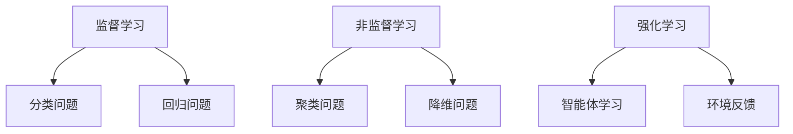

**核心算法原理讲解：**
**监督学习：**
```python
# 伪代码
def classify(x):
    # 特征提取
    features = extract_features(x)
    # 模型预测
    prediction = model.predict(features)
    return prediction
```

**非监督学习：**
```python
# 伪代码
def cluster_data(data):
    # 数据预处理
    preprocessed_data = preprocess(data)
    # 聚类
    clusters = clustering_algorithm(preprocessed_data)
    return clusters
```

**强化学习：**
```python
# 伪代码
class Agent:
    def __init__(self):
        self.model = initialize_model()

    def learn(self, state, action, reward, next_state):
        # 更新模型
        self.model.update(state, action, reward, next_state)
```

### 1.2 深度学习原理
**核心概念与联系：**
深度学习是一种基于多层神经网络的机器学习方法，它可以自动学习数据的复杂特征。

**Mermaid流程图：**
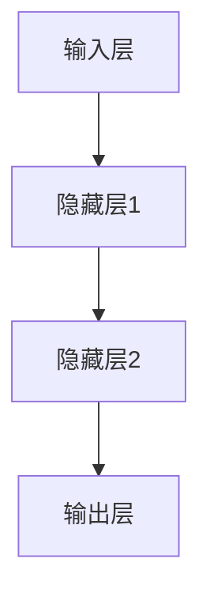

**核心算法原理讲解：**
**卷积神经网络（CNN）：**
```python
# 伪代码
def conv_layer(input_data, filter):
    # 卷积操作
    output = convolve(input_data, filter)
    return output
```

**循环神经网络（RNN）：**
```python
# 伪代码
def rnn_layer(input_data, hidden_state):
    # 门控操作
    output = rnn_gate(input_data, hidden_state)
    return output
```

### 1.3 强化学习应用
**核心概念与联系：**
强化学习是一种通过试错和反馈来学习策略的机器学习方法。

**Mermaid流程图：**
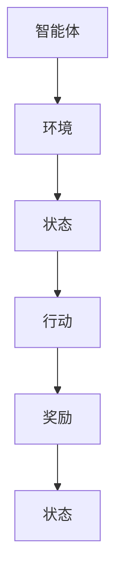

**核心算法原理讲解：**
**Q-learning算法：**
```python
# 伪代码
def q_learning(state, action, reward, next_state, learning_rate, discount_factor):
    # 更新Q值
    q_value = q_value + learning_rate * (reward + discount_factor * max(next_q_values) - q_value)
    return q_value
```

**DQN算法：**
```python
# 伪代码
def deep_q_learning(state, action, reward, next_state, target_model, model, learning_rate, discount_factor):
    # 更新目标模型
    target_model.update(state, action, reward, next_state, model.predict(next_state))
    # 更新当前模型
    model.update(state, action, reward, next_state, target_model.predict(state))
```

**DDPG算法：**
```python
# 伪代码
def deep_dqn_learning(state, action, reward, next_state, critic_model, actor_model, learning_rate, discount_factor):
    # 更新批评模型
    critic_loss = critic_model.loss(state, action, reward, next_state)
    # 更新演员模型
    actor_loss = actor_model.loss(state, action, reward, next_state)
    # 更新模型
    critic_model.update(learning_rate)
    actor_model.update(learning_rate)
```

## 第2章 智能制造技术

### 2.1 物联网在智能制造中的应用
**核心概念与联系：**
物联网是将各种物理设备通过互联网连接起来，实现数据的采集、传输和处理。

**Mermaid流程图：**
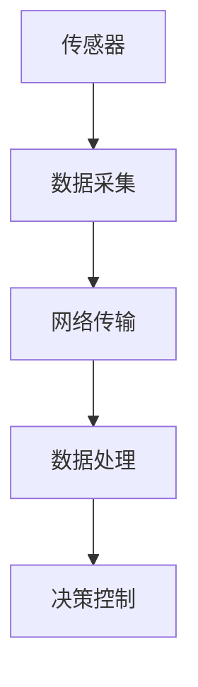

**核心算法原理讲解：**
**数据采集：**
```python
# 伪代码
def collect_data(sensor):
    data = sensor.read()
    return data
```

**网络传输：**
```python
# 伪代码
def send_data(data, server):
    server.send(data)
```

**数据处理：**
```python
# 伪代码
def process_data(data):
    processed_data = data_processing_algorithm(data)
    return processed_data
```

**决策控制：**
```python
# 伪代码
def make_decision(processed_data):
    decision = decision_making_algorithm(processed_data)
    return decision
```

### 2.2 数字孪生技术
**核心概念与联系：**
数字孪生是通过虚拟模型与物理实体之间的交互，实现对物理实体的模拟、分析和优化。

**Mermaid流程图：**
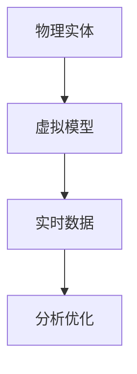

**核心算法原理讲解：**
**数据采集与同步：**
```python
# 伪代码
def collect_data实体(sensor):
    data = sensor.read()
    update_model(data)
```

**虚拟模型构建：**
```python
# 伪代码
def build_model():
    model = create_virtual_model()
    return model
```

**分析优化：**
```python
# 伪代码
def analyze_model(model):
    analysis = analysis_algorithm(model)
    return analysis
```

**决策控制：**
```python
# 伪代码
def make_decision(analysis):
    decision = decision_making_algorithm(analysis)
    return decision
```

## 第3章 AI在工业4.0中的应用

### 3.1 智能生产
**核心概念与联系：**
智能生产是利用AI技术实现生产过程的自动化、高效化和智能化。

**Mermaid流程图：**
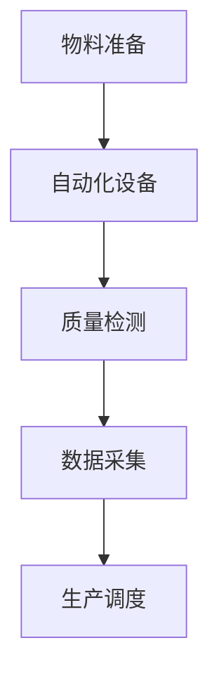

**核心算法原理讲解：**
**自动化设备：**
```python
# 伪代码
def automate_production(materials):
    production = automation_algorithm(materials)
    return production
```

**质量检测：**
```python
# 伪代码
def quality_inspection(production):
    quality = inspection_algorithm(production)
    return quality
```

**数据采集与处理：**
```python
# 伪代码
def collect_and_process_data(production):
    data = data_collection_algorithm(production)
    processed_data = data_processing_algorithm(data)
    return processed_data
```

**生产调度：**
```python
# 伪代码
def schedule_production(processed_data):
    schedule = scheduling_algorithm(processed_data)
    return schedule
```

### 3.2 智能供应链
**核心概念与联系：**
智能供应链是利用AI技术实现供应链的智能化管理，包括需求预测、库存优化、物流优化等。

**Mermaid流程图：**
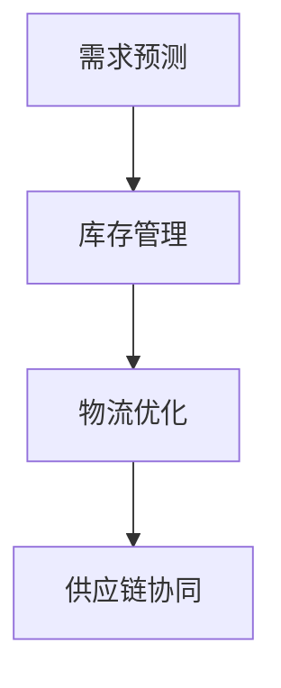

**核心算法原理讲解：**
**需求预测：**
```python
# 伪代码
def predict_demand(data):
    demand = demand_prediction_algorithm(data)
    return demand
```

**库存管理：**
```python
# 伪代码
def manage_inventory(demand):
    inventory = inventory_management_algorithm(demand)
    return inventory
```

**物流优化：**
```python
# 伪代码
def optimize_logistics(inventory):
    logistics = logistics_optimization_algorithm(inventory)
    return logistics
```

**供应链协同：**
```python
# 伪代码
def collaborate_supply_chain(logistics):
    collaboration = supply_chain_collaboration_algorithm(logistics)
    return collaboration
```

### 3.3 智能质量管理
**核心概念与联系：**
智能质量管理是利用AI技术实现质量管理的智能化，包括质量检测、故障预测、质量改进等。

**Mermaid流程图：**
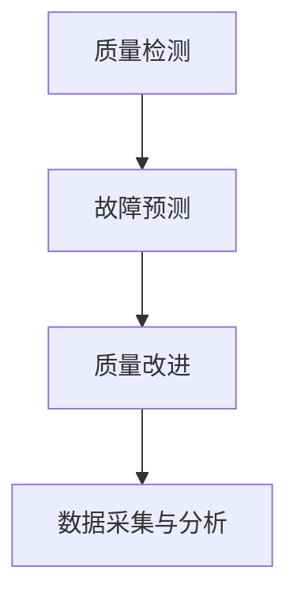

**核心算法原理讲解：**
**质量检测：**
```python
# 伪代码
def quality_inspection(product):
    quality = inspection_algorithm(product)
    return quality
```

**故障预测：**
```python
# 伪代码
def predict_failures(data):
    failures = failure_prediction_algorithm(data)
    return failures
```

**质量改进：**
```python
# 伪代码
def improve_quality(failures):
    improvement = quality_improvement_algorithm(failures)
    return improvement
```

## 第4章 实施策略

### 4.1 组织变革策略
**核心概念与联系：**
组织变革是实施AI驱动的智能制造的关键步骤，它涉及企业文化、组织结构、人员培训等方面的变革。

**Mermaid流程图：**
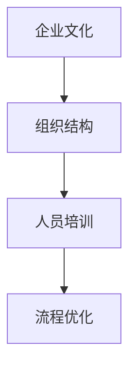

**核心算法原理讲解：**
**企业文化：**
```python
# 伪代码
def adjust企业文化(current_culture, desired_culture):
    adjusted_culture = culture_adjustment_algorithm(current_culture, desired_culture)
    return adjusted_culture
```

**组织结构：**
```python
# 伪代码
def adjust组织结构(current_structure, desired_structure):
    adjusted_structure = structure_adjustment_algorithm(current_structure, desired_structure)
    return adjusted_structure
```

**人员培训：**
```python
# 伪代码
def train_employees(current_employees, required_skills):
    trained_employees = employee_training_algorithm(current_employees, required_skills)
    return trained_employees
```

**流程优化：**
```python
# 伪代码
def optimize_processes(current_processes, desired_processes):
    optimized_processes = process_optimization_algorithm(current_processes, desired_processes)
    return optimized_processes
```

### 4.2 技术选择与整合
**核心概念与联系：**
技术选择与整合是实施AI驱动的智能制造的重要环节，它涉及选择合适的AI技术、系统集成和数据处理。

**Mermaid流程图：**
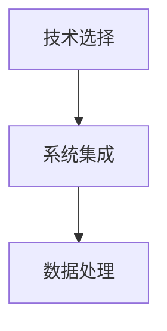

**核心算法原理讲解：**
**技术选择：**
```python
# 伪代码
def select_technology(available_technologies, requirements):
    selected_technology = technology_selection_algorithm(available_technologies, requirements)
    return selected_technology
```

**系统集成：**
```python
# 伪代码
def integrate_systems(current_systems, selected_technology):
    integrated_systems = system_integration_algorithm(current_systems, selected_technology)
    return integrated_systems
```

**数据处理：**
```python
# 伪代码
def process_data(data, selected_technology):
    processed_data = data_processing_algorithm(data, selected_technology)
    return processed_data
```

### 4.3 风险管理策略
**核心概念与联系：**
风险管理是实施AI驱动的智能制造的关键步骤，它涉及识别风险、评估风险、制定应对策略。

**Mermaid流程图：**
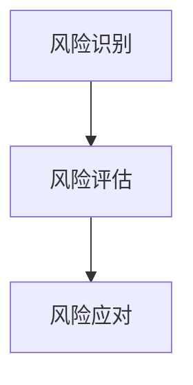

**核心算法原理讲解：**
**风险识别：**
```python
# 伪代码
def identify_risks(current_context):
    identified_risks = risk_identification_algorithm(current_context)
    return identified_risks
```

**风险评估：**
```python
# 伪代码
def assess_risks(identified_risks):
    assessed_risks = risk_evaluation_algorithm(identified_risks)
    return assessed_risks
```

**风险应对：**
```python
# 伪代码
def mitigate_risks(assessed_risks):
    mitigation_plan = risk_mitigation_algorithm(assessed_risks)
    return mitigation_plan
```

## 第5章 案例分析

### 5.1 案例一：某制造企业的AI应用
**核心内容：**
该案例介绍了某制造企业如何利用AI技术实现生产过程的智能化，包括自动化设备、质量检测和数据分析。

**案例分析：**
该企业首先引入了自动化设备，实现生产过程的自动化。然后，通过AI技术进行质量检测，提高产品质量。最后，利用数据分析优化生产流程，降低生产成本。

**详细讲解：**
- **自动化设备：** 使用卷积神经网络（CNN）进行图像识别，实现生产设备的自动化控制。
- **质量检测：** 使用深度学习（DNN）进行质量检测，提高检测精度。
- **数据分析：** 使用机器学习（ML）进行数据分析，优化生产流程。

### 5.2 案例二：某供应链的AI优化
**核心内容：**
该案例介绍了某供应链企业如何利用AI技术实现供应链的智能化管理，包括需求预测、库存优化和物流优化。

**案例分析：**
该企业通过AI技术实现了供应链的智能化管理，提高了供应链的效率和响应速度。

**详细讲解：**
- **需求预测：** 使用强化学习（RL）进行需求预测，提高预测精度。
- **库存优化：** 使用优化算法进行库存管理，降低库存成本。
- **物流优化：** 使用深度学习（DNN）进行物流路径优化，提高物流效率。

### 5.3 案例三：某工厂的智能质量监控
**核心内容：**
该案例介绍了某工厂如何利用AI技术实现质量监控，包括实时质量检测、故障预测和智能决策。

**案例分析：**
该工厂通过AI技术实现了质量监控的智能化，提高了生产效率和产品质量。

**详细讲解：**
- **实时质量检测：** 使用物联网（IoT）技术进行实时质量检测，及时发现问题。
- **故障预测：** 使用机器学习（ML）进行故障预测，预防设备故障。
- **智能决策：** 使用深度学习（DNN）进行智能决策，优化生产流程。

## 第6章 未来展望

### 6.1 AI驱动的智能制造趋势
**核心内容：**
AI驱动的智能制造将成为未来制造业的发展趋势，其特点包括智能化、个性化、全球化。

**详细讲解：**
- **智能化**：通过AI技术实现生产过程的自动化和智能化。
- **个性化**：通过AI技术实现定制化生产，满足个性化需求。
- **全球化**：通过AI技术实现全球供应链的协同和优化。

### 6.2 技术挑战与解决方案
**核心内容：**
在实施AI驱动的智能制造过程中，将面临一系列技术挑战，如算法优化、数据隐私等。

**详细讲解：**
- **算法优化**：通过算法研究和优化，提高AI技术在智能制造中的应用效果。
- **数据隐私**：通过数据加密和隐私保护技术，确保数据的安全和隐私。

### 6.3 未来发展方向
**核心内容：**
未来，AI驱动的智能制造将朝着更高效、更智能、更可持续的方向发展。

**详细讲解：**
- **高效**：通过AI技术提高生产效率和产品质量。
- **智能**：通过AI技术实现更智能的生产和管理。
- **可持续**：通过AI技术实现资源的节约和环境的保护。

## 结尾
本文介绍了AI驱动的智能制造在工业4.0背景下的应用，分析了AI技术的基础知识、智能制造的关键技术、AI在工业4.0中的应用实例，并讨论了实施AI驱动的智能制造的策略和未来展望。通过案例分析，展示了AI技术的实际应用效果，以及未来智能制造的发展趋势。随着AI技术的不断发展和普及，AI驱动的智能制造将成为未来制造业的重要方向。

### 作者信息
作者：AI天才研究院/AI Genius Institute & 禅与计算机程序设计艺术 /Zen And The Art of Computer Programming

