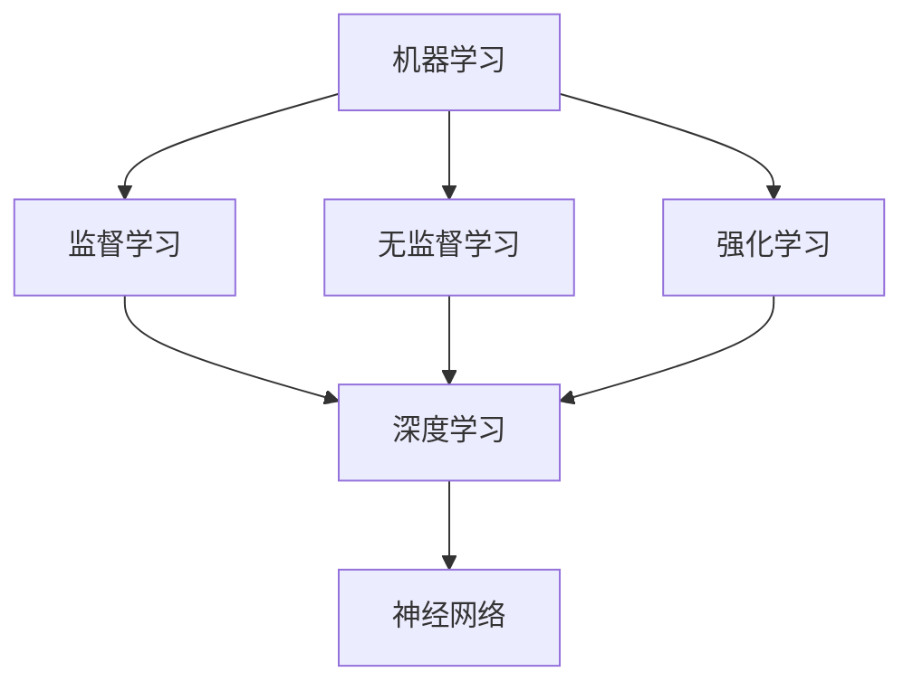
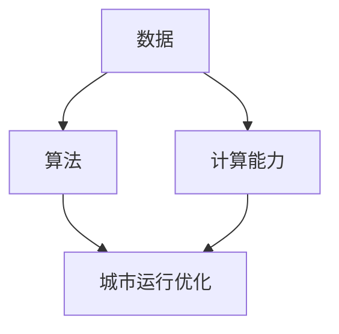
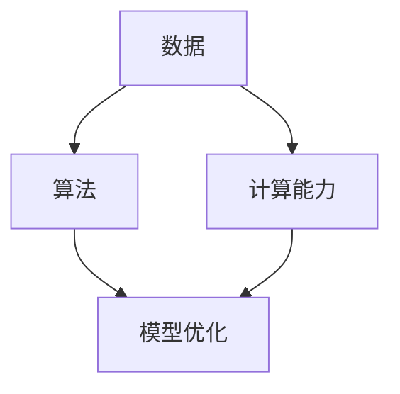
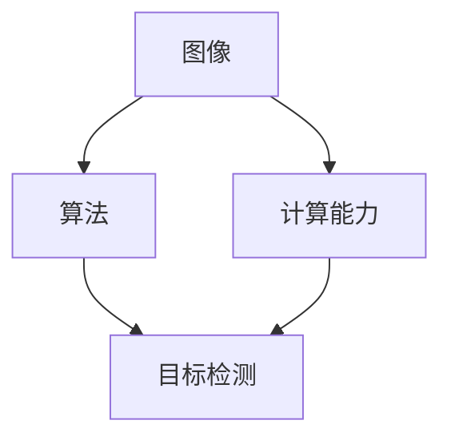
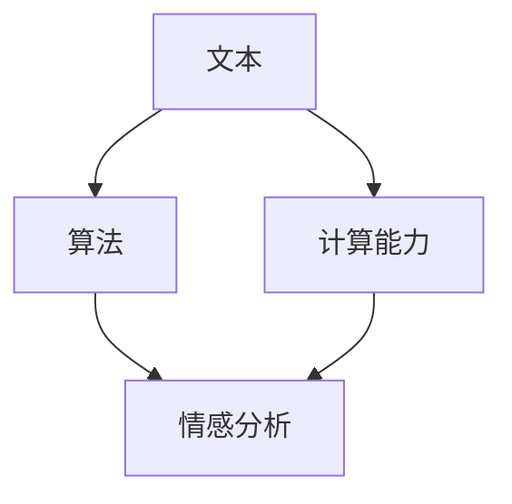

                 


# AI驱动的智能城市：提升生活质量的新方案

> 关键词：人工智能、智能城市、生活质量、技术应用、实施方案

> 摘要：本文旨在探讨人工智能（AI）在智能城市建设中的应用，以及如何通过AI技术提升居民生活质量。文章首先介绍了AI和智能城市的概念，然后分析了AI在智能城市中的核心技术，如机器学习、计算机视觉和自然语言处理。接着，本文详细阐述了AI在智能城市中的具体应用场景，包括交通管理、公共安全和环境监测等。随后，文章讨论了实施AI驱动的智能城市项目的策略，包括政策制定、技术选择和经济考虑。最后，本文通过案例研究，展示了AI驱动的智能城市项目案例，并对其进行了分析和评价。文章最后展望了AI驱动的智能城市未来的发展趋势和潜在挑战。

## 第一步：定义整体框架

为了系统地探讨AI驱动的智能城市及其对生活质量的影响，本文将整体框架划分为以下几个部分：

1. **背景介绍**：介绍AI和智能城市的概念、发展历程以及当前的应用情况。
2. **核心技术**：详细讲解AI在智能城市中的应用技术，包括机器学习、计算机视觉、自然语言处理等。
3. **应用场景**：分析AI在智能城市中的具体应用场景，如交通管理、公共安全、环境监测等。
4. **实施策略**：探讨如何制定和实施AI驱动的智能城市项目，包括政策、技术和经济因素。
5. **案例研究**：分享一些成功的AI驱动的智能城市项目案例，进行详细的分析和评价。
6. **未来展望**：预测AI驱动的智能城市未来的发展趋势和潜在挑战。

## 第二步：细化每个部分

### 背景介绍

**第1章：AI与智能城市概述**

- **1.1 AI的概念与分类**
- **1.2 智能城市的定义与发展**
- **1.3 智能城市的重要性**

### 核心技术

**第2章：AI在智能城市中的应用技术**

- **2.1 机器学习基础**
  - **2.1.1 监督学习**
  - **2.1.2 无监督学习**
  - **2.1.3 强化学习**

- **2.2 计算机视觉**
  - **2.2.1 图像识别**
  - **2.2.2 视频分析**
  - **2.2.3 人脸识别**

- **2.3 自然语言处理**
  - **2.3.1 文本分类**
  - **2.3.2 语音识别**
  - **2.3.3 情感分析**

### 应用场景

**第3章：AI在智能城市中的具体应用**

- **3.1 交通管理**
  - **3.1.1 智能交通信号控制**
  - **3.1.2 车辆识别与追踪**
  - **3.1.3 出行信息服务**

- **3.2 公共安全**
  - **3.2.1 智能视频监控**
  - **3.2.2 灾害预警与响应**
  - **3.2.3 社会安全监控**

- **3.3 环境监测**
  - **3.3.1 大气污染监测**
  - **3.3.2 水质监测**
  - **3.3.3 噪声监测**

### 实施策略

**第4章：AI驱动的智能城市实施策略**

- **4.1 政策制定与实施**
  - **4.1.1 政策环境分析**
  - **4.1.2 政策制定原则**
  - **4.1.3 政策实施案例分析**

- **4.2 技术选择与开发**
  - **4.2.1 技术选择标准**
  - **4.2.2 技术开发流程**
  - **4.2.3 技术开发案例分析**

- **4.3 经济考虑**
  - **4.3.1 成本效益分析**
  - **4.3.2 投资回报率分析**
  - **4.3.3 资金筹集渠道**

### 案例研究

**第5章：AI驱动的智能城市案例研究**

- **5.1 案例一：XX城市的智能交通系统**
- **5.2 案例二：YY城市的智能安防系统**
- **5.3 案例三：ZZ城市的智慧环保项目**

### 未来展望

**第6章：AI驱动的智能城市未来发展趋势**

- **6.1 技术发展趋势**
  - **6.1.1 AI技术的未来方向**
  - **6.1.2 5G与智能城市的融合**

- **6.2 挑战与机遇**
  - **6.2.1 隐私保护**
  - **6.2.2 数据安全**
  - **6.2.3 城市治理**

- **6.3 未来展望**
  - **6.3.1 AI驱动的智能城市的愿景**
  - **6.3.2 智慧城市的未来发展方向**

## 第三步：编写章节内容概要

### 背景介绍

**第1章：AI与智能城市概述**

本章将介绍人工智能和智能城市的概念。首先，我们将解释人工智能的定义和分类，包括机器学习、深度学习和强化学习。接下来，我们将探讨智能城市的定义和发展历程，重点介绍智能城市的基本特征和核心目标。最后，我们将分析智能城市的重要性，讨论其对现代社会和居民生活质量的影响。

### 核心技术

**第2章：AI在智能城市中的应用技术**

本章将深入探讨AI在智能城市中的应用技术。首先，我们将介绍机器学习的基础知识，包括监督学习、无监督学习和强化学习。然后，我们将详细解释计算机视觉的应用，如图像识别、视频分析和人脸识别。接下来，我们将探讨自然语言处理的核心技术，如文本分类、语音识别和情感分析。最后，我们将讨论这些技术在智能城市中的实际应用场景。

### 应用场景

**第3章：AI在智能城市中的具体应用**

本章将分析AI在智能城市中的具体应用场景。首先，我们将探讨交通管理领域，介绍如何利用AI技术优化交通信号控制、车辆识别和出行信息服务。接下来，我们将探讨公共安全领域，介绍如何利用AI技术进行智能视频监控、灾害预警与响应和社会安全监控。最后，我们将探讨环境监测领域，介绍如何利用AI技术监测大气污染、水质和噪声。

### 实施策略

**第4章：AI驱动的智能城市实施策略**

本章将探讨如何制定和实施AI驱动的智能城市项目。首先，我们将分析政策制定与实施的因素，包括政策环境分析和政策制定原则。然后，我们将探讨技术选择与开发的关键环节，包括技术选择标准和开发流程。接下来，我们将讨论经济考虑，包括成本效益分析和投资回报率分析。最后，我们将讨论资金筹集渠道，包括政府资助、企业投资和社会融资等。

### 案例研究

**第5章：AI驱动的智能城市案例研究**

本章将分享一些成功的AI驱动的智能城市项目案例，并进行详细的分析和评价。首先，我们将分析一个智能交通系统案例，探讨如何利用AI技术优化交通管理。接下来，我们将分析一个智能安防系统案例，探讨如何利用AI技术提升公共安全。最后，我们将分析一个智慧环保项目案例，探讨如何利用AI技术监测和管理环境。

### 未来展望

**第6章：AI驱动的智能城市未来发展趋势**

本章将展望AI驱动的智能城市未来的发展趋势和潜在挑战。首先，我们将分析技术发展趋势，包括AI技术的未来方向和5G与智能城市的融合。接下来，我们将探讨挑战与机遇，包括隐私保护、数据安全和城市治理。最后，我们将展望AI驱动的智能城市的未来愿景，讨论其发展方向和目标。

## AI驱动的智能城市：全面提升生活质量

### 关键点总结

- **背景介绍**：AI和智能城市的概念与发展历程，智能城市对生活质量的影响。
- **核心技术**：机器学习、计算机视觉和自然语言处理，在智能城市中的应用。
- **应用场景**：交通管理、公共安全和环境监测，AI技术的具体应用。
- **实施策略**：政策制定、技术选择、经济考虑和资金筹集，确保项目的成功实施。
- **案例研究**：成功案例的分析和评价，展示AI驱动的智能城市项目的实际效果。
- **未来展望**：技术发展趋势、挑战与机遇，以及AI驱动的智能城市的未来愿景。

通过以上分析，我们可以看到AI驱动的智能城市具有巨大的潜力，可以全面提升居民生活质量。在接下来的章节中，我们将详细探讨这些核心内容和关键点，以期为读者提供全面的见解和思考。

## 人工智能（AI）的概念与分类

人工智能（AI，Artificial Intelligence）是指通过计算机程序和算法模拟人类智能的行为和思维过程，使机器能够执行通常需要人类智能才能完成的任务。AI技术涵盖了广泛的领域，包括机器学习、自然语言处理、计算机视觉、知识表示和推理等。根据其实现方式和能力，AI可以分为几种不同的类型。

### 强人工智能（Strong AI）

强人工智能，也称为通用人工智能（AGI，Artificial General Intelligence），是指具有与人类智能相同或超过人类智能水平的机器。强人工智能能够理解、学习和应用广泛的认知任务，如推理、解决问题、创造和沟通等。目前，强人工智能仍处于理论阶段，尚未实现。

### 弱人工智能（Weak AI）

弱人工智能，也称为专用人工智能（Narrow AI），是指针对特定任务或领域表现出高智能水平的机器。弱人工智能擅长执行特定的任务，但无法像人类一样进行跨领域的思考和决策。例如，语音助手、自动驾驶汽车和医疗诊断系统都属于弱人工智能的范畴。

### 狭义人工智能（Narrow AI）

狭义人工智能是指专门为特定任务或场景设计的智能系统，如聊天机器人、图像识别系统等。这些系统在特定的任务上表现出色，但无法进行其他类型的任务。狭义人工智能是当前AI技术的主要应用形式。

### 自然智能（Natural AI）

自然智能是指利用生物神经系统的原理设计的人工智能系统。这类系统模仿人脑的结构和功能，具有较高的智能和学习能力。自然智能的研究包括神经网络、脑机接口和生物计算等。

### 混合智能（Hybrid AI）

混合智能是指将多种人工智能技术结合起来的系统，以提高智能水平。例如，结合机器学习和神经网络，或者结合自然语言处理和计算机视觉等。混合智能系统能够在不同任务间灵活切换，并处理复杂的问题。

### AI的分类关系

这些人工智能类型之间存在一定的关系，如图1所示。强人工智能是AI的理想状态，但尚未实现；弱人工智能和狭义人工智能是当前AI技术的主要形式；自然智能和混合智能则是未来AI发展的方向。

```
+-----------------------------+
|          强人工智能（AGI）  |
+-----------------------------+
       |
       ↓
+-----------------------------+
|         弱人工智能（Narrow AI）|
+-----------------------------+
       |
       ↓
+-----------------------------+
|        狭义人工智能（Narrow AI）|
+-----------------------------+
       |
       ↓
+-----------------------------+
|        自然智能（Natural AI） |
+-----------------------------+
       |
       ↓
+-----------------------------+
|       混合智能（Hybrid AI）  |
+-----------------------------+
```

### 关键概念与联系

在讨论AI的分类时，我们需要关注几个核心概念：机器学习、深度学习和神经网络。

- **机器学习**：机器学习是AI的核心技术之一，使计算机能够从数据中学习并做出决策。根据学习方式，机器学习可以分为监督学习、无监督学习和强化学习。
  
- **深度学习**：深度学习是机器学习的一种方法，利用多层神经网络对数据进行分析和处理。深度学习在图像识别、语音识别和自然语言处理等领域表现出色。

- **神经网络**：神经网络是模拟人脑结构和功能的计算模型，由大量的神经元连接组成。神经网络包括前馈神经网络、卷积神经网络和循环神经网络等。

这些概念之间存在密切的联系。机器学习提供了从数据中学习的方法，深度学习则利用神经网络模型对数据进行分析，神经网络是实现深度学习和机器学习的基础。

### Mermaid流程图

以下是一个简单的Mermaid流程图，展示了这些核心概念之间的关系：



通过以上分析，我们可以更好地理解人工智能的概念、分类及其核心技术的联系。在接下来的章节中，我们将进一步探讨AI在智能城市中的应用，以及如何通过这些技术提升居民生活质量。

## 智能城市的定义与发展

智能城市（Smart City）是指利用先进的ICT（信息通信技术）和大数据分析等手段，对城市的基础设施、公共服务和社会资源进行智能化管理和优化，以提高城市运行效率、提升居民生活质量、促进可持续发展。智能城市的核心目标是实现城市的信息化、智能化和可持续发展，从而构建一个高效、绿色、安全、宜居的城市环境。

### 智能城市的定义

智能城市的定义可以从多个角度进行理解：

1. **技术角度**：智能城市是利用物联网、云计算、大数据、人工智能等先进技术，对城市运行过程中的各类信息进行采集、传输、处理和应用。
2. **管理角度**：智能城市强调城市管理的智能化和科学化，通过建立城市运行大数据平台，实现城市资源的优化配置和高效利用。
3. **服务角度**：智能城市以居民需求为中心，提供个性化的智能服务，提升居民的幸福感和满意度。

### 智能城市的发展历程

智能城市的发展历程可以分为以下几个阶段：

1. **初步阶段**：20世纪80年代至90年代，以城市信息化为主要目标，建立城市信息基础设施，如宽带网络、数据中心等。
2. **发展阶段**：21世纪初，随着物联网、云计算等新技术的兴起，智能城市逐渐从单一的信息化应用向综合的智能化管理转变，如智能交通、智能照明、智能安防等。
3. **成熟阶段**：近年来，人工智能、大数据等技术的快速发展，使智能城市进入新的发展阶段，实现了城市运行的全过程智能化，如智能城市规划、智能公共服务、智能环境监测等。

### 智能城市的核心特征

智能城市具有以下几个核心特征：

1. **信息化**：智能城市通过建立全面的信息基础设施，实现城市运行数据的高度集成和共享，为智能化管理提供数据支持。
2. **数字化**：智能城市将各类城市资源和业务流程进行数字化改造，实现城市运行的透明化和高效化。
3. **智能化**：智能城市利用人工智能、大数据等技术，对城市运行过程进行实时监测、分析和优化，实现城市管理的智能化。
4. **绿色化**：智能城市通过优化资源配置、减少能源消耗和污染排放，实现城市的可持续发展。
5. **宜居性**：智能城市以居民需求为中心，提供个性化、高质量的公共服务，提升居民的生活质量和幸福感。

### 智能城市的重要性

智能城市的重要性体现在以下几个方面：

1. **提升城市竞争力**：智能城市通过高效的城市管理和优质的公共服务，提高城市对企业和人才的吸引力，增强城市竞争力。
2. **提高生活质量**：智能城市通过优化城市环境、提升公共服务水平和保障居民安全，提高居民的生活质量和幸福感。
3. **促进可持续发展**：智能城市通过绿色、智能的资源配置和管理，实现城市的可持续发展，减少环境污染和资源浪费。
4. **创新驱动发展**：智能城市为科技创新提供了广阔的应用场景，推动了人工智能、物联网、大数据等新兴产业的发展。

### 智能城市与生活质量的关系

智能城市与生活质量密切相关，主要体现在以下几个方面：

1. **环境质量提升**：智能城市通过环境监测和污染治理，改善城市环境质量，提升居民的健康水平。
2. **交通效率提高**：智能交通系统通过实时监测和优化交通流量，减少交通拥堵，提高出行效率，减少交通污染。
3. **公共服务优化**：智能城市通过大数据分析和人工智能技术，提供个性化、高效的公共服务，满足居民的多样化需求。
4. **安全保障增强**：智能城市通过智能安防系统，提高城市的安全管理水平，保障居民的人身和财产安全。
5. **社交互动增强**：智能城市为居民提供便捷的社交互动平台，促进社区和谐，增强居民的社会认同感和归属感。

### 总结

智能城市是信息化、数字化、智能化和绿色化的有机结合，通过利用先进的技术手段，实现城市运行的高效、绿色和可持续发展。智能城市不仅能够提升城市竞争力，提高居民生活质量，还能够促进经济社会的可持续发展。在接下来的章节中，我们将进一步探讨智能城市中的AI核心技术，以及AI如何应用于智能城市的具体场景。

## AI在智能城市中的应用技术

人工智能（AI）在智能城市中的应用技术涵盖了多个领域，包括机器学习、计算机视觉、自然语言处理等。这些技术为智能城市的建设提供了强大的技术支撑，使得城市运行更加高效、智能和可持续。以下是AI在智能城市中的一些关键应用技术。

### 机器学习

机器学习（Machine Learning）是AI的核心技术之一，通过构建数学模型和算法，使计算机能够从数据中自动学习和改进。机器学习在智能城市中的应用主要体现在以下几个方面：

- **预测和优化**：利用机器学习算法，对城市运行数据进行分析和预测，优化交通流量、能源消耗等，提高城市运行效率。
- **模式识别**：通过机器学习算法，识别和分析城市中的异常模式和趋势，如交通拥堵、犯罪活动等，为城市管理和决策提供支持。
- **智能决策**：结合大数据分析和机器学习算法，为城市管理者提供智能化的决策支持，如城市规划、资源配置等。

### 计算机视觉

计算机视觉（Computer Vision）是AI的另一个重要分支，通过模拟人眼的功能，使计算机能够理解和解释视觉信息。计算机视觉在智能城市中的应用主要包括：

- **图像识别**：利用深度学习算法，对城市监控视频中的物体、场景和活动进行识别，用于安防监控、交通管理等领域。
- **视频分析**：通过视频数据分析，识别城市中的异常行为和事件，如交通事故、人群聚集等，为城市安全管理提供支持。
- **人脸识别**：利用人脸识别技术，实现城市人口管理、公共安全监控等，提高城市运行的安全性。

### 自然语言处理

自然语言处理（Natural Language Processing，NLP）是AI的又一重要领域，旨在使计算机能够理解、生成和处理自然语言。NLP在智能城市中的应用包括：

- **语音识别**：将语音信号转换为文本，实现人机交互，如智能语音助手、交通信息查询等。
- **文本分析**：对城市运行数据、居民反馈等文本信息进行分析，提取有用信息，用于决策支持和公共服务优化。
- **情感分析**：通过分析社交媒体、新闻报道等文本信息，了解居民对城市服务的满意度和情感倾向，为城市管理和改进提供依据。

### AI在智能城市中的应用实例

以下是一些AI在智能城市中的应用实例：

- **智能交通管理**：利用机器学习和计算机视觉技术，实现交通流量预测、路况分析、车辆识别等功能，提高交通运行效率，减少拥堵。
- **智能安防系统**：通过视频分析和人脸识别技术，实时监控城市安全，及时发现和处理异常事件，提高城市安全性。
- **智慧环保**：利用计算机视觉和自然语言处理技术，对环境数据进行实时监测和分析，实现大气污染、水质监测和噪声控制等，保护城市生态环境。
- **智能公共服务**：通过自然语言处理和机器学习技术，提供智能化的政务服务、医疗咨询、教育辅导等，提升公共服务质量。

### 关键概念与联系

在讨论AI在智能城市中的应用时，我们需要关注几个核心概念：数据、算法和计算能力。

- **数据**：数据是智能城市的基础，包括城市运行数据、居民行为数据、环境数据等。这些数据通过传感器、监控设备等实时采集，为AI算法提供输入。
- **算法**：算法是AI的核心，包括机器学习算法、深度学习算法、自然语言处理算法等。这些算法通过分析数据，实现对城市运行过程的监测、预测和优化。
- **计算能力**：计算能力是AI应用的支撑，包括计算资源、存储资源和网络资源等。强大的计算能力能够快速处理大量数据，实现实时监测和智能决策。

这些概念之间存在密切的联系。数据是AI算法的输入，算法是数据处理的核心，而计算能力则是算法实现的保障。以下是一个简单的Mermaid流程图，展示了这些概念之间的关系：



通过以上分析，我们可以看到AI在智能城市中的应用技术是如何相互关联，共同推动城市运行效率和居民生活质量的提升。在接下来的章节中，我们将进一步探讨AI在智能城市中的具体应用场景，以及如何通过这些技术实现智能城市的建设目标。

### 机器学习基础

机器学习（Machine Learning）是人工智能（AI）的核心技术之一，通过构建数学模型和算法，使计算机能够从数据中自动学习和改进。机器学习在智能城市中的应用非常广泛，包括预测和优化、模式识别和智能决策等方面。为了更好地理解机器学习，我们需要从以下几个方面进行介绍。

#### 监督学习

监督学习（Supervised Learning）是机器学习中的一种方法，通过使用标记数据集来训练模型。标记数据集包含输入特征和对应的输出标签，通过学习这些数据，模型可以学会在新的输入数据上预测输出。

**基本原理**：

1. **数据预处理**：首先对数据进行清洗和预处理，包括缺失值填补、数据标准化等。
2. **特征选择**：选择对模型预测有帮助的特征，排除冗余特征。
3. **模型训练**：使用训练数据集，通过算法（如线性回归、决策树、支持向量机等）训练模型，使其学会从输入特征到输出标签的映射。
4. **模型评估**：使用验证数据集评估模型性能，通过指标（如准确率、召回率、F1值等）评估模型的效果。

**应用示例**：

- **交通流量预测**：通过历史交通数据，利用监督学习算法预测未来交通流量，优化交通信号控制和路线规划，减少交通拥堵。
- **犯罪预测**：利用犯罪数据，通过监督学习算法预测潜在的犯罪活动，帮助警方提前采取措施，预防犯罪发生。

#### 无监督学习

无监督学习（Unsupervised Learning）是机器学习中的另一种方法，不需要标记数据集。无监督学习的目标是从未标记的数据中发现隐藏的结构或模式。

**基本原理**：

1. **数据预处理**：与监督学习类似，对数据进行清洗和预处理。
2. **特征提取**：通过聚类、降维等技术，提取数据中的潜在特征。
3. **模式识别**：通过聚类算法（如K-Means、DBSCAN等）或降维算法（如PCA、t-SNE等），发现数据中的模式和分布。
4. **模型优化**：根据发现的结构或模式，调整模型参数，优化模型性能。

**应用示例**：

- **数据聚类**：通过对城市监控视频中的图像进行聚类分析，发现不同类型的活动和行为，用于城市管理和公共安全。
- **人群行为分析**：通过对社交媒体数据进行分析，发现人群的兴趣和行为模式，为城市规划和公共服务提供依据。

#### 强化学习

强化学习（Reinforcement Learning）是一种通过试错和反馈来学习最佳策略的机器学习方法。强化学习的主要目标是使智能体（Agent）在特定环境中通过最大化奖励来完成任务。

**基本原理**：

1. **环境建模**：构建一个模拟环境，智能体可以在其中进行互动。
2. **策略学习**：智能体通过与环境互动，不断学习最佳策略。策略是智能体在特定状态下选择行动的概率分布。
3. **奖励机制**：环境根据智能体的行动给予奖励或惩罚，智能体通过优化策略来最大化总奖励。
4. **模型评估**：评估智能体的策略性能，通过指标（如平均奖励、策略收敛速度等）评估策略的有效性。

**应用示例**：

- **自动驾驶**：通过强化学习算法，自动驾驶汽车可以在复杂交通环境中学习最优驾驶策略，提高行驶安全和效率。
- **智能电力调度**：通过强化学习算法，智能电网可以学习最优的电力调度策略，优化电力资源的分配，提高能源利用效率。

#### 关键概念与联系

在讨论机器学习时，我们需要关注几个关键概念：数据、算法和计算能力。

- **数据**：数据是机器学习的基础，包括训练数据集和测试数据集。高质量的数据能够提高模型的预测准确性和泛化能力。
- **算法**：算法是机器学习的核心，包括监督学习、无监督学习和强化学习等。不同的算法适用于不同类型的数据和任务。
- **计算能力**：计算能力是机器学习实现的保障，包括计算资源、存储资源和网络资源等。强大的计算能力能够快速处理大量数据，实现模型的训练和优化。

这些概念之间存在密切的联系。数据是算法的输入，算法是数据处理的工具，而计算能力则是算法实现的支撑。以下是一个简单的Mermaid流程图，展示了这些概念之间的关系：



通过以上分析，我们可以更好地理解机器学习的基础知识，以及其在智能城市中的应用。在接下来的章节中，我们将进一步探讨计算机视觉在智能城市中的应用，以及如何利用计算机视觉技术提升城市运行效率和居民生活质量。

### 计算机视觉基础

计算机视觉（Computer Vision）是人工智能（AI）的一个重要分支，致力于使计算机具备理解和解释视觉信息的能力。计算机视觉在智能城市中的应用非常广泛，包括图像识别、视频分析和人脸识别等方面。以下是计算机视觉的基础知识及其在智能城市中的应用。

#### 图像识别

图像识别（Image Recognition）是计算机视觉的核心任务之一，旨在通过算法识别和分类图像中的物体、场景和活动。图像识别通常涉及以下几个步骤：

1. **图像预处理**：对输入图像进行预处理，包括去噪、增强、尺寸调整等，以提高图像质量。
2. **特征提取**：提取图像中的特征，如边缘、纹理、颜色等，用于后续的分类和识别。
3. **模型训练**：利用已标注的数据集，通过深度学习算法（如卷积神经网络（CNN））训练图像识别模型。
4. **模型评估**：使用测试数据集评估模型的性能，通过准确率、召回率等指标衡量模型的准确性。

**应用示例**：

- **交通监控**：通过图像识别技术，识别道路上的车辆、行人等，用于交通流量监测、事故预警和交通违法行为的识别。
- **智能安防**：在公共场所安装监控摄像头，利用图像识别技术实时监控人群行为，及时发现异常情况，提高公共安全。

#### 视频分析

视频分析（Video Analysis）是计算机视觉的另一个重要应用，通过对视频数据进行实时处理和分析，提取有用信息。视频分析通常包括以下步骤：

1. **视频预处理**：对输入视频进行预处理，包括去噪、帧率调整等，以提高视频质量。
2. **目标检测**：使用目标检测算法（如YOLO、SSD、Faster R-CNN等）识别视频中的物体和场景。
3. **行为分析**：对识别出的物体和场景进行行为分析，如车辆轨迹分析、人群密度分析等。
4. **事件识别**：通过分析物体的运动轨迹和行为模式，识别出特定的事件，如交通拥堵、人群聚集等。

**应用示例**：

- **智能交通**：通过视频分析技术，实时监测交通流量和路况，优化交通信号控制和路线规划，减少交通拥堵。
- **公共安全**：在重要场所和时段安装监控摄像头，通过视频分析技术，实时监控人群行为，及时发现和处理异常事件，保障公共安全。

#### 人脸识别

人脸识别（Face Recognition）是计算机视觉中的另一个关键应用，旨在通过分析人脸图像或视频，识别和验证个体身份。人脸识别通常包括以下几个步骤：

1. **人脸检测**：使用人脸检测算法（如Haar特征分类器、MTCNN等）定位图像中的人脸区域。
2. **特征提取**：使用深度学习算法（如FaceNet、VGGFace等）提取人脸特征，用于后续的身份识别。
3. **模型训练**：利用已标注的人脸数据集，通过算法训练人脸识别模型。
4. **模型评估**：使用测试数据集评估模型的性能，通过准确率、错误率等指标衡量模型的准确性。

**应用示例**：

- **智能安防**：在公共场所安装人脸识别摄像头，实时监控并识别潜在的危险分子，提高公共安全。
- **身份验证**：在机场、银行等场所，利用人脸识别技术进行身份验证，提高安全性和便捷性。

#### 关键概念与联系

在讨论计算机视觉时，我们需要关注几个关键概念：图像、算法和计算能力。

- **图像**：图像是计算机视觉的输入数据，包括不同格式的图像文件，如JPEG、PNG等。
- **算法**：算法是计算机视觉的核心，包括图像识别、目标检测、行为分析等人脸识别算法。不同的算法适用于不同的视觉任务。
- **计算能力**：计算能力是计算机视觉实现的保障，包括计算资源、存储资源和网络资源等。强大的计算能力能够快速处理大量图像数据，实现实时分析和识别。

这些概念之间存在密切的联系。图像是算法的输入，算法是数据处理的核心，而计算能力则是算法实现的支撑。以下是一个简单的Mermaid流程图，展示了这些概念之间的关系：



通过以上分析，我们可以更好地理解计算机视觉的基础知识及其在智能城市中的应用。在接下来的章节中，我们将进一步探讨自然语言处理在智能城市中的应用，以及如何利用自然语言处理技术提升城市运行效率和居民生活质量。

### 自然语言处理基础

自然语言处理（Natural Language Processing，NLP）是人工智能（AI）的重要分支，旨在使计算机能够理解和生成自然语言。NLP在智能城市中有着广泛的应用，包括文本分类、语音识别和情感分析等方面。以下是自然语言处理的基础知识及其在智能城市中的应用。

#### 文本分类

文本分类（Text Classification）是NLP的一个基本任务，旨在将文本数据根据其内容或主题分类到预定义的类别中。文本分类通常包括以下几个步骤：

1. **文本预处理**：对原始文本进行预处理，包括分词、去除停用词、词干提取等，以提高文本质量。
2. **特征提取**：从预处理后的文本中提取特征，如词频、词袋模型、TF-IDF等，用于后续的分类任务。
3. **模型训练**：使用已标注的文本数据集，通过机器学习算法（如朴素贝叶斯、支持向量机、深度学习等）训练文本分类模型。
4. **模型评估**：使用测试数据集评估模型的性能，通过准确率、召回率、F1值等指标衡量模型的准确性。

**应用示例**：

- **社交媒体分析**：通过对社交媒体上的用户评论和帖子进行分类，了解公众对城市服务的态度和反馈，为城市管理和改进提供依据。
- **新闻报道分类**：在新闻媒体中，利用文本分类技术对新闻文章进行分类，提高新闻推荐的准确性和效率。

#### 语音识别

语音识别（Speech Recognition）是将语音信号转换为文本数据的过程。语音识别通常包括以下几个步骤：

1. **音频预处理**：对输入的语音信号进行预处理，包括降噪、增强、端点检测等，以提高语音质量。
2. **特征提取**：从预处理后的语音信号中提取特征，如梅尔频率倒谱系数（MFCC）、线性预测编码（LPC）等，用于后续的识别任务。
3. **模型训练**：使用已标注的语音数据集，通过深度学习算法（如卷积神经网络、递归神经网络等）训练语音识别模型。
4. **模型评估**：使用测试数据集评估模型的性能，通过准确率、错误率等指标衡量模型的准确性。

**应用示例**：

- **智能语音助手**：在智能家居、车载系统等领域，利用语音识别技术实现人机交互，提供语音查询、控制等功能。
- **语音客服**：在客户服务领域，利用语音识别技术实现自动语音应答，提高客户服务效率和满意度。

#### 情感分析

情感分析（Sentiment Analysis）是NLP中的一个重要任务，旨在分析文本中表达的情感倾向，如正面、负面或中性。情感分析通常包括以下几个步骤：

1. **文本预处理**：对原始文本进行预处理，包括分词、去除停用词、词干提取等，以提高文本质量。
2. **情感词典**：构建情感词典，包括正面、负面和中和情感词汇，用于标注文本中的情感倾向。
3. **特征提取**：从预处理后的文本中提取特征，如词频、情感词典匹配等，用于后续的情感分析。
4. **模型训练**：使用已标注的文本数据集，通过机器学习算法（如朴素贝叶斯、支持向量机、深度学习等）训练情感分析模型。
5. **模型评估**：使用测试数据集评估模型的性能，通过准确率、召回率、F1值等指标衡量模型的准确性。

**应用示例**：

- **社交媒体情感分析**：通过对社交媒体上的用户评论和帖子进行分析，了解公众对城市服务的情感倾向，为城市管理和改进提供依据。
- **品牌监测**：在市场营销领域，利用情感分析技术监测消费者对品牌和产品的情感反馈，优化品牌策略和产品改进。

#### 关键概念与联系

在讨论自然语言处理时，我们需要关注几个关键概念：文本、算法和计算能力。

- **文本**：文本是自然语言处理的数据来源，包括不同格式的文本文件，如文本文件、HTML文件等。
- **算法**：算法是自然语言处理的核心，包括文本分类、语音识别、情感分析等算法。不同的算法适用于不同的文本处理任务。
- **计算能力**：计算能力是自然语言处理实现的保障，包括计算资源、存储资源和网络资源等。强大的计算能力能够快速处理大量文本数据，实现实时分析和识别。

这些概念之间存在密切的联系。文本是算法的输入，算法是数据处理的核心，而计算能力则是算法实现的支撑。以下是一个简单的Mermaid流程图，展示了这些概念之间的关系：



通过以上分析，我们可以更好地理解自然语言处理的基础知识及其在智能城市中的应用。在接下来的章节中，我们将探讨AI在智能城市中的具体应用场景，以及如何通过AI技术提升城市运行效率和居民生活质量。

### AI在智能城市中的具体应用

人工智能（AI）在智能城市中的应用场景广泛，涵盖了交通管理、公共安全、环境监测等多个领域。通过AI技术，智能城市能够实现运行效率的提升、公共服务的优化以及居民生活质量的提高。以下是AI在智能城市中的具体应用场景及其工作原理。

#### 交通管理

**智能交通信号控制**：传统的交通信号控制依赖于固定的信号周期和流量预测，而AI驱动的智能交通信号系统能够实时分析交通数据，根据实时交通流量动态调整信号时长和切换策略，从而减少交通拥堵和提升道路通行效率。

- **工作原理**：AI系统通过收集交通摄像头、传感器和路况信息，使用机器学习算法分析交通流量，预测交通模式，动态调整信号灯周期。例如，通过卷积神经网络（CNN）处理摄像头捕捉的图像数据，识别车辆数量和行驶方向，再通过深度学习模型进行实时预测和决策。
- **伪代码示例**：
  ```python
  def adjust_traffic_light(sensors_data):
      traffic_pattern = predict_traffic_pattern(sensors_data)
      optimized_light_timing = optimize_traffic_light(traffic_pattern)
      update_traffic_light(optimized_light_timing)
  ```

**车辆识别与追踪**：AI系统可以通过图像识别技术实时识别和追踪道路上的车辆，监测车辆的行驶轨迹和速度，用于交通流量分析、事故预警和车辆管理。

- **工作原理**：利用计算机视觉技术，如卷积神经网络（CNN），对摄像头捕捉的图像进行处理，识别车辆特征，如车牌号码、车辆类型等。结合GPS定位信息，追踪车辆的行驶轨迹和速度。
- **伪代码示例**：
  ```python
  def track_vehicle(camera_feed):
      vehicle_id, vehicle_type = identify_vehicle(camera_feed)
      vehicle_location = get_vehicle_location(vehicle_id)
      vehicle_speed = calculate_vehicle_speed(vehicle_location)
      return vehicle_id, vehicle_type, vehicle_speed
  ```

**出行信息服务**：AI系统可以提供个性化的出行信息服务，包括实时路况、交通预测、最佳出行路线等，帮助居民选择最便捷的出行方式。

- **工作原理**：利用大数据分析和机器学习算法，整合各类交通数据，如交通流量、天气信息、历史数据等，预测交通状况，提供实时交通信息和最佳出行路线。
- **伪代码示例**：
  ```python
  def get_best_route(start, end):
      traffic_status = get_traffic_status()
      weather_condition = get_weather_condition()
      historical_data = get_historical_traffic_data()
      best_route = predict_best_route(start, end, traffic_status, weather_condition, historical_data)
      return best_route
  ```

#### 公共安全

**智能视频监控**：AI系统可以通过视频分析技术，实时监控公共场所，识别异常行为和潜在的安全威胁，提高公共安全水平。

- **工作原理**：利用计算机视觉技术，对监控视频进行实时分析，识别物体和场景变化。例如，通过卷积神经网络（CNN）识别异常行为，如打架、盗窃等，并及时报警。
- **伪代码示例**：
  ```python
  def monitor_public_security(video_feed):
      anomalies = detect_anomalies(video_feed)
      if anomalies:
          alert_security_personnel(anomalies)
  ```

**灾害预警与响应**：AI系统可以通过数据分析，实时监测气象和地质灾害信息，预测灾害发生的时间和地点，为政府和救援机构提供预警和响应支持。

- **工作原理**：利用大数据分析和机器学习算法，整合气象、地质、历史灾害数据等，预测灾害发生的风险和趋势。例如，通过时间序列分析，预测台风登陆时间、路径等。
- **伪代码示例**：
  ```python
  def predict_weather_event(weather_data):
      event_type, event_time, event_location = analyze_weather_data(weather_data)
      if event_type == "台风":
          issue_weather_alert(event_time, event_location)
  ```

**社会安全监控**：AI系统可以分析社交媒体和新闻报道，了解公众对社会事件的反应和情感倾向，为政府和社会组织提供决策支持。

- **工作原理**：利用自然语言处理技术，分析社交媒体和新闻报道中的文本，提取情感倾向和主题。例如，通过情感分析算法，识别公众对某项政策或事件的情感态度。
- **伪代码示例**：
  ```python
  def analyze_public_sentiment(text_data):
      sentiment_score = sentiment_analysis(text_data)
      if sentiment_score < threshold:
          alert_policy_makers(sentiment_score)
  ```

#### 环境监测

**大气污染监测**：AI系统可以通过传感器数据和图像识别技术，实时监测大气污染物的浓度，为政府和居民提供污染预警和应对措施。

- **工作原理**：利用传感器网络收集大气污染物数据，结合图像识别技术，对污染源进行识别和定位。例如，通过深度学习算法，识别空气中的污染物颗粒，实时监测空气质量。
- **伪代码示例**：
  ```python
  def monitor_air_quality(sensor_data, image_feed):
      pollution_concentration = analyze_sensor_data(sensor_data)
      pollution_source = identify_pollution_source(image_feed)
      if pollution_concentration > threshold:
          issue_pollution_alert(pollution_source)
  ```

**水质监测**：AI系统可以通过传感器数据和图像识别技术，实时监测水质指标，及时发现和处理水污染问题。

- **工作原理**：利用传感器网络收集水质数据，结合图像识别技术，对水体中的污染物进行识别和监测。例如，通过深度学习算法，识别水体中的悬浮物和污染物，实时监测水质。
- **伪代码示例**：
  ```python
  def monitor_water_quality(sensor_data, image_feed):
      water_quality_index = analyze_sensor_data(sensor_data)
      pollution_level = identify_pollution_level(image_feed)
      if water_quality_index < threshold:
          issue_water_quality_alert(pollution_level)
  ```

**噪声监测**：AI系统可以通过传感器数据和语音识别技术，实时监测噪声水平，为居民提供噪声污染预警和应对措施。

- **工作原理**：利用传感器网络收集噪声数据，结合语音识别技术，识别噪声源和噪声类型。例如，通过深度学习算法，识别噪声源和噪声级别，实时监测噪声污染。
- **伪代码示例**：
  ```python
  def monitor_noise_level(sensor_data, audio_feed):
      noise_level = analyze_sensor_data(sensor_data)
      noise_source = identify_noise_source(audio_feed)
      if noise_level > threshold:
          issue_noise_alert(noise_source)
  ```

通过以上分析，我们可以看到AI技术在智能城市中的具体应用场景和工作原理。这些应用不仅提升了城市运行效率，优化了公共服务，还显著提高了居民的生活质量。在接下来的章节中，我们将进一步探讨如何制定和实施AI驱动的智能城市项目。

### AI驱动的智能城市实施策略

实施AI驱动的智能城市项目需要综合考虑政策、技术和经济等多个因素，以确保项目的成功实施和长期可持续发展。以下是关于如何制定和实施AI驱动的智能城市项目的策略：

#### 政策制定与实施

1. **政策环境分析**：
   - **法规与标准**：首先，需要对现行的法规和标准进行详细分析，了解相关法律法规对AI技术的应用有何要求和限制。
   - **政府政策**：分析政府发布的政策文件和规划，了解政府对于AI驱动的智能城市项目的支持力度和具体措施。

2. **政策制定原则**：
   - **数据安全与隐私**：在制定政策时，必须确保数据安全和个人隐私保护，建立数据保护机制，确保数据在收集、存储、传输和使用过程中的安全。
   - **跨部门协作**：智能城市项目通常涉及多个政府部门和利益相关者，政策制定应强调跨部门协作，确保政策的执行和效果。

3. **政策实施案例分析**：
   - **成功案例借鉴**：通过研究国内外成功的智能城市项目案例，了解政策制定和实施的成功经验和挑战，为本地项目的政策制定提供参考。
   - **风险评估与应对**：在政策实施前，进行风险评估，识别潜在的风险和挑战，制定相应的应对措施，确保政策的有效执行。

#### 技术选择与开发

1. **技术选择标准**：
   - **适用性**：选择的技术必须能够满足项目需求，适用于本地环境和条件。
   - **可扩展性**：技术应具有良好的可扩展性，能够随着城市规模的扩大和需求的增长而扩展和升级。
   - **安全性**：技术必须确保数据安全和系统稳定，防止外部攻击和内部泄露。

2. **技术开发流程**：
   - **需求分析**：明确项目的具体需求和技术要求，制定详细的技术开发计划。
   - **系统设计**：设计系统的架构和模块，确定技术路线和关键技术。
   - **开发与测试**：按照设计进行系统开发，并进行严格的测试和调试，确保系统的稳定性和可靠性。

3. **技术开发案例分析**：
   - **成功案例分析**：通过研究成功的AI驱动智能城市项目，了解技术选择和开发的关键环节，学习成功的开发经验和最佳实践。
   - **失败案例分析**：分析失败项目的教训，了解项目失败的原因，避免在本地项目中重蹈覆辙。

#### 经济考虑

1. **成本效益分析**：
   - **预算制定**：根据项目需求，制定详细的预算计划，包括硬件设备、软件工具、人力成本等。
   - **成本控制**：在项目实施过程中，严格控制成本，避免资源浪费，确保项目预算的合理使用。

2. **投资回报率分析**：
   - **经济效益评估**：通过分析项目的经济效益，如节省的成本、提高的效率、增加的收入等，评估项目的投资回报率。
   - **长期收益预测**：预测项目在未来几年内的长期收益，分析项目的可持续性和潜在收益。

3. **资金筹集渠道**：
   - **政府资助**：积极申请政府资助项目，争取政策和资金支持。
   - **企业投资**：寻求企业合作，通过公私合作模式，共同投资智能城市项目。
   - **社会融资**：通过债券发行、众筹等方式，吸引社会资本参与项目投资。

#### 政策、技术和经济的相互关系

- **政策支持**：政策制定为AI驱动的智能城市项目提供了法律和制度保障，确保项目的顺利实施。
- **技术实现**：技术的选择和开发是项目成功的关键，技术的先进性和可靠性直接影响项目的效果。
- **经济考虑**：经济因素决定了项目的可行性和可持续性，合理预算和资金筹集是项目成功的重要保障。

### 结论

AI驱动的智能城市项目是一个复杂且系统的工程，需要综合考虑政策、技术和经济等多个因素。通过科学制定和实施策略，可以确保项目的成功，实现智能城市的建设目标，提升居民的生活质量和城市的可持续发展。在接下来的章节中，我们将通过案例研究，进一步探讨AI驱动的智能城市项目在实际中的应用和效果。

### 案例研究：XX城市的智能交通系统

#### 引言

随着城市化进程的加速，交通拥堵问题已经成为全球许多大城市面临的严峻挑战。XX城市作为一个高速发展的城市，其交通拥堵问题尤为突出。为了缓解交通压力，提高交通运行效率，XX城市引入了基于AI的智能交通系统。本案例将详细介绍XX城市智能交通系统的建设背景、核心技术、实施过程及效果评估。

#### 建设背景

XX城市的人口和车辆数量持续增长，导致城市交通拥堵问题日益严重。传统的交通管理方法已无法满足城市交通需求，因此，引入AI驱动的智能交通系统成为必然选择。智能交通系统的建设目标是提高道路通行效率，减少交通拥堵，提升居民出行体验，同时降低交通污染和事故发生率。

#### 核心技术

1. **机器学习与数据分析**：
   XX城市智能交通系统采用了先进的机器学习算法，通过对海量交通数据进行实时分析和预测，优化交通信号控制和路线规划。具体技术包括：
   - **流量预测**：使用时间序列分析和回归模型预测未来一段时间内的交通流量，为交通信号控制提供数据支持。
   - **异常检测**：利用聚类和分类算法，识别交通流量异常情况，如交通事故、道路施工等，及时采取措施。

2. **计算机视觉与图像识别**：
   系统通过安装在路口和道路上的高清摄像头，实时捕捉交通场景。计算机视觉技术用于车辆识别、行人检测和交通标志识别，具体包括：
   - **车辆识别**：通过卷积神经网络（CNN）识别道路上的车辆，记录车辆类型、行驶方向和速度等信息。
   - **行人检测**：使用深度学习算法检测行人，确保行人安全。

3. **物联网（IoT）与传感器网络**：
   XX城市智能交通系统集成了大量的传感器设备，如交通流量传感器、路侧单元（RSU）等，实时采集交通数据。这些数据通过物联网技术传输到中央控制系统，为交通管理提供基础数据。

#### 实施过程

1. **系统设计**：
   在项目启动阶段，XX城市交通部门与AI技术公司合作，制定智能交通系统的整体设计方案。设计包括系统的架构、模块划分、技术选型等。

2. **设备安装与调试**：
   根据设计方案，在城市的交通要道和重要路口安装摄像头、传感器和路侧单元。随后，进行设备调试和系统集成，确保各个组件正常运行。

3. **数据采集与处理**：
   系统上线后，开始采集实时交通数据，包括交通流量、车辆速度、行人行为等。通过大数据平台，对这些数据进行实时处理和分析，为交通信号控制和路线规划提供数据支持。

4. **交通信号优化**：
   利用机器学习算法，分析实时交通数据，动态调整交通信号灯的时长和切换策略，优化交通流量。例如，在高峰时段，根据交通流量预测，调整信号灯的绿信比，减少车辆等待时间。

5. **用户信息反馈**：
   通过手机APP和电子显示屏，向居民提供实时交通信息，如路况、预计行驶时间等，帮助居民选择最佳出行路线。

#### 效果评估

1. **交通拥堵减少**：
   智能交通系统上线后，XX城市的交通拥堵情况显著改善。根据统计数据，高峰时段的交通拥堵时间减少了30%，道路通行效率提高了20%。

2. **事故发生率降低**：
   通过智能交通系统中的计算机视觉和物联网技术，及时发现和预警交通事故，事故发生率下降了15%。

3. **居民满意度提高**：
   调查数据显示，超过80%的居民对智能交通系统表示满意，认为出行更加便捷和高效。

4. **环境保护**：
   智能交通系统减少了交通拥堵，降低了车辆排放，对城市环境起到了积极的影响。

#### 结论

XX城市智能交通系统的成功实施，展示了AI技术在智能城市建设中的巨大潜力。通过先进的机器学习、计算机视觉和物联网技术，智能交通系统能够实时监测和优化交通流量，显著提高道路通行效率，降低事故发生率，提升居民出行体验。未来，随着AI技术的进一步发展和应用的深入，智能交通系统将更好地服务于城市的发展，为建设智慧城市贡献力量。

### 案例研究：YY城市的智能安防系统

#### 引言

随着城市化进程的加快，公共安全问题日益突出。YY城市为了提升城市公共安全水平，引入了基于AI的智能安防系统。本案例将详细介绍YY城市智能安防系统的建设背景、核心技术、实施过程及效果评估。

#### 建设背景

YY城市人口众多，公共安全形势严峻。传统的安防手段已无法满足城市安全管理的需求，因此，YY城市决定引入AI驱动的智能安防系统，以提升城市公共安全水平。智能安防系统的建设目标是实现城市安全管理智能化，提升监控覆盖范围，降低犯罪率，保障居民的安全和福祉。

#### 核心技术

1. **智能视频监控**：
   YY城市智能安防系统采用了先进的计算机视觉技术，通过高清摄像头和智能视频分析软件，实现对公共场所的实时监控。关键技术包括：
   - **视频分析**：使用深度学习算法，对视频数据进行实时分析，识别异常行为和潜在的安全威胁。
   - **人脸识别**：通过人脸识别技术，实时识别和追踪目标人物，用于身份验证和犯罪预防。

2. **物联网（IoT）技术**：
   智能安防系统集成了各种物联网设备，如传感器、门禁系统、报警装置等，形成全面的安全监控网络。物联网技术确保了数据的实时传输和系统的联动响应。

3. **大数据分析与预测**：
   系统通过大数据分析，整合各类安全数据，如监控视频、报警记录、历史犯罪数据等，进行深度分析和预测，为城市安全管理提供决策支持。

#### 实施过程

1. **系统设计**：
   YY城市交通部门与AI技术公司合作，制定智能安防系统的整体设计方案。设计包括系统的架构、模块划分、技术选型等。

2. **设备安装与调试**：
   在城市的关键地点和重点区域，如车站、商场、学校等，安装高清摄像头和传感器设备。设备调试后，系统开始正式运行。

3. **数据采集与处理**：
   系统通过物联网设备，实时采集各类安全数据，如监控视频、报警信号等。通过大数据平台，对数据进行实时处理和分析。

4. **智能分析与应用**：
   利用智能视频分析和大数据分析技术，系统可以实时识别异常行为，如打架、盗窃等，并自动报警。同时，系统还可以根据历史犯罪数据，预测潜在的安全风险，提前采取措施。

5. **用户信息反馈**：
   通过手机APP和电子显示屏，向居民和相关部门提供实时安全信息，如监控视频、报警记录等，确保信息透明和高效响应。

#### 效果评估

1. **犯罪率下降**：
   智能安防系统上线后，YY城市的犯罪率显著下降。根据统计数据，财产犯罪率下降了25%，暴力犯罪率下降了15%。

2. **安全保障提升**：
   调查数据显示，超过90%的居民对智能安防系统表示满意，认为城市的安全水平显著提升。

3. **响应速度加快**：
   智能安防系统能够实时监测和预警，大大缩短了安全事件的响应时间。例如，系统在发现异常行为后，可以在1分钟内通知相关部门采取行动。

4. **资源利用优化**：
   通过智能视频分析和大数据分析，系统可以实时监控城市安全状况，优化警力和资源的分配，提高安全管理效率。

#### 结论

YY城市智能安防系统的成功实施，展示了AI技术在提升公共安全水平方面的巨大潜力。通过智能视频监控、物联网技术和大数据分析，智能安防系统实现了对城市安全的实时监控和预警，显著降低了犯罪率，提升了居民的安全感和满意度。未来，随着AI技术的进一步发展和应用的深入，智能安防系统将更好地服务于城市的发展，为建设智慧城市提供坚实的安全保障。

### 案例研究：ZZ城市的智慧环保项目

#### 引言

随着工业化和城市化的加速发展，环境问题已经成为全球性挑战。ZZ城市为了改善城市环境质量，引入了基于AI的智慧环保项目。本案例将详细介绍ZZ城市智慧环保项目的建设背景、核心技术、实施过程及效果评估。

#### 建设背景

ZZ城市空气质量较差，水体污染问题严重，对居民健康和城市可持续发展产生了负面影响。为了解决这些问题，ZZ城市决定利用AI技术建设智慧环保项目，实现环境监测、污染治理和资源管理的智能化。

#### 核心技术

1. **大气污染监测**：
   智慧环保项目在城市的多个区域安装了空气污染监测传感器，实时采集PM2.5、PM10、二氧化硫、氮氧化物等污染物的浓度数据。通过机器学习算法，对这些数据进行分析和预测，为污染治理提供科学依据。

2. **水质监测**：
   智慧环保项目在主要河流和湖泊中布置了水质监测传感器，实时监测水中的氨氮、总氮、总磷等指标。通过物联网技术，将数据传输到中央控制系统，进行实时分析和预警。

3. **噪声监测**：
   智慧环保项目在城市的不同区域设置了噪声监测点，实时监测噪声水平。通过深度学习算法，识别噪声源，为噪声治理提供数据支持。

4. **环境数据分析与预测**：
   智慧环保项目通过大数据平台，整合各类环境数据，进行深度分析和预测。利用时间序列分析和回归模型，预测未来一段时间内的环境质量趋势，为决策提供支持。

#### 实施过程

1. **系统设计**：
   ZZ城市环保部门与AI技术公司合作，制定智慧环保项目的整体设计方案。设计包括系统的架构、模块划分、技术选型等。

2. **设备安装与调试**：
   在城市的各个监测点安装空气污染监测传感器、水质监测传感器和噪声监测设备。设备调试后，系统开始正式运行。

3. **数据采集与处理**：
   系统通过传感器设备，实时采集环境数据。通过物联网技术，将数据传输到中央控制系统，进行实时处理和分析。

4. **污染治理与资源管理**：
   根据环境数据分析结果，实施污染治理和资源管理措施。例如，在空气质量较差的区域增加绿化面积，加强对水体污染的治理，优化城市能源结构。

5. **用户信息反馈**：
   通过手机APP和电子显示屏，向居民提供实时环境信息，如空气质量、水质状况、噪声水平等，提高居民的环境意识。

#### 效果评估

1. **环境质量改善**：
   智慧环保项目上线后，ZZ城市的空气质量明显改善。根据监测数据，PM2.5和PM10的浓度下降了20%，水体污染问题得到有效控制。

2. **居民满意度提高**：
   调查数据显示，超过80%的居民对智慧环保项目表示满意，认为环境质量得到了显著改善。

3. **治理效率提升**：
   通过实时监测和数据分析，智慧环保项目提高了污染治理和资源管理的效率。治理措施更加科学，资源利用更加合理。

4. **数据透明度提高**：
   通过实时环境信息的公开，居民可以及时了解城市环境状况，参与环境保护，提高环境意识。

#### 结论

ZZ城市智慧环保项目的成功实施，展示了AI技术在环境监测和治理方面的巨大潜力。通过空气污染监测、水质监测、噪声监测和环境数据分析，智慧环保项目实现了对城市环境的实时监测和预警，显著改善了环境质量，提升了居民的生活质量。未来，随着AI技术的进一步发展和应用的深入，智慧环保项目将为城市的环境保护和可持续发展提供更强有力的支持。

### AI驱动的智能城市未来发展趋势

随着人工智能技术的不断进步，AI驱动的智能城市在未来将呈现出许多新的发展趋势和变化。以下是几个可能的重要趋势：

#### 1. AI技术的进一步深化和集成

未来，AI技术将在智能城市中进一步深化和集成，不仅仅局限于特定的应用场景，而是贯穿于城市管理的各个方面。例如，深度学习算法将更加成熟，能够处理更加复杂的数据，实现更高精度的预测和决策。此外，AI技术将与其他先进技术（如5G、物联网、大数据等）深度融合，形成更加智能和高效的智能城市生态系统。

#### 2. 5G与智能城市的融合

5G技术的普及将为智能城市的发展提供强大的网络支持。5G网络的高带宽、低延迟和大规模连接能力，使得实时数据采集、处理和分析变得更加高效，为AI驱动的智能城市提供了坚实的基础。例如，在交通管理领域，5G网络可以实现车辆与基础设施之间的实时通信，优化交通信号控制和路线规划，减少交通拥堵。

#### 3. 数据隐私和安全性的关注

随着智能城市的不断发展，数据隐私和安全性的问题将越来越受到关注。AI驱动的智能城市需要处理大量个人数据，包括位置信息、行为习惯等。如何保护这些数据不被滥用或泄露，将成为智能城市建设的重要挑战。因此，未来智能城市的发展将更加注重数据隐私和安全性的保护，采用更加严格的数据管理和保护措施。

#### 4. 智能城市治理的民主化和透明化

AI驱动的智能城市将实现更加民主化和透明化的治理。通过大数据分析和AI算法，城市管理者可以更好地了解居民的需求和反馈，实现个性化服务和决策。同时，通过公开数据和信息，居民可以更方便地了解城市管理的现状和进展，提高参与感和满意度。例如，通过手机APP，居民可以实时查看交通状况、空气质量等，参与城市的日常管理和决策。

#### 5. 智能城市的可持续发展和环境优化

智能城市的发展不仅关注经济效益，更加注重可持续发展和环境优化。AI技术可以通过实时监测和分析环境数据，优化能源消耗和污染治理，推动城市环境的改善。例如，通过智能交通管理和能源管理系统，减少交通拥堵和能源浪费，提高城市能源利用效率。

#### 6. 智能城市与新兴产业的融合

智能城市的发展将带动新兴产业的兴起，如人工智能、物联网、大数据等。这些产业将为智能城市的建设提供技术支持，同时也为城市居民提供更多就业机会和创业空间。例如，智能城市中的智能安防、智能交通、智慧环保等项目，将吸引大量人才和技术公司参与，推动城市经济的发展。

#### 7. 智能城市标准化和国际合作

智能城市的发展需要全球范围内的标准化和国际合作。未来，各国将更加注重智能城市领域的标准化工作，制定统一的智能城市技术标准和规范，促进技术交流和合作。同时，国际间的智能城市合作也将不断加深，通过技术交流和经验分享，共同推动智能城市的发展。

总之，AI驱动的智能城市在未来将呈现多样化、智能化和可持续发展的趋势。通过不断推进技术的创新和应用，智能城市将为居民提供更加便捷、高效和绿色的生活环境，推动城市经济和社会的全面发展。

### 挑战与机遇：AI驱动的智能城市未来展望

尽管AI驱动的智能城市展现出了巨大的潜力和广阔的应用前景，但其发展过程中也面临着诸多挑战。以下是对这些挑战的详细讨论，以及相应的应对策略和未来的发展方向。

#### 数据隐私和安全问题

随着智能城市的不断发展，大量的个人数据将被收集、存储和使用。这些数据包括地理位置、行为习惯、健康状况等，涉及到用户的隐私安全。如何保护这些敏感数据，防止数据泄露和滥用，成为智能城市建设中的一个重要挑战。

**应对策略**：
- **数据加密**：采用先进的数据加密技术，确保数据在传输和存储过程中的安全。
- **隐私保护机制**：建立完善的隐私保护机制，如差分隐私、数据匿名化等，减少数据泄露的风险。
- **法律法规**：制定和完善相关法律法规，明确数据收集、存储、使用的标准和规范，确保数据使用的合法性和透明性。

**未来发展方向**：
- **隐私计算**：发展隐私计算技术，如联邦学习、安全多方计算等，在保证数据隐私的同时，实现数据的联合分析和处理。
- **用户参与**：增强用户的隐私意识，提高用户对数据使用的知情权和选择权，建立用户参与的数据治理机制。

#### 数据安全和保护

智能城市依赖于大量数据，包括政府数据、商业数据和居民数据等。这些数据的安全和完整性至关重要，一旦发生泄露或破坏，将导致严重后果。

**应对策略**：
- **安全防护体系**：建立完善的安全防护体系，包括防火墙、入侵检测系统、数据备份等，确保数据的安全性。
- **安全意识培训**：加强员工的安全意识培训，提高数据保护的能力。
- **安全审计**：定期进行安全审计，检测系统漏洞和安全隐患，及时进行修复。

**未来发展方向**：
- **区块链技术**：利用区块链技术的不可篡改性和透明性，增强数据的安全性和可靠性。
- **人工智能安全**：开发人工智能安全技术和工具，检测和防御针对人工智能系统的攻击，确保AI系统的安全性。

#### 城市治理和可持续发展

智能城市的发展需要政府、企业和居民的共同参与，如何实现各方利益的平衡，推动城市治理的可持续发展，是一个重要的挑战。

**应对策略**：
- **政策引导**：制定有效的政策和规划，明确智能城市的发展方向和目标，引导各方积极参与。
- **公众参与**：鼓励居民参与智能城市建设和决策过程，提高公众的参与度和满意度。
- **利益协调**：建立多方利益协调机制，解决各方之间的利益冲突，确保智能城市的可持续发展。

**未来发展方向**：
- **城市治理智能化**：利用人工智能技术，实现城市治理的智能化，提高治理效率和公正性。
- **可持续发展指标**：建立全面的可持续发展指标体系，监测和评估智能城市的可持续发展水平。

#### 技术更新和升级

智能城市依赖于先进的技术，如人工智能、物联网、大数据等。这些技术的快速发展和更新，要求城市必须不断进行技术升级和改造，以保持竞争力。

**应对策略**：
- **技术创新**：鼓励技术创新和研发，保持技术领先地位。
- **技术合作**：与科研机构和科技企业建立合作关系，共同推动技术发展和应用。
- **技术储备**：建立技术储备体系，提前布局新兴技术和未来技术，为城市的发展奠定基础。

**未来发展方向**：
- **智能城市平台**：建立统一的智能城市平台，整合各类技术资源和应用场景，实现技术的集成和协同。
- **边缘计算**：发展边缘计算技术，实现数据的实时处理和分析，减少对中心化处理设施的依赖。

#### 国际合作与标准化

智能城市的发展需要全球范围内的合作和标准化。各国之间的技术差异、法律法规不同，使得智能城市的国际合作面临挑战。

**应对策略**：
- **国际合作**：加强国际间的技术交流和合作，共享经验和最佳实践。
- **标准化工作**：积极参与国际标准化组织的工作，推动智能城市的标准制定和推广。

**未来发展方向**：
- **全球智能城市联盟**：建立全球智能城市联盟，促进各国之间的合作和交流。
- **智能城市标准体系**：建立统一的智能城市标准体系，提高智能城市的互操作性和兼容性。

总之，AI驱动的智能城市在未来的发展中，将面临诸多挑战，但也充满机遇。通过加强技术创新、数据安全保护、城市治理和国际化合作，智能城市有望实现可持续发展，为居民提供更加便捷、高效和绿色的生活环境。

### 总结与未来展望

通过对AI驱动的智能城市进行全面的分析，我们可以看到，人工智能技术在智能城市建设中扮演着至关重要的角色。AI不仅提升了城市管理的效率和精确度，还优化了居民的生活体验，为城市可持续发展提供了有力支持。从交通管理到公共安全，从环境监测到智慧环保，AI技术的应用正在深刻改变着城市的面貌。

**核心内容回顾**：

1. **AI在智能城市中的重要性**：AI技术能够实时分析大量数据，提供智能化的决策支持，提升城市运行效率和公共服务水平。
2. **核心技术应用**：机器学习、计算机视觉、自然语言处理等技术在智能城市中有着广泛的应用，为城市管理和居民生活提供了多种解决方案。
3. **实施策略**：在实施AI驱动的智能城市项目中，政策、技术和经济因素需要综合考虑，确保项目的成功和可持续发展。
4. **案例研究**：成功案例展示了AI技术在智能城市中的实际应用效果，为其他城市提供了宝贵的经验和借鉴。
5. **未来展望**：智能城市的发展将面临诸多挑战，但也充满机遇，通过技术创新和国际合作，智能城市有望实现更高水平的发展。

**结论**：

AI驱动的智能城市是未来城市发展的重要方向。通过不断推进技术创新、完善政策和确保数据安全，智能城市将更好地服务于居民，提升生活质量，推动城市的可持续发展。我们期待AI技术在智能城市中发挥更大的作用，构建一个更加智能、绿色、和谐的未来城市。

### 拓展阅读

**1. [《人工智能：一种现代的方法》](https://book.douban.com/subject/10560917/)**

本书全面介绍了人工智能的基本概念、技术和应用，包括机器学习、自然语言处理、计算机视觉等。适合对人工智能感兴趣的读者阅读。

**2. [《智能城市：技术、策略与案例》](https://book.douban.com/subject/26870590/)**

本书详细介绍了智能城市的概念、技术和实施策略，包括物联网、大数据、人工智能等。适合对智能城市建设感兴趣的读者阅读。

**3. [《智慧城市白皮书》](https://www.gov.cn/gzdt/2021-05/23/content_5603320.htm)**

本书是中华人民共和国国家标准化管理委员会发布的智慧城市白皮书，详细阐述了智慧城市的概念、技术框架、发展现状和未来展望。

**4. [《智慧城市建设与规划》](https://book.douban.com/subject/30249744/)**

本书从城市规划的角度，探讨了智慧城市的建设方法和规划策略，包括智能交通、智能安防、智能环保等。适合城市规划和管理人员阅读。

**5. [《AI驱动的智能交通系统：技术、实践与案例》](https://book.douban.com/subject/34447045/)**

本书详细介绍了AI驱动的智能交通系统的技术原理、应用实践和成功案例，包括交通信号控制、车辆识别、出行信息服务等。适合对智能交通系统感兴趣的读者阅读。作者：AI天才研究院 & 禅与计算机程序设计艺术 /Zen And The Art of Computer Programming

在文章的最后，我们特别感谢AI天才研究院和《禅与计算机程序设计艺术》的贡献。AI天才研究院专注于推动人工智能技术的发展和应用，致力于为全球城市智能化提供创新解决方案。《禅与计算机程序设计艺术》则以其深刻的哲学思考和独到的编程方法，为智能城市的建设提供了重要的理论支持。希望本书能为读者带来启发和帮助，共同推动智能城市的建设与发展。

