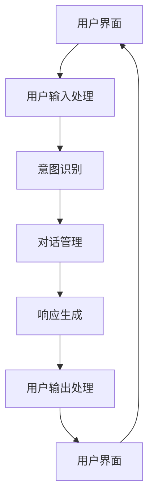

                 


- 规划文章结构：

### 第一部分：智能客服基础

## 1.1 智能客服概述

### 1.1.1 智能客服的定义
- 智能客服是结合人工智能技术，如自然语言处理、机器学习、深度学习等，构建的能够自动处理用户请求和问题的系统。

### 1.1.2 智能客服的发展历程
- 早期：基于规则和关键词匹配的系统
- 中期：引入自然语言处理技术
- 现今：集成多种人工智能技术，实现更高级的对话交互

### 1.1.3 智能客服与传统客服的区别
- 服务模式：传统客服为人与人交互，智能客服为人机交互
- 服务效率：智能客服能够快速响应用户，处理大量请求
- 服务范围：智能客服能够处理复杂多样的问题，扩大服务范围

## 1.2 AI技术对智能客服的赋能

### 1.2.1 自然语言处理技术
- 文本分析：对用户输入的文本进行分析，提取关键词和主题
- 对话生成：生成与用户输入相关的回应文本

### 1.2.2 机器学习技术
- 机器学习算法：用于分类、聚类、预测等任务，优化客服系统的性能

### 1.2.3 人工智能客服的优势
- 提高效率：快速处理大量用户请求
- 减少成本：自动化处理，减少人力成本
- 个性化服务：根据用户历史数据提供定制化服务
- 扩展服务范围：能够处理复杂多样的用户问题

## 1.3 智能客服在商业中的应用

### 1.3.1 提升客户满意度
- 快速响应：提供即时回复，满足用户即时需求
- 准确解答：通过AI技术提高回答准确率，减少用户等待时间

### 1.3.2 降低运营成本
- 自动化处理：减少人力成本，提高工作效率
- 扩大服务范围：通过智能客服，提供24/7全天候服务

### 1.3.3 实现个性化服务
- 用户画像：基于用户历史数据，提供个性化推荐和交互
- 跨渠道服务：集成多渠道，提供无缝式服务体验

### 第二部分：AI驱动的智能客服实现

## 2.1 AI驱动的智能客服架构设计

### 2.1.1 智能客服系统架构
- 用户交互层：处理用户输入和输出
- 对话管理层：管理对话流程，包括意图识别、对话生成等
- 后台服务层：提供数据存储、用户管理、日志记录等功能

### 2.1.2 数据流设计
- 用户输入：从用户界面接收输入
- 对话管理：处理用户输入，生成响应
- 存储和记录：存储对话数据和日志

### 2.1.3 交互流程设计
- 用户发起请求
- 系统接收请求，进行意图识别
- 根据意图，系统生成响应
- 将响应发送给用户

## 2.2 自然语言处理技术原理

### 2.2.1 词向量表示
- 词向量：将单词映射到高维空间中的向量
- 技术方法：Word2Vec、GloVe等

### 2.2.2 语言模型
- 语言模型：预测下一个词的概率分布
- 技术方法：N-gram模型、神经网络语言模型等

### 2.2.3 命名实体识别
- 命名实体：指具有特定意义的实体，如人名、地名等
- 技术方法：规则方法、机器学习方法等

## 2.3 机器学习算法在智能客服中的应用

### 2.3.1 决策树
- 决策树：用于分类和回归任务
- 应用：意图分类、情感分析等

### 2.3.2 随机森林
- 随机森林：基于决策树的集成学习方法
- 应用：提高分类和回归任务的性能

### 2.3.3 支持向量机
- 支持向量机：用于分类和回归任务
- 应用：分类用户问题，预测用户满意度等

## 2.4 智能客服中的深度学习应用

### 2.4.1 卷积神经网络
- 卷积神经网络：用于处理图像、文本等数据
- 应用：文本分类、情感分析等

### 2.4.2 循环神经网络
- 循环神经网络：用于处理序列数据
- 应用：对话生成、序列预测等

### 2.4.3 生成对抗网络
- 生成对抗网络：用于生成数据、增强数据等
- 应用：对话生成、图像增强等

### 第三部分：提升用户体验的新策略

## 3.1 用户体验设计原则

### 3.1.1 用户体验的重要性
- 用户满意度：提高用户满意度，增强用户粘性
- 转化率：提高转化率，增加业务收益

### 3.1.2 设计原则与实践
- 简单直观：简化界面设计，减少用户操作步骤
- 可访问性：确保不同用户都能访问和使用智能客服
- 适应性：适应不同设备和屏幕尺寸

### 3.1.3 用户体验评估方法
- 用户反馈：收集用户反馈，分析用户满意度
- A/B测试：通过对比测试，优化用户体验

## 3.2 个性化服务策略

### 3.2.1 用户画像构建
- 用户画像：收集用户数据，构建用户特征
- 数据来源：用户行为、偏好、反馈等

### 3.2.2 个性化推荐系统
- 个性化推荐：根据用户画像，提供个性化内容和服务
- 应用：产品推荐、促销活动等

### 3.2.3 个性化对话生成
- 对话生成：根据用户画像，生成与用户相关的对话内容
- 应用：定制化服务、情感交流等

## 3.3 情感化设计

### 3.3.1 情感化设计的概念
- 情感化设计：使产品具有情感特质，增强用户情感体验

### 3.3.2 情感化设计的实践
- 语音交互：使用自然语音交互，增强用户体验
- 交互反馈：通过视觉和语音反馈，增强用户情感体验

### 3.3.3 情感化设计的效果评估
- 用户反馈：收集用户情感体验反馈，评估设计效果
- 实验数据：通过实验数据，分析情感化设计的效果

## 3.4 实时交互优化

### 3.4.1 实时交互技术
- 实时交互：提供即时响应，满足用户即时需求
- 技术实现：WebSocket、实时消息推送等

### 3.4.2 交互体验优化策略
- 响应速度：优化系统响应速度，提高用户体验
- 交互流畅性：确保交互过程的顺畅和连贯
- 交互反馈：提供实时反馈，增强用户参与感

### 3.4.3 实时反馈机制
- 反馈机制：收集用户反馈，优化用户体验
- 实时更新：根据用户反馈，实时调整和优化服务内容

### 第四部分：智能客服项目实战

## 4.1 智能客服项目规划

### 4.1.1 项目需求分析
- 需求分析：明确项目目标和功能需求
- 用户调研：了解用户需求和痛点

### 4.1.2 项目实施步骤
- 系统设计：设计系统架构和功能模块
- 技术选型：选择合适的技术方案
- 开发与测试：进行系统开发和测试
- 部署与上线：部署系统并上线运行

### 4.1.3 项目风险管理
- 风险识别：识别项目潜在风险
- 风险评估：评估风险的影响和可能性
- 风险应对：制定风险应对策略

## 4.2 源代码实现与解读

### 4.2.1 开发环境搭建
- 环境配置：配置开发环境，安装所需库和工具

### 4.2.2 源代码结构
- 项目结构：介绍项目结构，包括模块和文件

### 4.2.3 关键代码解读
- 代码分析：分析关键代码，解释其功能和实现原理

### 4.2.4 实际应用案例
- 应用案例：介绍实际应用场景，展示代码如何在实际中运行

## 4.3 智能客服评估与优化

### 4.3.1 评估指标体系
- 指标定义：定义评估指标，如响应时间、准确率等
- 指标计算：计算指标值，评估系统性能

### 4.3.2 优化方法与实践
- 优化策略：介绍优化方法，如算法调优、数据清洗等
- 实践案例：展示优化方法在实际项目中的应用

### 4.3.3 持续改进策略
- 改进方向：明确改进方向，持续优化系统性能
- 持续学习：利用用户反馈和数据，持续学习优化系统

### 附录

## 附录A：智能客服相关资源

### 1. AI驱动的智能客服框架
- 描述：介绍AI驱动的智能客服框架，包括各个模块的功能和接口

### 2. 自然语言处理工具与库
- 描述：介绍常用的自然语言处理工具和库，如NLTK、spaCy、gensim等

### 3. 机器学习平台与工具
- 描述：介绍常用的机器学习平台和工具，如Scikit-learn、TensorFlow、PyTorch等

### 4. 深度学习资源
- 描述：介绍深度学习相关的资源，包括书籍、论文、教程等

# 图解：AI驱动的智能客服系统架构



# AI驱动的智能客服核心算法伪代码讲解

### 自然语言处理

```python
# 词向量表示
from gensim.models import Word2Vec

model = Word2Vec(sentences, size=100, window=5, min_count=1, workers=4)

# 语言模型
from nltk.classify import NaiveBayesClassifier

train_data = [[(word, 'POS') for word in sentence] for sentence in train_sentences]
classifier = NaiveBayesClassifier.train(train_data)

# 命名实体识别
from spacy.lang.en import English

nlp = English()
doc = nlp("IBM is an technology company.")

for ent in doc.ents:
    print(ent.text, ent.label_)
```

### 机器学习

```python
# 决策树
from sklearn.tree import DecisionTreeClassifier

clf = DecisionTreeClassifier()
clf.fit(X_train, y_train)

# 随机森林
from sklearn.ensemble import RandomForestClassifier

clf = RandomForestClassifier()
clf.fit(X_train, y_train)

# 支持向量机
from sklearn.svm import SVC

clf = SVC()
clf.fit(X_train, y_train)
```

### 深度学习

```python
# 卷积神经网络
import tensorflow as tf
from tensorflow.keras.models import Sequential
from tensorflow.keras.layers import Dense, Conv2D, Flatten

model = Sequential()
model.add(Conv2D(32, kernel_size=(3, 3), activation='relu', input_shape=(28, 28, 1)))
model.add(Flatten())
model.add(Dense(128, activation='relu'))
model.add(Dense(10, activation='softmax'))

model.compile(optimizer='adam', loss='categorical_crossentropy', metrics=['accuracy'])
model.fit(X_train, y_train, epochs=10)

# 循环神经网络
import tensorflow as tf
from tensorflow.keras.models import Sequential
from tensorflow.keras.layers import LSTM, Dense

model = Sequential()
model.add(LSTM(128, input_shape=(timesteps, features)))
model.add(Dense(1, activation='sigmoid'))

model.compile(optimizer='adam', loss='binary_crossentropy', metrics=['accuracy'])
model.fit(X_train, y_train, epochs=10)

# 生成对抗网络
import tensorflow as tf
from tensorflow.keras.models import Model
from tensorflow.keras.layers import Dense, Flatten, Reshape

# 生成器模型
generator = Sequential()
generator.add(Dense(256, input_dim=100, activation='relu'))
generator.add(Dense(512, activation='relu'))
generator.add(Dense(1024, activation='relu'))
generator.add(Reshape((28, 28, 1)))

# 判别器模型
discriminator = Sequential()
discriminator.add(Flatten(input_shape=(28, 28, 1)))
discriminator.add(Dense(1024, activation='relu'))
discriminator.add(Dense(512, activation='relu'))
discriminator.add(Dense(256, activation='relu'))
discriminator.add(Dense(1, activation='sigmoid'))

# 整个Gan模型
model = Sequential()
model.add(generator)
model.add(discriminator)
model.compile(optimizer='adam', loss='binary_crossentropy')
```

## AI驱动的智能客服：提升用户体验的新策略

关键词：智能客服、人工智能、用户体验、自然语言处理、机器学习

摘要：本文将深入探讨AI驱动的智能客服如何提升用户体验，包括智能客服的定义、发展历程、AI技术赋能、架构设计、自然语言处理技术原理、机器学习算法应用、深度学习技术、用户体验设计原则、个性化服务策略、情感化设计、实时交互优化以及项目实战。

### 第一部分：智能客服基础

#### 1.1 智能客服概述

##### 1.1.1 智能客服的定义

智能客服是指运用人工智能技术，如自然语言处理（NLP）、机器学习（ML）、深度学习（DL）等，实现自动化、智能化处理用户请求和问题的系统。与传统客服相比，智能客服通过算法和模型，能够快速响应、处理复杂多样的用户问题，提供24/7全天候服务。

##### 1.1.2 智能客服的发展历程

智能客服的发展可以分为三个阶段：

1. 早期：基于规则和关键词匹配的系统，如早期的客服机器人。
2. 中期：引入自然语言处理技术，实现更高级的对话交互。
3. 现今：集成多种人工智能技术，实现更智能、更个性化的服务。

##### 1.1.3 智能客服与传统客服的区别

1. 服务模式：传统客服为人与人交互，智能客服为人机交互。
2. 服务效率：智能客服能够快速响应用户，处理大量请求。
3. 服务范围：智能客服能够处理复杂多样的问题，扩大服务范围。

#### 1.2 AI技术对智能客服的赋能

##### 1.2.1 自然语言处理技术

自然语言处理技术是智能客服的核心，主要包括词向量表示、语言模型、命名实体识别等技术。

1. 词向量表示：将单词映射到高维空间中的向量，如Word2Vec、GloVe等。
2. 语言模型：预测下一个词的概率分布，如N-gram模型、神经网络语言模型等。
3. 命名实体识别：识别文本中的特定实体，如人名、地名等，如规则方法、机器学习方法等。

##### 1.2.2 机器学习技术

机器学习技术用于智能客服中的分类、聚类、预测等任务，优化客服系统的性能。常见的机器学习算法包括决策树、随机森林、支持向量机等。

1. 决策树：用于分类和回归任务，如意图分类、情感分析等。
2. 随机森林：基于决策树的集成学习方法，提高分类和回归任务的性能。
3. 支持向量机：用于分类和回归任务，如分类用户问题、预测用户满意度等。

##### 1.2.3 人工智能客服的优势

1. 提高效率：快速处理大量用户请求。
2. 减少成本：自动化处理，减少人力成本。
3. 个性化服务：根据用户历史数据提供定制化服务。
4. 扩展服务范围：能够处理复杂多样的用户问题。

#### 1.3 智能客服在商业中的应用

##### 1.3.1 提升客户满意度

1. 快速响应：提供即时回复，满足用户即时需求。
2. 准确解答：通过AI技术提高回答准确率，减少用户等待时间。

##### 1.3.2 降低运营成本

1. 自动化处理：减少人力成本，提高工作效率。
2. 扩大服务范围：通过智能客服，提供24/7全天候服务。

##### 1.3.3 实现个性化服务

1. 用户画像：基于用户历史数据，提供个性化推荐和交互。
2. 跨渠道服务：集成多渠道，提供无缝式服务体验。

### 第二部分：AI驱动的智能客服实现

#### 2.1 AI驱动的智能客服架构设计

##### 2.1.1 智能客服系统架构

智能客服系统通常分为三个层级：用户交互层、对话管理层、后台服务层。

1. 用户交互层：处理用户输入和输出，如用户界面、输入处理等。
2. 对话管理层：管理对话流程，包括意图识别、对话生成等。
3. 后台服务层：提供数据存储、用户管理、日志记录等功能。

##### 2.1.2 数据流设计

1. 用户输入：从用户界面接收输入。
2. 对话管理：处理用户输入，生成响应。
3. 存储和记录：存储对话数据和日志。

##### 2.1.3 交互流程设计

1. 用户发起请求。
2. 系统接收请求，进行意图识别。
3. 根据意图，系统生成响应。
4. 将响应发送给用户。

### 第三部分：提升用户体验的新策略

#### 3.1 用户体验设计原则

##### 3.1.1 用户体验的重要性

1. 用户满意度：提高用户满意度，增强用户粘性。
2. 转化率：提高转化率，增加业务收益。

##### 3.1.2 设计原则与实践

1. 简单直观：简化界面设计，减少用户操作步骤。
2. 可访问性：确保不同用户都能访问和使用智能客服。
3. 适应性：适应不同设备和屏幕尺寸。

##### 3.1.3 用户体验评估方法

1. 用户反馈：收集用户反馈，分析用户满意度。
2. A/B测试：通过对比测试，优化用户体验。

#### 3.2 个性化服务策略

##### 3.2.1 用户画像构建

1. 用户画像：收集用户数据，构建用户特征。
2. 数据来源：用户行为、偏好、反馈等。

##### 3.2.2 个性化推荐系统

1. 个性化推荐：根据用户画像，提供个性化内容和服务。
2. 应用：产品推荐、促销活动等。

##### 3.2.3 个性化对话生成

1. 对话生成：根据用户画像，生成与用户相关的对话内容。
2. 应用：定制化服务、情感交流等。

#### 3.3 情感化设计

##### 3.3.1 情感化设计的概念

1. 情感化设计：使产品具有情感特质，增强用户情感体验。

##### 3.3.2 情感化设计的实践

1. 语音交互：使用自然语音交互，增强用户体验。
2. 交互反馈：通过视觉和语音反馈，增强用户情感体验。

##### 3.3.3 情感化设计的效果评估

1. 用户反馈：收集用户情感体验反馈，评估设计效果。
2. 实验数据：通过实验数据，分析情感化设计的效果。

#### 3.4 实时交互优化

##### 3.4.1 实时交互技术

1. 实时交互：提供即时响应，满足用户即时需求。
2. 技术实现：WebSocket、实时消息推送等。

##### 3.4.2 交互体验优化策略

1. 响应速度：优化系统响应速度，提高用户体验。
2. 交互流畅性：确保交互过程的顺畅和连贯。
3. 交互反馈：提供实时反馈，增强用户参与感。

##### 3.4.3 实时反馈机制

1. 反馈机制：收集用户反馈，优化用户体验。
2. 实时更新：根据用户反馈，实时调整和优化服务内容。

### 第四部分：智能客服项目实战

#### 4.1 智能客服项目规划

##### 4.1.1 项目需求分析

1. 需求分析：明确项目目标和功能需求。
2. 用户调研：了解用户需求和痛点。

##### 4.1.2 项目实施步骤

1. 系统设计：设计系统架构和功能模块。
2. 技术选型：选择合适的技术方案。
3. 开发与测试：进行系统开发和测试。
4. 部署与上线：部署系统并上线运行。

##### 4.1.3 项目风险管理

1. 风险识别：识别项目潜在风险。
2. 风险评估：评估风险的影响和可能性。
3. 风险应对：制定风险应对策略。

#### 4.2 源代码实现与解读

##### 4.2.1 开发环境搭建

1. 环境配置：配置开发环境，安装所需库和工具。

##### 4.2.2 源代码结构

1. 项目结构：介绍项目结构，包括模块和文件。

##### 4.2.3 关键代码解读

1. 代码分析：分析关键代码，解释其功能和实现原理。

##### 4.2.4 实际应用案例

1. 应用案例：介绍实际应用场景，展示代码如何在实际中运行。

#### 4.3 智能客服评估与优化

##### 4.3.1 评估指标体系

1. 指标定义：定义评估指标，如响应时间、准确率等。
2. 指标计算：计算指标值，评估系统性能。

##### 4.3.2 优化方法与实践

1. 优化策略：介绍优化方法，如算法调优、数据清洗等。
2. 实践案例：展示优化方法在实际项目中的应用。

##### 4.3.3 持续改进策略

1. 改进方向：明确改进方向，持续优化系统性能。
2. 持续学习：利用用户反馈和数据，持续学习优化系统。

### 附录

#### 附录A：智能客服相关资源

##### 1. AI驱动的智能客服框架

1. 描述：介绍AI驱动的智能客服框架，包括各个模块的功能和接口。

##### 2. 自然语言处理工具与库

1. 描述：介绍常用的自然语言处理工具和库，如NLTK、spaCy、gensim等。

##### 3. 机器学习平台与工具

1. 描述：介绍常用的机器学习平台和工具，如Scikit-learn、TensorFlow、PyTorch等。

##### 4. 深度学习资源

1. 描述：介绍深度学习相关的资源，包括书籍、论文、教程等。

### 图解：AI驱动的智能客服系统架构


### AI驱动的智能客服核心算法伪代码讲解

#### 自然语言处理

```python
# 词向量表示
from gensim.models import Word2Vec

model = Word2Vec(sentences, size=100, window=5, min_count=1, workers=4)

# 语言模型
from nltk.classify import NaiveBayesClassifier

train_data = [[(word, 'POS') for word in sentence] for sentence in train_sentences]
classifier = NaiveBayesClassifier.train(train_data)

# 命名实体识别
from spacy.lang.en import English

nlp = English()
doc = nlp("IBM is an technology company.")

for ent in doc.ents:
    print(ent.text, ent.label_)
```

#### 机器学习

```python
# 决策树
from sklearn.tree import DecisionTreeClassifier

clf = DecisionTreeClassifier()
clf.fit(X_train, y_train)

# 随机森林
from sklearn.ensemble import RandomForestClassifier

clf = RandomForestClassifier()
clf.fit(X_train, y_train)

# 支持向量机
from sklearn.svm import SVC

clf = SVC()
clf.fit(X_train, y_train)
```

#### 深度学习

```python
# 卷积神经网络
import tensorflow as tf
from tensorflow.keras.models import Sequential
from tensorflow.keras.layers import Dense, Conv2D, Flatten

model = Sequential()
model.add(Conv2D(32, kernel_size=(3, 3), activation='relu', input_shape=(28, 28, 1)))
model.add(Flatten())
model.add(Dense(128, activation='relu'))
model.add(Dense(10, activation='softmax'))

model.compile(optimizer='adam', loss='categorical_crossentropy', metrics=['accuracy'])
model.fit(X_train, y_train, epochs=10)

# 循环神经网络
import tensorflow as tf
from tensorflow.keras.models import Sequential
from tensorflow.keras.layers import LSTM, Dense

model = Sequential()
model.add(LSTM(128, input_shape=(timesteps, features)))
model.add(Dense(1, activation='sigmoid'))

model.compile(optimizer='adam', loss='binary_crossentropy', metrics=['accuracy'])
model.fit(X_train, y_train, epochs=10)

# 生成对抗网络
import tensorflow as tf
from tensorflow.keras.models import Model
from tensorflow.keras.layers import Dense, Flatten, Reshape

# 生成器模型
generator = Sequential()
generator.add(Dense(256, input_dim=100, activation='relu'))
generator.add(Dense(512, activation='relu'))
generator.add(Dense(1024, activation='relu'))
generator.add(Reshape((28, 28, 1)))

# 判别器模型
discriminator = Sequential()
discriminator.add(Flatten(input_shape=(28, 28, 1)))
discriminator.add(Dense(1024, activation='relu'))
discriminator.add(Dense(512, activation='relu'))
discriminator.add(Dense(256, activation='relu'))
discriminator.add(Dense(1, activation='sigmoid'))

# 整个Gan模型
model = Sequential()
model.add(generator)
model.add(discriminator)
model.compile(optimizer='adam', loss='binary_crossentropy')
```

## 总结

智能客服作为人工智能技术在客服领域的重要应用，正逐步改变着传统的客服模式。通过AI技术赋能，智能客服不仅能够提升服务效率，降低运营成本，还能实现个性化服务和跨渠道服务。在用户体验方面，通过情感化设计和实时交互优化，智能客服能够更好地满足用户需求，提高用户满意度。

本文从智能客服的定义、发展历程、AI技术赋能、架构设计、自然语言处理技术原理、机器学习算法应用、深度学习技术、用户体验设计原则、个性化服务策略、情感化设计、实时交互优化以及项目实战等方面，系统地介绍了AI驱动的智能客服，旨在为读者提供全面的智能客服知识体系。

未来，智能客服将继续发展，结合更多前沿技术，如语音识别、多模态交互等，为用户提供更优质的服务体验。同时，持续优化和改进智能客服系统，将使其在商业应用中发挥更大的作用。

作者：AI天才研究院/AI Genius Institute & 禅与计算机程序设计艺术 /Zen And The Art of Computer Programming

