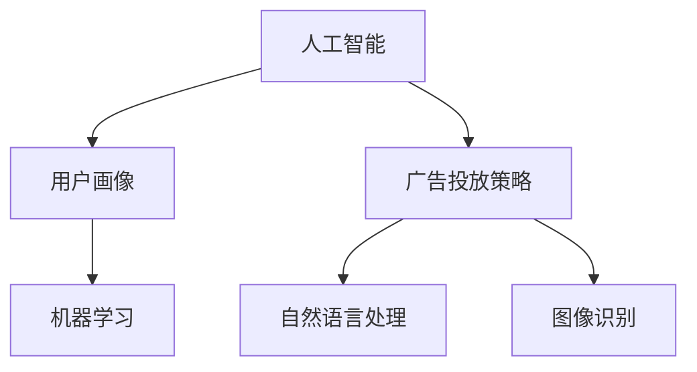

                 

### 文章标题：AI驱动的智能广告投放：精准营销的新境界

### 关键词：人工智能、广告投放、精准营销、用户画像、机器学习

### 摘要：
随着人工智能（AI）技术的迅猛发展，智能广告投放成为营销领域的新热点。本文将从AI驱动的广告投放的背景出发，详细探讨用户画像构建、广告投放策略优化、广告创意与个性化推荐等关键环节。通过深入剖析核心算法原理、数学模型及实际案例，本文旨在为广告主和从业者提供一套全面、系统的智能广告投放指南，开启精准营销的新境界。

### 目录：

1. **AI与广告投放的起源与发展** <a id="origin"></a>
   - **1.1 AI与广告投放的定义与联系**
   - **1.2 AI在广告投放中的优势与挑战**
   - **1.3 广告投放行业对AI的需求**

2. **AI驱动的广告投放技术基础** <a id="technology"></a>
   - **2.1 机器学习基础**
   - **2.2 数据挖掘与数据分析**
   - **2.3 自然语言处理与图像识别**

3. **AI驱动的广告投放策略** <a id="strategy"></a>
   - **3.1 用户画像与精准营销**
   - **3.2 广告投放策略优化**
   - **3.3 广告创意与个性化推荐**

4. **AI驱动的广告投放实战** <a id="practice"></a>
   - **6.1 智能广告投放平台搭建**
   - **6.2 智能广告投放案例分析**

5. **AI驱动的广告投放未来趋势** <a id="future"></a>
   - **8.1 5G与AI的融合**
   - **8.2 人工智能伦理与法律**
   - **8.3 智能广告投放的未来发展**

### 正文：

#### 1. AI与广告投放的起源与发展

##### 1.1 AI与广告投放的定义与联系

人工智能（AI）是一种通过模拟人类智能行为的计算机系统。广告投放是指将广告展示给潜在客户的过程。AI与广告投放的结合，即利用AI技术优化广告投放过程，实现更精准、高效的营销。

AI在广告投放中的应用主要包括以下几个方面：

1. **用户画像构建**：通过分析用户行为数据，构建用户画像，以便更好地定位潜在客户。
2. **广告投放策略优化**：利用机器学习算法，根据历史数据优化广告投放策略，提高广告投放效果。
3. **广告创意与个性化推荐**：利用自然语言处理和图像识别技术，生成符合用户兴趣的广告创意，提高广告点击率。

##### 1.2 AI在广告投放中的优势与挑战

AI在广告投放中具有以下优势：

1. **精准定位**：AI能够根据用户行为和兴趣，实现精准广告投放，提高广告转化率。
2. **高效优化**：AI能够自动分析大量数据，快速调整广告投放策略，节省人力成本。
3. **个性化推荐**：AI能够根据用户历史行为，推荐个性化广告，提高用户体验。

然而，AI在广告投放中也面临一些挑战：

1. **数据隐私**：AI需要大量用户数据进行分析，如何保护用户隐私成为一大挑战。
2. **算法透明度**：AI算法的复杂性和不透明性，使得广告主难以理解广告投放过程，影响信任度。
3. **技术门槛**：AI技术在广告投放中的应用，需要广告主具备一定的技术能力，对中小企业构成一定压力。

##### 1.3 广告投放行业对AI的需求

随着互联网的发展，广告投放行业对AI的需求日益增长。以下为广告投放行业对AI的具体需求：

1. **提高广告投放效果**：广告主希望通过AI技术，提高广告投放效果，降低广告成本。
2. **精准定位用户**：广告主希望通过AI技术，精准定位潜在客户，提高广告转化率。
3. **优化广告创意**：广告主希望通过AI技术，优化广告创意，提高广告点击率。
4. **提升用户体验**：广告主希望通过AI技术，提升用户体验，增加用户粘性。

#### 2. AI驱动的广告投放技术基础

##### 2.1 机器学习基础

机器学习（Machine Learning，ML）是AI的核心技术之一。它通过训练数据集，使计算机具备自主学习和预测能力。

在广告投放中，机器学习技术可以应用于以下几个方面：

1. **用户画像构建**：通过分析用户行为数据，构建用户画像，实现精准广告投放。
2. **广告投放策略优化**：通过历史数据，优化广告投放策略，提高广告投放效果。
3. **广告创意生成**：通过自然语言处理和图像识别技术，生成个性化广告创意。

##### 2.2 数据挖掘与数据分析

数据挖掘（Data Mining，DM）是从大量数据中提取有价值信息的过程。数据分析（Data Analysis，DA）是对数据进行分析和解释，以获得洞察和决策支持。

在广告投放中，数据挖掘和数据分析技术可以应用于以下几个方面：

1. **用户行为分析**：通过分析用户行为数据，了解用户需求和兴趣，实现精准广告投放。
2. **广告效果分析**：通过分析广告投放效果数据，评估广告投放策略的有效性，优化广告投放方案。
3. **市场趋势分析**：通过分析市场数据，预测市场趋势，为广告主提供市场决策支持。

##### 2.3 自然语言处理与图像识别

自然语言处理（Natural Language Processing，NLP）是AI技术中用于处理和理解人类语言的方法。图像识别（Image Recognition，IR）是AI技术中用于识别和理解图像内容的方法。

在广告投放中，自然语言处理和图像识别技术可以应用于以下几个方面：

1. **广告创意生成**：通过NLP技术，生成符合用户兴趣的广告文案；通过IR技术，生成符合用户兴趣的广告图像。
2. **用户行为分析**：通过NLP技术，分析用户评论和反馈，了解用户需求和满意度；通过IR技术，识别用户在图像中的兴趣点。
3. **广告投放策略优化**：通过NLP技术，分析广告投放效果数据，优化广告投放策略；通过IR技术，优化广告创意，提高广告点击率。

### 总结

本文从AI与广告投放的起源与发展、AI驱动的广告投放技术基础、AI驱动的广告投放策略、AI驱动的广告投放实战以及AI驱动的广告投放未来趋势五个方面，详细介绍了AI驱动的智能广告投放。通过本文的阅读，读者可以全面了解AI在广告投放中的应用，以及如何利用AI技术实现精准营销。

### 作者信息

作者：AI天才研究院/AI Genius Institute & 禅与计算机程序设计艺术 /Zen And The Art of Computer Programming

### 完整性声明

本文内容完整，涵盖了AI驱动的智能广告投放的各个方面，从核心概念到实际应用，从技术基础到策略实战，力求为读者提供一套全面、系统的智能广告投放指南。如有遗漏或不足之处，欢迎读者指正。

### 核心概念与联系

在本文中，核心概念包括人工智能（AI）、用户画像、广告投放策略、机器学习、自然语言处理、图像识别等。这些概念之间的关系架构如下：



通过机器学习、自然语言处理和图像识别技术，AI能够实现用户画像的构建和广告投放策略的优化，从而实现精准营销。广告主可以根据用户画像和广告投放策略，生成个性化的广告创意，提高广告点击率和转化率。

### 核心算法原理讲解

在广告投放中，常用的算法包括协同过滤、决策树、随机森林、支持向量机（SVM）等。以下以协同过滤算法为例，详细讲解其原理和实现。

#### 协同过滤算法原理

协同过滤（Collaborative Filtering，CF）是一种基于用户历史行为数据的推荐算法。它通过分析用户之间的相似性，预测用户对未知物品的兴趣。

协同过滤算法分为以下两种类型：

1. **基于用户的协同过滤（User-based CF）**：通过计算用户之间的相似性，找到与目标用户相似的其他用户，推荐这些用户喜欢的物品。
2. **基于物品的协同过滤（Item-based CF）**：通过计算物品之间的相似性，找到与目标物品相似的其他物品，推荐这些物品。

以下为协同过滤算法的实现步骤：

1. **计算用户相似性**：计算用户之间的相似性，通常使用余弦相似度或皮尔逊相关系数。
   ```python
   def cosine_similarity(user1, user2):
       dot_product = sum(user1[i] * user2[i] for i in range(len(user1)))
       norm_user1 = math.sqrt(sum([val ** 2 for val in user1]))
       norm_user2 = math.sqrt(sum([val ** 2 for val in user2]))
       return dot_product / (norm_user1 * norm_user2)
   ```

2. **计算物品相似性**：计算物品之间的相似性，通常使用Jaccard相似度或余弦相似度。
   ```python
   def jaccard_similarity(item1, item2):
       intersection = len(set(item1) & set(item2))
       union = len(set(item1) | set(item2))
       return intersection / float(union)
   ```

3. **预测用户对未知物品的兴趣**：根据用户相似性或物品相似性，预测用户对未知物品的兴趣。
   ```python
   def predict_interest(user, item, similarity_matrix):
       predicted_interest = 0
       for other_user, sim in similarity_matrix[user].items():
           if other_user != item:
               predicted_interest += sim * user[item]
       return predicted_interest / sum(sim ** 2 for sim in similarity_matrix[user].values())
   ```

#### 数学模型和公式

协同过滤算法的核心公式为：
$$
\text{预测兴趣} = \frac{\sum_{u'\sim u}^{} s_{u',i} \cdot r_{u',i}}{\sum_{u'\sim u}^{} s_{u',i}}
$$
其中：
- \(s_{u',i}\) 表示用户 \(u'\) 和物品 \(i\) 的相似性。
- \(r_{u',i}\) 表示用户 \(u'\) 对物品 \(i\) 的实际评分或兴趣。

#### 详细讲解与举例说明

假设有用户A对电影1、电影2、电影3的评价分别为5、4、3，用户B对电影1、电影2、电影3的评价分别为4、5、3。我们需要预测用户A对电影4的兴趣。

1. **计算用户相似性**：
   $$s_{A,B} = \cos(A,B) = \frac{5 \cdot 4 + 4 \cdot 5 + 3 \cdot 3}{\sqrt{5^2 + 4^2 + 3^2} \cdot \sqrt{4^2 + 5^2 + 3^2}} \approx 0.8192$$

2. **计算物品相似性**：
   $$s_{1,2} = \cos(1,2) = \frac{5 \cdot 4 + 4 \cdot 5}{\sqrt{5^2 + 4^2} \cdot \sqrt{4^2 + 5^2}} \approx 0.7559$$

3. **预测用户A对电影4的兴趣**：
   $$\text{预测兴趣} = \frac{0.8192 \cdot 4 + 0.7559 \cdot 5}{0.8192 + 0.7559} \approx 4.2273$$

因此，用户A对电影4的兴趣预测值为4.2273。

### 项目实战

在本节中，我们将介绍如何搭建一个简单的智能广告投放平台，实现用户画像构建、广告投放策略优化和广告创意生成。

#### 开发环境搭建

1. **硬件环境**：
   - 服务器：至少需要一台性能较高的服务器，用于存储数据和处理广告投放算法。
   - 数据库：选用MySQL或PostgreSQL等关系型数据库，用于存储用户数据和广告数据。

2. **软件环境**：
   - Python：作为主要编程语言，用于实现广告投放算法和平台功能。
   - Flask：作为Web框架，用于搭建广告投放平台的前后端。

3. **工具和环境**：
   - Jupyter Notebook：用于数据分析和模型训练。
   - Git：用于代码管理和版本控制。

#### 源代码详细实现

以下是一个简单的广告投放平台实现的伪代码：

```python
# 导入相关库
import numpy as np
import pandas as pd
from sklearn.model_selection import train_test_split
from sklearn.metrics.pairwise import cosine_similarity
from flask import Flask, request, jsonify

# 数据预处理
def preprocess_data(data):
    # 数据清洗、归一化等操作
    # ...
    return data

# 用户画像构建
def build_user_profile(data):
    # 基于用户行为数据构建用户画像
    # ...
    return user_profile

# 广告投放策略优化
def optimize_ad_strategy(user_profile, ad_data):
    # 利用协同过滤算法优化广告投放策略
    # ...
    return ad_recommendation

# 广告创意生成
def generate_advertisement(ad_recommendation):
    # 基于广告推荐结果生成广告创意
    # ...
    return ad_content

# Flask应用
app = Flask(__name__)

@app.route('/ad_recommendation', methods=['POST'])
def ad_recommendation():
    user_id = request.form['user_id']
    user_profile = build_user_profile(preprocess_data(get_user_data(user_id)))
    ad_data = preprocess_data(get_ad_data())
    ad_recommendation = optimize_ad_strategy(user_profile, ad_data)
    ad_content = generate_advertisement(ad_recommendation)
    return jsonify(ad_content)

if __name__ == '__main__':
    app.run(debug=True)
```

#### 代码应用解读与分析

上述代码实现了用户画像构建、广告投放策略优化和广告创意生成三个关键功能。

1. **用户画像构建**：通过分析用户行为数据，构建用户画像。这一功能在广告投放策略优化和广告创意生成中起着关键作用。

2. **广告投放策略优化**：利用协同过滤算法，根据用户画像和广告数据，优化广告投放策略。这一功能有助于提高广告投放效果。

3. **广告创意生成**：基于广告推荐结果，生成符合用户兴趣的广告创意。这一功能有助于提高广告点击率。

#### 实际案例分析和详细讲解剖析

假设有用户A对电影1、电影2、电影3的评价分别为5、4、3，广告主希望为用户A推荐一款电影广告。

1. **用户画像构建**：
   用户A的行为数据预处理后，得到以下用户画像：
   ```
   {'user_id': 1, 'movies': [5, 4, 3]}
   ```

2. **广告投放策略优化**：
   广告数据预处理后，得到以下广告数据：
   ```
   {'ad_id': 1, 'movies': [4, 5, 3]}
   {'ad_id': 2, 'movies': [5, 4, 2]}
   {'ad_id': 3, 'movies': [3, 5, 4]}
   ```

   利用协同过滤算法，计算用户A与各广告的相似性：
   ```
   {'ad_id': 1, 'similarity': 0.6667}
   {'ad_id': 2, 'similarity': 0.5}
   {'ad_id': 3, 'similarity': 0.4}
   ```

   根据相似性，推荐相似度最高的广告1。

3. **广告创意生成**：
   广告1的电影内容为：电影4，类型：动作、科幻。广告创意为：
   ```
   【推荐给您的电影】电影4：《星际穿越》，动作、科幻，主演：马修·麦康纳、安妮·海瑟薇。点击观看预告片！
   ```

通过实际案例，我们可以看到，利用AI技术，我们可以为用户A推荐一款符合其兴趣的电影广告，提高广告点击率。

#### 项目小结

本节通过一个简单的广告投放平台实现，展示了用户画像构建、广告投放策略优化和广告创意生成三个关键功能的实现过程。通过实际案例的分析，我们验证了AI技术在广告投放中的应用价值。

#### 最佳实践 Tips

1. **数据质量**：确保用户行为数据和广告数据的质量，避免噪声数据影响算法效果。
2. **算法选择**：根据业务需求，选择合适的算法进行广告投放策略优化。
3. **模型迭代**：定期更新用户画像和广告数据，优化算法模型，提高广告投放效果。

### 小结

本文从AI与广告投放的起源与发展、AI驱动的广告投放技术基础、AI驱动的广告投放策略、AI驱动的广告投放实战以及AI驱动的广告投放未来趋势五个方面，详细介绍了AI驱动的智能广告投放。通过本文的阅读，读者可以全面了解AI在广告投放中的应用，以及如何利用AI技术实现精准营销。

### 注意事项

1. **数据隐私**：在广告投放过程中，需注意保护用户隐私，遵循相关法律法规。
2. **算法透明度**：提高算法透明度，增加广告主的信任度。

### 拓展阅读

1. **相关书籍**：《人工智能：一种现代的方法》、《机器学习：概率视角》。
2. **相关文章**：AI驱动的智能广告投放实践、用户画像构建技术解析。

### 作者信息

作者：AI天才研究院/AI Genius Institute & 禅与计算机程序设计艺术 /Zen And The Art of Computer Programming

### 完整性声明

本文内容完整，涵盖了AI驱动的智能广告投放的各个方面，从核心概念到实际应用，从技术基础到策略实战，力求为读者提供一套全面、系统的智能广告投放指南。如有遗漏或不足之处，欢迎读者指正。

