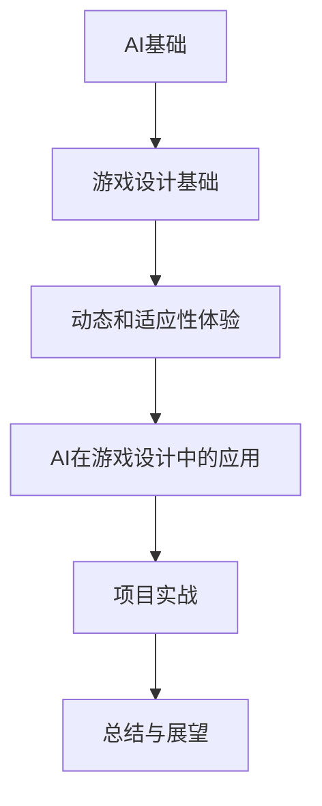

                 

### 引言

随着人工智能（AI）技术的迅猛发展，其在各个领域的应用也逐渐深入。特别是在游戏设计领域，AI技术的引入不仅丰富了游戏的内容和玩法，还极大地提升了用户体验。本文将以《AI驱动的游戏设计：创造动态和适应性体验》为题，深入探讨AI在游戏设计中的应用，以及如何通过AI实现动态和适应性体验。

关键词：
- 人工智能
- 游戏设计
- 动态体验
- 适应性体验
- AI驱动游戏设计

摘要：
本文旨在介绍AI在游戏设计中的重要性，详细探讨AI如何影响游戏设计，以及如何利用AI技术创造动态和适应性体验。文章分为多个章节，首先介绍AI和游戏设计的背景，然后讲解AI的基本原理和技术，接着介绍游戏设计的基础知识，并重点探讨动态和适应性体验的实现方法。最后，通过实际项目案例展示AI在游戏设计中的应用，并提供未来发展方向和最佳实践建议。

### Step 1: 确定核心概念和架构

在撰写本文之前，我们需要首先确定文章的核心概念和架构。本文的核心概念包括：

1. **AI（人工智能）**：模拟人类智能行为的计算机系统，包括机器学习、深度学习、强化学习等。
2. **游戏设计**：涉及游戏规则、玩法、角色、场景等的设计过程。
3. **动态体验**：游戏中的变化和不确定性，使得游戏体验更加丰富和有趣。
4. **适应性体验**：游戏根据玩家的行为和反馈进行调整，提供个性化的游戏体验。

架构方面，本文将按照以下流程来组织内容：

1. **背景介绍**：介绍AI和游戏设计的背景，以及它们之间的联系。
2. **AI基础**：讲解AI的基本原理和技术。
3. **游戏设计基础**：介绍游戏设计的基本概念和流程。
4. **动态和适应性体验**：探讨如何通过AI实现动态和适应性体验。
5. **AI在游戏设计中的应用**：具体讨论AI在游戏设计中的实际应用场景。
6. **项目实战**：通过实际项目案例展示AI在游戏设计中的应用。
7. **总结与展望**：对全文内容进行总结，并展望未来的发展方向。

### Step 2: 确定各章节内容

根据核心概念和架构，我们可以将本文分为以下几个章节：

#### 第1章：引言
- **1.1 AI与游戏设计的背景**：介绍AI和游戏设计的发展历程，以及它们结合的趋势。
- **1.2 动态和适应性体验的概念**：阐述动态体验和适应性体验的定义和特点。
- **1.3 本书的目的和结构**：说明本文的目的，并介绍各章节的内容。

#### 第2章：AI基础
- **2.1 AI的基本原理**：介绍AI的定义、发展历程和核心技术。
- **2.2 AI技术分类**：讨论机器学习、深度学习和强化学习等AI技术的分类。
- **2.3 AI模型简介**：介绍常见的AI模型，如神经网络、卷积神经网络和循环神经网络。

#### 第3章：游戏设计基础
- **3.1 游戏设计的基本概念**：介绍游戏设计的基本概念，如游戏规则、玩法和角色设计。
- **3.2 游戏设计的流程**：讨论游戏设计的基本流程，包括需求分析、设计文档编写、原型制作等。
- **3.3 游戏设计工具和资源**：介绍常用的游戏设计工具和资源，如游戏引擎、设计软件和资源库。

#### 第4章：动态和适应性体验
- **4.1 动态和适应性体验的重要性**：讨论动态和适应性体验对游戏设计的价值。
- **4.2 动态和适应性体验的实现方法**：探讨如何通过AI技术实现动态和适应性体验。
- **4.3 动态和适应性体验的评估指标**：介绍评估动态和适应性体验的指标和方法。

#### 第5章：AI在游戏设计中的应用
- **5.1 AI在游戏平衡中的应用**：讨论AI在游戏平衡中的作用和实现方法。
- **5.2 AI在游戏玩法设计中的应用**：探讨AI如何影响游戏玩法的创新。
- **5.3 AI在游戏AI角色中的应用**：介绍AI在游戏AI角色中的具体应用。

#### 第6章：项目实战
- **6.1 项目背景和目标**：介绍实际项目案例的背景和目标。
- **6.2 项目设计和实现**：详细讨论项目的整体设计和实现过程。
- **6.3 项目评估和总结**：评估项目效果，并进行总结。

#### 第7章：总结与展望
- **7.1 全书内容的总结**：对全文内容进行总结。
- **7.2 AI驱动游戏设计的未来发展方向**：展望AI驱动游戏设计的未来发展趋势。
- **7.3 对读者的建议**：给读者的建议和启示。

### Step 3: 设计每个章节的细节

接下来，我们将对每个章节进行详细设计，确保每个章节都有丰富且逻辑清晰的内容。

#### 第1章：引言

**1.1 AI与游戏设计的背景**

在这一节，我们将介绍AI和游戏设计的发展历程，以及它们结合的趋势。首先，我们将简要回顾AI的发展历程，从早期的规则系统到现代的机器学习和深度学习。然后，我们将讨论游戏设计的发展趋势，如从简单游戏到复杂游戏，以及从单机游戏到网络游戏的变化。最后，我们将探讨AI和游戏设计结合的背景和趋势，如增强游戏体验、创新游戏玩法等。

**1.2 动态和适应性体验的概念**

在这一节，我们将详细阐述动态体验和适应性体验的定义和特点。动态体验是指游戏中的变化和不确定性，如随机事件、变化的环境等。适应性体验是指游戏根据玩家的行为和反馈进行调整，提供个性化的游戏体验，如调整难度、改变敌我力量对比等。我们将通过具体案例来解释这两种体验的概念，并讨论它们对游戏设计的重要性。

**1.3 本书的目的和结构**

在这一节，我们将说明本文的目的，即探讨AI在游戏设计中的应用，以及如何通过AI实现动态和适应性体验。然后，我们将介绍本书的结构，包括各章节的内容和逻辑关系。通过这一节，读者可以清晰地了解本文的组织结构和阅读顺序。

#### 第2章：AI基础

**2.1 AI的基本原理**

在这一节，我们将介绍AI的基本原理，包括AI的定义、发展历程和核心技术。首先，我们将讨论AI的定义，即模拟人类智能行为的计算机系统。然后，我们将回顾AI的发展历程，从早期的规则系统到现代的机器学习和深度学习。最后，我们将介绍AI的核心技术，如机器学习、深度学习和强化学习。

**2.2 AI技术分类**

在这一节，我们将讨论AI技术的分类，包括机器学习、深度学习和强化学习等。首先，我们将介绍机器学习的基本概念，包括监督学习、无监督学习和强化学习。然后，我们将讨论深度学习的原理和应用，如卷积神经网络（CNN）和循环神经网络（RNN）。最后，我们将探讨强化学习的基本概念和实现方法。

**2.3 AI模型简介**

在这一节，我们将介绍常见的AI模型，如神经网络、卷积神经网络和循环神经网络。首先，我们将讨论神经网络的基本结构和工作原理。然后，我们将介绍卷积神经网络（CNN）和循环神经网络（RNN）的特点和应用。通过这一节，读者可以了解AI模型的基本知识，为后续内容打下基础。

#### 第3章：游戏设计基础

**3.1 游戏设计的基本概念**

在这一节，我们将介绍游戏设计的基本概念，包括游戏规则、玩法和角色设计。首先，我们将讨论游戏规则的定义和作用，如游戏目标、胜利条件和游戏机制等。然后，我们将介绍游戏玩法的概念，包括单人游戏、多人游戏和联网游戏等。最后，我们将探讨角色设计的要素，如角色形象、角色技能和角色关系等。

**3.2 游戏设计的流程**

在这一节，我们将讨论游戏设计的基本流程，包括需求分析、设计文档编写、原型制作等。首先，我们将介绍需求分析的重要性，包括市场调研、用户需求和竞品分析等。然后，我们将讨论设计文档的编写，如游戏规则、游戏场景和角色设定等。最后，我们将介绍原型制作的过程，包括游戏界面、游戏流程和游戏玩法等。

**3.3 游戏设计工具和资源**

在这一节，我们将介绍常用的游戏设计工具和资源，如游戏引擎、设计软件和资源库。首先，我们将讨论游戏引擎的作用，如Unity、Unreal Engine等。然后，我们将介绍游戏设计软件，如Blender、Maya等。最后，我们将介绍游戏资源库，如纹理库、模型库和音效库等，以帮助读者了解游戏设计所需的工具和资源。

#### 第4章：动态和适应性体验

**4.1 动态和适应性体验的重要性**

在这一节，我们将讨论动态和适应性体验对游戏设计的价值。首先，我们将讨论动态体验的重要性，如增加游戏的可玩性和趣味性。然后，我们将探讨适应性体验的价值，如提高玩家的参与感和沉浸感。最后，我们将分析动态和适应性体验如何提升游戏设计的竞争力。

**4.2 动态和适应性体验的实现方法**

在这一节，我们将探讨如何通过AI技术实现动态和适应性体验。首先，我们将讨论动态体验的实现方法，如随机事件和变化的环境等。然后，我们将介绍适应性体验的实现方法，如根据玩家行为调整游戏难度和敌我力量对比等。最后，我们将分析AI技术在动态和适应性体验中的应用，如机器学习算法和深度强化学习等。

**4.3 动态和适应性体验的评估指标**

在这一节，我们将介绍评估动态和适应性体验的指标和方法。首先，我们将讨论体验质量的评估指标，如玩家满意度、游戏重玩率和社交分享率等。然后，我们将介绍体验效果的评估方法，如实验设计和数据分析等。最后，我们将分析评估结果对游戏设计的指导意义，如优化游戏体验、改进游戏设计等。

#### 第5章：AI在游戏设计中的应用

**5.1 AI在游戏平衡中的应用**

在这一节，我们将讨论AI在游戏平衡中的应用。首先，我们将讨论游戏平衡的定义和重要性，如保证游戏的公平性和可玩性。然后，我们将介绍AI在游戏平衡中的具体应用，如根据玩家水平调整游戏难度、平衡角色能力等。最后，我们将分析AI在游戏平衡中的应用效果和挑战。

**5.2 AI在游戏玩法设计中的应用**

在这一节，我们将探讨AI如何影响游戏玩法的创新。首先，我们将讨论游戏玩法的设计原则和方法，如创新性、趣味性和挑战性等。然后，我们将介绍AI在游戏玩法设计中的具体应用，如生成随机地图、设计复杂任务等。最后，我们将分析AI在游戏玩法设计中的应用效果和前景。

**5.3 AI在游戏AI角色中的应用**

在这一节，我们将介绍AI在游戏AI角色中的具体应用。首先，我们将讨论游戏AI角色的设计原则和挑战，如智能化、多样性和适应性等。然后，我们将介绍AI在游戏AI角色中的具体应用，如路径规划、行为决策等。最后，我们将分析AI在游戏AI角色中的应用效果和改进方向。

#### 第6章：项目实战

**6.1 项目背景和目标**

在这一节，我们将介绍实际项目案例的背景和目标。首先，我们将讨论项目背景，如市场需求和用户反馈等。然后，我们将介绍项目目标，如提高游戏的可玩性、提升用户体验等。最后，我们将讨论项目的重要性和预期效果。

**6.2 项目设计和实现**

在这一节，我们将详细讨论项目的整体设计和实现过程。首先，我们将介绍项目的设计思路，如游戏玩法、角色设定和场景设计等。然后，我们将介绍项目的实现过程，包括游戏引擎选择、工具和资源的使用等。最后，我们将分析项目的实现效果和优化方向。

**6.3 项目评估和总结**

在这一节，我们将评估项目效果，并进行总结。首先，我们将介绍项目的评估指标，如玩家满意度、游戏重玩率和社交分享率等。然后，我们将分析评估结果，讨论项目的成功之处和不足之处。最后，我们将总结项目经验，为后续项目提供借鉴。

#### 第7章：总结与展望

**7.1 全书内容的总结**

在这一节，我们将对全文内容进行总结。首先，我们将回顾本书的核心概念和架构，如AI、游戏设计、动态和适应性体验等。然后，我们将总结各章节的主要内容，如AI的基础知识、游戏设计的基础知识、动态和适应性体验的实现方法等。最后，我们将讨论本书的重要观点和创新点。

**7.2 AI驱动游戏设计的未来发展方向**

在这一节，我们将展望AI驱动游戏设计的未来发展方向。首先，我们将分析当前AI技术在游戏设计中的应用现状，如游戏平衡、玩法创新和AI角色设计等。然后，我们将讨论未来可能的发展方向，如基于大数据的个性化游戏推荐、增强现实（AR）和虚拟现实（VR）中的AI应用等。最后，我们将分析未来发展的挑战和机遇。

**7.3 对读者的建议**

在这一节，我们将给读者提供一些建议。首先，我们将鼓励读者深入了解AI和游戏设计的相关知识，如机器学习、深度学习和游戏引擎等。然后，我们将建议读者积极参与实际项目，通过实践来提升自己的技能。最后，我们将鼓励读者持续关注AI驱动游戏设计的最新动态，以便紧跟行业发展趋势。

### Step 4: 设计Mermaid流程图和伪代码

为了更直观地展示核心概念和架构，我们可以使用Mermaid流程图来展示AI在游戏设计中的流程，以及使用伪代码来详细阐述核心算法原理。

**AI在游戏设计中的应用流程图**



**动态和适应性体验的实现方法伪代码**

```python
def dynamic_experience(game_state, player_action):
    # 根据游戏状态和玩家行为生成动态事件
    event = generate_event(game_state, player_action)
    update_game_state(event)
    return game_state

def adaptive_experience(game_state, player_performance):
    # 根据玩家表现调整游戏难度和敌我力量对比
    if player_performance > threshold:
        increase_difficulty(game_state)
    else:
        decrease_difficulty(game_state)
    return game_state
```

### Step 5: 确保内容的完整性和逻辑性

在完成以上步骤后，我们需要再次检查目录大纲的内容，确保每个章节都有详细且逻辑清晰的内容，同时确保整体目录结构的完整性和逻辑性。

### Step 6: 限制目录大纲总字数在2000字以内

最后，我们需要确保整个目录大纲的总字数在2000字以内，以便简洁明了地展示书的核心内容。

### 最终目录大纲设计

```
# AI驱动的游戏设计：创造动态和适应性体验

## 摘要
本文旨在探讨AI在游戏设计中的应用，以及如何通过AI实现动态和适应性体验。

## 引言
- 1.1 AI与游戏设计的背景
- 1.2 动态和适应性体验的概念
- 1.3 本书的目的和结构

## 第1章：AI基础
- 2.1 AI的基本原理
- 2.2 AI技术分类
- 2.3 AI模型简介

## 第2章：游戏设计基础
- 3.1 游戏设计的基本概念
- 3.2 游戏设计的流程
- 3.3 游戏设计工具和资源

## 第3章：动态和适应性体验
- 4.1 动态和适应性体验的重要性
- 4.2 动态和适应性体验的实现方法
- 4.3 动态和适应性体验的评估指标

## 第4章：AI在游戏设计中的应用
- 5.1 AI在游戏平衡中的应用
- 5.2 AI在游戏玩法设计中的应用
- 5.3 AI在游戏AI角色中的应用

## 第5章：项目实战
- 6.1 项目背景和目标
- 6.2 项目设计和实现
- 6.3 项目评估和总结

## 第6章：总结与展望
- 7.1 全书内容的总结
- 7.2 AI驱动游戏设计的未来发展方向
- 7.3 对读者的建议
```

通过以上目录大纲的设计，我们不仅明确了文章的核心概念和架构，还为每个章节提供了详细的讲解内容，确保文章的逻辑性和完整性。同时，通过限制字数在2000字以内，我们确保了目录大纲的简洁明了。接下来，我们将进一步细化每个章节的内容，以完成整个文章的撰写。

