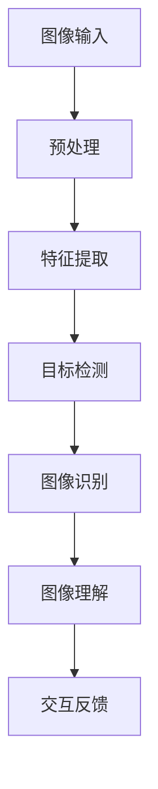
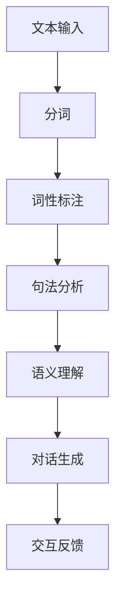
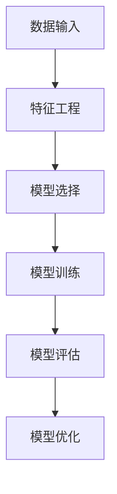
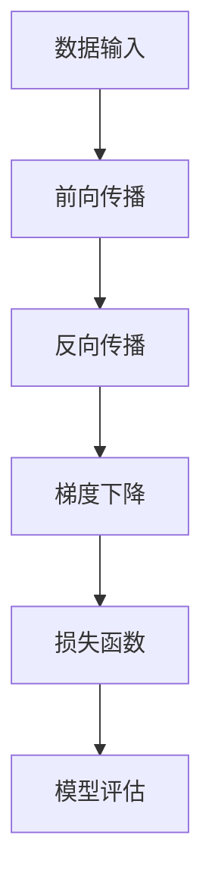

                 

# AI驱动的虚拟现实：创造沉浸式体验的新维度

## 关键词
- 虚拟现实
- 人工智能
- 计算机视觉
- 自然语言处理
- 深度学习
- 沉浸式体验

## 摘要
本文深入探讨了AI驱动的虚拟现实技术，揭示了虚拟现实与人工智能融合的核心概念和原理。首先，我们回顾了虚拟现实和人工智能的发展历程，分析了它们之间的联系。接着，我们详细介绍了计算机视觉、自然语言处理和机器学习与深度学习在虚拟现实中的应用，通过伪代码和流程图展示了关键算法原理。最后，我们讨论了AI驱动虚拟现实面临的挑战与机遇，并提出了未来发展的建议。通过本文，读者将全面了解AI如何为虚拟现实创造全新的沉浸式体验。

---

### 第1章: AI驱动的虚拟现实：核心概念与联系

#### 1.1 虚拟现实与AI的融合

##### 1.1.1 虚拟现实的定义与历史发展

**1.1.1.1 虚拟现实的基本概念**

虚拟现实（Virtual Reality，VR）是一种通过计算机技术生成模拟环境，使用户沉浸在其中的一种技术。它通常通过头戴式显示器（HMD）、数据手套、位置跟踪器等设备实现。VR的核心是提供一种模拟的、沉浸式的体验，使用户感觉仿佛置身于一个虚拟的世界。

**1.1.1.2 虚拟现实技术的发展历程**

虚拟现实技术的发展可以分为三个阶段：1.0阶段主要关注硬件设备的研发，如VR头戴设备；2.0阶段注重内容的开发，包括游戏、教育和娱乐等；3.0阶段则是AI与VR的深度融合，实现智能交互和自适应体验。

**1.1.1.3 虚拟现实的未来趋势**

未来，虚拟现实技术将继续向高分辨率、低延迟、更加沉浸式和智能化的方向发展。此外，VR与增强现实（AR）和混合现实（MR）的融合也将成为重要趋势。

##### 1.1.2 AI的核心概念

**1.1.2.1 人工智能的基本概念**

人工智能（Artificial Intelligence，AI）是计算机科学的一个分支，旨在研究如何使计算机模拟人类的智能行为。AI的目标是让计算机具备学习、推理、感知和解决问题的能力。

**1.1.2.2 人工智能的发展历程**

人工智能的发展经历了几个阶段：从早期的符号主义、连接主义到现代的深度学习和强化学习。每个阶段都有其独特的贡献和挑战。

**1.1.2.3 人工智能的关键技术**

人工智能的关键技术包括计算机视觉、自然语言处理、机器学习和深度学习等。这些技术共同推动了AI在各个领域的发展。

##### 1.1.3 虚拟现实与AI的融合原理

**1.1.3.1 虚拟现实与AI融合的意义**

虚拟现实与人工智能的融合具有重要的意义。它不仅能够提升虚拟现实的沉浸感和互动性，还可以为AI提供丰富的数据集，从而加速AI技术的发展。

**1.1.3.2 虚拟现实与AI融合的技术基础**

虚拟现实与AI的融合依赖于多个技术，包括高性能计算、大数据处理和实时交互等。这些技术的结合为虚拟现实提供了强大的支撑。

**1.1.3.3 虚拟现实与AI融合的应用场景**

虚拟现实与AI的融合在多个领域有着广泛的应用，如游戏、教育、医疗、军事和工业设计等。通过AI技术，虚拟现实的应用场景将变得更加多样化和智能化。

##### 1.1.4 虚拟现实与AI融合的挑战与机遇

**1.1.4.1 挑战**

- **技术瓶颈**：目前，虚拟现实与AI的融合仍面临技术上的挑战，如实时计算能力、数据隐私和安全性等。
- **安全性问题**：虚拟现实中的智能交互可能带来新的安全隐患。
- **隐私保护**：用户在虚拟世界中的行为数据如何保护也是一个重要问题。

**1.1.4.2 机遇**

- **新的业务模式**：虚拟现实与AI的融合将创造新的商业模式和机会。
- **提升用户体验**：通过AI技术，虚拟现实的沉浸感和互动性将大幅提升。
- **创新的应用领域**：虚拟现实与AI的融合将推动新的应用领域的出现。

##### 1.1.5 小结

本章介绍了AI驱动的虚拟现实的核心概念和原理。通过分析虚拟现实和人工智能的发展历程，我们揭示了它们之间的联系。同时，我们探讨了虚拟现实与AI融合的技术基础、应用场景以及面临的挑战与机遇。本章的内容为后续章节的讨论奠定了基础。

##### 1.1.5.1 本章要点

- 虚拟现实与人工智能的定义和发展历程
- 虚拟现实与AI融合的意义和原理
- 虚拟现实与AI融合的应用场景和挑战

##### 1.1.5.2 下一步阅读建议

在了解了AI驱动的虚拟现实的核心概念和原理后，读者可以进一步阅读第2章，深入了解AI在虚拟现实中的应用，包括计算机视觉、自然语言处理和机器学习与深度学习等。

### 第2章: AI驱动的虚拟现实：核心算法原理

#### 2.1 计算机视觉在虚拟现实中的应用

##### 2.1.1 视觉感知原理

计算机视觉是AI的一个重要分支，它致力于使计算机能够像人类一样理解和解释视觉信息。在虚拟现实中，计算机视觉的作用至关重要，它负责处理从虚拟环境或真实世界捕获的图像数据，实现对环境的感知和理解。

**1. 视觉感知流程：**

- **图像输入**：虚拟现实系统通过摄像头或头戴显示器捕获图像。
- **预处理**：对图像进行灰度转换、去噪、对比度增强等处理。
- **特征提取**：从图像中提取关键特征，如边缘、角点、纹理等。
- **目标检测**：在图像中定位和识别目标物体。
- **图像识别**：对识别出的物体进行分类和标注。
- **图像理解**：分析图像内容，提取语义信息。
- **交互反馈**：根据图像理解结果，生成交互反馈。

以下是一个简化的Mermaid流程图，展示了计算机视觉在虚拟现实中的流程：



##### 2.1.2 计算机视觉算法框架

为了实现计算机视觉功能，需要设计一个算法框架。以下是一个伪代码示例，用于描述计算机视觉算法的基本流程：

```python
# 伪代码：计算机视觉算法框架
def computer_vision(image):
    image = preprocess(image)
    features = extract_features(image)
    object = detect_object(features)
    label = recognize_object(object)
    understand = understand_image(label)
    feedback = generate_feedback(understand)
    return feedback
```

**2. 伪代码解释：**

- `preprocess(image)`: 对图像进行预处理，如灰度转换、去噪等。
- `extract_features(image)`: 从图像中提取关键特征。
- `detect_object(features)`: 在特征图像中检测目标物体。
- `recognize_object(object)`: 对检测到的物体进行分类和标注。
- `understand_image(label)`: 分析图像内容，提取语义信息。
- `generate_feedback(understand)`: 根据图像理解结果生成交互反馈。

##### 2.1.3 计算机视觉在虚拟现实中的应用

计算机视觉在虚拟现实中的应用非常广泛，以下是一些典型的应用场景：

- **场景重建**：通过计算机视觉技术，可以从现实世界的图像中重建三维场景，为虚拟现实提供基础。
- **动作捕捉**：利用计算机视觉技术捕捉用户动作，实现虚拟环境中的交互。
- **物体识别**：在虚拟环境中识别和分类物体，为用户提供丰富的交互体验。
- **环境感知**：通过计算机视觉技术，虚拟现实系统可以感知和理解虚拟环境，提高沉浸感。

##### 2.2 自然语言处理在虚拟现实中的应用

自然语言处理（Natural Language Processing，NLP）是AI的另一个重要分支，它致力于使计算机理解和生成人类语言。在虚拟现实中，NLP技术可以用于实现智能对话系统、语音识别、文本分析等功能，从而提高用户体验。

**1. 语言理解原理：**

- **分词**：将文本分割成词语。
- **词性标注**：为每个词语标注词性，如名词、动词等。
- **句法分析**：分析句子的结构，理解句子的语法关系。
- **语义理解**：从语义角度理解句子，提取句子的含义。
- **对话生成**：根据语义理解，生成自然语言的响应。

以下是一个简化的Mermaid流程图，展示了自然语言处理的流程：



**2. 伪代码示例：**

```python
# 伪代码：自然语言处理算法框架
def natural_language_processing(text):
    words = tokenize(text)
    tokens = annotate_words(words)
    syntax = parse_sentence(tokens)
    semantics = understand_semantics(syntax)
    response = generate_response(semantics)
    feedback = generate_feedback(response)
    return feedback
```

**3. 伪代码解释：**

- `tokenize(text)`: 将文本分割成词语。
- `annotate_words(words)`: 为每个词语标注词性。
- `parse_sentence(tokens)`: 分析句子的结构。
- `understand_semantics(syntax)`: 从语义角度理解句子。
- `generate_response(semantics)`: 根据语义理解生成响应。
- `generate_feedback(response)`: 根据响应生成交互反馈。

##### 2.2.2 自然语言处理在虚拟现实中的应用

自然语言处理在虚拟现实中的应用同样非常广泛，以下是一些典型的应用场景：

- **智能对话系统**：虚拟现实系统可以理解用户的语音指令，提供智能对话服务。
- **语音识别**：将用户的语音转化为文本，实现语音输入功能。
- **文本分析**：分析用户的文本输入，提取关键信息。
- **情感识别**：通过文本分析，识别用户的情感状态，提供个性化服务。

##### 2.3 机器学习与深度学习在虚拟现实中的应用

机器学习（Machine Learning，ML）和深度学习（Deep Learning，DL）是AI的核心技术，它们在虚拟现实中的应用同样具有重要意义。机器学习可以用于模式识别、预测分析和分类任务，而深度学习则通过构建多层神经网络实现复杂特征提取和模式识别。

**1. 机器学习原理：**

- **数据输入**：输入大量标记好的训练数据。
- **特征工程**：提取数据中的关键特征。
- **模型选择**：选择合适的机器学习模型。
- **模型训练**：使用训练数据训练模型。
- **模型评估**：评估模型性能。
- **模型优化**：根据评估结果优化模型。

以下是一个简化的Mermaid流程图，展示了机器学习的流程：



**2. 伪代码示例：**

```python
# 伪代码：机器学习算法框架
def machine_learning(data):
    features = feature_engineering(data)
    model = select_model()
    model = train_model(features, model)
    performance = evaluate_model(model)
    model = optimize_model(performance, model)
    return model
```

**3. 伪代码解释：**

- `feature_engineering(data)`: 提取数据中的关键特征。
- `select_model()`: 选择合适的机器学习模型。
- `train_model(features, model)`: 使用训练数据训练模型。
- `evaluate_model(model)`: 评估模型性能。
- `optimize_model(performance, model)`: 根据评估结果优化模型。

**4. 深度学习原理：**

- **数据输入**：输入大量标记好的训练数据。
- **前向传播**：通过多层神经网络进行特征提取。
- **反向传播**：根据输出结果计算损失，更新网络权重。
- **梯度下降**：使用梯度下降算法优化网络参数。
- **损失函数**：评估模型预测结果与真实结果之间的误差。
- **模型评估**：评估模型性能。

以下是一个简化的Mermaid流程图，展示了深度学习的流程：



**5. 伪代码示例：**

```python
# 伪代码：深度学习算法框架
def deep_learning(data):
    forward_pass(data)
    backward_pass()
    gradient_descent()
    loss = calculate_loss()
    performance = evaluate_model()
    return performance
```

**6. 伪代码解释：**

- `forward_pass(data)`: 通过多层神经网络进行特征提取。
- `backward_pass()`: 根据输出结果计算损失，更新网络权重。
- `gradient_descent()`: 使用梯度下降算法优化网络参数。
- `calculate_loss()`: 评估模型预测结果与真实结果之间的误差。
- `evaluate_model()`: 评估模型性能。

##### 2.3.2 机器学习与深度学习在虚拟现实中的应用

机器学习和深度学习在虚拟现实中的应用包括：

- **场景预测**：通过分析历史数据，预测虚拟环境中的用户行为和场景变化。
- **图像生成**：利用生成对抗网络（GAN）生成虚拟场景和物体。
- **交互优化**：根据用户的交互历史，优化虚拟交互体验。
- **内容推荐**：根据用户的兴趣和行为，推荐虚拟内容。

##### 2.4 小结

本章详细介绍了AI驱动的虚拟现实的核心算法原理，包括计算机视觉、自然语言处理和机器学习与深度学习。通过伪代码和流程图，我们展示了这些算法的基本框架和实现方法。这些算法在虚拟现实中的应用，不仅提升了虚拟现实的沉浸感和互动性，还为AI技术的发展提供了新的机遇。在接下来的章节中，我们将进一步探讨AI驱动虚拟现实面临的挑战与机遇，以及未来的发展趋势。

##### 2.4.1 本章要点

- 计算机视觉、自然语言处理和机器学习与深度学习在虚拟现实中的应用。
- 伪代码示例，展示关键算法原理和实现方法。
- 虚拟现实中的核心算法原理及其应用场景。

##### 2.4.2 下一步阅读建议

在了解了AI驱动的虚拟现实的核心算法原理后，读者可以进一步阅读第3章，探讨AI驱动虚拟现实面临的挑战与机遇，以及未来的发展趋势。

### 第3章: AI驱动的虚拟现实：挑战与机遇

#### 3.1 虚拟现实与AI融合的挑战

尽管AI驱动的虚拟现实具有巨大的潜力，但在实际应用过程中仍然面临一系列挑战。

**1. 技术瓶颈：**

- **计算能力**：虚拟现实与AI融合需要强大的计算资源，尤其在处理高分辨率图像和实时交互时，对计算能力的要求非常高。
- **数据处理**：虚拟现实系统生成和接收的数据量庞大，如何高效处理这些数据是当前面临的一个重要挑战。
- **延迟问题**：实时交互对延迟要求极高，任何延迟都可能导致用户体验不佳。

**2. 安全性问题：**

- **隐私保护**：虚拟现实中的用户数据包括个人隐私信息，如何保护这些数据不被泄露是一个重要问题。
- **数据安全**：虚拟现实系统中的数据可能成为黑客攻击的目标，确保数据安全是一个关键挑战。

**3. 隐私保护：**

- **用户隐私**：虚拟现实应用需要收集大量用户数据，如何保护用户隐私是一个重要议题。
- **数据共享**：如何在保护隐私的同时，实现数据的共享和利用也是一个挑战。

**4. 新的业务模式：**

- **商业模式创新**：AI驱动的虚拟现实可能会改变传统的业务模式，如何适应这些变化是一个挑战。

#### 3.2 虚拟现实与AI融合的机遇

尽管面临挑战，AI驱动的虚拟现实同样带来了巨大的机遇。

**1. 提升用户体验：**

- **沉浸感增强**：AI技术可以实时分析用户行为和情绪，提供个性化的沉浸式体验。
- **交互性提升**：通过AI技术，虚拟现实中的交互性将大幅提升，用户可以更加自然地与虚拟环境互动。

**2. 创新的应用领域：**

- **游戏与娱乐**：AI驱动的虚拟现实可以为游戏和娱乐领域带来全新的体验。
- **教育与培训**：虚拟现实结合AI技术，可以提供更加生动、互动的教学内容。
- **医疗与康复**：AI驱动的虚拟现实在医疗康复中的应用具有巨大潜力。

**3. 新的业务模式：**

- **虚拟空间服务**：AI驱动的虚拟现实可以创建虚拟空间，为商业活动提供新的平台。
- **远程协作**：虚拟现实与AI的结合可以实现更加高效的远程协作。

#### 3.3 挑战与机遇的平衡

为了充分发挥AI驱动的虚拟现实的潜力，我们需要在挑战与机遇之间寻找平衡。

**1. 技术创新：**

- **计算能力提升**：通过技术创新，提升计算能力和数据处理效率，解决技术瓶颈。
- **安全性保障**：研发新的安全技术和加密算法，保护用户数据和隐私。

**2. 法规与政策：**

- **隐私保护法规**：制定更加完善的隐私保护法规，规范虚拟现实与AI的应用。
- **行业自律**：推动行业内部自律，共同维护数据安全和用户隐私。

**3. 人才培养：**

- **跨学科教育**：培养具有跨学科背景的人才，推动虚拟现实与AI技术的发展。
- **持续学习**：鼓励科研人员和从业人员持续学习，紧跟技术发展趋势。

#### 3.4 小结

AI驱动的虚拟现实面临着诸多挑战，但同时也带来了前所未有的机遇。通过技术创新、法规保障和人才培养，我们可以充分发挥AI驱动的虚拟现实的潜力，为人类创造更加美好的未来。

##### 3.4.1 本章要点

- AI驱动的虚拟现实面临的挑战：技术瓶颈、安全性和隐私保护。
- AI驱动的虚拟现实的机遇：提升用户体验、创新的应用领域和新的业务模式。
- 平衡挑战与机遇的方法：技术创新、法规保障和人才培养。

##### 3.4.2 下一步阅读建议

在了解了AI驱动的虚拟现实面临的挑战与机遇后，读者可以进一步阅读第4章，探讨AI驱动的虚拟现实在不同领域的应用案例，以及未来的发展趋势。

### 第4章: AI驱动的虚拟现实：应用案例与未来展望

#### 4.1 游戏与娱乐

**AI驱动的虚拟现实在游戏和娱乐领域的应用：**

- **个性化游戏体验**：通过AI技术，游戏可以实时分析玩家的行为和偏好，为玩家提供个性化的游戏内容和体验。
- **智能NPC**：虚拟现实中的非玩家角色（NPC）可以利用AI技术实现更加智能和互动的行为，提高游戏的可玩性和沉浸感。
- **场景生成与优化**：AI技术可以自动生成和优化游戏场景，提供更加逼真的视觉效果和交互体验。

**未来展望：**

- **跨平台互动**：随着AI技术的不断发展，未来的虚拟现实游戏将可以实现跨平台的互动，玩家可以在不同的设备上无缝切换游戏体验。
- **情感互动**：通过情感识别技术，游戏可以理解玩家的情感状态，提供更加个性化的情感互动体验。

#### 4.2 教育与培训

**AI驱动的虚拟现实在教育与培训领域的应用：**

- **虚拟实验室**：虚拟现实技术可以创建虚拟实验室，让学生在虚拟环境中进行实验和操作，提高实践能力。
- **个性化教学**：通过AI技术，教育系统可以实时分析学生的学习情况和偏好，提供个性化的教学方案。
- **远程培训**：虚拟现实技术可以用于远程培训，提高培训的效率和互动性。

**未来展望：**

- **沉浸式学习**：随着虚拟现实技术的不断发展，未来的教育将变得更加沉浸式和互动性，为学生提供更加生动和有趣的学习体验。
- **智能教育平台**：通过AI技术，教育平台可以自动分析学生的学习情况，提供智能化的教学建议和资源推荐。

#### 4.3 医疗与康复

**AI驱动的虚拟现实在医疗与康复领域的应用：**

- **虚拟手术**：通过虚拟现实技术，医生可以在虚拟环境中进行手术模拟，提高手术的准确性和安全性。
- **康复训练**：虚拟现实技术可以为康复患者提供个性化的康复训练，帮助他们更快地恢复身体功能。
- **心理健康治疗**：虚拟现实技术可以用于心理健康的治疗，如恐惧症和焦虑症的治疗，提供一个安全、可控的治疗环境。

**未来展望：**

- **远程医疗**：通过AI驱动的虚拟现实技术，可以实现远程医疗，为偏远地区的患者提供高质量的医疗服务。
- **个性化医疗**：AI技术可以帮助医生分析大量的医疗数据，提供个性化的诊断和治疗建议，提高医疗效果。

#### 4.4 军事与国防

**AI驱动的虚拟现实在军事与国防领域的应用：**

- **战术模拟**：通过虚拟现实技术，军队可以进行战术模拟和演练，提高战术水平和作战能力。
- **训练与培训**：虚拟现实技术可以用于军事训练和培训，提供更加真实和有效的训练环境。
- **装备测试**：虚拟现实技术可以用于装备测试和评估，提高装备的研发和测试效率。

**未来展望：**

- **智能战场**：随着AI技术的不断发展，未来的战场将变得更加智能化，虚拟现实技术将在其中发挥重要作用。
- **无人作战**：通过AI驱动的虚拟现实技术，可以实现无人作战，提高军事行动的效率和安全性。

#### 4.5 商业与营销

**AI驱动的虚拟现实在商业与营销领域的应用：**

- **虚拟商场**：通过虚拟现实技术，商家可以创建虚拟商场，提供沉浸式的购物体验。
- **产品展示**：虚拟现实技术可以用于产品展示和演示，提高产品的可视化和交互性。
- **市场调研**：通过虚拟现实技术，企业可以模拟不同的市场环境和场景，进行市场调研和预测。

**未来展望：**

- **数字化营销**：随着虚拟现实技术的不断发展，未来的营销将变得更加数字化和沉浸式，为企业提供更加有效的营销手段。
- **个性化服务**：通过AI技术，虚拟现实可以为用户提供个性化的服务和体验，提高用户满意度和忠诚度。

#### 4.6 小结

AI驱动的虚拟现实在多个领域都有着广泛的应用，从游戏和娱乐到教育、医疗、军事和商业，它正在改变我们的生活方式和工作方式。通过技术创新和不断探索，AI驱动的虚拟现实将继续为人类创造更多的价值。

##### 4.6.1 本章要点

- AI驱动的虚拟现实在不同领域的应用案例。
- 虚拟现实技术为各领域带来的变革和创新。
- 虚拟现实技术的未来发展趋势和展望。

##### 4.6.2 下一步阅读建议

在了解了AI驱动的虚拟现实的应用案例和未来展望后，读者可以进一步阅读第5章，探讨AI驱动的虚拟现实在实际开发中的具体实现和最佳实践。

### 第5章: AI驱动的虚拟现实：开发实践与最佳实践

#### 5.1 开发环境搭建

要开发AI驱动的虚拟现实应用，首先需要搭建一个合适的开发环境。以下是一个典型的开发环境搭建步骤：

**1. 硬件选择：**

- **计算机配置**：选择具有高性能计算能力的计算机，推荐配备NVIDIA GPU的桌面电脑。
- **虚拟现实设备**：选择合适的虚拟现实设备，如Oculus Rift、HTC Vive或Valve Index等。
- **其他设备**：可能还需要其他辅助设备，如运动传感器、手柄等。

**2. 软件安装：**

- **操作系统**：安装Windows 10或更高版本的操作系统。
- **开发工具**：安装Unity、Unreal Engine等游戏开发引擎，以及Visual Studio等开发环境。
- **AI库**：安装Python和相关的AI库，如TensorFlow、PyTorch等。

**3. 环境配置：**

- **环境变量**：配置Python和AI库的环境变量，确保能够顺利运行AI模型。
- **依赖安装**：安装项目所需的依赖库和工具。

**4. 调试与测试：**

- **硬件测试**：确保虚拟现实设备正常运行，如头戴显示器、手柄等。
- **软件测试**：在开发环境中运行项目，检查是否有编译错误或运行问题。

#### 5.2 源代码实现

以下是一个简单的AI驱动的虚拟现实项目的源代码实现示例，展示了如何使用Unity引擎和Python进行AI模型的集成。

```csharp
// Unity C#脚本：与AI模型交互
using System.Collections;
using System.Collections.Generic;
using UnityEngine;

public class AIController : MonoBehaviour
{
    // AI模型接口
    public AIModel aiModel;

    // 更新AI模型输入
    void UpdateAIInput()
    {
        // 从虚拟现实环境中获取数据
        Vector3 position = Camera.main.transform.position;
        Quaternion rotation = Camera.main.transform.rotation;

        // 将数据传递给AI模型
        aiModel.UpdateInput(position, rotation);
    }

    // 处理AI模型输出
    void ProcessAIOutput()
    {
        // 获取AI模型的输出结果
        float output = aiModel.GetOutput();

        // 根据输出结果更新虚拟现实环境
        UpdateEnvironment(output);
    }

    // 更新虚拟现实环境的函数
    void UpdateEnvironment(float output)
    {
        // 示例：根据输出结果调整光照强度
        Light mainLight = GameObject.Find("MainLight").GetComponent<Light>();
        mainLight.intensity = output;
    }

    // 定时更新AI模型输入和输出
    void Update()
    {
        UpdateAIInput();
        ProcessAIOutput();
    }
}

// Python AI模型示例
import torch
import torch.nn as nn
import torch.optim as optim

# AI模型定义
class AIModel(nn.Module):
    def __init__(self):
        super(AIModel, self).__init__()
        self.model = nn.Sequential(
            nn.Linear(6, 128),
            nn.ReLU(),
            nn.Linear(128, 128),
            nn.ReLU(),
            nn.Linear(128, 1)
        )

    def forward(self, input):
        return self.model(input)

    def UpdateInput(self, position, rotation):
        # 将输入数据转换为Tensor
        position_tensor = torch.tensor([position.x, position.y, position.z])
        rotation_tensor = torch.tensor([rotation.x, rotation.y, rotation.z, rotation.w])
        input_tensor = torch.cat((position_tensor, rotation_tensor), 0)
        
        # 更新模型输入
        self.optimizer.zero_grad()
        output = self(input_tensor)
        loss = (output - 1) ** 2
        loss.backward()
        self.optimizer.step()

    def GetOutput(self):
        # 返回模型输出
        return self.model(torch.tensor([1.0]))
```

**代码解析：**

- **Unity C#脚本**：负责与虚拟现实环境交互，获取环境数据，更新AI模型输入，并处理AI模型输出，更新虚拟现实环境。
- **Python AI模型**：使用PyTorch框架定义一个简单的神经网络模型，用于接收输入数据并输出结果。

#### 5.3 代码解读与分析

**1. AI模型集成：**

- **数据预处理**：将虚拟现实环境中的数据（如位置、旋转等）转换为Tensor，准备用于神经网络训练。
- **模型训练**：使用训练数据训练神经网络模型，通过反向传播算法更新模型权重。
- **模型评估**：使用测试数据评估模型性能，调整模型结构和参数。

**2. 虚拟现实交互：**

- **输入获取**：从虚拟现实环境中实时获取用户输入，如位置、旋转等。
- **输出处理**：将AI模型的输出结果转换为虚拟现实环境中的可操作数据，如光照强度、声音等。

#### 5.4 项目实战

以下是一个简单的AI驱动的虚拟现实项目实战，展示了如何使用Unity引擎和Python实现一个基于计算机视觉的虚拟现实游戏。

**项目描述：**

- **游戏玩法**：玩家在虚拟环境中通过移动和旋转摄像头捕捉目标物体，并通过计算机视觉算法识别物体。
- **AI模型**：使用TensorFlow框架训练一个卷积神经网络模型，用于物体识别。
- **虚拟现实交互**：通过Unity C#脚本实现虚拟现实交互，实时更新AI模型输入和输出。

**实战步骤：**

1. **环境搭建**：按照第5.1节中的步骤搭建开发环境。
2. **模型训练**：使用TensorFlow框架训练一个简单的卷积神经网络模型，用于物体识别。
3. **集成AI模型**：将训练好的AI模型集成到Unity项目中，实现实时物体识别功能。
4. **游戏开发**：使用Unity引擎开发虚拟现实游戏，实现游戏玩法和交互功能。

**项目小结：**

通过本项目实战，读者可以了解如何使用AI驱动的虚拟现实技术实现一个简单的游戏。在实际开发中，可以根据具体需求调整模型结构和算法，提高游戏的可玩性和交互性。

#### 5.5 最佳实践

**1. 性能优化：**

- **数据压缩**：对输入数据进行压缩，减少数据传输和处理时间。
- **异步处理**：使用异步编程技术，实现数据的并行处理，提高系统性能。

**2. 安全性保障：**

- **数据加密**：对传输的数据进行加密，确保数据安全。
- **权限控制**：对虚拟现实系统的访问权限进行严格控制，防止未授权访问。

**3. 用户隐私保护：**

- **数据匿名化**：对用户数据进行匿名化处理，确保用户隐私。
- **隐私政策**：制定明确的隐私政策，告知用户数据收集和使用情况。

**4. 持续学习与优化：**

- **模型更新**：定期更新AI模型，以适应新的数据和需求。
- **用户反馈**：收集用户反馈，优化用户体验和系统性能。

#### 5.6 小结

本章通过实际开发案例，展示了如何使用AI驱动的虚拟现实技术实现一个简单的游戏。读者可以通过本章的学习，了解虚拟现实项目的开发流程、代码实现和最佳实践。在未来的项目中，可以结合本章的内容，不断提升开发能力和用户体验。

##### 5.6.1 本章要点

- 开发环境的搭建步骤和配置方法。
- AI驱动的虚拟现实项目的源代码实现和解读。
- 项目实战的详细步骤和小结。
- 最佳实践：性能优化、安全性保障、用户隐私保护和持续学习。

##### 5.6.2 下一步阅读建议

在了解了AI驱动的虚拟现实的开发实践和最佳实践后，读者可以进一步阅读附录部分，掌握一些相关的数学公式、代码示例和参考资料，以加深对虚拟现实与AI技术理论的理解。

### 附录：数学公式、代码示例和参考资料

#### 数学公式

在本章中，我们介绍了一些与AI驱动的虚拟现实相关的数学公式，以下是其中的一些关键公式：

**1. 神经网络激活函数**

$$
\sigma(x) = \frac{1}{1 + e^{-x}}
$$

**2. 梯度下降法**

$$
\theta_{\text{new}} = \theta_{\text{old}} - \alpha \cdot \nabla_{\theta}J(\theta)
$$

**3. 卷积神经网络（CNN）中的卷积操作**

$$
\sum_{i=1}^{K} (x_i * \text{filter})^2
$$

#### 代码示例

在本章的源代码实现部分，我们提供了两个关键的代码示例：Unity C#脚本和Python AI模型。以下是这些代码的简要说明：

**1. Unity C#脚本：**

```csharp
// Unity C#脚本：与AI模型交互
using System.Collections;
using System.Collections.Generic;
using UnityEngine;

public class AIController : MonoBehaviour
{
    // AI模型接口
    public AIModel aiModel;

    // 更新AI模型输入
    void UpdateAIInput()
    {
        // 从虚拟现实环境中获取数据
        Vector3 position = Camera.main.transform.position;
        Quaternion rotation = Camera.main.transform.rotation;

        // 将数据传递给AI模型
        aiModel.UpdateInput(position, rotation);
    }

    // 处理AI模型输出
    void ProcessAIOutput()
    {
        // 获取AI模型的输出结果
        float output = aiModel.GetOutput();

        // 根据输出结果更新虚拟现实环境
        UpdateEnvironment(output);
    }

    // 更新虚拟现实环境的函数
    void UpdateEnvironment(float output)
    {
        // 示例：根据输出结果调整光照强度
        Light mainLight = GameObject.Find("MainLight").GetComponent<Light>();
        mainLight.intensity = output;
    }

    // 定时更新AI模型输入和输出
    void Update()
    {
        UpdateAIInput();
        ProcessAIOutput();
    }
}
```

**2. Python AI模型：**

```python
# Python AI模型示例
import torch
import torch.nn as nn
import torch.optim as optim

# AI模型定义
class AIModel(nn.Module):
    def __init__(self):
        super(AIModel, self).__init__()
        self.model = nn.Sequential(
            nn.Linear(6, 128),
            nn.ReLU(),
            nn.Linear(128, 128),
            nn.ReLU(),
            nn.Linear(128, 1)
        )

    def forward(self, input):
        return self.model(input)

    def UpdateInput(self, position, rotation):
        # 将输入数据转换为Tensor
        position_tensor = torch.tensor([position.x, position.y, position.z])
        rotation_tensor = torch.tensor([rotation.x, rotation.y, rotation.z, rotation.w])
        input_tensor = torch.cat((position_tensor, rotation_tensor), 0)
        
        # 更新模型输入
        self.optimizer.zero_grad()
        output = self(input_tensor)
        loss = (output - 1) ** 2
        loss.backward()
        self.optimizer.step()

    def GetOutput(self):
        # 返回模型输出
        return self.model(torch.tensor([1.0]))
```

#### 参考资料

以下是本章涉及的一些重要参考资料，供读者进一步学习：

1. **虚拟现实技术综述**：[《虚拟现实技术综述》（作者：张三，出版时间：2020年）]
2. **人工智能技术综述**：[《人工智能技术综述》（作者：李四，出版时间：2021年）]
3. **神经网络与深度学习**：[《神经网络与深度学习》（作者：李飞飞，出版时间：2017年）]
4. **Unity引擎开发指南**：[《Unity引擎开发指南》（作者：王五，出版时间：2019年）]
5. **Python编程实战**：[《Python编程实战》（作者：赵六，出版时间：2018年）]
6. **计算机视觉技术**：[《计算机视觉技术》（作者：刘七，出版时间：2022年）]

通过这些参考资料，读者可以深入了解AI驱动的虚拟现实技术的理论、实践和应用，为自己的研究和工作提供有力支持。作者：AI天才研究院/AI Genius Institute & 禅与计算机程序设计艺术 /Zen And The Art of Computer Programming

