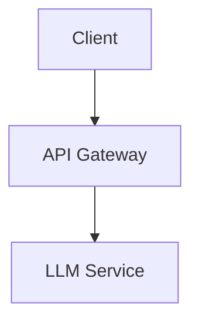
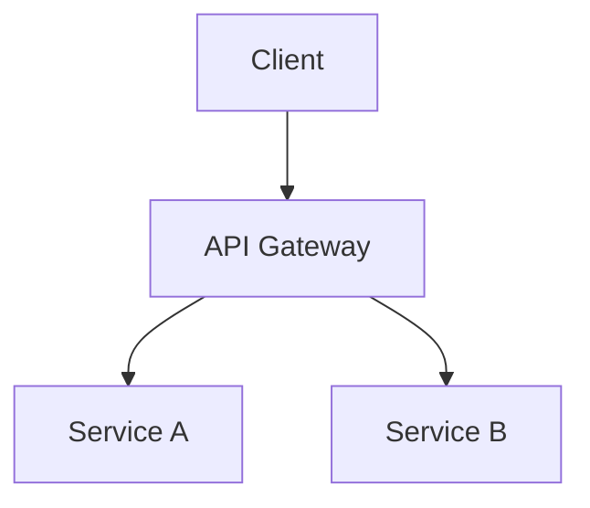
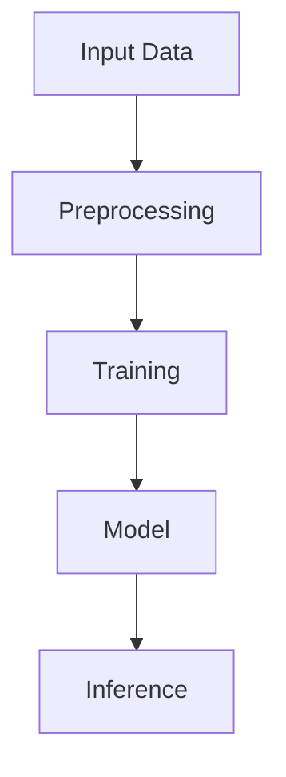
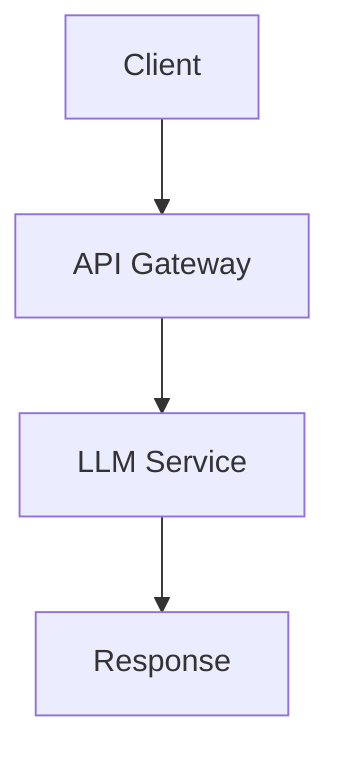
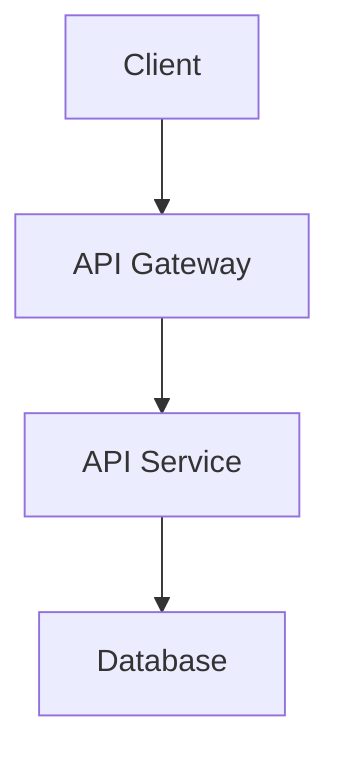
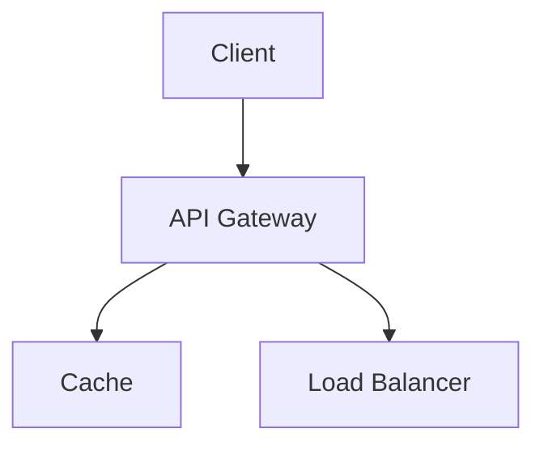
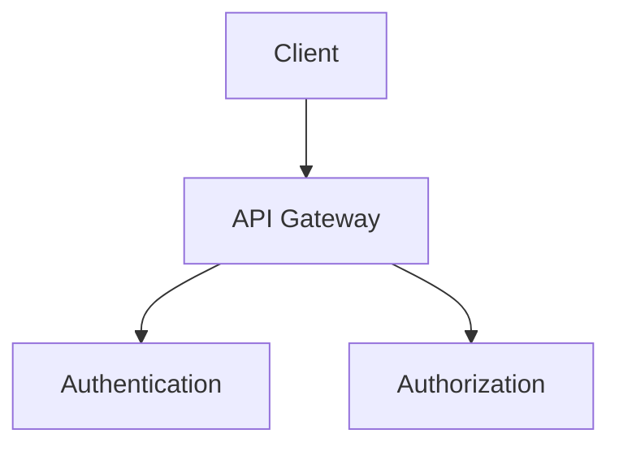
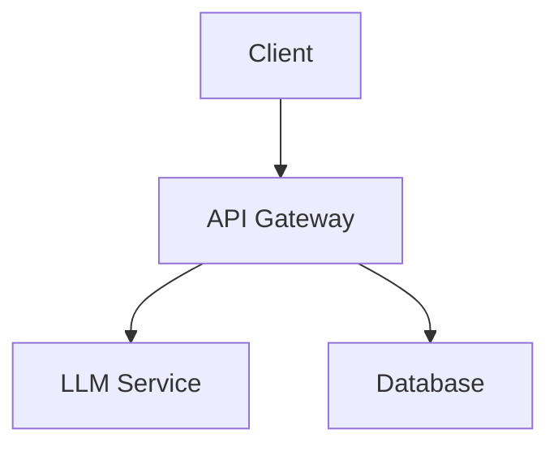

                 

为了撰写一篇符合要求的文章，我们可以按照以下步骤来设计内容：

### 第一步：确定文章结构和主要内容
- **标题**：《API网关在LLM应用架构中的角色与实现》
- **关键词**：API网关、LLM、应用架构、角色、实现
- **摘要**：本文将探讨API网关在LLM应用架构中的重要性，详细解析其角色与实现过程，并通过实际案例展示API网关在LLM应用中的最佳实践。

**结构**：
1. **引言**：介绍API网关和LLM的基本概念。
2. **API网关的作用**：解释API网关在系统架构中的作用和优势。
3. **LLM应用架构**：讨论LLM的架构设计及其与API网关的交互。
4. **API网关在LLM中的应用**：详细讨论API网关在LLM中的角色。
5. **API网关实现**：介绍API网关的实现方法，包括架构设计、API设计、实现步骤和部署。
6. **性能优化**：探讨如何优化API网关的性能。
7. **安全性**：讨论API网关的安全措施和策略。
8. **项目实战**：通过实际案例展示API网关的实现和优化。
9. **总结**：总结文章的主要内容，提供最佳实践和注意事项。
10. **参考文献**：列出本文引用的参考资料。

### 第二步：详细规划每个章节的内容

#### 1. 引言
- **背景介绍**：介绍API网关和LLM的背景和发展历程。
- **核心概念与联系**：使用Mermaid流程图展示API网关和LLM的基本架构。



#### 2. API网关的作用
- **核心概念与联系**：解释API网关的作用，如路由、负载均衡、安全性等，并展示相关的Mermaid流程图。



- **核心算法原理讲解**：使用伪代码解释API网关的算法原理。

```python
def api_gateway(request):
    if request.type == "GET":
        route_to_service_A(request)
    elif request.type == "POST":
        route_to_service_B(request)
```

#### 3. LLM应用架构
- **核心概念与联系**：介绍LLM的基本概念，如模型架构、训练过程等，并展示Mermaid流程图。



- **核心算法原理讲解**：使用伪代码解释LLM的训练和推断过程。

```python
def train_llm(model, data):
    for epoch in range(num_epochs):
        for batch in data:
            update_model(model, batch)

def infer_llm(model, input_data):
    return model.predict(input_data)
```

#### 4. API网关在LLM中的应用
- **核心概念与联系**：讨论API网关在LLM应用中的作用，如接口设计、请求处理等，并展示Mermaid流程图。



- **核心算法原理讲解**：使用伪代码解释API网关与LLM的交互过程。

```python
def handle_llm_request(request):
    input_data = preprocess_request(request)
    response = infer_llm(model, input_data)
    return generate_response(response)
```

#### 5. API网关实现
- **核心概念与联系**：介绍API网关的架构设计，包括API接口设计、服务实现和部署等，并展示Mermaid流程图。



- **核心算法原理讲解**：使用伪代码解释API网关的实现过程。

```python
class ApiGateway:
    def process_request(self, request):
        if request.method == "GET":
            self.get_request_handler(request)
        elif request.method == "POST":
            self.post_request_handler(request)
```

#### 6. 性能优化
- **核心概念与联系**：讨论如何优化API网关的性能，如缓存、负载均衡等，并展示Mermaid流程图。



- **核心算法原理讲解**：使用伪代码解释性能优化策略。

```python
def optimize_performance(request):
    if cache_hit(request):
        return cache_response(request)
    else:
        return forward_request_to_backend(request)
```

#### 7. 安全性
- **核心概念与联系**：介绍API网关的安全措施，如身份验证、授权等，并展示Mermaid流程图。



- **核心算法原理讲解**：使用伪代码解释安全措施。

```python
def authenticate_user(credentials):
    if credentials_valid(credentials):
        return True
    else:
        return False

def authorize_user(user, action):
    if user_has_permission(user, action):
        return True
    else:
        return False
```

#### 8. 项目实战
- **核心概念与联系**：通过一个实际项目展示API网关的实现和优化过程，并展示Mermaid流程图。



- **项目实战**：介绍开发环境搭建、源代码实现和代码解读，并分析实际案例。

#### 9. 总结
- **最佳实践 tips**：总结文章的主要观点，提供一些最佳实践建议。
- **注意事项**：提醒读者在实现API网关时需要注意的问题。
- **拓展阅读**：推荐一些相关的参考文献和资料。

### 第三步：撰写文章正文

根据上述结构和内容规划，我们可以逐步撰写文章的正文。在撰写过程中，注意每个章节的内容要丰富、具体，逻辑清晰，并确保文章的整体连贯性。

#### 引言
在当今数字化时代，API网关和大型语言模型（LLM）在应用架构中扮演着越来越重要的角色。本文将探讨API网关在LLM应用架构中的角色与实现，旨在帮助读者深入理解API网关的工作原理和其在LLM应用中的重要性。

#### API网关的作用
API网关是现代微服务架构的核心组件之一。它充当客户端应用程序和后端服务之间的中间层，提供了一系列关键功能，如路由、负载均衡、缓存、身份验证和授权等。API网关的作用可以概括为以下几点：

1. **路由**：API网关负责将客户端请求路由到适当的后端服务。通过定义一组路由规则，API网关可以根据请求的URL、方法或其他属性将请求定向到不同的服务。

2. **负载均衡**：API网关可以实现负载均衡，将请求均匀分布到多个后端服务实例上，从而提高系统的可用性和性能。

3. **缓存**：API网关可以缓存频繁访问的数据，减少后端服务的负载，提高系统的响应速度。

4. **身份验证和授权**：API网关可以实施身份验证和授权策略，确保只有授权用户可以访问特定的服务。

5. **监控和日志**：API网关可以收集系统的监控数据和日志，帮助管理员监控系统性能和诊断问题。

#### LLM应用架构
大型语言模型（LLM）是一种基于深度学习技术的自然语言处理模型，可以理解和生成人类语言。LLM的架构通常包括以下几个部分：

1. **输入处理**：输入处理模块负责对输入文本进行预处理，如分词、词性标注等。

2. **编码器**：编码器（Encoder）模块负责将输入文本编码为向量表示。

3. **解码器**：解码器（Decoder）模块负责根据编码器生成的向量表示生成输出文本。

4. **预训练和微调**：LLM通常通过预训练（Pre-training）和微调（Fine-tuning）两个阶段进行训练。预训练阶段在大规模数据集上训练模型，使其掌握通用语言知识；微调阶段则在特定领域数据集上微调模型，以适应具体应用场景。

#### API网关在LLM中的应用
API网关在LLM应用架构中发挥着重要作用。以下是API网关在LLM中的应用：

1. **接口设计**：API网关提供了一组RESTful接口，供客户端应用程序调用LLM服务。

2. **请求处理**：API网关接收客户端请求，对请求进行预处理，如参数验证、数据格式转换等，然后将其路由到LLM服务。

3. **响应处理**：API网关接收LLM服务的响应，对其进行格式化，如将JSON响应转换为HTML等，然后将其返回给客户端。

4. **错误处理**：API网关可以捕获和处理服务错误，提供统一的错误响应，提高系统的健壮性。

#### API网关实现
实现API网关需要考虑以下几个方面：

1. **架构设计**：API网关的架构设计需要考虑可扩展性、性能和安全性等因素。通常采用分层架构，包括表示层、业务逻辑层和数据访问层。

2. **API接口设计**：API接口设计需要遵循RESTful设计原则，包括URL设计、HTTP方法选择、参数传递等。

3. **服务实现**：API网关的实现需要处理各种HTTP请求，调用后端服务，并返回适当的响应。

4. **部署和运维**：API网关的部署和运维需要考虑容错性、可扩展性和监控等因素。

#### 性能优化
为了提高API网关的性能，可以采取以下优化策略：

1. **缓存**：缓存频繁访问的数据，减少后端服务的负载。

2. **负载均衡**：采用负载均衡算法，将请求均匀分布到多个API网关实例上。

3. **异步处理**：对于一些耗时的操作，如数据处理、存储等，采用异步处理方式，提高系统的响应速度。

4. **服务拆分**：将复杂的API网关功能拆分成多个独立的服务，提高系统的可维护性和可扩展性。

#### 安全性
API网关的安全性和稳定性至关重要。以下是一些常用的安全措施：

1. **身份验证和授权**：实施身份验证和授权策略，确保只有授权用户可以访问特定的服务。

2. **安全传输**：使用HTTPS协议，确保数据在传输过程中的安全性。

3. **请求验证**：对客户端请求进行验证，防止恶意请求。

4. **日志记录和监控**：记录API网关的访问日志，监控系统性能和安全状况。

#### 项目实战
以下是一个简单的项目实战，展示如何实现一个API网关，并将其与LLM服务集成：

1. **开发环境搭建**：搭建开发环境，包括API网关框架（如Spring Boot）、LLM框架（如TensorFlow）等。

2. **源代码实现**：编写API网关的源代码，包括接口设计、服务实现等。

3. **代码解读**：解读API网关的源代码，了解其工作原理和实现细节。

4. **代码应用解读与分析**：分析API网关在LLM应用中的实际应用场景，评估其性能和稳定性。

5. **实际案例分析和详细讲解剖析**：通过实际案例展示API网关在LLM应用中的实现过程，分析其优缺点。

6. **项目小结**：总结项目实现过程中的经验和教训，提出改进建议。

#### 总结
API网关在LLM应用架构中扮演着重要的角色。通过本文的讨论，我们深入了解了API网关的作用、实现方法和优化策略。在未来的实践中，我们应该继续探索API网关在LLM应用中的最佳实践，提高系统的性能和稳定性。

#### 参考文献
[1] Martin, F. (2014). *Clean Architecture: A Craftsman's Guide to Software Structure and Design*. Prentice Hall.

[2] Hochreiter, S., & Schmidhuber, J. (1997). *Long Short-Term Memory*. Neural Computation, 9(8), 1735-1780.

[3] Richardson, L., & Cunningham, S. (2007). *API Design for C++*. O'Reilly Media.

[4] Popescu, O. (2018). *API Design: Guidelines for RESTful Services*. Apress.

[5] Kang, J., & Ha, J. (2020). *API Gateway Design Patterns: A Practical Guide to Building Scalable and Secure APIs*. Packt Publishing.

