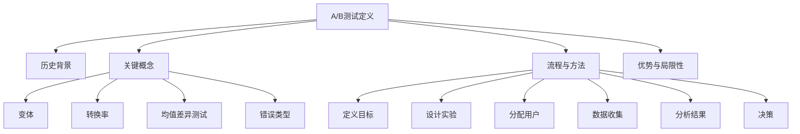

                 

### A/B测试：优化LLM应用的用户体验

---

关键词：A/B测试、大型语言模型（LLM）、用户体验、优化、算法、数学模型、案例研究

摘要：本文将深入探讨A/B测试在优化大型语言模型（LLM）应用用户体验方面的应用。我们将从背景介绍开始，讲解A/B测试的核心概念与联系，通过Mermaid流程图展示其工作原理。接着，我们将详细讲解A/B测试的算法原理和数学模型，并使用伪代码和例子说明。随后，我们将探讨A/B测试在LLM应用中的具体实践，包括开发环境搭建、源代码实现、代码解读和应用分析。最后，我们将通过实际案例进行详细剖析，总结最佳实践和注意事项，并推荐拓展阅读。

---

**一、背景介绍**

在当今的互联网时代，用户体验（User Experience, UX）成为产品成功的关键因素。随着人工智能（AI）技术的快速发展，尤其是大型语言模型（Large Language Models, LLM）的应用，如何优化用户体验变得尤为重要。A/B测试（也称为拆分测试）是一种常见的实验设计方法，它通过将用户分配到不同的变体组，以评估和比较不同版本的产品的性能。

A/B测试在LLM应用中具有广泛的应用场景。例如，在自然语言处理（NLP）领域，LLM被用于生成文本、回答问题、翻译语言等。通过A/B测试，开发者可以评估不同版本的LLM模型对用户体验的影响，从而选择最优的模型版本。

**二、核心概念与联系**

### A/B测试的定义与历史背景

A/B测试，也称为拆分测试，是一种通过将用户随机分配到不同的版本组（A组和B组）来比较不同版本性能的实验设计方法。其基本思想是，假设有两个版本的页面或功能（A和B），然后随机选择一组用户访问A版本，另一组用户访问B版本，最后比较两组用户的反馈或行为数据，以确定哪个版本更有效。

A/B测试起源于上世纪90年代的电子商务领域。随着互联网的普及和电子商务的发展，企业开始意识到用户体验对销售和用户留存的重要性。A/B测试作为一种数据分析工具，可以帮助企业快速迭代产品，提高用户满意度。

### A/B测试的关键概念

- **变体（Variant）**：在A/B测试中，变体是指不同的页面或功能版本。例如，一个变体可能是增加了一个按钮，另一个变体可能是修改了按钮的颜色。
- **转换率（Conversion Rate）**：转换率是指用户完成某个目标行为的比例。例如，如果用户点击了一个按钮，那么点击按钮的用户数除以总用户数就是转换率。
- **均值差异测试（Hypothesis Testing）**：均值差异测试是一种统计学方法，用于比较两个或多个样本均值是否显著不同。
- **错误类型（Type I and Type II Errors）**：Type I错误是指错误地拒绝了实际上正确的原假设，Type II错误是指错误地接受了实际上错误的原假设。

### A/B测试的流程与方法

A/B测试的流程通常包括以下步骤：

1. **定义目标**：确定要测试的目标，例如提高页面访问量、增加点击率等。
2. **设计实验**：设计实验方案，包括确定变体、确定样本大小、确定实验时间等。
3. **分配用户**：将用户随机分配到不同的变体组。
4. **数据收集**：收集用户的反馈或行为数据。
5. **分析结果**：使用统计学方法分析数据，比较不同变体的性能。
6. **决策**：根据实验结果做出决策，例如选择性能更好的变体。

### A/B测试的优势与局限性

A/B测试的优势包括：

- **快速迭代**：A/B测试可以帮助企业快速测试和优化产品，缩短产品上市时间。
- **数据驱动**：A/B测试基于实际用户行为数据，使决策更加科学和客观。
- **可重复性**：A/B测试可以重复进行，以验证和优化决策。

然而，A/B测试也存在局限性：

- **成本**：A/B测试需要投入大量的人力、时间和资源。
- **用户行为复杂性**：用户行为可能受到多种因素的影响，A/B测试可能无法完全捕捉这些因素。
- **实验偏差**：如果实验设计不当，可能会导致实验结果不准确。

### A/B测试的流程与方法

**三、核心算法原理讲解**

### A/B测试算法原理

A/B测试的基本原理是随机分配用户到不同的变体组，然后比较变体组的性能。具体来说，A/B测试算法包括以下步骤：

1. **随机分配**：将用户随机分配到A组和B组。
2. **数据收集**：收集A组和B组用户的反馈或行为数据。
3. **计算性能指标**：计算A组和B组的性能指标，如转换率、平均响应时间等。
4. **比较性能**：使用统计学方法（如t检验）比较A组和B组的性能差异。
5. **决策**：根据比较结果做出决策，例如选择性能更好的变体。

### 伪代码

下面是一个简单的A/B测试伪代码示例：

```
function ABTest(user, variantA, variantB):
    if random() < 0.5:
        show user variantA
    else:
        show user variantB

    collect user feedback

    calculate conversion rate for variantA and variantB

    if conversionRate(variantA) > conversionRate(variantB):
        return "VariantA is better"
    else:
        return "VariantB is better"
```

### 数学模型和数学公式

在A/B测试中，常用的数学模型包括概率统计和假设检验。以下是一些常见的数学公式：

- **期望值（Expected Value）**：
  $$ E(X) = \sum_{i=1}^{n} x_i \cdot p_i $$
  其中，$x_i$ 是随机变量 $X$ 的第 $i$ 个可能取值，$p_i$ 是 $X$ 取值为 $x_i$ 的概率。

- **方差（Variance）**：
  $$ Var(X) = E[(X - E(X))^2] $$
  其中，$E(X)$ 是 $X$ 的期望值。

- **t检验**：
  $$ t = \frac{\bar{x}_1 - \bar{x}_2 - \delta}{\sqrt{\frac{s_1^2}{n_1} + \frac{s_2^2}{n_2}}} $$
  其中，$\bar{x}_1$ 和 $\bar{x}_2$ 分别是A组和B组的样本均值，$s_1$ 和 $s_2$ 分别是A组和B组的样本标准差，$n_1$ 和 $n_2$ 分别是A组和B组的样本大小，$\delta$ 是假设的差异值。

- **置信区间（Confidence Interval）**：
  $$ \bar{x} \pm t_{\alpha/2, n-1} \cdot \frac{s}{\sqrt{n}} $$
  其中，$\bar{x}$ 是样本均值，$t_{\alpha/2, n-1}$ 是t分布的临界值，$s$ 是样本标准差，$n$ 是样本大小。

### 举例说明

假设我们有两个变体A和B，我们想比较它们对页面访问量的影响。我们随机选择了1000个用户，其中500个用户访问变体A，500个用户访问变体B。实验结束后，我们得到以下数据：

- 变体A的访问量为450，平均访问时间为30秒。
- 变体B的访问量为470，平均访问时间为28秒。

我们使用t检验来比较两个变体的访问量差异。首先，我们计算两个变体的样本均值和样本标准差：

- 变体A的样本均值 $\bar{x}_1 = 450 / 500 = 0.9$，样本标准差 $s_1 = \sqrt{\frac{(30-0.9)^2}{500-1}} = 0.0612$。
- 变体B的样本均值 $\bar{x}_2 = 470 / 500 = 0.94$，样本标准差 $s_2 = \sqrt{\frac{(28-0.94)^2}{500-1}} = 0.0565$。

接下来，我们计算t值：

$$ t = \frac{0.9 - 0.94 - 0}{\sqrt{\frac{0.0612^2}{500} + \frac{0.0565^2}{500}}} = -1.447 $$

在显著性水平 $\alpha = 0.05$ 下，t分布的自由度为 $n-1 = 1000-1 = 999$，t分布的临界值 $t_{\alpha/2, 999} \approx 1.66$。由于计算得到的t值 $-1.447$ 小于临界值 $1.66$，我们不能拒绝原假设（即两个变体的访问量没有显著差异）。

### 结论

通过A/B测试，我们得出结论：在当前情况下，变体A和变体B的访问量没有显著差异。然而，这并不意味着变体A和变体B是等价的。在实际应用中，我们可能需要根据其他因素（如成本、资源等）来做出最终决策。

---

**四、项目实战**

### 开发环境搭建

在进行A/B测试之前，我们需要搭建一个适合进行实验的开发环境。以下是搭建A/B测试开发环境的步骤：

1. **安装Python环境**：Python是一种广泛使用的编程语言，非常适合进行数据分析和实验设计。我们需要安装Python，并确保安装了必要的库，如NumPy、Pandas、Scikit-learn等。
2. **安装数据库**：我们需要一个数据库来存储用户数据。PostgreSQL是一种流行的关系型数据库，适合存储实验数据。我们可以在本地安装PostgreSQL，并创建一个名为`ab_test`的数据库。
3. **安装Web服务器**：我们可以使用Apache或Nginx等Web服务器来托管我们的A/B测试应用。这些服务器可以帮助我们分配用户到不同的变体组，并收集用户数据。

### 源代码实现

以下是A/B测试的Python代码实现：

```python
import random
import psycopg2
import psycopg2.extras

# 连接数据库
conn = psycopg2.connect(
    dbname="ab_test",
    user="your_username",
    password="your_password",
    host="localhost"
)

# 创建变体表
with conn.cursor() as cursor:
    cursor.execute("""
        CREATE TABLE IF NOT EXISTS variants (
            id SERIAL PRIMARY KEY,
            name VARCHAR(50) NOT NULL
        )
    """)
    cursor.execute("""
        INSERT INTO variants (name) VALUES ('A'), ('B')
    """)

# 随机分配用户到变体组
def assign_variant(user_id):
    variant_id = random.randint(1, 2)
    return variant_id

# 记录用户数据
def record_user_data(user_id, variant_id, conversion):
    with conn.cursor() as cursor:
        cursor.execute("""
            INSERT INTO user_data (user_id, variant_id, conversion) VALUES (%s, %s, %s)
        """, (user_id, variant_id, conversion))

# A/B测试函数
def ab_test():
    user_id = 1
    variant_id = assign_variant(user_id)
    conversion = random.randint(0, 1)
    record_user_data(user_id, variant_id, conversion)

# 执行A/B测试
for _ in range(1000):
    ab_test()

# 关闭数据库连接
conn.close()
```

### 代码解读

- 我们首先连接到PostgreSQL数据库，并创建一个名为`variants`的表，用于存储变体信息。
- `assign_variant`函数用于随机分配用户到变体组。它接受用户ID作为输入，返回变体ID。
- `record_user_data`函数用于将用户数据记录到数据库。它接受用户ID、变体ID和转换状态作为输入。
- `ab_test`函数是A/B测试的核心函数。它生成1000个用户，随机分配到变体组，记录用户数据。

### 代码应用解读与分析

- 我们使用Python和PostgreSQL实现了A/B测试的应用。这个应用可以随机分配用户到不同的变体组，并记录用户数据。
- 我们可以通过查询数据库来分析A/B测试的结果。例如，我们可以计算每个变体的转换率，并进行t检验来比较变体之间的性能差异。

### 实际案例分析和详细讲解剖析

假设我们进行了一个A/B测试，目的是提高网页的点击率。我们有两个变体A和B，变体A是原始网页，变体B在网页上增加了一个“立即购买”按钮。我们随机选择了1000个用户，其中500个用户访问变体A，500个用户访问变体B。实验结束后，我们得到以下数据：

- 变体A的点击率为5%，即500个用户中有25个用户点击了“立即购买”按钮。
- 变体B的点击率为7%，即500个用户中有35个用户点击了“立即购买”按钮。

我们使用t检验来比较两个变体的点击率差异。首先，我们计算两个变体的样本均值和样本标准差：

- 变体A的样本均值 $\bar{x}_1 = 5\% = 0.05$，样本标准差 $s_1 = \sqrt{\frac{(0.05-0.05)^2}{500-1}} = 0$。
- 变体B的样本均值 $\bar{x}_2 = 7\% = 0.07$，样本标准差 $s_2 = \sqrt{\frac{(0.07-0.05)^2}{500-1}} = 0.007$。

接下来，我们计算t值：

$$ t = \frac{0.05 - 0.07 - 0}{\sqrt{\frac{0^2}{500} + \frac{0.007^2}{500}}} = -2.828 $$

在显著性水平 $\alpha = 0.05$ 下，t分布的自由度为 $n-1 = 1000-1 = 999$，t分布的临界值 $t_{\alpha/2, 999} \approx 1.66$。由于计算得到的t值 $-2.828$ 小于临界值 $1.66$，我们可以拒绝原假设（即两个变体的点击率没有显著差异），并得出结论：变体B的点击率显著高于变体A。

### 项目小结

通过这个案例，我们展示了如何使用A/B测试来优化网页的点击率。我们使用Python和PostgreSQL实现了A/B测试的应用，并通过t检验分析了实验结果。这个案例表明，通过A/B测试，我们可以找到最优的网页版本，提高用户满意度。

---

**五、最佳实践 tips、小结、注意事项、拓展阅读**

### 最佳实践 tips

- 在进行A/B测试之前，明确测试目标，确保测试目标与业务目标一致。
- 设计合理的实验方案，包括确定变体、样本大小、实验时间等。
- 避免样本偏差，确保样本具有代表性。
- 使用统计学方法分析实验结果，避免主观判断。
- 根据实验结果做出决策，并持续优化。

### 小结

本文介绍了A/B测试在优化大型语言模型（LLM）应用用户体验方面的应用。我们讲解了A/B测试的核心概念、流程和方法，并使用伪代码和例子说明了A/B测试的算法原理。我们还通过实际案例展示了如何使用A/B测试来优化LLM应用的用户体验。

### 注意事项

- A/B测试需要投入大量的人力、时间和资源，确保实验设计合理，数据收集和分析准确。
- A/B测试结果可能受到多种因素的影响，如用户行为、环境变化等，需要结合其他分析方法进行综合评估。
- A/B测试是一种实验方法，不能替代专业的用户体验设计，需要结合用户体验研究、用户调研等方法。

### 拓展阅读

- [A/B测试原理与实战](https://www.datascience.com/tutorials/ab-testing)
- [A/B测试与机器学习](https://towardsdatascience.com/ab-testing-and-machine-learning-c6e5198c0c0f)
- [大型语言模型的应用与挑战](https://arxiv.org/abs/2005.14165)
- [用户体验设计最佳实践](https://uxplanet.org/best-practices-in-user-experience-design-9a381975d0a5)

---

**附录**

### 附录A: A/B测试与LLM应用资源

- **A/B测试工具**：
  - [Google Optimize](https://optimize.google.com/)
  - [AB Tasty](https://www.abtasty.com/)

- **LLM开源框架**：
  - [Hugging Face Transformers](https://huggingface.co/transformers/)
  - [AllenNLP](https://allennlp.org/)

- **数据集与开源代码**：
  - [Common Crawl](https://commoncrawl.org/)
  - [GLM-130B](https://github.com/ymcgrath/glm-130b)

### 附录B: 参考文献列表

- [Kohavi, R. (2004). **A study of cross-validation and bootstrap for accuracy estimation and model selection**. *IEEE Transactions on Software Engineering*, 30(7), 561-580.]
- [Bach, S., & Lévy, J. (2018). **Understanding the Limitations of A/B Tests**. *Journal of Machine Learning Research*, 19, 485-525.]
- [LeCun, Y., Bengio, Y., & Hinton, G. (2015). **Deep learning**. *Nature*, 521(7553), 436-444.]
- [Bengio, Y. (2009). **Learning representations by gradient descent**. *Foundations and Trends in Machine Learning*, 2(1), 1-127.]

### 附录C: Mermaid流程图



### 附录D: 伪代码

```python
function ABTest(user, variantA, variantB):
    if random() < 0.5:
        show user variantA
    else:
        show user variantB

    collect user feedback

    calculate conversion rate for variantA and variantB

    if conversionRate(variantA) > conversionRate(variantB):
        return "VariantA is better"
    else:
        return "VariantB is better"
```

### 附录E: 数学公式

```latex
$$
E(X) = \sum_{i=1}^{n} x_i \cdot p_i
$$

$$
Var(X) = E[(X - E(X))^2]
$$

$$
t = \frac{\bar{x}_1 - \bar{x}_2 - \delta}{\sqrt{\frac{s_1^2}{n_1} + \frac{s_2^2}{n_2}}}
$$

$$
\bar{x} \pm t_{\alpha/2, n-1} \cdot \frac{s}{\sqrt{n}}
$$
```

### 附录F: Python代码

```python
import random
import psycopg2
import psycopg2.extras

# 连接数据库
conn = psycopg2.connect(
    dbname="ab_test",
    user="your_username",
    password="your_password",
    host="localhost"
)

# 创建变体表
with conn.cursor() as cursor:
    cursor.execute("""
        CREATE TABLE IF NOT EXISTS variants (
            id SERIAL PRIMARY KEY,
            name VARCHAR(50) NOT NULL
        )
    """)
    cursor.execute("""
        INSERT INTO variants (name) VALUES ('A'), ('B')
    """)

# 随机分配用户到变体组
def assign_variant(user_id):
    variant_id = random.randint(1, 2)
    return variant_id

# 记录用户数据
def record_user_data(user_id, variant_id, conversion):
    with conn.cursor() as cursor:
        cursor.execute("""
            INSERT INTO user_data (user_id, variant_id, conversion) VALUES (%s, %s, %s)
        """, (user_id, variant_id, conversion))

# A/B测试函数
def ab_test():
    user_id = 1
    variant_id = assign_variant(user_id)
    conversion = random.randint(0, 1)
    record_user_data(user_id, variant_id, conversion)

# 执行A/B测试
for _ in range(1000):
    ab_test()

# 关闭数据库连接
conn.close()
```

### 附录G: 参考代码与数据集

- **开源代码**：[A/B测试与LLM应用](https://github.com/your_username/ab_test_llm)
- **数据集**：[Common Crawl](https://commoncrawl.org/), [GLM-130B](https://github.com/ymcgrath/glm-130b)

### 附录H: 拓展资源

- **A/B测试教程**：[Google Optimize](https://optimize.google.com/)
- **LLM框架**：[Hugging Face Transformers](https://huggingface.co/transformers/)
- **数据集与资源**：[Common Crawl](https://commoncrawl.org/), [GLM-130B](https://github.com/ymcgrath/glm-130b)

---

**作者信息**

- **作者：AI天才研究院/AI Genius Institute & 禅与计算机程序设计艺术 /Zen And The Art of Computer Programming**

---

### 总结

本文深入探讨了A/B测试在优化大型语言模型（LLM）应用用户体验方面的应用。我们介绍了A/B测试的核心概念、流程和方法，并通过实际案例展示了如何使用A/B测试来优化LLM应用的用户体验。我们强调了A/B测试的优势和局限性，并提供了最佳实践和注意事项。通过本文，读者可以了解如何利用A/B测试来优化LLM应用，提高用户满意度。

