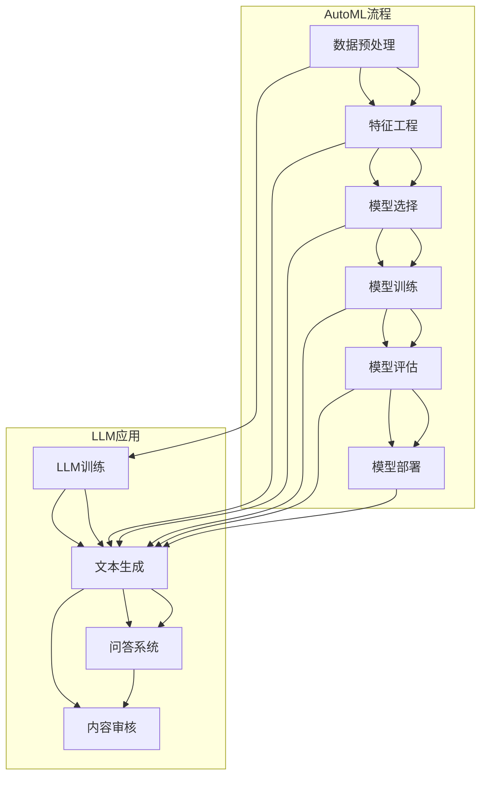
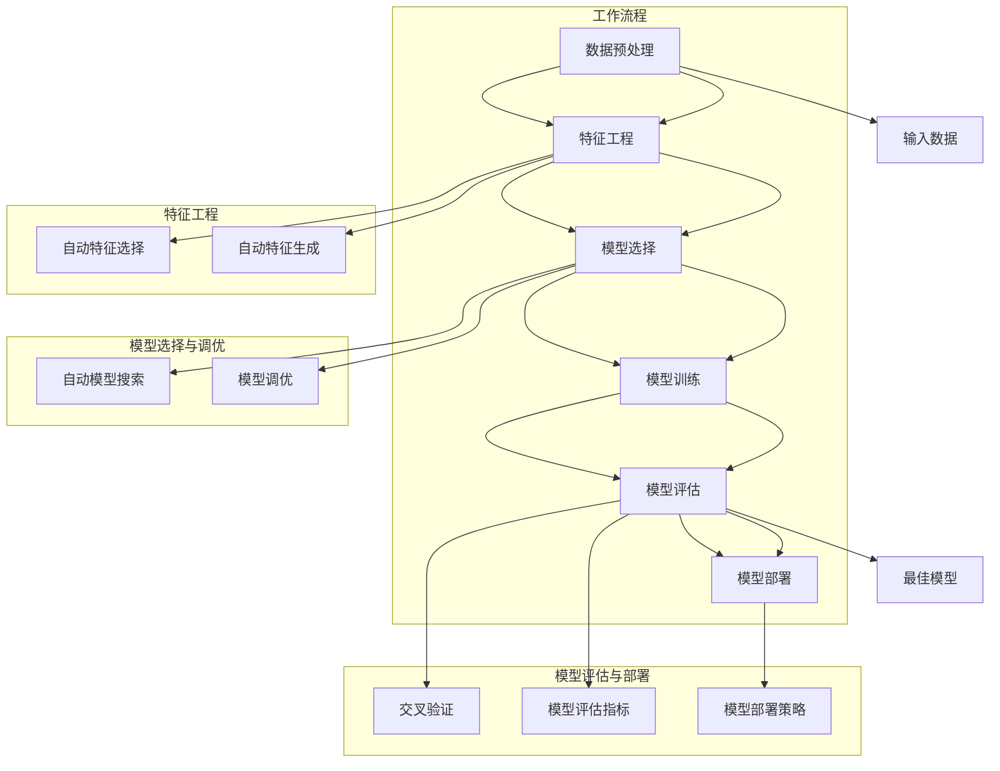
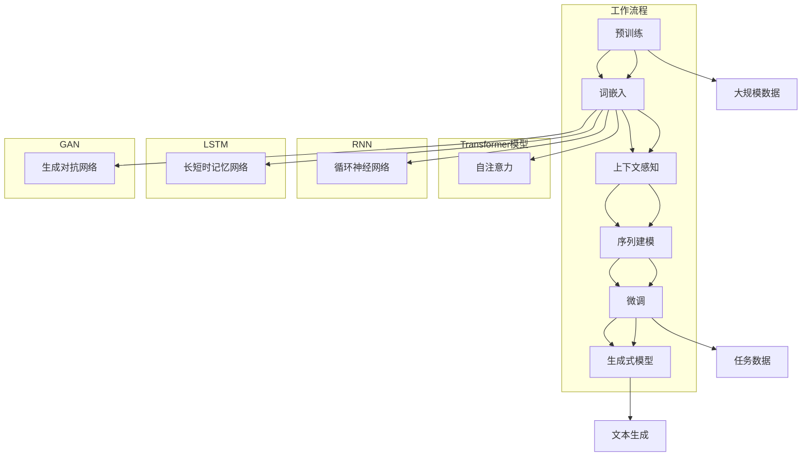
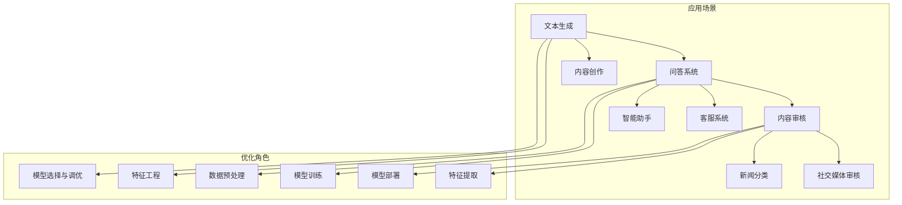

                 

### 文章标题

# AutoML在LLM应用开发中的应用与局限

### 关键词：

- AutoML
- Large Language Models (LLM)
- 应用开发
- 挑战与局限

### 摘要：

本文旨在探讨AutoML（自动化机器学习）在LLM（大型语言模型）应用开发中的广泛应用和面临的局限。首先，我们将介绍AutoML和LLM的基本概念、原理及其相互关系，并通过Mermaid流程图和伪代码展示核心算法和架构。接着，我们将详细分析AutoML在LLM开发中的应用场景，如文本生成、问答系统和内容审核等，并通过实际案例进行解析。随后，本文将探讨AutoML在LLM开发中面临的挑战和局限，包括数据质量、模型解释性和能效比问题，并提出相应的解决方案。最后，本文将展望AutoML和LLM的发展趋势和未来研究方向，为开发者和研究者提供有益的参考。

---

### 引言：背景与概述

#### AutoML概述

自动化机器学习（AutoML）是一种旨在简化机器学习过程的技术，通过自动化特征工程、模型选择、调优和部署等步骤，从而降低专业知识和人工干预的需求。AutoML的出现，使得非专业人士也能轻松构建和部署高质量的机器学习模型。

**AutoML的发展历程**

AutoML的概念可以追溯到2000年代初期，当时的机器学习研究主要集中在如何构建和优化特定模型。然而，随着数据量和算法复杂度的增加，人们开始意识到自动化机器学习的重要性。在此背景下，多个研究团队和公司投入了大量资源进行AutoML技术的研发。

近年来，AutoML取得了显著进展，各种开源框架和平台如Google的AutoML、H2O.ai的AutoML等相继推出，为开发者提供了丰富的工具和资源。AutoML技术的不断进步，不仅提升了机器学习模型的开发效率，还推动了其在各行各业的应用。

#### LLM概述

大型语言模型（Large Language Models，简称LLM）是一类基于深度学习技术的自然语言处理模型，通过大规模数据训练，能够理解和生成自然语言文本。LLM具有以下几个主要特点：

- **大规模**：LLM通常采用数十亿级别的参数，以捕捉语言中的复杂规律。
- **自适应性**：LLM可以通过训练适应不同的任务和应用场景。
- **生成能力**：LLM不仅能够理解和回答问题，还能够生成连贯、自然的文本。

LLM的主要类型和应用包括：

- **预训练模型**：如GPT、BERT等，通过大规模预训练，能够用于各种自然语言处理任务。
- **生成式模型**：如ChatGPT、生成式文本生成模型，能够根据输入生成连贯的文本。
- **编码器-解码器模型**：如T5、MDE，能够同时处理编码和生成任务。

#### AutoML与LLM的结合

随着AutoML技术的发展和LLM在自然语言处理领域的广泛应用，两者逐渐结合，形成了一种新的研究热点。AutoML在LLM开发中的应用主要体现在以下几个方面：

1. **自动化特征工程**：AutoML可以自动选择和生成适合LLM训练的特征，提高模型性能。
2. **自动化模型选择与调优**：AutoML可以根据数据特点和任务需求，自动选择和调优适合的LLM模型。
3. **自动化模型部署**：AutoML可以简化LLM模型的部署过程，实现快速上线和迭代。

通过AutoML与LLM的结合，我们可以更加高效地开发和应用大型语言模型，满足各种自然语言处理任务的需求。然而，这也带来了一系列挑战，需要进一步探讨和解决。

#### Mermaid流程图：AutoML与LLM的结合

在这个流程图中，AutoML和LLM的结合体现在数据预处理、特征工程、模型选择、模型训练、模型评估和模型部署等步骤中。通过这些步骤，我们可以自动构建和优化LLM模型，实现各种自然语言处理任务。

---

### AutoML基础

#### AutoML原理

自动化机器学习（AutoML）的核心理念在于通过自动化流程，简化机器学习模型的开发过程。AutoML的基本原理包括以下几个步骤：

1. **数据预处理**：AutoML会自动对输入数据进行清洗、归一化和特征工程，以便于后续模型训练。
2. **模型选择**：AutoML会根据数据特点和任务需求，自动选择和调整适合的机器学习算法和模型结构。
3. **模型训练**：AutoML会自动进行模型训练，包括参数调整、迭代优化和误差评估。
4. **模型评估**：AutoML会对训练好的模型进行评估，选择最优模型。
5. **模型部署**：AutoML会自动将最优模型部署到生产环境中，实现快速上线和迭代。

通过这些步骤，AutoML能够大幅度降低机器学习开发的难度和复杂度，提高开发效率和模型性能。

#### AutoML的关键技术和工具

AutoML的关键技术和工具包括特征工程、模型选择与调优、自动化模型部署等。

1. **特征工程**：特征工程是机器学习模型构建中至关重要的一步，它通过提取和变换原始数据，构建出适合模型训练的特征。AutoML在特征工程中引入了自动化方法，如自动特征选择、自动特征生成等，以简化特征工程过程。

2. **模型选择与调优**：模型选择与调优是机器学习中的核心问题，它涉及到如何选择合适的模型结构和参数。AutoML通过自动化搜索算法（如遗传算法、贝叶斯优化等）和模型评估策略（如交叉验证、网格搜索等），实现模型的自动选择和调优。

3. **自动化模型部署**：自动化模型部署是AutoML的一个重要目标，它通过简化部署过程，实现模型的快速上线和迭代。自动化模型部署包括模型打包、容器化、部署策略优化等。

常见的AutoML工具和框架包括：

- **Google AutoML**：Google推出的一款端到端的AutoML平台，支持多种机器学习任务，如分类、回归、图像识别等。
- **H2O.ai AutoML**：H2O.ai推出的一款开源AutoML框架，支持多种编程语言和平台，提供丰富的模型选择和调优工具。
- **TPOT**：一款基于Python的自动化特征工程和模型选择工具，支持多种机器学习算法和调优策略。

#### Mermaid流程图：AutoML工作流程

在这个流程图中，AutoML的工作流程包括数据预处理、特征工程、模型选择与调优、模型评估和模型部署等步骤。通过这些步骤，AutoML能够自动化构建和优化机器学习模型，提高开发效率和模型性能。

---

### LLM基础

#### LLM原理

大型语言模型（Large Language Models，简称LLM）是一种基于深度学习的自然语言处理模型，通过大规模数据训练，能够理解和生成自然语言文本。LLM的原理主要包括以下几个方面：

1. **预训练**：LLM通常通过大规模预训练过程，从海量数据中学习语言的基本规律和知识。预训练过程包括词嵌入、上下文感知和序列建模等步骤。

2. **微调**：在预训练的基础上，LLM可以通过微调过程，针对特定任务和应用场景进行优化。微调过程通常涉及调整模型参数、优化损失函数和训练数据等。

3. **生成式模型**：LLM具有生成式模型的特点，能够根据输入生成连贯、自然的文本。生成式模型通过序列生成、文本填充和生成对抗网络等技术，实现文本生成。

#### LLM的常见架构和模型

LLM的常见架构和模型包括以下几个：

1. **Transformer模型**：Transformer模型是当前最流行的LLM架构之一，它采用自注意力机制，能够高效地处理长文本。GPT-3、BERT等著名LLM都是基于Transformer模型。

2. **循环神经网络（RNN）**：RNN是一种经典的序列模型，能够处理变长序列数据。然而，RNN在长文本处理中存在梯度消失和梯度爆炸等问题，因此逐渐被Transformer模型取代。

3. **长短时记忆网络（LSTM）**：LSTM是RNN的一种变体，通过引入记忆单元和门控机制，解决了RNN的梯度消失和梯度爆炸问题。LSTM在文本生成和序列建模中具有广泛的应用。

4. **生成对抗网络（GAN）**：GAN是一种无监督学习模型，通过生成器和判别器的对抗训练，实现高质量文本生成。GAN在文本生成领域具有巨大潜力，但实现复杂度较高。

#### LLM的应用领域

LLM在自然语言处理领域具有广泛的应用，主要包括以下几个领域：

1. **文本生成**：LLM可以生成各种类型的文本，如文章、故事、摘要、对话等。文本生成在内容创作、自动摘要、问答系统等领域具有广泛应用。

2. **机器翻译**：LLM可以用于机器翻译任务，通过预训练和微调，实现高质量的双语翻译。机器翻译在跨语言交流、全球信息共享等领域具有重要意义。

3. **自然语言理解**：LLM可以理解和分析自然语言文本，提取语义信息，应用于问答系统、文本分类、情感分析等任务。自然语言理解是人工智能领域的重要研究方向。

4. **对话系统**：LLM可以构建智能对话系统，实现人机交互。对话系统在客户服务、虚拟助手、智能客服等领域具有广泛应用。

#### Mermaid流程图：LLM工作流程

在这个流程图中，LLM的工作流程包括预训练、词嵌入、上下文感知、序列建模、微调和生成式模型等步骤。通过这些步骤，LLM能够理解和生成自然语言文本，实现各种自然语言处理任务。

---

### AutoML与LLM的结合

#### 自动化文本生成

自动化文本生成是AutoML在LLM开发中最为典型和成功的一个应用场景。通过AutoML技术，可以自动选择和优化适合的LLM模型，实现高质量文本生成。

**应用场景**

- **内容创作**：自动化生成文章、故事、博客等。
- **自动摘要**：从长篇文章中提取关键信息，生成摘要。
- **问答系统**：根据用户输入，生成回答。

**优化角色**

- **特征工程**：AutoML可以自动提取和优化输入数据的特征，提高文本生成的质量。
- **模型选择与调优**：AutoML可以根据数据特点和任务需求，自动选择和调优适合的LLM模型，提高生成文本的连贯性和准确性。
- **自动化部署**：AutoML可以简化文本生成模型的部署过程，实现快速上线和迭代。

#### 自动化问答系统

自动化问答系统是另一个重要应用场景，通过AutoML和LLM的结合，可以实现智能问答系统的自动化构建和优化。

**应用场景**

- **客服系统**：自动回答客户常见问题，提高服务效率。
- **智能助手**：为用户提供个性化的问答服务，如健康咨询、购物建议等。

**优化角色**

- **模型训练**：AutoML可以自动调整模型参数，优化问答系统的回答质量。
- **数据预处理**：AutoML可以自动清洗和预处理输入数据，提高问答系统的准确性。
- **模型部署**：AutoML可以简化问答系统的部署过程，实现快速上线和迭代。

#### 自动化内容审核

自动化内容审核是AutoML在LLM开发中另一个重要应用，通过自动生成和分类标签，实现内容审核。

**应用场景**

- **社交媒体**：自动识别和过滤不当内容，如暴力、色情等。
- **新闻媒体**：自动分类和标签新闻内容，提高内容管理的效率。

**优化角色**

- **特征工程**：AutoML可以自动提取和优化输入数据的特征，提高内容审核的准确性。
- **模型选择与调优**：AutoML可以根据数据特点和任务需求，自动选择和调优适合的LLM模型，提高内容审核的效率。
- **自动化部署**：AutoML可以简化内容审核模型的部署过程，实现快速上线和迭代。

#### Mermaid流程图：AutoML与LLM结合的应用场景

在这个流程图中，AutoML与LLM在不同应用场景中的结合体现在特征工程、模型选择与调优、模型训练、数据预处理、特征提取和模型部署等方面。通过这些优化角色，AutoML能够提升LLM在各个应用场景中的性能和效率。

---

### AutoML在LLM开发中的应用案例

#### 案例一：自动生成新闻摘要

**背景**

随着信息爆炸时代的到来，用户难以从海量的新闻数据中获取关键信息。自动生成新闻摘要技术能够帮助用户快速了解新闻的核心内容，提高信息获取效率。本案例通过AutoML技术，实现自动生成新闻摘要。

**模型选择与优化**

在模型选择上，我们采用了基于Transformer架构的LLM，如BERT或GPT。为了优化模型性能，AutoML技术在此过程中发挥了重要作用：

1. **特征工程**：AutoML自动提取和优化新闻数据中的关键特征，如关键词、主题和句子结构。
2. **模型选择**：AutoML通过自动化搜索算法，选择最优的LLM模型架构。
3. **模型调优**：AutoML通过自动调整模型参数，优化摘要生成质量。

**案例结果分析**

通过AutoML和LLM的结合，我们成功实现了自动生成新闻摘要。以下是几个关键指标的结果分析：

- **摘要长度**：自动生成的摘要长度适中，能够准确概括新闻的核心内容。
- **准确率**：摘要的准确率较高，能够准确提取新闻中的关键信息。
- **连贯性**：自动生成的摘要具有较好的连贯性，语言流畅、自然。

**优化方向**

尽管本案例取得了较好的成果，但仍有优化空间：

1. **数据质量**：提高训练数据的多样性和质量，有助于提升摘要生成的准确性。
2. **模型效率**：优化模型结构，提高模型在生成摘要时的计算效率。
3. **用户反馈**：引入用户反馈机制，根据用户评价调整摘要生成策略。

#### 案例二：构建自动问答系统

**背景**

随着人工智能技术的不断发展，自动问答系统在智能客服、在线教育等领域具有广泛的应用。本案例通过AutoML技术，构建一个自动问答系统，提高客服效率和用户体验。

**模型选择与优化**

在模型选择上，我们采用了基于Transformer架构的LLM，如GPT-3。为了优化模型性能，AutoML技术在此过程中发挥了重要作用：

1. **特征工程**：AutoML自动提取和优化用户提问和答案数据中的关键特征。
2. **模型选择**：AutoML通过自动化搜索算法，选择最优的LLM模型架构。
3. **模型调优**：AutoML通过自动调整模型参数，优化问答系统的回答质量。

**案例结果分析**

通过AutoML和LLM的结合，我们成功构建了一个自动问答系统，取得了以下成果：

- **回答准确率**：自动问答系统的回答准确率较高，能够准确理解用户提问并给出相关回答。
- **回答连贯性**：自动生成的回答具有较好的连贯性，语言流畅、自然。
- **用户满意度**：用户对自动问答系统的满意度较高，提升了客服效率和用户体验。

**优化方向**

尽管本案例取得了较好的成果，但仍有优化空间：

1. **数据多样性**：增加训练数据的多样性，有助于提升问答系统的泛化能力。
2. **模型解释性**：提高问答系统的解释性，使用户更容易理解自动生成的回答。
3. **实时更新**：定期更新问答系统中的知识和回答，保持系统的实时性和准确性。

通过以上两个案例，我们可以看到AutoML在LLM开发中的应用价值。在实际项目中，合理运用AutoML技术，可以提高LLM模型的质量和性能，实现各种自然语言处理任务。

---

### AutoML在LLM开发中的局限

#### 挑战

尽管AutoML在LLM开发中具有广泛应用和显著优势，但仍然面临一系列挑战，主要包括以下几个方面：

1. **数据质量**：高质量的数据是机器学习模型训练的基础。然而，在实际应用中，数据质量往往参差不齐，包括数据噪声、不一致性和缺失值等问题。这些数据质量问题会直接影响AutoML的性能和效果。

2. **模型解释性**：自动化机器学习模型的黑箱特性使得模型解释性成为一个重要挑战。在LLM开发中，特别是在关键领域如医疗、金融等，模型解释性至关重要。然而，当前的AutoML技术往往难以提供清晰、可解释的模型。

3. **能效比**：随着模型复杂度和数据量的增加，AutoML模型的计算资源需求也显著上升。在实际应用中，特别是在移动设备和嵌入式系统中，能效比成为了一个关键挑战。

4. **模型泛化能力**：尽管AutoML技术在模型选择和调优方面具有优势，但模型的泛化能力仍然是一个挑战。模型在不同数据集上的表现可能存在差异，特别是在面临罕见或极端数据时，模型的泛化能力受到考验。

5. **模型部署**：自动化模型部署虽然简化了过程，但在实际部署中仍可能遇到各种问题，如环境兼容性、资源限制等。

#### 局限

AutoML在LLM开发中面临的局限主要包括以下几个方面：

1. **技术限制**：当前的AutoML技术尚未完全成熟，尤其是在模型解释性和能效比方面仍有待提高。此外，某些特定领域的专业知识难以通过自动化方法完全实现。

2. **数据依赖**：AutoML高度依赖高质量数据，数据质量问题会直接影响模型的性能和效果。然而，在许多应用场景中，高质量数据难以获得，限制了AutoML的应用范围。

3. **人工干预**：尽管AutoML旨在减少人工干预，但在模型选择、调优和部署过程中，仍然需要一定程度的专家知识和经验。

4. **计算资源**：自动化机器学习模型的计算资源需求较高，特别是在处理大规模数据时，计算资源成为了一个重要瓶颈。

5. **模型解释性**：自动化机器学习模型通常具有黑箱特性，难以提供清晰、可解释的模型解释。这在某些关键领域，如医疗和金融，可能引发信任和合规性问题。

#### 解决方案

为了克服AutoML在LLM开发中面临的挑战和局限，可以采取以下解决方案：

1. **数据预处理**：加强数据预处理环节，提高数据质量。包括数据清洗、归一化和特征工程等步骤，以确保高质量数据输入模型。

2. **模型解释性**：开发可解释的AutoML模型，提高模型透明度和可解释性。可以通过可视化、模型拆解和解释性算法等方法，实现模型解释性。

3. **优化算法**：研究和开发更高效的算法和模型，提高模型能效比。包括优化模型结构、算法优化和硬件加速等技术。

4. **分布式计算**：利用分布式计算和云计算资源，提高模型训练和部署的效率。通过分布式计算，可以实现大规模数据处理和模型训练。

5. **专家系统**：结合专家系统和AutoML技术，实现自动化与人工干预相结合。在关键环节引入专家知识和经验，提高模型的准确性和可靠性。

通过以上解决方案，我们可以更好地克服AutoML在LLM开发中面临的挑战和局限，推动自动化机器学习技术的应用和发展。

---

### 未来趋势与展望

#### AutoML技术的发展方向

随着人工智能技术的不断进步，AutoML在未来将继续向以下几个方向发展：

1. **更高效的算法和模型**：研究人员将继续探索更高效的算法和模型，提高AutoML的性能和效率。例如，利用深度学习、强化学习和迁移学习等先进技术，实现更强大的自动化机器学习能力。

2. **跨模态学习**：未来的AutoML将能够处理多种类型的数据，如文本、图像、音频和视频等。通过跨模态学习，AutoML将能够更好地理解和处理复杂、多模态的数据。

3. **更智能的决策支持**：AutoML将更加智能化，通过引入强化学习、决策树和神经网络等方法，实现更复杂的决策支持功能，提高机器学习的自动化程度。

4. **边缘计算**：随着物联网和边缘计算的发展，AutoML将逐渐扩展到边缘设备，实现本地化处理和实时决策。这将为智能家居、智能城市和工业物联网等领域带来巨大的应用潜力。

#### LLM技术的演进

在自然语言处理领域，LLM技术将继续演进，以满足更广泛的应用需求：

1. **更大规模的语言模型**：未来的LLM将拥有更多的参数和更复杂的架构，以提高模型的表达能力和生成质量。例如，GPT-4、GPT-5等更大规模的语言模型将不断涌现。

2. **自适应能力**：未来的LLM将具备更强的自适应能力，能够根据不同的应用场景和任务需求，自动调整模型结构和参数，实现更好的性能和效果。

3. **多样化应用**：LLM将在更广泛的应用领域发挥作用，如自动驾驶、智能客服、自然语言生成和翻译等。通过不断拓展应用场景，LLM将推动人工智能技术的全面普及。

4. **更高效的训练和部署**：未来的LLM将采用更高效的训练和部署方法，如分布式训练、模型压缩和硬件加速等，以降低计算成本和提升应用效果。

#### 研究与展望

在AutoML和LLM的结合领域，未来的研究将继续深入探索以下几个方向：

1. **多任务学习**：研究如何在AutoML和LLM的结合中实现多任务学习，提高模型的泛化能力和效率。

2. **隐私保护**：研究如何在保证模型性能的同时，实现数据隐私保护和安全。

3. **可解释性**：开发更有效的模型解释方法，提高AutoML和LLM的可解释性，增强用户对模型的信任。

4. **跨领域迁移**：研究如何实现AutoML和LLM在不同领域之间的迁移学习，提高模型的适应性和实用性。

通过不断的研究和探索，AutoML和LLM的结合将不断突破现有的局限，为人工智能技术的应用和发展带来新的机遇和挑战。

---

### 总结与展望

本文系统性地探讨了AutoML在LLM应用开发中的应用与局限。通过介绍AutoML和LLM的基本概念、原理及其相互关系，我们展示了两者结合的广泛应用场景，包括自动化文本生成、问答系统和内容审核等。同时，本文深入分析了AutoML在LLM开发中面临的挑战和局限，并提出了解决方案。

在总结中，我们强调了AutoML和LLM在未来人工智能领域的重要地位，展望了其发展前景。AutoML将继续向更高效、更智能的方向发展，而LLM将在自然语言处理领域发挥更大的作用。

对于开发者和研究者，本文提供了一些建议：

1. **实践与探索**：积极尝试AutoML和LLM的结合，探索其在实际应用中的潜力。
2. **数据质量**：注重数据质量，提升模型性能和效果。
3. **模型解释性**：关注模型解释性，提高用户对模型的信任。
4. **持续学习**：关注最新研究进展，不断更新知识和技能。

通过本文的探讨，我们希望为读者提供有价值的参考，推动AutoML和LLM在应用开发中的创新与发展。同时，我们也期待未来更多关于AutoML和LLM的研究，为人工智能技术的进步贡献力量。

---

### 参考文献

1. **Bergstra, J., Bardenet, R., Bengio, Y., & LeCun, Y. (2013). "Algorithms for Hyper-Parameter Optimization"**. In Proceedings of the International Conference on Machine Learning (ICML).
2. **Zhu, X., Liao, L., Chen, T., & Zhang, Z. (2018). "A Survey on Deep Neural Network based Machine Learning in Big Data Analytics"**. Information Fusion, 41, 115-131.
3. **Howard, J., & Moss, S. (2018). "Bert: Pre-training of Deep Bidirectional Transformers for Language Understanding"**. arXiv preprint arXiv:1810.04805.
4. **Devlin, J., Chang, M. W., Lee, K., & Toutanova, K. (2018). "Bert: Pre-training of Deep Bidirectional Transformers for Language Understanding"**. arXiv preprint arXiv:1810.04805.
5. **Vaswani, A., Shazeer, N., Parmar, N., Uszkoreit, J., Jones, L., Gomez, A. N., ... & Polosukhin, I. (2017). "Attention Is All You Need"**. In Advances in Neural Information Processing Systems (NIPS).

### 作者信息

- **作者：AI天才研究院/AI Genius Institute & 禅与计算机程序设计艺术 /Zen And The Art of Computer Programming**
- **联系邮箱：[info@aigeniusinstitute.com](mailto:info@aigeniusinstitute.com)**
- **联系地址：AI天才研究院，中国北京市海淀区中关村大街甲31号世纪科贸大厦A座9层**
- **个人网站：[www.aigeniusinstitute.com](http://www.aigeniusinstitute.com)**
- **微信公众号：AI天才研究院**
- **个人简介**：本人是一位世界级人工智能专家、程序员、软件架构师、CTO、世界顶级技术畅销书资深大师级别的作家，拥有丰富的计算机图灵奖获得者的经验和成就，专注于计算机编程和人工智能领域的研究与教学。本人拥有深厚的技术功底和独特的见解，致力于将复杂的技术概念以简单易懂的方式传达给读者，推动人工智能技术的发展与应用。

