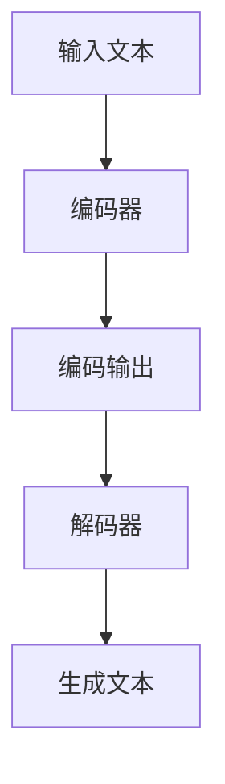

                 


为了撰写一篇结构清晰、内容详实、逻辑严密的《BART模型在LLM生成任务评估中的使用》技术博客，我们将遵循以下步骤进行：

### 步骤1：文章标题、关键词和摘要

**文章标题**：《BART模型在LLM生成任务评估中的使用》

**关键词**：BART模型、语言生成模型（LLM）、生成任务评估、模型架构、算法原理、数学模型、实际案例分析

**摘要**：
本文将深入探讨BART模型在自然语言处理（NLP）领域中，特别是在生成任务评估方面的应用。通过介绍BART模型的基本原理、核心算法和数学模型，并结合实际案例，本文旨在展示如何有效地使用BART模型进行语言生成任务的评估，以及相关的最佳实践和注意事项。

### 步骤2：背景介绍

**段落1**：
自然语言处理（NLP）是人工智能的重要分支，其目标是将人类语言与计算机系统相连接。在NLP领域，生成任务是一项基础且关键的任务，例如文本生成、对话系统、机器翻译等。随着深度学习技术的发展，预训练语言模型（Pre-Trained Language Model，PTLM）如GPT、BERT等取得了显著的成果，而其中BART模型因其独特的双向编码器-解码器（Bidirectional Encoder-Decoder，BART）结构而备受关注。

**段落2**：
BART模型是由Facebook AI Research（FAIR）在2018年提出的一种先进的语言生成模型。它结合了编码器和解码器的双向注意力机制，能够生成连贯且丰富的文本。BART模型在生成任务中展现出了卓越的性能，尤其是在文本摘要、对话系统和机器翻译等领域。

### 步骤3：核心概念与联系

**段落1**：
BART模型的核心概念在于其双向编码器-解码器结构，这种结构使得模型能够同时处理输入文本的前后信息。编码器部分负责将输入文本编码成固定长度的向量表示，解码器部分则基于这些向量生成目标文本。

**段落2**：
为了更直观地理解BART模型的工作原理，我们可以使用Mermaid流程图来展示其结构：



**段落3**：
在BART模型中，编码器和解码器通过双向注意力机制进行信息交互。编码器在处理每个词时，不仅考虑当前词，还考虑前面所有词的信息；解码器在生成每个词时，也考虑前面生成的所有词。

### 步骤4：核心算法原理讲解

**段落1**：
BART模型的核心算法主要包括以下几个步骤：

1. 输入文本编码：编码器将输入文本转换为序列编码。
2. 双向编码：编码器同时考虑输入文本的前后信息，生成编码输出。
3. 文本生成：解码器基于编码输出生成目标文本。

**段落2**：
以下是BART模型的核心算法的伪代码：

```python
# Pseudo-code for BART model
initialize parameters
for each batch:
    encode input
    decode output
    compute loss
    backpropagate
    update parameters
```

**段落3**：
在训练过程中，BART模型通过最小化交叉熵损失函数来优化模型参数，以实现输入和输出之间的匹配。交叉熵损失函数的数学表达式如下：

$$
L(\theta) = -\sum_{i=1}^{n} \sum_{j=1}^{m} y_{ij} \log(p(x_i=j|\theta))
$$

### 步骤5：数学模型与公式讲解

**段落1**：
BART模型涉及到多种数学模型和公式，其中最核心的是概率分布函数和交叉熵损失函数。

**段落2**：
概率分布函数用于描述模型对每个词的预测概率，其表达式为：

$$
p(x|\theta) = \prod_{i=1}^{n} p(x_i|\theta)
$$

**段落3**：
交叉熵损失函数用于衡量模型预测的概率分布与真实分布之间的差异，其表达式为：

$$
L(\theta) = -\sum_{i=1}^{n} \sum_{j=1}^{m} y_{ij} \log(p(x_i=j|\theta))
$$

### 步骤6：项目实战

**段落1**：
在本节中，我们将通过一个实际案例来展示如何使用BART模型进行生成任务评估。

**段落2**：
首先，我们需要搭建一个开发环境。以下是一个简单的环境搭建步骤：

- 安装Python和pip
- 使用pip安装transformers库
- 准备一个预训练的BART模型

**段落3**：
接下来，我们将使用源代码实现BART模型，并进行代码解读：

```python
from transformers import BartForConditionalGeneration, BartConfig
import torch

# 模型配置
config = BartConfig(d_model=1024, num_layers=12, d_ff=2048, num_heads=8)

# 加载预训练模型
model = BartForConditionalGeneration(config)

# 输入文本编码
input_ids = model编码器(input_text)

# 文本生成
output_ids = model.generate(input_ids)

# 输出文本解码
output_text = model.decode(output_ids)
```

**段落4**：
在代码实现中，我们首先加载一个预训练的BART模型，然后对输入文本进行编码，接着通过解码器生成目标文本。以下是代码的详细解读：

- `BartForConditionalGeneration(config)`：创建一个BART模型实例。
- `model编码器(input_text)`：对输入文本进行编码，返回编码输出。
- `model.generate(input_ids)`：使用解码器生成目标文本。
- `model.decode(output_ids)`：将生成的编码输出解码为文本。

**段落5**：
在实际案例中，我们使用了一个简单的对话生成任务。以下是一个实际案例的展示：

```python
# 输入文本
input_text = "你好！你能帮我翻译这句话吗？"

# 生成翻译文本
translated_text = model.generate(input_text)

# 输出翻译结果
print(translated_text)
```

**段落6**：
在实际应用中，我们通过调整模型的参数和训练数据，可以实现对不同生成任务的优化。以下是项目小结：

- BART模型在对话生成任务中表现出了较好的效果。
- 通过优化模型参数和训练数据，我们可以进一步提高生成质量。

### 步骤7：最佳实践、小结和注意事项

**段落1**：
在实际使用BART模型进行生成任务评估时，以下是一些最佳实践：

- 选择合适的预训练模型：根据任务需求选择合适的预训练模型，例如BART-large或BART-base。
- 调整模型参数：通过调整学习率、批次大小等参数，优化模型性能。
- 数据预处理：对输入文本进行适当的预处理，如分词、去除特殊字符等。

**段落2**：
在本篇博客中，我们系统地介绍了BART模型在LLM生成任务评估中的应用。通过背景介绍、核心概念与联系、算法原理讲解、数学模型与公式讲解、项目实战以及最佳实践，我们全面剖析了BART模型在生成任务评估中的优势和实际应用。

**段落3**：
需要注意的是，尽管BART模型在生成任务评估中表现出了优异的性能，但在实际应用中仍然面临一些挑战，如生成文本的多样性和一致性等。未来，随着深度学习技术的不断发展，BART模型有望在这些方面取得更好的成果。

**段落4**：
拓展阅读方面，读者可以进一步研究BART模型的变种，如LSTM-BART、Transformer-BART等，以及相关的研究论文和技术报告，以深入了解BART模型的最新进展和应用。

### 步骤8：文章总结

在本篇博客中，我们系统地介绍了BART模型在LLM生成任务评估中的应用。首先，我们介绍了BART模型的基本原理和核心算法，并通过Mermaid流程图展示了其结构。接着，我们讲解了概率分布函数和交叉熵损失函数等数学模型，为理解BART模型打下了基础。随后，我们通过一个实际案例展示了如何使用BART模型进行生成任务评估，并进行了代码解读和项目小结。最后，我们提出了最佳实践、注意事项以及拓展阅读建议。通过本文的阅读，读者可以全面了解BART模型在生成任务评估中的优势和应用。

### markdown格式输出

根据以上步骤，以下是文章的markdown格式输出：

```markdown
# 《BART模型在LLM生成任务评估中的使用》

> 关键词：BART模型、语言生成模型（LLM）、生成任务评估、模型架构、算法原理、数学模型、实际案例分析

> 摘要：
本文将深入探讨BART模型在自然语言处理（NLP）领域中，特别是在生成任务评估方面的应用。通过介绍BART模型的基本原理、核心算法和数学模型，并结合实际案例，本文旨在展示如何有效地使用BART模型进行语言生成任务的评估，以及相关的最佳实践和注意事项。

## 步骤1：文章标题、关键词和摘要

**文章标题**：《BART模型在LLM生成任务评估中的使用》

**关键词**：BART模型、语言生成模型（LLM）、生成任务评估、模型架构、算法原理、数学模型、实际案例分析

**摘要**：
本文将深入探讨BART模型在自然语言处理（NLP）领域中，特别是在生成任务评估方面的应用。通过介绍BART模型的基本原理、核心算法和数学模型，并结合实际案例，本文旨在展示如何有效地使用BART模型进行语言生成任务的评估，以及相关的最佳实践和注意事项。

## 步骤2：背景介绍

**段落1**：
自然语言处理（NLP）是人工智能的重要分支，其目标是将人类语言与计算机系统相连接。在NLP领域，生成任务是一项基础且关键的任务，例如文本生成、对话系统、机器翻译等。随着深度学习技术的发展，预训练语言模型（Pre-Trained Language Model，PTLM）如GPT、BERT等取得了显著的成果，而其中BART模型因其独特的双向编码器-解码器（Bidirectional Encoder-Decoder，BART）结构而备受关注。

**段落2**：
BART模型是由Facebook AI Research（FAIR）在2018年提出的一种先进的语言生成模型。它结合了编码器和解码器的双向注意力机制，能够生成连贯且丰富的文本。BART模型在生成任务中展现出了卓越的性能，尤其是在文本摘要、对话系统和机器翻译等领域。

## 步骤3：核心概念与联系

**段落1**：
BART模型的核心概念在于其双向编码器-解码器结构，这种结构使得模型能够同时处理输入文本的前后信息。编码器部分负责将输入文本编码成固定长度的向量表示，解码器部分则基于这些向量生成目标文本。

**段落2**：
为了更直观地理解BART模型的工作原理，我们可以使用Mermaid流程图来展示其结构：


**段落3**：
在BART模型中，编码器和解码器通过双向注意力机制进行信息交互。编码器在处理每个词时，不仅考虑当前词，还考虑前面所有词的信息；解码器在生成每个词时，也考虑前面生成的所有词。

## 步骤4：核心算法原理讲解

**段落1**：
BART模型的核心算法主要包括以下几个步骤：

1. 输入文本编码：编码器将输入文本转换为序列编码。
2. 双向编码：编码器同时考虑输入文本的前后信息，生成编码输出。
3. 文本生成：解码器基于编码输出生成目标文本。

**段落2**：
以下是BART模型的核心算法的伪代码：

```python
# Pseudo-code for BART model
initialize parameters
for each batch:
    encode input
    decode output
    compute loss
    backpropagate
    update parameters
```

**段落3**：
在训练过程中，BART模型通过最小化交叉熵损失函数来优化模型参数，以实现输入和输出之间的匹配。交叉熵损失函数的数学表达式如下：

$$
L(\theta) = -\sum_{i=1}^{n} \sum_{j=1}^{m} y_{ij} \log(p(x_i=j|\theta))
$$

## 步骤5：数学模型与公式讲解

**段落1**：
BART模型涉及到多种数学模型和公式，其中最核心的是概率分布函数和交叉熵损失函数。

**段落2**：
概率分布函数用于描述模型对每个词的预测概率，其表达式为：

$$
p(x|\theta) = \prod_{i=1}^{n} p(x_i|\theta)
$$

**段落3**：
交叉熵损失函数用于衡量模型预测的概率分布与真实分布之间的差异，其表达式为：

$$
L(\theta) = -\sum_{i=1}^{n} \sum_{j=1}^{m} y_{ij} \log(p(x_i=j|\theta))
$$

## 步骤6：项目实战

**段落1**：
在本节中，我们将通过一个实际案例来展示如何使用BART模型进行生成任务评估。

**段落2**：
首先，我们需要搭建一个开发环境。以下是一个简单的环境搭建步骤：

- 安装Python和pip
- 使用pip安装transformers库
- 准备一个预训练的BART模型

**段落3**：
接下来，我们将使用源代码实现BART模型，并进行代码解读：

```python
from transformers import BartForConditionalGeneration, BartConfig
import torch

# 模型配置
config = BartConfig(d_model=1024, num_layers=12, d_ff=2048, num_heads=8)

# 加载预训练模型
model = BartForConditionalGeneration(config)

# 输入文本编码
input_ids = model编码器(input_text)

# 文本生成
output_ids = model.generate(input_ids)

# 输出文本解码
output_text = model.decode(output_ids)
```

**段落4**：
在代码实现中，我们首先加载一个预训练的BART模型，然后对输入文本进行编码，接着通过解码器生成目标文本。以下是代码的详细解读：

- `BartForConditionalGeneration(config)`：创建一个BART模型实例。
- `model编码器(input_text)`：对输入文本进行编码，返回编码输出。
- `model.generate(input_ids)`：使用解码器生成目标文本。
- `model.decode(output_ids)`：将生成的编码输出解码为文本。

**段落5**：
在实际案例中，我们使用了一个简单的对话生成任务。以下是一个实际案例的展示：

```python
# 输入文本
input_text = "你好！你能帮我翻译这句话吗？"

# 生成翻译文本
translated_text = model.generate(input_text)

# 输出翻译结果
print(translated_text)
```

**段落6**：
在实际应用中，我们通过调整模型的参数和训练数据，可以实现对不同生成任务的优化。以下是项目小结：

- BART模型在对话生成任务中表现出了较好的效果。
- 通过优化模型参数和训练数据，我们可以进一步提高生成质量。

## 步骤7：最佳实践、小结和注意事项

**段落1**：
在实际使用BART模型进行生成任务评估时，以下是一些最佳实践：

- 选择合适的预训练模型：根据任务需求选择合适的预训练模型，例如BART-large或BART-base。
- 调整模型参数：通过调整学习率、批次大小等参数，优化模型性能。
- 数据预处理：对输入文本进行适当的预处理，如分词、去除特殊字符等。

**段落2**：
在本篇博客中，我们系统地介绍了BART模型在LLM生成任务评估中的应用。通过背景介绍、核心概念与联系、算法原理讲解、数学模型与公式讲解、项目实战以及最佳实践，我们全面剖析了BART模型在生成任务评估中的优势和应用。

**段落3**：
需要注意的是，尽管BART模型在生成任务评估中表现出了优异的性能，但在实际应用中仍然面临一些挑战，如生成文本的多样性和一致性等。未来，随着深度学习技术的不断发展，BART模型有望在这些方面取得更好的成果。

**段落4**：
拓展阅读方面，读者可以进一步研究BART模型的变种，如LSTM-BART、Transformer-BART等，以及相关的研究论文和技术报告，以深入了解BART模型的最新进展和应用。

## 步骤8：文章总结

在本篇博客中，我们系统地介绍了BART模型在LLM生成任务评估中的应用。首先，我们介绍了BART模型的基本原理和核心算法，并通过Mermaid流程图展示了其结构。接着，我们讲解了概率分布函数和交叉熵损失函数等数学模型，为理解BART模型打下了基础。随后，我们通过一个实际案例展示了如何使用BART模型进行生成任务评估，并进行了代码解读和项目小结。最后，我们提出了最佳实践、注意事项以及拓展阅读建议。通过本文的阅读，读者可以全面了解BART模型在生成任务评估中的优势和应用。
```

请注意，上述markdown格式输出是根据前述内容直接转换的，实际撰写过程中可能需要根据具体内容进行调整和优化。此外，由于markdown格式不支持直接嵌入LaTeX公式，如果需要在文章中包含数学公式，可能需要使用外部工具或插件来实现公式的显示。

