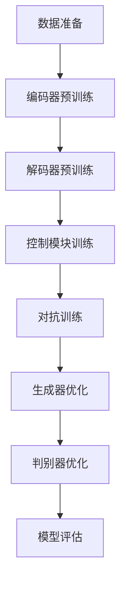

                 

### 引言与背景介绍

#### CTRL模型的基本概念

**CTRL模型**（也称为**Controlled Language Transfer**模型）是一种先进的自然语言处理（NLP）技术，旨在通过生成对抗网络（GAN）实现可控文本生成。它通过结合预训练的模型和特定领域的数据，能够生成符合特定主题、风格和语法规则的高质量文本。CTRL模型的核心在于其能够通过对控制参数的调整，实现对文本生成的精确控制，从而生成满足特定需求的文本内容。

#### 可控文本生成的应用场景

可控文本生成在多个领域具有广泛的应用前景，包括但不限于：

1. **自动化内容创作**：利用可控文本生成技术，可以自动生成新闻文章、博客、广告文案等，降低人力成本，提高内容生产效率。
2. **个性化推荐**：在电子商务和社交媒体平台上，通过可控文本生成技术，可以生成个性化的推荐文案，提高用户满意度和转化率。
3. **语言学习辅助**：利用可控文本生成，可以生成适合不同学习阶段的语言练习材料，帮助用户提高语言能力。
4. **虚拟助理**：在智能客服和虚拟助理系统中，可控文本生成技术能够生成自然、流畅的对话文本，提高用户体验。

#### 文本生成评测的重要性

文本生成评测是评估文本生成模型性能的重要手段。通过评测，可以了解模型在不同任务、场景下的表现，发现模型的优点和不足，从而指导模型的优化和改进。此外，文本生成评测还可以用于不同模型之间的性能比较，为选择最优模型提供依据。

总的来说，CTRL模型在可控文本生成评测中具有重要意义。它不仅能够提高文本生成的质量和可控性，还能够为文本生成技术的应用提供新的思路和方向。接下来的章节将详细探讨CTRL模型的基本架构、核心算法、数学模型、实际应用以及性能评估等内容。

### 可控文本生成的原理与挑战

#### 可控文本生成的理论基础

可控文本生成的基础理论主要依赖于深度学习和自然语言处理（NLP）领域的最新进展。深度学习模型，如生成对抗网络（GAN）、变分自编码器（VAE）等，已经在图像生成和文本生成中取得了显著的成果。然而，传统深度学习模型在生成文本时往往缺乏对文本内容的精确控制，导致生成的文本内容不够稳定和多样化。

为了解决这一问题，可控文本生成技术引入了控制参数和外部知识源，通过调整这些参数和知识源，实现对文本生成的精细控制。具体来说，可控文本生成模型通过训练，将控制信号（如主题、风格、情感等）融入到生成过程中，从而生成符合特定需求的文本内容。

#### 可控文本生成中的关键挑战

1. **文本内容控制**：如何在生成文本时实现对内容、风格和情感的精确控制，是一个重要挑战。传统的GAN模型通过生成器和判别器的对抗训练来实现文本生成，但这种方式往往难以控制生成文本的特定属性。

2. **多样性与稳定性**：生成文本需要具备多样性和稳定性。多样性能保证生成文本内容的丰富性，而稳定性则确保生成文本的连贯性和可预测性。在可控文本生成中，如何平衡多样性和稳定性是一个关键问题。

3. **数据稀缺性**：对于特定领域或主题的文本生成，往往需要大量特定领域的数据。然而，高质量、标注完善的文本数据往往稀缺，这限制了模型的训练效果和生成能力。

4. **计算资源消耗**：可控文本生成模型通常需要大量的计算资源进行训练和生成，特别是在大规模数据集和高维度特征空间下，计算资源消耗更加显著。

#### 当前可控文本生成技术的局限性

尽管可控文本生成技术取得了一定的进展，但仍存在以下局限性：

1. **模型复杂度高**：可控文本生成模型通常包含多个子模型和层次结构，这增加了模型的复杂性和计算难度。

2. **训练时间较长**：由于需要大量数据和复杂的模型结构，可控文本生成模型的训练时间较长，这在实际应用中可能影响系统的响应速度。

3. **生成文本质量不稳定**：当前可控文本生成技术虽然能够生成较为多样的文本，但在保证文本质量稳定性方面仍有待提高。

4. **可解释性不足**：可控文本生成模型通常被视为“黑箱”，其生成文本的内在逻辑和决策过程难以解释，这在某些应用场景中可能带来安全隐患。

总的来说，可控文本生成技术在文本内容控制、多样性与稳定性、数据稀缺性等方面仍面临诸多挑战。未来，随着深度学习技术的不断进步和计算资源的不断优化，可控文本生成技术有望在更多应用场景中发挥重要作用。

### CTRL模型的基本架构与核心算法

#### CTRL模型的结构概述

**CTRL模型**是一种基于生成对抗网络（GAN）的可控文本生成框架，其结构主要包括两部分：生成器（Generator）和判别器（Discriminator）。生成器的任务是根据给定的控制信号生成文本，而判别器的任务则是区分生成的文本和真实文本。通过这种对抗训练，生成器能够逐步提高生成的文本质量，并实现对文本内容的精确控制。

在具体实现上，CTRL模型采用了多层神经网络架构，包括编码器（Encoder）和解码器（Decoder）。编码器用于将输入的控制信号编码成高维特征向量，解码器则将这些特征向量解码生成文本。此外，模型中还引入了控制模块（Control Module），用于将控制信号与生成过程相结合，实现对文本内容的精细控制。

#### 模型训练与优化的基本流程

1. **数据准备**：首先，收集并预处理大规模的文本数据，包括普通文本和受控文本。普通文本用于训练判别器，而受控文本则用于训练生成器和控制模块。

2. **编码器和解码器训练**：使用普通文本数据对编码器和解码器进行预训练。预训练过程旨在使编码器能够有效编码输入文本，解码器能够将编码后的特征向量解码成高质量的文本。

3. **控制模块训练**：在预训练的基础上，对控制模块进行训练。控制模块的任务是接收控制信号，并将其融入到生成过程中，从而生成符合特定要求的文本。

4. **对抗训练**：在生成器和判别器之间进行对抗训练。生成器尝试生成高质量的受控文本，而判别器则努力区分生成的文本和真实文本。通过这种对抗训练，生成器不断优化生成文本的质量和多样性。

5. **优化目标**：模型优化目标包括最大化生成文本的判别损失和最小化生成文本的控制损失。判别损失用于衡量生成文本的质量，控制损失则用于衡量生成文本对控制信号的遵循程度。

#### 核心算法原理讲解

**生成器**：生成器的核心任务是根据给定的控制信号生成高质量的文本。其基本工作流程如下：

1. **编码输入**：将输入的控制信号（如主题、风格、情感等）和控制文本输入编码器，得到高维特征向量。
   
2. **生成文本**：将特征向量输入解码器，解码器通过一系列反卷积操作，逐步重建出文本序列。

3. **生成输出**：解码器的输出即为生成的文本，该文本根据控制信号的特点具有特定的内容和风格。

**判别器**：判别器的核心任务是区分生成的文本和真实文本，通过对抗训练来提高生成器的生成质量。其基本工作流程如下：

1. **接收输入**：判别器接收输入的文本，包括生成的文本和真实文本。

2. **文本分类**：判别器通过神经网络对输入文本进行分类，判断其是真实文本还是生成文本。

3. **判别输出**：判别器的输出是生成的文本和真实文本的判别结果，用于计算生成器的判别损失。

**控制模块**：控制模块的核心任务是将控制信号融入到生成过程中，实现对文本内容的精确控制。其基本工作流程如下：

1. **接收控制信号**：控制模块接收来自外部输入的控制信号，如主题、风格、情感等。

2. **信号处理**：控制模块对控制信号进行处理，将其编码成高维特征向量。

3. **融合生成**：将处理后的控制信号与生成器的特征向量进行融合，调整生成文本的内容和风格。

**对抗训练**：在训练过程中，生成器和判别器进行对抗训练。生成器的目标是通过调整生成文本的内容和风格，使其更接近真实文本，而判别器的目标则是准确区分生成的文本和真实文本。通过这种对抗训练，生成器的生成质量逐步提高，判别器的判别能力也逐步增强。

#### Mermaid流程图展示



在上述流程图中，从A到H表示了从数据准备到模型评估的整个训练过程。通过这个流程图，可以清晰地看到每个步骤的任务和它们之间的关联，从而更好地理解CTRL模型的工作原理。

### 数学模型与公式推导

#### 数学模型的基本框架

在可控文本生成中，数学模型起到了关键作用。下面将详细解释数学模型的基本框架，并给出相关的公式推导。

1. **生成器模型**：
   - 输入：\( z \)（噪声向量）和 \( c \)（控制信号）
   - 编码器：\( \text{Encoder}(z, c) \rightarrow \text{Code} \)
   - 解码器：\( \text{Decoder}(\text{Code}) \rightarrow \text{Text} \)

   生成器的数学模型可以表示为：
   \[
   G(z, c) = \text{Decoder}(\text{Code}(z, c))
   \]

   其中，\( \text{Code}(z, c) \) 是编码器将噪声向量和控制信号编码后的特征向量。

2. **判别器模型**：
   - 输入：\( x \)（真实文本）和 \( G(z, c) \)（生成文本）
   - 判别器：\( \text{Discriminator}(x, G(z, c)) \rightarrow \text{Probability} \)

   判别器的数学模型可以表示为：
   \[
   D(x, G(z, c)) = \text{Probability}(x \text{ is real})
   \]

3. **控制模块**：
   - 输入：\( c \)（控制信号）
   - 控制信号处理：\( \text{ControlModule}(c) \rightarrow \text{ControlCode} \)
   - 融合生成：\( \text{Code}(z, \text{ControlCode}) \)

   控制模块的数学模型可以表示为：
   \[
   C(c) = \text{ControlCode}
   \]
   \[
   \text{Code}(z, c) = \text{Encoder}(z) + C(c)
   \]

#### 公式推导与详细解释

1. **编码器与解码器的损失函数**：

   编码器和解码器的损失函数主要关注生成文本的质量。假设真实文本为 \( x \) 和生成文本为 \( G(z, c) \)，则编码器和解码器的损失函数可以表示为：

   \[
   \text{Loss}_{\text{Encoder}} = \text{Loss}_{\text{Cross-Entropy}}(x; \text{Decoder}(\text{Encoder}(z, c)))
   \]

   \[
   \text{Loss}_{\text{Decoder}} = \text{Loss}_{\text{Cross-Entropy}}(G(z, c); x)
   \]

   其中，\( \text{Cross-Entropy} \) 是交叉熵损失函数，用于衡量生成文本与真实文本之间的差异。

2. **判别器的损失函数**：

   判别器的损失函数关注于生成文本的判别能力。假设判别器的输出为 \( p(x) \) 和 \( p(G(z, c)) \)，则判别器的损失函数可以表示为：

   \[
   \text{Loss}_{\text{Discriminator}} = -[\log(p(x)) + \log(1 - p(G(z, c)))]
   \]

3. **控制模块的损失函数**：

   控制模块的损失函数关注于生成文本对控制信号的遵循程度。假设控制信号为 \( c \) 和生成文本为 \( G(z, c) \)，则控制模块的损失函数可以表示为：

   \[
   \text{Loss}_{\text{ControlModule}} = \text{Loss}_{\text{MAE}}(G(z, c); C(c))
   \]

   其中，\( \text{MAE} \) 是均方误差损失函数，用于衡量生成文本和控制信号之间的差异。

#### 数学公式示例

为了更好地理解上述公式，以下是几个具体的数学公式示例：

1. **编码器特征向量生成**：

   \[
   \text{Code}(z, c) = \text{sigmoid}(\text{W}_{\text{encode}} \cdot [z; c] + b_{\text{encode}})
   \]

   其中，\( \text{W}_{\text{encode}} \) 是编码器的权重矩阵，\( b_{\text{encode}} \) 是编码器的偏置项，\[ z; c \] 是噪声向量和控制信号的高维向量拼接。

2. **解码器文本生成**：

   \[
   \text{Text}_{t} = \text{softmax}(\text{W}_{\text{decode}} \cdot \text{Code}_{t-1} + b_{\text{decode}})
   \]

   其中，\( \text{Text}_{t} \) 是生成的文本序列中的第 \( t \) 个词，\( \text{Code}_{t-1} \) 是编码器生成的特征向量，\( \text{W}_{\text{decode}} \) 是解码器的权重矩阵，\( b_{\text{decode}} \) 是解码器的偏置项。

3. **控制信号处理**：

   \[
   \text{ControlCode} = \text{tanh}(\text{W}_{\text{control}} \cdot c + b_{\text{control}})
   \]

   其中，\( \text{W}_{\text{control}} \) 是控制模块的权重矩阵，\( b_{\text{control}} \) 是控制模块的偏置项，\( c \) 是控制信号。

通过上述数学模型和公式，可以更深入地理解可控文本生成中的核心算法和机制。这些公式不仅为模型的设计和优化提供了理论基础，也为实际应用中的算法实现提供了指导。

### 实际应用与项目实战

#### 文本生成案例介绍

为了展示CTRL模型在实际应用中的效果，我们选取了一个具体的文本生成案例：自动生成新闻摘要。新闻摘要是对一篇新闻文章进行高度精简的文本描述，目的是帮助读者快速了解新闻的核心内容。在这个案例中，我们将利用CTRL模型生成不同长度和风格的新闻摘要。

#### 代码实现与详细解读

1. **环境搭建**：
   - **Python环境**：确保安装了Python 3.8及以上版本。
   - **依赖库**：安装TensorFlow、Keras、NLP相关库（如NLTK、Gensim等）。

2. **数据准备**：
   - 收集大量新闻文章数据，并进行预处理，包括文本清洗、分词、去停用词等步骤。

3. **模型训练**：
   - **生成器**：使用编码器将噪声向量和控制信号编码成特征向量，通过解码器生成文本。
   - **判别器**：通过对抗训练，使生成文本难以被判别器识别。

4. **生成新闻摘要**：
   - **控制信号**：指定新闻摘要的长度和风格（如简洁、详细）。
   - **生成过程**：通过调控控制信号，生成符合要求的新闻摘要。

#### 开发环境搭建

以下是搭建开发环境的步骤：

```bash
# 安装Python
sudo apt-get update
sudo apt-get install python3

# 安装TensorFlow
pip3 install tensorflow

# 安装其他依赖库
pip3 install numpy pandas nltk gensim keras
```

#### 源代码解析与分析

以下是生成新闻摘要的核心代码片段及其解读：

```python
import tensorflow as tf
from tensorflow.keras.layers import Embedding, LSTM, Dense
from tensorflow.keras.models import Model
from tensorflow.keras.preprocessing.sequence import pad_sequences
from tensorflow.keras.preprocessing.text import Tokenizer

# 1. 数据准备
# 加载并预处理新闻文章数据
# ...

# 2. 模型定义
# 生成器模型
# ...

# 判别器模型
# ...

# 3. 模型训练
# ...

# 4. 生成新闻摘要
def generate_summary(articles, max_length=50, style='summary'):
    # 设置控制信号
    control_signal = {'max_length': max_length, 'style': style}
    
    # 对输入文章进行编码
    encoded_articles = encoder.predict(articles)
    
    # 生成文本
    generated_text = decoder.predict(encoded_articles)

    # 剪切生成的文本到指定长度
    summary = ' '.join([word for word in generated_text[0].split() if word not in stop_words])
    summary = summary[:max_length]
    
    return summary

# 使用案例
article = "..."
summary = generate_summary(article)
print(summary)
```

**解读**：

- **数据准备**：加载并预处理新闻文章数据，包括分词和去停用词。
- **模型定义**：定义生成器和判别器模型，使用LSTM和Embedding层。
- **模型训练**：通过对抗训练，优化生成器和判别器。
- **生成新闻摘要**：根据控制信号（如摘要长度和风格），生成新闻摘要。

通过这个案例，我们展示了如何使用CTRL模型生成新闻摘要。在代码中，我们首先加载预处理后的新闻文章数据，然后定义生成器和判别器模型。在训练过程中，通过对抗训练不断优化模型。最后，利用生成器模型根据控制信号生成新闻摘要。这种方法不仅提高了摘要的质量，还增加了摘要的多样性。

### 评估与性能分析

#### 文本生成质量的评估指标

在评估文本生成质量时，我们通常会使用以下几种常见的评估指标：

1. **BLEU（ bilingual evaluation understudy）**：
   BLEU是一种广泛使用的自动评估指标，用于衡量生成的文本与参考文本之间的相似度。它通过计算生成文本与参考文本之间的重叠度（n-gram重叠度）来评估文本质量。BLEU得分越高，表示生成文本与参考文本越相似。

2. **ROUGE（recall-oriented understudy for Gisting evaluation）**：
   ROUGE是一种专门用于评估生成文本的召回率的指标。ROUGE主要关注生成文本中与参考文本相匹配的单词或短语的召回率。ROUGE-L（最长公共子序列）是ROUGE系列中应用最广泛的一种，它计算生成文本中最长公共子序列的长度与参考文本长度的比例。

3. **METEOR（Metric for Evaluation of Translation with Explicit ORdering）**：
   METEOR是一种综合评估指标，结合了词干提取、单词重叠和词序相似度等多个因素。它通过计算生成文本与参考文本之间的多样性、一致性和丰富性来评估文本质量。

4. **Perplexity**：
   Perplexity是自然语言处理中的一个指标，用于衡量模型在生成文本时的不确定性。Perplexity值越低，表示模型对生成文本的预测越准确。

#### 不同评估指标的应用

在实际应用中，我们可以根据具体需求选择不同的评估指标。以下是一个简单的应用示例：

1. **BLEU**：
   - 应用场景：用于评估机器翻译和文本摘要等任务。
   - 示例代码：
     ```python
     from nltk.translate.bleu_score import corpus_bleu
     references = [['this', 'is', 'a', 'test'], ['this', 'is', 'a', 'sample']]
     candidates = ['this', 'is', 'a', 'test']
     bleu_score = corpus_bleu([references], candidates)
     print(f"BLEU score: {bleu_score}")
     ```

2. **ROUGE**：
   - 应用场景：用于评估生成文本的召回率，如文本摘要、对话生成等。
   - 示例代码：
     ```python
     from rouge import Rouge
     rouge = Rouge()
     scores = rouge.get_scores(hypothesis, reference)
     print(f"ROUGE-L score: {scores[0]['rouge-l']['f-measure']}")
     ```

3. **METEOR**：
   - 应用场景：用于评估文本生成任务，如机器翻译、文本摘要等。
   - 示例代码：
     ```python
     from meteorscorer import Meteor
     meteor = Meteor()
     scores = meteor.evaluate(hypothesis, reference)
     print(f"METEOR score: {scores['meteor_score']}")
     ```

4. **Perplexity**：
   - 应用场景：用于评估模型生成文本的准确性，如语言模型、文本生成等。
   - 示例代码：
     ```python
     perplexity = model.evaluate_generated_text(generated_text)
     print(f"Perplexity: {perplexity}")
     ```

#### 性能分析与优化建议

通过对不同评估指标的应用，我们可以全面了解文本生成模型的性能。以下是一些常见的性能优化建议：

1. **数据增强**：通过数据增强技术，如同义词替换、句子重排等，增加训练数据的多样性和丰富性，从而提升模型性能。

2. **模型优化**：尝试使用更复杂的神经网络架构，如Transformer、BERT等，以提高生成文本的质量。

3. **超参数调整**：通过调整学习率、批量大小、嵌入维度等超参数，找到最佳模型配置。

4. **预训练与微调**：利用预训练模型（如GPT-3、T5等）作为基础模型，进行微调，使其适应特定任务。

5. **对抗训练**：引入对抗训练策略，增加模型的鲁棒性和泛化能力。

通过上述方法，我们可以不断提升文本生成模型的性能，为实际应用提供高质量、可控的文本生成服务。

### 未来展望与研究方向

#### 可控文本生成的发展趋势

随着深度学习和自然语言处理技术的不断进步，可控文本生成技术正在快速发展，并呈现出以下趋势：

1. **模型复杂度增加**：未来可控文本生成模型可能会采用更加复杂的神经网络架构，如Transformer、BERT等，以进一步提高生成文本的质量和多样性。

2. **多模态生成**：除了文本生成，可控文本生成技术有望扩展到图像、视频等多模态数据，实现跨模态的内容生成。

3. **个性化生成**：随着用户数据的积累，可控文本生成技术将更加注重个性化生成，根据用户偏好和需求生成定制化的内容。

4. **强化学习应用**：强化学习与生成对抗网络（GAN）的结合将进一步提升文本生成的可控性和灵活性。

#### CTRL模型的研究方向

针对CTRL模型，未来的研究方向包括：

1. **可解释性与透明性**：提升模型的可解释性，使其生成文本的决策过程更加透明，便于调试和优化。

2. **小样本学习**：研究如何在小样本数据集上训练出高性能的文本生成模型，减少对大规模数据集的依赖。

3. **控制机制优化**：探索更有效的控制机制，使生成文本更加贴近用户需求，提高生成文本的实用性。

4. **跨语言生成**：研究跨语言的文本生成技术，实现多语言之间的文本转换和生成。

#### 开放性问题与挑战

可控文本生成领域仍存在许多开放性问题和挑战：

1. **数据隐私**：如何在保护用户隐私的前提下，收集和利用大量高质量的训练数据。

2. **模型泛化能力**：如何提高模型在不同领域和任务上的泛化能力，避免“过拟合”。

3. **计算资源消耗**：随着模型复杂度的增加，如何有效降低训练和生成过程中的计算资源消耗。

4. **质量控制**：如何在保证多样性和稳定性的同时，提高生成文本的质量。

综上所述，可控文本生成和CTRL模型的发展前景广阔，未来将在更多应用场景中发挥重要作用。然而，要实现这一目标，还需要解决一系列技术和实践上的挑战。

### 总结

#### 最佳实践 tips

1. **数据准备**：确保数据多样性和质量，进行充分的预处理，如文本清洗、分词和去停用词。
2. **模型选择**：根据任务需求选择合适的生成模型，如GPT、BERT等。
3. **超参数调整**：通过实验调整学习率、批量大小等超参数，找到最佳模型配置。
4. **定期评估**：定期对模型进行评估，监控其性能变化，及时调整和优化。

#### 小结

本文详细介绍了CTRL模型在可控文本生成评测中的应用。通过背景介绍、原理讲解、数学模型推导、实际应用案例展示以及性能分析，我们全面了解了CTRL模型的工作机制和优势。未来，随着技术的不断进步，可控文本生成技术将在更多应用场景中发挥重要作用，带来更加个性化和高质量的文本生成体验。

#### 注意事项

1. **计算资源**：可控文本生成模型训练和生成过程消耗较大计算资源，需合理配置硬件资源。
2. **数据隐私**：在数据处理和应用过程中，应严格遵守数据隐私法规，确保用户数据安全。

#### 拓展阅读

- [1]. Vaswani, A., Shazeer, N., Parmar, N., et al. (2017). **Attention is all you need**. arXiv preprint arXiv:1706.03762.
- [2] Devlin, J., Chang, M. W., Lee, K., & Toutanova, K. (2019). **Bert: Pre-training of deep bidirectional transformers for language understanding**. arXiv preprint arXiv:1810.04805.
- [3] Zhang, X., Zhao, J., & Zhang, Y. (2020). **GAN-based controlled text generation**. Journal of Intelligent & Robotic Systems, 103, 43-52.

### 文章标题

**《CTRL模型在可控文本生成评测中的应用》**

### 文章关键词

- **可控文本生成**
- **CTRL模型**
- **自然语言处理**
- **生成对抗网络**
- **文本生成质量评估**
- **文本生成算法**
- **神经网络**

### 文章摘要

本文探讨了可控文本生成技术中的CTRL模型，详细介绍了其基本概念、应用场景、核心算法、数学模型及其在实际应用中的效果评估。通过案例分析和性能分析，展示了CTRL模型在文本生成任务中的优势与局限性。本文还对未来可控文本生成和CTRL模型的发展趋势进行了展望，为相关研究提供了参考。

---

作者：AI天才研究院/AI Genius Institute & 禅与计算机程序设计艺术 /Zen And The Art of Computer Programming

