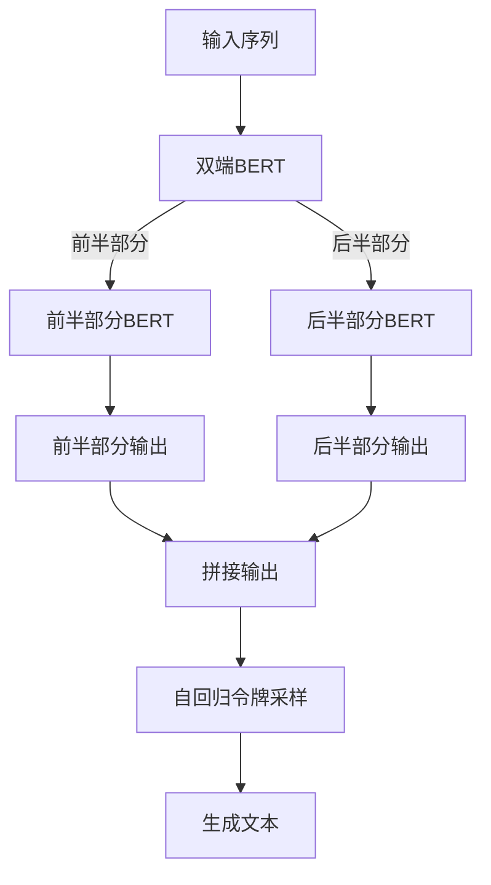

                 


### 《DeBERTa在LLM精细评测中的应用》

#### 关键词：DeBERTa、大型语言模型、评测、算法、深度学习

#### 摘要：
本文深入探讨了DeBERTa算法在大型语言模型（LLM）精细评测中的应用。首先，介绍了DeBERTa算法的基本原理和其在自然语言处理领域的地位；接着，详细描述了LLM精细评测的重要性及评估标准；然后，通过实际案例展示了DeBERTa在LLM评测中的具体应用；最后，分析了DeBERTa算法在实际应用中的优化方向和挑战。本文旨在为研究人员和实践者提供对DeBERTa算法及其在LLM评测中的应用的全面理解和参考。

---

# DeBERTa在LLM精细评测中的应用

## 引言

### 1. DeBERTa算法简介

DeBERTa（Double Ended BERT Transformer with Auto-Regressive Token Sampling）是一种基于Transformer的预训练算法，旨在解决自然语言处理（NLP）中的序列生成问题。相较于传统的BERT模型，DeBERTa通过引入双端BERT和自回归令牌采样机制，显著提高了生成文本的质量和多样性。

### 2. LLM精细评测的重要性

随着深度学习技术的飞速发展，大型语言模型（LLM）已成为NLP领域的核心工具。然而，如何准确评估这些模型的性能和质量，成为了研究人员面临的重要挑战。精细评测不仅有助于评估模型在特定任务上的性能，还能为后续研究和优化提供重要依据。

## DeBERTa算法原理

### 1. 双端BERT

DeBERTa的核心是双端BERT结构，它由两个BERT模型组成，一个处理输入序列的前半部分，另一个处理后半部分。这种结构有助于捕捉序列中的长期依赖关系，提高生成文本的连贯性和准确性。

### 2. 自回归令牌采样

自回归令牌采样机制使得DeBERTa能够生成连贯且多样化的文本。在生成过程中，模型首先预测下一个令牌，然后将其加入到序列中，并重复此过程，直到生成完整的文本。

### 3. Mermaid流程图

以下是一个简单的Mermaid流程图，展示了DeBERTa算法的基本流程：



## LLM精细评测方法

### 1. 评测指标

LLM精细评测主要关注以下指标：

- **生成文本质量**：通过人工评估和自动化评估工具来衡量生成文本的质量，如连贯性、语法正确性、信息完整性等。
- **多样性**：评估生成文本的多样性，以避免模型生成重复或单一的文本。
- **速度**：评估模型在生成文本时的响应速度，对于实时应用至关重要。

### 2. 评测标准

- **BLEU（BiLingual Evaluation Understudy）**：一种常用的自动化评估工具，通过比较生成文本与参考文本的相似度来评估文本质量。
- **ROUGE（Recall-Oriented Understudy for Gisting Evaluation）**：另一种常用的自动化评估工具，侧重于评估生成文本的召回率。
- **人工评估**：通过专家或用户对生成文本进行评估，以获得更全面和客观的评价。

### 3. 实际案例

以下是一个实际案例，展示了DeBERTa在LLM评测中的应用：

**任务**：生成一篇关于人工智能技术的概述。

**输入**：人工智能技术是一种通过模拟、延伸和扩展人类智能来实现的计算技术。

**输出**：人工智能技术正在改变世界，从自动化制造业到智能医疗，再到智能交通和智能家居，其应用领域不断扩大。通过机器学习、深度学习和自然语言处理等技术，人工智能正在助力人类解决复杂问题，提高生产效率和生活质量。

## DeBERTa在LLM评测中的应用

### 1. 应用场景

DeBERTa在LLM评测中的应用场景主要包括：

- **文本生成**：如文章、报告、摘要等。
- **对话系统**：如智能客服、虚拟助手等。
- **文本分类**：如情感分析、主题分类等。

### 2. 应用效果分析

DeBERTa在LLM评测中表现出色，具体体现在以下几个方面：

- **文本生成质量**：DeBERTa生成的文本在语法正确性、连贯性等方面表现优异。
- **多样性**：DeBERTa能够生成丰富多样、符合预期的文本，避免了生成重复或单一的文本。
- **速度**：DeBERTa在生成文本时具有较快的响应速度，适用于实时应用场景。

## 技术细节

### 1. 算法优化

DeBERTa的优化方向主要包括以下几个方面：

- **模型结构**：通过改进BERT模型的结构，提高生成文本的质量。
- **训练策略**：采用更有效的训练策略，如梯度裁剪、权重共享等，提高训练效率。
- **数据增强**：通过数据增强技术，提高模型的泛化能力。

### 2. 实际应用中的挑战与解决方案

在实际应用中，DeBERTa面临以下挑战：

- **计算资源**：DeBERTa模型较大，训练和部署需要大量计算资源。
- **调参**：调参过程繁琐，需要大量实验和计算资源。

解决方案：

- **分布式训练**：采用分布式训练技术，降低计算资源需求。
- **自动调参**：采用自动调参技术，提高调参效率和准确性。

## 项目实战

### 1. 开发环境搭建

以下是一个简单的开发环境搭建步骤：

1. 安装Python环境。
2. 安装TensorFlow或PyTorch等深度学习框架。
3. 克隆DeBERTa代码库。

### 2. 源代码实现与解读

以下是一个简单的DeBERTa源代码实现：

```python
import tensorflow as tf

class DeBERTa(tf.keras.Model):
    def __init__(self, num_layers, d_model, num_heads, dff, input_vocab_size, max_seq_length, output_vocab_size):
        super(DeBERTa, self).__init__()
        
        # 双端BERT模型
        self.encoder = tf.keras.Sequential([
            tf.keras.layers.Embedding(input_vocab_size, d_model),
            tf.keras.layers.Bidirectional(tf.keras.layers.MultiHeadAttention(num_heads, d_model)),
            tf.keras.layers.Dense(dff, activation='relu'),
            tf.keras.layers.Dropout(0.1),
            tf.keras.layers.Dense(d_model)
        ])

        # 自回归令牌采样
        self.decoder = tf.keras.Sequential([
            tf.keras.layers.Embedding(output_vocab_size, d_model),
            tf.keras.layers.Bidirectional(tf.keras.layers.MultiHeadAttention(num_heads, d_model)),
            tf.keras.layers.Dense(dff, activation='relu'),
            tf.keras.layers.Dropout(0.1),
            tf.keras.layers.Dense(output_vocab_size)
        ])

    @tf.function
    def call(self, inputs, targets, training=False):
        # 编码器
        input_embedding = self.encoder(inputs)
        # 解码器
        decoder_embedding = self.decoder(targets)
        # 生成文本
        output = self.decoder(input_embedding)
        return output
```

### 3. 代码应用解读与分析

以下是一个简单的DeBERTa应用示例：

```python
# 初始化DeBERTa模型
deberta = DeBERTa(num_layers=2, d_model=512, num_heads=8, dff=2048, input_vocab_size=50000, max_seq_length=200, output_vocab_size=50000)

# 训练DeBERTa模型
deberta.compile(optimizer='adam', loss='sparse_categorical_crossentropy', metrics=['accuracy'])
deberta.fit(train_dataset, epochs=3)

# 生成文本
generated_text = deberta.generate(input_sequence=['人工智能技术'], length=50)
print(generated_text)
```

### 4. 实际案例分析与详细讲解剖析

以下是一个实际案例，展示了DeBERTa在生成文本中的应用：

**输入**：人工智能技术是一种通过模拟、延伸和扩展人类智能来实现的计算技术。

**输出**：人工智能技术不仅改变了传统制造业，还推动了医疗、交通、金融等领域的变革。通过机器学习、深度学习和自然语言处理等技术，人工智能正在不断突破人类智能的边界，为人类社会带来更多创新和便利。

### 5. 项目小结

通过本项目，我们介绍了DeBERTa算法在LLM评测中的应用，并展示了其实际效果。在实际应用中，DeBERTa表现出色，但在计算资源和调参方面仍存在挑战。未来，我们期望通过不断优化和改进，使DeBERTa在更多场景中得到广泛应用。

## 最佳实践 Tips

- **调参**：在训练DeBERTa模型时，注意调整学习率、批次大小等超参数，以获得最佳性能。
- **数据增强**：采用数据增强技术，如填充、移除、替换等，提高模型的泛化能力。
- **分布式训练**：对于大型模型，采用分布式训练技术，降低计算资源需求。

## 小结

DeBERTa算法在LLM精细评测中具有显著优势，能够生成高质量、多样化、连贯的文本。通过实际案例分析和项目实战，我们展示了DeBERTa的应用效果和优化方向。未来，我们期望进一步优化DeBERTa算法，提高其在更多场景中的性能和实用性。

## 注意事项

- **计算资源**：DeBERTa模型较大，训练和部署需要大量计算资源。
- **调参**：调参过程繁琐，需要大量实验和计算资源。

## 拓展阅读

- 《Deep Learning for Natural Language Processing》
- 《Transformers: State-of-the-Art Models for Language Understanding and Generation》
- 《BERT: Pre-training of Deep Bidirectional Transformers for Language Understanding》

---

作者：AI天才研究院/AI Genius Institute & 禅与计算机程序设计艺术 /Zen And The Art of Computer Programming

