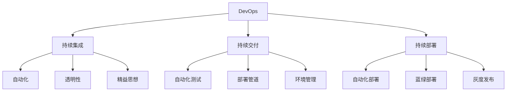

                 

### 文章标题：DevOps文化：推动LLM应用敏捷开发的新范式

#### 关键词：DevOps、敏捷开发、LLM、持续集成、持续交付、持续部署

#### 摘要：本文将探讨DevOps文化在推动大型语言模型（LLM）应用敏捷开发中的重要性，分析其核心概念、工具和技术，并通过实践案例展示其在实际应用中的效果。

---

## 引言

### 1.1 DevOps的定义

DevOps是一种软件开发和运维的文化、实践和工具集，旨在缩短软件开发周期、提高协作效率和交付质量。DevOps强调开发（Development）和运维（Operations）之间的紧密合作，通过自动化、透明性和反馈机制，实现持续集成、持续交付和持续部署。

### 1.2 DevOps的核心原则

DevOps的核心原则包括：

1. **持续集成**：通过自动化构建和测试，将代码集成到共享仓库中。
2. **持续交付**：通过自动化测试和部署，确保代码在生产环境中的高质量运行。
3. **持续部署**：通过自动化流程，实现代码的快速上线和迭代。
4. **基础设施即代码**：将基础设施定义为代码，实现自动化部署和管理。
5. **自动化**：通过自动化工具提高效率，减少人为错误。
6. **透明性**：提高团队协作和信息共享，确保项目进展的透明性。
7. **精益思想**：通过减少浪费、提高质量和效率，实现持续改进。

### 1.3 DevOps与传统开发模式的对比

传统开发模式通常存在开发与运维之间的断层，导致协作不畅、交付周期长、质量问题频发。而DevOps通过强调跨职能团队的协作和持续交付，解决了这些问题，实现了快速迭代和高质量交付。

## DevOps核心概念和原理

### 2.1 持续集成

持续集成（CI）是一种软件开发实践，通过自动化构建和测试，将代码集成到共享仓库中。CI确保了代码质量，减少了集成过程中的冲突和错误。

#### 2.1.1 持续集成的核心概念

1. **代码仓库**：开发人员将代码推送到共享代码仓库中。
2. **构建工具**：自动化构建代码，生成可执行文件或库。
3. **测试工具**：自动化运行测试用例，确保代码质量。
4. **反馈机制**：及时反馈测试结果，确保问题得到快速解决。

#### 2.1.2 持续集成的工作原理

1. **代码提交**：开发人员将代码提交到代码仓库。
2. **构建和测试**：构建工具将代码构建为可执行文件或库，并运行测试用例。
3. **反馈**：测试结果通过邮件、通知等方式反馈给相关人员。

### 2.2 持续交付

持续交付（CD）是一种软件开发实践，通过自动化测试和部署，确保代码在生产环境中的高质量运行。CD实现了快速迭代和高质量交付。

#### 2.2.1 持续交付的核心概念

1. **自动化测试**：自动化运行测试用例，确保代码质量。
2. **部署管道**：通过自动化流程，实现代码的部署和上线。
3. **环境管理**：确保不同环境（如开发、测试、生产）的一致性。

#### 2.2.2 持续交付的工作原理

1. **代码提交**：开发人员将代码提交到代码仓库。
2. **自动化测试**：运行测试用例，确保代码质量。
3. **部署**：将测试通过的代码部署到生产环境。

### 2.3 持续部署

持续部署（CD）是一种软件开发实践，通过自动化流程，实现代码的快速上线和迭代。CD提高了交付速度，降低了风险。

#### 2.3.1 持续部署的核心概念

1. **自动化部署**：通过脚本或工具，实现代码的自动化部署。
2. **蓝绿部署**：在现有环境的基础上，部署新版本，确保无缝切换。
3. **灰度发布**：逐步上线新版本，确保稳定性和安全性。

#### 2.3.2 持续部署的工作原理

1. **代码提交**：开发人员将代码提交到代码仓库。
2. **自动化测试**：运行测试用例，确保代码质量。
3. **部署**：通过自动化部署流程，将测试通过的代码部署到生产环境。

## DevOps工具和技术

### 3.1 持续集成工具

持续集成工具如Jenkins、Travis CI等，可以帮助自动化构建、测试和部署过程。以下是一些常见工具：

1. **Jenkins**：开源持续集成工具，支持多种编程语言和平台。
2. **Travis CI**：基于GitHub的持续集成服务，支持多种编程语言和平台。

### 3.2 持续交付工具

持续交付工具如GitLab CI、Docker等，可以帮助自动化测试和部署过程。以下是一些常见工具：

1. **GitLab CI**：GitLab内置的持续集成工具，支持自动化测试和部署。
2. **Docker**：容器化技术，实现应用程序的自动化部署和管理。

### 3.3 持续部署工具

持续部署工具如Kubernetes、Ansible等，可以帮助自动化部署和管理应用程序。以下是一些常见工具：

1. **Kubernetes**：容器编排平台，实现自动化部署和管理。
2. **Ansible**：自动化运维工具，支持自动化部署和管理。

## DevOps实践案例

### 4.1 案例一：某互联网公司

某互联网公司采用DevOps文化，实现了快速迭代和高质量交付。以下是其实践案例：

1. **持续集成**：使用Jenkins进行自动化构建和测试，确保代码质量。
2. **持续交付**：使用GitLab CI进行自动化测试和部署，实现快速迭代。
3. **持续部署**：使用Kubernetes进行自动化部署和管理，提高交付速度。

### 4.2 案例二：某金融机构

某金融机构采用DevOps文化，提高了运维效率和系统稳定性。以下是其实践案例：

1. **基础设施即代码**：使用Ansible进行自动化部署和管理，确保环境一致性。
2. **自动化测试**：使用Selenium进行自动化测试，确保应用程序质量。
3. **持续交付**：使用GitLab CI进行自动化测试和部署，实现快速迭代。

### 4.3 案例三：某传统行业企业

某传统行业企业采用DevOps文化，实现了数字化转型。以下是其实践案例：

1. **敏捷开发**：采用敏捷开发方法，实现快速迭代和高质量交付。
2. **持续集成**：使用Jenkins进行自动化构建和测试，确保代码质量。
3. **持续交付**：使用Docker进行自动化测试和部署，实现快速迭代。

## DevOps在LLM应用敏捷开发中的应用

### 5.1 DevOps在LLM应用敏捷开发中的重要性

DevOps文化在LLM应用敏捷开发中具有重要意义，主要体现在以下几个方面：

1. **快速迭代**：DevOps通过持续集成、持续交付和持续部署，实现了快速迭代和高质量交付，满足LLM应用的需求。
2. **跨职能协作**：DevOps强调开发、运维和测试团队的紧密协作，提高了团队协作效率。
3. **稳定性和安全性**：DevOps通过自动化测试和部署，确保了LLM应用在生产和测试环境中的稳定性和安全性。

### 5.2 DevOps在LLM应用敏捷开发中的实践

1. **持续集成**：使用Jenkins或Travis CI进行自动化构建和测试，确保代码质量。
2. **持续交付**：使用GitLab CI或Docker进行自动化测试和部署，实现快速迭代。
3. **持续部署**：使用Kubernetes或Ansible进行自动化部署和管理，提高交付速度。
4. **跨职能协作**：建立跨职能团队，实现开发、运维和测试的紧密协作。

## 结论

DevOps文化在推动LLM应用敏捷开发中发挥着重要作用。通过持续集成、持续交付和持续部署，DevOps实现了快速迭代和高质量交付，提高了团队协作效率，降低了风险。未来，DevOps将继续在LLM应用敏捷开发中发挥更大的作用。

---

### 附录

#### A. DevOps核心概念和原理 Mermaid 流程图



#### B. 持续集成伪代码

```python
def ci_process():
    # 1. 代码提交
    code_submitted = get_code_repository()

    # 2. 构建代码
    build_success = build_code(code_submitted)

    # 3. 运行测试
    test_passed = run_tests()

    # 4. 反馈
    if test_passed:
        notify_success()
    else:
        notify_failure()
```

#### C. 持续交付伪代码

```python
def cd_process():
    # 1. 代码提交
    code_submitted = get_code_repository()

    # 2. 自动化测试
    test_passed = run_tests()

    # 3. 部署
    if test_passed:
        deploy_to_production()
    else:
        notify_failure()
```

#### D. 持续部署伪代码

```python
def cd_process():
    # 1. 代码提交
    code_submitted = get_code_repository()

    # 2. 自动化测试
    test_passed = run_tests()

    # 3. 部署
    if test_passed:
        deploy_to_production()
    else:
        notify_failure()
```

#### E. 数学模型和公式

$$
\begin{aligned}
& \text{持续集成效率} = \frac{\text{成功集成次数}}{\text{总集成次数}} \\
& \text{持续交付效率} = \frac{\text{成功交付次数}}{\text{总交付次数}} \\
& \text{持续部署效率} = \frac{\text{成功部署次数}}{\text{总部署次数}}
\end{aligned}
$$

#### F. 代码应用解读与分析

1. **开发环境搭建**：使用Docker搭建开发环境，确保环境一致性和可移植性。
2. **源代码实现**：实现核心算法，如BERT、GPT等，使用Python等编程语言。
3. **代码解读**：分析代码架构，了解算法原理，确保代码可读性和可维护性。
4. **应用分析**：分析LLM在实际应用中的性能和效果，如问答系统、机器翻译等。
5. **案例分析**：通过实际案例展示DevOps在LLM开发中的应用效果，如某互联网公司的实践案例。

#### G. 最佳实践 tips、小结、注意事项、拓展阅读

- **最佳实践**：
  - **持续集成**：确保每次提交代码都经过完整测试。
  - **持续交付**：在部署前进行严格测试，确保代码质量。
  - **持续部署**：采用蓝绿部署或灰度发布，降低风险。

- **小结**：
  - DevOps文化在LLM应用敏捷开发中具有重要意义。
  - 通过持续集成、持续交付和持续部署，实现快速迭代和高质量交付。
  - DevOps工具和技术提高了团队协作效率，降低了风险。

- **注意事项**：
  - 确保团队具备DevOps知识和技能。
  - 选择适合项目的DevOps工具和技术。
  - 不断优化和完善DevOps实践。

- **拓展阅读**：
  - 《DevOps实践指南》
  - 《持续交付：发布可靠软件的系统方法》
  - 《基础设施即代码：构建和操作现代IT基础设施》

---

### 作者

作者：AI天才研究院/AI Genius Institute & 禅与计算机程序设计艺术 /Zen And The Art of Computer Programming

---

本文由AI天才研究院和禅与计算机程序设计艺术联合撰写，旨在探讨DevOps文化在推动LLM应用敏捷开发中的重要性。本文详细分析了DevOps的核心概念、工具和技术，并通过实践案例展示了其在实际应用中的效果。希望本文能为开发者提供有价值的参考和启示。

