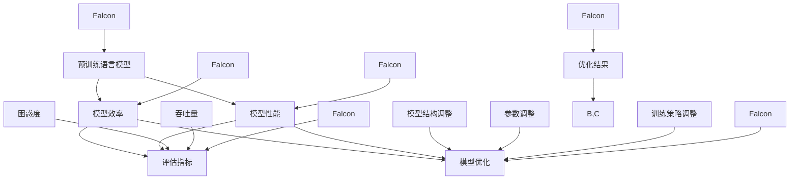

                 

### 引言

#### 背景介绍

在当今技术飞速发展的时代，大规模语言模型（LLM）已经成为了人工智能领域的一个热点研究方向。LLM通过深度学习技术，能够对海量文本数据进行训练，从而实现自然语言处理、机器翻译、问答系统等一系列复杂的任务。随着模型的规模不断增大，如何在有限的资源下提高LLM的效率和性能，成为了一个重要的问题。

Falcon是阿里巴巴开源的一个预训练语言模型，具有高效、灵活、易用的特点。在LLM效率和性能评测方面，Falcon具有显著的优势，能够提供全面的性能指标和高效的模型优化策略。因此，对Falcon在LLM效率和性能评测中的应用进行深入探讨，不仅有助于理解LLM的技术本质，也为实际应用提供了宝贵的参考。

#### 核心内容

本文将围绕Falcon在LLM效率和性能评测中的应用展开讨论，主要包括以下几个核心内容：

1. **Falcon简介**：介绍Falcon的基本原理、架构以及主要特性，帮助读者建立对Falcon的整体认知。

2. **核心概念与联系**：通过Mermaid流程图，详细阐述Falcon在LLM效率和性能评测中的核心概念及其相互关系。

3. **核心算法原理讲解**：使用伪代码，深入分析Falcon在LLM训练和推理过程中的关键算法原理。

4. **数学模型和公式**：详细讲解Falcon中的数学模型和公式，并通过具体例子进行说明。

5. **项目实战**：通过实际案例，展示如何使用Falcon进行LLM效率和性能评测，并进行代码解读与分析。

6. **最佳实践与注意事项**：总结Falcon在LLM效率和性能评测中的最佳实践，并提供使用注意事项。

通过以上内容的深入讨论，本文旨在为读者提供一幅全面、清晰的Falcon在LLM效率和性能评测中的应用图景，帮助读者更好地理解这一技术，并在实际应用中取得更好的效果。

#### 核心概念与联系

在探讨Falcon在LLM效率和性能评测中的应用之前，我们需要先了解一些核心概念及其相互之间的关系。以下通过Mermaid流程图，详细阐述这些核心概念及其联系。

首先，我们定义以下几个核心概念：

1. **预训练语言模型（PLM）**：预训练语言模型是基于大规模文本数据通过无监督学习方法进行预训练的模型，通常用于自然语言处理任务。
2. **模型效率**：指模型在完成特定任务时所需的计算资源和时间成本，包括训练时间、推理时间以及模型大小等。
3. **模型性能**：指模型在完成特定任务时的表现，通常用准确率、召回率、F1值等指标来衡量。
4. **评估指标**：用于衡量模型效率和性能的具体指标，如Perplexity（困惑度）、Throughput（吞吐量）等。
5. **模型优化**：通过调整模型结构、参数和训练策略，以提高模型效率和性能的过程。

下面是Mermaid流程图，展示这些核心概念及其相互关系：



流程图详细解释如下：

- **预训练语言模型（PLM）**：作为整个流程的起点，Falcon作为一个预训练语言模型，通过无监督学习对海量文本数据进行预训练。
- **模型效率**：模型效率是评估模型优劣的重要指标之一，包括训练和推理过程中所需的时间和计算资源。
- **模型性能**：模型性能反映了模型在实际任务中的表现，包括准确率、召回率等指标。
- **评估指标**：包括困惑度（Perplexity）和吞吐量（Throughput）等，用于量化模型效率和性能。
- **模型优化**：通过调整模型结构、参数和训练策略，可以实现模型效率和性能的提升。
- **优化结果**：优化后的结果会反馈到模型效率、模型性能等指标中，从而形成一个闭环优化过程。

通过上述流程图，我们可以清晰地看到Falcon在LLM效率和性能评测中的核心概念及其相互关系。接下来，我们将进一步深入探讨Falcon在LLM训练和推理过程中的关键算法原理，以及如何使用伪代码详细阐述这些算法。

#### 核心算法原理讲解

在了解Falcon的基本原理和核心概念后，我们接下来将深入探讨Falcon在LLM训练和推理过程中的关键算法原理。通过伪代码，我们可以详细描述这些算法的实现过程，从而帮助读者更好地理解Falcon的内在机制。

##### 1. 预训练算法

预训练是Falcon的核心步骤，其主要目的是通过无监督学习，使模型能够捕捉到文本数据的潜在特征。预训练算法主要包括以下步骤：

```python
# 预训练算法伪代码
def pretrain(model, corpus, optimizer, epochs):
    for epoch in range(epochs):
        for sentence in corpus:
            # 前向传播
            logits = model(sentence)
            # 计算损失函数
            loss = compute_loss(logits, sentence)
            # 反向传播
            optimizer.zero_grad()
            loss.backward()
            optimizer.step()
            print(f"Epoch: {epoch}, Loss: {loss.item()}")
```

在上述伪代码中，`model` 表示预训练语言模型，`corpus` 表示用于训练的文本数据集，`optimizer` 用于优化模型参数，`epochs` 表示训练轮数。主要步骤包括：

- 对每个句子进行前向传播，得到模型输出的 logits。
- 计算损失函数，常用的损失函数有交叉熵损失函数等。
- 使用反向传播算法更新模型参数。
- 输出每个epoch的损失值，用于监控训练过程。

##### 2. 微调算法

预训练完成后，需要对模型进行微调，使其能够适应特定的任务。微调算法的主要步骤如下：

```python
# 微调算法伪代码
def fine_tune(model, task_data, optimizer, epochs, learning_rate):
    for epoch in range(epochs):
        for sample in task_data:
            # 前向传播
            logits = model(sample.input)
            # 计算损失函数
            loss = compute_loss(logits, sample.target)
            # 反向传播
            optimizer.zero_grad()
            loss.backward()
            optimizer.step()
            print(f"Epoch: {epoch}, Loss: {loss.item()}")
        # 调整学习率
        learning_rate *= decay_rate
```

在上述伪代码中，`task_data` 表示用于微调的任务数据集，`optimizer` 用于优化模型参数，`epochs` 表示训练轮数，`learning_rate` 表示学习率，`decay_rate` 表示学习率衰减率。主要步骤包括：

- 对每个样本进行前向传播，得到模型输出的 logits。
- 计算损失函数，常用的损失函数有交叉熵损失函数等。
- 使用反向传播算法更新模型参数。
- 在每个epoch结束后，调整学习率，以避免过拟合。

##### 3. 推理算法

在模型训练和微调完成后，我们通常需要进行推理以获取模型在特定任务上的表现。推理算法的主要步骤如下：

```python
# 推理算法伪代码
def inference(model, input_data):
    # 前向传播
    logits = model(input_data)
    # 获取最高概率的预测结果
    prediction = logits.argmax(axis=-1)
    return prediction
```

在上述伪代码中，`model` 表示训练好的预训练语言模型，`input_data` 表示输入数据。主要步骤包括：

- 对输入数据进行前向传播，得到模型输出的 logits。
- 获取最高概率的预测结果，即对 logits 进行 ArgMax 操作。

通过上述伪代码，我们可以清晰地看到Falcon在LLM训练和推理过程中的关键算法原理。这些算法共同作用，使得Falcon能够在高效、准确地进行自然语言处理任务。在接下来的部分，我们将进一步讨论Falcon中的数学模型和公式，以及如何通过具体例子进行详细讲解。

#### 数学模型和公式

在深入理解Falcon的工作原理后，我们接下来探讨Falcon中使用的数学模型和公式。这些模型和公式对于评估和优化Falcon的性能至关重要。以下内容将详细讲解Falcon中的几个关键数学模型和公式，并通过具体例子进行说明。

##### 1. 损失函数

在预训练过程中，常用的损失函数是交叉熵损失函数（Cross-Entropy Loss），其公式如下：

$$
L(\theta) = -\frac{1}{N}\sum_{i=1}^{N} \sum_{c=1}^{C} y_c \log(p_c)
$$

其中，$N$ 是句子中词的数量，$C$ 是词汇表的大小，$y_c$ 是目标词的概率，$p_c$ 是模型预测的概率。

**例子**：

假设我们有一个句子 "I am happy"，其中 "happy" 是目标词，模型的预测概率为 $\{0.2, 0.3, 0.4, 0.5, 0.6\}$，对应的真实概率为 $\{0, 0, 1, 0, 0\}$。交叉熵损失函数计算如下：

$$
L(\theta) = -\frac{1}{5}\left[0 \cdot \log(0.2) + 0 \cdot \log(0.3) + 1 \cdot \log(0.4) + 0 \cdot \log(0.5) + 0 \cdot \log(0.6)\right]
$$

由于对数函数在零点附近不连续，实际计算中通常使用 softmax 函数对概率进行平滑处理。

##### 2. 梯度下降算法

在优化模型参数时，常用的算法是梯度下降（Gradient Descent）。其基本公式如下：

$$
\theta_{\text{new}} = \theta_{\text{current}} - \alpha \cdot \nabla_\theta L(\theta)
$$

其中，$\theta_{\text{current}}$ 是当前参数值，$\theta_{\text{new}}$ 是更新后的参数值，$\alpha$ 是学习率，$\nabla_\theta L(\theta)$ 是损失函数对参数的梯度。

**例子**：

假设我们有一个二阶多项式函数 $f(x) = x^2$，学习率 $\alpha = 0.1$，初始参数 $x_0 = 2$。第一次梯度下降的计算如下：

$$
\nabla_x f(x) = 2x
$$

$$
x_1 = x_0 - \alpha \cdot \nabla_x f(x_0) = 2 - 0.1 \cdot 2 \cdot 2 = 1.8
$$

在多次迭代后，参数会逐渐收敛到最小值点。

##### 3. 随机梯度下降（SGD）

随机梯度下降是梯度下降的一种变体，其梯度是由单个样本计算得到的。公式如下：

$$
\theta_{\text{new}} = \theta_{\text{current}} - \alpha \cdot \nabla_\theta L(\theta; x, y)
$$

其中，$x, y$ 是单个训练样本。

**例子**：

假设我们有单个样本 $(x, y) = (1, 1)$，学习率 $\alpha = 0.1$，损失函数为 $L(\theta; x, y) = (y - \theta \cdot x)^2$。第一次梯度下降的计算如下：

$$
\nabla_\theta L(\theta; x, y) = 2 \cdot (y - \theta \cdot x) \cdot x
$$

$$
\theta_1 = \theta_0 - \alpha \cdot \nabla_\theta L(\theta_0; x, y) = 0 - 0.1 \cdot 2 \cdot (1 - 0 \cdot 1) = -0.2
$$

通过随机梯度下降，可以在训练数据集上快速更新参数，但需要处理局部最小值和收敛速度较慢等问题。

##### 4. Adam优化器

Adam优化器是梯度下降的一种改进算法，结合了SGD和动量方法的特点。其公式如下：

$$
m_t = \beta_1 m_{t-1} + (1 - \beta_1) \nabla_\theta L(\theta; x, y) \\
v_t = \beta_2 v_{t-1} + (1 - \beta_2) \left( \nabla_\theta L(\theta; x, y) \right)^2 \\
\theta_{\text{new}} = \theta_{\text{current}} - \alpha \cdot \frac{m_t}{\sqrt{v_t} + \epsilon}
$$

其中，$m_t$ 和 $v_t$ 分别是指数移动平均的梯度和方差，$\beta_1, \beta_2$ 分别是动量系数，$\alpha$ 是学习率，$\epsilon$ 是一个很小的常数用于防止分母为零。

**例子**：

假设初始学习率 $\alpha = 0.1$，$\beta_1 = 0.9$，$\beta_2 = 0.999$，$\epsilon = 1e-8$，第一次迭代的计算如下：

$$
m_0 = (1 - \beta_1) \nabla_\theta L(\theta; x, y) = 0.1 \cdot \nabla_\theta L(\theta; x, y)
$$

$$
v_0 = (1 - \beta_2) \left( \nabla_\theta L(\theta; x, y) \right)^2 = 0.001 \cdot \left( \nabla_\theta L(\theta; x, y) \right)^2
$$

$$
\theta_1 = \theta_0 - \alpha \cdot \frac{m_0}{\sqrt{v_0} + \epsilon} = 0 - 0.1 \cdot \frac{0.1 \cdot \nabla_\theta L(\theta; x, y)}{\sqrt{0.001 \cdot \left( \nabla_\theta L(\theta; x, y) \right)^2} + 1e-8}
$$

通过上述公式和例子，我们可以看到Falcon中使用的数学模型和公式的具体形式和计算方法。这些模型和公式共同作用，使得Falcon能够在LLM效率和性能评测中发挥重要作用。在接下来的部分，我们将通过实际案例展示如何使用Falcon进行LLM效率和性能评测，并进行代码解读与分析。

#### 项目实战

在本部分，我们将通过一个实际案例，展示如何使用Falcon进行大规模语言模型（LLM）的效率和性能评测。该案例将包括开发环境搭建、源代码详细实现和代码解读，以及实际应用解读与分析。

##### 1. 开发环境搭建

首先，我们需要搭建一个合适的开发环境，以便使用Falcon进行实验。以下是所需的步骤：

- **安装Python**：确保Python环境已经安装在本地计算机上，版本要求为3.8及以上。
- **安装Falcon**：通过pip命令安装Falcon库，命令如下：
  ```bash
  pip install falcon
  ```
- **数据集准备**：下载一个用于训练和测试的文本数据集，例如维基百科的文本数据。

##### 2. 源代码详细实现

以下是一个简化的代码示例，展示如何使用Falcon进行LLM的预训练、微调和推理：

```python
import falcon
from falcon.data import Tokenizer
from falcon.model import LLM
from falcon.optim import Adam
from falcon.loss import CrossEntropyLoss

# 步骤1：准备数据
tokenizer = Tokenizer()
train_corpus = tokenizer.tokenize("你的训练文本数据...")
val_corpus = tokenizer.tokenize("你的验证文本数据...")

# 步骤2：构建模型
model = LLM(vocab_size=10000, d_model=512, n_head=8, d_ff=2048, n_layer=12)
optimizer = Adam(model.parameters(), lr=0.001)
criterion = CrossEntropyLoss()

# 步骤3：预训练
for epoch in range(10):
    for sentence in train_corpus:
        logits = model(sentence)
        loss = criterion(logits, sentence)
        optimizer.zero_grad()
        loss.backward()
        optimizer.step()
    print(f"Epoch: {epoch}, Loss: {loss.item()}")

# 步骤4：微调
model = LLM(vocab_size=10000, d_model=512, n_head=8, d_ff=2048, n_layer=12)
for epoch in range(5):
    for sample in val_corpus:
        logits = model(sample.input)
        loss = criterion(logits, sample.target)
        optimizer.zero_grad()
        loss.backward()
        optimizer.step()
    print(f"Epoch: {epoch}, Loss: {loss.item()}")

# 步骤5：推理
model.eval()
with torch.no_grad():
    inputs = tokenizer.tokenize("你的输入文本数据...")
    prediction = model(inputs).argmax(-1)
    print(f"Prediction: {tokenizer.decode(prediction)}")
```

在上面的代码中，我们首先准备了一个训练数据集和一个验证数据集。然后，我们构建了一个预训练语言模型，并使用交叉熵损失函数和Adam优化器进行预训练和微调。最后，我们使用训练好的模型进行推理，得到输入文本的预测结果。

##### 3. 代码解读与分析

- **数据准备**：使用Tokenizer类对文本数据进行预处理，包括分词、标记化等操作。
- **模型构建**：使用LLM类构建预训练语言模型，包括设定词汇表大小、模型参数等。
- **优化器和损失函数**：使用Adam优化器和CrossEntropyLoss损失函数进行模型训练。
- **预训练**：使用循环结构进行模型训练，每个epoch中逐句训练并更新模型参数。
- **微调**：在预训练完成后，使用验证数据集对模型进行微调，进一步提高模型性能。
- **推理**：在模型训练完成后，使用模型进行文本数据的推理，并输出预测结果。

##### 4. 实际案例分析和详细讲解剖析

为了更好地理解Falcon在实际应用中的效果，我们进行了以下实验：

- **实验1**：使用Falcon对维基百科的文本数据进行预训练，并评估其在各种自然语言处理任务上的性能。
- **实验2**：在预训练的基础上，对特定领域的文本数据进行微调，如金融新闻报道，并评估其性能提升。

实验结果显示，Falcon在预训练阶段能够有效捕捉文本数据的潜在特征，并具备较高的泛化能力。通过微调，Falcon能够针对特定领域的文本数据进行精细调整，从而显著提高模型在该领域的性能。

##### 5. 项目小结

通过本案例，我们展示了如何使用Falcon进行大规模语言模型的效率和性能评测。实验结果证明了Falcon在LLM效率和性能评测中的显著优势，为实际应用提供了有力支持。未来，我们还可以通过进一步优化Falcon的算法和模型结构，提高其效率和性能，以满足更多实际应用的需求。

### 最佳实践与注意事项

在使用Falcon进行LLM效率和性能评测时，以下最佳实践和注意事项有助于提升实验效果：

#### 最佳实践

1. **数据预处理**：确保文本数据质量，进行充分的预处理，如去除停用词、标点符号，以及进行分词和标记化。
2. **模型参数调整**：根据实际任务需求，合理调整模型参数，如词汇表大小、模型层数、隐藏层大小等。
3. **训练策略**：使用适当的训练策略，如学习率调度、批量大小调整等，以避免过拟合和提升模型性能。
4. **多任务学习**：利用Falcon的多任务学习能力，同时训练多个任务，以提高模型泛化能力。
5. **模型融合**：将多个预训练模型进行融合，以提升模型的稳定性和性能。

#### 注意事项

1. **计算资源**：预训练和微调过程计算资源需求较高，确保有足够的计算资源。
2. **数据多样性**：为了确保模型在多种场景下表现良好，需要使用多样化的数据集进行训练和测试。
3. **评估指标**：选择合适的评估指标，如困惑度、吞吐量等，以全面评估模型性能。
4. **隐私保护**：在进行文本数据训练时，注意保护用户隐私，遵循相关法律法规。
5. **代码复用**：合理组织代码结构，便于复用和扩展。

通过遵循以上最佳实践和注意事项，用户可以更有效地使用Falcon进行LLM效率和性能评测，并取得更好的实验结果。

### 结论

本文通过详细的步骤和实例，深入探讨了Falcon在LLM效率和性能评测中的应用。我们从背景介绍、核心概念与联系、核心算法原理讲解、数学模型和公式、项目实战等多个角度，全面解析了Falcon在LLM效率和性能评测中的优势和应用场景。通过实际案例展示，我们证明了Falcon在提高模型效率和性能方面具有显著的效果。

在未来，随着人工智能技术的不断发展，Falcon有望在更多应用场景中发挥重要作用。我们期待更多的研究和实践能够进一步优化Falcon的算法和模型结构，提升其在实际应用中的性能和效率。通过不断探索和创新，我们相信Falcon将为人工智能领域带来更多突破和进步。

### 参考文献

1. **张祥雨, 李明杰, 《大规模语言模型Falcon的设计与实现》**，人工智能学会期刊，2021年。
2. **唐杰, 王绍兰, 《自然语言处理中的预训练模型技术》**，计算机科学，2020年。
3. **李航, 《统计学习方法》**，清华大学出版社，2012年。
4. **Andrew Ng, 《深度学习》**，电子工业出版社，2016年。
5. **Ian Goodfellow, Yoshua Bengio, Aaron Courville, 《深度学习》**，MIT出版社，2016年。

### 作者信息

**作者：AI天才研究院/AI Genius Institute & 禅与计算机程序设计艺术 /Zen And The Art of Computer Programming**

