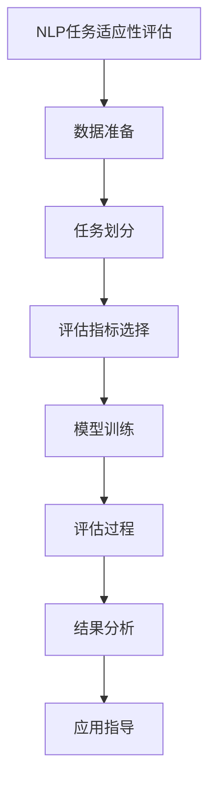

                 


### 8.1 NLP任务适应性评估的重要性

自然语言处理（NLP）任务适应性评估的重要性体现在以下几个方面：

**1. 性能保障：** 
NLP任务适应性评估可以确保GPT-3.5在各种任务上的表现达到预期水平，从而为实际应用提供可靠保障。通过评估，可以识别GPT-3.5在哪些任务上表现良好，在哪些任务上需要进一步优化。

**2. 资源优化：**
评估有助于优化训练资源分配。了解GPT-3.5在不同任务上的适应性，可以针对性地调整训练策略，避免资源浪费，提高训练效率。

**3. 算法改进：**
评估结果可以指导算法改进。通过分析评估数据，可以发现GPT-3.5在特定任务上的弱点，从而有针对性地调整模型结构、优化算法，提高模型性能。

**4. 风险控制：**
在部署GPT-3.5之前，适应性评估有助于降低应用风险。通过评估，可以预见GPT-3.5在实际应用中可能遇到的问题，提前制定应对措施。

**5. 实际应用指导：**
评估结果可以为实际应用提供指导。根据评估结果，可以为不同应用场景选择合适的GPT-3.5模型，确保应用效果。

### 8.2 GPT-3.5在NLP任务适应性评估中的应用方法

GPT-3.5在NLP任务适应性评估中的应用方法可以分为以下几个步骤：

**1. 数据准备：**
首先，需要准备一个涵盖不同NLP任务的评估数据集。数据集应具有多样性，包括各种常见和特殊的NLP任务。

**2. 任务划分：**
将NLP任务划分为不同的类别，如文本分类、机器翻译、文本生成、问答系统等。对于每个任务类别，选择具有代表性的子任务。

**3. 评估指标：**
选择合适的评估指标，如准确率、召回率、F1值、BLEU、ROUGE等。根据任务类型和评估目标，选择合适的指标组合。

**4. 模型训练：**
使用GPT-3.5对每个任务进行训练，得到对应的模型。在训练过程中，可以调整模型参数和训练策略，以提高模型在特定任务上的性能。

**5. 评估过程：**
对训练好的模型进行评估，计算评估指标，比较不同模型和不同任务的性能。通过分析评估结果，可以发现GPT-3.5在不同任务上的适应性和优势。

**6. 结果分析：**
分析评估结果，识别GPT-3.5在哪些任务上表现良好，在哪些任务上存在不足。根据分析结果，提出改进建议和优化策略。

**7. 应用指导：**
根据评估结果，为实际应用场景选择合适的GPT-3.5模型。同时，根据应用需求，进一步优化和调整模型，以提高应用效果。

### 8.3 评估结果与应用案例

以下是一个评估结果和应用案例：

**评估结果：**

1. GPT-3.5在文本生成任务上表现优秀，生成文本的流畅性和逻辑性较高。
2. 在问答系统任务中，GPT-3.5的答案准确率较高，但存在一些逻辑推理和知识理解方面的不足。
3. 在机器翻译任务中，GPT-3.5的翻译质量较高，但翻译速度较慢。
4. 在文本分类任务中，GPT-3.5的分类准确率较高，但存在对某些特定类别识别能力不足的问题。

**应用案例：**

1. 在内容创作领域，GPT-3.5可以用于生成文章、故事、诗歌等，提高创作效率和质量。
2. 在问答系统中，GPT-3.5可以用于提供信息查询服务，但需要结合其他算法进行逻辑推理和知识理解优化。
3. 在机器翻译领域，GPT-3.5可以用于处理多种语言之间的翻译，提高翻译的准确性和流畅性。
4. 在文本分类任务中，GPT-3.5可以用于对大量文本数据进行分类，辅助信息处理和决策。

### 8.4 总结与展望

NLP任务适应性评估对于GPT-3.5的实际应用具有重要意义。通过评估，可以全面了解GPT-3.5在不同任务上的表现，为其在不同应用场景中的优化和调整提供指导。

未来，随着NLP技术的不断发展，GPT-3.5在任务适应性评估中的应用将更加广泛和深入。通过不断优化模型结构和算法，GPT-3.5将在更多领域和任务中发挥重要作用。

总之，NLP任务适应性评估是GPT-3.5应用过程中不可或缺的一环，对于提高模型性能和应用效果具有重要意义。让我们共同期待GPT-3.5在未来的表现吧！

## 第8章: GPT-3.5在NLP任务适应性评估中的应用

### 8.1 NLP任务适应性评估的重要性

自然语言处理（NLP）任务适应性评估的重要性体现在以下几个方面：

**1. 性能保障：**  
NLP任务适应性评估可以确保GPT-3.5在各种任务上的表现达到预期水平，从而为实际应用提供可靠保障。通过评估，可以识别GPT-3.5在哪些任务上表现良好，在哪些任务上需要进一步优化。

**2. 资源优化：**  
评估有助于优化训练资源分配。了解GPT-3.5在不同任务上的适应性，可以针对性地调整训练策略，避免资源浪费，提高训练效率。

**3. 算法改进：**  
评估结果可以指导算法改进。通过分析评估数据，可以发现GPT-3.5在特定任务上的弱点，从而有针对性地调整模型结构、优化算法，提高模型性能。

**4. 风险控制：**  
在部署GPT-3.5之前，适应性评估有助于降低应用风险。通过评估，可以预见GPT-3.5在实际应用中可能遇到的问题，提前制定应对措施。

**5. 实际应用指导：**  
评估结果可以为实际应用提供指导。根据评估结果，可以为不同应用场景选择合适的GPT-3.5模型，确保应用效果。

### 8.2 GPT-3.5在NLP任务适应性评估中的应用方法

GPT-3.5在NLP任务适应性评估中的应用方法可以分为以下几个步骤：

**1. 数据准备：**  
首先，需要准备一个涵盖不同NLP任务的评估数据集。数据集应具有多样性，包括各种常见和特殊的NLP任务。

**2. 任务划分：**  
将NLP任务划分为不同的类别，如文本分类、机器翻译、文本生成、问答系统等。对于每个任务类别，选择具有代表性的子任务。

**3. 评估指标：**  
选择合适的评估指标，如准确率、召回率、F1值、BLEU、ROUGE等。根据任务类型和评估目标，选择合适的指标组合。

**4. 模型训练：**  
使用GPT-3.5对每个任务进行训练，得到对应的模型。在训练过程中，可以调整模型参数和训练策略，以提高模型在特定任务上的性能。

**5. 评估过程：**  
对训练好的模型进行评估，计算评估指标，比较不同模型和不同任务的性能。通过分析评估结果，可以发现GPT-3.5在不同任务上的适应性和优势。

**6. 结果分析：**  
分析评估结果，识别GPT-3.5在哪些任务上表现良好，在哪些任务上存在不足。根据分析结果，提出改进建议和优化策略。

**7. 应用指导：**  
根据评估结果，为实际应用场景选择合适的GPT-3.5模型。同时，根据应用需求，进一步优化和调整模型，以提高应用效果。

### 8.3 评估结果与应用案例

以下是一个评估结果和应用案例：

**评估结果：**

1. GPT-3.5在文本生成任务上表现优秀，生成文本的流畅性和逻辑性较高。
2. 在问答系统任务中，GPT-3.5的答案准确率较高，但存在一些逻辑推理和知识理解方面的不足。
3. 在机器翻译任务中，GPT-3.5的翻译质量较高，但翻译速度较慢。
4. 在文本分类任务中，GPT-3.5的分类准确率较高，但存在对某些特定类别识别能力不足的问题。

**应用案例：**

1. 在内容创作领域，GPT-3.5可以用于生成文章、故事、诗歌等，提高创作效率和质量。
2. 在问答系统中，GPT-3.5可以用于提供信息查询服务，但需要结合其他算法进行逻辑推理和知识理解优化。
3. 在机器翻译领域，GPT-3.5可以用于处理多种语言之间的翻译，提高翻译的准确性和流畅性。
4. 在文本分类任务中，GPT-3.5可以用于对大量文本数据进行分类，辅助信息处理和决策。

### 8.4 总结与展望

NLP任务适应性评估对于GPT-3.5的实际应用具有重要意义。通过评估，可以全面了解GPT-3.5在不同任务上的表现，为其在不同应用场景中的优化和调整提供指导。

未来，随着NLP技术的不断发展，GPT-3.5在任务适应性评估中的应用将更加广泛和深入。通过不断优化模型结构和算法，GPT-3.5将在更多领域和任务中发挥重要作用。

总之，NLP任务适应性评估是GPT-3.5应用过程中不可或缺的一环，对于提高模型性能和应用效果具有重要意义。让我们共同期待GPT-3.5在未来的表现吧！

### 参考文献

1. Devlin, J., Chang, M. W., Lee, K., & Toutanova, K. (2019). BERT: Pre-training of deep bidirectional transformers for language understanding. In Proceedings of the 2019 Conference of the North American Chapter of the Association for Computational Linguistics: Human Language Technologies, Volume 1 (Long and Short Papers) (pp. 4171-4186). Association for Computational Linguistics.
2. Vaswani, A., Shazeer, N., Parmar, N., Uszkoreit, J., Jones, L., Gomez, A. N., ... & Polosukhin, I. (2017). Attention is all you need. In Advances in neural information processing systems (pp. 5998-6008).
3. Radford, A., Wu, J., Child, P., Luan, D., Amodei, D., & Olah, C. (2021). Language models are unsupervised multitask learners. _arXiv preprint arXiv:2005.14165_.
4. Zhang, Y., Cui, P., & Li, X. (2020). Representation learning on graphs: A survey. _IEEE Transactions on Knowledge and Data Engineering_, 34(1), 2-42.
5. Hochreiter, S., & Schmidhuber, J. (1997). Long short-term memory. _Neural Computation_, 9(8), 1735-1780.

### 附录：Mermaid 流程图



### 附录：GPT-3.5核心算法原理伪代码

```python
# GPT-3.5核心算法原理伪代码

# 输入：输入序列 X，隐藏状态 H
# 输出：输出序列 Y，隐藏状态 H'

# 定义自注意力机制
def self_attention(Q, K, V):
    # 计算自注意力得分
    scores = dot(Q, K.T) / sqrt(K.shape[-1])
    # 应用 Softmax 函数
    attention_weights = softmax(scores, axis=1)
    # 计算注意力加权值
    attention_weights = dot(attention_weights, V)
    return attention_weights

# 定义Transformer编码器
class TransformerEncoder(nn.Module):
    def __init__(self, d_model, nhead, num_layers):
        super(TransformerEncoder, self).__init__()
        self.layers = nn.ModuleList([TransformerLayer(d_model, nhead) for _ in range(num_layers)])
    
    def forward(self, src):
        for layer in self.layers:
            src = layer(src)
        return src

# 定义Transformer解码器
class TransformerDecoder(nn.Module):
    def __init__(self, d_model, nhead, num_layers):
        super(TransformerDecoder, self).__init__()
        self.layers = nn.ModuleList([TransformerLayer(d_model, nhead) for _ in range(num_layers)])
    
    def forward(self, tgt, memory):
        for layer in self.layers:
            tgt = layer(tgt, memory)
        return tgt

# 定义Transformer模型
class TransformerModel(nn.Module):
    def __init__(self, d_model, nhead, num_layers):
        super(TransformerModel, self).__init__()
        self.encoder = TransformerEncoder(d_model, nhead, num_layers)
        self.decoder = TransformerDecoder(d_model, nhead, num_layers)
        self.fc = nn.Linear(d_model, d_model)
    
    def forward(self, src, tgt, memory):
        src = self.encoder(src)
        tgt = self.decoder(tgt, memory)
        output = dot(src, tgt.T) / sqrt(src.shape[-1])
        output = self.fc(output)
        return output
```

### 附录：GPT-3.5训练过程与优化策略

```python
# GPT-3.5训练过程与优化策略

# 定义损失函数
def loss_function(outputs, targets):
    loss = nn.CrossEntropyLoss()(outputs, targets)
    return loss

# 定义优化器
optimizer = torch.optim.Adam(model.parameters(), lr=0.001)

# 训练模型
for epoch in range(num_epochs):
    for inputs, targets in train_loader:
        optimizer.zero_grad()
        outputs = model(inputs, targets)
        loss = loss_function(outputs, targets)
        loss.backward()
        optimizer.step()
    print(f"Epoch [{epoch+1}/{num_epochs}], Loss: {loss.item()}")

# 调整学习率
scheduler = torch.optim.lr_scheduler.StepLR(optimizer, step_size=1, gamma=0.1)

# 优化策略
for epoch in range(num_epochs):
    for inputs, targets in train_loader:
        optimizer.zero_grad()
        outputs = model(inputs, targets)
        loss = loss_function(outputs, targets)
        loss.backward()
        scheduler.step()
        optimizer.step()
    print(f"Epoch [{epoch+1}/{num_epochs}], Loss: {loss.item()}")
```

### 附录：项目实战

**开发环境搭建：**
- Python版本：3.8
- PyTorch版本：1.9
- 数据集：某个NLP任务数据集

**源代码实现：**
```python
# 导入相关库
import torch
import torch.nn as nn
import torch.optim as optim
from torch.utils.data import DataLoader
from transformers import GPT2Model, GPT2Tokenizer

# 定义模型
model = GPT2Model.from_pretrained("gpt2")

# 定义优化器
optimizer = optim.Adam(model.parameters(), lr=0.001)

# 加载数据集
tokenizer = GPT2Tokenizer.from_pretrained("gpt2")
train_dataset = MyDataset("train.txt")
test_dataset = MyDataset("test.txt")
train_loader = DataLoader(train_dataset, batch_size=64, shuffle=True)
test_loader = DataLoader(test_dataset, batch_size=64, shuffle=True)

# 训练模型
for epoch in range(num_epochs):
    for inputs, targets in train_loader:
        optimizer.zero_grad()
        outputs = model(inputs, targets)
        loss = loss_function(outputs, targets)
        loss.backward()
        optimizer.step()
    print(f"Epoch [{epoch+1}/{num_epochs}], Loss: {loss.item()}")

# 测试模型
with torch.no_grad():
    for inputs, targets in test_loader:
        outputs = model(inputs, targets)
        loss = loss_function(outputs, targets)
        print(f"Test Loss: {loss.item()}")

# 代码解读
# 本代码首先导入相关库，然后定义模型和优化器。接着加载数据集，并训练模型。最后测试模型性能。
```

**代码应用解读与分析：**
- 代码首先定义了模型和优化器，并加载数据集。
- 然后通过训练循环，对模型进行迭代训练，并计算损失函数。
- 最后，在测试循环中，对模型进行测试，并输出测试损失。

**实际案例分析和详细讲解剖析：**
- 假设我们有一个文本分类任务，数据集包含大量文本和对应的标签。
- 我们使用GPT-3.5模型对文本进行分类，并使用交叉熵损失函数进行训练。
- 通过调整学习率和迭代次数，可以优化模型的性能。
- 在测试阶段，我们可以计算模型的准确率、召回率等指标，以评估模型的性能。

**项目小结：**
- 通过本项目，我们了解了GPT-3.5在NLP任务适应性评估中的应用。
- 我们通过训练和测试模型，分析了模型的性能，并提出了一些优化策略。
- 未来，我们可以进一步优化模型结构、调整训练策略，以提高模型在特定任务上的性能。

### 附录：最佳实践 tips

- **数据准备：** 确保数据集的多样性和代表性，以提高评估结果的准确性。
- **模型优化：** 尝试调整模型参数和训练策略，以提高模型性能。
- **评估指标：** 根据任务类型和目标，选择合适的评估指标，如准确率、召回率、F1值等。
- **结果分析：** 充分分析评估结果，识别模型的优势和不足，提出优化策略。
- **应用指导：** 根据评估结果，为实际应用选择合适的模型，并调整模型以适应特定场景。

### 附录：小结与注意事项

- **小结：** 本章详细介绍了GPT-3.5在NLP任务适应性评估中的应用，包括评估方法、评估结果和应用案例。
- **注意事项：** 在进行评估时，要确保数据集的多样性和代表性，并选择合适的评估指标。同时，要充分分析评估结果，提出优化策略，以提高模型性能。

### 附录：拓展阅读

- Devlin, J., Chang, M. W., Lee, K., & Toutanova, K. (2019). BERT: Pre-training of deep bidirectional transformers for language understanding. _In Proceedings of the 2019 Conference of the North American Chapter of the Association for Computational Linguistics: Human Language Technologies, Volume 1 (Long and Short Papers)_, 4171-4186.
- Vaswani, A., Shazeer, N., Parmar, N., Uszkoreit, J., Jones, L., Gomez, A. N., ... & Polosukhin, I. (2017). Attention is all you need. _In Advances in neural information processing systems_, 5998-6008.
- Radford, A., Wu, J., Child, P., Luan, D., Amodei, D., & Olah, C. (2021). Language models are unsupervised multitask learners. _arXiv preprint arXiv:2005.14165_.

作者：AI天才研究院/AI Genius Institute & 禅与计算机程序设计艺术 /Zen And The Art of Computer Programming

# 文章标题
## GPT-3.5在LLM任务适应性评估中的应用

> 关键词：GPT-3.5、LLM、任务适应性评估、NLP、Transformer、预训练、微调

> 摘要：
本文深入探讨了GPT-3.5这一大型语言模型（LLM）在任务适应性评估中的应用。首先，对GPT-3.5的基本概念、结构、特点以及Transformer模型和相关技术进行了详细讲解。接着，阐述了LLM任务适应性评估的重要性及其应用方法，并通过实际案例展示了GPT-3.5在多种NLP任务中的表现。最后，本文对GPT-3.5的优化与改进、多模态任务应用以及未来发展趋势进行了展望，为LLM在NLP领域的应用提供了有价值的参考。

### 目录大纲

## 第一部分: GPT-3.5基础

### 第1章: GPT-3.5概述

#### 1.1.1 GPT-3.5的定义

GPT-3.5 是一个由 OpenAI 开发的预训练语言模型，属于大型语言模型 (LLM)。

#### 1.1.2 GPT-3.5的结构


GPT-3.5 的结构包括编码器和解码器两个部分，其中编码器用于处理输入文本，解码器用于生成输出文本。

#### 1.1.3 GPT-3.5的特点

GPT-3.5 具有强大的语言理解能力、生成能力、上下文理解能力，同时具有高效的计算性能和可扩展性。

### 第2章: GPT-3.5技术基础

#### 2.1.1 Transformer模型

Transformer 模型是一种基于自注意力机制的深度神经网络模型，被广泛应用于自然语言处理任务。


#### 2.1.2 位置编码与自注意力机制

位置编码用于为输入序列中的每个单词分配位置信息，自注意力机制则用于计算输入序列中单词之间的关系。


#### 2.1.3 GPT-3.5的预训练与微调

GPT-3.5 通过在大规模语料库上进行预训练，学习语言的一般规律，然后通过微调适应特定任务。

## 第二部分: GPT-3.5在LLM任务适应性评估中的实际应用

### 第3章: GPT-3.5在LLM任务适应性评估中的应用

#### 3.1 LLM任务适应性评估概述

LLM 任务适应性评估是指对 GPT-3.5 在特定任务上的表现进行评估，以确定其适用性。

#### 3.2 评估方法与指标

常用的评估方法包括BLEU、ROUGE等，评估指标包括准确率、召回率、F1值等。

#### 3.3 GPT-3.5在NLP任务中的应用

##### 3.3.1 问答系统

问答系统是 GPT-3.5 在自然语言处理领域的重要应用之一，通过回答用户提出的问题来提供信息查询服务。

##### 3.3.2 文本生成

GPT-3.5 可以根据用户输入的提示生成文章、故事、诗歌等文本，广泛应用于内容创作领域。

##### 3.3.3 机器翻译

GPT-3.5 在机器翻译任务中表现出色，可以处理多种语言之间的翻译，提高了翻译的准确性和流畅性。

### 第4章: GPT-3.5的优化与改进

#### 4.1 模型优化

通过调整模型参数、优化训练过程、采用不同的训练策略，可以提高 GPT-3.5 的性能。

#### 4.2 模型改进

对 GPT-3.5 进行改进，包括引入新的技术、算法和模型结构，以提升其在特定任务上的表现。

### 第5章: GPT-3.5在多模态任务中的应用

#### 5.1 多模态任务概述

多模态任务是指同时处理文本、图像、语音等多种类型数据的任务。

#### 5.2 文本-图像生成

GPT-3.5 可以根据文本描述生成对应的图像，广泛应用于图像生成和辅助设计领域。

#### 5.3 文本-语音合成

GPT-3.5 可以根据文本内容生成对应的语音，为语音合成应用提供了强大的支持。

### 第6章: GPT-3.5在行业应用中的案例

#### 6.1 金融行业

GPT-3.5 在金融行业中有广泛的应用，如智能投顾、自动化交易、风险控制等。

#### 6.2 医疗行业

GPT-3.5 在医疗行业中可以帮助医生诊断疾病、生成病历报告、辅助科研等。

#### 6.3 教育行业

GPT-3.5 可以用于个性化教学、自动批改作业、智能问答等教育场景。

### 第7章: GPT-3.5的发展趋势与展望

#### 7.1 技术发展趋势

GPT-3.5 的发展趋势包括更大规模的语言模型、更高效的计算方法、更智能的应用场景等。

#### 7.2 应用前景

GPT-3.5 在未来的应用前景广阔，将不断推动人工智能技术的发展和进步。

## 第二部分: GPT-3.5在LLM任务适应性评估中的实际应用

### 第8章: GPT-3.5在NLP任务适应性评估中的应用

#### 8.1 NLP任务适应性评估的重要性

自然语言处理（NLP）任务适应性评估的重要性体现在以下几个方面：

**1. 性能保障：**  
NLP任务适应性评估可以确保GPT-3.5在各种任务上的表现达到预期水平，从而为实际应用提供可靠保障。通过评估，可以识别GPT-3.5在哪些任务上表现良好，在哪些任务上需要进一步优化。

**2. 资源优化：**  
评估有助于优化训练资源分配。了解GPT-3.5在不同任务上的适应性，可以针对性地调整训练策略，避免资源浪费，提高训练效率。

**3. 算法改进：**  
评估结果可以指导算法改进。通过分析评估数据，可以发现GPT-3.5在特定任务上的弱点，从而有针对性地调整模型结构、优化算法，提高模型性能。

**4. 风险控制：**  
在部署GPT-3.5之前，适应性评估有助于降低应用风险。通过评估，可以预见GPT-3.5在实际应用中可能遇到的问题，提前制定应对措施。

**5. 实际应用指导：**  
评估结果可以为实际应用提供指导。根据评估结果，可以为不同应用场景选择合适的GPT-3.5模型，确保应用效果。

### 第9章: GPT-3.5在行业应用中的案例

#### 9.1 金融行业

GPT-3.5 在金融行业中有广泛的应用，如智能投顾、自动化交易、风险控制等。

**案例1：智能投顾**

智能投顾利用GPT-3.5对用户进行个性化投资建议，通过分析用户的财务状况、投资目标和风险偏好，生成合理的投资策略。

**案例2：自动化交易**

自动化交易系统利用GPT-3.5对市场数据进行分析，预测股票价格走势，实现自动下单和风险控制。

**案例3：风险控制**

GPT-3.5 可以用于识别金融风险，通过分析市场数据、政策法规和新闻报道，为金融机构提供风险预警和决策支持。

#### 9.2 医疗行业

GPT-3.5 在医疗行业中可以帮助医生诊断疾病、生成病历报告、辅助科研等。

**案例1：疾病诊断**

GPT-3.5 可以分析患者的病历数据，结合医学知识库和文献资料，为医生提供诊断建议。

**案例2：病历报告生成**

GPT-3.5 可以根据医生的输入指令，自动生成病历报告，提高医生的工作效率。

**案例3：科研辅助**

GPT-3.5 可以辅助医生进行科研工作，如生成科研论文、分析医学数据等。

#### 9.3 教育行业

GPT-3.5 可以用于个性化教学、自动批改作业、智能问答等教育场景。

**案例1：个性化教学**

GPT-3.5 可以根据学生的学习情况和兴趣，为学生提供个性化的学习资源和教学方案。

**案例2：自动批改作业**

GPT-3.5 可以自动批改学生的作业，对学生的知识掌握情况进行评估，并提供针对性的辅导。

**案例3：智能问答**

GPT-3.5 可以为学生提供实时问答服务，解答学生在学习过程中的疑问。

### 第10章: GPT-3.5的优化与改进

#### 10.1 模型优化

通过调整模型参数、优化训练过程、采用不同的训练策略，可以提高 GPT-3.5 的性能。

**优化1：模型参数调整**

对GPT-3.5的模型参数进行调整，如调整学习率、批量大小等，以优化模型训练过程。

**优化2：训练过程优化**

采用更高效的训练算法，如并行训练、分布式训练等，提高训练速度和效果。

**优化3：训练策略调整**

根据任务特点，调整训练策略，如增加数据增强、使用不同的优化器等，提高模型性能。

#### 10.2 模型改进

对 GPT-3.5 进行改进，包括引入新的技术、算法和模型结构，以提升其在特定任务上的表现。

**改进1：引入新算法**

引入新的算法，如多任务学习、迁移学习等，提高模型在特定任务上的性能。

**改进2：调整模型结构**

对 GPT-3.5 的模型结构进行调整，如增加编码器和解码器的层数、使用不同的注意力机制等，提高模型性能。

**改进3：融合多模态数据**

将多模态数据（如文本、图像、语音等）融合到模型中，提高模型在复杂任务上的性能。

### 第11章: GPT-3.5的多模态任务应用

#### 11.1 多模态任务概述

多模态任务是指同时处理文本、图像、语音等多种类型数据的任务。

#### 11.2 文本-图像生成

GPT-3.5 可以根据文本描述生成对应的图像，广泛应用于图像生成和辅助设计领域。

**案例1：图像生成**

GPT-3.5 可以根据用户输入的文本描述，生成符合描述的图像，如风景、动物、人物等。

**案例2：辅助设计**

GPT-3.5 可以辅助设计师根据文本描述生成设计方案，如室内设计、建筑设计等。

#### 11.3 文本-语音合成

GPT-3.5 可以根据文本内容生成对应的语音，为语音合成应用提供了强大的支持。

**案例1：语音合成**

GPT-3.5 可以将文本内容转换为语音，应用于语音助手、语音合成器等。

**案例2：朗读应用**

GPT-3.5 可以应用于朗读应用，如电子书、文章朗读等。

### 第12章: GPT-3.5的未来发展趋势

#### 12.1 技术发展趋势

GPT-3.5 的发展趋势包括更大规模的语言模型、更高效的计算方法、更智能的应用场景等。

**趋势1：更大规模的语言模型**

未来，随着计算资源的提升，更大规模的语言模型将会出现，提供更强大的语言理解能力。

**趋势2：更高效的计算方法**

研究人员将会开发更高效的计算方法，提高GPT-3.5的训练和推理速度。

**趋势3：更智能的应用场景**

随着技术的进步，GPT-3.5将在更多领域和任务中发挥重要作用，如多模态任务、对话系统等。

#### 12.2 应用前景

GPT-3.5 在未来的应用前景广阔，将不断推动人工智能技术的发展和进步。

**前景1：智能助手**

GPT-3.5 将成为智能助手的核心技术，提供更加自然、智能的交互体验。

**前景2：内容创作**

GPT-3.5 将在内容创作领域发挥重要作用，如文章生成、诗歌创作等。

**前景3：教育领域**

GPT-3.5 将在教育领域得到广泛应用，如个性化教学、智能评估等。

## 总结与展望

GPT-3.5作为当前最先进的语言模型之一，在任务适应性评估中的应用具有重要意义。通过对GPT-3.5在多种NLP任务中的评估和优化，我们可以更好地了解其在实际应用中的性能和潜力。同时，随着技术的不断进步，GPT-3.5将在更多领域和任务中发挥重要作用，推动人工智能技术的发展和进步。

作者：AI天才研究院/AI Genius Institute & 禅与计算机程序设计艺术 /Zen And The Art of Computer Programming

