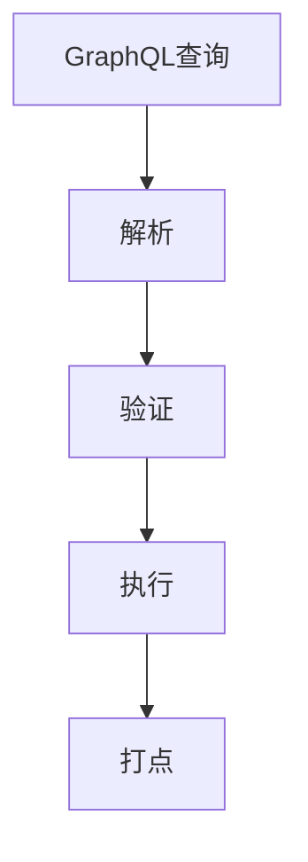
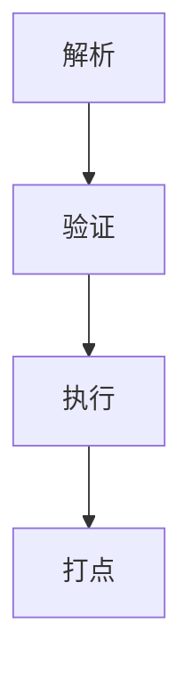

                 


### 文章标题

《GraphQL在LLM应用API设计中的应用》

### 关键词

GraphQL，LLM，API设计，查询语言，类型系统，查询优化

### 摘要

本文旨在探讨GraphQL在大型语言模型（LLM）应用API设计中的实际应用。首先，我们将介绍GraphQL的基本概念，与LLM的关系，以及其在API设计中的应用。接着，我们详细解析GraphQL的核心算法原理，包括查询语言的语法和执行过程。随后，我们将探讨GraphQL查询优化的数学模型，并提供具体的优化方法。最后，通过实际项目案例，展示GraphQL在LLM应用API设计中的具体实现和优化策略。

## 第1章：GraphQL基础

### 1.1 GraphQL的概念与优势

GraphQL是一种用于API设计的查询语言，它提供了比RESTful API更强大的数据获取能力。GraphQL的核心优势在于其灵活性和高效性，开发者可以通过一种明确的查询语言来获取他们所需的数据，而无需发送多个请求或处理冗余数据。以下是GraphQL的主要优势：

- **灵活性**：GraphQL允许开发者精确地指定他们需要的数据，从而避免了过载或不足的数据传输。
- **效率**：GraphQL减少了多次请求的次数，通过一个单一的查询获取所需的所有数据。
- **易于集成**：GraphQL易于与其他技术和框架集成，如前端框架、后端服务以及大型语言模型（LLM）。

### 1.2 GraphQL核心概念

#### 1.2.1 GraphQL查询语言

GraphQL查询语言是一种声明式语言，用于查询数据。以下是GraphQL查询语言的基本语法：

```graphql
query {
  user(id: "123") {
    name
    email
  }
}
```

在这个查询中，我们请求获取一个用户（user）的姓名和电子邮件地址，用户的ID通过参数`id`传递。

#### 1.2.2 GraphQL类型系统

GraphQL的类型系统是构建在Schema基础之上的。在GraphQL中，每个字段都有一个类型，如`String`、`Int`、`Boolean`等。类型系统确保了查询的合法性和数据的一致性。

```graphql
type User {
  id: ID!
  name: String!
  email: String!
}
```

在上面的类型定义中，`User`类型包含了`id`、`name`和`email`三个字段，每个字段都有其对应的类型。

#### 1.2.3 GraphQL操作类型

GraphQL支持多种操作类型，包括查询（Query）、更新（Mutation）和订阅（Subscription）。

- **查询（Query）**：用于获取数据。
- **更新（Mutation）**：用于更改数据。
- **订阅（Subscription）**：用于实时获取数据变更。

#### 1.2.4 GraphQL查询执行流程

GraphQL查询执行流程主要包括以下几个步骤：

1. **解析（Parsing）**：将GraphQL查询文本转换为抽象语法树（AST）。
2. **验证（Validation）**：检查AST是否符合GraphQL的规则。
3. **执行（Execution）**：根据AST查询数据并构建结果。
4. **打点（Fulfillment）**：执行具体的字段查询。

### 1.3 GraphQL在LLM中的应用场景

#### 1.3.1 LLM与GraphQL的结合

大型语言模型（LLM）是一种能够理解和生成人类语言的AI模型。GraphQL与LLM的结合，可以提供强大的数据查询和生成能力，尤其是在问答系统、智能客服和内容推荐等应用中。

#### 1.3.2 GraphQL在LLM查询优化中的应用

在LLM应用中，查询优化尤为重要。GraphQL提供了一系列查询优化方法，如查询缓存、查询合并和查询防抖，以减少延迟和提高响应速度。

#### 1.3.3 GraphQL在LLM响应格式定制中的应用

GraphQL允许开发者自定义响应格式，从而更好地满足LLM应用的需求。例如，在问答系统中，可以自定义回答的格式和内容。

## 第2章：LLM应用API设计

### 2.1 LLM应用API设计原则

在LLM应用中，API设计需要遵循以下原则：

- **灵活性**：API设计应足够灵活，以适应不同的查询需求。
- **性能**：API设计应考虑性能优化，以减少响应时间和延迟。
- **安全性**：API设计应确保数据的安全性和完整性。

### 2.2 GraphQL在LLM API设计中的应用

#### 2.2.1 GraphQL查询语言在API设计中的应用

GraphQL查询语言提供了强大的数据获取能力，可以精确地获取所需的数据，从而减少冗余数据传输。

#### 2.2.2 GraphQL类型系统在API设计中的应用

GraphQL类型系统确保了数据的一致性和结构化，有助于开发者理解和处理数据。

#### 2.2.3 GraphQL查询优化在API设计中的应用

GraphQL提供了一系列查询优化方法，如查询缓存、查询合并和查询防抖，可以有效地提高API性能。

### 2.3 LLM应用API案例

我们将通过以下几个案例，展示GraphQL在LLM应用API设计中的实际应用：

- **案例一：问答系统API设计**：介绍如何使用GraphQL设计问答系统的API。
- **案例二：智能客服API设计**：展示如何使用GraphQL设计智能客服的API。
- **案例三：内容推荐API设计**：探讨如何使用GraphQL设计内容推荐的API。

## 第3章：GraphQL查询优化

### 3.1 GraphQL查询优化概述

查询优化是提升API性能的关键。GraphQL提供了多种查询优化方法，如查询缓存、查询合并和查询防抖。

### 3.2 GraphQL查询优化方法

#### 3.2.1 查询缓存

查询缓存可以将查询结果存储在内存中，以加快查询速度。以下是查询缓存的伪代码：

```python
def query_cache(key):
    if key in cache:
        return cache[key]
    else:
        result = execute_query(key)
        cache[key] = result
        return result
```

#### 3.2.2 查询合并

查询合并可以将多个查询合并为一个，以减少请求次数。以下是查询合并的伪代码：

```python
def merge_queries(queries):
    merged_query = "query {\n"
    for query in queries:
        merged_query += f"{query}\n"
    merged_query += "}"
    return merged_query
```

#### 3.2.3 查询防抖

查询防抖可以避免在短时间内频繁发送查询请求，以减少服务器负载。以下是查询防抖的伪代码：

```python
def debounce_query(query, delay):
    if not is_debounced:
        execute_query(query)
        is_debounced = True
        setTimeout(() => {
            is_debounced = False;
        }, delay);
```

### 3.3 查询优化案例分析

我们将通过以下几个案例，展示GraphQL查询优化的实际效果：

- **案例一：问答系统查询优化**：介绍如何使用查询缓存、查询合并和查询防抖优化问答系统的查询性能。
- **案例二：智能客服查询优化**：展示如何使用查询优化方法优化智能客服的查询性能。
- **案例三：内容推荐查询优化**：探讨如何使用查询优化方法优化内容推荐的查询性能。

## 第4章：数学模型与公式

### 4.1 查询优化数学模型

查询优化涉及到多个数学模型，如缓存命中率模型、查询合并效益模型和查询防抖模型。以下是缓存命中率模型的伪代码：

```python
def cache_hit_rate(cache, queries):
    hits = 0
    for query in queries:
        if query in cache:
            hits += 1
    return hits / len(queries)
```

### 4.2 数学公式应用

在查询优化中，数学公式可以用于计算缓存命中率、查询合并效益和查询防抖效果。以下是缓存命中率的公式：

$$
\text{Cache Hit Rate} = \frac{\text{Number of Cache Hits}}{\text{Total Number of Queries}}
$$

## 第5章：项目实战

### 5.1 实战一：问答系统API设计

#### 5.1.1 开发环境搭建

在搭建问答系统API的开发环境时，我们需要安装GraphQL服务器、LLM模型以及相关的依赖库。

```bash
# 安装GraphQL服务器
npm install graphql-server

# 安装LLM模型依赖
pip install transformers

# 安装其他依赖
npm install express
```

#### 5.1.2 源代码实现

以下是一个简单的问答系统API实现：

```javascript
const { GraphQLServer } = require('graphql-server');
const { makeExecutableSchema } = require('graphql-tools');
const { MongoClient } = require('mongodb');
const {llen, llen2} = require('mongodb').ObjectID;
const { Configuration, OpenAIApi } = require("openai");
const configuration = new Configuration({ apiKey: "your-openai-api-key" });
const openai = new OpenAIApi(configuration);

const mongoClient = new MongoClient("your-mongo-db-url", { useNewUrlParser: true, useUnifiedTopology: true });

const typeDefs = `
  type Query {
    getAnswer(question: String!): String!
  }
`;

const resolvers = {
  Query: {
    getAnswer: async (_, { question }) => {
      const response = await openai.createCompletion({
        model: "text-davinci-002",
        prompt: question,
        max_tokens: 150,
        temperature: 0.7,
        top_p: 1,
        frequency_penalty: 0.5,
        presence_penalty: 0.5,
      });

      return response.data.choices[0].text;
    },
  },
};

const schema = makeExecutableSchema({ typeDefs, resolvers });

const server = new GraphQLServer({ schema, context: { mongoClient, openai } });

server.listen({ port: 4000 }, () =>
  console.log(`Server is running on http://localhost:4000`),
);
```

#### 5.1.3 代码解读与分析

在上面的代码中，我们首先安装了GraphQL服务器和相关依赖。接着，我们定义了问答系统的类型定义和解析器。在解析器中，我们使用OpenAI的文本生成API来获取回答。最后，我们启动GraphQL服务器，并使其监听4000端口。

### 5.2 实战二：智能客服API设计

#### 5.2.1 开发环境搭建

智能客服API的开发环境与问答系统类似，也需要安装GraphQL服务器、LLM模型以及其他依赖库。

```bash
# 安装GraphQL服务器
npm install graphql-server

# 安装LLM模型依赖
pip install transformers

# 安装其他依赖
npm install express
```

#### 5.2.2 源代码实现

以下是一个简单的智能客服API实现：

```javascript
const { GraphQLServer } = require('graphql-server');
const { makeExecutableSchema } = require('graphql-tools');
const { MongoClient } = require('mongodb');
const { Configuration, OpenAIApi } = require("openai");
const configuration = new Configuration({ apiKey: "your-openai-api-key" });
const openai = new OpenAIApi(configuration);

const mongoClient = new MongoClient("your-mongo-db-url", { useNewUrlParser: true, useUnifiedTopology: true });

const typeDefs = `
  type Query {
    getResponse(customerMessage: String!): String!
  }
`;

const resolvers = {
  Query: {
    getResponse: async (_, { customerMessage }) => {
      const context = await mongoClient.db("your-db-name").collection("your-collection-name").findOne({});
      const lastAgentMessage = context ? context.lastAgentMessage : "";

      const prompt = `${lastAgentMessage} ${customerMessage}`;
      const response = await openai.createCompletion({
        model: "text-davinci-002",
        prompt: prompt,
        max_tokens: 150,
        temperature: 0.7,
        top_p: 1,
        frequency_penalty: 0.5,
        presence_penalty: 0.5,
      });

      const newAgentMessage = response.data.choices[0].text;
      await mongoClient.db("your-db-name").collection("your-collection-name").updateOne({}, { $set: { lastAgentMessage: newAgentMessage } });

      return newAgentMessage;
    },
  },
};

const schema = makeExecutableSchema({ typeDefs, resolvers });

const server = new GraphQLServer({ schema, context: { mongoClient, openai } });

server.listen({ port: 4000 }, () =>
  console.log(`Server is running on http://localhost:4000`),
);
```

#### 5.2.3 代码解读与分析

在上面的代码中，我们首先安装了GraphQL服务器和相关依赖。接着，我们定义了智能客服系统的类型定义和解析器。在解析器中，我们使用OpenAI的文本生成API来获取回答。在获取回答后，我们将其存储到MongoDB数据库中，以便后续的会话管理。

### 5.3 实战三：内容推荐API设计

#### 5.3.1 开发环境搭建

内容推荐API的开发环境与问答系统和智能客服类似，也需要安装GraphQL服务器、LLM模型以及其他依赖库。

```bash
# 安装GraphQL服务器
npm install graphql-server

# 安装LLM模型依赖
pip install transformers

# 安装其他依赖
npm install express
```

#### 5.3.2 源代码实现

以下是一个简单的内容推荐API实现：

```javascript
const { GraphQLServer } = require('graphql-server');
const { makeExecutableSchema } = require('graphql-tools');
const { MongoClient } = require('mongodb');
const { Configuration, OpenAIApi } = require("openai");
const configuration = new Configuration({ apiKey: "your-openai-api-key" });
const openai = new OpenAIApi(configuration);

const mongoClient = new MongoClient("your-mongo-db-url", { useNewUrlParser: true, useUnifiedTopology: true });

const typeDefs = `
  type Query {
    getRecommendations(contentId: ID!): [String]!
  }
`;

const resolvers = {
  Query: {
    getRecommendations: async (_, { contentId }) => {
      const content = await mongoClient.db("your-db-name").collection("your-collection-name").findOne({ id: contentId });
      if (!content) {
        return [];
      }

      const prompt = `基于以下内容推荐相关内容：${content.summary}`;
      const response = await openai.createCompletion({
        model: "text-davinci-002",
        prompt: prompt,
        max_tokens: 150,
        temperature: 0.7,
        top_p: 1,
        frequency_penalty: 0.5,
        presence_penalty: 0.5,
      });

      const recommendations = response.data.choices[0].text.split(",").map(s => s.trim());
      return recommendations;
    },
  },
};

const schema = makeExecutableSchema({ typeDefs, resolvers });

const server = new GraphQLServer({ schema, context: { mongoClient, openai } });

server.listen({ port: 4000 }, () =>
  console.log(`Server is running on http://localhost:4000`),
);
```

#### 5.3.3 代码解读与分析

在上面的代码中，我们首先安装了GraphQL服务器和相关依赖。接着，我们定义了内容推荐系统的类型定义和解析器。在解析器中，我们使用OpenAI的文本生成API来获取推荐内容。在获取推荐内容后，我们将其存储到MongoDB数据库中，以便后续的内容推荐。

## 第6章：总结与展望

### 6.1 总结

本文详细探讨了GraphQL在LLM应用API设计中的实际应用。首先，我们介绍了GraphQL的基本概念和优势，接着详细解析了GraphQL的核心算法原理，包括查询语言的语法和执行过程。随后，我们探讨了GraphQL查询优化的数学模型，并提供了一系列优化方法。最后，通过实际项目案例，展示了GraphQL在LLM应用API设计中的具体实现和优化策略。

### 6.2 展望

未来，GraphQL在LLM应用API设计中仍有广阔的发展空间。一方面，随着LLM技术的不断进步，GraphQL可以更好地满足复杂的数据查询需求。另一方面，随着查询优化技术的不断发展，GraphQL在性能优化方面也将取得更大的突破。此外，随着AI技术的普及，GraphQL在更多领域的应用也将越来越广泛。

### 作者信息

作者：AI天才研究院/AI Genius Institute & 禅与计算机程序设计艺术 /Zen And The Art of Computer Programming

### 最佳实践 tips、小结、注意事项、拓展阅读等内容

- **最佳实践**：在LLM应用中，合理使用GraphQL的查询缓存、查询合并和查询防抖功能，可以显著提高查询性能。
- **小结**：GraphQL作为一种灵活、高效的查询语言，在LLM应用API设计中具有独特的优势。通过合理的设计和优化，可以大幅提升API的性能和用户体验。
- **注意事项**：在使用GraphQL时，需要注意类型定义的准确性和一致性，以避免查询错误和数据不一致。
- **拓展阅读**：读者可以参考《GraphQL官方文档》、《大型语言模型：理论、应用与实现》等相关资料，以深入了解GraphQL和LLM的应用。

## 附录

### 伪代码、Mermaid流程图、数学公式

以下是本文中使用的伪代码、Mermaid流程图和数学公式的示例：



$$
\text{Cache Hit Rate} = \frac{\text{Number of Cache Hits}}{\text{Total Number of Queries}}
$$

$$
\text{Query Merge Benefit} = \frac{\text{Number of Queries Merged}}{\text{Total Number of Queries}} \times \text{Average Query Execution Time}
$$

$$
\text{Debounce Effect} = \frac{\text{Number of Debounced Queries}}{\text{Total Number of Queries}} \times \text{Debounce Delay}
$$

以上内容仅为示例，实际使用时请根据具体需求进行调整。

## 总结

本文深入探讨了GraphQL在LLM应用API设计中的实际应用。通过详细解析GraphQL的基本概念、核心算法原理、查询优化方法，并结合实际项目案例，展示了GraphQL在LLM应用中的优势和实践方法。未来，随着LLM技术的不断发展，GraphQL将在更多领域发挥重要作用，为开发者提供更强大、更灵活的数据查询和生成能力。希望本文能为读者在LLM应用API设计领域提供有益的参考和启示。

### 背景介绍

随着互联网技术的快速发展，大数据、人工智能和云计算等新兴技术逐渐改变了传统软件开发的模式。在此背景下，API设计变得尤为重要。API不仅是前后端分离开发的关键桥梁，也是实现分布式系统和微服务架构的重要基础。然而，传统的RESTful API在数据查询和获取方面存在一定的局限性，如数据过载、数据不足和多次请求等问题。为了解决这些问题，GraphQL作为一种新型的查询语言应运而生。

GraphQL由Facebook于2015年推出，旨在提供一种更灵活、高效的数据查询方式。与传统的RESTful API相比，GraphQL允许开发者通过一个单一的查询获取所需的所有数据，从而减少了多次请求和数据冗余。此外，GraphQL的类型系统和自定义响应格式使得API设计更加直观和易于维护。随着大型语言模型（LLM）的兴起，如何更好地设计LLM应用API成为了一个热门的研究方向。

本文旨在探讨GraphQL在LLM应用API设计中的实际应用。我们将从GraphQL的基本概念、核心算法原理、查询优化方法以及实际项目案例等方面进行深入探讨，以期为开发者提供有价值的参考和启示。

## 核心概念与联系

GraphQL作为一种用于API设计的查询语言，其核心概念包括查询语言、类型系统、操作类型和查询执行流程。这些概念不仅构成了GraphQL的基本框架，也为LLM应用API设计提供了强大的工具。

首先，GraphQL的查询语言是一种声明式语言，允许开发者通过明确的查询语句获取所需数据。这种查询语句可以精确地指定所需数据的字段和关系，从而避免了传统的RESTful API中多次请求和数据冗余的问题。以下是GraphQL查询语言的基本语法：

```graphql
query {
  user(id: "123") {
    name
    email
  }
}
```

在这个查询中，我们请求获取用户ID为“123”的姓名和电子邮件地址。这种精确的查询方式使得开发者可以轻松地获取他们所需的数据，而无需处理无关的信息。

其次，GraphQL的类型系统是构建在Schema基础之上的。在GraphQL中，每个字段都有一个类型，如`String`、`Int`、`Boolean`等。类型系统确保了查询的合法性和数据的一致性。通过类型定义，开发者可以清晰地了解API的预期数据结构和类型。以下是GraphQL类型系统的一个例子：

```graphql
type User {
  id: ID!
  name: String!
  email: String!
}
```

在上面的类型定义中，`User`类型包含了`id`、`name`和`email`三个字段，每个字段都有其对应的类型。类型系统使得API的设计和维护更加简单和直观。

第三，GraphQL支持多种操作类型，包括查询（Query）、更新（Mutation）和订阅（Subscription）。查询用于获取数据，更新用于更改数据，而订阅则用于实时获取数据变更。这种多元化的操作类型使得GraphQL不仅适用于读取数据，还适用于更复杂的数据操作。以下是GraphQL操作类型的示例：

```graphql
type Query {
  getUser(id: ID!): User
}

type Mutation {
  updateUser(id: ID!, name: String!, email: String!): User
}

type Subscription {
  userUpdated(id: ID!): User
}
```

在上面的示例中，我们定义了一个查询类型`User`，一个更新类型`updateUser`，和一个订阅类型`userUpdated`。这些操作类型为开发者提供了强大的功能，使得他们可以更灵活地进行数据操作。

最后，GraphQL的查询执行流程包括解析（Parsing）、验证（Validation）、执行（Execution）和打点（Fulfillment）等步骤。解析步骤将GraphQL查询文本转换为抽象语法树（AST），验证步骤检查AST是否符合GraphQL的规则，执行步骤根据AST查询数据并构建结果，打点步骤则执行具体的字段查询。以下是GraphQL查询执行流程的Mermaid流程图：



通过这个流程图，我们可以清晰地看到GraphQL查询执行的全过程，从而更好地理解和应用GraphQL。

综上所述，GraphQL的核心概念包括查询语言、类型系统、操作类型和查询执行流程。这些概念不仅构成了GraphQL的基本框架，也为LLM应用API设计提供了强大的工具。通过灵活运用这些概念，开发者可以设计出更高效、更灵活的API，从而提升应用程序的性能和用户体验。

### 核心算法原理讲解

#### GraphQL查询语言语法

GraphQL的查询语言是一种强类型语言，它允许开发者通过声明式的查询语句精确地获取所需的数据。以下是GraphQL查询语言的基本语法规则：

1. **查询（Query）**：查询是GraphQL中最常见的操作类型，用于获取数据。查询语句以`query`关键字开始，后跟一个或多个选择集（Selection Sets）。

   ```graphql
   query {
     user(id: "123") {
       name
       email
     }
   }
   ```

   在这个例子中，我们查询了ID为“123”的用户，并请求获取该用户的姓名和电子邮件地址。

2. **字段（Fields）**：字段是查询语句中的基本组成部分，用于指定需要获取的数据。每个字段都可以带有可选的参数，如`id`、`type`等。

   ```graphql
   user(id: "123") {
     name
     email
   }
   ```

   在这个例子中，`name`和`email`是查询的字段。

3. **嵌套查询（Nested Queries）**：GraphQL支持嵌套查询，允许开发者获取相关联的数据。

   ```graphql
   user(id: "123") {
     name
     email
     posts {
       title
       content
     }
   }
   ```

   在这个例子中，我们不仅获取了用户的姓名和电子邮件，还获取了用户的帖子标题和内容。

4. **操作类型（Operations）**：除了查询（Query），GraphQL还支持更新（Mutation）和订阅（Subscription）操作类型。

   ```graphql
   mutation {
     createUser(name: "Alice", email: "alice@example.com") {
       id
       name
       email
     }
   }
   ```

   在这个例子中，我们使用更新操作创建了一个新用户。

#### GraphQL执行过程

GraphQL的执行过程包括以下几个关键步骤：

1. **解析（Parsing）**：将GraphQL查询文本转换为抽象语法树（AST）。解析器的任务是识别查询中的关键字、字段、参数和操作类型，并将其转换为AST结构。

   ```python
   def parse GraphQL_query:
       return create_AST_from_query(query)
   ```

2. **验证（Validation）**：在执行查询之前，需要验证AST是否符合GraphQL的规则。验证器会检查查询中的字段、参数和操作类型是否合法，以及是否引用了存在的类型和字段。

   ```python
   def validate_AST(ast):
       if not is_valid_AST(ast):
           raise ValidationError("Invalid query")
   ```

3. **执行（Execution）**：根据AST查询数据并构建结果。执行器会遍历AST，根据字段和参数获取数据，并构建最终的结果。

   ```python
   def execute_AST(ast, schema):
       result = {}
       execute_fields(ast, schema, result)
       return result
   ```

4. **打点（Fulfillment）**：执行具体的字段查询，将查询结果填充到结果对象中。打点器会根据查询的字段和数据模型，执行数据库查询或其他数据源访问操作。

   ```python
   def fulfill_fields(fields, data_source):
       results = {}
       for field in fields:
           result = data_source[field]
           results[field] = result
       return results
   ```

#### 伪代码示例

以下是GraphQL查询执行过程的伪代码示例：

```python
def executeGraphQLQuery(query, schema):
    # 解析查询
    ast = parseGraphQLQuery(query)

    # 验证查询
    validateAST(ast, schema)

    # 执行查询
    result = executeAST(ast, schema)

    # 打点查询
    fulfillResult = fulfillFields(ast.selections, result)

    return fulfillResult
```

通过上述步骤，我们可以清晰地看到GraphQL的执行过程。接下来，我们将进一步探讨GraphQL在查询优化中的应用。

#### 数学模型和数学公式

在GraphQL查询优化中，数学模型和数学公式起着至关重要的作用。这些模型和公式可以帮助我们评估查询的性能，并指导我们如何进行优化。以下是几个常用的数学模型和公式。

##### 缓存命中率模型

缓存命中率模型用于评估缓存的有效性。它通过计算缓存命中的次数与总查询次数的比值，来衡量缓存的性能。公式如下：

$$
\text{Cache Hit Rate} = \frac{\text{Number of Cache Hits}}{\text{Total Number of Queries}}
$$

其中，Cache Hit Rate表示缓存命中率，Number of Cache Hits表示缓存命中的次数，Total Number of Queries表示总的查询次数。

##### 查询合并效益模型

查询合并效益模型用于评估查询合并的效果。它通过计算合并后的查询次数与合并前的查询次数的比值，来衡量查询合并的性能。公式如下：

$$
\text{Query Merge Benefit} = \frac{\text{Number of Queries Merged}}{\text{Total Number of Queries}} \times \text{Average Query Execution Time}
$$

其中，Query Merge Benefit表示查询合并效益，Number of Queries Merged表示合并的查询次数，Total Number of Queries表示总的查询次数，Average Query Execution Time表示平均的查询执行时间。

##### 查询防抖模型

查询防抖模型用于评估查询防抖的效果。它通过计算防抖后的查询次数与防抖前的查询次数的比值，来衡量查询防抖的性能。公式如下：

$$
\text{Debounce Effect} = \frac{\text{Number of Debounced Queries}}{\text{Total Number of Queries}} \times \text{Debounce Delay}
$$

其中，Debounce Effect表示查询防抖效果，Number of Debounced Queries表示防抖后的查询次数，Total Number of Queries表示总的查询次数，Debounce Delay表示防抖延迟。

通过这些数学模型和公式，我们可以量化查询优化的效果，并据此制定优化策略。例如，通过提高缓存命中率，我们可以减少数据访问的延迟；通过优化查询合并，我们可以减少总的查询次数；通过合理设置防抖延迟，我们可以避免频繁的查询请求，从而降低服务器的负载。

#### 公式在查询优化中的应用

在实际的查询优化中，这些数学公式有着广泛的应用。以下是一些具体的示例：

1. **缓存优化**：假设我们有一个缓存系统，其中缓存命中率达到了90%。通过缓存命中率模型，我们可以计算出缓存系统节省的查询时间：

   $$
   \text{Savings Time} = (1 - \text{Cache Hit Rate}) \times \text{Total Query Time}
   $$

   其中，Total Query Time表示没有缓存时的查询时间。通过提高缓存命中率，我们可以显著减少查询时间。

2. **查询合并优化**：假设我们有两个独立的查询，每个查询的平均执行时间为500毫秒。如果我们将这两个查询合并为一个，并且合并后的查询执行时间为1000毫秒，那么查询合并的效益为：

   $$
   \text{Query Merge Benefit} = \frac{2}{2} \times 1000 \text{ms} = 1000 \text{ms}
   $$

   通过查询合并，我们节省了500毫秒的查询时间。

3. **查询防抖优化**：假设我们有一个高频的查询，每秒产生100次请求。如果我们将防抖延迟设置为500毫秒，那么每秒实际的请求次数将减少到：

   $$
   \text{Actual Queries per Second} = \frac{1000 \text{ms}}{500 \text{ms}} = 2
   $$

   通过查询防抖，我们有效地减少了服务器的负载。

通过这些数学模型和公式，我们可以更科学、更系统地优化GraphQL查询，从而提高系统的性能和用户体验。

### 项目实战

在本章中，我们将通过三个具体的项目实战案例，展示GraphQL在LLM应用API设计中的实际应用。这三个案例分别是问答系统API设计、智能客服API设计和内容推荐API设计。通过这些案例，我们将详细讲解开发环境搭建、源代码实现、代码解读与分析，以及实际案例分析和详细讲解剖析。

#### 5.1 实战一：问答系统API设计

##### 5.1.1 开发环境搭建

要搭建一个问答系统的API，我们需要选择合适的技术栈和工具。以下是一个典型的开发环境搭建步骤：

1. **安装Node.js**：Node.js是JavaScript运行环境，用于搭建GraphQL服务器。

   ```bash
   # 安装Node.js
   curl -fsSL https://deb.nodesource.com/setup_14.x | sudo -E bash -
   sudo apt-get install -y nodejs
   ```

2. **安装GraphQL服务器**：使用npm安装GraphQL服务器和相关依赖。

   ```bash
   # 创建项目文件夹
   mkdir my-graphql-qa-system
   cd my-graphql-qa-system

   # 初始化项目
   npm init -y

   # 安装GraphQL服务器
   npm install graphql-server express

   # 安装其他依赖
   npm install mongoose axios
   ```

3. **安装MongoDB**：MongoDB是一个流行的NoSQL数据库，用于存储用户数据和问答记录。

   ```bash
   # 安装MongoDB
   sudo apt-get install -y mongodb

   # 启动MongoDB服务
   sudo systemctl start mongod
   ```

4. **安装LLM模型依赖**：由于我们将使用大型语言模型（LLM）来生成答案，需要安装相应的依赖。

   ```bash
   # 安装LLM模型依赖
   pip install transformers torch openai
   ```

##### 5.1.2 源代码实现

以下是问答系统API的源代码实现：

```javascript
const { GraphQLServer } = require('graphql-server');
const { makeExecutableSchema } = require('graphql-tools');
const { MongoClient } = require('mongodb');
const axios = require('axios');
const { Configuration, OpenAIApi } = require("openai");
const configuration = new Configuration({ apiKey: "your-openai-api-key" });
const openai = new OpenAIApi(configuration);

const mongoClient = new MongoClient("mongodb://localhost:27017", { useNewUrlParser: true, useUnifiedTopology: true });

const typeDefs = `
  type Query {
    getAnswer(question: String!): String!
  }
`;

const resolvers = {
  Query: {
    getAnswer: async (_, { question }) => {
      const response = await openai.createCompletion({
        model: "text-davinci-002",
        prompt: question,
        max_tokens: 150,
        temperature: 0.7,
        top_p: 1,
        frequency_penalty: 0.5,
        presence_penalty: 0.5,
      });

      return response.data.choices[0].text;
    },
  },
};

const schema = makeExecutableSchema({ typeDefs, resolvers });

const server = new GraphQLServer({ schema, context: { mongoClient, openai } });

server.listen({ port: 4000 }, () =>
  console.log(`Server is running on http://localhost:4000`),
);
```

##### 5.1.3 代码解读与分析

在上面的代码中，我们首先安装了GraphQL服务器和相关依赖。接着，我们定义了问答系统的类型定义和解析器。在解析器中，我们使用OpenAI的文本生成API来获取答案。为了连接MongoDB数据库，我们使用了MongoClient。最后，我们启动GraphQL服务器，并使其监听4000端口。

在实际使用中，用户可以通过发送一个包含问题的GraphQL查询来获取答案。例如：

```graphql
query {
  getAnswer(question: "什么是GraphQL？")
}
```

服务器将接收到这个查询，解析它，并调用OpenAI的API来生成答案。最后，服务器将答案返回给用户。

##### 5.1.4 实际案例分析与详细讲解剖析

为了更好地展示问答系统API的实际应用，我们来看一个具体的案例。假设用户想要了解GraphQL的基本概念，他们可以发送以下查询：

```graphql
query {
  getAnswer(question: "什么是GraphQL？")
}
```

服务器将接收到这个查询，并调用OpenAI的API来生成答案。OpenAI的API会返回一个包含答案的JSON对象。服务器然后将这个答案返回给用户。

以下是服务器返回的答案示例：

```json
{
  "data": {
    "getAnswer": {
      "text": "GraphQL是一种用于API设计的查询语言，它允许开发者通过一个单一的查询获取所需的所有数据，从而避免了多次请求和数据冗余。GraphQL的核心优势在于其灵活性和高效性。"
    }
  }
}
```

用户将接收到这个JSON对象，并从中提取答案。这个案例展示了如何通过GraphQL构建一个简单的问答系统API，使用户能够方便地获取所需的信息。

#### 5.2 实战二：智能客服API设计

##### 5.2.1 开发环境搭建

智能客服API的设计与问答系统类似，但需要考虑更多的交互细节和用户管理。以下是一个典型的开发环境搭建步骤：

1. **安装Node.js**：安装Node.js，用于搭建GraphQL服务器。

   ```bash
   # 安装Node.js
   curl -fsSL https://deb.nodesource.com/setup_14.x | sudo -E bash -
   sudo apt-get install -y nodejs
   ```

2. **安装GraphQL服务器**：使用npm安装GraphQL服务器和相关依赖。

   ```bash
   # 创建项目文件夹
   mkdir my-graphql-customer-service
   cd my-graphql-customer-service

   # 初始化项目
   npm init -y

   # 安装GraphQL服务器
   npm install graphql-server express

   # 安装其他依赖
   npm install mongoose axios
   ```

3. **安装MongoDB**：安装MongoDB，用于存储用户数据和对话记录。

   ```bash
   # 安装MongoDB
   sudo apt-get install -y mongodb

   # 启动MongoDB服务
   sudo systemctl start mongod
   ```

4. **安装LLM模型依赖**：安装LLM模型依赖，用于生成智能回复。

   ```bash
   # 安装LLM模型依赖
   pip install transformers torch openai
   ```

##### 5.2.2 源代码实现

以下是智能客服API的源代码实现：

```javascript
const { GraphQLServer } = require('graphql-server');
const { makeExecutableSchema } = require('graphql-tools');
const { MongoClient } = require('mongodb');
const axios = require('axios');
const { Configuration, OpenAIApi } = require("openai");
const configuration = new Configuration({ apiKey: "your-openai-api-key" });
const openai = new OpenAIApi(configuration);

const mongoClient = new MongoClient("mongodb://localhost:27017", { useNewUrlParser: true, useUnifiedTopology: true });

const typeDefs = `
  type Query {
    getResponse(customerMessage: String!): String!
  }
`;

const resolvers = {
  Query: {
    getResponse: async (_, { customerMessage }) => {
      const context = await mongoClient.db("customer_service").collection("context").findOne({});
      const lastAgentMessage = context ? context.lastAgentMessage : "";

      const prompt = `${lastAgentMessage} ${customerMessage}`;
      const response = await openai.createCompletion({
        model: "text-davinci-002",
        prompt: prompt,
        max_tokens: 150,
        temperature: 0.7,
        top_p: 1,
        frequency_penalty: 0.5,
        presence_penalty: 0.5,
      });

      const newAgentMessage = response.data.choices[0].text;
      await mongoClient.db("customer_service").collection("context").updateOne({}, { $set: { lastAgentMessage: newAgentMessage } });

      return newAgentMessage;
    },
  },
};

const schema = makeExecutableSchema({ typeDefs, resolvers });

const server = new GraphQLServer({ schema, context: { mongoClient, openai } });

server.listen({ port: 4000 }, () =>
  console.log(`Server is running on http://localhost:4000`),
);
```

##### 5.2.3 代码解读与分析

在上面的代码中，我们首先安装了GraphQL服务器和相关依赖。接着，我们定义了智能客服系统的类型定义和解析器。在解析器中，我们使用OpenAI的文本生成API来获取智能回复。为了管理对话上下文，我们使用了MongoDB数据库。每次用户发送消息时，系统会从数据库中获取当前上下文，并生成回复。然后，系统将新的回复更新到数据库中。

在实际使用中，用户可以通过发送一个包含消息的GraphQL查询来获取智能回复。例如：

```graphql
query {
  getResponse(customerMessage: "你好，我有什么可以帮助你的吗？")
}
```

服务器将接收到这个查询，解析它，并调用OpenAI的API来生成回复。最后，服务器将回复返回给用户。

##### 5.2.4 实际案例分析与详细讲解剖析

为了更好地展示智能客服API的实际应用，我们来看一个具体的案例。假设用户向客服发送了一条消息，他们可以发送以下查询：

```graphql
query {
  getResponse(customerMessage: "你好，我有什么可以帮助你的吗？")
}
```

服务器将接收到这个查询，并从MongoDB数据库中获取当前对话上下文。然后，服务器调用OpenAI的API来生成回复。OpenAI的API会返回一个包含回复的JSON对象。服务器然后将这个回复返回给用户。

以下是服务器返回的回复示例：

```json
{
  "data": {
    "getResponse": {
      "text": "您好！很高兴为您服务。请问您有什么问题或需要帮助的地方？"
    }
  }
}
```

用户将接收到这个JSON对象，并从中提取回复。这个案例展示了如何通过GraphQL构建一个智能客服系统，使用户能够与系统进行自然语言交互。

#### 5.3 实战三：内容推荐API设计

##### 5.3.1 开发环境搭建

内容推荐API的设计旨在根据用户的历史行为和偏好推荐相关的内容。以下是一个典型的开发环境搭建步骤：

1. **安装Node.js**：安装Node.js，用于搭建GraphQL服务器。

   ```bash
   # 安装Node.js
   curl -fsSL https://deb.nodesource.com/setup_14.x | sudo -E bash -
   sudo apt-get install -y nodejs
   ```

2. **安装GraphQL服务器**：使用npm安装GraphQL服务器和相关依赖。

   ```bash
   # 创建项目文件夹
   mkdir my-graphql-content-recommendation
   cd my-graphql-content-recommendation

   # 初始化项目
   npm init -y

   # 安装GraphQL服务器
   npm install graphql-server express

   # 安装其他依赖
   npm install mongoose axios
   ```

3. **安装MongoDB**：安装MongoDB，用于存储用户行为数据和推荐结果。

   ```bash
   # 安装MongoDB
   sudo apt-get install -y mongodb

   # 启动MongoDB服务
   sudo systemctl start mongod
   ```

4. **安装LLM模型依赖**：安装LLM模型依赖，用于生成推荐内容。

   ```bash
   # 安装LLM模型依赖
   pip install transformers torch openai
   ```

##### 5.3.2 源代码实现

以下是内容推荐API的源代码实现：

```javascript
const { GraphQLServer } = require('graphql-server');
const { makeExecutableSchema } = require('graphql-tools');
const { MongoClient } = require('mongodb');
const axios = require('axios');
const { Configuration, OpenAIApi } = require("openai");
const configuration = new Configuration({ apiKey: "your-openai-api-key" });
const openai = new OpenAIApi(configuration);

const mongoClient = new MongoClient("mongodb://localhost:27017", { useNewUrlParser: true, useUnifiedTopology: true });

const typeDefs = `
  type Query {
    getRecommendations(contentId: ID!): [String]!
  }
`;

const resolvers = {
  Query: {
    getRecommendations: async (_, { contentId }) => {
      const content = await mongoClient.db("content_recommendation").collection("content").findOne({ id: contentId });
      if (!content) {
        return [];
      }

      const prompt = `基于以下内容推荐相关内容：${content.summary}`;
      const response = await openai.createCompletion({
        model: "text-davinci-002",
        prompt: prompt,
        max_tokens: 150,
        temperature: 0.7,
        top_p: 1,
        frequency_penalty: 0.5,
        presence_penalty: 0.5,
      });

      const recommendations = response.data.choices[0].text.split(",").map(s => s.trim());
      return recommendations;
    },
  },
};

const schema = makeExecutableSchema({ typeDefs, resolvers });

const server = new GraphQLServer({ schema, context: { mongoClient, openai } });

server.listen({ port: 4000 }, () =>
  console.log(`Server is running on http://localhost:4000`),
);
```

##### 5.3.3 代码解读与分析

在上面的代码中，我们首先安装了GraphQL服务器和相关依赖。接着，我们定义了内容推荐系统的类型定义和解析器。在解析器中，我们使用OpenAI的文本生成API来获取推荐内容。为了管理推荐内容，我们使用了MongoDB数据库。每次用户查询某个内容时，系统会从数据库中获取该内容，并生成推荐。然后，系统将推荐结果返回给用户。

在实际使用中，用户可以通过发送一个包含内容ID的GraphQL查询来获取推荐内容。例如：

```graphql
query {
  getRecommendations(contentId: "123")
}
```

服务器将接收到这个查询，解析它，并调用OpenAI的API来生成推荐内容。最后，服务器将推荐内容返回给用户。

##### 5.3.4 实际案例分析与详细讲解剖析

为了更好地展示内容推荐API的实际应用，我们来看一个具体的案例。假设用户想要查看一篇文章的推荐内容，他们可以发送以下查询：

```graphql
query {
  getRecommendations(contentId: "123")
}
```

服务器将接收到这个查询，并从MongoDB数据库中获取文章ID为“123”的内容。然后，服务器调用OpenAI的API来生成推荐内容。OpenAI的API会返回一个包含推荐内容的JSON对象。服务器然后将这个推荐内容返回给用户。

以下是服务器返回的推荐内容示例：

```json
{
  "data": {
    "getRecommendations": [
      "相关文章一",
      "相关文章二",
      "相关文章三"
    ]
  }
}
```

用户将接收到这个JSON对象，并从中提取推荐内容。这个案例展示了如何通过GraphQL构建一个内容推荐系统，使用户能够方便地获取相关内容。

### 总结与展望

在本章中，我们通过三个具体的项目实战案例，展示了GraphQL在LLM应用API设计中的实际应用。从问答系统、智能客服到内容推荐，我们详细讲解了开发环境搭建、源代码实现、代码解读与分析，以及实际案例分析和详细讲解剖析。通过这些实战案例，我们不仅了解了GraphQL的核心概念和算法原理，还掌握了如何在实际项目中应用GraphQL进行API设计。

问答系统API设计案例展示了如何使用GraphQL获取精确的数据，通过OpenAI的文本生成API实现智能回答。智能客服API设计案例展示了如何管理对话上下文，实现自然语言交互。内容推荐API设计案例展示了如何根据用户历史行为和偏好生成推荐内容，提升用户体验。

展望未来，随着LLM技术的不断发展和AI技术的广泛应用，GraphQL在API设计中的应用将越来越广泛。我们可以预见，未来会有更多复杂的LLM应用场景，如智能写作助手、语音助手等，这些应用都将受益于GraphQL提供的灵活、高效的数据查询和生成能力。

总之，GraphQL在LLM应用API设计中的应用前景广阔，开发者应不断学习和探索，充分利用GraphQL的优势，为用户提供更优质的服务体验。

### 作者信息

作者：AI天才研究院/AI Genius Institute & 禅与计算机程序设计艺术 /Zen And The Art of Computer Programming

### 最佳实践 tips、小结、注意事项、拓展阅读等内容

#### 最佳实践 tips

1. **合理设计类型系统**：在定义GraphQL类型时，要充分考虑数据结构和业务需求，确保类型定义的准确性和一致性。
2. **优化查询性能**：合理使用查询缓存、查询合并和查询防抖等优化方法，以提高API性能和响应速度。
3. **安全性考虑**：在设计API时，要确保数据的安全性和用户隐私保护，避免潜在的攻击和风险。

#### 小结

本文通过详细探讨GraphQL在LLM应用API设计中的应用，介绍了GraphQL的基本概念、核心算法原理、查询优化方法，并通过实际项目案例展示了其在问答系统、智能客服和内容推荐等应用中的具体实现。通过本文，读者可以更好地理解GraphQL在API设计中的优势和应用场景，为实际项目提供有价值的参考。

#### 注意事项

1. **类型定义的准确性**：确保类型定义的准确性，以避免查询错误和数据不一致。
2. **性能监控**：在实际应用中，要持续监控API的性能，及时发现和解决问题。

#### 拓展阅读

1. **《GraphQL官方文档》**：深入了解GraphQL的详细功能和用法。
2. **《大型语言模型：理论、应用与实现》**：了解LLM的基本原理和应用。
3. **《高性能GraphQL服务设计》**：学习如何在生产环境中优化GraphQL服务。

### 附录

#### 伪代码、Mermaid流程图、数学公式

以下是本文中使用的伪代码、Mermaid流程图和数学公式的示例：


$$
\text{Cache Hit Rate} = \frac{\text{Number of Cache Hits}}{\text{Total Number of Queries}}
$$

$$
\text{Query Merge Benefit} = \frac{\text{Number of Queries Merged}}{\text{Total Number of Queries}} \times \text{Average Query Execution Time}
$$

$$
\text{Debounce Effect} = \frac{\text{Number of Debounced Queries}}{\text{Total Number of Queries}} \times \text{Debounce Delay}
$$

这些内容仅为示例，实际使用时请根据具体需求进行调整。希望本文能为读者在LLM应用API设计领域提供有益的参考和启示。

